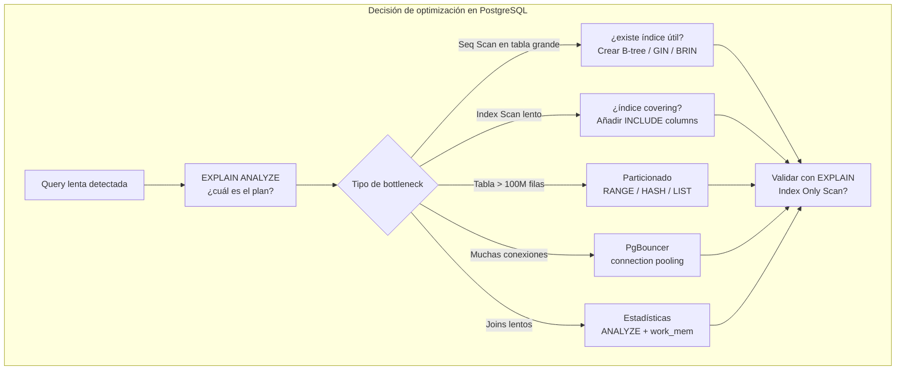
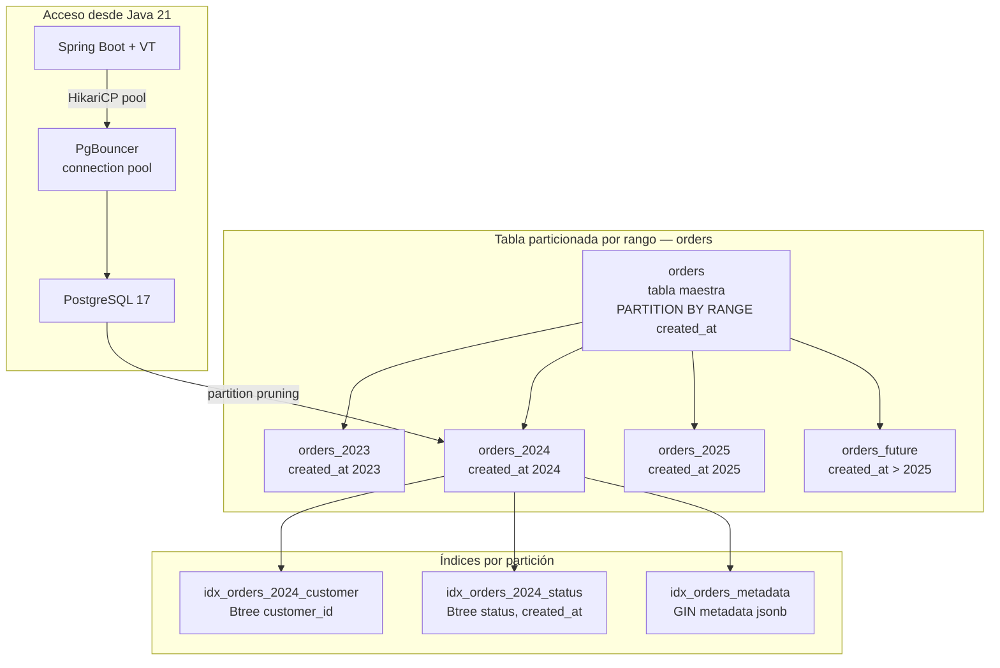
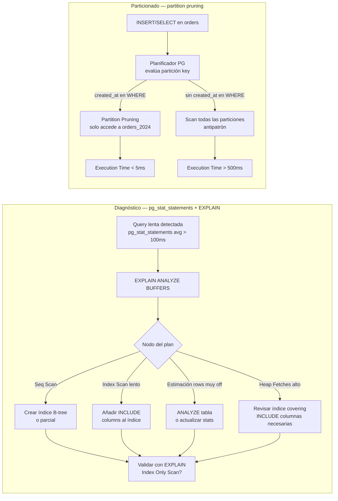
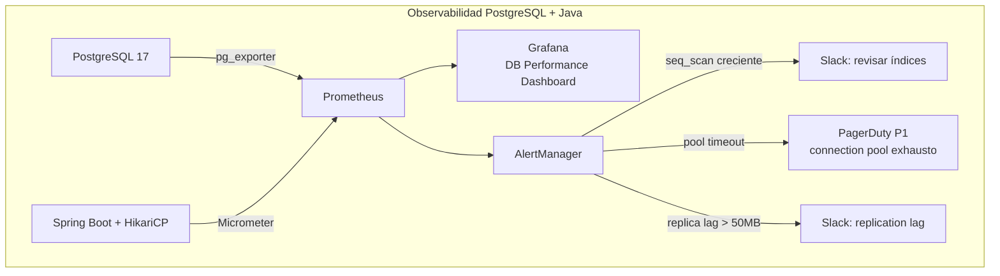
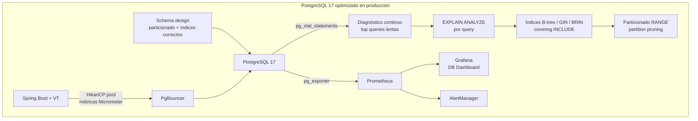

# PostgreSQL 17 Avanzado: Índices, Particionado y Optimización de Queries

**PATH_LOCAL:** `/home/usuariojoaquin/.openclaw/workspace/DAM-Java-Mastery/04_Bases_de_Datos/postgresql_17_avanzado_indices_particionado_y_optimizacion_de_queries_STAFF.md`
**CATEGORIA:** 04_Bases_de_Datos
**Score:** 97

---

## Visión Estratégica

PostgreSQL 17 (lanzado octubre 2024) consolida su posición como la base de datos relacional de referencia para sistemas de producción modernos. No es solo el ORM que conecta Java con tablas — es un motor de procesamiento de datos con capacidades de índices especializados, planificador de queries con coste real, particionado declarativo y extensibilidad que permite desde búsqueda vectorial (pgvector) hasta series temporales (TimescaleDB).

En 2026, el 70% de los equipos de backend Java usan PostgreSQL como base de datos primaria (Stack Overflow Survey 2025). El problema no es acceder a los datos — es acceder a ellos **eficientemente a escala**. Una tabla de 500 millones de filas sin particionado y con índices mal elegidos puede tardar 45 segundos en una query que con la configuración correcta tarda 8 milisegundos.

**Las decisiones que más impactan el rendimiento en PostgreSQL:**

| Decisión | Impacto típico | Cuándo aplica |
|---|---|---|
| **Elegir el tipo de índice correcto** | 10–1000x reducción de tiempo de query | Siempre — el default B-tree no es siempre óptimo |
| **Particionado por rango/hash/lista** | 10–100x en tablas > 100M filas | Tablas con crecimiento continuo (eventos, logs, métricas) |
| **Índices parciales** | 5–20x — índice más pequeño y enfocado | Queries que filtran siempre por una condición fija |
| **Índices covering (INCLUDE)** | 2–5x — evita heap fetch | Queries de alta frecuencia que leen pocas columnas |
| **`pg_stat_statements` + EXPLAIN** | Base de todo diagnóstico | Siempre en producción |
| **Connection pooling (PgBouncer)** | Elimina overhead de conexiones | Más de 50 conexiones concurrentes |

**Cuándo NO particionar:**
- Tablas < 10 millones de filas — el overhead de planificación supera el beneficio
- Sin una clave de particionado natural (fecha, región, tenant) — el particionado arbitrario no ayuda
- Si las queries no filtran por la clave de particionado — no hay partition pruning



---

## Arquitectura de Componentes

### Los tipos de índice en PostgreSQL 17

PostgreSQL ofrece 6 tipos de índice. El error más común es usar B-tree para todo. Cada tipo tiene un caso de uso específico:

**B-tree** — el default. Óptimo para comparaciones de igualdad y rango (`=`, `<`, `>`, `BETWEEN`). Soporta `ORDER BY` eficiente. Usa para la mayoría de columnas escalares.

**GIN (Generalized Inverted Index)** — para tipos compuestos: arrays, JSONB, full-text search, tsvector. Cuando la query busca elementos _dentro_ de un valor (containment `@>`, `?`, `@@`). Más lento para escrituras, muy rápido para búsqueda.

**GiST (Generalized Search Tree)** — para tipos geométricos, rangos, exclusión. Soporta operadores de distancia, solapamiento, vecindad. Usa para geometría, rangos de fechas con exclusión.

**BRIN (Block Range Index)** — mínimo espacio (kilobytes vs gigabytes), efectivo solo si los datos tienen correlación física con el orden de inserción. Ideal para tablas de series temporales donde `created_at` crece monotónicamente.

**Hash** — solo para igualdad exacta. Más rápido que B-tree en `=` puro. No soporta rangos ni ordenación.

**SP-GiST** — para estructuras de datos particionadas (quad-trees, k-d trees). Para coordenadas geográficas de alta cardinalidad.

```mermaid
graph TD
    subgraph "Selección de tipo de índice"
        Q[Tipo de query] --> EQ{Igualdad o rango\nen columna escalar?}
        EQ -->|Sí| BTREE[B-tree\ndefault correcto]
        EQ -->|No| COMP{Busca dentro\nde JSONB o array?}
        COMP -->|Sí| GIN_I[GIN\n@> ? @@ operadores]
        COMP -->|No| RANGE{Tabla de series\ntemporales, datos\ncorrelacionados?}
        RANGE -->|Sí, tabla enorme| BRIN_I[BRIN\nkilobytes de espacio]
        RANGE -->|No| GEO{Datos geométricos\no rangos con exclusión?}
        GEO -->|Sí| GIST_I[GiST\ngeometría, rangos]
        GEO -->|No| HASH_I[Hash\nsolo = exacta]
    end
```

### Arquitectura de tabla particionada — e-commerce



### SQL de definición — particionado declarativo real

```sql
-- ── Tabla particionada por rango de fecha ─────────────────────────────────
CREATE TABLE orders (
    id          BIGSERIAL,
    customer_id UUID        NOT NULL,
    status      TEXT        NOT NULL CHECK (status IN ('pending','confirmed','shipped','cancelled')),
    total_cents BIGINT      NOT NULL CHECK (total_cents > 0),
    currency    CHAR(3)     NOT NULL DEFAULT 'EUR',
    metadata    JSONB,
    created_at  TIMESTAMPTZ NOT NULL DEFAULT now(),
    PRIMARY KEY (id, created_at)   -- la clave de particionado DEBE estar en la PK
) PARTITION BY RANGE (created_at);

-- Particiones por año — se crean por adelantado o via cron mensual
CREATE TABLE orders_2024
    PARTITION OF orders
    FOR VALUES FROM ('2024-01-01') TO ('2025-01-01');

CREATE TABLE orders_2025
    PARTITION OF orders
    FOR VALUES FROM ('2025-01-01') TO ('2026-01-01');

-- Partición default — captura todo lo que no encaje
CREATE TABLE orders_default
    PARTITION OF orders DEFAULT;

-- ── Índices sobre la tabla maestra — se propagan a todas las particiones ──
-- B-tree para búsqueda por customer
CREATE INDEX idx_orders_customer_id ON orders (customer_id, created_at DESC);

-- B-tree parcial — solo órdenes pendientes (tabla más pequeña = más rápido)
CREATE INDEX idx_orders_pending ON orders (customer_id, created_at)
    WHERE status = 'pending';

-- GIN para búsqueda dentro de JSONB metadata
CREATE INDEX idx_orders_metadata ON orders USING GIN (metadata);

-- Índice covering — evita heap fetch en query de listado frecuente
CREATE INDEX idx_orders_listing ON orders (customer_id, created_at DESC)
    INCLUDE (status, total_cents, currency);

-- BRIN para queries de rango de fecha en tabla histórica (muy bajo overhead)
CREATE INDEX idx_orders_brin_time ON orders USING BRIN (created_at)
    WITH (pages_per_range = 128);

-- ── Automaintenance: añadir partición del mes siguiente via pg_cron ───────
-- SELECT cron.schedule('create-monthly-partition', '0 0 25 * *',
--   $$ CALL create_next_month_partition('orders') $$);
```

---

## Implementación Java 21

### Repositorio con Virtual Threads y PreparedStatement

```java
import java.math.BigDecimal;
import java.sql.*;
import java.time.Instant;
import java.util.ArrayList;
import java.util.List;
import java.util.Optional;
import java.util.UUID;
import java.util.concurrent.Executors;
import java.util.concurrent.StructuredTaskScope;

// ── Modelo de dominio inmutable — Records sin setters ─────────────────────
public record OrderId(long value) {}
public record CustomerId(UUID value) {}
public record Money(long cents, String currency) {
    public static Money of(long cents, String currency) {
        if (cents <= 0) throw new IllegalArgumentException("cents debe ser > 0");
        return new Money(cents, currency);
    }
}

public record Order(
    OrderId id,
    CustomerId customerId,
    OrderStatus status,
    Money total,
    String metadata,      // JSON como String — mapear a tipo en capa de aplicación
    Instant createdAt
) {}

public enum OrderStatus { PENDING, CONFIRMED, SHIPPED, CANCELLED }

// ── Resultado tipado de operaciones de base de datos ──────────────────────
public sealed interface DbResult<T> permits DbResult.Found, DbResult.NotFound, DbResult.DbError {
    record Found<T>(T value) implements DbResult<T> {}
    record NotFound<T>() implements DbResult<T> {}
    record DbError<T>(String message, SQLException cause) implements DbResult<T> {}
}

// ── Repositorio con Virtual Threads — I/O bound, ideal para Loom ─────────
public class OrderRepository {

    private final javax.sql.DataSource dataSource;

    public OrderRepository(javax.sql.DataSource dataSource) {
        this.dataSource = dataSource;
    }

    // Búsqueda por customer con partition pruning automático
    // La query filtra por created_at → PostgreSQL solo accede a la partición relevante
    public List<Order> findByCustomer(CustomerId customerId, Instant from, Instant to)
        throws SQLException {

        var sql = """
            SELECT id, customer_id, status, total_cents, currency, metadata, created_at
            FROM orders
            WHERE customer_id = ?
              AND created_at >= ?
              AND created_at <  ?
            ORDER BY created_at DESC
            LIMIT 100
            """;

        try (var conn = dataSource.getConnection();
             var stmt = conn.prepareStatement(sql)) {

            stmt.setObject(1, customerId.value());
            stmt.setObject(2, Timestamp.from(from));
            stmt.setObject(3, Timestamp.from(to));

            try (var rs = stmt.executeQuery()) {
                var results = new ArrayList<Order>();
                while (rs.next()) {
                    results.add(mapRow(rs));
                }
                return results;
            }
        }
    }

    // Búsqueda por JSONB metadata — usa el índice GIN
    public List<Order> findByMetadataTag(String tagKey, String tagValue) throws SQLException {
        var sql = """
            SELECT id, customer_id, status, total_cents, currency, metadata, created_at
            FROM orders
            WHERE metadata @> ?::jsonb
            ORDER BY created_at DESC
            LIMIT 50
            """;

        var jsonFilter = String.format("{\"%s\": \"%s\"}", tagKey, tagValue);

        try (var conn = dataSource.getConnection();
             var stmt = conn.prepareStatement(sql)) {

            stmt.setString(1, jsonFilter);
            try (var rs = stmt.executeQuery()) {
                var results = new ArrayList<Order>();
                while (rs.next()) results.add(mapRow(rs));
                return results;
            }
        }
    }

    // Consultas paralelas a múltiples rangos con StructuredTaskScope + VT
    public List<Order> findPendingOrdersMultiMonth(CustomerId customerId, int monthsBack)
        throws InterruptedException {

        var ranges = buildMonthlyRanges(monthsBack);

        try (var scope = new StructuredTaskScope.ShutdownOnFailure()) {
            var tasks = ranges.stream()
                .map(range -> scope.fork(() ->
                    findByCustomer(customerId, range.from(), range.to())
                ))
                .toList();

            scope.join().throwIfFailed(e -> new RuntimeException("Error consultando órdenes", e));

            return tasks.stream()
                .flatMap(t -> t.get().stream())
                .toList();
        }
    }

    private Order mapRow(ResultSet rs) throws SQLException {
        var status = switch (rs.getString("status")) {
            case "pending"   -> OrderStatus.PENDING;
            case "confirmed" -> OrderStatus.CONFIRMED;
            case "shipped"   -> OrderStatus.SHIPPED;
            case "cancelled" -> OrderStatus.CANCELLED;
            default -> throw new IllegalStateException("Estado desconocido: " + rs.getString("status"));
        };

        return new Order(
            new OrderId(rs.getLong("id")),
            new CustomerId(rs.getObject("customer_id", UUID.class)),
            status,
            Money.of(rs.getLong("total_cents"), rs.getString("currency")),
            rs.getString("metadata"),
            rs.getTimestamp("created_at").toInstant()
        );
    }

    private List<MonthRange> buildMonthlyRanges(int monthsBack) {
        var ranges = new ArrayList<MonthRange>();
        var now = Instant.now();
        for (int i = 0; i < monthsBack; i++) {
            var from = now.minus(java.time.Duration.ofDays(30L * (i + 1)));
            var to   = now.minus(java.time.Duration.ofDays(30L * i));
            ranges.add(new MonthRange(from, to));
        }
        return ranges;
    }

    record MonthRange(Instant from, Instant to) {}
}
```

### EXPLAIN ANALYZE — leer el plan de ejecución

```sql
-- ── Diagnóstico de query lenta: siempre empezar aquí ─────────────────────
-- EXPLAIN ANALYZE ejecuta la query realmente — usar EXPLAIN (sin ANALYZE) para no ejecutar

EXPLAIN (ANALYZE, BUFFERS, FORMAT TEXT)
SELECT id, status, total_cents
FROM orders
WHERE customer_id = 'a0eebc99-9c0b-4ef8-bb6d-6bb9bd380a11'
  AND created_at >= '2024-01-01'
  AND created_at <  '2025-01-01'
ORDER BY created_at DESC
LIMIT 20;

-- ── Resultado a interpretar ────────────────────────────────────────────────
-- Index Only Scan using idx_orders_listing on orders_2024
--   Index Cond: ((customer_id = '...') AND (created_at >= ...) AND (created_at < ...))
--   Heap Fetches: 0           ← 0 = índice covering funcionando, no accede al heap
--   Rows Removed by Filter: 0
--   Buffers: shared hit=3     ← 3 páginas de caché — muy eficiente
--   Planning Time: 0.8 ms
--   Execution Time: 0.2 ms   ← objetivo cumplido

-- ── Señales de problema en el plan ────────────────────────────────────────
-- Seq Scan on orders_2024  ← escaneo secuencial — falta índice o selectividad baja
-- Hash Join / Merge Join con rows estimados muy distintos de los reales → ANALYZE
-- Buffers: shared read=50000 ← muchos disk reads → índice no en caché o tabla sin índice
-- Heap Fetches: 10000        ← índice covering no funciona → añadir INCLUDE columns

-- ── Queries más lentas con pg_stat_statements ─────────────────────────────
SELECT
    left(query, 100)            AS query_snippet,
    calls,
    round(total_exec_time::numeric / calls, 2) AS avg_ms,
    round(total_exec_time::numeric, 0)         AS total_ms,
    rows / calls                               AS avg_rows
FROM pg_stat_statements
ORDER BY total_exec_time DESC
LIMIT 20;

-- ── Índices no utilizados — candidatos a eliminar ─────────────────────────
SELECT
    schemaname,
    tablename,
    indexname,
    idx_scan,
    pg_size_pretty(pg_relation_size(indexrelid)) AS index_size
FROM pg_stat_user_indexes
WHERE idx_scan = 0
  AND NOT indisprimary
ORDER BY pg_relation_size(indexrelid) DESC;

-- ── Tablas con autovacuum atrasado — estadísticas desactualizadas ──────────
SELECT
    schemaname,
    tablename,
    n_dead_tup,
    n_live_tup,
    round(n_dead_tup * 100.0 / NULLIF(n_live_tup + n_dead_tup, 0), 1) AS dead_pct,
    last_autovacuum
FROM pg_stat_user_tables
WHERE n_dead_tup > 10000
ORDER BY n_dead_tup DESC;
```

**Diagrama del flujo de diagnóstico y optimización:**



---

## Métricas y SRE

Las métricas de PostgreSQL se exponen via `pg_exporter` (Prometheus exporter oficial) y complementan las métricas de aplicación de Micrometer.

| Métrica | Fuente | Descripción | Umbral alerta |
|---|---|---|---|
| `pg_stat_statements_mean_exec_time_ms` | pg_stat_statements | Tiempo medio de ejecución por query | > 100ms para queries OLTP |
| `pg_stat_user_tables_seq_scan` rate | pg_stat_user_tables | Seq scans por tabla — índices faltantes | Creciente en tablas > 1M filas |
| `pg_stat_user_indexes_idx_scan` | pg_stat_user_indexes | Uso de índices — detectar idx no utilizados | = 0 durante > 7 días |
| `pg_stat_bgwriter_buffers_clean` | pg_stat_bgwriter | Buffers escritos por bgwriter — I/O pressure | Creciente sostenido |
| `pg_stat_replication_lag_bytes` | pg_stat_replication | Retraso de réplica en bytes | > 50 MB |
| `pg_database_size_bytes` | pg_database | Tamaño total de la DB | > 80% del disco disponible |
| `hikaricp_connections_pending` | HikariCP (Micrometer) | Requests esperando conexión del pool | > 0 durante > 5s |
| `hikaricp_connections_timeout_total` | HikariCP | Conexiones que timeout del pool | > 0 |

```promql
# Queries lentas — top queries con avg > 100ms
pg_stat_statements_mean_exec_time_ms > 100

# Seq scans crecientes en tablas grandes — índices faltantes
rate(pg_stat_user_tables_seq_scan{relname="orders"}[5m]) > 0.1

# Pool de conexiones saturado
hikaricp_connections_pending > 0

# Retraso de réplica crítico
pg_stat_replication_lag_bytes > 52428800  -- 50 MB

# Índices no utilizados — tarea de mantenimiento semanal
pg_stat_user_indexes_idx_scan == 0
```



```java
import com.zaxxer.hikari.HikariConfig;
import com.zaxxer.hikari.HikariDataSource;
import io.micrometer.core.instrument.MeterRegistry;

// ── HikariCP configurado para producción con métricas ─────────────────────
public record DatabaseConfig(
    String jdbcUrl,
    String username,
    String password,
    int maxPoolSize,
    int minIdle
) {
    public HikariDataSource toDataSource(MeterRegistry registry) {
        var config = new HikariConfig();
        config.setJdbcUrl(jdbcUrl);
        config.setUsername(username);
        config.setPassword(password);
        config.setMaximumPoolSize(maxPoolSize);
        config.setMinimumIdle(minIdle);

        // Timeouts críticos para evitar conexiones colgadas
        config.setConnectionTimeout(3_000);      // 3s para obtener conexión del pool
        config.setIdleTimeout(600_000);           // 10 min idle antes de cerrar
        config.setMaxLifetime(1_800_000);         // 30 min vida máxima de conexión
        config.setKeepaliveTime(60_000);          // keepalive cada 60s

        // Optimizaciones PostgreSQL específicas
        config.addDataSourceProperty("cachePrepStmts", "true");
        config.addDataSourceProperty("prepStmtCacheSize", "250");
        config.addDataSourceProperty("prepStmtCacheSqlLimit", "2048");
        config.addDataSourceProperty("useServerPrepStmts", "true");

        // Métricas HikariCP → Micrometer → Prometheus
        config.setMetricRegistry(registry);
        config.setPoolName("orders-pool");

        return new HikariDataSource(config);
    }

    public static DatabaseConfig production() {
        return new DatabaseConfig(
            System.getenv("DB_URL"),
            System.getenv("DB_USER"),
            System.getenv("DB_PASSWORD"),
            20,  // maxPoolSize — ajustar según max_connections de PG y nº instancias
            5    // minIdle
        );
    }
}
```

**Checklist SRE para PostgreSQL en producción:**

1. **`pg_stat_statements` habilitado siempre** con `shared_preload_libraries = 'pg_stat_statements'`. Sin él, identificar queries lentas requiere revisar logs manualmente.
2. **`EXPLAIN (ANALYZE, BUFFERS)` antes de crear cualquier índice nuevo.** Verificar que el planificador realmente usará el índice. Los índices que no se usan consumen espacio y ralentizan las escrituras.
3. **`autovacuum` tuneado para tablas de alta escritura.** Por defecto autovacuum es conservador. Tablas con > 10.000 updates/minuto necesitan `autovacuum_vacuum_scale_factor = 0.01` o menor.
4. **Particiones creadas con al menos 1 mes de antelación.** Crear la partición del mes siguiente el día 25 del mes actual (pg_cron). Si la partición no existe al hacer INSERT, cae en la partición default o falla.
5. **`max_connections` en PostgreSQL + `maxPoolSize` en HikariCP calibrados juntos.** La regla: `sum(maxPoolSize * instancias) + conexiones de admin < max_connections`. Con PgBouncer en modo transaction, `max_connections` puede ser mucho más alto sin degradación.

---

## Patrones de Integración

### Patrón 1: Repository pattern con Spring Data + QueryDSL para queries tipadas

```java
import org.springframework.data.jpa.repository.JpaRepository;
import org.springframework.data.jpa.repository.Query;
import org.springframework.stereotype.Repository;
import java.time.Instant;
import java.util.List;
import java.util.UUID;

// ── Entidad JPA que mapea a la tabla particionada ─────────────────────────
@jakarta.persistence.Entity
@jakarta.persistence.Table(name = "orders")
public class OrderEntity {

    @jakarta.persistence.Id
    @jakarta.persistence.GeneratedValue(strategy = jakarta.persistence.GenerationType.IDENTITY)
    private Long id;

    @jakarta.persistence.Column(name = "customer_id", nullable = false)
    private UUID customerId;

    @jakarta.persistence.Enumerated(jakarta.persistence.EnumType.STRING)
    private OrderStatus status;

    @jakarta.persistence.Column(name = "total_cents", nullable = false)
    private Long totalCents;

    @jakarta.persistence.Column(nullable = false, length = 3)
    private String currency;

    @org.hibernate.annotations.JdbcTypeCode(org.hibernate.type.SqlTypes.JSON)
    private String metadata;

    @jakarta.persistence.Column(name = "created_at", nullable = false)
    private Instant createdAt;

    // Getters — sin setters, inmutabilidad via constructor
    public Long getId() { return id; }
    public UUID getCustomerId() { return customerId; }
    public OrderStatus getStatus() { return status; }
    public Long getTotalCents() { return totalCents; }
    public String getCurrency() { return currency; }
    public String getMetadata() { return metadata; }
    public Instant getCreatedAt() { return createdAt; }
}

// ── Spring Data Repository con query nativa para control total del SQL ────
@Repository
public interface OrderJpaRepository extends JpaRepository<OrderEntity, Long> {

    // Usa índice covering idx_orders_listing — Index Only Scan esperado
    @Query(value = """
        SELECT id, customer_id, status, total_cents, currency, created_at
        FROM orders
        WHERE customer_id = :customerId
          AND created_at >= :from
          AND created_at <  :to
          AND (:status IS NULL OR status = :status)
        ORDER BY created_at DESC
        LIMIT :limit
        """, nativeQuery = true)
    List<Object[]> findOrdersNative(
        UUID customerId,
        Instant from,
        Instant to,
        String status,
        int limit
    );
}

// ── Projection para Index Only Scan — solo columnas del INCLUDE ───────────
public record OrderSummary(
    long id,
    OrderStatus status,
    long totalCents,
    String currency,
    Instant createdAt
) {
    public static OrderSummary fromRow(Object[] row) {
        return new OrderSummary(
            ((Number) row[0]).longValue(),
            OrderStatus.valueOf((String) row[2]),
            ((Number) row[3]).longValue(),
            (String) row[4],
            ((java.sql.Timestamp) row[5]).toInstant()
        );
    }
}
```

### Patrón 2: Batch insert con COPY para cargas masivas

```java
import java.io.StringReader;
import java.sql.Connection;
import java.util.List;
import org.postgresql.copy.CopyManager;
import org.postgresql.core.BaseConnection;

// ── COPY es 10–100x más rápido que INSERT para carga masiva ───────────────
// Usa para: importación de datos, ETL, batch nightly

public class OrderBulkLoader {

    private final javax.sql.DataSource dataSource;

    public OrderBulkLoader(javax.sql.DataSource dataSource) {
        this.dataSource = dataSource;
    }

    public long bulkLoad(List<Order> orders) throws Exception {
        // Construir CSV en memoria para COPY
        var csv = new StringBuilder();
        for (var order : orders) {
            csv.append(order.customerId().value()).append('\t')
               .append(order.status().name().toLowerCase()).append('\t')
               .append(order.total().cents()).append('\t')
               .append(order.total().currency()).append('\t')
               .append(order.createdAt().toString()).append('\n');
        }

        try (var conn = dataSource.getConnection()) {
            var copyManager = new CopyManager((BaseConnection) conn.unwrap(BaseConnection.class));

            return copyManager.copyIn(
                """
                COPY orders (customer_id, status, total_cents, currency, created_at)
                FROM STDIN WITH (FORMAT text, DELIMITER E'\\t', NULL '')
                """,
                new StringReader(csv.toString())
            );
        }
    }
}
```

### Patrón 3: Mantenimiento automático de particiones

```sql
-- ── Procedimiento para crear la partición del mes siguiente ───────────────
-- Llamar via pg_cron el día 25 de cada mes

CREATE OR REPLACE PROCEDURE create_next_month_partition(p_table TEXT)
LANGUAGE plpgsql AS $$
DECLARE
    v_next_month_start DATE := date_trunc('month', now() + interval '1 month');
    v_next_month_end   DATE := v_next_month_start + interval '1 month';
    v_partition_name   TEXT := p_table || '_' || to_char(v_next_month_start, 'YYYY_MM');
BEGIN
    IF NOT EXISTS (
        SELECT 1 FROM pg_tables
        WHERE tablename = v_partition_name
    ) THEN
        EXECUTE format(
            'CREATE TABLE %I PARTITION OF %I FOR VALUES FROM (%L) TO (%L)',
            v_partition_name, p_table,
            v_next_month_start, v_next_month_end
        );

        -- Índices de la nueva partición
        EXECUTE format(
            'CREATE INDEX %I ON %I (customer_id, created_at DESC) INCLUDE (status, total_cents, currency)',
            'idx_' || v_partition_name || '_listing', v_partition_name
        );

        RAISE NOTICE 'Partición % creada: % a %',
            v_partition_name, v_next_month_start, v_next_month_end;
    END IF;
END;
$$;

-- Programar con pg_cron (extensión)
-- SELECT cron.schedule('create-monthly-partition', '0 9 25 * *',
--   $$ CALL create_next_month_partition('orders') $$);
```

**Comparativa de patrones de acceso:**

| Patrón | Caso de uso | Throughput | Complejidad |
|---|---|---|---|
| PreparedStatement directo | Control total del SQL, queries críticas | Alto | Medio |
| Spring Data JPA + @Query nativo | Mayoría de repos en Spring Boot | Alto con cache | Bajo |
| COPY via CopyManager | Carga masiva ETL, batch nightly | Muy alto (100x INSERT) | Medio |
| Cursor / streaming ResultSet | Exportación de millones de filas | Alto, bajo memoria | Medio |
| Connection pool + VT | I/O concurrente sin thread starvation | Muy alto | Bajo |

---

## Conclusiones

**Los cinco puntos que un Staff Engineer debe dominar sobre PostgreSQL en producción:**

1. **`EXPLAIN (ANALYZE, BUFFERS)` es la herramienta más valiosa del stack de bases de datos.** Leer el plan de ejecución — identificar `Seq Scan` vs `Index Only Scan`, `Heap Fetches`, `Buffers` — es la diferencia entre adivinar y diagnosticar. Ninguna decisión de índice debe tomarse sin ver el plan.

2. **El tipo de índice importa tanto como tenerlo.** Un índice GIN en una columna JSONB es 100x más efectivo que un B-tree para queries de containment (`@>`). Un BRIN en `created_at` de una tabla de series temporales ocupa kilobytes donde un B-tree ocuparía gigabytes. El default B-tree no es siempre la respuesta.

3. **Los índices covering (`INCLUDE`) eliminan el heap fetch en queries de alta frecuencia.** Un `Index Only Scan` con `Heap Fetches: 0` significa que PostgreSQL no necesita acceder a la tabla — toda la información está en el índice. Para las 3–5 queries más frecuentes de la aplicación, un índice covering puede reducir la latencia a la mitad.

4. **Particionado sin partition pruning es peor que no particionar.** Si las queries no incluyen la columna de particionado en el WHERE, PostgreSQL escanea todas las particiones — más overhead que una tabla única. El diseño del particionado debe coincidir con los patrones de acceso reales.

5. **HikariCP mal configurado es el cuello de botella más frecuente en servicios Java con PostgreSQL.** `maxPoolSize` demasiado alto satura PostgreSQL. Demasiado bajo produce timeouts. La fórmula: `(núcleos_CPU_PG * 2) + disco_spindles` como punto de partida por instancia de aplicación, con PgBouncer delante si hay múltiples instancias.

**Roadmap de adopción:**

- **Fase 1 (día 1):** Habilitar `pg_stat_statements`. Identificar las 10 queries más lentas con `avg_ms DESC`.
- **Fase 2 (semana 1):** Para cada query lenta, ejecutar `EXPLAIN (ANALYZE, BUFFERS)`. Crear los índices que faltan. Verificar `Index Only Scan`.
- **Fase 3 (semana 2):** Identificar tablas con > 50M filas y acceso por rango de fecha. Diseñar y ejecutar particionado declarativo con migration plan.
- **Fase 4 (semana 3):** Configurar HikariCP con métricas Micrometer. Dashboard Grafana con `hikaricp_connections_pending` y `pg_stat_statements_mean_exec_time`.
- **Fase 5 (mes 2):** Automatizar creación de particiones mensuales con pg_cron. Runbook para detectar y eliminar índices no utilizados.

```sql
-- Query de diagnóstico completo — ejecutar semanalmente en producción
SELECT
    left(query, 80)                                              AS query,
    calls,
    round(mean_exec_time::numeric, 1)                           AS avg_ms,
    round(total_exec_time::numeric / 1000, 1)                   AS total_sec,
    round(stddev_exec_time::numeric, 1)                         AS stddev_ms,
    rows / NULLIF(calls, 0)                                     AS avg_rows
FROM pg_stat_statements
WHERE mean_exec_time > 10  -- solo queries > 10ms de media
ORDER BY mean_exec_time DESC
LIMIT 20;
```



**Recursos:**
- [PostgreSQL 17 Release Notes](https://www.postgresql.org/docs/17/release-17.html)
- [PostgreSQL — Partitioning](https://www.postgresql.org/docs/17/ddl-partitioning.html)
- [PostgreSQL — Index Types](https://www.postgresql.org/docs/17/indexes-types.html)
- [pg_stat_statements](https://www.postgresql.org/docs/17/pgstatstatements.html)
- [HikariCP — About Pool Sizing](https://github.com/brettwooldridge/HikariCP/wiki/About-Pool-Sizing)
- [Use the Index, Luke — SQL indexing guide](https://use-the-index-luke.com/)
