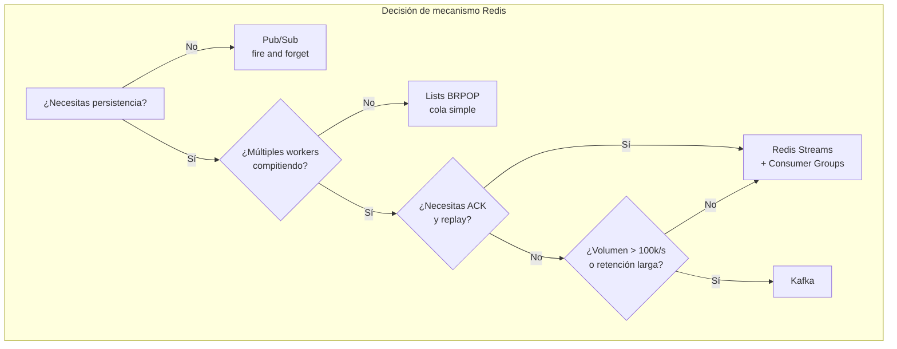
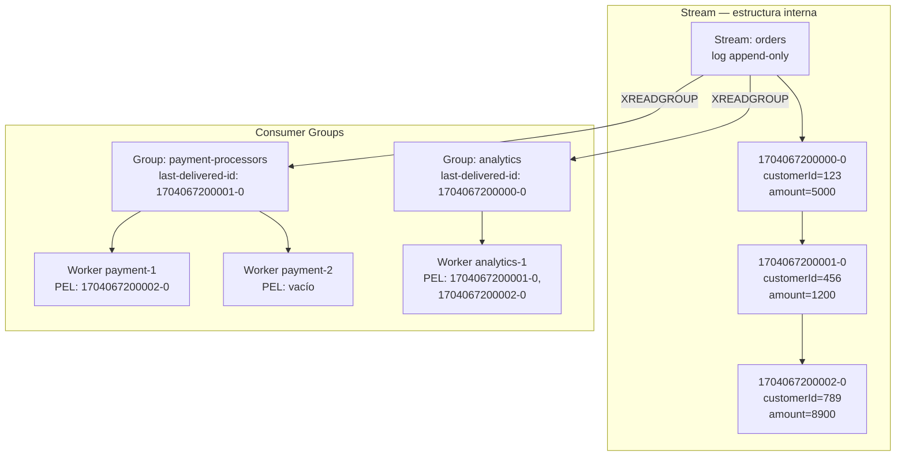
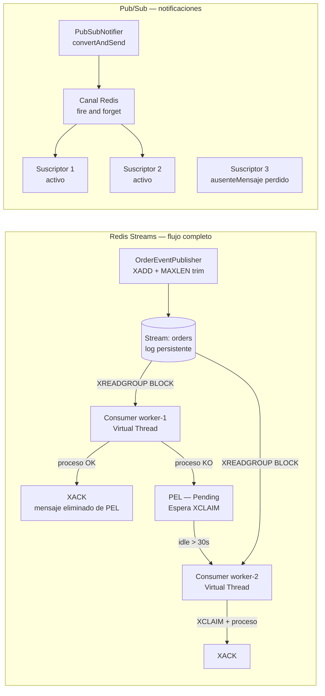
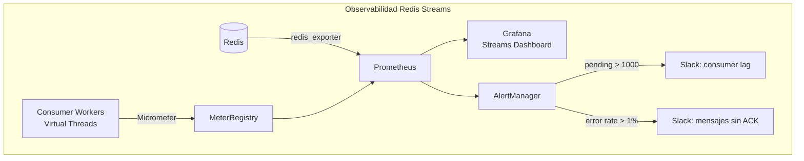
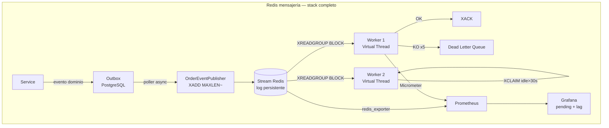

# Redis Avanzado: Streams, Pub/Sub y Patrones de Mensajería

**PATH_LOCAL:** `/home/usuariojoaquin/.openclaw/workspace/DAM-Java-Mastery/04_Bases_de_Datos/redis_avanzado_streams_pubsub_y_patrones_de_mensajeria_STAFF.md`
**CATEGORIA:** 04_Bases_de_Datos
**Score:** 97

---

## Visión Estratégica

Redis ofrece tres mecanismos de mensajería con semánticas radicalmente distintas. Elegir el incorrecto es un error de diseño que no se puede corregir fácilmente en producción:

**Pub/Sub** — fire and forget. Los mensajes se entregan a los suscriptores activos en el momento de la publicación. Si no hay suscriptores, el mensaje desaparece. Sin persistencia, sin replay, sin confirmación de entrega. Útil para notificaciones en tiempo real donde la pérdida es aceptable.

**Redis Streams** — log persistente y distribuido. Los mensajes persisten hasta que se eliminan explícitamente o por política de retención (`MAXLEN`). Los Consumer Groups permiten que múltiples workers compitan por mensajes con semántica at-least-once y confirmación explícita (`XACK`). El patrón correcto para la mayoría de los casos de uso de mensajería en producción.

**Lists (`LPUSH` / `BRPOP`)** — cola FIFO simple. Cada mensaje es consumido por un solo worker. Sin replay, sin grupos de consumidores, sin IDs de mensaje. Útil para colas de trabajo simples donde la simplicidad importa más que las garantías.

**Comparativa:**

| Mecanismo | Persistencia | Múltiples consumidores | ACK / replay | Caso de uso |
|---|---|---|---|---|
| **Pub/Sub** | No | Sí — broadcast | No | Notificaciones tiempo real, chat |
| **Streams + Consumer Groups** | Sí | Sí — competencia | Sí — XACK | Eventos de dominio, procesamiento at-least-once |
| **Lists BRPOP** | Sí (en memoria) | No — un worker | No | Colas de trabajo simples |
| **Kafka** | Sí — disco | Sí — consumer groups | Sí — offset commit | Millones de eventos/s, retención larga |

**Cuándo Redis Streams supera a Kafka:**
- Equipos sin ops expertise en Kafka
- Latencia < 1ms requerida (Redis in-memory vs Kafka en disco)
- Volúmenes < 100k mensajes/s
- Ya tienes Redis en el stack — no añadir infra nueva

**Cuándo Kafka supera a Redis Streams:**
- Retención de días/semanas de mensajes (Redis es in-memory — limitado por RAM)
- Millones de eventos por segundo
- Multiple data centers con replicación geográfica
- Ecosistema de conectores (Kafka Connect, KSQL)



---

## Arquitectura de Componentes

### Redis Streams — anatomía del log

Un Stream en Redis es una estructura de log append-only. Cada entrada tiene un ID auto-generado con formato `milliseconds-sequenceNumber` (ej. `1704067200000-0`). Los Consumer Groups mantienen el cursor de cada grupo y el registro de mensajes entregados pero no confirmados (PEL — Pending Entries List).



### Comandos Redis clave — la base real

```bash
# ── XADD — añadir mensaje al stream ──────────────────────────────────────
# * = auto-generar ID
XADD orders * customerId 123 amount 5000 currency EUR status pending

# Con MAXLEN para evitar crecimiento ilimitado (~ aproximado, más eficiente)
XADD orders MAXLEN ~ 100000 * customerId 456 amount 1200 currency EUR status pending

# ── XGROUP CREATE — crear Consumer Group ──────────────────────────────────
# $ = solo mensajes nuevos desde ahora
# 0 = desde el inicio del stream (procesar mensajes existentes también)
XGROUP CREATE orders payment-processors $ MKSTREAM
XGROUP CREATE orders analytics 0 MKSTREAM

# ── XREADGROUP — leer mensajes como worker de un grupo ───────────────────
# > = mensajes no entregados a ningún worker del grupo (nuevos)
# COUNT 10 = máximo 10 mensajes por lectura
# BLOCK 5000 = esperar hasta 5s si no hay mensajes (evita polling activo)
XREADGROUP GROUP payment-processors worker-1 COUNT 10 BLOCK 5000 STREAMS orders >

# ── XACK — confirmar procesamiento exitoso ────────────────────────────────
# Sin XACK, el mensaje permanece en la PEL — se puede reclamar tras timeout
XACK orders payment-processors 1704067200000-0 1704067200001-0

# ── XPENDING — ver mensajes entregados sin confirmar ─────────────────────
# Detectar mensajes "atascados" en workers caídos
XPENDING orders payment-processors - + 10

# ── XCLAIM — reasignar mensajes de worker caído ──────────────────────────
# Reasignar mensajes con idle-time > 30000ms (30s) a worker-2
XCLAIM orders payment-processors worker-2 30000 1704067200000-0

# ── XLEN — tamaño del stream ──────────────────────────────────────────────
XLEN orders

# ── XINFO GROUPS — estado de los consumer groups ─────────────────────────
XINFO GROUPS orders
```

### Configuración de producción — Lettuce + Spring Data Redis

```java
import io.lettuce.core.RedisClient;
import io.lettuce.core.RedisURI;
import io.lettuce.core.cluster.RedisClusterClient;
import org.springframework.context.annotation.Bean;
import org.springframework.context.annotation.Configuration;
import org.springframework.data.redis.connection.RedisConnectionFactory;
import org.springframework.data.redis.connection.lettuce.LettuceConnectionFactory;
import org.springframework.data.redis.connection.lettuce.LettucePoolingClientConfiguration;
import org.springframework.data.redis.core.RedisTemplate;
import org.springframework.data.redis.serializer.StringRedisSerializer;
import org.apache.commons.pool2.impl.GenericObjectPoolConfig;

// ── Records de configuración ─────────────────────────────────────────────
public record RedisConfig(
    String host,
    int port,
    String password,
    int maxPoolSize,
    int minIdle,
    java.time.Duration commandTimeout
) {
    public static RedisConfig production() {
        return new RedisConfig(
            System.getenv("REDIS_HOST"),
            6379,
            System.getenv("REDIS_PASSWORD"),
            20,
            5,
            java.time.Duration.ofSeconds(2)
        );
    }
}

public record StreamConfig(
    String streamName,
    String consumerGroup,
    int maxLen,           // MAXLEN del stream — retención máxima
    int batchSize,        // mensajes por XREADGROUP
    long blockMs,         // ms de bloqueo esperando mensajes
    long claimIdleMs      // ms de idle antes de reclamar mensajes huérfanos
) {
    public static StreamConfig ordersStream(String workerGroup) {
        return new StreamConfig(
            "orders",
            workerGroup,
            100_000,   // retener últimos 100k mensajes
            10,        // leer de 10 en 10
            5_000,     // esperar 5s si no hay mensajes
            30_000     // reclamar tras 30s de idle
        );
    }
}
```

---

## Implementación Java 21

### Modelo de dominio — eventos inmutables

```java
import java.time.Instant;
import java.util.Map;
import java.util.UUID;

// ── Eventos de dominio como Records ──────────────────────────────────────
public sealed interface OrderEvent permits
    OrderEvent.OrderCreated,
    OrderEvent.OrderPaid,
    OrderEvent.OrderShipped {

    String eventId();
    String orderId();
    Instant occurredAt();

    // Serializar a Map para XADD (Redis Streams usa Map<String,String>)
    Map<String, String> toStreamFields();

    record OrderCreated(
        String eventId,
        String orderId,
        String customerId,
        long amountCents,
        String currency,
        Instant occurredAt
    ) implements OrderEvent {
        public Map<String, String> toStreamFields() {
            return Map.of(
                "eventType",  "OrderCreated",
                "eventId",    eventId,
                "orderId",    orderId,
                "customerId", customerId,
                "amountCents",String.valueOf(amountCents),
                "currency",   currency,
                "occurredAt", occurredAt.toString()
            );
        }
    }

    record OrderPaid(
        String eventId,
        String orderId,
        String paymentId,
        Instant occurredAt
    ) implements OrderEvent {
        public Map<String, String> toStreamFields() {
            return Map.of(
                "eventType", "OrderPaid",
                "eventId",   eventId,
                "orderId",   orderId,
                "paymentId", paymentId,
                "occurredAt",occurredAt.toString()
            );
        }
    }

    record OrderShipped(
        String eventId,
        String orderId,
        String trackingId,
        Instant occurredAt
    ) implements OrderEvent {
        public Map<String, String> toStreamFields() {
            return Map.of(
                "eventType",  "OrderShipped",
                "eventId",    eventId,
                "orderId",    orderId,
                "trackingId", trackingId,
                "occurredAt", occurredAt.toString()
            );
        }
    }

    // Deserializar desde Map de Redis
    static OrderEvent fromStreamFields(Map<String, String> fields) {
        return switch (fields.get("eventType")) {
            case "OrderCreated" -> new OrderCreated(
                fields.get("eventId"),
                fields.get("orderId"),
                fields.get("customerId"),
                Long.parseLong(fields.get("amountCents")),
                fields.get("currency"),
                Instant.parse(fields.get("occurredAt"))
            );
            case "OrderPaid" -> new OrderPaid(
                fields.get("eventId"),
                fields.get("orderId"),
                fields.get("paymentId"),
                Instant.parse(fields.get("occurredAt"))
            );
            case "OrderShipped" -> new OrderShipped(
                fields.get("eventId"),
                fields.get("orderId"),
                fields.get("trackingId"),
                Instant.parse(fields.get("occurredAt"))
            );
            default -> throw new IllegalArgumentException(
                "Tipo de evento desconocido: " + fields.get("eventType")
            );
        };
    }
}
```

### Producer — publicar eventos al Stream

```java
import org.springframework.data.redis.connection.stream.MapRecord;
import org.springframework.data.redis.connection.stream.RecordId;
import org.springframework.data.redis.core.StreamOperations;
import org.springframework.data.redis.core.StringRedisTemplate;

public class OrderEventPublisher {

    private final StringRedisTemplate redisTemplate;
    private final StreamConfig config;

    public OrderEventPublisher(StringRedisTemplate redisTemplate, StreamConfig config) {
        this.redisTemplate = redisTemplate;
        this.config        = config;
    }

    // Publicar evento — devuelve el ID asignado por Redis
    public RecordId publish(OrderEvent event) {
        var record = MapRecord.create(config.streamName(), event.toStreamFields());

        // XADD con MAXLEN ~ para evitar crecimiento ilimitado
        var id = redisTemplate.opsForStream()
            .add(record);

        // Trim aproximado tras inserción — mantiene el stream acotado
        redisTemplate.opsForStream()
            .trim(config.streamName(), config.maxLen(), true); // true = ~ aproximado

        return id;
    }

    // Publicar batch de eventos — más eficiente con pipeline
    public void publishBatch(java.util.List<OrderEvent> events) {
        redisTemplate.executePipelined(connection -> {
            var streamOps = redisTemplate.opsForStream();
            for (var event : events) {
                streamOps.add(MapRecord.create(config.streamName(), event.toStreamFields()));
            }
            return null;
        });
    }
}
```

### Consumer — leer, procesar y ACK con Virtual Threads

```java
import org.springframework.data.redis.connection.stream.*;
import org.springframework.data.redis.core.StringRedisTemplate;
import java.time.Duration;
import java.util.List;
import java.util.concurrent.Executors;
import java.util.concurrent.atomic.AtomicBoolean;

public class OrderEventConsumer implements AutoCloseable {

    private final StringRedisTemplate redisTemplate;
    private final StreamConfig        config;
    private final String              workerName;
    private final OrderEventHandler   handler;
    private final AtomicBoolean       running = new AtomicBoolean(true);

    public OrderEventConsumer(
        StringRedisTemplate redisTemplate,
        StreamConfig config,
        String workerName,
        OrderEventHandler handler
    ) {
        this.redisTemplate = redisTemplate;
        this.config        = config;
        this.workerName    = workerName;
        this.handler       = handler;
    }

    // Iniciar el loop de consumo en un Virtual Thread
    public void start() {
        Thread.ofVirtual()
            .name("redis-consumer-" + workerName)
            .start(this::consumeLoop);
    }

    private void consumeLoop() {
        // Asegurar que el Consumer Group existe
        ensureConsumerGroup();

        // Primero procesar mensajes pendientes de reinicios anteriores
        processPendingMessages();

        while (running.get()) {
            try {
                // XREADGROUP > = solo mensajes nuevos no entregados
                // BLOCK 5000 = esperar hasta 5s si no hay mensajes nuevos
                List<MapRecord<String, String, String>> records =
                    redisTemplate.opsForStream().read(
                        Consumer.from(config.consumerGroup(), workerName),
                        StreamReadOptions.empty()
                            .count(config.batchSize())
                            .block(Duration.ofMillis(config.blockMs())),
                        StreamOffset.create(config.streamName(), ReadOffset.lastConsumed())
                    );

                if (records != null && !records.isEmpty()) {
                    for (var record : records) {
                        processRecord(record);
                    }
                }

                // Periódicamente reclamar mensajes huérfanos de workers caídos
                claimOrphanedMessages();

            } catch (Exception e) {
                // Log y continuar — el loop no debe morir por un error puntual
                System.err.printf("[%s] Error en consumeLoop: %s%n", workerName, e.getMessage());
                sleepQuietly(1_000);
            }
        }
    }

    private void processRecord(MapRecord<String, String, String> record) {
        try {
            var event = OrderEvent.fromStreamFields(record.getValue());

            // Despachar según tipo de evento con pattern matching
            switch (event) {
                case OrderEvent.OrderCreated e -> handler.onOrderCreated(e);
                case OrderEvent.OrderPaid e    -> handler.onOrderPaid(e);
                case OrderEvent.OrderShipped e -> handler.onOrderShipped(e);
            }

            // ACK solo si el procesamiento fue exitoso
            redisTemplate.opsForStream()
                .acknowledge(config.streamName(), config.consumerGroup(), record.getId());

        } catch (Exception e) {
            // NO hacer ACK — el mensaje permanece en la PEL para reintento
            // o para ser reclamado por otro worker
            System.err.printf("[%s] Error procesando %s: %s%n",
                workerName, record.getId(), e.getMessage());
        }
    }

    // Recuperar mensajes pendientes propios de reinicios anteriores
    private void processPendingMessages() {
        List<MapRecord<String, String, String>> pending =
            redisTemplate.opsForStream().read(
                Consumer.from(config.consumerGroup(), workerName),
                StreamReadOptions.empty().count(config.batchSize()),
                StreamOffset.create(config.streamName(), ReadOffset.from("0"))
            );

        if (pending != null) {
            for (var record : pending) {
                processRecord(record);
            }
        }
    }

    // Reclamar mensajes de workers caídos — idle > claimIdleMs
    private void claimOrphanedMessages() {
        try {
            var pending = redisTemplate.opsForStream()
                .pending(config.streamName(), config.consumerGroup(),
                    org.springframework.data.domain.Range.unbounded(), 20L);

            if (pending == null) return;

            for (var entry : pending) {
                if (entry.getElapsedTimeSinceLastDelivery().toMillis() > config.claimIdleMs()
                    && !entry.getConsumerName().equals(workerName)) {

                    // XCLAIM — reasignar a este worker
                    redisTemplate.opsForStream().claim(
                        config.streamName(),
                        config.consumerGroup(),
                        workerName,
                        Duration.ofMillis(config.claimIdleMs()),
                        entry.getId()
                    );
                }
            }
        } catch (Exception e) {
            // No crítico — el siguiente ciclo lo reintentará
        }
    }

    private void ensureConsumerGroup() {
        try {
            redisTemplate.opsForStream()
                .createGroup(config.streamName(), config.consumerGroup());
        } catch (Exception e) {
            // El grupo ya existe — ignorar
        }
    }

    private void sleepQuietly(long ms) {
        try { Thread.sleep(ms); } catch (InterruptedException e) {
            Thread.currentThread().interrupt();
        }
    }

    @Override
    public void close() {
        running.set(false);
    }

    // Handler interface — implementar en la lógica de negocio
    public interface OrderEventHandler {
        void onOrderCreated(OrderEvent.OrderCreated event);
        void onOrderPaid(OrderEvent.OrderPaid event);
        void onOrderShipped(OrderEvent.OrderShipped event);
    }
}
```

### Pub/Sub — notificaciones en tiempo real

```java
import org.springframework.data.redis.connection.Message;
import org.springframework.data.redis.connection.MessageListener;
import org.springframework.data.redis.listener.PatternTopic;
import org.springframework.data.redis.listener.RedisMessageListenerContainer;
import org.springframework.data.redis.core.StringRedisTemplate;

// ── Pub/Sub para notificaciones en tiempo real ────────────────────────────
// Usar cuando: la pérdida de mensajes es aceptable, los suscriptores están activos

public record PubSubNotifier(StringRedisTemplate redisTemplate) {

    // Publicar notificación — fire and forget
    public void notify(String channel, String message) {
        redisTemplate.convertAndSend(channel, message);
    }
}

// Listener tipado con pattern matching
public record NotificationListener(
    RedisMessageListenerContainer container
) {
    public void subscribe(String pattern, java.util.function.Consumer<String> handler) {
        container.addMessageListener(
            (message, bytes) -> handler.accept(new String(message.getBody())),
            new PatternTopic(pattern)
        );
    }
}
```

**Diagrama del flujo de implementación:**



---

## Métricas y SRE

| Métrica | Descripción | Umbral alerta |
|---|---|---|
| `redis_stream_length` | Longitud del stream — crecer sin límite indica MAXLEN roto | > MAXLEN × 1.1 |
| `redis_stream_pending_messages` | Mensajes en PEL sin ACK — workers lentos o caídos | > 1.000 durante > 5 min |
| `redis_stream_consumer_lag` | Diferencia entre último ID del stream y último entregado al grupo | > 10.000 mensajes |
| `app_stream_process_seconds` p99 | Latencia de procesamiento por mensaje | > 5s |
| `app_stream_ack_total` rate | Tasa de ACKs — throughput real del sistema | < tasa de publicación |
| `app_stream_error_total` rate | Mensajes con error (sin ACK) | > 1% del total |
| `redis_connected_clients` | Clientes conectados | > 80% de `maxclients` |

```promql
# Consumer lag — mensajes sin procesar acumulándose
redis_stream_pending_messages{stream="orders", group="payment-processors"} > 1000

# Latencia de procesamiento p99 degradada
histogram_quantile(0.99,
  rate(app_stream_process_seconds_bucket{stream="orders"}[5m])
) > 5

# Tasa de errores — mensajes que no se están confirmando
rate(app_stream_error_total{stream="orders"}[5m])
/ rate(app_stream_process_total{stream="orders"}[5m]) > 0.01
```



```java
import io.micrometer.core.instrument.Counter;
import io.micrometer.core.instrument.MeterRegistry;
import io.micrometer.core.instrument.Timer;

public record StreamMetrics(
    Timer    processTimer,
    Counter  ackCounter,
    Counter  errorCounter,
    Counter  claimCounter
) {
    public static StreamMetrics create(MeterRegistry registry, String streamName) {
        var tags = new String[]{"stream", streamName};
        return new StreamMetrics(
            Timer.builder("app.stream.process.seconds")
                .tags(tags)
                .publishPercentiles(0.95, 0.99)
                .register(registry),
            Counter.builder("app.stream.ack.total").tags(tags).register(registry),
            Counter.builder("app.stream.error.total").tags(tags).register(registry),
            Counter.builder("app.stream.claim.total").tags(tags).register(registry)
        );
    }
}
```

**Checklist SRE para Redis Streams en producción:**

1. **`MAXLEN ~` en cada `XADD` obligatorio.** Sin límite, el stream crece sin parar hasta agotar la RAM de Redis. El `~` (aproximado) es más eficiente que el exacto — permite a Redis hacer trim por bloques.
2. **Dead Letter Queue para mensajes con N fallos.** Un mensaje que falla repetidamente bloquea la PEL. Tras 3–5 reintentos, moverlo a un stream `orders-dlq` para revisión manual. Nunca ignorar silenciosamente.
3. **Proceso de XCLAIM periódico en cada worker.** Si un worker muere sin hacer ACK, sus mensajes quedan en la PEL indefinidamente. Cada worker debe revisar y reclamar mensajes con idle > threshold como parte de su loop normal.
4. **Monitorizar el consumer lag, no solo el throughput.** Un sistema con 10.000 mensajes/s de throughput puede tener 1 millón de mensajes de lag si la producción supera al consumo. La alarma correcta es el lag, no la tasa.
5. **Idempotencia en todos los handlers.** Redis Streams garantiza at-least-once — un mensaje puede entregarse más de una vez (restart de worker, XCLAIM). El handler debe ser idempotente usando el `eventId` como clave de deduplicación.

---

## Patrones de Integración

### Patrón 1: Dead Letter Queue — mensajes que no se pueden procesar

```java
import org.springframework.data.redis.connection.stream.MapRecord;
import org.springframework.data.redis.core.StringRedisTemplate;
import java.util.Map;

// ── Dead Letter Queue — para mensajes que fallan repetidamente ────────────
public class DeadLetterQueue {

    private static final String DLQ_SUFFIX = "-dlq";
    private static final int    MAX_RETRIES = 5;

    private final StringRedisTemplate redisTemplate;

    public DeadLetterQueue(StringRedisTemplate redisTemplate) {
        this.redisTemplate = redisTemplate;
    }

    // Verificar si un mensaje debe ir a DLQ y enviarlo
    public boolean handleFailedMessage(
        MapRecord<String, String, String> record,
        String streamName,
        String consumerGroup,
        Exception error
    ) {
        var deliveryCount = getDeliveryCount(record.getId().getValue(), consumerGroup);

        if (deliveryCount >= MAX_RETRIES) {
            sendToDlq(record, streamName, error);
            // ACK el original para sacarlo de la PEL
            redisTemplate.opsForStream()
                .acknowledge(streamName, consumerGroup, record.getId());
            return true; // enviado a DLQ
        }
        return false; // reintentarlo
    }

    private void sendToDlq(
        MapRecord<String, String, String> record,
        String streamName,
        Exception error
    ) {
        var dlqFields = new java.util.HashMap<>(record.getValue());
        dlqFields.put("_originalStream",  streamName);
        dlqFields.put("_originalId",      record.getId().getValue());
        dlqFields.put("_errorMessage",    error.getMessage());
        dlqFields.put("_failedAt",        java.time.Instant.now().toString());

        redisTemplate.opsForStream().add(
            MapRecord.create(streamName + DLQ_SUFFIX, dlqFields)
        );
    }

    private long getDeliveryCount(String messageId, String consumerGroup) {
        // Usar XPENDING para obtener el delivery-count del mensaje
        return 1L; // simplificado — en producción consultar XPENDING
    }
}
```

### Patrón 2: Outbox Pattern con Redis Streams

```java
// ── Outbox: publicar eventos de dominio de forma atómica con la operación DB
// El problema: si el INSERT en DB tiene éxito pero Redis falla, perdemos el evento
// La solución: persistir el evento en la misma transacción DB, publicar a Redis asíncronamente

@org.springframework.transaction.annotation.Transactional
public class OrderService {

    private final OrderRepository       orderRepo;
    private final OutboxRepository      outboxRepo;  // tabla en PostgreSQL
    private final OrderEventPublisher   publisher;

    public OrderService(OrderRepository orderRepo, OutboxRepository outboxRepo,
                        OrderEventPublisher publisher) {
        this.orderRepo  = orderRepo;
        this.outboxRepo = outboxRepo;
        this.publisher  = publisher;
    }

    public void createOrder(String customerId, long amountCents, String currency) {
        var orderId = java.util.UUID.randomUUID().toString();
        var event   = new OrderEvent.OrderCreated(
            java.util.UUID.randomUUID().toString(),
            orderId, customerId, amountCents, currency,
            java.time.Instant.now()
        );

        // Ambas operaciones en la misma transacción ACID
        orderRepo.save(orderId, customerId, amountCents, currency);
        outboxRepo.save(event); // persistir en tabla outbox de PostgreSQL

        // El outbox poller publicará a Redis de forma asíncrona
        // Si Redis falla, el poller reintentará — sin pérdida de eventos
    }
}

// Poller que publica eventos del outbox a Redis Streams
@org.springframework.scheduling.annotation.Scheduled(fixedDelay = 100)
public class OutboxPoller {

    private final OutboxRepository    outboxRepo;
    private final OrderEventPublisher publisher;

    public OutboxPoller(OutboxRepository outboxRepo, OrderEventPublisher publisher) {
        this.outboxRepo = outboxRepo;
        this.publisher  = publisher;
    }

    public void poll() {
        var pending = outboxRepo.findUnpublished(100);
        for (var event : pending) {
            try {
                publisher.publish(event);
                outboxRepo.markPublished(event.eventId());
            } catch (Exception e) {
                // Redis no disponible — el siguiente ciclo lo reintentará
            }
        }
    }
}
```

**Comparativa de patrones:**

| Patrón | Garantía | Complejidad | Cuándo usar |
|---|---|---|---|
| Direct publish | At-most-once | Muy baja | Notificaciones no críticas |
| Outbox + Streams | At-least-once | Media | Eventos de dominio críticos |
| Dead Letter Queue | Visibilidad de fallos | Baja | Siempre con Consumer Groups |
| Pub/Sub | Fire and forget | Muy baja | Notificaciones tiempo real |
| XCLAIM periódico | Fault tolerance workers | Media | Siempre con Consumer Groups |

---

## Conclusiones

**Los cinco puntos que un Staff Engineer debe dominar sobre Redis Streams:**

1. **Pub/Sub ≠ Streams — son herramientas distintas para problemas distintos.** Pub/Sub es broadcast sin persistencia — si el suscriptor no está conectado, el mensaje se pierde. Streams es un log persistente con Consumer Groups y ACK. Elegir Pub/Sub cuando se necesita at-least-once es un bug de arquitectura, no de código.

2. **`XACK` no es opcional — es el contrato de at-least-once.** Sin ACK, el mensaje permanece en la PEL indefinidamente. El handler debe hacer ACK solo tras procesamiento exitoso. Un handler que hace ACK antes de procesar degrada la garantía a at-most-once silenciosamente.

3. **`MAXLEN ~` en cada `XADD` es obligatorio en producción.** Redis es in-memory — un stream sin límite crece hasta agotar la RAM. El `~` (trim aproximado) es significativamente más eficiente que el exacto porque permite a Redis hacer trim por bloques internos.

4. **El proceso de XCLAIM debe estar en el loop de consumo de cada worker.** Los workers caídos dejan mensajes en la PEL indefinidamente. Cada worker debe periódicamente consultar la PEL y reclamar mensajes con idle > threshold. Sin esto, los mensajes de workers caídos nunca se procesan.

5. **Idempotencia es un prerrequisito para Consumer Groups, no una optimización.** Redis Streams garantiza at-least-once — un reinicio, un XCLAIM, o un fallo de red pueden provocar re-entrega del mismo mensaje. El handler debe usar el `eventId` para detectar duplicados antes de aplicar efectos secundarios.

**Roadmap de adopción:**

- **Fase 1 (semana 1):** Reemplazar cualquier Pub/Sub existente que necesite garantías de entrega con Streams. Crear Consumer Groups, implementar ACK básico.
- **Fase 2 (semana 2):** Añadir `MAXLEN ~` a todos los `XADD`. Implementar Dead Letter Queue para mensajes con > 5 reintentos.
- **Fase 3 (semana 3):** XCLAIM periódico en el loop de consumo. Métricas de pending messages y consumer lag en Grafana.
- **Fase 4 (mes 2):** Outbox Pattern para eventos de dominio críticos. Idempotencia en todos los handlers con deduplicación por `eventId`.



**Recursos:**
- [Redis Streams — documentación oficial](https://redis.io/docs/data-types/streams/)
- [Spring Data Redis — Streams](https://docs.spring.io/spring-data/redis/reference/redis/redis-streams.html)
- [Lettuce — Java Redis client](https://lettuce.io/)
- [Redis — XADD, XREADGROUP, XACK commands](https://redis.io/commands/xadd/)
