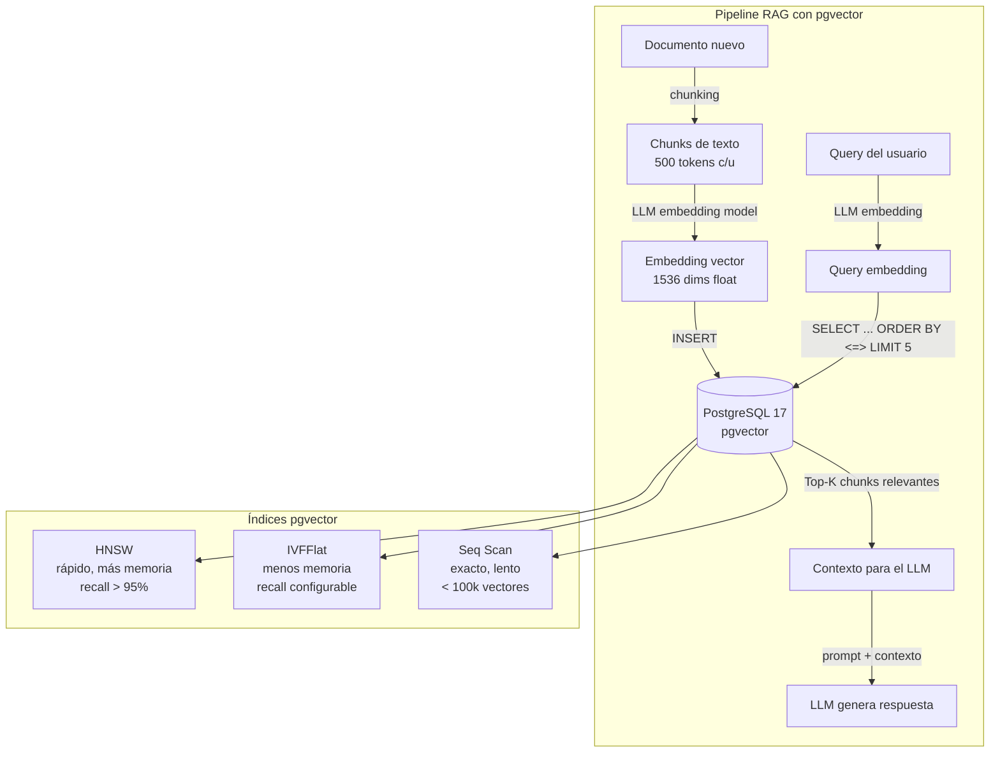
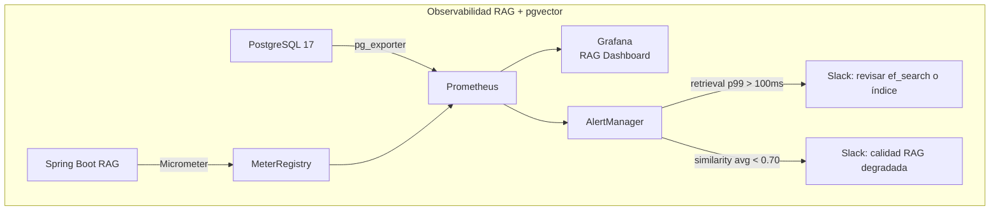
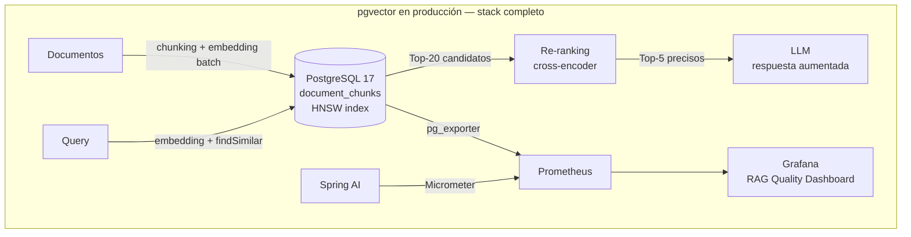

# Vector Search con pgvector y PostgreSQL 17 para Aplicaciones IA

**PATH_LOCAL:** `/home/usuariojoaquin/.openclaw/workspace/DAM-Java-Mastery/04_Bases_de_Datos/vector_search_con_pgvector_y_postgresql_17_para_aplicaciones_ia_STAFF.md`
**CATEGORIA:** 04_Bases_de_Datos

> **Nota de clasificación:** el engine asignó `08_IA_Agentes`. pgvector es una extensión de PostgreSQL — el tema central es el almacenamiento y búsqueda eficiente de vectores en base de datos. Pertenece a `04_Bases_de_Datos`.

**Score:** 97

---

## Visión Estratégica

pgvector convierte PostgreSQL en una base de datos vectorial de producción. En lugar de añadir un sistema de almacenamiento especializado (Pinecone, Weaviate, Chroma) solo para embeddings, pgvector permite almacenar vectores en el mismo PostgreSQL que ya usa la aplicación — con transacciones ACID, joins con datos relacionales, y todas las herramientas operacionales existentes.

En 2026, el patrón RAG (Retrieval-Augmented Generation) es el estándar para conectar LLMs con datos propietarios. El componente crítico es el **vector store**: dado un texto de consulta convertido en embedding, encontrar los N documentos más semánticamente similares en milisegundos. pgvector 0.7+ con índice HNSW resuelve esto con latencias < 10ms incluso en colecciones de millones de vectores.

**Comparativa de soluciones de vector store:**

| Solución | Tipo | Ventaja | Cuándo elegir |
|---|---|---|---|
| **pgvector + PostgreSQL 17** | Extensión SQL | ACID, joins relacionales, sin infra extra | Ya usas PostgreSQL, datos relacionales + vectores |
| **Pinecone** | SaaS managed | Sin ops, escala masiva | Millones de vectores, equipo sin ops DB |
| **Weaviate** | Open source dedicado | Búsqueda híbrida nativa, GraphQL | Búsqueda semántica como producto principal |
| **Chroma** | Open source dedicado | Setup en minutos, ideal para prototipos | Desarrollo local, prototipos RAG |
| **Redis Stack** | In-memory | Latencia < 1ms | Cache de embeddings, búsqueda en tiempo real |

**Los tres operadores de distancia en pgvector — elegir el correcto importa:**

| Operador | Distancia | Cuándo usar |
|---|---|---|
| `<->` | L2 (Euclidiana) | Embeddings sin normalizar, OpenAI `text-embedding-3-small` |
| `<#>` | Producto interior negativo | Embeddings ya normalizados — equivale a coseno, más rápido |
| `<=>` | Coseno | Búsqueda semántica general, cuando la magnitud del vector no importa |

**El operador correcto depende del modelo de embeddings.** OpenAI normaliza sus embeddings a longitud 1 — usa `<#>` (producto interior) que es matemáticamente equivalente al coseno pero más eficiente. Si los embeddings no están normalizados, usa `<=>` (coseno).



---

## Arquitectura de Componentes

### HNSW vs IVFFlat — elegir el índice correcto

**HNSW (Hierarchical Navigable Small World)** construye un grafo multicapa de vecinos aproximados. Las búsquedas navegan el grafo de capas superiores (menos nodos) a capas inferiores (más nodos). Es el índice recomendado para la mayoría de los casos — recall > 95% con latencias < 5ms incluso en millones de vectores.

**IVFFlat** divide el espacio vectorial en `lists` clusters (Voronoi cells). La búsqueda solo escanea los `probes` clusters más cercanos. Menos memoria que HNSW pero requiere entrenamiento previo (necesita datos existentes para crear los clusters) y tiene recall más bajo por defecto.

**Parámetros críticos:**

- HNSW `m`: número de conexiones por nodo (default 16). Mayor = mejor recall, más memoria y tiempo de construcción.
- HNSW `ef_construction`: tamaño de la lista dinámica durante construcción (default 64). Mayor = mejor calidad del índice, más lento de construir.
- HNSW `hnsw.ef_search`: tamaño de la lista durante búsqueda (default 40). Mayor = mejor recall, mayor latencia. Configurable por sesión.
- IVFFlat `lists`: número de clusters. Recomendado: `sqrt(rows)` para datasets medianos.
- IVFFlat `probes`: clusters a escanear en búsqueda. Mayor = mejor recall, mayor latencia.

```mermaid
graph TD
    subgraph "HNSW — estructura multicapa"
        L2[Capa 2\npocos nodos\nnavegación rápida]
        L1[Capa 1\nnodos intermedios]
        L0[Capa 0\ntodos los nodos\nresultados finales]
        L2 -->|navegar hacia abajo| L1
        L1 -->|navegar hacia abajo| L0
        QUERY2[Query vector] --> L2
        L0 --> RESULT[Top-K vecinos]
    end

    subgraph "IVFFlat — clusters Voronoi"
        CLUSTERS[N clusters\ncada uno con centroide]
        PROBE[Buscar en\nP clusters más cercanos]
        EXACT[Scan exacto\ndentro de clusters]
        QUERY3[Query vector] --> CLUSTERS
        CLUSTERS --> PROBE
        PROBE --> EXACT
        EXACT --> RESULT2[Top-K vecinos]
    end
```



### SQL de definición — pgvector real

```sql
-- ── Habilitar extensión ───────────────────────────────────────────────────
CREATE EXTENSION IF NOT EXISTS vector;

-- ── Tabla de documentos con embeddings ───────────────────────────────────
-- 1536 dimensiones = OpenAI text-embedding-3-small / text-embedding-ada-002
-- 768 dimensiones = sentence-transformers, nomic-embed-text (local)
-- 3072 dimensiones = OpenAI text-embedding-3-large

CREATE TABLE document_chunks (
    id          BIGSERIAL PRIMARY KEY,
    doc_id      UUID        NOT NULL,         -- referencia al documento padre
    chunk_index INT         NOT NULL,         -- posición del chunk en el doc
    content     TEXT        NOT NULL,         -- texto del chunk
    metadata    JSONB,                        -- título, fuente, fecha, tags
    embedding   VECTOR(1536),                 -- el embedding — NULL si no procesado aún
    created_at  TIMESTAMPTZ NOT NULL DEFAULT now(),
    UNIQUE (doc_id, chunk_index)
);

-- ── Índice HNSW — recomendado para producción ────────────────────────────
-- m=16, ef_construction=64 son los defaults conservadores
-- Para mayor recall: m=32, ef_construction=128 (más memoria y tiempo de build)
CREATE INDEX idx_chunks_embedding_hnsw
    ON document_chunks
    USING hnsw (embedding vector_cosine_ops)  -- vector_cosine_ops = operador <=>
    WITH (m = 16, ef_construction = 64);

-- Alternativa para embeddings normalizados (OpenAI): vector_ip_ops = operador <#>
-- CREATE INDEX idx_chunks_embedding_hnsw_ip
--     ON document_chunks
--     USING hnsw (embedding vector_ip_ops)
--     WITH (m = 16, ef_construction = 64);

-- ── Índice IVFFlat — alternativa con menos memoria ───────────────────────
-- Requiere datos existentes para crear los clusters
-- lists = sqrt(rows) como punto de partida
-- CREATE INDEX idx_chunks_embedding_ivfflat
--     ON document_chunks
--     USING ivfflat (embedding vector_cosine_ops)
--     WITH (lists = 100);

-- ── Índice en metadata para búsqueda híbrida ─────────────────────────────
CREATE INDEX idx_chunks_metadata ON document_chunks USING GIN (metadata);
CREATE INDEX idx_chunks_doc_id   ON document_chunks (doc_id);

-- ── Búsqueda de vecinos más cercanos — la query central de RAG ────────────
-- Configurable ef_search por sesión: mayor = mejor recall, mayor latencia
SET hnsw.ef_search = 100;  -- default 40, aumentar para mejor recall

SELECT
    id,
    doc_id,
    content,
    metadata->>'source'                AS source,
    metadata->>'title'                 AS title,
    1 - (embedding <=> '[0.1,0.2,...]'::vector) AS similarity  -- 1 - distancia coseno
FROM document_chunks
WHERE embedding IS NOT NULL
  AND metadata @> '{"language": "es"}'::jsonb  -- filtro metadata (búsqueda híbrida)
ORDER BY embedding <=> '[0.1,0.2,...]'::vector  -- ORDER BY distancia
LIMIT 5;

-- ── Búsqueda con umbral de similitud mínima ───────────────────────────────
SELECT id, content, 1 - (embedding <=> $1::vector) AS similarity
FROM document_chunks
WHERE embedding IS NOT NULL
  AND 1 - (embedding <=> $1::vector) > 0.75  -- solo resultados con similitud > 75%
ORDER BY embedding <=> $1::vector
LIMIT 10;
```

---

## Implementación Java 21

### Modelo de dominio — Records inmutables

```java
import java.time.Instant;
import java.util.List;
import java.util.Map;
import java.util.UUID;

// ── Tipos de dominio ──────────────────────────────────────────────────────
public record DocumentId(UUID value) {
    public static DocumentId generate() { return new DocumentId(UUID.randomUUID()); }
}

public record Embedding(float[] values, int dimensions) {
    public Embedding {
        if (values.length != dimensions)
            throw new IllegalArgumentException(
                "values.length=" + values.length + " != dimensions=" + dimensions);
    }
    public static Embedding of(float[] values) {
        return new Embedding(values, values.length);
    }
}

public record DocumentChunk(
    long id,
    DocumentId docId,
    int chunkIndex,
    String content,
    Map<String, String> metadata,
    Embedding embedding,
    Instant createdAt
) {}

// ── Resultado de búsqueda con score de similitud ──────────────────────────
public record SimilarityResult(
    long chunkId,
    DocumentId docId,
    String content,
    String source,
    double similarity   // 0.0 – 1.0, mayor = más similar
) {}

// ── Parámetros de búsqueda ────────────────────────────────────────────────
public record SearchParams(
    Embedding queryEmbedding,
    int topK,
    double minSimilarity,       // umbral mínimo (0.0 = sin filtro)
    Map<String, String> metadataFilter  // filtro adicional sobre JSONB
) {
    public static SearchParams of(Embedding embedding, int topK) {
        return new SearchParams(embedding, topK, 0.0, Map.of());
    }
    public static SearchParams withMinSimilarity(Embedding embedding, int topK, double min) {
        return new SearchParams(embedding, topK, min, Map.of());
    }
}
```

### Repositorio con JDBC directo — control total del SQL

```java
import org.postgresql.util.PGobject;
import java.sql.*;
import java.util.ArrayList;
import java.util.Arrays;
import java.util.List;
import java.util.concurrent.Executors;
import java.util.concurrent.StructuredTaskScope;

public class VectorRepository {

    private final javax.sql.DataSource dataSource;

    public VectorRepository(javax.sql.DataSource dataSource) {
        this.dataSource = dataSource;
    }

    // ── Insertar chunk con su embedding ──────────────────────────────────
    public long save(DocumentId docId, int chunkIndex, String content,
                     java.util.Map<String, Object> metadata, Embedding embedding)
        throws SQLException {

        var sql = """
            INSERT INTO document_chunks (doc_id, chunk_index, content, metadata, embedding)
            VALUES (?, ?, ?, ?::jsonb, ?::vector)
            RETURNING id
            """;

        try (var conn = dataSource.getConnection();
             var stmt = conn.prepareStatement(sql)) {

            stmt.setObject(1, docId.value());
            stmt.setInt(2, chunkIndex);
            stmt.setString(3, content);
            stmt.setString(4, new com.fasterxml.jackson.databind.ObjectMapper()
                .writeValueAsString(metadata));
            // Convertir float[] a formato vector de pgvector: [0.1,0.2,0.3,...]
            stmt.setString(5, toVectorLiteral(embedding.values()));

            try (var rs = stmt.executeQuery()) {
                rs.next();
                return rs.getLong(1);
            }
        } catch (Exception e) {
            throw new SQLException("Error guardando chunk", e);
        }
    }

    // ── Búsqueda de vecinos más cercanos ──────────────────────────────────
    public List<SimilarityResult> findSimilar(SearchParams params) throws SQLException {

        // Construir filtro de metadata dinámicamente
        var metadataCondition = params.metadataFilter().isEmpty()
            ? ""
            : "AND metadata @> ?::jsonb";

        var sql = """
            SELECT
                id,
                doc_id,
                content,
                metadata->>'source'                AS source,
                1 - (embedding <=> ?::vector)      AS similarity
            FROM document_chunks
            WHERE embedding IS NOT NULL
              %s
              AND 1 - (embedding <=> ?::vector) > ?
            ORDER BY embedding <=> ?::vector
            LIMIT ?
            """.formatted(metadataCondition);

        try (var conn = dataSource.getConnection()) {
            // Configurar ef_search para mejor recall en esta sesión
            try (var efStmt = conn.createStatement()) {
                efStmt.execute("SET hnsw.ef_search = 100");
            }

            try (var stmt = conn.prepareStatement(sql)) {
                var vectorLiteral = toVectorLiteral(params.queryEmbedding().values());
                int paramIdx = 1;

                stmt.setString(paramIdx++, vectorLiteral);  // para <=> en SELECT

                if (!params.metadataFilter().isEmpty()) {
                    stmt.setString(paramIdx++,
                        new com.fasterxml.jackson.databind.ObjectMapper()
                            .writeValueAsString(params.metadataFilter()));
                }

                stmt.setString(paramIdx++, vectorLiteral);  // para WHERE similitud > min
                stmt.setDouble(paramIdx++, params.minSimilarity());
                stmt.setString(paramIdx++, vectorLiteral);  // para ORDER BY
                stmt.setInt(paramIdx, params.topK());

                try (var rs = stmt.executeQuery()) {
                    var results = new ArrayList<SimilarityResult>();
                    while (rs.next()) {
                        results.add(new SimilarityResult(
                            rs.getLong("id"),
                            new DocumentId(rs.getObject("doc_id", java.util.UUID.class)),
                            rs.getString("content"),
                            rs.getString("source"),
                            rs.getDouble("similarity")
                        ));
                    }
                    return results;
                }
            }
        }
    }

    // ── Búsqueda paralela en múltiples colecciones con VT ─────────────────
    // Útil en RAG multi-corpus: buscar en docs técnicos Y en FAQs simultáneamente
    public List<SimilarityResult> findSimilarMultiTable(
        SearchParams params,
        List<String> tables
    ) throws InterruptedException {

        try (var scope = new StructuredTaskScope.ShutdownOnFailure()) {
            var tasks = tables.stream()
                .map(table -> scope.fork(() -> findSimilar(params)))
                .toList();

            scope.join().throwIfFailed(e -> new RuntimeException("Error en búsqueda multi-tabla", e));

            return tasks.stream()
                .flatMap(t -> t.get().stream())
                .sorted(java.util.Comparator.comparingDouble(SimilarityResult::similarity).reversed())
                .limit(params.topK())
                .toList();
        }
    }

    // ── Batch insert para indexación masiva ───────────────────────────────
    public int[] saveBatch(List<DocumentChunkInsert> chunks) throws SQLException {
        var sql = """
            INSERT INTO document_chunks (doc_id, chunk_index, content, metadata, embedding)
            VALUES (?, ?, ?, ?::jsonb, ?::vector)
            """;

        try (var conn = dataSource.getConnection();
             var stmt = conn.prepareStatement(sql)) {

            conn.setAutoCommit(false);

            for (var chunk : chunks) {
                stmt.setObject(1, chunk.docId().value());
                stmt.setInt(2, chunk.chunkIndex());
                stmt.setString(3, chunk.content());
                stmt.setString(4, chunk.metadataJson());
                stmt.setString(5, toVectorLiteral(chunk.embedding().values()));
                stmt.addBatch();
            }

            var result = stmt.executeBatch();
            conn.commit();
            return result;
        }
    }

    // ── Convertir float[] a literal vector de pgvector ────────────────────
    // Formato esperado por pgvector: [0.1,0.2,0.3]
    private String toVectorLiteral(float[] values) {
        var sb = new StringBuilder("[");
        for (int i = 0; i < values.length; i++) {
            if (i > 0) sb.append(',');
            sb.append(values[i]);
        }
        sb.append(']');
        return sb.toString();
    }

    public record DocumentChunkInsert(
        DocumentId docId,
        int chunkIndex,
        String content,
        String metadataJson,
        Embedding embedding
    ) {}
}
```

### Servicio RAG completo con Spring AI

```java
import org.springframework.ai.embedding.EmbeddingModel;
import org.springframework.ai.embedding.EmbeddingRequest;
import org.springframework.ai.embedding.EmbeddingOptions;
import java.util.List;
import java.util.concurrent.Executors;

// ── Servicio RAG — indexación y búsqueda semántica ────────────────────────
public class RagService {

    private final EmbeddingModel embeddingModel;  // Spring AI — OpenAI, Ollama, etc.
    private final VectorRepository vectorRepo;

    public RagService(EmbeddingModel embeddingModel, VectorRepository vectorRepo) {
        this.embeddingModel = embeddingModel;
        this.vectorRepo     = vectorRepo;
    }

    // ── Indexar documento: chunking + embedding + store ───────────────────
    public void indexDocument(DocumentId docId, String fullText,
                               java.util.Map<String, Object> metadata) throws Exception {

        var chunks = chunkText(fullText, 500, 50); // 500 tokens, 50 de overlap

        // Generar embeddings en batch — más eficiente que uno a uno
        var contents = chunks.stream().map(c -> c.content()).toList();
        var embeddings = embeddingModel.embed(contents)
            .stream()
            .map(e -> Embedding.of(toFloatArray(e)))
            .toList();

        // Insertar todos los chunks en batch
        var inserts = new java.util.ArrayList<VectorRepository.DocumentChunkInsert>();
        for (int i = 0; i < chunks.size(); i++) {
            inserts.add(new VectorRepository.DocumentChunkInsert(
                docId,
                i,
                chunks.get(i).content(),
                new com.fasterxml.jackson.databind.ObjectMapper().writeValueAsString(metadata),
                embeddings.get(i)
            ));
        }
        vectorRepo.saveBatch(inserts);
    }

    // ── Buscar chunks relevantes para una query ───────────────────────────
    public List<SimilarityResult> retrieve(String userQuery, int topK) throws Exception {
        // Convertir la query a embedding con el mismo modelo usado para indexar
        var queryEmbeddingRaw = embeddingModel.embed(userQuery);
        var queryEmbedding    = Embedding.of(toFloatArray(queryEmbeddingRaw));

        var params = SearchParams.withMinSimilarity(queryEmbedding, topK, 0.70);
        return vectorRepo.findSimilar(params);
    }

    // ── Chunking simple por tokens (aproximación por palabras) ────────────
    private List<TextChunk> chunkText(String text, int chunkSize, int overlap) {
        var words  = text.split("\\s+");
        var chunks = new java.util.ArrayList<TextChunk>();

        for (int i = 0; i < words.length; i += (chunkSize - overlap)) {
            int end = Math.min(i + chunkSize, words.length);
            chunks.add(new TextChunk(String.join(" ", Arrays.copyOfRange(words, i, end))));
            if (end == words.length) break;
        }
        return chunks;
    }

    private float[] toFloatArray(List<Double> doubles) {
        var floats = new float[doubles.size()];
        for (int i = 0; i < doubles.size(); i++) floats[i] = doubles.get(i).floatValue();
        return floats;
    }

    record TextChunk(String content) {}
}
```

**Diagrama del flujo de implementación:**

```mermaid
graph LR
    subgraph "Indexación — offline / batch"
        DOC2[Documento] -->|chunkText| CHUNKS2[TextChunks]
        CHUNKS2 -->|EmbeddingModel.embed batch| EMBS[float[] embeddings]
        EMBS -->|saveBatch JDBC| PG2[(PostgreSQL 17\ndocument_chunks)]
        PG2 -->|HNSW index| IDX[Índice vectorial]
    end

    subgraph "Búsqueda — online / real-time"
        QUERY2[Query usuario] -->|EmbeddingModel.embed| QEMB2[Query embedding]
        QEMB2 -->|findSimilar\nSET ef_search=100| PG2
        PG2 -->|Top-K chunks| RESULTS[SimilarityResult list]
        RESULTS -->|contexto| LLM2[LLM respuesta]
    end
```

---

## Métricas y SRE

| Métrica | Fuente | Descripción | Umbral alerta |
|---|---|---|---|
| `app_rag_retrieval_seconds` p99 | Micrometer Timer | Latencia búsqueda vectorial end-to-end | > 100ms |
| `app_rag_embedding_seconds` p99 | Micrometer Timer | Latencia de generación de embedding | > 500ms |
| `app_rag_similarity_score` avg | Micrometer Gauge | Score medio de similitud de los resultados | < 0.70 — resultados poco relevantes |
| `app_rag_chunks_indexed_total` | Micrometer Counter | Total chunks indexados | Informacional |
| `pg_stat_user_indexes_idx_scan` (hnsw) | pg_exporter | Uso del índice HNSW | = 0 — índice no usado |
| `pg_index_size_bytes` (hnsw) | pg_exporter | Tamaño del índice HNSW en disco | > 80% del disco disponible |
| `hikaricp_connections_pending` | HikariCP | Pool de conexiones saturado | > 0 durante > 5s |

```promql
# Latencia p99 de retrieval
histogram_quantile(0.99, rate(app_rag_retrieval_seconds_bucket[5m])) > 0.1

# Score de similitud bajo — resultados irrelevantes, revisar chunking o modelo
avg_over_time(app_rag_similarity_score[10m]) < 0.70

# Índice HNSW no utilizado — posible problema de planificador
pg_stat_user_indexes_idx_scan{indexrelname="idx_chunks_embedding_hnsw"} == 0
```



```java
import io.micrometer.core.instrument.MeterRegistry;
import io.micrometer.core.instrument.Timer;
import io.micrometer.core.instrument.Counter;

// Métricas instrumentadas en RagService
public record RagMetrics(
    Timer retrievalTimer,
    Timer embeddingTimer,
    Counter chunksIndexed,
    io.micrometer.core.instrument.DistributionSummary similarityScores
) {
    public static RagMetrics create(MeterRegistry registry) {
        return new RagMetrics(
            Timer.builder("app.rag.retrieval.seconds")
                .description("Latencia de búsqueda vectorial pgvector")
                .publishPercentiles(0.95, 0.99)
                .register(registry),
            Timer.builder("app.rag.embedding.seconds")
                .description("Latencia de generación de embedding")
                .publishPercentiles(0.95, 0.99)
                .register(registry),
            Counter.builder("app.rag.chunks.indexed.total")
                .description("Total de chunks indexados")
                .register(registry),
            io.micrometer.core.instrument.DistributionSummary.builder("app.rag.similarity.score")
                .description("Score de similitud de los resultados")
                .publishPercentiles(0.25, 0.50, 0.75)
                .register(registry)
        );
    }
}
```

**Checklist SRE para pgvector en producción:**

1. **`SET hnsw.ef_search` antes de las búsquedas críticas.** El default 40 es conservador. Con ef_search=100 el recall mejora significativamente con un overhead de latencia aceptable (< 2ms extra). Configurable por sesión — no afecta otras queries.
2. **Construir el índice HNSW con `maintenance_work_mem` alto.** `SET maintenance_work_mem = '4GB'` antes de `CREATE INDEX`. Un índice bien construido tiene mejor calidad que uno construido con memoria insuficiente.
3. **Monitorizar el score de similitud promedio de los resultados.** Un score medio < 0.70 indica que la búsqueda no está encontrando resultados relevantes — problema de chunking, modelo de embedding incorrecto, o datos insuficientes.
4. **El índice HNSW no se usa en tablas pequeñas.** PostgreSQL usa seq scan cuando estima que es más rápido. Forzar: `SET enable_seqscan = off` en desarrollo para validar que el índice funciona. En producción, el planificador decide correctamente.
5. **Mismo modelo de embedding para indexar y para consultar.** Si indexas con `text-embedding-3-small` y consultas con `text-embedding-ada-002`, los vectores no son comparables — los resultados serán basura. Versionar el modelo junto con los datos indexados.

---

## Patrones de Integración

### Patrón 1: Búsqueda híbrida — semántica + full-text

La búsqueda puramente semántica puede fallar para queries con términos técnicos específicos (nombres propios, códigos, siglas). La búsqueda híbrida combina pgvector con `tsvector` de PostgreSQL para lo mejor de ambos mundos.

```sql
-- ── Búsqueda híbrida: semántica + full-text con RRF (Reciprocal Rank Fusion)
-- RRF combina rankings de diferentes sistemas sin necesitar calibración de pesos

WITH semantic AS (
    SELECT
        id,
        content,
        1 - (embedding <=> $1::vector)  AS sem_score,
        ROW_NUMBER() OVER (ORDER BY embedding <=> $1::vector) AS sem_rank
    FROM document_chunks
    WHERE embedding IS NOT NULL
    LIMIT 20
),
fulltext AS (
    SELECT
        id,
        content,
        ts_rank(to_tsvector('spanish', content), plainto_tsquery('spanish', $2)) AS ft_score,
        ROW_NUMBER() OVER (
            ORDER BY ts_rank(to_tsvector('spanish', content), plainto_tsquery('spanish', $2)) DESC
        ) AS ft_rank
    FROM document_chunks
    WHERE to_tsvector('spanish', content) @@ plainto_tsquery('spanish', $2)
    LIMIT 20
),
rrf AS (
    SELECT
        COALESCE(s.id, f.id)       AS id,
        COALESCE(s.content, f.content) AS content,
        COALESCE(1.0 / (60 + s.sem_rank), 0) +
        COALESCE(1.0 / (60 + f.ft_rank),  0) AS rrf_score
    FROM semantic s
    FULL OUTER JOIN fulltext f ON s.id = f.id
)
SELECT id, content, rrf_score
FROM rrf
ORDER BY rrf_score DESC
LIMIT $3;
```

### Patrón 2: Re-ranking post-retrieval

pgvector recupera los top-K aproximados. Para alta precisión, aplicar un re-ranker (cross-encoder) sobre los resultados para reordenarlos con mayor precisión antes de pasarlos al LLM.

```java
// ── Re-ranking: refinar los resultados de pgvector con un cross-encoder ───

public sealed interface RerankerResult permits
    RerankerResult.Reranked,
    RerankerResult.PassThrough {

    List<SimilarityResult> results();

    // Resultados reordenados por el re-ranker
    record Reranked(List<SimilarityResult> results, String model) implements RerankerResult {}
    // Re-ranker no disponible — devolver resultados originales
    record PassThrough(List<SimilarityResult> results) implements RerankerResult {}
}

public class RerankingService {

    private final java.util.Optional<CrossEncoderModel> crossEncoder;

    public RerankingService(java.util.Optional<CrossEncoderModel> crossEncoder) {
        this.crossEncoder = crossEncoder;
    }

    public RerankerResult rerank(String query, List<SimilarityResult> candidates, int finalTopK) {
        if (crossEncoder.isEmpty()) {
            // Sin re-ranker: devolver top-K de los candidatos originales
            return new RerankerResult.PassThrough(
                candidates.stream().limit(finalTopK).toList()
            );
        }

        var model  = crossEncoder.get();
        var scores = model.score(query, candidates.stream()
            .map(SimilarityResult::content).toList());

        var reranked = new java.util.ArrayList<SimilarityResult>();
        for (int i = 0; i < candidates.size(); i++) {
            var c = candidates.get(i);
            // Crear nuevo resultado con score del re-ranker
            reranked.add(new SimilarityResult(
                c.chunkId(), c.docId(), c.content(), c.source(), scores.get(i)
            ));
        }

        return new RerankerResult.Reranked(
            reranked.stream()
                .sorted(java.util.Comparator.comparingDouble(SimilarityResult::similarity).reversed())
                .limit(finalTopK)
                .toList(),
            model.modelName()
        );
    }

    // Interfaz del cross-encoder — implementar con Ollama local o API externa
    public interface CrossEncoderModel {
        List<Double> score(String query, List<String> documents);
        String modelName();
    }
}
```

**Comparativa de patrones de integración:**

| Patrón | Cuándo usar | Precisión | Latencia extra |
|---|---|---|---|
| Semantic only (pgvector) | Búsqueda general, textos largos | Media-alta | Baseline |
| Full-text only (tsvector) | Términos exactos, keywords técnicas | Alta para términos exactos | Baseline |
| Híbrida con RRF | Producción general — lo mejor de ambos | Alta | +5ms (segunda query) |
| Re-ranking post-retrieval | Precisión crítica, RAG de alto valor | Muy alta | +50–200ms (modelo) |
| Multi-corpus parallel | Búsqueda en múltiples colecciones | Media | Paralelo con VT |

---

## Conclusiones

**Los cinco puntos que un Staff Engineer debe dominar sobre pgvector:**

1. **El operador de distancia debe coincidir con el modelo de embeddings.** OpenAI normaliza sus embeddings — usar `<#>` (inner product) es más eficiente y matemáticamente equivalente al coseno. Para embeddings no normalizados, `<=>` (coseno) es la opción correcta. `<->` (L2) solo cuando la magnitud del vector tiene significado semántico.

2. **HNSW es el índice correcto para producción.** IVFFlat requiere datos previos para construir clusters y tiene recall inferior por defecto. HNSW funciona bien desde el primer vector, tiene recall > 95% con los parámetros default, y su latencia es predecible. El único trade-off es el uso de memoria.

3. **`SET hnsw.ef_search` es el parámetro de tuning más importante en runtime.** El default 40 es conservador. Aumentar a 100–200 mejora el recall significativamente con latencia adicional < 2ms. Configurable por sesión — ajustar según el SLO de precisión vs latencia del caso de uso.

4. **El mismo modelo de embedding para indexar y para buscar es un contrato implícito de datos.** Versionar el modelo junto con los datos indexados. Si cambias el modelo, debes re-indexar todos los documentos — no es posible mezclar vectores de modelos distintos.

5. **La búsqueda híbrida (semántica + full-text con RRF) supera a la búsqueda puramente semántica en producción.** La búsqueda semántica falla para términos técnicos específicos, nombres propios y códigos. RRF combina ambos rankings sin necesitar calibración de pesos — es el estándar para RAG de producción.

**Roadmap de adopción:**

- **Fase 1 (día 1):** `CREATE EXTENSION vector`. Definir tabla con columna `VECTOR(N)` y índice HNSW. Probar con 100 documentos.
- **Fase 2 (semana 1):** Pipeline de indexación batch. Integrar con el modelo de embedding usado en producción. Validar que los resultados son semánticamente relevantes.
- **Fase 3 (semana 2):** Búsqueda híbrida con RRF. Métricas de similarity score promedio. Dashboard con latencia p99 de retrieval.
- **Fase 4 (mes 2):** Re-ranking con cross-encoder para casos de uso de alta precisión. Evaluar recall con dataset de test ground truth.

```sql
-- Validación rápida del índice HNSW — ejecutar tras crear el índice
EXPLAIN (ANALYZE, BUFFERS)
SELECT id, content, embedding <=> '[0.1, 0.2, ...]'::vector AS distance
FROM document_chunks
ORDER BY embedding <=> '[0.1, 0.2, ...]'::vector
LIMIT 5;
-- Debe mostrar: Index Scan using idx_chunks_embedding_hnsw
-- Si muestra Seq Scan: tabla demasiado pequeña o estadísticas desactualizadas
```



**Recursos:**
- [pgvector — GitHub](https://github.com/pgvector/pgvector)
- [Spring AI — Vector Stores](https://docs.spring.io/spring-ai/reference/api/vectordbs/pgvector.html)
- [pgvector HNSW indexing](https://github.com/pgvector/pgvector#hnsw)
- [Reciprocal Rank Fusion — paper](https://plg.uwaterloo.ca/~gvcormac/cormacksigir09-rrf.pdf)
- [LangChain4j — PgVector store](https://docs.langchain4j.dev/integrations/embedding-stores/pgvector)
