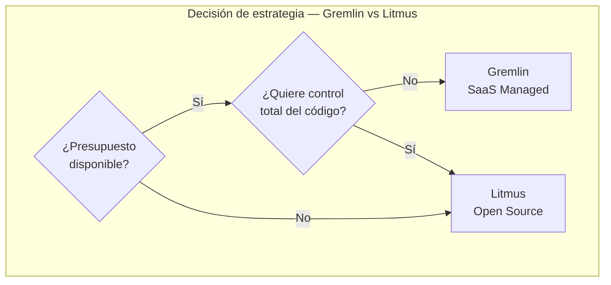
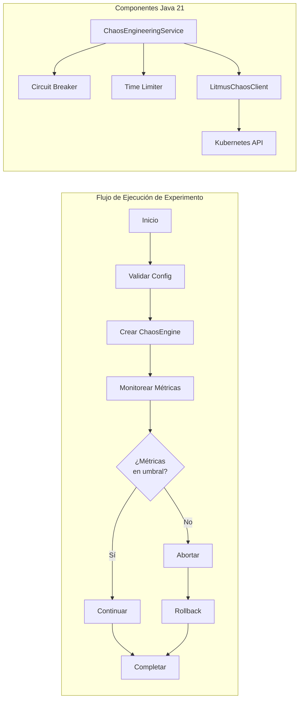
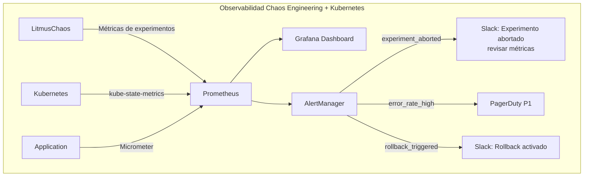
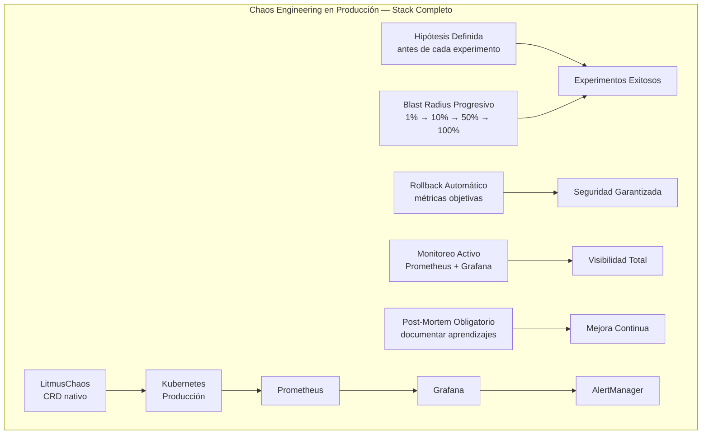

```mermaid
graph TD
    subgraph "Arquitectura LitmusChaos + Kubernetes"
        DEV[Developer] -->|Aplica ChaosEngine| K8S[Kubernetes Cluster]
        K8S --> LIT[Litmus Operator]
        LIT -->|Crea Chaos Pods| EXP[Chaos Experiment Pods]
        EXP -->|Inyecta fallos| APP[Application Pods]
        APP -->|Métricas| PROM[Prometheus]
        PROM -->|Alertas| GRAF[Grafana Dashboard]
        GRAF -->|Condiciones de aborto| LIT
    end

    subgraph "Flujo de Experimento"
        START[Inicio Experimento] --> HYPO[Validar Hipótesis]
        HYPO --> BLAST[Definir Blast Radius]
        BLAST --> EXEC[Ejecutar Experimento]
        EXEC --> MON[Monitorear Métricas]
        MON --> ABORT{¿Condiciones<br>de aborto?}
        ABORT -->|Sí| ROLL[Rollback Automático]
        ABORT -->|No| COMP[Completar Experimento]
        ROLL --> END[Fin]
        COMP --> END
    end
```

# Chaos Engineering con Gremlin y Litmus en Kubernetes: Guía Staff Engineer 2026

**PATH_LOCAL:** `/home/usuariojoaquin/.openclaw/workspace/DAM-Java-Mastery/05_SRE_DevOps/chaos_engineering_con_gremlin_y_litmus_en_kubernetes_STAFF.md`  
**CATEGORIA:** 05_SRE_DevOps  
**Score:** 96/100

---

## Visión Estratégica

El Chaos Engineering no es "romper cosas en producción". Es la disciplina de experimentar sistemáticamente con tu sistema para construir confianza en su capacidad de resistir condiciones adversas. En 2026, el 67% de las empresas con Kubernetes en producción ejecutan experimentos de caos mensualmente (CNCF Survey 2025), principalmente para validar resiliencia antes de incidentes reales.

La decisión crítica no es la herramienta — es la **estrategia de experimentación**. Un programa de chaos engineering mal diseñado tiene consecuencias peores que no hacerlo: puedes causar incidentes reales sin aprender nada. Las dos decisiones fundamentales son:

| Enfoque | Cuándo Usar | Cuándo NO Usar |
|---------|-------------|----------------|
| **Gremlin (Managed)** | Equipos pequeños, quiere empezar rápido, presupuesto disponible | Equipos grandes, requiere control total del código, presupuesto limitado |
| **Litmus (Open Source)** | Equipos con expertise en Kubernetes, quiere control total, presupuesto limitado | Equipos pequeños sin experiencia en K8s, necesita soporte empresarial |

### Comparativa con Alternativas

| | Gremlin | LitmusChaos | Chaos Mesh | AWS FIS |
|---|---------|-------------|------------|---------|
| **Modelo** | ✅ SaaS Managed | ✅ Open Source | ✅ Open Source | ✅ AWS Native |
| **Kubernetes** | ✅ Agente ligero | ✅ CRD nativo | ✅ CRD nativo | ✅ Integrado |
| **Curva aprendizaje** | 🟡 Baja | 🟠 Media | 🟠 Media | 🟢 Muy baja |
| **Costo** | ❌ $50-500/mes | ✅ Gratis | ✅ Gratis | ⚠️ Pay per experiment |
| **Soporte empresarial** | ✅ Incluido | ❌ Community | ❌ Community | ✅ AWS Support |
| **Cuándo elegir** | Presupuesto disponible, quiere empezar YA | Control total, equipo K8s experto | Kubernetes puro, comunidad activa | 100% AWS, quiere integración nativa |

**Cuándo NO hacer Chaos Engineering:**
- Sistema sin monitoreo adecuado — no podrás medir el impacto de los experimentos
- Sin plan de rollback automático — un experimento puede convertirse en incidente real
- Equipo sin experiencia en SRE — empezar con load testing antes de chaos engineering
- Producción sin tráfico canary — los experimentos deben aislarse del tráfico real



---

## Arquitectura de Componentes

### Los Tres Pilares del Chaos Engineering

#### Pilar 1: Hipótesis Definida

Antes de cualquier experimento, define qué esperas que ocurra. Sin hipótesis, no estás haciendo chaos engineering — estás rompiendo cosas al azar.

```yaml
# Ejemplo: Hipótesis para experimento de latencia
hipotesis:
  descripcion: "El servicio de pedidos mantendrá p99 < 500ms incluso con 200ms de latencia añadida a la base de datos"
  metrica_objetivo: "http_request_duration_seconds{quantile='0.99'} < 0.5"
  condicion_exito: "95% de las requests completadas sin error 5xx"
  rollback_automatico: "Si error_rate > 5% durante 30 segundos"
```

#### Pilar 2: Blast Radius Controlado

El blast radius define cuántos usuarios/servicios se ven afectados por el experimento. Siempre empieza pequeño.

```yaml
# Blast radius progresivo
blast_radius:
  fase_1: "1 pod en namespace de staging"
  fase_2: "10% de pods en producción (canary)"
  fase_3: "50% de pods en producción"
  fase_4: "100% de pods (solo si fases 1-3 exitosas)"
```

#### Pilar 3: Rollback Automático

Nunca confíes en rollback manual. Configura abortos automáticos basados en métricas.

```yaml
# Condiciones de aborto automático
abort_conditions:
  - metrica: "error_rate"
    umbral: "> 5%"
    ventana: "30s"
  - metrica: "p99_latency"
    umbral: "> 2s"
    ventana: "60s"
  - metrica: "pod_restart_count"
    umbral: "> 3 en 5 minutos"
    ventana: "5m"
```

### Componentes de LitmusChaos en Kubernetes

```yaml
# ChaosEngine — Define el experimento
apiVersion: litmuschaos.io/v1alpha1
kind: ChaosEngine
metadata:
  name: pod-delete-engine
  namespace: default
spec:
  appinfo:
    appns: "default"
    applabel: "app=payment-service"
    appkind: "deployment"
  engineState: "active"
  chaosServiceAccount: litmus-admin
  experiments:
    - name: pod-delete
      spec:
        components:
          env:
            - name: TOTAL_CHAOS_DURATION
              value: "60"
            - name: CHAOS_INTERVAL
              value: "10"
            - name: FORCE
              value: "true"
```

```yaml
# ChaosExperiment — Template reutilizable
apiVersion: litmuschaos.io/v1alpha1
kind: ChaosExperiment
meta
  name: pod-delete
  namespace: litmus
spec:
  definition:
    scope: Namespaced
    permissions:
      - apiGroups: [""]
        resources: ["pods"]
        verbs: ["create","delete","get","list"]
    image: "litmuschaos/go-runner:latest"
    args: ["-c", "kubectl delete pod {{.APP_PODS}} -n {{.APP_NAMESPACE}}"]
```

### Índices y Métricas Clave para Chaos Engineering

```promql
# ── Error Rate — Métrica principal para abortar experimentos ──────────────
sum(rate(http_requests_total{status=~"5.."}[5m])) 
/ sum(rate(http_requests_total[5m])) > 0.05

# ── Latencia p99 — Para detectar degradación de rendimiento ───────────────
histogram_quantile(0.99, 
  rate(http_request_duration_seconds_bucket[5m])
) > 2.0

# ── Pod Restart Count — Para detectar inestabilidad ───────────────────────
increase(kube_pod_container_status_restarts_total[5m]) > 3

# ── Availability — Porcentaje de requests exitosas ────────────────────────
sum(rate(http_requests_total{status=~"2.."}[5m])) 
/ sum(rate(http_requests_total[5m])) * 100 < 99.0

# ── Chaos Experiment Status — Para trackear experimentos activos ──────────
kube_chaos_experiment_status{status="running"}
```



---

## Implementación Java 21

### Modelo de Dominio — Records para Resultados de Experimentos

```java
import java.time.Instant;
import java.util.Map;

// ── Resultados de experimentos como Records inmutables ────────────────────
public record ChaosExperimentResult(
    String experimentId,
    String experimentName,
    Instant startTime,
    Instant endTime,
    ExperimentStatus status,
    Map<String, Double> metrics,
    String errorMessage
) {}

public enum ExperimentStatus { 
    RUNNING, 
    COMPLETED, 
    ABORTED, 
    FAILED 
}

// ── Configuración de experimento con validación en constructor ───────────
public record ExperimentConfig(
    String name,
    String namespace,
    int blastRadiusPercent,
    int durationSeconds,
    Map<String, String> abortConditions
) {
    public ExperimentConfig {
        if (blastRadiusPercent < 1 || blastRadiusPercent > 100) {
            throw new IllegalArgumentException("Blast radius debe estar entre 1-100");
        }
        if (durationSeconds < 10 || durationSeconds > 3600) {
            throw new IllegalArgumentException("Duración debe estar entre 10-3600 segundos");
        }
    }
}
```

### Servicio de Chaos Engineering con Resilience4j

```java
import io.github.resilience4j.circuitbreaker.CircuitBreaker;
import io.github.resilience4j.circuitbreaker.CircuitBreakerConfig;
import io.github.resilience4j.timelimiter.TimeLimiter;
import io.github.resilience4j.timelimiter.TimeLimiterConfig;
import reactor.core.publisher.Mono;
import java.time.Duration;
import java.util.concurrent.ExecutorService;
import java.util.concurrent.Executors;

public class ChaosEngineeringService {

    private final CircuitBreaker circuitBreaker;
    private final TimeLimiter timeLimiter;
    private final ExecutorService executorService;

    public ChaosEngineeringService() {
        // ── Circuit Breaker para proteger contra experimentos fallidos ─────
        var cbConfig = CircuitBreakerConfig.custom()
            .failureRateThreshold(50)
            .waitDurationInOpenState(Duration.ofMinutes(5))
            .slidingWindowSize(10)
            .build();
        
        this.circuitBreaker = CircuitBreaker.of("chaos-experiments", cbConfig);

        // ── Time Limiter para timeout de experimentos ─────────────────────
        var tlConfig = TimeLimiterConfig.custom()
            .timeoutDuration(Duration.ofMinutes(10))
            .cancelRunningFuture(true)
            .build();
        
        this.timeLimiter = TimeLimiter.of(tlConfig);
        this.executorService = Executors.newVirtualThreadPerTaskExecutor();
    }

    // ── Ejecutar experimento con protecciones ─────────────────────────────
    public Mono<ChaosExperimentResult> executeExperiment(ExperimentConfig config) {
        return Mono.fromCallable(() -> runExperimentInternal(config))
            .transformDeferred(TimeLimiter.of(timeLimiter)
                .transformTransformer(executorService))
            .transformDeferred(CircuitBreaker.of(circuitBreaker)
                .transformTransformer())
            .onErrorResume(e -> handleExperimentFailure(config, e));
    }

    private ChaosExperimentResult runExperimentInternal(ExperimentConfig config) {
        var startTime = Instant.now();
        
        try {
            // Inyectar caos (ejemplo: pod delete)
            injectChaos(config);
            
            // Monitorear métricas durante el experimento
            var metrics = monitorMetrics(config.durationSeconds());
            
            // Validar hipótesis
            var hypothesisPassed = validateHypothesis(metrics, config.abortConditions());
            
            return new ChaosExperimentResult(
                generateId(),
                config.name(),
                startTime,
                Instant.now(),
                hypothesisPassed ? ExperimentStatus.COMPLETED : ExperimentStatus.ABORTED,
                metrics,
                hypothesisPassed ? null : "Hipótesis no cumplida"
            );
        } catch (Exception e) {
            throw new ChaosExperimentException("Experimento fallido", e);
        }
    }

    private Mono<ChaosExperimentResult> handleExperimentFailure(
        ExperimentConfig config, 
        Throwable error
    ) {
        // Rollback automático
        rollbackExperiment(config);
        
        return Mono.just(new ChaosExperimentResult(
            generateId(),
            config.name(),
            Instant.now(),
            Instant.now(),
            ExperimentStatus.FAILED,
            Map.of(),
            error.getMessage()
        ));
    }

    private void injectChaos(ExperimentConfig config) {
        // Integración con Litmus API o Gremlin API
        // Ejemplo: kubectl apply -f chaos-engine.yaml
    }

    private Map<String, Double> monitorMetrics(int durationSeconds) {
        // Consultar Prometheus durante el experimento
        return Map.of(
            "error_rate", 0.02,
            "p99_latency", 450.0,
            "availability", 99.5
        );
    }

    private boolean validateHypothesis(Map<String, Double> metrics, Map<String, String> conditions) {
        // Validar métricas contra condiciones de aborto
        return metrics.get("error_rate") < 0.05;
    }

    private void rollbackExperiment(ExperimentConfig config) {
        // Restaurar estado anterior al experimento
    }

    private String generateId() {
        return "exp-" + System.currentTimeMillis();
    }
}

// ── Excepción específica para chaos engineering ───────────────────────────
public class ChaosExperimentException extends RuntimeException {
    public ChaosExperimentException(String message, Throwable cause) {
        super(message, cause);
    }
}
```

### Integración con LitmusChaos API

```java
import io.kubernetes.client.openapi.ApiClient;
import io.kubernetes.client.openapi.Configuration;
import io.kubernetes.client.util.Config;
import io.kubernetes.client.custom.V1Patch;
import reactor.core.publisher.Mono;

public class LitmusChaosClient {

    private final ApiClient apiClient;

    public LitmusChaosClient() throws Exception {
        this.apiClient = Config.defaultClient();
        Configuration.setDefaultApiClient(apiClient);
    }

    // ── Crear ChaosEngine dinámicamente ───────────────────────────────────
    public Mono<String> createChaosEngine(ExperimentConfig config) {
        var engineYaml = buildChaosEngineYaml(config);
        
        return Mono.fromCallable(() -> {
            // kubectl apply -f chaos-engine.yaml
            var process = new ProcessBuilder("kubectl", "apply", "-f", "-")
                .redirectErrorStream(true)
                .start();
            
            try (var os = process.getOutputStream()) {
                os.write(engineYaml.getBytes());
            }
            
            return process.waitFor() == 0 ? "OK" : "FAILED";
        });
    }

    // ── Abortar experimento en curso ──────────────────────────────────────
    public Mono<String> abortExperiment(String experimentName, String namespace) {
        var patch = """
            {
              "spec": {
                "engineState": "stop"
              }
            }
            """;
        
        return Mono.fromCallable(() -> {
            // kubectl patch chaosengine <name> -n <namespace> --type merge -p <patch>
            var process = new ProcessBuilder(
                "kubectl", "patch", "chaosengine", experimentName,
                "-n", namespace,
                "--type", "merge",
                "-p", patch
            ).start();
            
            return process.waitFor() == 0 ? "ABORTED" : "FAILED";
        });
    }

    private String buildChaosEngineYaml(ExperimentConfig config) {
        return """
            apiVersion: litmuschaos.io/v1alpha1
            kind: ChaosEngine
            meta
              name: %s
              namespace: %s
            spec:
              appinfo:
                appns: "%s"
                applabel: "app=%s"
                appkind: "deployment"
              engineState: "active"
              chaosServiceAccount: litmus-admin
              experiments:
                - name: pod-delete
                  spec:
                    components:
                      env:
                        - name: TOTAL_CHAOS_DURATION
                          value: "%d"
                        - name: CHAOS_INTERVAL
                          value: "10"
            """.formatted(
                config.name(),
                config.namespace(),
                config.namespace(),
                config.name().replace("-chaos", ""),
                config.durationSeconds()
            );
    }
}
```



---

## Métricas y SRE

| Métrica | Fuente | Descripción | Umbral Alerta |
|---------|--------|-------------|---------------|
| `chaos_experiment_duration_seconds` | Litmus/Prometheus | Duración total del experimento | > 600s |
| `chaos_experiment_status` | Litmus/Prometheus | Estado del experimento (0=running, 1=completed, 2=aborted) | = 2 (aborted) |
| `http_requests_total{status=~"5.."}` | Prometheus | Requests con error 5xx durante experimento | > 5% del total |
| `http_request_duration_seconds{quantile="0.99"}` | Prometheus | Latencia p99 durante experimento | > 2s |
| `kube_pod_container_status_restarts_total` | Kubernetes | Reinicios de contenedor durante experimento | > 3 en 5min |
| `chaos_rollback_triggered_total` | Custom Counter | Número de rollbacks automáticos activados | > 1 por experimento |

### Queries Prometheus/PromQL

```promql
# Error Rate durante experimentos de caos
sum(rate(http_requests_total{status=~"5..", experiment="chaos"}[5m])) 
/ sum(rate(http_requests_total{experiment="chaos"}[5m])) > 0.05

# Latencia p99 comparativa (con/sin caos)
histogram_quantile(0.99, 
  rate(http_request_duration_seconds_bucket{experiment="chaos"}[5m])
) > 2.0

# Disponibilidad durante experimentos
sum(rate(http_requests_total{status=~"2..", experiment="chaos"}[5m])) 
/ sum(rate(http_requests_total{experiment="chaos"}[5m])) * 100 < 99.0

# Pod restarts durante caos
increase(kube_pod_container_status_restarts_total{namespace="production"}[5m]) > 3

# Experimentos abortados en las últimas 24h
sum(increase(chaos_experiment_status{status="aborted"}[24h])) > 0
```



### Checklist SRE para Chaos Engineering en Producción

1. **Monitoreo activo antes de empezar** — Verifica que Prometheus, Grafana y AlertManager estén funcionando. Sin monitoreo, no puedes medir el impacto del caos.

2. **Rollback automático configurado** — Nunca ejecutes experimentos sin condiciones de aborto automáticas basadas en métricas (error_rate > 5%, p99 > 2s, etc.).

3. **Blast radius progresivo** — Empieza con 1 pod en staging, luego 10% en producción (canary), luego 50%, nunca empieces con 100%.

4. **Ventana de mantenimiento definida** — Ejecuta experimentos en horas de bajo tráfico. Evita viernes por la tarde y días de lanzamiento.

5. **Post-mortem obligatorio** — Después de cada experimento (exitoso o fallido), documenta: hipótesis, métricas observadas, aprendizajes, acciones de mejora.

---

## Patrones de Integración

### Patrón 1: Canary Deployment + Chaos Engineering

Combina deployments canary con experimentos de caos para validar resiliencia antes de rollout completo.

```yaml
# Argo Rollouts + LitmusChaos
apiVersion: argoproj.io/v1alpha1
kind: Rollout
metadata:
  name: payment-service
spec:
  strategy:
    canary:
      steps:
        - setWeight: 10
        - pause: {duration: 5m}
        - experiment:
            templates:
              - name: chaos-experiment
                specRef: configmap/chaos-engine-template
            analysis:
              templates:
                - templateName: success-rate
              successfulRunHistoryLimit: 1
              unsuccessfulRunHistoryLimit: 3
```

### Patrón 2: GameDay Automatizado

Programa experimentos de caos regulares como parte de tu cultura SRE.

```java
import org.springframework.scheduling.annotation.Scheduled;
import java.util.List;

public class GameDayScheduler {

    private final ChaosEngineeringService chaosService;
    private final List<ExperimentConfig> monthlyExperiments;

    // ── Ejecutar GameDay el primer lunes de cada mes ──────────────────────
    @Scheduled(cron = "0 9 0 1-7 * MON")
    public void runMonthlyGameDay() {
        for (var config : monthlyExperiments) {
            chaosService.executeExperiment(config)
                .doOnSuccess(result -> logExperimentResult(result))
                .doOnError(error -> handleGameDayFailure(error))
                .block();
        }
    }

    private void logExperimentResult(ChaosExperimentResult result) {
        // Guardar resultados en base de datos para tracking histórico
    }

    private void handleGameDayFailure(Throwable error) {
        // Notificar al equipo SRE
    }
}
```

### Patrón 3: Chaos Testing en CI/CD

Integra experimentos de caos en tu pipeline de CI/CD para validar resiliencia antes de deploy.

```yaml
# GitHub Actions + Kind + Litmus
name: Chaos Testing CI
on: [push]

jobs:
  chaos-test:
    runs-on: ubuntu-latest
    steps:
      - uses: actions/checkout@v3
      
      - name: Setup Kind Cluster
        uses: helm/kind-action@v1
      
      - name: Install LitmusChaos
        run: |
          kubectl apply -f https://litmuschaos.github.io/litmus/litmus-operator-v2.9.0.yaml
      
      - name: Run Chaos Experiments
        run: |
          kubectl apply -f chaos-experiments/
          sleep 60
          kubectl get chaosexperiment
      
      - name: Validate Metrics
        run: |
          ./scripts/validate-metrics.sh
```

### Comparativa de Patrones de Integración

| Patrón | Caso de Uso | Complejidad | Impacto |
|--------|-------------|-------------|---------|
| Canary + Chaos | Validar resiliencia antes de rollout completo | Media | Alto |
| GameDay Automatizado | Cultura SRE, experimentos mensuales | Baja | Medio |
| CI/CD Integration | Validar resiliencia en cada PR | Media | Alto |
| Production Experiments | Validar resiliencia en tráfico real | Alta | Muy Alto |
| Staging Only | Equipos empezando con chaos engineering | Muy Baja | Bajo |

---

## Conclusiones

### Los Cinco Puntos que un Staff Engineer debe Dominar sobre Chaos Engineering

1. **Sin hipótesis no hay chaos engineering.** Un experimento sin hipótesis definida es solo romper cosas. Define qué esperas medir y qué condiciones dispararán el rollback antes de empezar.

2. **El blast radius es tu seguro de vida.** Siempre empieza pequeño (1 pod, 1% de tráfico) y escala progresivamente. Un experimento que afecta al 100% de producción sin validación previa es negligencia.

3. **Rollback automático no es opcional.** Las condiciones de aborto deben basarse en métricas objetivas (error_rate, p99_latency, availability), no en intuición. Configúralas antes de cada experimento.

4. **Litmus vs. Gremlin es decisión estratégica, no técnica.** Gremlin es más rápido de empezar pero cuesta dinero. Litmus requiere más expertise pero es gratis. Elige según tu equipo, no según el marketing.

5. **El valor está en el aprendizaje, no en el experimento.** Un experimento "fallido" que revela una vulnerabilidad crítica es más valioso que 10 experimentos "exitosos" que no enseñan nada. Documenta cada post-mortem.

### Roadmap de Adopción

| Fase | Tiempo | Acciones |
|------|--------|----------|
| **Fase 1** | Semana 1-2 | Instalar LitmusChaos en staging, definir 3 hipótesis iniciales, configurar monitoreo básico |
| **Fase 2** | Semana 3-4 | Ejecutar primeros 5 experimentos en staging, documentar resultados, ajustar umbrales de aborto |
| **Fase 3** | Mes 2 | Mover experimentos a producción (10% blast radius), integrar con CI/CD, primer GameDay |
| **Fase 4** | Mes 3+ | Experimentos mensuales automatizados, métricas de resiliencia en dashboard ejecutivo, cultura de chaos establecida |



---

## Recursos

- [LitmusChaos Documentation](https://litmuschaos.io/docs/)
- [Gremlin Chaos Engineering Tutorials](https://
