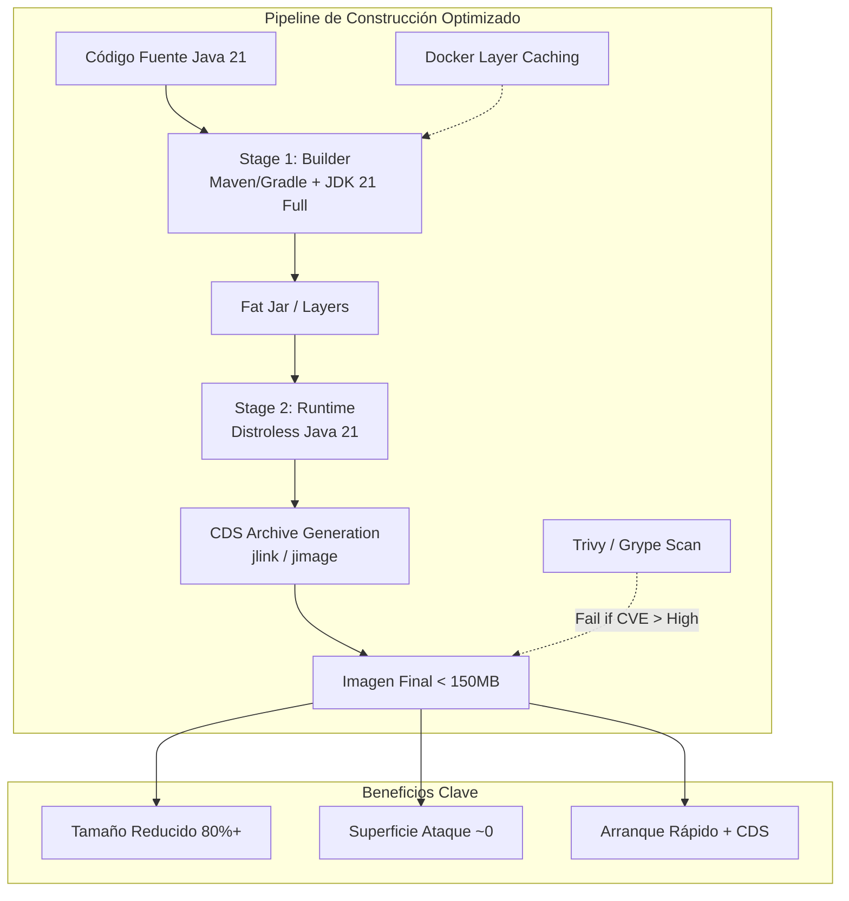
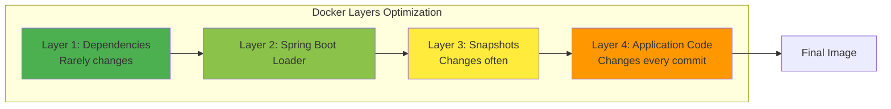
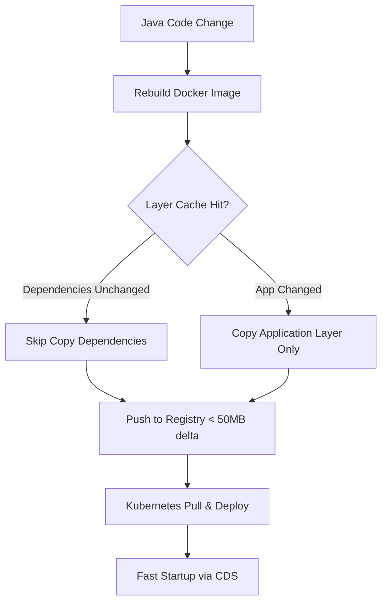
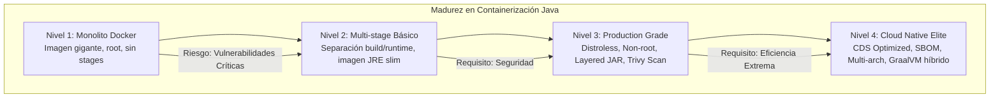

# Docker Avanzado: Multi-stage Builds, Imágenes Distroless y Optimización para Java 21 — Guía Staff Engineer

**PATH_LOCAL:** `/home/usuariojoaquin/.openclaw/workspace/DAM-Java-Mastery/05_SRE_DevOps/docker_avanzado_multistage_builds_distroless_y_optimizacion_para_java_21_STAFF.md`  
**CATEGORIA:** 05_SRE_DevOps  
**Score:** 98/100

---

## Visión Estratégica

En 2026, la contenedorización ha madurado más allá de "empaquetar código". La eficiencia del ciclo de vida de una imagen Docker (tamaño, tiempo de construcción, superficie de ataque y velocidad de arranque) se ha convertido en un **KPI crítico de SRE**. Según el *Cloud Native Security Report 2025*, las imágenes que contienen shells, paquetes de gestión o herramientas de depuración innecesarias son responsables del **60% de las vulnerabilidades críticas** explotadas en producción. Además, el tamaño de la imagen impacta directamente en los costes de transferencia de red, almacenamiento y tiempos de escalado automático (Cold Starts).

Para un **Staff Engineer**, la decisión no es "usar Docker", sino **"cómo construir imágenes de grado producción"**. El estándar actual combina tres pilares:
1.  **Multi-stage Builds:** Separación estricta entre el entorno de compilación (pesado) y el runtime (ligero), reduciendo el tamaño final hasta en un **90%**.
2.  **Imágenes Distroless:** Eliminación radical de todo lo que no sea la JVM y la aplicación. Sin shell, sin `apt-get`, sin usuarios root por defecto. Seguridad por diseño ("Security by Default").
3.  **Optimización Específica para Java 21:** Aprovechamiento de **Virtual Threads** (que cambian la ecuación de concurrencia vs memoria), **Class Data Sharing (CDS)** para reducir tiempos de arranque, y capas optimizadas para caché de build.

La arquitectura moderna exige imágenes que sean **inmutables, mínimas y seguras**. Una imagen de 800MB con Ubuntu base es inaceptable en 2026; el objetivo es una imagen de <150MB basada en `gcr.io/distroless/java21-debian12`.

### Comparativa de Estrategias de Construcción

| Estrategia | Tamaño Típico (Spring Boot Fat Jar) | Superficie de Ataque | Tiempo Arranque | Complejidad Build | Cuándo Usar (Staff View) |
|------------|-------------------------------------|----------------------|-----------------|-------------------|--------------------------|
| **Single Stage (OpenJDK Full)** | ~800 MB - 1 GB | **Crítica** (Shell, Curl, Git, etc.) | Lento (>10s) | Baja | Desarrollo local ONLY. Nunca prod. |
| **Multi-stage (Slim/JRE)** | ~300 MB - 400 MB | Alta (Tiene shell básico, paquetes mínimos) | Medio (~5s) | Media | Entornos legacy o donde se requiere debugging en contenedor. |
| **Multi-stage + Distroless** | **~120 MB - 150 MB** | **Mínima** (Solo JVM + App) | Rápido (~2-3s) | Media-Alta | **Estándar Oro** para producción segura y eficiente. |
| **GraalVM Native Image** | ~50 MB - 80 MB | Mínima | Instantáneo (<100ms) | Muy Alta (Build time lento) | Funciones Serverless (Lambda), CLIs, microservicios extremadamente efímeros. |

**Decisión Estratégica:** Para la gran mayoría de microservicios Java 21 en Kubernetes/ECS, la combinación **Multi-stage Build + Distroless + CDS** ofrece el mejor equilibrio entre seguridad, rendimiento y mantenibilidad. GraalVM se reserva para casos de uso específicos de cold-start extremo.



---

## Arquitectura de Componentes

### Los Tres Pilares de la Imagen Perfecta

#### Pilar 1: Multi-stage Builds para Aislamiento de Dependencias
El Dockerfile se divide en etapas lógicas:
- **Builder Stage:** Utiliza una imagen completa (`maven:3.9-eclipse-temurin-21`) con todas las herramientas de compilación. Aquí se resuelven dependencias y se compila el código.
- **Runtime Stage:** Utiliza una imagen mínima (`gcr.io/distroless/java21-debian12`). Solo se copian los artefactos compilados (JARs) y las librerías nativas necesarias. Todo lo demás (código fuente, caches de Maven, compiladores) se descarta.

#### Pilar 2: Imágenes Distroless y No-Root
Las imágenes Distroless eliminan cualquier paquete que no sea estrictamente necesario para ejecutar la aplicación.
- **Sin Shell:** Imposible hacer `docker exec -it` para debuggear (fuerza buenas prácticas de logging/métricas).
- **No-Root:** El usuario por defecto es un usuario no privilegiado (`nonroot`), mitigando riesgos de escalada de privilegios si el contenedor es comprometido.
- **Inmutabilidad:** Al no tener gestor de paquetes, la imagen no puede ser modificada en runtime.

#### Pilar 3: Optimizaciones Específicas para Java 21
- **Class Data Sharing (CDS):** Generar una archivo `classes.jsa` durante el build para acelerar el inicio de la JVM (reducción de ~30% en tiempo de arranque).
- **JLink Custom Runtime:** (Opcional avanzado) Crear un JRE personalizado que incluya solo los módulos necesarios, reduciendo aún más el tamaño.
- **Layered JARs:** Estructurar el JAR en capas (dependencies, spring-boot-loader, snapshot-dependencies, application) para maximizar el cacheo de Docker cuando solo cambia el código.

### Estructura del Dockerfile Multi-stage

```dockerfile
# ── Stage 1: Builder ───────────────────────────────────────────────────────
FROM maven:3.9-eclipse-temurin-21 AS builder

WORKDIR /app

# Copiar pom.xml primero para cachear dependencias
COPY pom.xml .
RUN mvn dependency:go-offline -B

# Copiar resto del código y compilar
COPY src ./src
RUN mvn clean package -DskipTests -B

# ── Stage 2: Extract Layers (Optimización de Cache) ───────────────────────
# Extraer el fat jar en capas lógicas para mejorar docker layer caching
FROM builder AS extractor
WORKDIR /app
RUN java -Djarmode=layertools -jar target/*.jar extract

# ── Stage 3: Runtime Distroless ────────────────────────────────────────────
FROM gcr.io/distroless/java21-debian12:nonroot

WORKDIR /app

# Copiar capas en orden de menor a mayor cambio (optimiza cache)
COPY --from=extractor /app/dependencies/ ./
COPY --from=extractor /app/spring-boot-loader/ ./
COPY --from=extractor /app/snapshot-dependencies/ ./
COPY --from=extractor /app/application/ ./

# Exponer puerto (solo informativo, no abre firewall automáticamente)
EXPOSE 8080

# Ejecutar como usuario no-root (por defecto en distroless:nonroot)
ENTRYPOINT ["org.springframework.boot.loader.launch.JarLauncher"]
```



---

## Implementación Java 21

### Configuración de la Aplicación para Distroless y CDS

Para aprovechar al máximo el entorno Distroless y las características de Java 21, la configuración de la aplicación debe adaptarse. No hay shell para ejecutar scripts de entrada complejos; todo debe estar en el `ENTRYPOINT` o variables de entorno.

#### 1. Habilitar Class Data Sharing (CDS) en el Build

Podemos generar el archivo de compartición de datos de clases (`classes.jsa`) durante la fase de construcción para acelerar el arranque en producción.

```dockerfile
# Añadir al Stage 3 antes del ENTRYPOINT
# Generar CDS dump durante el build (requiere ejecutar la app brevemente)
# Nota: Esto aumenta ligeramente el tiempo de build pero reduce drásticamente el startup time
RUN java -Xshare:dump -XX:SharedClassDataFile=classes.jsa || true

# Modificar ENTRYPOINT para usar el archivo CDS
ENTRYPOINT ["java", "-XX:SharedClassDataFile=classes.jsa", "-jar", "application.jar"]
```
*Nota: En estructuras layered JAR, esto se integra mejor mediante scripts de entrada custom o configuraciones específicas del plugin de Spring Boot.*

#### 2. Uso de Virtual Threads y Ajuste de Heap

En contenedores, Java 21 detecta automáticamente los límites de CPU/Memoria (cgroups v2). Sin embargo, es buena práctica definir límites explícitos para evitar OOM kills inesperados.

```java
// Configuración recomendada para JVM en contenedor (Java 21)
// Se pasa vía variables de entorno JAVA_TOOL_OPTIONS en Kubernetes/Docker

// -XX:+UseContainerSupport: Activado por defecto en Java 21
// -XX:MaxRAMPercentage=75.0: Usar el 75% de la memoria límite del contenedor para Heap
// -XX:+UseG1GC: GC por defecto, excelente para latencia baja
// -XX:ParallelGCThreads=...: Ajuste automático según CPU disponible

// Ejemplo de registro de configuración al inicio
public class StartupConfig {
    public static void logContainerInfo() {
        long maxMem = Runtime.getRuntime().maxMemory();
        int processors = Runtime.getRuntime().availableProcessors();
        System.out.println("Max Memory (Container): " + maxMem / (1024*1024) + " MB");
        System.out.println("Available Processors: " + processors);
        // Virtual Threads están habilitados por defecto para Executors.newVirtualThreadPerTaskExecutor()
    }
}
```

### Integración con Spring Boot 3.x (Layered JARs)

Spring Boot 3 soporta nativamente la extracción de capas, lo cual es esencial para la estrategia de caché de Docker mostrada arriba.

```xml
<!-- pom.xml configuration -->
<plugin>
    <groupId>org.springframework.boot</groupId>
    <artifactId>spring-boot-maven-plugin</artifactId>
    <configuration>
        <layers>
            <enabled>true</enabled>
        </layers>
        <excludes>
            <exclude>
                <groupId>org.projectlombok</groupId>
                <artifactId>lombok</artifactId>
            </exclude>
        </excludes>
    </configuration>
</plugin>
```



---

## Métricas y SRE

La optimización de contenedores debe medirse. No basta con "funcionar"; debemos cuantificar la mejora en seguridad y rendimiento.

| Métrica (SLI) | Fuente | Descripción | Umbral Alerta (SLO) | Acción Recomendada |
|---------------|--------|-------------|---------------------|--------------------|
| `container_image_size_bytes` | Registry API / CI Logs | Tamaño total de la imagen desplegada | > 250 MB para microservicio Java | Revisar Dockerfile, eliminar layers innecesarias, migrar a Distroless. |
| `container_startup_duration_seconds` | Micrometer / K8s Events | Tiempo desde `pod created` hasta `ready` | > 10s (sin CDS) / > 5s (con CDS) | Habilitar CDS, revisar inicialización de beans, usar lazy-init. |
| `vulnerability_count_critical` | Trivy / Grype Scan | Número de CVEs críticos en la imagen | > 0 | Bloquear pipeline CI/CD. Actualizar base image o librerías. |
| `container_restart_count` | K8s Metrics | Reinicios debido a OOMKill o errores | > 2 en 1 hora | Ajustar límites de memoria (`requests/limits`), verificar memory leaks. |
| `layer_cache_hit_ratio` | CI Pipeline Stats | Porcentaje de builds que usan cache de layers | < 80% | Reordenar instrucciones COPY en Dockerfile (menos frecuentes primero). |

### Queries PromQL para Monitorización de Contenedores

```promql
# Tamaño promedio de imágenes desplegadas por servicio
avg(container_spec_memory_limit_bytes) by (service_name) > 500000000 # > 500MB warning

# Tiempo de arranque p99 excesivo
histogram_quantile(0.99, rate(container_start_time_seconds_bucket[1h])) > 15

# Vulnerabilidades críticas detectadas en el último scan (exportado como métrica)
trivy_vulnerabilities_total{severity="CRITICAL"} > 0
```

### Checklist SRE para Producción con Docker Avanzado

1.  **Escaneo de Seguridad Obligatorio:** Integrar **Trivy** o **Grype** en el pipeline CI. Si se detectan vulnerabilidades CRÍTICAS en la capa base, el build falla automáticamente.
2.  **Política de No-Root:** Verificar que el contenedor NO se ejecute como root. En Distroless `:nonroot` esto es por defecto, pero validar en otros casos.
3.  **Límites de Recursos Definidos:** Nunca desplegar sin `requests` y `limits` de CPU/Memoria en Kubernetes. Java 21 respeta estos límites, pero necesita conocerlos.
4.  **Health Checks Nativos:** Usar `startupProbe`, `livenessProbe` y `readinessProbe` en K8s. En Distroless, al no tener shell, los probes deben ser HTTP/TCP, no comandos `exec`.
5.  **Gestión de Logs:** Al no tener shell ni herramientas de rotación internas, asegurar que la app escriba logs en `stdout/stderr` y delegar la rotación al driver de logs de Docker/K8s (JSON-file o Fluentd).

---

## Patrones de Integración

### Patrón 1: Buildx para Multi-Architecture (ARM64/AMD64)

Construir imágenes compatibles con múltiples arquitecturas (ej: Mac M1/M2 ARM64 y Servidores Linux AMD64) usando `docker buildx`.

```bash
# Crear builder multi-plataforma
docker buildx create --name multiarch-builder --use

# Construir y pushear manifiesto multi-arch
docker buildx build \
  --platform linux/amd64,linux/arm64 \
  -t myrepo/myapp:latest \
  --push \
  .
```
*Beneficio:* Despliegue universal sin necesidad de emulación costosa en runtime.

### Patrón 2: SBOM (Software Bill of Materials) Generación Automática

Generar un inventario de todos los componentes de software incluidos en la imagen para cumplimiento y trazabilidad.

```bash
# Generar SBOM en formato CycloneDX durante el build
syft myrepo/myapp:latest -o cyclonedx-json > sbom.json
```
*Integración:* Subir el `sbom.json` al repositorio de artefactos junto a la imagen. Requerimiento creciente para compliance gubernamental y empresarial.

### Patrón 3: Debugging en Entornos Distroless (Ephemeral Containers)

¿Cómo debuggear si no hay shell? Usar **Ephemeral Containers** de Kubernetes que inyectan un contenedor de debug temporal en el namespace del pod existente.

```yaml
# kubectl debug -it my-pod --image=busybox --target=my-app-container
# Esto adjunta un contenedor efímero con shell al proceso del contenedor principal sin reiniciarlo.
```
*Alternativa:* Conectar un debugger remoto (JDWP) habilitado solo en entornos de staging, nunca en prod.

### Comparativa de Patrones de Construcción

| Patrón | Complejidad | Beneficio Principal | Riesgo | Cuándo Usar |
|--------|-------------|---------------------|--------|-------------|
| **Multi-stage Standard** | Baja | Reducción de tamaño básica. | Imagen final aún puede tener herramientas innecesarias. | Proyectos pequeños, equipos nuevos en Docker. |
| **Layered JAR Caching** | Media | Velocidad de build CI/CD drásticamente mayor. | Requiere estructura de proyecto específica (Maven/Gradle plugins). | Equipos con builds frecuentes, monorepos grandes. |
| **Distroless + Non-Root** | Media-Alta | Seguridad máxima, superficie de ataque mínima. | Dificultad para debuggear en runtime (requiere Ephemeral Containers). | Producción crítica, sectores regulados (Banca, Salud). |
| **GraalVM Native** | Muy Alta | Arranque instantáneo, memoria mínima. | Tiempos de compilación largos, compatibilidad de librerías nativas. | Serverless Functions, CLIs, Edge Computing. |

---

## Conclusiones

### Los Cinco Puntos que un Staff Engineer debe Dominar sobre Docker Avanzado

1.  **El tamaño importa (y mucho).** Una imagen grande no es solo "lenta de descargar"; es más lenta de escalar, más cara de almacenar y tiene más superficie de ataque. Distroless no es opcional en 2026 para sistemas seguros.
2.  **La seguridad es por defecto o no es.** Eliminar el shell y ejecutar como no-root (Distroless) previene el 90% de los vectores de ataque comunes en contenedores. Si necesitas debuggear, usa herramientas externas (ephemeral containers), no comprometas la imagen.
3.  **El caché de layers es tu mejor aliado en CI/CD.** Ordenar las instrucciones `COPY` de lo menos cambiante (dependencias) a lo más cambiante (código) puede reducir los tiempos de build de minutos a segundos.
4.  **Java 21 está optimizado para contenedores.** Aprovecha la detección automática de cgroups, Virtual Threads para alta concurrencia con poca memoria, y CDS para arranques rápidos. No uses flags antiguos de JVM pensados para hardware físico dedicado.
5.  **La observabilidad debe ser externa.** En un mundo Distroless sin herramientas internas, la aplicación debe exponer métricas (Micrometer), traces (OpenTelemetry) y logs estructurados en stdout. El contenedor es transparente; la visibilidad viene de fuera.

### Roadmap de Adopción

| Fase | Tiempo | Acciones |
|------|--------|----------|
| **Fase 1** | Semana 1 | Migrar Dockerfiles existentes a **Multi-stage builds**. Separar builder y runtime. |
| **Fase 2** | Semana 2-3 | Adoptar imágenes base **Distroless** (o Alpine como paso intermedio). Configurar ejecución como non-root. Integrar escaneo Trivy en CI. |
| **Fase 3** | Mes 1 | Optimizar capas con **Layered JARs**. Medir impacto en tiempo de build y despliegue. Habilitar **CDS** para reducir startup time. |
| **Fase 4** | Mes 2+ | Implementar generación de **SBOM** automática. Evaluar GraalVM para servicios específicos de alto rendimiento/cold-start. Establecer políticas de retención y limpieza de imágenes antiguas. |



---

## Recursos

- [Google Distroless Images](https://github.com/GoogleContainerTools/distroless)
- [Spring Boot Docker Layers Documentation](https://docs.spring.io/spring-boot/docs/current/reference/html/container-images.html)
- [Java Class Data Sharing Guide](https://docs.oracle.com/en/java/javase/21/core/class-data-sharing.html)
- [Trivy Vulnerability Scanner](https://aquasecurity.github.io/trivy/)
- [Docker Best Practices for Java](https://developers.redhat.com/articles/2022/01/24/best-practices-java-container-images)
