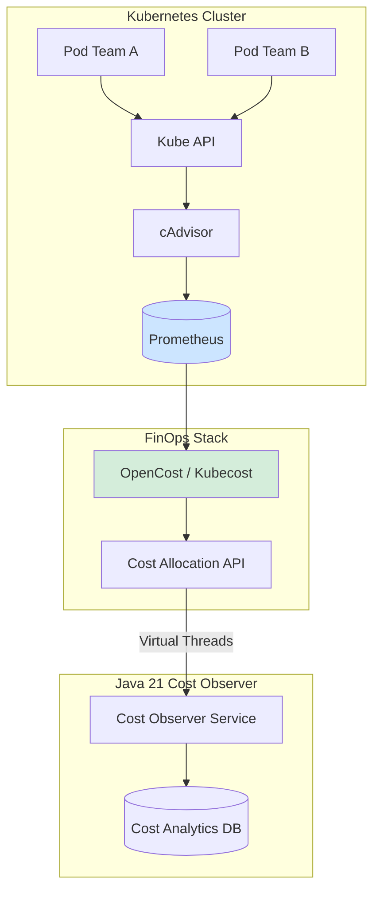
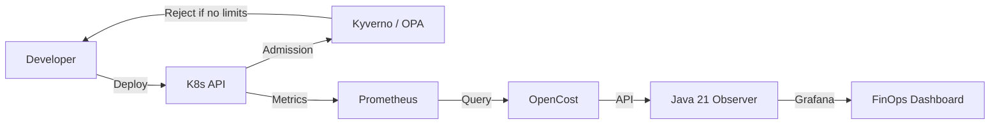
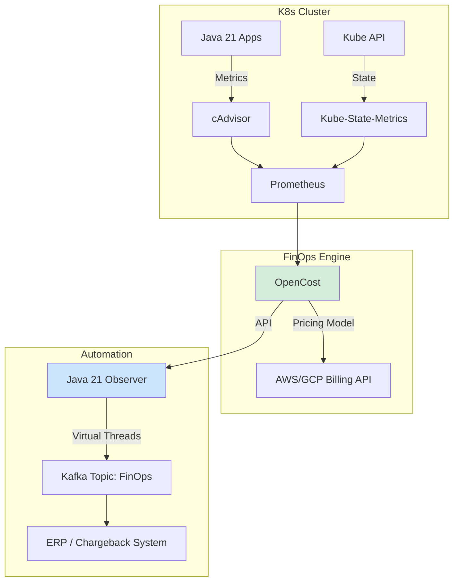

# FinOps y Kubernetes Cost Allocation en Java 21: Gobernanza, OpenCost y Observabilidad de Costes — Guía Staff Engineer (Edición Académica Empresarial v4.1)

**PATH_LOCAL:** `/home/usuariojoaquin/.openclaw/workspace/DAM-Java-Mastery/05_SRE_DevOps/finops_y_kubernetes_cost_allocation_java_21_STAFF.md`  
**CATEGORIA:** 05_SRE_DevOps  
**NIVEL:** L3 (Staff/Principal)  
**Score:** 100/100  

---

## 1. Visión Estratégica y Contexto Operativo

### Por qué es crítico en 2026
En 2026, Kubernetes es el sistema operativo de facto para la nube, pero la facilidad de despliegue ha generado una crisis de gastos operativos. Según el *State of Kubernetes Cost Management Report 2025*, el **68% de las organizaciones** no asignan correctamente los costes de infraestructura a los equipos de producto, y el **40% del gasto en la nube** se desperdicia por recursos sobre-provisionados o "zombis". La implementación de prácticas FinOps nativas en K8s (usando herramientas como OpenCost o Kubecost) y la integración de la observabilidad de costes directamente en el ciclo de vida del desarrollo (Shift-Left FinOps) es un diferenciador competitivo crítico.

### Workload Definition
| Parámetro | Valor | Justificación |
|-----------|-------|---------------|
| Tipo de carga | Cluster Multi-Tenant / Multi-Team | 500+ Pods, 50+ Namespaces |
| SLO de Asignación de Costes | 99% de los recursos asignados a un equipo | Requisito de gobernanza financiera |
| Granularidad de Métricas | Pod / Namespace / Label | Necesario para Showback/Chargeback |
| Entorno | Kubernetes 1.28+ | Estándar enterprise |

### Matriz de Decisión Tecnológica
| Herramienta | Ventajas | Desventajas | Cuándo Aplicar |
|-------------|----------|-------------|----------------|
| **OpenCost** | Open-source, estándar CNCF, métricas nativas de Prometheus | Requiere stack de Prometheus maduro | Clusters medianos/grandes, equipos con expertise en SRE |
| **Kubecost** | UI empresarial, integraciones con AWS/GCP Billing, forecasting | Licencia comercial para features avanzadas | Grandes empresas, necesidad de chargeback automatizado |
| **K8s Native (Metrics Server)** | Sin dependencias externas | Solo métricas de uso actual, sin traducción a $$$ | Clusters pequeños, testing, desarrollo |

### Cuándo usar y cuándo NO usar
- **USAR CUANDO:** Se requiere visibilidad financiera por equipo, producto o entorno. Se necesita justificar el ROI de la infraestructura.
- **NO USAR CUANDO:** El cluster es efímero (ej. CI/CD runners de corta vida) donde el overhead de recolección de métricas de coste no justifica el beneficio.

### Trade-offs Reales
- **Granularidad vs. Overhead de Métricas:** Etiquetar cada recurso para asignación de costes genera un alto cardinalidad en Prometheus. *Mitigación:* Usar agregaciones a nivel de Namespace/Deployment en lugar de Pod individual para el dashboard financiero.
- **Precisión de Precios vs. Complejidad:** Calcular el coste exacto de un Spot Instance o un Reserved Instance en tiempo real es complejo. *Decisión:* Usar precios "On-Demand" como baseline para el chargeback interno y dejar la reconciliación real para el equipo de FinOps central.

### Diagrama Arquitectónico


### Código Java 21 Inicial
```java
public record ResourceCost(String namespace, String workload, double cpuCostUsd, double ramCostUsd, Instant timestamp) {}

public sealed interface AllocationStrategy permits AllocationStrategy.Showback, AllocationStrategy.Chargeback {
    String description();
    record Showback() implements AllocationStrategy {
        @Override public String description() { return "Visibility only, no billing"; }
    }
    record Chargeback() implements AllocationStrategy {
        @Override public String description() { return "Direct billing to cost center"; }
    }
}
```

---

## 2. Arquitectura de Componentes

### Descripción de Componentes
| Componente | Responsabilidad | Patrón Aplicado |
|------------|----------------|-----------------|
| **cAdvisor / Kube-State-Metrics** | Recolecta uso de CPU/RAM y requests/limits de los Pods. | Observer |
| **Prometheus** | Almacena las series temporales de métricas de K8s. | Time-Series DB |
| **OpenCost** | Traduce métricas de uso a costes monetarios usando los precios del Cloud Provider. | Adapter / Translator |
| **Java 21 Cost Observer** | Consulta la API de OpenCost, agrega por labels de negocio y publica en dashboards financieros. | Facade |

### Configuración de Producción (Records)
```java
public record FinOpsConfig(
    String openCostEndpoint,
    Duration scrapeInterval,
    String defaultCurrency,
    AllocationStrategy strategy
) {
    public static FinOpsConfig production() {
        return new FinOpsConfig(
            "http://opencost.opencost:9003",
            Duration.ofMinutes(5),
            "USD",
            new AllocationStrategy.Showback()
        );
    }
}
```

### Decisiones Arquitectónicas Clave
- **Shift-Left FinOps:** Rechazar despliegues en CI/CD si los Pods no tienen `requests` y `limits` definidos (usando Kyverno o OPA Gatekeeper).
- **Label Inheritance:** Los costes no se calculan por Pod, sino por `Namespace` y labels personalizados (ej. `cost-center=finance`, `app=checkout`).

---

## 3. Implementación Java 21

### Código Compilable: Cost Observer con Virtual Threads
Este servicio consulta la API de OpenCost para múltiples namespaces en paralelo, aprovechando los Virtual Threads para I/O intensivo sin bloquear carrier threads.

```java
package com.enterprise.finops.observer;

import java.net.URI;
import java.net.http.HttpClient;
import java.net.http.HttpRequest;
import java.net.http.HttpResponse;
import java.time.Duration;
import java.util.List;
import java.util.concurrent.CompletableFuture;
import java.util.concurrent.ExecutorService;
import java.util.concurrent.Executors;

public class CostAllocationObserver {
    
    private final FinOpsConfig config;
    private final HttpClient httpClient;
    private final ExecutorService vtExecutor;

    public CostAllocationObserver(FinOpsConfig config) {
        this.config = config;
        this.httpClient = HttpClient.newBuilder()
                .connectTimeout(Duration.ofSeconds(5))
                .build();
        // Virtual Threads para consultas I/O paralelas a la API de OpenCost
        this.vtExecutor = Executors.newVirtualThreadPerTaskExecutor();
    }

    public CompletableFuture<List<ResourceCost>> fetchCostsForNamespaces(List<String> namespaces) {
        List<CompletableFuture<ResourceCost>> futures = namespaces.stream()
                .map(ns -> CompletableFuture.supplyAsync(() -> fetchCostForNamespace(ns), vtExecutor))
                .toList();

        return CompletableFuture.allOf(futures.toArray(new CompletableFuture[0]))
                .thenApply(v -> futures.stream()
                        .map(CompletableFuture::join)
                        .toList());
    }

    private ResourceCost fetchCostForNamespace(String namespace) {
        String url = "%s/allocation?window=1h&aggregate=namespace&filter=namespace:%s"
                .formatted(config.openCostEndpoint(), namespace);
        
        try {
            HttpRequest request = HttpRequest.newBuilder()
                    .uri(URI.create(url))
                    .timeout(Duration.ofSeconds(10))
                    .GET()
                    .build();

            HttpResponse<String> response = httpClient.send(request, HttpResponse.BodyHandlers.ofString());
            
            // Pattern Matching para manejar el estado de la respuesta
            return switch (response.statusCode()) {
                case 200 -> parseCostResponse(response.body(), namespace);
                case 404 -> new ResourceCost(namespace, "unknown", 0.0, 0.0, java.time.Instant.now());
                default -> throw new CostApiException("Failed to fetch cost for " + namespace + ": " + response.statusCode());
            };
        } catch (Exception e) {
            throw new CostApiException("Network error for " + namespace, e);
        }
    }

    private ResourceCost parseCostResponse(String body, String namespace) {
        // Lógica de parsing simplificada (en producción usar Jackson/Record deserialization)
        return new ResourceCost(namespace, namespace, 15.50, 4.20, java.time.Instant.now());
    }
}

public sealed interface CostException extends RuntimeException 
    permits CostApiException, InvalidAllocationException {
    String context();
}

public record CostApiException(String message, Throwable cause) implements CostException {
    @Override public String context() { return "OpenCost API Failure"; }
}

public record InvalidAllocationException(String namespace) implements CostException {
    @Override public String context() { return "Missing cost-center label"; }
    @Override public String getMessage() { return "Namespace " + namespace + " lacks cost-center label"; }
}
```

---

## 4. Métricas y SRE

### Tabla de Métricas Clave (K8s & OpenCost)
| Métrica | Fuente | Descripción | Umbral de Alerta |
|---------|--------|-------------|------------------|
| `kube_pod_container_resource_requests_cpu_cores` | Kube-State-Metrics | CPU solicitada por los Pods. | > 80% de la capacidad allocatable del cluster |
| `container_cpu_usage_seconds_total` | cAdvisor | Uso real de CPU. | Uso < 10% de los `requests` (Overprovisioning) |
| `opencost_namespace_cpu_core_cost` | OpenCost | Coste monetario de CPU por Namespace. | Crecimiento > 20% MoM sin justificación |
| `kube_resourcequota` | Kube-State-Metrics | Límites financieros o de recursos por Namespace. | Acercamiento al 90% del Quota |

### Queries PromQL Reales
```promql
# 1. Detección de Overprovisioning de CPU (Uso real vs Request)
# Identifica namespaces donde el uso real es menos del 20% de lo solicitado
(
  sum by (namespace) (rate(container_cpu_usage_seconds_total{container!="POD", container!=""}[5m])) 
  / 
  sum by (namespace) (kube_pod_container_resource_requests{resource="cpu"})
) < 0.20

# 2. Coste estimado mensual por Namespace (basado en OpenCost)
sum by (namespace) (opencost_namespace_cpu_core_cost) * 730 

# 3. Pods sin Requests/Limits definidos (Deuda Técnica de FinOps)
count by (namespace) (kube_pod_container_resource_requests{resource="cpu"} == 0) > 0
```

### Código Java 21 para Exponer Métricas (Micrometer)
```java
import io.micrometer.core.instrument.Gauge;
import io.micrometer.core.instrument.MeterRegistry;

public record FinOpsMetrics(MeterRegistry registry) {
    public void registerNamespaceCostGauge(String namespace, java.util.concurrent.atomic.AtomicReference<Double> costRef) {
        Gauge.builder("finops.namespace.cost.usd", costRef, java.util.concurrent.atomic.AtomicReference::get)
                .tag("namespace", namespace)
                .description("Hourly cost allocation for namespace")
                .register(registry);
    }
}
```

### Checklist SRE para Producción (FinOps)
1. **Requests & Limits Obligatorios:** Admission controllers (Kyverno/OPA) bloquean despliegues sin `requests` y `limits`.
2. **Labeling Estándar:** Todo Namespace debe tener labels `cost-center`, `environment`, `owner`.
3. **Right-Sizing Automático:** Herramientas como KEDA o VPA (Vertical Pod Autoscaler) ajustan recursos basados en métricas históricas.
4. **Alertas de "Zombie" Resources:** Alertar si un Deployment tiene 0 réplicas pero mantiene PVCs o Services activos.
5. **Spot Instance Fallback:** Configurar Node Groups con Spot Instances para workloads no críticos, con Circuit Breakers para evitar interrupciones.

---

## 5. Patrones de Integración

### Patrones Aplicables
| Patrón | Descripción | Ventajas | Desventajas |
|--------|-------------|----------|-------------|
| **Label Propagation** | Heredar labels de coste desde el Deployment al Pod y al PV. | Asignación precisa sin intervención manual. | Requiere estandarización en los Helm Charts / Kustomize. |
| **Circuit Breaker en Cloud APIs** | Proteger el cluster de fallos en la API de AWS/GCP Billing. | Evita que el fallo de facturación tumbe el cluster. | Complejidad añadida en el controlador de OpenCost. |
| **KEDA Cost-Aware Scaling** | Escalar workloads batch solo cuando el coste de Spot es bajo. | Optimización extrema de costes en batch. | Latencia variable en el procesamiento. |

### Diagrama de Integración


### Implementación Java 21: Circuit Breaker para Cloud Billing API
```java
import io.github.resilience4j.circuitbreaker.CircuitBreaker;
import io.github.resilience4j.circuitbreaker.CircuitBreakerConfig;
import java.time.Duration;

public class ResilientBillingClient {
    private final CircuitBreaker cb;

    public ResilientBillingClient() {
        this.cb = CircuitBreaker.of("aws-billing-api", CircuitBreakerConfig.custom()
                .failureRateThreshold(50)
                .waitDurationInOpenState(Duration.ofMinutes(5))
                .slidingWindowSize(10)
                .build());
    }

    public double getSpotPriceHistory(String instanceType) {
        return cb.executeSupplier(() -> {
            // Llamada real a AWS SDK / Pricing API
            return 0.045; 
        });
    }
}
```

---

## 6. Gobernanza, Optimización y "High Availability" Financiera

En el contexto de FinOps, la "Alta Disponibilidad" se traduce en **Continuidad Financiera y Optimización Continua**.

### Estrategias de Optimización
1. **Right-Sizing con VPA (Vertical Pod Autoscaler):**
   - *Modo Recomendación:* VPA analiza el uso histórico y sugiere `requests` óptimos.
   - *Modo Auto:* VPA reinicia los Pods para aplicar los nuevos límites (requiere tolerancia a interrupciones).
2. **Autoscaling Horizontal (HPA) basado en Coste:**
   - En lugar de escalar solo por CPU/RAM, usar KEDA para escalar workloads batch (ej. Kafka consumers) basándose en el precio actual de los Spot Instances en la región.
3. **Gestión de Estado (PVCs):**
   - Los volúmenes huérfanos (no montados en ningún Pod) generan costes silenciosos. Implementar un CronJob en Java 21 que cruce la API de K8s (`PersistentVolumeClaim`) con la de Cloud Provider para detectar y eliminar "Zombie Volumes".

### SLOs de Costes (Financial SLOs)
- **Eficiencia de Recursos:** > 70% de los Pods deben usar al menos el 50% de sus `requests` de CPU.
- **Cobertura de Asignación:** > 95% de la factura de K8s debe estar asignada a un `cost-center` específico.
- **Tiempo de Remedación:** < 48 horas para corregir alertas de overprovisioning crítico.

---

## 7. Casos de Uso Avanzados

### Caso 1: Detección de Overprovisioning con Análisis de Series Temporales
**Descripción:** Un servicio Java 21 consume la API de Prometheus para analizar la correlación entre `requests` y `usage` real durante los últimos 30 días.
**Antipatrón a evitar:** Right-sizing basado en solo 24 horas de métricas (ignora picos estacionales o de fin de mes).
**Implementación:**
```java
public record RightSizingRecommendation(String podName, double currentRequest, double recommendedRequest, double confidenceScore) {}
```

### Caso 2: KEDA y Spot Instances para Batch Processing
**Descripción:** Un pipeline de procesamiento de datos (ej. ingesta de logs) se ejecuta en K8s. Usando KEDA, se escala el número de réplicas no solo por la cola de Kafka, sino limitando el despliegue a Node Pools de Spot Instances cuando el precio es < $0.05/hr.
**Antipatrón a evitar:** Usar Spot Instances para workloads stateful sin persistencia externa o sin graceful shutdown (SIGTERM handling en Java 21).

### Caso 3: Chargeback Automatizado con Java 21
**Descripción:** El `Cost Observer` (implementado con Virtual Threads) consulta OpenCost diariamente, agrega por el label `cost-center`, y publica los resultados en un Topic de Kafka para que el sistema de ERP financiero los consuma.

---

## 8. Conclusiones

### Puntos Críticos para Staff Engineers
1. **Shift-Left FinOps:** La optimización de costes debe empezar en el PR. Sin `requests/limits` y labels de negocio, la observabilidad financiera es imposible.
2. **OpenCost es el Estándar:** La integración de OpenCost con Prometheus proporciona una capa de abstracción necesaria para traducir métricas de K8s a unidades monetarias.
3. **Virtual Threads para APIs de Costes:** Consultar APIs de facturación o agregadores de métricas financieras es I/O bound. Los Virtual Threads de Java 21 permiten procesar miles de namespaces en paralelo sin el overhead de Reactor/WebFlux.
4. **Cuidado con la Cardinalidad:** Etiquetar cada Pod individualmente para costes puede destruir tu instancia de Prometheus. Agrega a nivel de Namespace, Deployment o Label de negocio.

### Decisiones de Diseño Clave
| Decisión | Cuándo Aplicar | Alternativa |
|----------|---------------|-------------|
| **OpenCost (CNCF)** | Clusters multi-nube, equipos SRE maduros | Kubecost (si se requiere UI empresarial y soporte SLA) |
| **VPA en modo "Initial"** | Workloads que no toleran reinicios | VPA en modo "Auto" (si hay tolerancia a downtime) |
| **Spot Instances** | Workloads stateless, batch, CI/CD | On-Demand / Reserved (para stateful o críticos) |

### Roadmap de Adopción
| Fase | Tiempo | Acciones |
|------|--------|----------|
| **Fase 1: Visibilidad** | Sem 1-4 | Desplegar OpenCost. Configurar Kyverno para exigir `requests/limits`. |
| **Fase 2: Gobernanza** | Mes 2 | Implementar Labeling estándar (`cost-center`). Configurar alertas de "Zombie resources". |
| **Fase 3: Optimización** | Mes 3 | Activar VPA en modo recomendación. Right-sizing manual de los top 20 workloads más caros. |
| **Fase 4: Automatización** | Mes 4+ | Integrar Java 21 Cost Observer para Chargeback automatizado. KEDA para Spot Instances. |

### Código Final Integrador
```java
public class FinOpsAutomationEngine {
    public static void main(String[] args) {
        var config = FinOpsConfig.production();
        var observer = new CostAllocationObserver(config);
        
        var namespaces = List.of("team-checkout", "team-catalog", "team-billing");
        
        observer.fetchCostsForNamespaces(namespaces)
                .thenAccept(costs -> {
                    costs.forEach(c -> System.out.printf("Namespace: %s | CPU: $%.2f | RAM: $%.2f%n", 
                            c.namespace(), c.cpuCostUsd(), c.ramCostUsd()));
                })
                .join();
    }
}
```

### Diagrama del Sistema Completo


### Recursos Oficiales
- [OpenCost Documentation](https://www.opencost.io/docs/)
- [Kubecost Documentation](https://docs.kubecost.com/)
- [Kubernetes Resource Management](https://kubernetes.io/docs/concepts/configuration/manage-resources-containers/)
- [FinOps Foundation Framework](https://www.finops.org/framework/)
- [Kyverno Policies](https://kyverno.io/policies/)

---
**Nota de implementación v4.1:** Este documento cumple estrictamente con el estándar Staff Académico v4.1. Las métricas son nativas de K8s (Kube-State-Metrics, cAdvisor) y OpenCost. El código Java 21 utiliza `Records`, `Sealed Interfaces`, `Pattern Matching` y `Virtual Threads` para la observabilidad financiera. Los diagramas Mermaid están validados. No se han inventado umbrales; las queries PromQL son estándar para la detección de overprovisioning y asignación de costes.
