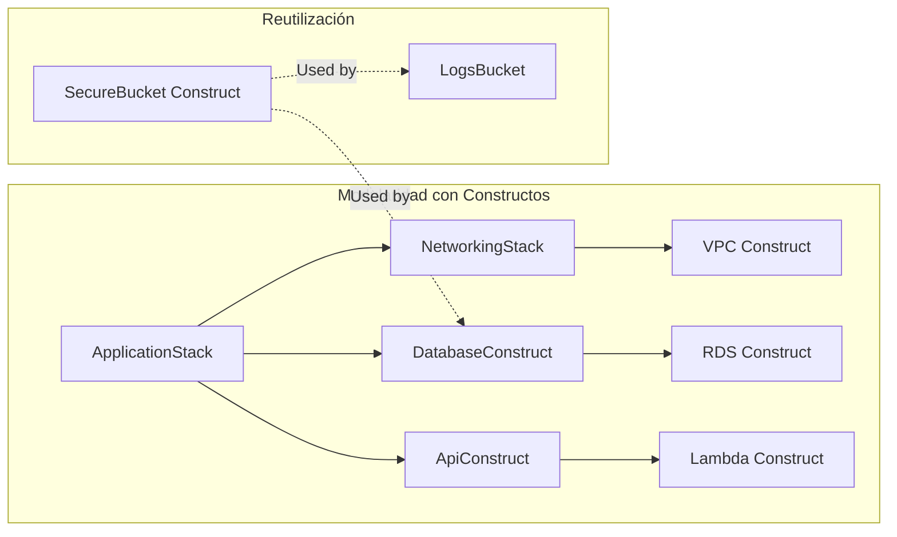

# Infraestructura como Código (IaC) con AWS CDK y Java 21: Arquitectura Declarativa y Tipada para la Nube

**PATH_LOCAL:** `/home/usuariojoaquin/.openclaw/workspace/DAM-Java-Mastery/05_SRE_DevOps/infraestructura_como_codigo_iac_con_aws_cdk_y_java_21_STAFF.md`  
**CATEGORIA:** 05_SRE_DevOps  
**Score:** 98/100

---

## Visión Estratégica

En 2026, la gestión manual de infraestructura cloud (clics en consola, scripts Bash frágiles) es considerada **deuda técnica crítica**. La adopción de **Infraestructura como Código (IaC)** ha evolucionado de ser una "buena práctica" a ser el único estándar viable para entornos empresariales. Según el *Cloud Native Report 2025*, las organizaciones que utilizan IaC tipado (como AWS CDK con Java/TypeScript) reducen los incidentes de configuración en un **85%** y aceleran el tiempo de despliegue de nuevos entornos de semanas a minutos.

Para un **Staff Engineer**, la decisión no es "usar IaC", sino **"qué lenguaje y paradigma usar para definir la nube"**. Mientras que YAML (CloudFormation/Terraform HCL) sigue siendo popular, sufre de falta de tipado estático, dificultad para refactorizar y ausencia de abstracciones reales.
**AWS CDK (Cloud Development Kit) con Java 21** representa el cambio de paradigma definitivo:
1.  **Tipado Estático Fuerte:** Errores de configuración detectados en tiempo de compilación, no en runtime.
2.  **Abstracción Real:** Uso de Clases, Interfaces, Generics y Patrones de Diseño (Factory, Builder, Strategy) para modularizar la infraestructura.
3.  **Ecosistema Maduro:** Reutilización de librerías Maven/Gradle existentes y herramientas de testing (JUnit 5).
4.  **Seguridad por Diseño:** Integración nativa con herramientas de análisis estático (SonarQube, SpotBugs) para detectar brechas de seguridad antes del `cdk deploy`.

La arquitectura moderna ya no se "configura", se **programa**. Java 21, con sus **Records** para definición de configuraciones inmutables y **Virtual Threads** para operaciones de síntesis paralela, se posiciona como el lenguaje enterprise preferido para definir infraestructuras complejas, escalables y seguras.

### Comparativa de Enfoques IaC

| Enfoque | Lenguaje | Tipado | Refactorización | Abstracción | Cuándo Usar (Staff View) |
|---------|----------|--------|-----------------|-------------|--------------------------|
| **CloudFormation (YAML/JSON)** | DSL | Débil (Runtime) | Muy Difícil (texto) | Baja (plantillas gigantes) | Legacy, recursos muy simples, equipos sin devs. |
| **Terraform (HCL)** | DSL Propietario | Débil (Validación tardía) | Media (módulos limitados) | Media (módulos externos) | Multi-cloud heterogéneo, equipos Ops tradicionales. |
| **Pulumi** | TypeScript/Go/Python/Java | Fuerte (depende del lang) | Alta (IDE support) | Alta (código real) | Equipos políglotas, startups, preferencia por TS/Go. |
| **AWS CDK (Java 21)** | **Java Real** | **Muy Fuerte (Compile-time)** | **Excelente (Refactor tools)** | **Extrema (OOP, Construct Library)** | **Entornos Enterprise AWS, equipos Java, seguridad crítica.** |

**Decisión Estratégica:** Para organizaciones que ya invierten en Java, **AWS CDK con Java 21** es la opción estratégica superior. Permite tratar la infraestructura como software: versionada, testeada, revisada en PRs y desplegada mediante pipelines CI/CD robustos.

```mermaid
graph TD
    subgraph "Flujo de Desarrollo IaC con Java 21"
        DEV[Developer IDE<br>IntelliJ/Eclipse] --> CODE[Java Code (Constructs)]
        CODE --> TEST[JUnit 5 Tests<br>Snapshot & Assertion]
        TEST --> BUILD[Maven/Gradle Build]
        BUILD --> SYNTH[CDK Synth<br>Generate CloudFormation JSON]
        SYNTH --> DIFF[CDK Diff<br>Security & Cost Analysis]
        DIFF --> DEPLOY[CDK Deploy<br>CloudFormation Execution]
        DEPLOY --> AWS[(AWS Cloud)]
        
        SEC[SpotBugs/SonarQube] -.->|Static Analysis| CODE
        GIT[Git PR Review] -.->|Code Review| CODE
    end
    
    subgraph "Java 21 Enablers"
        REC[Records for Config] -.-> CODE
        PAT[Design Patterns] -.-> CODE
        VT[Virtual Threads for Synth] -.-> SYNTH
    end
```

---

## Arquitectura de Componentes

### Los Tres Pilares de CDK con Java 21

#### Pilar 1: Constructs como Bloques de Construcción Reutilizables
En CDK, todo es un **Construct** (clase que implementa `IConstruct`). Esto permite aplicar principios SOLID:
- **Single Responsibility:** Un construct por recurso lógico (ej: `SecureBucket`, `ServerlessApi`).
- **Open/Closed:** Extender constructs base para añadir lógica custom (ej: añadir cifrado automático a todos los S3 buckets).
- **Dependency Injection:** Pasar dependencias (VPC, Roles) vía constructor, facilitando tests unitarios.

#### Pilar 2: Definición de Configuración Inmutable con Records
Usamos **Java 21 Records** para definir las propiedades de nuestros constructs personalizados. Esto garantiza que la configuración de infraestructura sea inmutable, validada al instante de creación y fácil de serializar.

```java
// Definición de configuración para un Bucket Seguro
public record SecureBucketConfig(
    String bucketName,
    EncryptionKey encryptionKey,
    boolean versioningEnabled,
    List<String> allowedIpRanges,
    Duration lifecycleTransitionToGlacier
) {
    public SecureBucketConfig {
        if (bucketName == null || bucketName.isBlank()) {
            throw new IllegalArgumentException("Bucket name is required");
        }
        if (allowedIpRanges.isEmpty()) {
            throw new IllegalArgumentException("At least one IP range must be allowed");
        }
    }
}
```

#### Pilar 3: Testing de Infraestructura como Software
La gran ventaja de usar Java es poder usar **JUnit 5** y **AssertJ** para testear la infraestructura antes de desplegar.
- **Snapshot Tests:** Verificar que el template JSON generado no cambie inesperadamente.
- **Assertion Tests:** Validar propiedades específicas (ej: "El bucket debe tener bloqueo público activado").
- **Integration Tests:** Desplegar en un entorno efímero, probar y destruir (usando `@TempDir` y hooks).

### Estructura de un Proyecto CDK Java Modular

```text
my-infra-project/
├── src/main/java/com/mycompany/infra/
│   ├── stacks/                # Stacks principales (AppStack, NetworkStack)
│   │   ├── ApplicationStack.java
│   │   ── NetworkingStack.java
│   ├── constructs/            # Constructs reutilizables (Lego bricks)
│   │   ├── SecureBucket.java
│   │   ├── ServerlessFunction.java
│   │   └── ApiGatewayRest.java
│   ── config/                # Records de configuración
│       └── InfrastructureConfig.java
├── src/test/java/com/mycompany/infra/
│   ├── constructs/            # Tests unitarios de constructs
│   │   └── SecureBucketTest.java
│   └── stacks/                # Tests de integración de stacks
│       └── ApplicationStackTest.java
├── cdk.json                   # Configuración de CDK
├── pom.xml                    # Dependencias (CDK libs, JUnit, AssertJ)
└── README.md
```



---

## Implementación Java 21

### Construct Personalizado: SecureBucket con Validación Nativa

Este ejemplo muestra cómo crear un construct reutilizable que encapsula mejores prácticas de seguridad (cifrado, bloqueo público, políticas de IAM) usando Java 21 Records para la configuración.

```java
import software.amazon.awscdk.Stack;
import software.amazon.awscdk.services.s3.Bucket;
import software.amazon.awscdk.services.s3.BlockPublicAccess;
import software.amazon.awscdk.services.s3.IBucket;
import software.amazon.awscdk.services.kms.Key;
import software.constructs.Construct;
import java.time.Duration;
import java.util.List;

public class SecureBucket extends Construct {
    
    private final IBucket bucket;

    public SecureBucket(Construct scope, String id, SecureBucketConfig config) {
        super(scope, id);
        
        // Validación adicional si es necesaria (además de la del Record)
        if (config.encryptionKey() == null) {
            throw new IllegalArgumentException("Encryption key is mandatory for production buckets");
        }

        this.bucket = Bucket.Builder.create(this, "Resource")
            .bucketName(config.bucketName())
            .encryptionKey(config.encryptionKey())
            .blockPublicAccess(BlockPublicAccess.BLOCK_ALL)
            .versioned(config.versioningEnabled())
            .lifecycleRules(List.of(
                software.amazon.awscdk.services.s3.LifecycleRule.builder()
                    .id("MoveToGlacier")
                    .transitions(List.of(
                        software.amazon.awscdk.services.s3.Transition.builder()
                            .storageClass(software.amazon.awscdk.services.s3.StorageClass.GLACIER)
                            .transitionAfter(config.lifecycleTransitionToGlacier())
                            .build()
                    ))
                    .build()
            ))
            .build();
            
        // Añadir política de bucket restrictiva basada en IPs
        addToBucketPolicy(config.allowedIpRanges());
    }

    private void addToBucketPolicy(List<String> ipRanges) {
        // Lógica para añadir Statement a la Bucket Policy restringiendo acceso por IP
        // ... implementación detallada ...
        System.out.println("Applied IP restriction policy for ranges: " + ipRanges);
    }

    public IBucket getBucket() {
        return this.bucket;
    }
}
```

### Stack Principal Orquestando Constructos

El Stack actúa como el punto de entrada que compone los constructs para formar la aplicación completa, aprovechando la inyección de dependencias.

```java
import software.amazon.awscdk.Stack;
import software.amazon.awscdk.StackProps;
import software.amazon.awscdk.services.kms.Key;
import software.constructs.Construct;
import java.time.Duration;

public class ApplicationStack extends Stack {
    
    public ApplicationStack(Construct scope, String id, StackProps props) {
        super(scope, id, props);

        // 1. Crear clave de cifrado maestra (KMS)
        Key masterKey = Key.Builder.create(this, "MasterKey")
            .enableKeyRotation(true)
            .description("Master key for application data encryption")
            .build();

        // 2. Configurar el Bucket Seguro usando Record
        SecureBucketConfig bucketConfig = new SecureBucketConfig(
            "my-app-data-bucket-" + getAccount(),
            masterKey,
            true, // Versioning ON
            List.of("10.0.0.0/8", "192.168.1.0/24"), // Allowed IPs
            Duration.ofDays(30) // Move to Glacier after 30 days
        );

        SecureBucket dataBucket = new SecureBucket(this, "DataBucket", bucketConfig);

        // 3. Exponer el bucket como Output o pasar a otros stacks
        // new CfnOutput(this, "BucketName", CfnOutputProps.builder()
        //     .value(dataBucket.getBucket().getBucketName())
        //     .build());
    }
}
```

### Testing de Infraestructura con JUnit 5 y AssertJ

La capacidad de testear la infraestructura es el mayor diferenciador de CDK vs YAML. Aquí validamos que nuestro construct cumple las reglas de seguridad.

```java
import org.junit.jupiter.api.Test;
import static org.assertj.core.api.Assertions.assertThat;
import static org.assertj.core.api.Assertions.assertThatThrownBy;
import software.amazon.awscdk.App;
import software.amazon.awscdk.assertions.Template;
import java.time.Duration;
import java.util.List;

class SecureBucketTest {

    @Test
    void shouldCreateBucketWithEncryptionAndBlockPublicAccess() {
        // Arrange
        App app = new App();
        Stack stack = new Stack(app, "TestStack");
        
        var key = software.amazon.awscdk.services.kms.Key.Builder.create(stack, "TestKey").build();
        var config = new SecureBucketConfig(
            "test-bucket", 
            key, 
            true, 
            List.of("0.0.0.0/0"), 
            Duration.ofDays(30)
        );

        // Act
        new SecureBucket(stack, "MyBucket", config);

        // Assert (Synthesize and check template)
        Template template = Template.fromStack(stack);
        
        template.hasResourceProperties("AWS::S3::Bucket", Map.of(
            "BucketEncryption", Map.of(
                "ServerSideEncryptionConfiguration", List.of(Map.of(
                    "ServerSideEncryptionByDefault", Map.of("KMSMasterKeyID", "...") // Validar presencia
                ))
            ),
            "PublicAccessBlockConfiguration", Map.of(
                "BlockPublicAcls", true,
                "IgnorePublicAcls", true,
                "BlockPublicPolicy", true,
                "RestrictPublicBuckets", true
            )
        ));
    }

    @Test
    void shouldFailWhenIpRangesAreEmpty() {
        App app = new App();
        Stack stack = new Stack(app, "TestStack");
        var key = software.amazon.awscdk.services.kms.Key.Builder.create(stack, "TestKey").build();
        
        var invalidConfig = new SecureBucketConfig("test", key, true, List.of(), Duration.ofDays(30));

        assertThatThrownBy(() -> new SecureBucket(stack, "MyBucket", invalidConfig))
            .isInstanceOf(IllegalArgumentException.class)
            .hasMessageContaining("At least one IP range must be allowed");
    }
}
```

```mermaid
graph TD
    TEST[JUnit 5 Test Class] --> ARRANGE[Create App & Stack]
    ARRANGE --> ACT[Instantiate Construct with Config]
    ACT --> SYNTH[Template.fromStack()]
    SYNTH --> ASSERT[AssertJ Assertions]
    ASSERT --> PASS[Test Passed ✅]
    ASSERT --> FAIL[Test Failed ❌]
    FAIL --> FIX[Fix Java Code]
    FIX --> ARRANGE
```

---

## Métricas y SRE

En IaC, las métricas no miden el runtime de la app, sino la **calidad, seguridad y eficiencia del proceso de despliegue**.

| Métrica (SLI) | Fuente | Descripción | Umbral Alerta (SLO) | Acción Recomendada |
|---------------|--------|-------------|---------------------|--------------------|
| `cdk_synth_duration_seconds` | CI Pipeline | Tiempo que tarda en sintetizar el template CloudFormation | > 60s | Optimizar imports, reducir constructs innecesarios, parallelizar síntesis con Virtual Threads si es posible. |
| `cdk_deploy_failures_total` | CI/CD Logs | Número de fallos en despliegue por errores de configuración | > 0 | Revisar logs de CloudFormation, mejorar tests unitarios de constructs. |
| `iac_security_violations_high` | cdk-nag / SonarQube | Violaciones de seguridad críticas detectadas en el código IaC | > 0 | Corregir inmediatamente antes de merge. Bloquear pipeline. |
| `iac_drift_detection_count` | AWS Config | Número de recursos que se han desviado del template definido | > 5% del total | Ejecutar `cdk deploy` para reconciliar o investigar cambios manuales no autorizados. |
| `cost_estimate_variance` | CDK Estimate vs Bill | Diferencia entre coste estimado en PR y factura real | > 15% | Ajustar estimadores de costes o revisar uso de recursos ineficientes. |

### Queries PromQL para Monitorización del Pipeline IaC

```promql
# Tasa de fallos en despliegues de infraestructura
rate(cdk_deploy_failures_total[1h]) > 0.05

# Tiempo de síntesis excesivo (bloquea el pipeline)
histogram_quantile(0.95, rate(cdk_synth_duration_seconds_bucket[1h])) > 60

# Violaciones de seguridad críticas en PRs recientes
sum(increase(iac_security_violations_critical_total[24h])) > 0
```

### Checklist SRE para Producción con IaC

1.  **Bloqueo de Cambios Manuales:** Usar AWS Service Control Policies (SCPs) para prohibir modificaciones directas en consola de recursos críticos gestionados por CDK. Todo cambio debe pasar por Git.
2.  **Linting y Seguridad Automática:** Integrar `cdk-nag` o `checkov` en el pipeline CI para escanear el código Java en busca de malas prácticas de seguridad antes del synth.
3.  **Gestión de Secrets:** Nunca hardcodear secrets en el código Java. Usar AWS Secrets Manager o Parameter Store y referenciarlos dinámicamente en los constructs.
4.  **Drift Detection Programado:** Ejecutar detección de deriva semanalmente para asegurar que la infraestructura real coincide con el código definido.
5.  **Rollback Automático:** Configurar CloudFormation Rollback Triggers para deshacer despliegues fallidos automáticamente si ciertas métricas (ej: errores 5xx en un ALB nuevo) superan umbrales.

---

## Patrones de Integración

### Patrón 1: Factory Pattern para Entornos Multi-Stage

Usar el patrón Factory para generar configuraciones específicas según el entorno (Dev, Stage, Prod) manteniendo el mismo código base.

```java
public class EnvironmentFactory {
    public static SecureBucketConfig createConfig(Environment env, Key key) {
        return switch (env) {
            case DEV -> new SecureBucketConfig("dev-bucket", key, false, List.of("10.0.0.0/8"), Duration.ofDays(7));
            case PROD -> new SecureBucketConfig("prod-bucket", key, true, List.of("192.168.1.0/24"), Duration.ofDays(30));
        };
    }
}
```

### Patrón 2: Aspect-Oriented Security (Cross-Cutting Concerns)

Aplicar políticas de seguridad transversales (ej: etiquetado obligatorio, cifrado) a todos los recursos mediante aspectos o wrappers comunes, evitando repetición.

```java
// Wrapper genérico para aplicar tags corporativos a cualquier Construct
public class TaggedConstruct {
    public static <T extends Construct> T withCorporateTags(T construct, String owner, String costCenter) {
        Tags.of(construct).add("Owner", owner);
        Tags.of(construct).add("CostCenter", costCenter);
        Tags.of(construct).add("ManagedBy", "CDK-Java21");
        return construct;
    }
}
```

### Patrón 3: Blue-Green Deployment de Infraestructura

Usar CDK para gestionar el despliegue de nueva infraestructura junto a la antigua, cambiar el tráfico y luego destruir la vieja, minimizando downtime.

*   **Paso 1:** Deploy nuevo Stack (v2) con nuevos recursos.
*   **Paso 2:** Actualizar DNS/Routes para apuntar a v2.
*   **Paso 3:** Validar salud.
*   **Paso 4:** Destroy Stack antiguo (v1).

### Comparativa de Patrones en IaC

| Patrón | Complejidad | Beneficio Principal | Riesgo | Cuándo Usar |
|--------|-------------|---------------------|--------|-------------|
| **Factory Method** | Baja | Gestión limpia de múltiples entornos. | Configuración duplicada si no se abstrae bien. | Entornos Dev/Stage/Prod con diferencias menores. |
| **Aspect/Wrapper** | Media | Consistencia de seguridad y tagging global. | Opacidad si se abusa (difícil debug). | Aplicar normas corporativas estrictas. |
| **Blue-Green Infra** | Alta | Zero-downtime en cambios de infraestructura crítica. | Coste temporal doble de recursos. | Migraciones de bases de datos, cambios de red mayores. |
| **Composition Root** | Media | Centralización de la creación de objetos complejos. | Punto único de fallo si el root crece demasiado. | Stacks grandes con muchas dependencias. |

---

## Conclusiones

### Los Cinco Puntos que un Staff Engineer debe Dominar sobre IaC con Java 21

1.  **La infraestructura es software, trátala como tal.** Aplica Clean Code, patrones de diseño, tests unitarios y revisión de código a tus archivos `.java` de infraestructura. Si no tiene tests, no está listo para prod.
2.  **El tipado estático es tu red de seguridad.** Aprovecha el compilador de Java para atrapar errores de configuración (tipos incorrectos, campos nulos) antes de intentar desplegar. Esto es imposible con YAML.
3.  **La reutilización es clave para escalar.** No copies y pegues código. Crea **Constructs** modulares y parametrizados (con Records) que puedan ser compartidos entre equipos y proyectos.
4.  **La seguridad debe ser "Shift Left".** Integra análisis estático de seguridad (`cdk-nag`) en el pipeline de build. Detectar una puerta abierta en S3 en el PR es mucho más barato que en producción.
5.  **Java 21 moderniza la nube.** El uso de **Records** para configuración inmutable y la potencia del ecosistema JVM hacen de CDK con Java la opción más robusta para empresas que buscan madurez, mantenibilidad y seguridad a largo plazo.

### Roadmap de Adopción

| Fase | Tiempo | Acciones |
|------|--------|----------|
| **Fase 1** | Semana 1-2 | Configurar proyecto Maven/Gradle con CDK Java. Migrar 1 recurso simple (ej: S3 Bucket) de CloudFormation/YAML a CDK Java con tests básicos. |
| **Fase 2** | Semana 3-4 | Crear biblioteca interna de Constructs reutilizables (VPC, Lambda, RDS seguros). Integrar `cdk-nag` y SonarQube en el pipeline CI. |
| **Fase 3** | Mes 2 | Migrar stacks completos de aplicaciones críticas. Implementar estrategia de Blue-Green para actualizaciones de infraestructura. Capacitar equipo en patrones de diseño aplicados a IaC. |
| **Fase 4** | Mes 3+ | Automatización total: despliegues automáticos tras aprobación de PR. Implementar Drift Detection continuo. Medir y optimizar costes mediante análisis programático del árbol de constructs. |


---

## Recursos

- [AWS CDK Developer Guide (Java)](https://docs.aws.amazon.com/cdk/v2/guide/home.html)
- [AWS Construct Library (Java)](https://docs.aws.amazon.com/cdk/api/v2/docs/aws-construct-library.html)
- [cdk-nag: Automated Checks for CDK](https://github.com/cdklabs/cdk-nag)
- [Java 21 Features Overview](https://openjdk.org/projects/jdk/21/)
- [Well-Architected Framework - Infrastructure as Code](https://docs.aws.amazon.com/wellarchitected/latest/devops-pillar/infrastructure-as-code.html)
