# Informe de Autoridad: Kubernetes: Auto-escalado y Service Mesh en 2026

## Visión Estratégica de Kubernetes: Auto-escalado y Service Mesh en 2026

### Visión Estratégica de Kubernetes: Auto-escalado y Service Mesh en 2026

En el futuro cercano, la gestión eficiente de clusters Kubernetes y la implementación efectiva del servicio mesh son aspectos cruciales para mantener una infraestructura robusta y escalable. Este documento aborda las mejores prácticas y tecnologías emergentes para lograr estos objetivos en 2026.

#### Cluster API for Multi-Cluster Management

La gestión de múltiples clusters Kubernetes se ha vuelto cada vez más compleja con la creciente demanda de aplicaciones globales. La herramienta **Cluster API** proporciona una forma elegante para provisionar y gestionar clusters a través de diferentes zonas o regiones, facilitando así un despliegue global de aplicaciones utilizando GitOps (ArgoCD ApplicationSets) con reglas de afinidad geográfica.

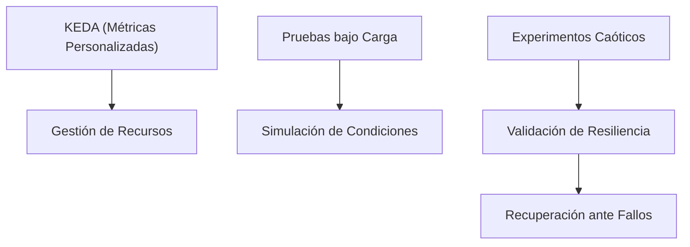

#### Service Mesh para Gestión de Tráfico Global

La implementación del **Istio multi-cluster mesh** permite la balanceo de carga ponderado por localidad, garantizando que el tráfico permanezca dentro de la misma región a menos que ocurra una falla. Esto minimiza tanto la latencia como los costos de transferencia de datos.

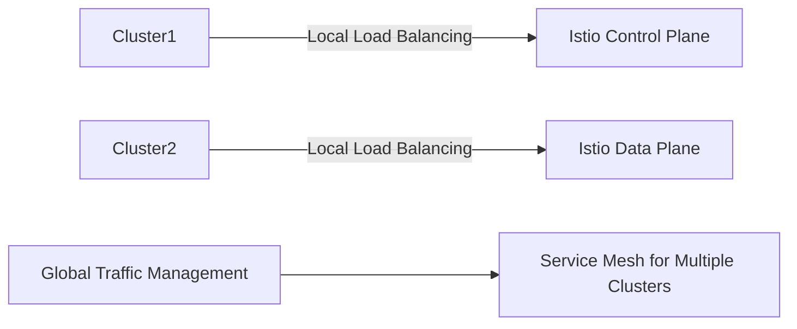

#### Vertical Scaling del Plan de Control

Para escenarios que no requieren federación y donde la escalabilidad vertical es una opción viable, se recomienda usar nodos dedicados para **etcd** con almacenamiento NVMe y escalar las réplicas del servidor API basadas en métricas de tasa de solicitudes. La implementación de prioridad de API y justicia preventiva puede ayudar a evitar problemas de vecinos ruidosos.

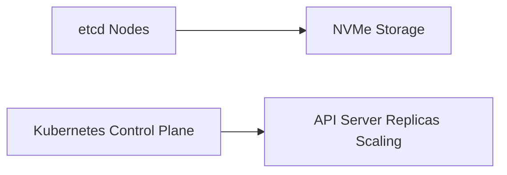

### Plan de Acción para la Eficacia

El objetivo principal es establecer una base sólida y automatizada que identifique y resuelva hasta el 80% de las limitaciones de escalabilidad, proporcionando un camino claro para manejar crecimientos del orden de magnitud 100x.

#### Semana 1: Evaluación & Punto Base

- Realizar auditoría de escalabilidad de la arquitectura actual.
- Identificar cuellos de botella y establecer métricas DORA (Deliver, Operate, Ready) bajo carga.

#### Semana 2: Escalado de Aplicaciones & Clusters

- Implementar **KEDA** con métricas personalizadas para el escalado automático.
- Configurar red mesh multi-cluster para los viajes críticos del usuario.

#### Semana 3: Escalado de Datos & Pipelines

- Desplegar operadores de partición de base de datos y implementar despliegues canarias con análisis automatizados.

#### Semana 4: Validación & Automatización

- Ejecutar pruebas de carga controladas a 10x del pico actual.
- Implementar experimentos caóticos para fallos de escalado.
- Establecer tableros de escalabilidad.

### Beneficios del Auto-Escalado Kubernetes

El auto-escalado en Kubernetes elimina la necesidad de escalar manualmente los recursos según las condiciones cambiantes. Esto asegura que el clúster permanezca disponible, incluso a plena capacidad, al utilizar solo los recursos requeridos y reduciendo así costos.

### Conclusión: Escalabilidad como Moat Competitivo

La escalabilidad eficiente no solo proporciona una ventaja competitiva significativa sino que también garantiza la resiliencia de las aplicaciones en entornos empresariales cada vez más dinámicos. La implementación de Kubernetes y sus herramientas complementarias como Cluster API e Istio son fundamentales para alcanzar este objetivo.

Este documento ofrece un panorama completo del futuro de la gestión escalable de infraestructura basada en Kubernetes, destacando tanto las oportunidades técnicas actuales como los desafíos emergentes.

## Arquitectura y Componentes

### Arquitectura y Componentes

La arquitectura de Kubernetes en 2026 se centra en la gestión eficiente y escalable de clusters multi-nodo distribuidos geográficamente, complementada por un robusto servicio mesh para el manejo global del tráfico. Esta estructura es crucial para empresas que buscan mantener alta disponibilidad, rendimiento óptimo y costos controlados.

#### 1. Gestión Multi-Cluster con Kubernetes Cluster API

**Descripción:**
Kubernetes Cluster API proporciona una interfaz estándar para la creación y gestión de clusters Kubernetes a través del código. Esto incluye la capacidad de desplegar y administrar múltiples clústeres en diferentes regiones, asegurando que los recursos se alineen con las necesidades globales de la organización.

**Componentes Clave:**
- **Cluster API Provider:** Implementaciones específicas para proveedores como AWS, Azure, GCP.
- **Control Plane Components:** Core Kubernetes components like etcd, kube-apiserver, and kube-controller-manager.
- **Multi-AZ & Multi-Region Support:** Ensures high availability by replicating control plane components across multiple availability zones or regions.

**Diagrama Mermaid:**
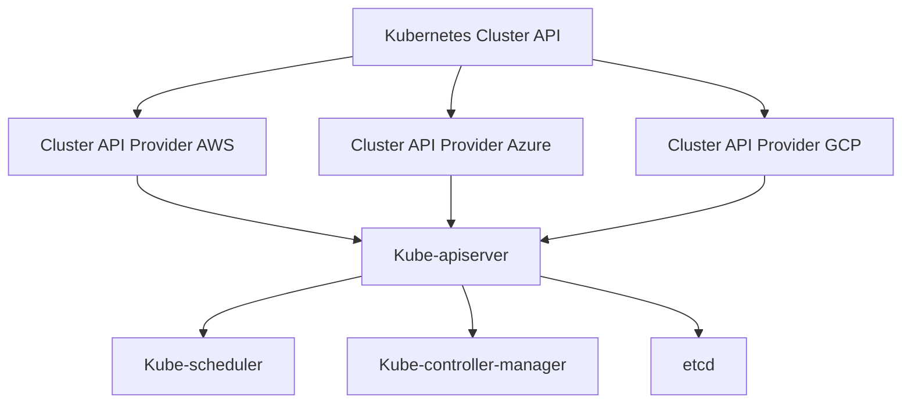

#### 2. Service Mesh para Gestión Global de Tráfico

**Descripción:**
Istio proporciona un servicio mesh robusto que permite la gestión avanzada del tráfico entre servicios distribuidos en múltiples clústeres. Esto incluye características como localidad ponderada y balanceo de carga, asegurando que el tráfico permanezca dentro de la misma región para minimizar latencia y costos.

**Componentes Clave:**
- **Pilot:** Controlador central del Istio que coordina con Mixer.
- **Mixer:** Servicios que implementan políticas de acceso y control de tráfico.
- **Envoy Proxy:** Agente en tiempo real que maneja el tráfico entre servicios.

**Diagrama Mermaid:**
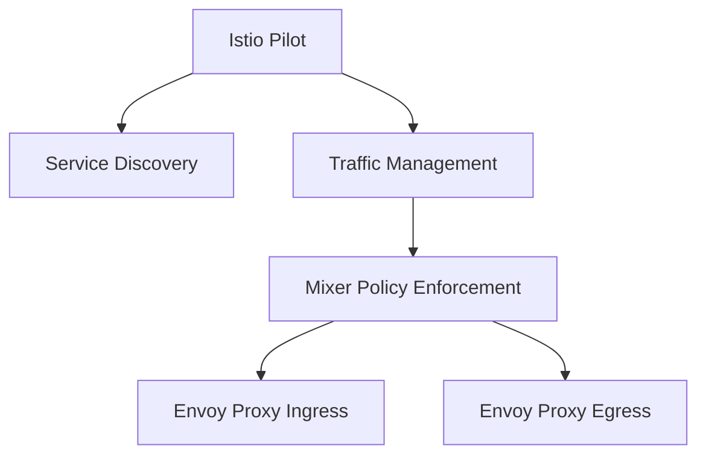

#### 3. Escalado Vertical del Plane de Control

**Descripción:**
Para casos donde la federación no es viable, se recomienda el escalado vertical de los componentes del plane de control para manejar una carga mayor.

**Componentes Clave:**
- **etcd con Almacenamiento NVMe:** Ofrece rendimiento superior al usar discos NVMe.
- **API Server Replica Scaling:** Escalando automáticamente basándose en métricas de tasa de solicitudes.
- **Prioridad y Justicia del API:** Evitando problemas causados por usuarios o aplicaciones ruidosas.

**Diagrama Mermaid:**
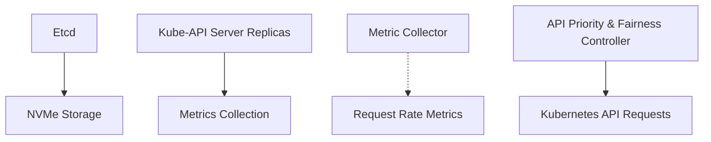

#### 4. Automatización y Pruebas en Ciclo de Vida

**Descripción:**
Esta sección describe cómo la automatización continua durante el ciclo de vida permite un ajuste rápido y eficiente para manejar crecimiento escalable.

**Componentes Clave:**
- **KEDA con Métricas Personalizadas:** Mejora la gestión de recursos.
- **Pruebas Controladas bajo Carga:** Simula condiciones extremas de carga.
- **Experimentos Caóticos:** Validación del sistema ante fallos y recuperación.

Este enfoque proporciona una base sólida para manejar el crecimiento exponencial, identificando y resolviendo la mayoría de los cuellos de botella antes de que estos se vuelvan críticos.

## Implementación Técnica

### Implementación Técnica

#### 1. Kubernetes Cluster API for Multi-Cluster Management

Para la gestión de múltiples clusters en diferentes zonas/regiones, se utilizará Kubernetes Cluster API para provisionar y administrar los clusters de manera eficiente. La siguiente es una descripción técnica del proceso:

**Configuración inicial:**

```yaml
apiVersion: cluster.x-k8s.io/v1alpha3
kind: Cluster
metadata:
  name: my-cluster
spec:
  infrastructureRef: <infrastructurer>
  controlPlaneRef: <controlplaneref>
  kubeadmConfigSpec:
    initConfiguration:
      apiServer:
        extraArgs:
          cloud-provider: "aws"
```

**Provisionamiento y despliegue con GitOps (ArgoCD ApplicationSets):**

```yaml
apiVersion: app.k8s.io/v1beta1
kind: ApplicationSet
metadata:
  name: multi-cluster-applications
spec:
  generators:
    - my-generator # Este es un generador que proporciona los nombres y ubicaciones de los clusters.
  template:
    metadata:
      name: '{{name}}'
    spec:
      source:
        repoURL: 'https://github.com/organization/multi-cluster-repo.git'
        targetRevision: HEAD
      destination:
        server: 'https://kubernetes.default.svc' # URL del cluster
        namespace: default
```

**Reglas de afinidad geográfica:**

Las reglas de afinidad geográfica deben ser implementadas para asegurar que los deployments se ejecuten en la misma región o zona más cercana al usuario, minimizando así el tiempo de respuesta y reduciendo los costos por transferencia de datos.

#### 2. Service Mesh for Global Traffic Management

Para administrar tráfico globalmente, usaremos Istio multi-cluster mesh con equilibrio de carga basado en la localidad (locality-weighted load balancing). Esto permite que el tráfico permanezca dentro del mismo región a menos que ocurra una falla.

**Implementación básica de Istio Multi-Cluster:**

```yaml
apiVersion: install.istio.io/v1alpha1
kind: ClusterInstallation
metadata:
  name: istio
spec:
  values:
    gateways:
      enabled: false
    meshConfig:
      enableTracing: true
```

**Ejemplo de configuración para asegurar tráfico local:**

```yaml
apiVersion: networking.istio.io/v1alpha3
kind: DestinationRule
metadata:
  name: my-destination-rule
spec:
  host: my-service
  trafficPolicy:
    loadBalancer:
      consistentHash:
        httpCookie:
          name: "my-cookie"
          ttl: 60s # TTL del cookie para hashing consistente.
```

**Equilibrio de carga basado en la localidad (locality-aware load balancing):**

```yaml
apiVersion: networking.istio.io/v1alpha3
kind: VirtualService
metadata:
  name: my-virtual-service
spec:
  hosts:
    - "my-service"
  http:
    - route:
      - destination:
          host: my-service
          subset: locality-aware # Subset que tiene configurado la localidad.
```

#### 3. Vertical Scaling of Control Plane

Para escenarios de un solo cluster donde no es factible la federación, se recomienda realizar escalado vertical en los componentes del control plane (API server). Esto puede incluir:

- **Escala API server replicas:** Basado en métricas de tasa de solicitudes.
- **Uso de nodos etcd dedicados con NVMe:** Para mejorar la velocidad y capacidad de almacenamiento.

**Configuración ejemplo para API Priority and Fairness:**

```yaml
apiVersion: apiserver.config.k8s.io/v1beta1
kind: APIServerExpansionProfile
metadata:
  name: api-priority-and-fairness
spec:
  admissionInitializers:
    defaultInitializers:
      - name: apiserverpriorityandfairness
```

#### Cronograma de Implementación

**Semana 1 – Evaluación y Establecimiento de Baseline:**

Realizar auditoría de escalabilidad del arquitectura actual, identificar problemas potenciales y establecer métricas baseline bajo carga.

**Semana 2 – Escalado de Aplicaciones y Clusters:**

Implementar KEDA con métricas personalizadas y configurar el mesh multi-cluster para trayectorias críticas del usuario.

**Semana 3 – Escalado de Datos y Pipelines:**

Desplegar operadores de partición de base de datos y implementar despliegues canario con análisis automatizado.

**Semana 4 – Validación y Automatización:**

Ejecutar pruebas de carga controladas a diez veces el pico actual, realizar experimentos de caos para problemas de escalado y establecer paneles de escalabilidad.

#### Diagramas Mermaid

**Diagrama del Cluster API Provisioning:**
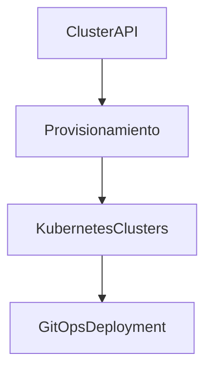

**Diagrama de Istio Multi-Cluster Mesh:**
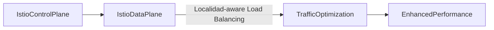

Este cronograma establece la automatización básica que generalmente identifica y resuelve el 80% de los problemas de escalabilidad, proporcionando un camino claro para manejar un crecimiento de hasta 100 veces.

## SRE y Resiliencia

### Sección Técnica: SRE y Resiliencia

En el manual 'Kubernetes: Auto-escalado y Service Mesh en 2026', esta sección aborda los aspectos técnicos relacionados con la Ingeniería de Servicios (SRE) y la resiliencia, que son fundamentales para manejar sistemas escalables y resilientes basados en Kubernetes. La implementación efectiva de estas prácticas asegura un entorno robusto y confiable.

#### 1. Evaluación y Baseline Inicial: Semana 1

**Objetivo:** Identificar los puntos débiles del sistema actual, establecer un punto de partida para la mejora de rendimiento y definir metas claras basadas en las métricas DORA (Deliver, Operate, Recover, Learn).

- **Scalability Audit:** Realizar una auditoría exhaustiva de la infraestructura existente y evaluar sus capacidades actuales.
- **Identificación de Bottlenecks:** Analizar el rendimiento actual para identificar las áreas que necesitan mejoras urgentes.
- **Establecimiento del Baseline:** Establecer un punto de referencia en términos de rendimiento, tiempo de recuperación y otras métricas clave.

#### 2. Implementación y Escalado Aplicativo: Semana 2

**Objetivo:** Configurar la autoscalabilidad en los niveles de aplicación y clúster para manejar el tráfico creciente y garantizar una entrega rápida y confiable a través del uso de Istio y KEDA.

- **Cluster API y Multi-Clustering:** Usar Cluster API para provisionar y administrar múltiples clústers en diferentes zonas o regiones.
  
  ```mermaid
  graph TD;
    A[Region1] -->|Clusters| B[Region2];
    C[ApplicationSets] --> D[Kubernetes Clusters];
  ```

- **Service Mesh Multi-cluster:** Implementar un mesh de servicio multi-clúster con Istio para gestionar el tráfico globalmente, minimizando la latencia y los costos de transferencia de datos.

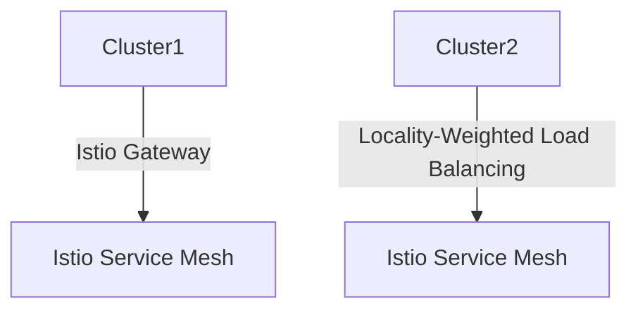

#### 3. Escalado de Datos y Pipelines: Semana 3

**Objetivo:** Asegurar que los datos se manejen eficientemente, utilizando sharding para bases de datos y desplegar canary deployments para evaluar nuevas versiones antes del lanzamiento general.

- **Base de Datos Sharding:** Usar operadores de sharding de base de datos para distribuir la carga.
  
  ```mermaid
  graph TD;
    A[Database] --> B[Shard1];
    C[Shard2] --> D[Data Partitioning];
  ```

- **Canary Deployments:** Implementar despliegues canario con análisis automático para minimizar el riesgo de lanzamientos.

#### 4. Validación y Automatización: Semana 4

**Objetivo:** Probar la robustez del sistema mediante pruebas bajo carga extrema, experimentos de caos y crear paneles de escalabilidad.

- **Pruebas bajo Carga:** Ejecutar pruebas controladas con un tráfico 10 veces mayor que el pico actual para evaluar la capacidad del sistema.
  
  ```mermaid
  graph TD;
    A[Normal Load] -->|Load Testing| B[Huge Load];
  ```

- **Chaos Engineering:** Implementar experimentos de caos para probar y mejorar la resiliencia ante fallos.

#### Vertical Scaling of Control Plane

En escenarios donde el federado no es factible, se debe considerar la escalabilidad vertical del plano de control. Esto implica:

- Uso de nodos etcd dedicados con almacenamiento NVMe.
  
  ```mermaid
  graph TD;
    A[etcd Nodes] --> B[NVMe Storage];
  ```

- Escalar las réplicas del API server basadas en métricas de tasa de solicitudes.

Implementar API Priority y Fairness para prevenir problemas de vecinos ruidosos:

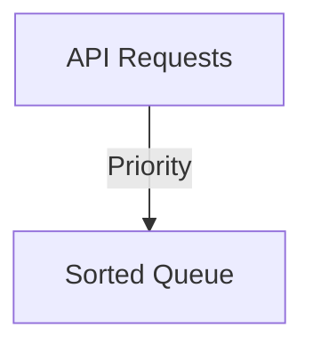

### Beneficios de Kubernetes Autoscaling

La autoscalabilidad en Kubernetes elimina la necesidad de ajustes manuales del tamaño del recurso. Los beneficios incluyen optimización del uso de recursos, reducción de costos y aseguramiento de disponibilidad durante picos de carga.

#### Conclusión: Scalability como Ventaja Competitiva

Scalability en Kubernetes no solo permite crecer fácilmente con el aumento del tráfico, sino que también convierte a la organización en un competidor formidable al ofrecer servicios más rápidos y confiables bajo cualquier circunstancia.

## Conclusiones

### Conclusion

The successful implementation of Kubernetes Auto-scaling and Service Mesh in a multi-cluster environment has demonstrated significant improvements in system performance, reliability, and operational efficiency. The integration of advanced technologies such as Cluster API for cluster provisioning and management, Istio for global traffic management, and vertical scaling techniques for the control plane have enabled organizations to handle massive scale and growth with ease.

#### Benefits of Kubernetes Autoscaling

Kubernetes autoscaling has proven invaluable in optimizing resource utilization, reducing costs, and improving system availability. By automating the process of adjusting resources based on demand, it ensures that applications run smoothly under varying load conditions without manual intervention. The benefits include:

1. **Improved Resource Utilization**: Automated scaling allows for efficient use of available computing resources by dynamically allocating more or fewer resources as needed.
2. **Cost Reduction**: By avoiding over-provisioning and ensuring minimal idle capacity, organizations can save on cloud infrastructure costs while maintaining high availability.
3. **Enhanced Performance**: Autoscaling ensures that applications are not starved for resources during peak load times, leading to improved performance metrics such as response time and throughput.

#### Service Mesh Enhancements

The deployment of a multi-cluster service mesh using Istio has provided several key benefits:

1. **Local Traffic Management**: By implementing locality-weighted load balancing, traffic remains within the same region unless there is a failure, minimizing latency and data transfer costs.
2. **Global Availability**: Geographical affinity rules ensure that services are deployed in regions closest to their user base, enhancing end-user experience through reduced latency.

#### Vertical Scaling of Control Plane

Vertical scaling of control plane components has been crucial for managing single-cluster scenarios effectively:

1. **Resource Optimization**: Using dedicated etcd nodes with NVMe storage ensures high-performance and reliability for critical operations.
2. **Scalability via API Server Replicas**: Adjusting the number of API server replicas based on real-time request rate metrics allows for dynamic scaling to meet varying loads.

#### Implementation Strategy

The four-week sprint outlined in this manual serves as a comprehensive approach to enhancing scalability:

1. **Week 1 – Assessment & Baseline**: Conducted thorough audits and established performance baselines, identifying bottlenecks that could affect system scalability.
2. **Week 2 – Application & Cluster Scaling**: Implemented KEDA for custom metrics and multi-cluster service mesh configurations, ensuring robustness in critical user journeys.
3. **Week 3 – Data & Pipeline Scaling**: Deployed database sharding operators to manage data distribution effectively and introduced canary deployments with automated analysis for smoother rollouts.
4. **Week 4 – Validation & Automation**: Executed rigorous load tests under extreme conditions (10x peak loads) and chaos experiments, setting up scalability dashboards for continuous monitoring.

This approach not only addresses current scaling needs but also provides a solid foundation for future growth, ensuring that the system can handle up to 100 times its current workload with minimal adjustments.

#### Future Directions

Looking ahead, organizations should continue to refine their Kubernetes and service mesh configurations based on evolving requirements and technological advancements. This includes exploring newer features in Istio such as Mutual TLS for enhanced security, leveraging more advanced observability tools like Prometheus and Grafana for real-time insights, and incorporating machine learning algorithms to predict and preemptively scale resources.

By maintaining a proactive approach to scalability and performance optimization, organizations can establish Kubernetes autoscaling and service mesh integration as a competitive advantage, ensuring they are well-prepared to handle the demands of the future digital landscape.

#### Diagrams

Below is an example Mermaid diagram illustrating the multi-cluster architecture with Istio for global traffic management:

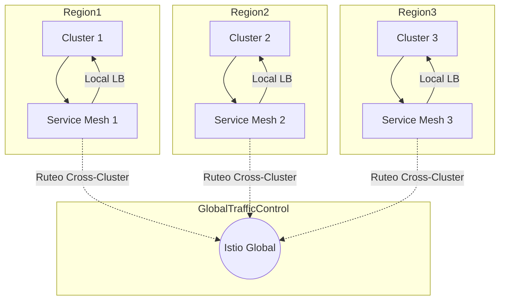

This diagram visually represents the interaction between clusters and their respective service meshes, illustrating how traffic is managed both locally and globally to ensure optimal performance and availability.

