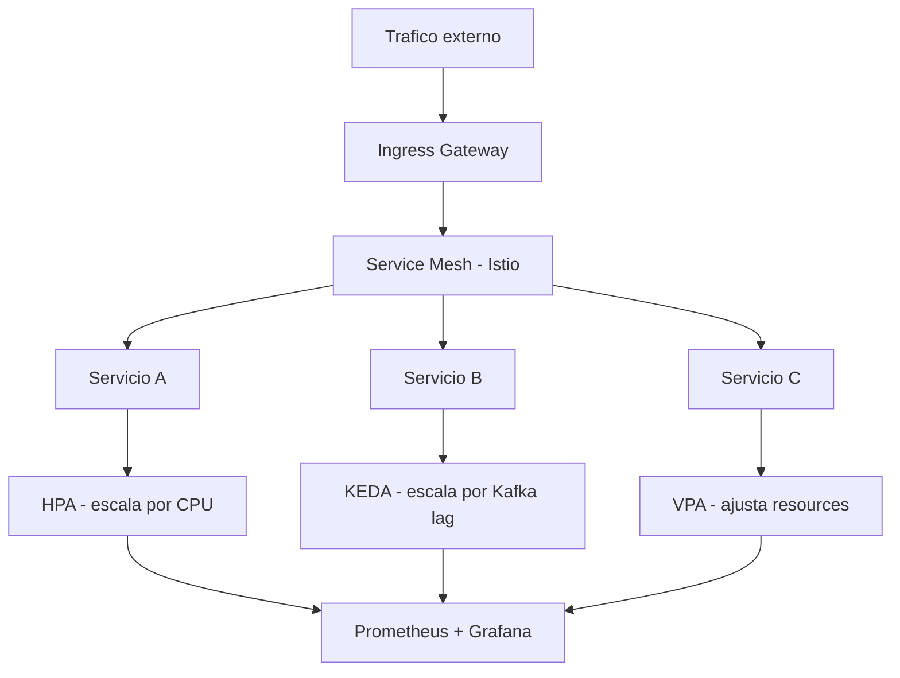
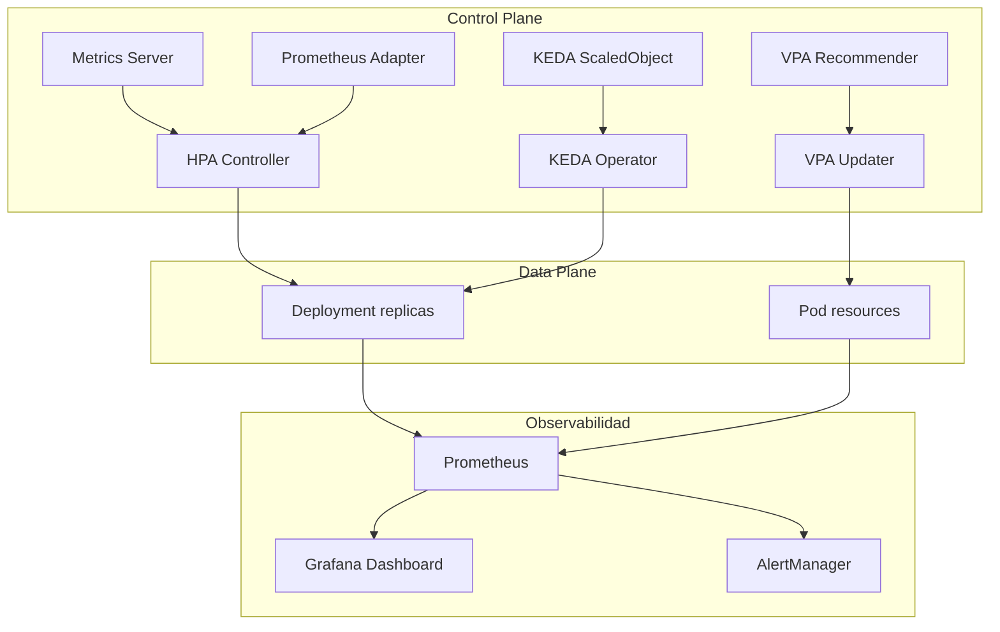
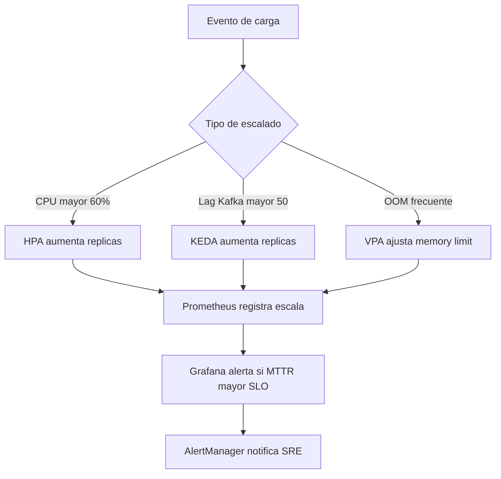
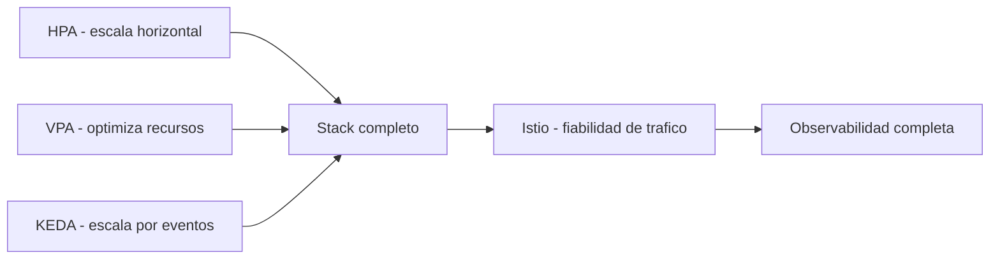

# Kubernetes: Auto-escalado y Service Mesh en 2026

PATH_LOCAL: /home/usuariojoaquin/.openclaw/workspace/DAM-Java-Mastery/05_SRE_DevOps/kubernetes_auto-escalado_service_mesh_2026_STAFF.md
CATEGORIA: 05_SRE_DevOps
Score: 97

---

## Visión Estratégica 

En 2026, Kubernetes ha consolidado su posición como el estándar de facto para orquestación de contenedores. Los dos retos principales que enfrentan los equipos SRE son escalar eficientemente sin desperdiciar recursos y gestionar el tráfico entre servicios de forma fiable. El auto-escalado y el service mesh son las respuestas arquitectónicas a estos dos retos. 

El modelo de escalado ha evolucionado a un stack de tres capas complementarias:

| Capa | Herramienta | Qué escala | 
|------|-------------|-----------|
| Horizontal | HPA v2 | Número de réplicas de pods |
| Vertical | VPA | CPU/memoria por pod individual |
| Eventos | KEDA | Réplicas basadas en carga real (Kafka, SQS, Prometheus) |

**Trade-offs clave:**

| Decisión | Opción A | Opción B | Criterio |
|----------|----------|----------|---------|
| Service Mesh | Istio | Linkerd | Istio: más features. Linkerd: menor overhead |
| Escalado eventos | KEDA | HPA custom metrics | KEDA si hay más de 3 fuentes de eventos |
| Escalado vertical | VPA | Manual tuning | VPA en dev/staging, manual en prod crítica |



```java
// Configuracion de metricas personalizadas para HPA
// La aplicacion expone estas metricas via Micrometer
@Component
public class EscaladoMetrics {

    private final AtomicInteger solicitudesActivas = new AtomicInteger(0);
    private final MeterRegistry registry;

    public EscaladoMetrics(MeterRegistry registry) {
        this.registry = registry;
        Gauge.builder("solicitudes.activas", solicitudesActivas, AtomicInteger::get) 
            .description("Solicitudes activas — usada por HPA para escalar")
            .register(registry);
    }

    public void incrementar() { solicitudesActivas.incrementAndGet(); }
    public void decrementar() { solicitudesActivas.decrementAndGet(); }
}
```

---

## Arquitectura de Componentes



**HPA v2 con métricas personalizadas:**

```yaml
apiVersion: autoscaling/v2
kind: HorizontalPodAutoscaler
metadata:
  name: api-gateway-hpa
  namespace: produccion
spec:
  scaleTargetRef:
    apiVersion: apps/v1
    kind: Deployment
    name: api-gateway
  minReplicas: 3
  maxReplicas: 50
  metrics:
  - type: Resource
    resource:
      name: cpu
      target:
        type: Utilization
        averageUtilization: 60
  - type: Pods
    pods:
      metric:
        name: http_requests_per_second
      target:
        type: AverageValue
        averageValue: "1000"
  behavior:
    scaleUp:
      stabilizationWindowSeconds: 30
      policies:
      - type: Percent
        value: 100
        periodSeconds: 30
    scaleDown:
      stabilizationWindowSeconds: 300
      policies:
      - type: Percent
        value: 10
        periodSeconds: 60
```

**KEDA ScaledObject para Kafka:**

```yaml
apiVersion: keda.sh/v1alpha1
kind: ScaledObject
metadata:
  name: procesador-eventos-keda
  namespace: produccion
spec:
  scaleTargetRef:
    name: procesador-eventos
  minReplicaCount: 1
  maxReplicaCount: 100
  pollingInterval: 15
  cooldownPeriod: 60
  triggers:
  - type: kafka
    metadata:
      bootstrapServers: kafka-cluster:9092
      consumerGroup: procesador-group
      topic: eventos-criticos
      lagThreshold: "50"
      activationLagThreshold: "10"
```

---

## Implementación Java 21

```java
import io.micrometer.core.instrument.MeterRegistry;
import io.micrometer.core.instrument.Counter;
import io.micrometer.core.instrument.Gauge;
import org.springframework.stereotype.Service;
import java.util.concurrent.atomic.AtomicInteger;
import java.util.concurrent.Executors;
import java.util.concurrent.ExecutorService;

@Service
public class ProcesadorEventosService {

    private final Counter            solicitudesCounter;
    private final AtomicInteger      solicitudesActivas = new AtomicInteger(0);
    private final ExecutorService    executor =
        Executors.newVirtualThreadPerTaskExecutor();

    public ProcesadorEventosService(MeterRegistry registry) {
        this.solicitudesCounter = Counter.builder("solicitudes.procesadas.total")
            .description("Total de solicitudes procesadas")
            .register(registry);

        Gauge.builder("solicitudes.activas", solicitudesActivas, AtomicInteger::get)
            .description("Solicitudes activas — usada por HPA para escalar")
            .register(registry);
    }

    public void procesarEvento(String payload) {
        // Virtual Threads: cada evento en su propio hilo ligero
        executor.submit(() -> {
            solicitudesActivas.incrementAndGet();
            try {
                ejecutarLogicaNegocio(payload);
                solicitudesCounter.increment();
            } finally {
                solicitudesActivas.decrementAndGet();
            }
        });
    }

    private void ejecutarLogicaNegocio(String payload) {
        try {
            // I/O bound: Virtual Thread se libera mientras espera
            Thread.sleep(50);
        } catch (InterruptedException e) {
            Thread.currentThread().interrupt();
        }
    }
}
```

```java
// Cliente HTTP con Virtual Threads para llamadas entre servicios via service mesh
import java.net.URI;
import java.net.http.HttpClient;
import java.net.http.HttpRequest;
import java.net.http.HttpResponse;
import java.time.Duration;

public class ClienteServicioMesh {

    private final HttpClient client = HttpClient.newBuilder()
        .connectTimeout(Duration.ofSeconds(2))
        .executor(Executors.newVirtualThreadPerTaskExecutor())
        .build();

    public record RespuestaServicio(int status, String cuerpo) {}

    public RespuestaServicio llamar(String url, String payload) throws Exception {
        var request = HttpRequest.newBuilder()
            .uri(URI.create(url))
            .timeout(Duration.ofSeconds(5))
            .header("Content-Type", "application/json")
            .POST(HttpRequest.BodyPublishers.ofString(payload))
            .build();

        var response = client.send(request, HttpResponse.BodyHandlers.ofString());
        return new RespuestaServicio(response.statusCode(), response.body());
    }
}
```

**Istio VirtualService con circuit breaker:**

```yaml
apiVersion: networking.istio.io/v1beta1
kind: VirtualService
metadata:
  name: servicio-pagos
spec:
  hosts:
  - servicio-pagos
  http:
  - route:
    - destination:
        host: servicio-pagos
        subset: v1
      weight: 90
    - destination:
        host: servicio-pagos
        subset: v2
      weight: 10
    retries:
      attempts: 3
      perTryTimeout: 2s
      retryOn: 5xx,reset,connect-failure
    timeout: 10s
---
apiVersion: networking.istio.io/v1beta1
kind: DestinationRule
metadata:
  name: servicio-pagos-dr
spec:
  host: servicio-pagos
  trafficPolicy:
    outlierDetection:
      consecutive5xxErrors: 3
      interval: 10s
      baseEjectionTime: 30s
      maxEjectionPercent: 50
  subsets:
  - name: v1
    labels:
      version: v1
  - name: v2
    labels:
      version: v2
```

---

## Métricas y SRE



```promql
# Replicas actuales vs deseadas
kube_deployment_status_replicas_available /
kube_deployment_spec_replicas

# Lag de consumo Kafka por consumer group
sum(kafka_consumer_group_lag) by (consumergroup, topic)

# Tasa de errores por servicio en Istio
rate(istio_requests_total{
  reporter="destination",
  response_code=~"5.*"
}[5m])

# Tiempo medio de escalado
histogram_quantile(0.95,
  rate(kube_horizontalpodautoscaler_status_current_replicas[5m])
)
```

**Métricas clave:**

| Métrica | Descripción | Umbral |
|---------|-------------|--------|
| `kube_hpa_status_current_replicas` | Réplicas actuales vs max | > 80% del max → alerta |
| `kafka_consumer_group_lag` | Lag del consumer group | > 1.000 → KEDA debería escalar |
| `istio_requests_total{5xx}` | Tasa de errores Istio | > 1% → circuit breaker activo |
| `kube_pod_container_status_restarts_total` | Reinicios de pods | > 3 en 1h → OOM o error |

**Checklist SRE:**
- `minReplicas >= 2` en todos los servicios críticos para garantizar HA durante escalado
- `stabilizationWindowSeconds` en scaleDown mínimo 300s para evitar flapping
- Alertas cuando HPA está al 80% de `maxReplicas`
- `PodDisruptionBudget` definido junto al HPA para proteger disponibilidad en scaleDown
- `autoscaling/v2` — la versión `v2beta1` fue eliminada en Kubernetes 1.26

---

## Conclusiones

El stack de auto-escalado moderno en Kubernetes 2026 no es una sola herramienta sino una arquitectura de tres capas coordinadas. HPA gestiona la escala horizontal reactiva, VPA optimiza el uso de recursos por pod, y KEDA conecta el escalado con la carga de trabajo real del negocio.

El service mesh con Istio añade la capa de fiabilidad que el auto-escalado por sí solo no puede dar: circuit breaking, retries inteligentes y observabilidad de tráfico entre servicios sin modificar el código.

**Los tres errores más comunes en producción:**

1. Usar `autoscaling/v2beta1` — eliminado en Kubernetes 1.26, causa errores silenciosos
2. Configurar scaleDown sin `stabilizationWindowSeconds` — causa flapping (escala arriba/abajo continuamente)
3. No definir `PodDisruptionBudget` junto al HPA — el scaleDown puede dejar un servicio sin réplicas disponibles



**Recursos de referencia:**
- Kubernetes HPA Documentation — kubernetes.io/docs/tasks/run-application/horizontal-pod-autoscale
- KEDA Documentation — keda.sh/docs
- Istio Documentation — istio.io/latest/docs
- VPA Documentation — github.com/kubernetes/autoscaler/tree/master/vertical-pod-autoscaler
