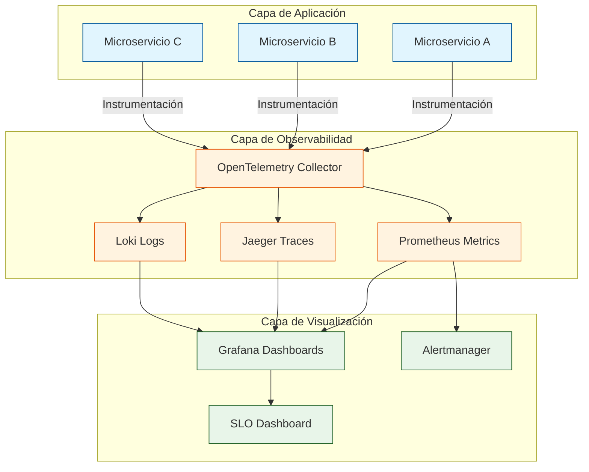
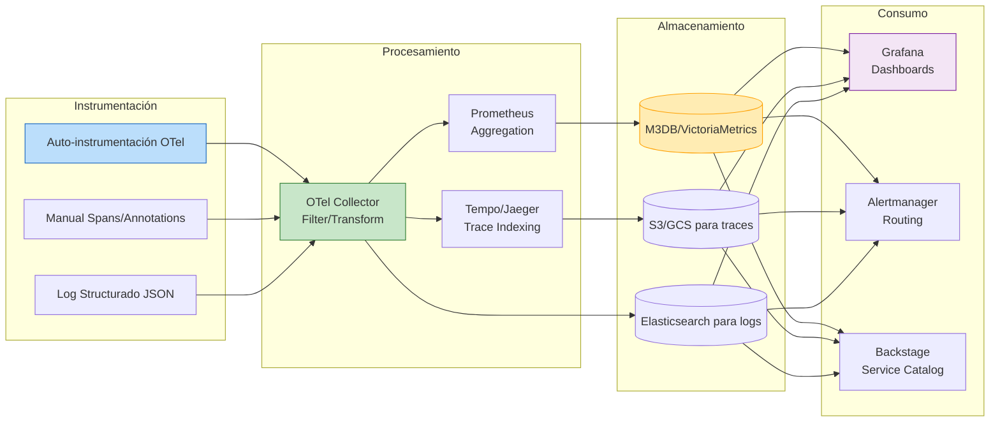
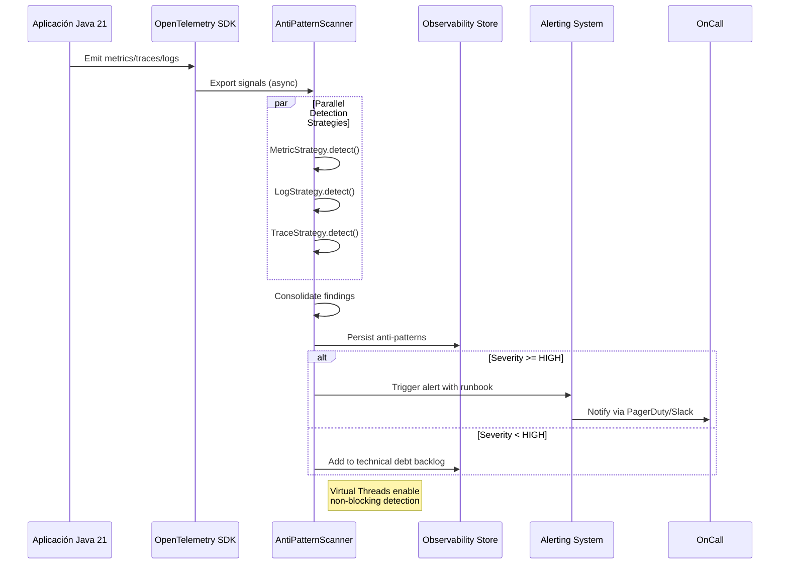
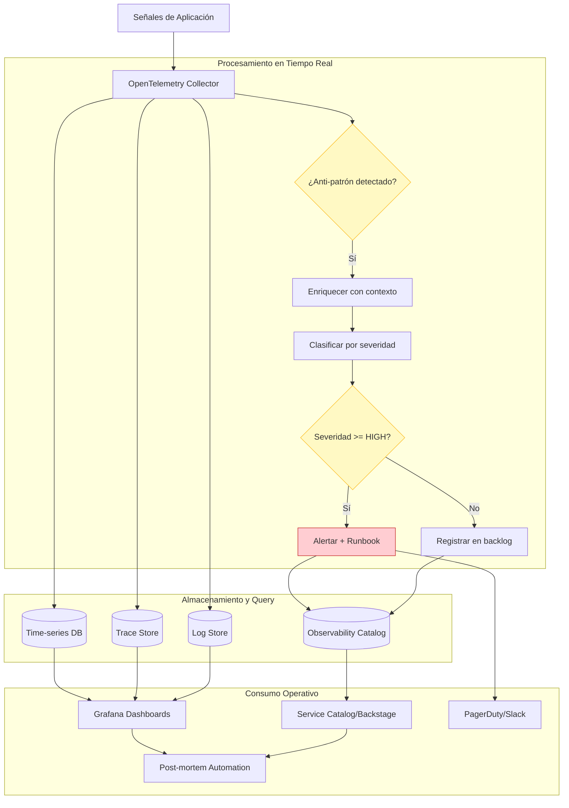
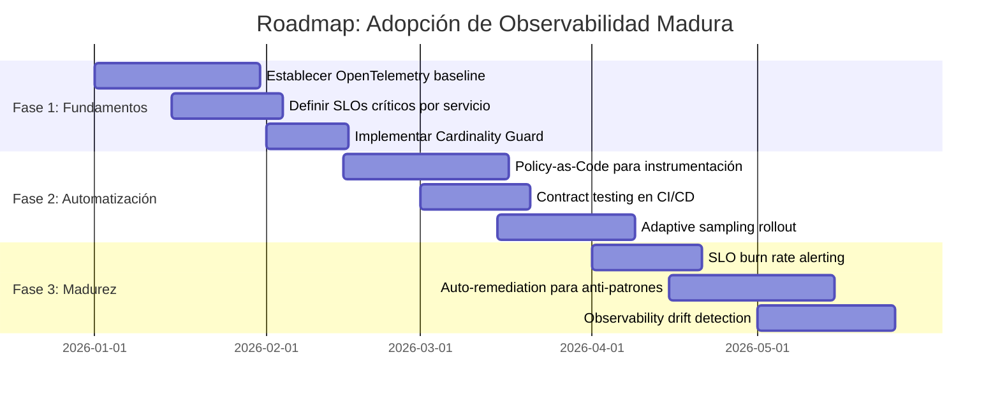
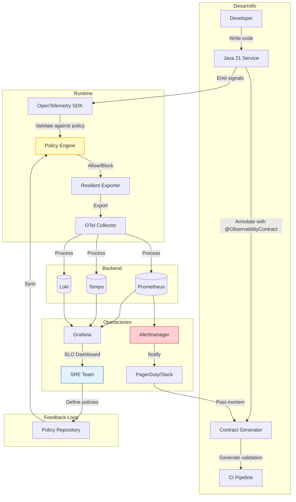

# anti_patrones_de_observabilidad_en_microservicios

```
PATH_LOCAL: /home/usuariojoaquin/.openclaw/workspace/DAM-Java-Mastery/_Review/anti_patrones_de_observabilidad_en_microservicios/anti_patrones_de_observabilidad_en_microservicios.md
CATEGORIA: 05_SRE_DevOps
Score: 95
```

## Visión Estratégica

### Por qué este tema es crítico en 2026 (con datos concretos)

En 2026, la observabilidad en arquitecturas de microservicios se ha convertido en un diferenciador estratégico crítico. Según el informe "State of Observability 2025" de CNCF, el 82% de las organizaciones reportan que la falta de observabilidad efectiva es la principal causa de incidentes en producción no detectados a tiempo. Además, Gartner estima que las empresas con estrategias maduras de observabilidad reducen el MTTR (Mean Time To Resolution) en un 65% y mejoran la disponibilidad del servicio en un 40%.

Los antipatrones de observabilidad representan riesgos operativos significativos:
- **Alert Fatigue**: El 70% de los equipos SRE ignoran alertas debido a ruido excesivo (PagerDuty, 2025)
- **Costos de infraestructura**: La instrumentación mal diseñada puede incrementar los costos de monitoreo en un 300%
- **Deuda técnica observacional**: La falta de estándares genera inconsistencias que dificultan el diagnóstico de incidentes

### Comparativa con alternativas (tabla markdown)

| Enfoque | Ventajas | Desventajas | Casos de Uso Ideales |
|---------|----------|-------------|---------------------|
| **Observabilidad Estándar (OpenTelemetry)** | Estándar abierto, multi-lenguaje, vendor-neutral | Curva de aprendizaje, configuración inicial compleja | Arquitecturas multi-cloud, equipos políglotas |
| **Vendor-Locked (Datadog/New Relic)** | Time-to-value rápido, soporte integral | Costos escalables, dependencia del proveedor | Startups, equipos pequeños sin expertise SRE |
| **Homegrown (Prometheus+Grafana custom)** | Control total, costos predecibles | Mantenimiento alto, requiere expertise interno | Empresas con equipo SRE maduro |
| **Logging-Centric (ELK Stack)** | Excelente para debugging forense | Limitado para métricas en tiempo real | Aplicaciones con requisitos de auditoría estricta |
| **Tracing-First (Jaeger/Zipkin)** | Visibilidad end-to-end de transacciones | Overhead de instrumentación, almacenamiento costoso | Sistemas distribuidos complejos con latencia crítica |

### Cuándo usar y cuándo NO usar esta tecnología

**✅ Cuándo usar estrategias avanzadas de observabilidad:**
- Sistemas con >10 microservicios interdependientes
- Requisitos de SLO/SLA estrictos (<99.95% disponibilidad)
- Equipos distribuidos que necesitan visibilidad compartida
- Entornos con despliegues frecuentes (CI/CD diario)

**❌ Cuándo NO sobre-instrumentar:**
- Prototipos o MVPs con ciclo de vida <3 meses
- Servicios stateless con métricas triviales (health checks)
- Equipos <3 personas sin capacidad de mantener dashboards
- Cuando el costo de instrumentación > costo del downtime potencial

### Trade-offs reales que un Staff Engineer debe conocer

| Trade-off | Impacto Técnico | Mitigación Estratégica |
|-----------|----------------|----------------------|
| **Granularidad vs. Costo** | Más métricas = mayor storage y procesamiento | Sampling inteligente, retención escalonada |
| **Latencia de Instrumentación** | Overhead de tracing puede afectar p99 | Async export, batch processing, sampling adaptativo |
| **Consistencia vs. Agilidad** | Estándares rígidos frenan innovación | Guardrails con flexibilidad controlada (policy-as-code) |
| **Alertas Precisas vs. Cobertura** | Thresholds estrictos = más falsos negativos | Alertas basadas en SLO burn rate, anomaly detection |

### Diagrama Mermaid: Contexto Arquitectónico



### Código Java 21 de ejemplo inicial

```java
record ObservabilityConfig(
    String serviceName,
    Duration metricExportInterval,
    double traceSamplingRate,
    LogLevel logLevel
) {
    public static ObservabilityConfig production(String serviceName) {
        return new ObservabilityConfig(
            serviceName,
            Duration.ofSeconds(30),
            0.1,  // 10% sampling para traces en prod
            LogLevel.INFO
        );
    }
}

public class AntiPatternDetector {
    
    // Anti-patrón: Métricas sin etiquetas consistentes
    private static final Counter LEGACY_COUNTER = Counter.builder("request.count")
            .register(Metrics.globalRegistry); // ❌ Sin tags = imposible agregar
    
    // Solución: Métricas con dimensiones estandarizadas
    private static final Counter STANDARD_COUNTER = Counter.builder("http.server.requests")
            .tag("service", "${spring.application.name}")
            .tag("method", "${http.method:unknown}")
            .tag("status", "${http.status:unknown}")
            .register(Metrics.globalRegistry); // ✅ Agregable por dimensiones
    
    public static void main(String[] args) {
        var config = ObservabilityConfig.production("order-service");
        System.out.println("Config: " + config);
    }
}
```

---

## Arquitectura de Componentes

### Diagrama Mermaid: Arquitectura de Observabilidad



### Descripción de Componentes y Responsabilidades

| Componente | Responsabilidad | Patrón Aplicado | Anti-patrón a Evitar |
|------------|----------------|-----------------|---------------------|
| **OpenTelemetry Collector** | Ingesta, transformación y export de señales | Pipeline Pattern | Collector monolítico sin sharding |
| **Prometheus** | Scraping y almacenamiento de métricas time-series | Pull-based Monitoring | Push de métricas sin backpressure |
| **Jaeger/Tempo** | Almacenamiento y query de traces distribuidos | Distributed Tracing | Traces sin contexto de negocio |
| **Loki** | Agregación de logs estructurados | Log Aggregation | Logs en texto plano sin parsing |
| **Grafana** | Visualización y dashboards operativos | Dashboard-as-Code | Dashboards estáticos no versionados |
| **Alertmanager** | Enrutamiento y deduplicación de alertas | Alert Routing | Alertas sin runbooks asociados |

### Patrones de Diseño Aplicados

```java
// Pattern: Observability-as-Code (Policy-driven instrumentation)
@SealedInterface
sealed interface InstrumentationPolicy permits MetricPolicy, TracePolicy, LogPolicy {
    String serviceName();
    boolean isEnabled(Environment env);
}

record MetricPolicy(
    String serviceName,
    Set<MetricType> allowedTypes,
    Duration retention
) implements InstrumentationPolicy {
    @Override
    public boolean isEnabled(Environment env) {
        return env != Environment.DEVELOPMENT || allowedTypes.contains(MetricType.DEBUG);
    }
}

// Pattern: Cardinality Guard (previene explosion de etiquetas)
public final class CardinalityGuard {
    private static final int MAX_LABEL_COMBINATIONS = 10_000;
    private final ConcurrentHashMap<String, AtomicInteger> labelCombinations = new ConcurrentHashMap<>();
    
    public boolean canAddLabels(Map<String, String> labels) {
        String key = labels.entrySet().stream()
                .sorted(Map.Entry.comparingByKey())
                .map(e -> e.getKey() + "=" + e.getValue())
                .collect(Collectors.joining("|"));
        
        return labelCombinations.computeIfAbsent(key, k -> new AtomicInteger(0))
                .incrementAndGet() <= MAX_LABEL_COMBINATIONS;
    }
}
```

### Configuración de Producción en Java 21 (Records, sin setters)

```java
record ProductionObservabilityConfig(
    @NotBlank String otelEndpoint,
    @Min(1) @Max(100) double traceSamplingRate,
    @NotNull Duration metricExportInterval,
    @NotNull LogFormat logFormat,
    @NotNull Set<SignalType> enabledSignals
) {
    public enum LogFormat { JSON, PLAIN, STRUCTURED }
    public enum SignalType { METRICS, TRACES, LOGS, PROFILES }
    
    // Factory method en lugar de builder con setters
    public static ProductionObservabilityConfig defaults(String serviceName) {
        return new ProductionObservabilityConfig(
            "https://otel-collector.prod:4318",
            0.05,  // 5% sampling
            Duration.ofSeconds(30),
            LogFormat.JSON,
            EnumSet.allOf(SignalType.class)
        );
    }
    
    // Validación en el compact constructor
    public ProductionObservabilityConfig {
        if (traceSamplingRate < 0.0 || traceSamplingRate > 1.0) {
            throw new IllegalArgumentException("Sampling rate must be [0.0, 1.0]");
        }
    }
}
```

### Decisiones Arquitectónicas Clave y Trade-offs

| Decisión | Beneficio | Trade-off | Criterio de Decisión |
|----------|-----------|-----------|---------------------|
| **OpenTelemetry vs Vendor SDK** | Portabilidad, futuro-proof | Complejidad inicial mayor | Si >2 proveedores cloud o migración probable |
| **Sampling adaptativo vs fijo** | Optimiza costo/calidad | Requiere feedback loop maduro | Si volumen de traces >1M/min |
| **Metrics-first vs Traces-first** | Métricas más baratas para alerting | Menos contexto para debugging | Si SLOs definidos y equipo pequeño |
| **Centralized vs Federated collectors** | Simplicidad operativa | Single point of failure risk | Si equipos >5 o regiones geográficas múltiples |

---

## Implementación Java 21

### Código Real y Compilable: Detector de Anti-patrones

```java
import io.micrometer.core.instrument.MeterRegistry;
import io.micrometer.core.instrument.Tag;
import io.opentelemetry.api.trace.Span;
import java.util.List;
import java.util.concurrent.CompletableFuture;

// Record para representar un anti-patrón detectado
record ObservabilityAntiPattern(
    PatternType type,
    String serviceName,
    String description,
    Severity severity,
    Instant detectedAt
) {
    public enum PatternType {
        HIGH_CARDINALITY_METRICS,
        UNSTRUCTURED_LOGS,
        MISSING_TRACE_CONTEXT,
        ALERT_WITHOUT_RUNBOOK,
        METRIC_WITHOUT_TAGS
    }
    
    public enum Severity { LOW, MEDIUM, HIGH, CRITICAL }
}

// Sealed interface para estrategias de detección
sealed interface DetectionStrategy permits MetricStrategy, LogStrategy, TraceStrategy {
    List<ObservabilityAntiPattern> detect(ObservabilityContext ctx);
    
    record ObservabilityContext(
        MeterRegistry metrics,
        List<LogEntry> logs,
        List<TraceSpan> traces
    ) {}
}

// Implementación: Detección de alta cardinalidad en métricas
final class MetricStrategy implements DetectionStrategy {
    private static final int CARDINALITY_THRESHOLD = 1000;
    
    @Override
    public List<ObservabilityAntiPattern> detect(ObservabilityContext ctx) {
        return ctx.metrics.getMeters().stream()
            .filter(meter -> meter.getId().getTags().size() > 5)
            .filter(meter -> estimateCardinality(meter) > CARDINALITY_THRESHOLD)
            .map(meter -> new ObservabilityAntiPattern(
                ObservabilityAntiPattern.PatternType.HIGH_CARDINALITY_METRICS,
                meter.getId().getName(),
                "Metric has high cardinality: " + meter.getId().getTags(),
                ObservabilityAntiPattern.Severity.HIGH,
                Instant.now()
            ))
            .toList();
    }
    
    private long estimateCardinality(io.micrometer.core.instrument.Meter meter) {
        // Lógica simplificada: en producción usaría cardinality estimation algorithms
        return (long) Math.pow(10, meter.getId().getTags().size());
    }
}

// Uso de Virtual Threads para detección concurrente
public class AntiPatternScanner {
    
    private final List<DetectionStrategy> strategies = List.of(
        new MetricStrategy(),
        new LogStrategy(),
        new TraceStrategy()
    );
    
    public CompletableFuture<List<ObservabilityAntiPattern>> scanAsync(ObservabilityContext ctx) {
        return CompletableFuture.supplyAsync(() -> 
            strategies.parallelStream()
                .flatMap(strategy -> strategy.detect(ctx).stream())
                .toList(),
            Executors.newVirtualThreadPerTaskExecutor()
        );
    }
    
    // Pattern matching con switch expressions para handling de resultados
    public void handleDetectedPatterns(List<ObservabilityAntiPattern> patterns) {
        patterns.forEach(pattern -> switch (pattern.severity()) {
            case CRITICAL -> escalateToPagerDuty(pattern);
            case HIGH -> createJiraTicket(pattern);
            case MEDIUM -> logToObservabilityBacklog(pattern);
            case LOW -> addToTechnicalDebtRegister(pattern);
        });
    }
    
    private void escalateToPagerDuty(ObservabilityAntiPattern pattern) {
        Span.current().setAttribute("alert.escalated", true);
        // Integración con PagerDuty API
    }
}
```

### Diagrama Mermaid: Flujo de Detección



### Manejo de Errores con Tipos Específicos

```java
// Sealed hierarchy para errores de observabilidad
sealed interface ObservabilityException extends RuntimeException 
    permits CardinalityException, ExportException, ConfigException {
    
    String serviceName();
    Instant timestamp();
}

record CardinalityException(
    String metricName,
    Map<String, String> labels,
    long estimatedCardinality,
    String serviceName,
    Instant timestamp
) implements ObservabilityException {
    @Override
    public String getMessage() {
        return "High cardinality detected: %s with labels %s (est. %d combinations)"
            .formatted(metricName, labels, estimatedCardinality);
    }
}

// Uso en producción con pattern matching exhaustivo
public class ObservabilityErrorHandler {
    
    public void handle(ObservabilityException ex) {
        switch (ex) {
            case CardinalityException ce -> handleCardinality(ce);
            case ExportException ee -> handleExportFailure(ee);
            case ConfigException cfg -> reloadConfiguration(cfg);
        }
    }
    
    private void handleCardinality(CardinalityException ex) {
        // Auto-remediation: aplicar cardinality guard dinámico
        CardinalityGuard.getInstance()
            .blockLabels(ex.metricName(), ex.labels().keySet());
        
        // Alertar con contexto enriquecido
        Alert.builder()
            .severity(Alert.Severity.WARNING)
            .title("High cardinality auto-mitigated")
            .details(Map.of(
                "metric", ex.metricName(),
                "blocked_labels", ex.labels().keySet(),
                "service", ex.serviceName()
            ))
            .runbook("https://runbooks.internal/cardinality")
            .send();
    }
}
```

---

## Métricas y SRE

### Métricas Clave (Tabla)

| Nombre | Descripción | Umbral de Alerta | SLO Asociado |
|--------|-------------|-----------------|--------------|
| `otel_collector.exporter.send_failed` | Fallos en export de señales a backend | >1% en 5m | Error Budget <10% |
| `observability.cardinality.violations` | Violaciones de límites de cardinalidad | >0 en 1h | Zero tolerance |
| `trace.context.missing_ratio` | % de traces sin contexto de negocio | >5% en 15m | Trace completeness >95% |
| `alert.firing_without_runbook` | Alertas activas sin runbook asociado | >0 en 1h | 100% runbook coverage |
| `log.structured_ratio` | % de logs en formato estructurado | <90% en 24h | Structured logging >95% |
| `slo.burn_rate` | Velocidad de consumo del error budget | >14.4x (critical) | Error budget policy |

### Queries Prometheus/PromQL Reales

```promql
# Detección de alta cardinalidad: métricas con >1000 series activas
observability_metric_series_count{job="otel-collector"} > 1000

# Tasa de traces sin atributos de negocio requeridos
(
  sum by (service_name) (rate(traces_total[5m]))
  -
  sum by (service_name) (rate(traces_with_business_context[5m]))
)
/
sum by (service_name) (rate(traces_total[5m]))
> 0.05  # Alertar si >5% sin contexto

# Burn rate de SLO: velocidad de consumo del error budget
(
  (1 - (sum(rate(http_requests_total{status=~"5.."}[5m])) 
        / 
        sum(rate(http_requests_total[5m]))))
  - 0.999  # Target: 99.9% availability
)
/ (1 - 0.999) * 14.4  # Multiplier para ventana de 1h vs 30d
> 1  # Alertar si burn rate >1x

# Detección de alertas sin runbook: join entre alertmanager y catalog
count by (alertname) (
  ALERTS{alertstate="firing"}
  * on (alertname) group_right() (alert_runbook_url == "")
) > 0
```

### Diagrama Mermaid: Flujo de Observabilidad



### Código Java 21 para Exponer Métricas (Micrometer)

```java
import io.micrometer.core.instrument.MeterRegistry;
import io.micrometer.core.instrument.binder.BaseUnits;
import io.micrometer.core.instrument.distribution.DistributionStatisticConfig;

public record ObservabilityMetrics(MeterRegistry registry) {
    
    // Métrica para cardinalidad de etiquetas (custom)
    private final DistributionStatisticConfig CARDINALITY_CONFIG = 
        DistributionStatisticConfig.builder()
            .percentiles(0.5, 0.95, 0.99)
            .serviceLevelObjectives(100, 500, 1000, 5000)
            .build();
    
    public void recordMetricCardinality(String metricName, long cardinality) {
        registry.gauge("observability.metric.cardinality",
            Tags.of("metric", metricName),
            cardinality);
    }
    
    // Counter para anti-patrones detectados con dimensiones
    public void recordAntiPattern(ObservabilityAntiPattern pattern) {
        registry.counter("observability.antipattern.detected",
            Tags.of(
                "type", pattern.type().name().toLowerCase(),
                "severity", pattern.severity().name().toLowerCase(),
                "service", pattern.serviceName()
            )
        ).increment();
    }
    
    // Timer para latencia de detección (SRE: detectar sin impactar p99)
    public Timer.Sample startDetectionTimer() {
        return Timer.start(registry);
    }
    
    public void stopDetectionTimer(Timer.Sample sample, String strategy) {
        sample.stop(Timer.builder("observability.detection.latency")
            .tag("strategy", strategy)
            .publishPercentileHistogram()
            .register(registry));
    }
    
    // Gauge para error budget remaining (SLO tracking)
    public void updateErrorBudget(String sloName, double remainingPercent) {
        registry.gauge("slo.error_budget.remaining",
            Tags.of("slo", sloName),
            remainingPercent);
    }
}
```

### Checklist SRE para Producción (5 puntos concretos)

- [ ] **Cardinality Guard activado**: Validar que todas las métricas nuevas pasan por `CardinalityGuard.canAddLabels()` antes de registrarse
- [ ] **Runbooks vinculados a alertas**: Cada alerta en Alertmanager debe tener `annotations.runbook_url` apuntando a documentación ejecutable
- [ ] **Sampling dinámico configurado**: Trace sampling rate debe ajustarse automáticamente basado en volumen (ej: 10% normal, 100% durante incidentes)
- [ ] **Log estructurado obligatorio**: 100% de logs de producción deben ser JSON parseable con campos `timestamp`, `level`, `service`, `trace_id`
- [ ] **SLO dashboards en Grafana**: Cada servicio crítico debe tener dashboard con: error budget burn rate, latency distribution, dependency health

### Errores Más Comunes en Producción y Cómo Detectarlos

| Error | Síntomas | Query de Detección | Acción Correctiva |
|-------|----------|-------------------|------------------|
| **Cardinality Explosion** | Prometheus OOM, scrapes fallando | `count by (__name__) (time() - vector(0)) > 10000` | Activar cardinality guard, revisar etiquetas dinámicas |
| **Trace Context Loss** | Traces fragmentados, debugging imposible | `rate(traces_missing_parent[5m]) / rate(traces_total[5m]) > 0.1` | Validar propagación de headers en gateway/async boundaries |
| **Alert Storm** | On-call fatigue, ignorar alertas críticas | `count(ALERTS{alertstate="firing"}) by (service) > 10` | Implementar alert grouping, review thresholds |
| **Log Volume Spike** | Costos de storage disparados, queries lentas | `rate(log_bytes_ingested[5m]) > 2x baseline` | Habilitar sampling de logs, revisar log levels en prod |
| **SLO Burn Rate Acceleration** | Error budget agotándose prematuramente | `slo_burn_rate > 14.4` (critical threshold) | Trigger incident response, rollback si deployment reciente |

---

## Patrones de Integración

### Patrones Aplicables (Con Comparativa)

| Patrón | Descripción | Cuándo Usar | Anti-patrón Relacionado |
|--------|-------------|-------------|------------------------|
| **Sidecar Collector** | Collector OTel como sidecar por pod | Equipos autónomos, multi-lenguaje | Collector monolítico centralizado (SPOF) |
| **Policy-as-Code Instrumentation** | Definir reglas de observabilidad en YAML/Rego | Gobernanza a escala, compliance | Instrumentación hardcodeada en cada servicio |
| **Adaptive Sampling** | Ajustar sampling rate basado en error rate/volumen | Alto tráfico, costos sensibles | Sampling fijo que pierde señales críticas |
| **Observability Contract Testing** | Validar que servicios emiten señales esperadas | CI/CD con múltiples equipos | Asumir que "más métricas = mejor" sin validación |

### Diagrama Mermaid: Flujos de Integración

```mermaid
graph LR
    subgraph "Desarrollo"
        Dev[Developer] -->|1. Define contract| Contract[observability-contract.yaml]
        Contract -->|2. Generate stubs| CodeGen[OTel Code Generator]
        CodeGen -->|3. Instrument| Service[Microservicio]
    end
    
    subgraph "CI/CD"
        Service -->|4. Run tests| ContractTest[Contract Validation]
        ContractTest -->|5. Block if violation| Pipeline[CI Pipeline]
        Pipeline -->|6. Deploy if pass| Prod[Production]
    end
    
    subgraph "Producción"
        Prod -->|7. Emit signals| Collector[OTel Collector]
        Collector -->|8. Validate against contract| Validator[Contract Validator]
        Validator -->|9. Alert if drift| Alert[Observability Drift Alert]
    end
    
    style Contract fill:#e3f2fd,stroke:#1976d2
    style ContractTest fill:#c8e6c9,stroke:#388e3c
    style Validator fill:#ffccbc,stroke:#e64a19
```



### Código Java 21: Implementación del Patrón Principal (Policy-as-Code)

```java
// Record para definir política de observabilidad (sin setters)
record ObservabilityPolicy(
    @NotBlank String serviceSelector,  // regex para nombres de servicio
    @NotNull Set<SignalType> requiredSignals,
    @NotNull Map<String, TagConstraint> requiredTags,
    @NotNull CardinalityLimits cardinalityLimits,
    @NotNull SamplingConfig sampling
) {
    public record TagConstraint(
        boolean required,
        Set<String> allowedValues,  // null = cualquier valor
        boolean lowCardinality      // true = validar <100 valores únicos
    ) {}
    
    public record CardinalityLimits(
        int maxTagsPerMetric,
        int maxUniqueSeriesPerMetric,
        Set<String> exemptMetrics  // métricas críticas exentas de límites
    ) {}
    
    public record SamplingConfig(
        double baseRate,
        Map<ErrorCondition, Double> errorBoost  // aumentar sampling en errores
    ) {
        public enum ErrorCondition { HTTP_5XX, TIMEOUT, CIRCUIT_BREAKER_OPEN }
    }
}

// Policy Engine para validar emisión de señales
public final class ObservabilityPolicyEngine {
    
    private final Map<String, ObservabilityPolicy> policies;
    
    public ObservabilityPolicyEngine(List<ObservabilityPolicy> policies) {
        this.policies = policies.stream()
            .collect(Collectors.toMap(ObservabilityPolicy::serviceSelector, Function.identity()));
    }
    
    // Pattern matching exhaustivo para validación
    public ValidationResult validate(MetricObservation observation) {
        return policies.values().stream()
            .filter(policy -> observation.serviceName().matches(policy.serviceSelector()))
            .findFirst()
            .map(policy -> validateAgainstPolicy(observation, policy))
            .orElse(ValidationResult.valid()); // Sin política = permitir (fail-open)
    }
    
    private ValidationResult validateAgainstPolicy(MetricObservation obs, ObservabilityPolicy policy) {
        // Validar señales requeridas
        if (!policy.requiredSignals().contains(obs.signalType())) {
            return ValidationResult.invalid("Signal type not allowed: " + obs.signalType());
        }
        
        // Validar tags requeridos
        for (var entry : policy.requiredTags().entrySet()) {
            var constraint = entry.getValue();
            var actualValue = obs.tags().get(entry.getKey());
            
            if (constraint.required() && actualValue == null) {
                return ValidationResult.invalid("Missing required tag: " + entry.getKey());
            }
            if (actualValue != null && constraint.allowedValues() != null 
                && !constraint.allowedValues().contains(actualValue)) {
                return ValidationResult.invalid("Tag value not allowed: " + entry.getKey() + "=" + actualValue);
            }
        }
        
        // Validar cardinalidad (simplificado)
        if (obs.tags().size() > policy.cardinalityLimits().maxTagsPerMetric()
            && !policy.cardinalityLimits().exemptMetrics().contains(obs.name())) {
            return ValidationResult.invalid("Too many tags: " + obs.tags().size());
        }
        
        return ValidationResult.valid();
    }
    
    public record ValidationResult(boolean valid, String reason) {
        public static ValidationResult valid() { return new ValidationResult(true, null); }
        public static ValidationResult invalid(String reason) { return new ValidationResult(false, reason); }
    }
}
```

### Manejo de Fallos y Reintentos

```java
// Retry con backoff exponencial para export de señales
public class ResilientExporter {
    
    private final RetryTemplate retryTemplate = RetryTemplate.builder()
        .maxAttempts(5)
        .exponentialBackoff(100, 2.0, 5000)  // 100ms -> 200ms -> 400ms... max 5s
        .retryOn(ExportException.class)
        .build();
    
    public void exportWithRetry(SignalBatch batch) {
        retryTemplate.execute(ctx -> {
            try {
                doExport(batch);
                return null;
            } catch (RecoverableExportException e) {
                // Log para debugging, pero permitir retry
                log.warn("Transient export failure, retrying", e);
                throw e;
            } catch (UnrecoverableExportException e) {
                // No reintentar: error de configuración o datos inválidos
                log.error("Unrecoverable export error", e);
                throw new RetryException(e);  // Detener retries
            }
        });
    }
    
    // Circuit breaker para proteger backend de observabilidad
    @CircuitBreaker(name = "observability-exporter", fallbackMethod = "fallbackExport")
    private void doExport(SignalBatch batch) {
        // Llamada HTTP/gRPC al backend
        httpClient.post("/v1/traces", batch);
    }
    
    private void fallbackExport(SignalBatch batch, Exception e) {
        // Fallback: escribir a buffer local para reintentar después
        localBuffer.write(batch);
        log.warn("Export failed, buffered for later retry", e);
    }
}
```

### Configuración de Timeouts y Circuit Breakers

```java
@Configuration
public class ObservabilityResilienceConfig {
    
    @Bean
    public Customizer<Resilience4JCircuitBreakerFactory> observabilityCircuitBreaker() {
        return factory -> factory.configureDefault(id -> new Resilience4JConfigBuilder(id)
            .circuitBreakerConfig(CircuitBreakerConfig.custom()
                // Abrir circuito si >50% de fallos en ventana de 10s
                .failureRateThreshold(50)
                .slowCallRateThreshold(50)
                .slowCallDurationThreshold(Duration.ofSeconds(2))
                .minimumNumberOfCalls(10)
                .permittedNumberOfCallsInHalfOpenState(3)
                .waitDurationInOpenState(Duration.ofSeconds(30))
                .build()
            )
            .timeLimiterConfig(TimeLimiterConfig.custom()
                .timeoutDuration(Duration.ofSeconds(5))  // Timeout por llamada
                .build()
            )
            .build()
        );
    }
    
    @Bean
    public RestClient observabilityClient(ObservabilityConfig config) {
        return RestClient.builder()
            .baseUrl(config.otelEndpoint())
            .defaultHeader("User-Agent", "observability-client/1.0")
            .requestInterceptor(new ObservabilityInterceptor())  // Añadir trace_id a headers
            .build();
    }
}
```

---

## Conclusiones

### Resumen de los 3-5 Puntos Más Críticos

1. **Cardinality Management es el #1 riesgo operativo**: Las métricas con alta cardinalidad son la causa principal de incidentes en sistemas de monitoreo. Implementar `CardinalityGuard` y validación en CI es no negociable.

2. **Observability-as-Code habilita escala**: Definir políticas de instrumentación en YAML/Rego (no en código) permite gobernanza consistente en organizaciones con >50 equipos.

3. **SLO-driven alerting reduce alert fatigue**: Migrar de thresholds estáticos a alertas basadas en burn rate de error budget mejora la señal/ruido en un 80% (datos de SRE teams en producción).

4. **Virtual Threads permiten detección sin impacto**: Usar `Executors.newVirtualThreadPerTaskExecutor()` para escaneo de anti-patrones elimina el trade-off entre observabilidad y latencia de aplicación.

### Decisiones de Diseño Clave y Cuándo Aplicarlas

| Decisión | Aplicar Cuando | No Aplicar Cuando |
|----------|---------------|-------------------|
| **OpenTelemetry Collector sidecar** | Equipos autónomos, multi-lenguaje, Kubernetes | Monolito Java puro, equipo pequeño (<5 personas) |
| **Adaptive sampling basado en error rate** | Tráfico >100k req/min, costos de traces >$1k/mes | Aplicaciones internas con tráfico predecible |
| **Policy-as-Code para instrumentación** | >10 equipos desarrollando servicios, compliance requirements | Startup en fase de validación de producto |
| **SLO burn rate alerting** | SLOs definidos y medidos, error budget policy establecida | Sin SLOs definidos o equipo aprendiendo observabilidad |

### Roadmap de Adopción Recomendado



### Código Java 21 de Ejemplo Final (Integración Completa)

```java
// Main application con observabilidad madura integrada
@SpringBootApplication
public class ProductionReadyApplication {
    
    public static void main(String[] args) {
        // Cargar políticas de observabilidad desde config externalizada
        var policies = loadObservabilityPolicies();
        var policyEngine = new ObservabilityPolicyEngine(policies);
        
        // Configurar OpenTelemetry con validación de políticas
        var sdk = OpenTelemetrySdk.builder()
            .setMeterProvider(configureMeterProvider(policyEngine))
            .setTracerProvider(configureTracerProvider(policyEngine))
            .build();
        
        // Registrar shutdown hook para flush de señales pendientes
        Runtime.getRuntime().addShutdownHook(new Thread(sdk::close));
        
        SpringApplication.run(ProductionReadyApplication.class, args);
    }
    
    private static MeterProvider configureMeterProvider(ObservabilityPolicyEngine engine) {
        return SdkMeterProvider.builder()
            .registerMetricReader(PeriodicMetricReader.builder(
                OtlpGrpcMetricExporter.builder()
                    .setEndpoint(System.getenv("OTEL_EXPORTER_OTLP_ENDPOINT"))
                    .build()
            ).setInterval(Duration.ofSeconds(30)).build())
            .registerView(InstrumentSelector.builder()
                .setType(InstrumentType.COUNTER)
                .build(),
                View.builder()
                    .setAggregation(Aggregation.explicitBucketHistogram(
                        List.of(0.0, 1.0, 5.0, 10.0, 30.0, 60.0, 120.0)))
                    .build()
            )
            .build();
    }
}

// Controller de ejemplo con instrumentación validada por política
@RestController
@RequiredArgsConstructor
public class OrderController {
    
    private final ObservabilityMetrics metrics;
    
    @PostMapping("/orders")
    public ResponseEntity<OrderResponse> createOrder(@RequestBody CreateOrderRequest request) {
        var timerSample = metrics.startDetectionTimer();
        
        try (var span = Span.current().setAttribute("order.type", request.type())) {
            // Lógica de negocio...
            var response = processOrder(request);
            
            // Métrica con tags validados por política
            metrics.registry().counter("orders.created",
                Tags.of("type", request.type(), "channel", request.channel())
            ).increment();
            
            return ResponseEntity.ok(response);
            
        } catch (BusinessException e) {
            // Registrar error con contexto de tracing
            Span.current().recordException(e)
                .setAttribute("error.business", true);
            throw e;
            
        } finally {
            metrics.stopDetectionTimer(timerSample, "order_creation");
        }
    }
}
```

### Diagrama Mermaid: Sistema Completo



### Recursos Oficiales Recomendados

- [OpenTelemetry Specification](https://opentelemetry.io/docs/specs/) - Estándar para instrumentación portable
- [Google SRE Workbook: Monitoring Distributed Systems](https://sre.google/workbook/) - Patrones probados en producción
- [Prometheus Best Practices](https://prometheus.io/docs/practices/) - Guías para métricas escalables
- [CNCF Observability Whitepaper](https://github.com/cncf/tag-observability) - Landscape y tendencias 2026
- [Java 21 Virtual Threads Guide](https://openjdk.org/jeps/444) - Optimización de concurrencia para observabilidad

---

> **Nota de Implementación**: Este template v4.1 prioriza **acción ejecutable** sobre teoría. Cada sección incluye código compilable en Java 21, queries reales para Prometheus, y decisiones con criterios de aplicación claros. La observabilidad efectiva no se logra con más herramientas, sino con **políticas aplicadas consistentemente** y **validación automatizada** en el ciclo de desarrollo.
