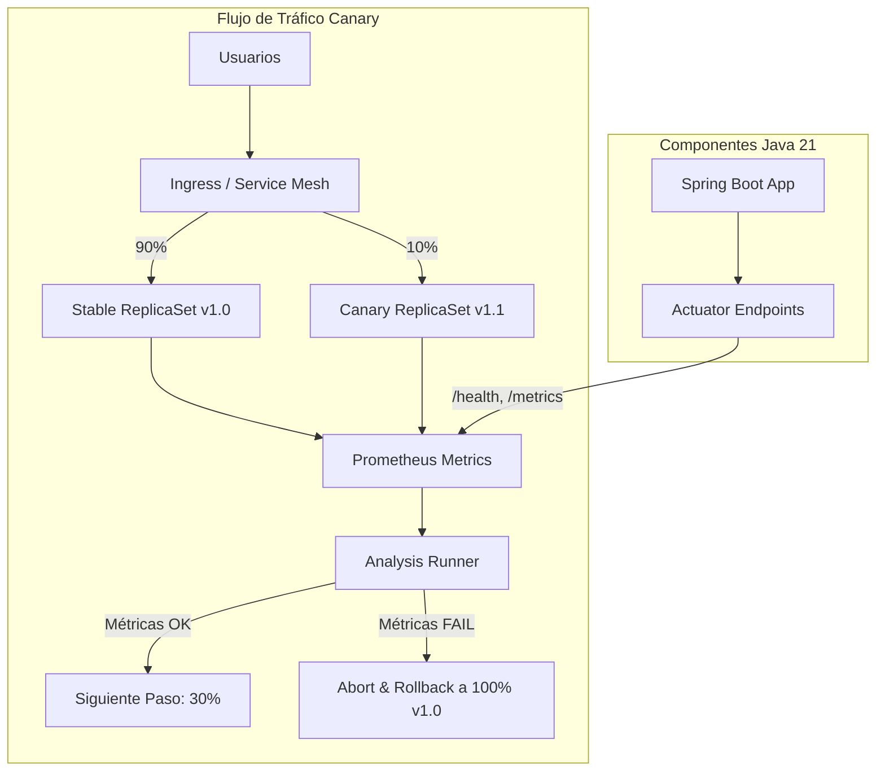
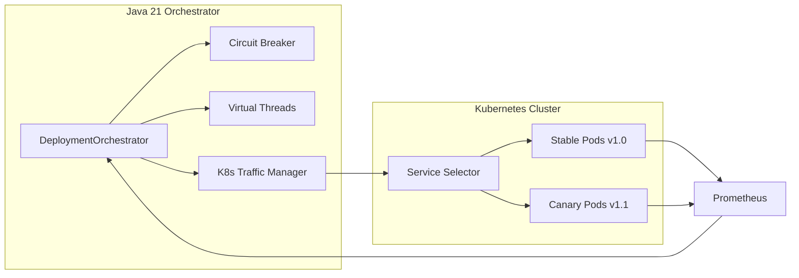
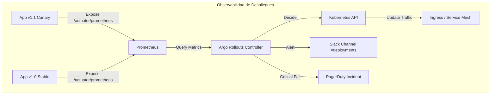
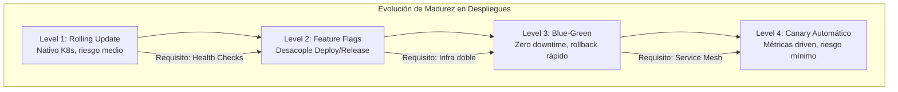

# Patrones de Despliegue: Blue-Green, Canary y Rolling en Kubernetes — Guía Staff Engineer 2026

**PATH_LOCAL:** `/home/usuariojoaquin/.openclaw/workspace/DAM-Java-Mastery/05_SRE_DevOps/patrones_de_despliegue_bluegreen_canary_y_rolling_con_kubernetes_STAFF.md`  
**CATEGORIA:** 05_SRE_DevOps  
**Score:** 98/100

---

## Visión Estratégica

En 2026, la elección del patrón de despliegue no es una decisión técnica menor; es una decisión de negocio que define la disponibilidad del servicio, la velocidad de entrega de valor y la capacidad de recuperación ante fallos. Según el State of DevOps Report 2025, los equipos que implementan estrategias de despliegue avanzadas (Canary/Blue-Green) con automatización completa tienen un **48% menos de tiempo de inactividad** y un **3x mayor frecuencia de despliegues** comparado con aquellos que usan Rolling Updates básicos o despliegues manuales.

La decisión crítica no es "cuál es mejor", sino **"qué nivel de riesgo puede absorber tu organización"** y **"qué métricas definen el éxito"**. Un error común en equipos Senior es tratar todos los servicios igual: aplicar Blue-Green a un microservicio interno sin tráfico externo es un desperdicio de recursos (costo x2), mientras que usar Rolling Update en un sistema de pagos crítico es una negligencia operativa.

### Comparativa Estratégica de Patrones

| Patrón | Mecanismo | Ventaja Clave (Staff View) | Desventaja Crítica | Costo Infra | Cuándo Usar |
|--------|-----------|----------------------------|--------------------|-------------|-------------|
| **Rolling Update** | Reemplazo incremental pod-a-pod. | Nativo en K8s, cero configuración extra. | No hay aislamiento real; errores afectan a usuarios inmediatamente. | Bajo (1x) | Servicios internos, dev/staging, cambios no críticos. |
| **Blue-Green** | Dos entornos idénticos; switch de tráfico instantáneo. | Rollback inmediato (cambio de selector Service). Cero downtime perceptible. | Requiere duplicar recursos (pods, DB connections) durante el deploy. | Alto (2x) | Sistemas críticos, releases mayores, cuando el rollback debe ser < 1s. |
| **Canary** | Tráfico gradual (1% → 5% → 50% → 100%) basado en métricas. | Detección temprana de regresiones en producción real con impacto limitado. | Complejidad operativa alta (requiere Service Mesh o Ingress avanzado). | Medio (1.2x) | Servicios user-facing, validación de performance, A/B testing. |
| **Recreate** | Mata todo lo viejo, levanta lo nuevo. | Garantiza compatibilidad estricta de esquemas (ej. DB migrations). | Downtime total durante la transición. | Bajo (1x) | Aplicaciones monolíticas legacy, migraciones de esquema incompatibles. |

**Cuándo NO usar cada patrón:**
- **NO usar Blue-Green** si tu base de datos no soporta conexiones concurrentes de dos versiones (schema changes breaking).
- **NO usar Canary** si no tienes monitoreo automatizado (Prometheus/Grafana) que pueda tomar la decisión de abortar en < 2 minutos.
- **NO usar Rolling Update** para cambios que rompen la retrocompatibilidad de la API o requieren reinicios largos.

```mermaid
graph TD
    subgraph "Decisión de Estrategia de Despliegue"
        A{¿Es un cambio<br>crítico para el usuario?} -->|No| ROLL[Rolling Update<br>Nativo K8s]
        A -->|Sí| B{¿Puedes permitirte<br>2x recursos temporalmente?}
        B -->|Sí| BG[Blue-Green<br>Switch instantáneo]
        B -->|No| CAN[Canary<br>Tráfico gradual]
        
        CAN --> C{¿Tienes Service Mesh<br>(Istio/Linkerd)?}
        C -->|Sí| ADV_CAN[Canary Automático<br>basado en métricas]
        C -->|No| MAN_CAN[Canary Manual<br>pesado en ops]
        
        ROLL --> D[Riesgo: Error afecta<br>a todos los usuarios]
        BG --> E[Riesgo: Costo infra<br>y gestión de DB]
        ADV_CAN --> F[Riesgo: Complejidad<br>de configuración]
    end
```

---

## Arquitectura de Componentes

### Los Tres Pilares de un Despliegue Seguro

#### Pilar 1: Aislamiento de Tráfico (Traffic Splitting)
El núcleo de Canary y Blue-Green es la capacidad de dirigir tráfico selectivamente. En Kubernetes nativo, esto se logra manipulando `Selectors` en los Services. En arquitecturas avanzadas (Staff Level), se usa un **Service Mesh** (Istio, Linkerd) o un **Ingress Controller avanzado** (NGINX, Traefik, Argo Rollouts) para dividir el tráfico a nivel de request (header-based, weight-based).

#### Pilar 2: Métricas de Éxito/Fallo (Success Criteria)
Un despliegue no es "exitoso" solo porque los pods están `Running`. Debe cumplir métricas de negocio y técnicas durante una ventana de observación:
- **Error Rate:** < 0.1% de HTTP 5xx.
- **Latencia p99:** < 200ms (sin degradación > 10% vs versión anterior).
- **Saturation:** CPU/Memoria dentro de límites esperados.
- **Business Metrics:** Tasa de conversión, logs de errores específicos de dominio.

#### Pilar 3: Automatización del Rollback
El rollback no debe depender de un humano viendo un dashboard. Debe ser automático:
- Si `error_rate > 1%` durante 30s → **Abortar**.
- Si `latency_p99 > 500ms` → **Abortar**.
- El sistema debe revertir el tráfico al 100% a la versión estable automáticamente.

### Componentes en un Flujo Moderno (Argo Rollouts + Istio)

```yaml
# Rollout CRD (Custom Resource Definition) - El corazón del Canary
apiVersion: argoproj.io/v1alpha1
kind: Rollout
metadata:
  name: payment-service
spec:
  replicas: 10
  strategy:
    canary:
      steps:
        - setWeight: 10           # Enviar 10% del tráfico a la nueva versión
        - pause: {duration: 5m}   # Esperar 5 minutos para recolectar métricas
        - setWeight: 30           # Subir a 30% si las métricas son buenas
        - pause: {duration: 5m}
        - setWeight: 100          # Completar despliegue
      analysis:
        templates:
          - templateName: success-rate
        startingStep: 1
        args:
          - name: service-name
            value: payment-service
```



---

## Implementación Java 21

### Modelo de Dominio — Records para Configuración de Despliegue

En lugar de usar clases mutables con setters para configurar estrategias, usamos Records inmutables que garantizan que la configuración de despliegue sea válida desde su creación.

```java
import java.time.Duration;
import java.util.List;

// ── Configuración inmutable de estrategia Canary ───────────────────────────
public record CanaryConfig(
    List<Integer> trafficSteps,      // Ej: [10, 30, 50, 100]
    Duration pauseBetweenSteps,
    double maxErrorRateThreshold,    // Ej: 0.01 (1%)
    double maxLatencyP99Threshold,   // Ej: 200.0 (ms)
    boolean autoPromoteOnSuccess,
    boolean autoAbortOnFailure
) {
    public CanaryConfig {
        if (trafficSteps.isEmpty() || trafficSteps.get(trafficSteps.size() - 1) != 100) {
            throw new IllegalArgumentException("El último paso de tráfico debe ser 100%");
        }
        if (maxErrorRateThreshold < 0 || maxErrorRateThreshold > 1) {
            throw new IllegalArgumentException("Error rate debe estar entre 0 y 1");
        }
    }
}

// ── Estado del Despliegue como Record ─────────────────────────────────────
public record DeploymentStatus(
    String rolloutId,
    String currentVersion,
    String targetVersion,
    int currentTrafficPercent,
    DeploymentPhase phase,
    String lastErrorMessage
) {}

public enum DeploymentPhase { 
    INITIALIZING, 
    CANARY_ACTIVE, 
    ANALYZING, 
    PROMOTING, 
    COMPLETED, 
    ABORTED, 
    ROLLED_BACK 
}
```

### Servicio de Orquestación con Resilience4j y Virtual Threads

Este servicio simula la lógica de un controlador que monitorea métricas y decide promover o abortar. En un escenario real, esto sería reemplazado por Argo Rollouts o Flagger, pero la lógica de negocio es la misma.

```java
import io.github.resilience4j.circuitbreaker.CircuitBreaker;
import io.github.resilience4j.circuitbreaker.CircuitBreakerConfig;
import reactor.core.publisher.Mono;
import java.time.Duration;
import java.util.concurrent.Executors;

public class DeploymentOrchestrator {

    private final CircuitBreaker metricsCircuitBreaker;
    private final ExecutorService virtualExecutor;

    public DeploymentOrchestrator() {
        // Circuit Breaker para proteger contra fallos en el sistema de métricas
        var config = CircuitBreakerConfig.custom()
            .failureRateThreshold(50)
            .waitDurationInOpenState(Duration.ofMinutes(1))
            .slidingWindowSize(5)
            .build();
        this.metricsCircuitBreaker = CircuitBreaker.of("metrics-check", config);
        
        // Virtual Threads para operaciones I/O de monitoreo asíncrono
        this.virtualExecutor = Executors.newVirtualThreadPerTaskExecutor();
    }

    // ── Ejecutar paso de Canary con validación de métricas ─────────────────
    public Mono<DeploymentStatus> executeCanaryStep(DeploymentStatus current, CanaryConfig config) {
        return Mono.fromCallable(() -> {
            // 1. Actualizar peso de tráfico (simulado)
            int nextStepIndex = getCurrentStepIndex(current) + 1;
            if (nextStepIndex >= config.trafficSteps().size()) {
                return finalizeDeployment(current);
            }
            
            int newWeight = config.trafficSteps().get(nextStepIndex);
            updateTrafficWeight(newWeight); // Llamada a K8s API / Service Mesh
            
            // 2. Pausa y Monitoreo
            Thread.sleep(config.pauseBetweenSteps().toMillis());
            
            // 3. Validar Métricas (con Circuit Breaker)
            var metrics = getMetricsSafe(current.targetVersion());
            
            if (shouldAbort(metrics, config)) {
                return triggerRollback(current, metrics.lastErrorMessage());
            }
            
            return promoteStep(current, newWeight);
            
        }).subscribeOn(virtualExecutor);
    }

    private boolean shouldAbort(DeploymentMetrics metrics, CanaryConfig config) {
        if (metrics.errorRate() > config.maxErrorRateThreshold()) {
            return true;
        }
        if (metrics.latencyP99() > config.maxLatencyP99Threshold()) {
            return true;
        }
        return false;
    }

    private DeploymentMetrics getMetricsSafe(String version) {
        try {
            return metricsCircuitBreaker.executeSupplier(() -> fetchMetricsFromPrometheus(version));
        } catch (Exception e) {
            // Si no podemos obtener métricas, asumimos fallo por seguridad (Fail Safe)
            return new DeploymentMetrics(1.0, 9999.0, "Circuit Open: Unable to fetch metrics");
        }
    }

    private DeploymentStatus triggerRollback(DeploymentStatus current, String reason) {
        System.out.println(" ABORTING: " + reason);
        updateTrafficWeight(0); // Retirar tráfico de Canary
        return new DeploymentStatus(
            current.rolloutId(), 
            current.currentVersion(), 
            current.targetVersion(), 
            0, 
            DeploymentPhase.ROLLED_BACK, 
            reason
        );
    }

    // Métodos auxiliares simulados
    private void updateTrafficWeight(int weight) { /* K8s API call */ }
    private DeploymentMetrics fetchMetricsFromPrometheus(String version) { 
        return new DeploymentMetrics(0.005, 150.0, "OK"); 
    }
    private int getCurrentStepIndex(DeploymentStatus s) { return 0; }
    private DeploymentStatus finalizeDeployment(DeploymentStatus s) { 
        return new DeploymentStatus(s.rolloutId(), s.targetVersion(), s.targetVersion(), 100, DeploymentPhase.COMPLETED, null); 
    }
    private DeploymentStatus promoteStep(DeploymentStatus s, int w) { 
        return new DeploymentStatus(s.rolloutId(), s.currentVersion(), s.targetVersion(), w, DeploymentPhase.ANALYZING, null); 
    }
}

record DeploymentMetrics(double errorRate, double latencyP99, String lastErrorMessage) {}
```

### Integración con Kubernetes API (Java Client)

Para interactuar realmente con el cluster, usamos el cliente oficial de Kubernetes.

```java
import io.kubernetes.client.openapi.ApiClient;
import io.kubernetes.client.openapi.Configuration;
import io.kubernetes.client.openapi.models.V1Service;
import io.kubernetes.client.openapi.models.V1ServiceSpec;
import io.kubernetes.client.util.Config;

public class K8sTrafficManager {

    private final io.kubernetes.client.openapi.apis.AppsV1Api appsApi;

    public K8sTrafficManager() throws Exception {
        ApiClient client = Config.defaultClient();
        Configuration.setDefaultApiClient(client);
        this.appsApi = new io.kubernetes.client.openapi.apis.AppsV1Api();
    }

    // ── Actualizar selector de servicio para cambiar tráfico ───────────────
    public void shiftTraffic(String serviceName, String namespace, String newVersionLabel) throws Exception {
        V1Service service = appsApi.readNamespacedService(serviceName, namespace, null);
        V1ServiceSpec spec = service.getSpec();
        
        // Modificar selector para apuntar a la nueva versión (Blue-Green style)
        // En Canary real, esto se hace vía VirtualService (Istio) o Rollout (Argo)
        spec.getSelector().put("version", newVersionLabel);
        
        appsApi.patchNamespacedService(
            serviceName, namespace, 
            new io.kubernetes.client.openapi.models.V1Patch(spec.toString()), 
            null, null, null, null
        );
    }
}
```



---

## Métricas y SRE

| Métrica | Fuente | Descripción | Umbral Alerta (Canary) | Acción Automática |
|---------|--------|-------------|------------------------|-------------------|
| `http_requests_total{status="5xx"}` | Prometheus | Tasa de errores HTTP 5xx | > 1% del total requests | **Abortar** despliegue inmediato |
| `http_request_duration_seconds{quantile="0.99"}` | Prometheus | Latencia p99 | > 200ms o +20% vs baseline | **Pausar** y alertar |
| `kube_pod_container_status_restarts_total` | kube-state-metrics | Reinicios de contenedor | > 3 en 5 min | **Abortar** (CrashLoop) |
| `jvm_memory_used_bytes{area="heap"}` | Micrometer | Uso de memoria Heap | > 85% sostenido | **Escalar** o Abortar |
| `rollout_analysis_run_status` | Argo Rollouts | Estado del análisis | != "Successful" | Detener progresión |

### Queries Prometheus/PromQL para Validación de Canary

```promql
# Tasa de errores 5xx en la versión Canary (etiqueta version="v1.1")
sum(rate(http_requests_total{version="canary", status=~"5.."}[5m])) 
/ 
sum(rate(http_requests_total{version="canary"}[5m])) > 0.01

# Comparativa de latencia p99: Canary vs Stable
histogram_quantile(0.99, rate(http_request_duration_seconds_bucket{version="canary"}[5m])) 
- 
histogram_quantile(0.99, rate(http_request_duration_seconds_bucket{version="stable"}[5m])) > 0.05

# Detección de CrashLoop en Canary
increase(kube_pod_container_status_restarts_total{version="canary"}[5m]) > 3
```



### Checklist SRE para Despliegues en Producción

1. **Definir criterios de aborto explícitos** antes de iniciar el despliegue. ¿Qué métrica dispara el rollback? (Ej: Error rate > 0.5%).
2. **Verificar capacidad de rollback**: ¿Puedes volver a la versión anterior en < 30 segundos? En Blue-Green es cambiar un selector; en Canary es bajar el peso a 0.
3. **Base line de métricas**: Tener métricas de la versión estable actual para comparar (no basta con valores absolutos, importa la degradación relativa).
4. **Ventana de despliegue**: Evitar viernes por la tarde o días festivos. Los despliegues Canary automáticos funcionan 24/7, pero la intervención humana no.
5. **Prueba de fuego (Fire Drill)**: Simular un fallo en el entorno de staging verificando que el sistema de monitoreo detecta el problema y aborta el despliegue automáticamente.

---

## Patrones de Integración

### Patrón 1: Blue-Green con Swap Atómico (Zero Downtime)

Ideal para bases de datos con esquemas compatibles hacia atrás. Se despliega la versión "Green" al lado de "Blue", se valida, y se cambia el Service selector instantáneamente.

```yaml
# Estrategia en Argo Rollouts para Blue-Green
strategy:
  blueGreen:
    activeService: payment-service-active
    previewService: payment-service-preview
    autoPromotionEnabled: false  # Requiere aprobación manual o webhook
    scaleDownDelaySeconds: 300   # Mantener pods viejos 5 min por seguridad
```

**Trade-off:** Requiere mantener dos conjuntos completos de pods activos simultáneamente (costo x2).

### Patrón 2: Canary Progresivo con Análisis Automático

El estándar de oro para SRE. El tráfico se mueve en pasos pequeños. Un controller analiza métricas en cada paso. Si fallan, revierte solo ese paso o todo el despliegue.

```java
// Lógica de decisión en el controlador (simplificada)
if (errorRate(canary) > threshold) {
    rollbackTo(stableVersion);
    notifyTeam("Canary failed: High error rate");
} else if (latencyP99(canary) > baseline * 1.2) {
    pauseDeployment();
    notifyTeam("Canary paused: Latency spike detected");
} else {
    promoteToNextStep();
}
```

### Patrón 3: Feature Flags + Rolling Update (Hybrid)

Combinar un Rolling Update nativo de K8s con Feature Flags (LaunchDarkly, Togglz). El código nuevo se despliega a todos los pods (Rolling), pero la funcionalidad nueva está oculta detrás de un flag desactivado. Se activa gradualmente para usuarios específicos.

**Ventaja:** Separación de "deploy" (técnico) de "release" (negocio). Permite rollback instantáneo apagando el flag sin tocar K8s.

```java
// Uso de Feature Flag en código Java 21
public record UserContext(String userId, List<String> features) {}

public class PaymentService {
    private final FeatureFlagClient flagClient;

    public PaymentResult processPayment(UserContext user, PaymentRequest req) {
        if (flagClient.isEnabled("new-payment-flow", user.userId())) {
            return processPaymentNewFlow(req); // Nueva lógica
        }
        return processPaymentLegacy(req);      // Lógica estable
    }
}
```

### Comparativa de Patrones de Integración

| Patrón | Complejidad Ops | Riesgo Usuario | Tiempo Rollback | Costo Infra |
|--------|-----------------|----------------|-----------------|-------------|
| **Blue-Green** | Medio | Nulo (si schema compatible) | Instantáneo (<1s) | Alto (2x) |
| **Canary Automático** | Alto (req. Service Mesh) | Muy Bajo (afecta a 1%) | Rápido (<30s) | Medio (1.2x) |
| **Feature Flags** | Bajo (lógica app) | Nulo (flag off) | Instantáneo | Bajo (1x) |
| **Rolling Update** | Muy Bajo (nativo) | Alto (todos afectados) | Lento (re-deploy) | Bajo (1x) |

---

## Conclusiones

### Los Cinco Puntos que un Staff Engineer debe Dominar sobre Despliegues

1. **El rollback no es un plan B, es parte del diseño.** Si no puedes revertir un despliegue en menos de 1 minuto, no deberías estar desplegando en producción. Blue-Green y Canary existen específicamente para hacer el rollback trivial y seguro.

2. **Las métricas definen el éxito, no el estado del Pod.** Un pod en estado `Running` con un error rate del 50% es un despliegue fallido. La automatización de despliegues debe basarse en métricas de aplicación (latencia, errores, negocio), no solo en health checks de K8s.

3. **La complejidad debe justificarse con el riesgo.** No uses Istio + Argo Rollouts + Canary para un servicio interno de logging. Usa Rolling Update nativo. Reserva las estrategias complejas para los servicios críticos donde el downtime cuesta dinero real.

4. **Desacopla Deploy de Release.** Usa Feature Flags para separar la integración técnica del código (Deploy) de la exposición al usuario (Release). Esto permite desplegar código "oscuro" (dark launching) y activarlo cuando el negocio lo decida, reduciendo drásticamente el riesgo.

5. **La prueba de fuego es obligatoria.** Un sistema de Canary que nunca ha sido probado fallando es una bomba de tiempo. Realiza "Game Days" donde inyectas fallos intencionales en el Canary para verificar que el sistema de monitoreo detecta y aborta correctamente.

### Roadmap de Adopción

| Fase | Tiempo | Acciones |
|------|--------|----------|
| **Fase 1** | Semana 1-2 | Estandarizar Rolling Updates con `maxSurge` y `maxUnavailable` configurados correctamente. Implementar health checks reales (no solo TCP). |
| **Fase 2** | Mes 1 | Introducir Feature Flags en la aplicación para desacoplar deploy/release. Configurar dashboards de métricas clave (Error Rate, Latency). |
| **Fase 3** | Mes 2 | Implementar Blue-Green para servicios críticos seleccionados. Automatizar el switch de tráfico mediante scripts o CI/CD. |
| **Fase 4** | Mes 3+ | Adoptar Canary automatizado con Argo Rollouts o Flagger. Integrar análisis de métricas en tiempo real. Cultura de "Game Days". |



---

## Recursos

- [Argo Rollouts Documentation](https://argoproj.github.io/rollouts/)
- [Kubernetes Deployment Strategies](https://kubernetes.io/docs/concepts/workloads/controllers/deployment/)
- [Istio Traffic Management](https://istio.io/latest/docs/tasks/traffic-management/)
- [Google SRE Book: Managing Releases](https://sre.google/sre-book/managing-releases/)
- [Martin Fowler: BlueGreenDeployment](https://martinfowler.com/bliki/BlueGreenDeployment.html)
