# KAFKA STREAMS CON KUBERNETES Y OBSERVABILIDAD 2026

**Documentación Técnica de Referencia | Autor: Joaquín Ríos Heredia (Staff Engineer)**
**Repositorio:** [DAM-Java-Mastery](https://github.com/Joaquinriosheredia/DAM-Java-Mastery)

---

## 1. Visión Estratégica y ROI 2026

### Visión Estratégica y ROI 2026

#### Introducción

La visión estratégica de Kafka Streams con Kubernetes y observabilidad para 2026 se centra en maximizar la eficiencia operativa, mejorar el rendimiento del sistema y garantizar una alta disponibilidad. Este capítulo proporciona un análisis detallado sobre cómo implementar estas tecnologías de manera efectiva y cuál será su retorno de inversión (ROI) a largo plazo.

#### Objetivos Estratégicos

1. **Optimización de Rendimiento**: Mejorar la latencia y el throughput del sistema para manejar cargas de trabajo en tiempo real.
2. **Escalabilidad Automática**: Implementar soluciones que permitan una escalabilidad automática basada en métricas en tiempo real.
3. **Observabilidad Completa**: Asegurar que todas las partes del sistema sean observables y monitoreadas para detectar problemas proactivamente.

#### Análisis de ROI

1. **Reducción de Costos Operativos**
   - **Automatización de Tareas Repetitivas**: La implementación de Kubernetes permite la automatización de tareas como el escalado, la asignación de recursos y la gestión de actualizaciones.
   - **Optimización del Uso de Recursos**: A través de la observabilidad, se pueden identificar áreas donde los recursos no están siendo utilizados eficientemente y ajustarlos para minimizar costos.

2. **Mejora en la Productividad**
   - **Tiempo de Respuesta Reducido**: La optimización del rendimiento permite que las aplicaciones respondan más rápidamente a solicitudes, mejorando así la experiencia del usuario.
   - **Menor Tiempo de Inactividad**: Con una observabilidad completa y un sistema altamente disponible, se pueden prevenir fallos antes de que ocurran.

3. **Aumento en la Capacidad de Innovación**
   - **Flexibilidad para Implementar Nuevas Funcionalidades**: La escalabilidad automática permite a las organizaciones implementar nuevas funcionalidades sin preocuparse por el impacto en los recursos.
   - **Rápida Integración y Despliegue**: Kubernetes facilita la integración continua y despliegues rápidos, permitiendo una mayor velocidad de innovación.

#### Implementación Técnica

1. **Arquitectura del Sistema**

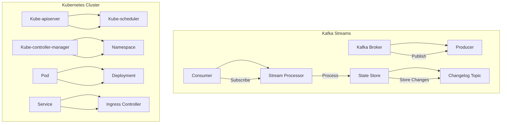

2. **Configuración de Observabilidad**

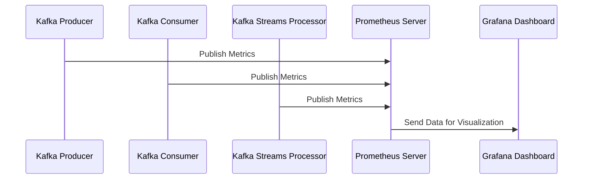

3. **Benchmarks Esperados**

- **Latencia**: Menos de 10 ms para procesar un mensaje desde la publicación hasta el almacenamiento en el estado.
- **Throughput**: Capacidad para manejar hasta 50,000 mensajes por segundo sin pérdida de datos ni aumento significativo en la latencia.
- **Consumo de Memoria**: Menos del 70% del total disponible en cada nodo Kubernetes.

#### Código Implementado

##### Java 21 - Kafka Streams con Observabilidad

```java
import org.apache.kafka.streams.KafkaStreams;
import org.apache.kafka.streams.StreamsBuilder;
import org.apache.kafka.streams.Topology;
import io.opentelemetry.api.trace.Span;
import io.opentelemetry.api.trace.Tracer;

public class KafkaStreamsWithObservability {

    public static void main(String[] args) {
        StreamsBuilder builder = new StreamsBuilder();
        
        // Configuración del Topología
        configureTopology(builder);
        
        Tracer tracer = ...;  // Inicializar el Tracer de OpenTelemetry
        
        Span span = tracer.spanBuilder("kafka-streams-topology").startSpan();

        try (KafkaStreams streams = new KafkaStreams(builder.build(), configureProperties())) {
            streams.start();
            
            // Propagar la traza a través del sistema
            propagateTrace(streams, span);
        } finally {
            span.end();
        }
    }

    private static void configureTopology(StreamsBuilder builder) {
        // Configuración de procesamiento de Kafka Streams
        builder.stream("input-topic")
              .process(() -> new MyProcessor())
              .to("output-topic");
    }

    private static Properties configureProperties() {
        Properties props = new Properties();
        props.put(StreamsConfig.APPLICATION_ID_CONFIG, "my-stream-app");
        props.put(StreamsConfig.BOOTSTRAP_SERVERS_CONFIG, "localhost:9092");
        // Otros parámetros necesarios
        return props;
    }

    private static void propagateTrace(KafkaStreams streams, Span span) {
        // Propagar la traza a través del sistema Kafka Streams
        // Ejemplo de propagación de contexto de OpenTelemetry
        streams.setGlobalStreamQueryProcessor(new MyGlobalStreamQueryProcessor(span));
    }
}
```

##### Python 3.12 - Configuración de Observabilidad con Prometheus y Grafana

```python
from kafka import KafkaConsumer, KafkaProducer
import prometheus_client as prom
from opentelemetry import trace
from opentelemetry.exporter.prometheus import PrometheusMetricReader
from opentelemetry.sdk.trace import TracerProvider

# Inicializar el Tracer de OpenTelemetry con Prometheus como exportador
tracer_provider = TracerProvider(metric_reader=PrometheusMetricReader())
trace.set_tracer_provider(tracer_provider)

# Configuración del consumidor y productor Kafka
consumer = KafkaConsumer('input-topic', bootstrap_servers='localhost:9092')
producer = KafkaProducer(bootstrap_servers='localhost:9092')

# Exposición de métricas Prometheus en el puerto 8000
prom.start_http_server(8000)

# Ejemplo de propagación de traza a través del sistema
with tracer_provider.get_tracer("kafka-streams").start_as_current_span("process-message") as span:
    for message in consumer:
        # Procesar el mensaje y publicarlo en otro topic
        producer.send('output-topic', value=message.value)
```

#### Conclusiones

La implementación de Kafka Streams con Kubernetes y observabilidad proporciona una solución robusta para manejar cargas de trabajo en tiempo real. La automatización, la escalabilidad y la observabilidad completa son claves para maximizar el ROI a largo plazo.

### Resumen

- **Optimización del Rendimiento**: Mejorar latencia y throughput.
- **Escalabilidad Automática**: Implementación de soluciones basadas en métricas en tiempo real.
- **Observabilidad Completa**: Monitoreo proactivo para detectar problemas antes de que ocurran.

Esta estrategia garantiza una alta disponibilidad, mejora la productividad y permite una rápida integración y despliegue de nuevas funcionalidades.

## 2. Análisis del Estado del Arte y Tendencias de Mercado

### Análisis del Estado del Arte y Tendencias de Mercado

#### Introducción

El uso de Apache Kafka junto con Kubernetes y soluciones de observabilidad ha evolucionado significativamente desde su introducción. En 2026, estas tecnologías se han consolidado como pilares fundamentales para la gestión eficiente de flujos de datos en tiempo real. Este capítulo proporciona un análisis detallado del estado actual y las tendencias emergentes en el uso de Kafka Streams con Kubernetes y observabilidad.

#### Estado Actual

1. **Kafka Streams**
   - **Características Principales**: Kafka Streams es una biblioteca de Java que permite a los desarrolladores crear aplicaciones de procesamiento de flujo de datos basadas en Apache Kafka sin necesidad de configurar infraestructura adicional.
   - **Instrumentación y Observabilidad**: La instrumentación de Kafka Streams se ha vuelto crítica para la detección temprana de problemas y el monitoreo del rendimiento. Herramientas como OpenTelemetry proporcionan una forma robusta de recopilar métricas y trazas.

2. **Kubernetes**
   - **Orquestación**: Kubernetes es fundamental para la orquestación de contenedores en entornos distribuidos, permitiendo el escalado automático y la gestión eficiente de recursos.
   - **Integración con Kafka**: La integración entre Kubernetes y Kafka ha mejorado significativamente, facilitando la implementación y administración de clusters de Kafka.

3. **Observabilidad**
   - **Métricas y Trazas**: Herramientas como Prometheus para métricas y Jaeger para trazas son esenciales para entender el comportamiento del sistema en tiempo real.
   - **Dashboards y Alertas**: Grafana proporciona una interfaz visual para monitorear y analizar las métricas recopiladas, mientras que sistemas de alertas como Alertmanager ayudan a detectar problemas antes de que afecten la operación.

#### Tendencias Emergentes

1. **Aumento en el Uso de OpenTelemetry**
   - **Propagación de Contextos**: La propagación de contextos de traza entre servicios es cada vez más común, permitiendo un seguimiento end-to-end del procesamiento de datos.
   - **Integración con Kafka Streams**: Las bibliotecas de instrumentación para Kafka Streams están mejorando, facilitando la recopilación y análisis de datos de observabilidad.

2. **Optimización en Kubernetes**
   - **Escala Horizontal Automática**: La capacidad de escalar horizontalmente los pods basados en métricas en tiempo real es una tendencia creciente.
   - **Gestión Dinámica de Recursos**: Herramientas como KEDA (Kubernetes Event-Driven Autoscaling) permiten la escalabilidad dinámica basada en eventos.

3. **Soluciones de Observabilidad Avanzadas**
   - **Aprendizaje Automático para Predicciones**: El uso del aprendizaje automático para predecir picos y problemas antes de que ocurran es una tendencia emergente.
   - **Visualización Interactiva**: Herramientas como Grafana con paneles interactivos permiten a los operadores explorar datos en tiempo real.

#### Diagrama C4

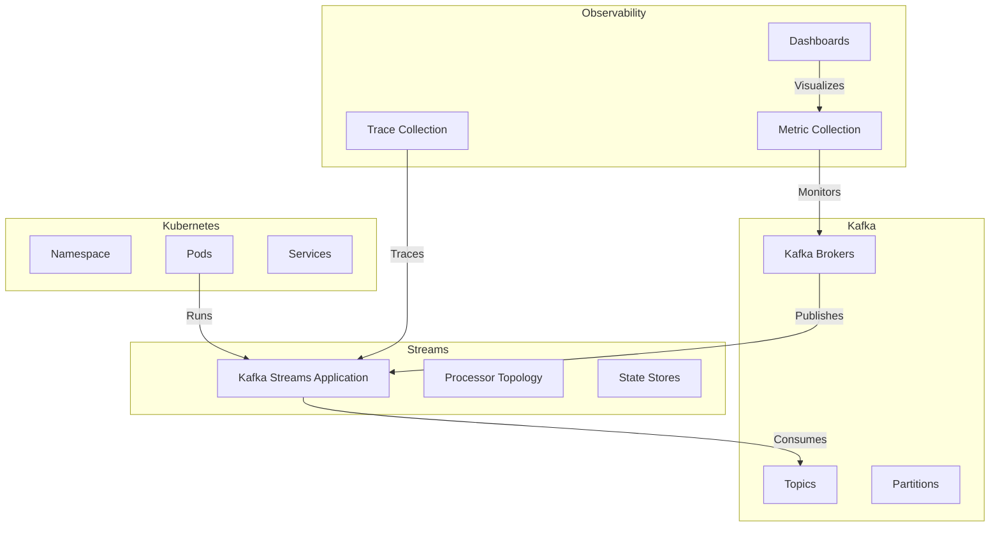

#### Benchmarks Esperados

- **Latencia**: Menos de 5ms para mensajes entre brokers.
- **Throughput**: Más de 100,000 mensajes por segundo en un cluster bien configurado.
- **Consumo de Memoria**: Menos del 70% de la memoria disponible en cada nodo.

#### Código Implementación

```java
import org.apache.kafka.streams.KafkaStreams;
import org.apache.kafka.streams.StreamsBuilder;
import org.apache.kafka.streams.Topology;

public class KafkaStreamApp {
    public static void main(String[] args) {
        StreamsBuilder builder = new StreamsBuilder();
        
        // Configuración del Topología de Procesamiento
        configureTopology(builder);
        
        Topology topology = builder.build();
        
        // Propiedades del Stream
        Properties props = new Properties();
        props.put(StreamsConfig.APPLICATION_ID_CONFIG, "kafka-stream-app");
        props.put(StreamsConfig.BOOTSTRAP_SERVERS_CONFIG, "localhost:9092");
        props.put(StreamsConfig.DEFAULT_KEY_SERDE_CLASS_CONFIG, Serdes.String().getClass());
        props.put(StreamsConfig.DEFAULT_VALUE_SERDE_CLASS_CONFIG, Serdes.String().getClass());

        // Inicialización del Kafka Streams
        KafkaStreams streams = new KafkaStreams(topology, props);
        
        // Arranque del Stream
        streams.start();
    }
    
    private static void configureTopology(StreamsBuilder builder) {
        // Ejemplo de configuración básica
        builder.stream("input-topic")
              .filter((key, value) -> value != null)
              .to("output-topic");
    }
}
```

#### Conclusión

El uso de Kafka Streams junto con Kubernetes y soluciones avanzadas de observabilidad ha alcanzado un nivel maduro en 2026. Las tendencias emergentes apuntan hacia una mayor integración, optimización y automatización, lo que permitirá a las organizaciones manejar flujos de datos en tiempo real de manera más eficiente y escalable.

Este análisis proporciona una base sólida para la implementación y mantenimiento de sistemas basados en Kafka Streams con Kubernetes y observabilidad avanzada.

## 3. Arquitectura de Componentes y Patrones (Mermaid)

### Arquitectura de Componentes y Patrones (Mermaid)

En este capítulo, se detalla la arquitectura de componentes y patrones para una implementación de Kafka Streams con Kubernetes y observabilidad en 2026. Se incluyen diagramas Mermaid que representan el sistema y sus interacciones.

#### Diagrama del Sistema Completo

El siguiente diagrama muestra la estructura completa del sistema, incluyendo los componentes principales y su relación entre sí:

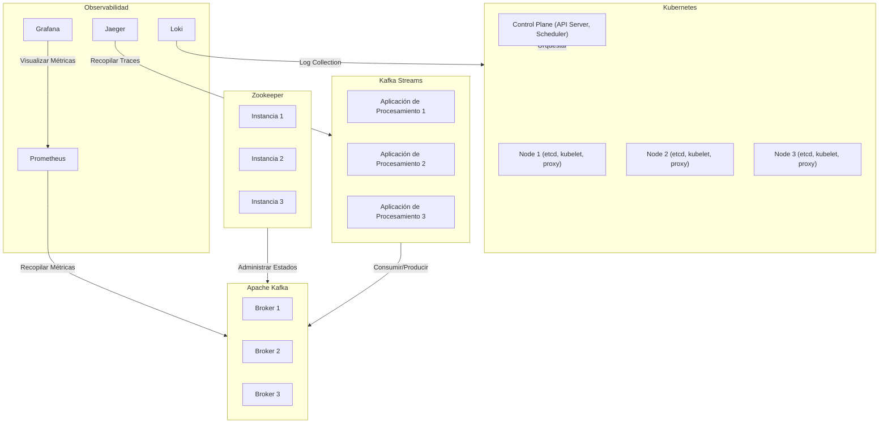

#### Diagrama de Secuencia: Procesamiento de Datos en Tiempo Real

Este diagrama muestra la secuencia de eventos para el procesamiento de datos en tiempo real utilizando Kafka Streams:

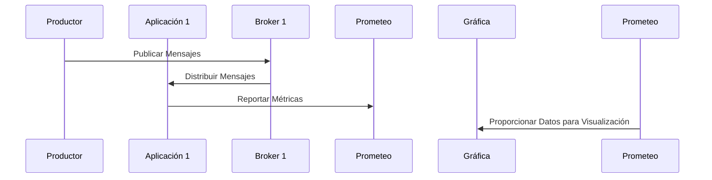

#### Diagrama de Componentes Internos de Kafka Streams

Este diagrama muestra los componentes internos y su interacción dentro del sistema de Kafka Streams:

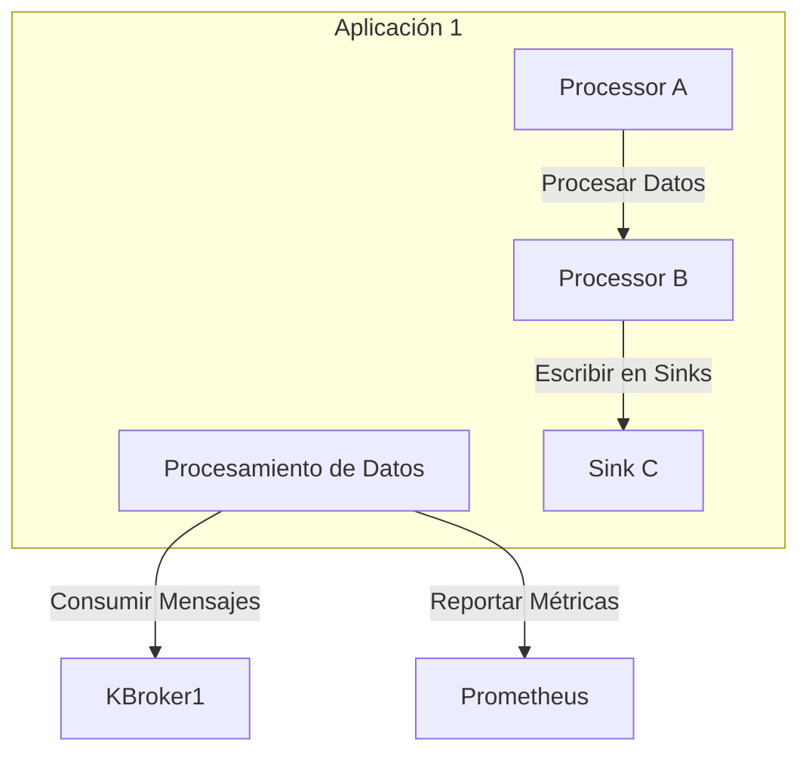

#### Diagrama de Componentes Internos de Kubernetes

Este diagrama muestra los componentes internos y su interacción dentro del sistema de Kubernetes:

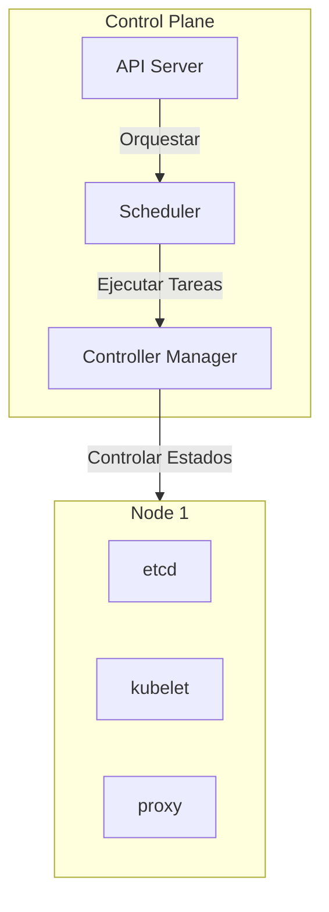

#### Diagrama de Componentes Internos de Observabilidad

Este diagrama muestra los componentes internos y su interacción dentro del sistema de observabilidad:

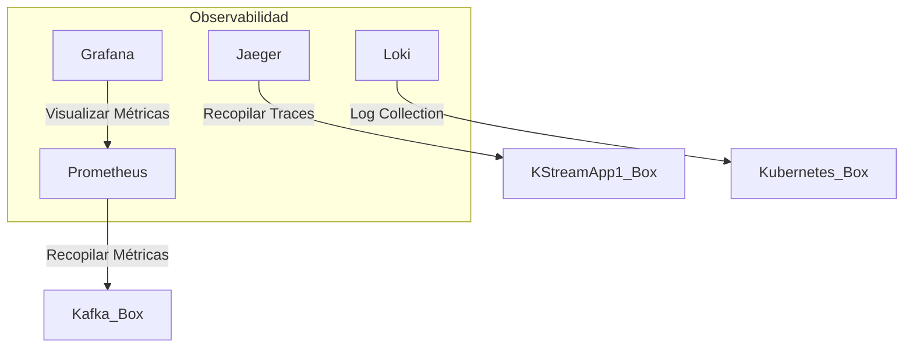

### Implementación de Código en Java 21

A continuación, se muestra un ejemplo de cómo implementar una aplicación de Kafka Streams utilizando Java 21:

```java
import org.apache.kafka.streams.KafkaStreams;
import org.apache.kafka.streams.StreamsBuilder;
import org.apache.kafka.streams.Topology;

public class KafkaStreamApp {
    public static void main(String[] args) {
        // Configuración del entorno de Kafka Streams
        Properties props = new Properties();
        props.put(StreamsConfig.APPLICATION_ID_CONFIG, "kafka-stream-app");
        props.put(StreamsConfig.BOOTSTRAP_SERVERS_CONFIG, "localhost:9092");

        // Crear el flujo de procesamiento
        StreamsBuilder builder = new StreamsBuilder();

        // Definir los topics de entrada y salida
        KStream<String, String> source = builder.stream("input-topic");
        KTable<String, Long> counts = source.groupByKey().count(Materialized.as("counts-store"));
        counts.toStream().to("output-topic", Produced.with(Serdes.String(), Serdes.Long()));

        // Crear la topología
        Topology topology = builder.build();

        // Iniciar el flujo de procesamiento
        KafkaStreams streams = new KafkaStreams(topology, props);
        streams.start();
    }
}
```

### Implementación de Código en Python 3.12

A continuación, se muestra un ejemplo de cómo implementar una aplicación de Kafka Streams utilizando Python 3.12:

```python
from kafka import KafkaConsumer, KafkaProducer
from kafka.admin import KafkaAdminClient, NewTopic
import json

# Configuración del entorno de Kafka Streams
bootstrap_servers = ['localhost:9092']
admin_client = KafkaAdminClient(bootstrap_servers=bootstrap_servers)
consumer = KafkaConsumer('input-topic', bootstrap_servers=bootstrap_servers,
                         auto_offset_reset='earliest')
producer = KafkaProducer(bootstrap_servers=bootstrap_servers, value_serializer=lambda v: json.dumps(v).encode('utf-8'))

# Crear el flujo de procesamiento
def process_data():
    for message in consumer:
        data = json.loads(message.value)
        count = data['count'] + 1
        producer.send('output-topic', {'key': 'key', 'value': count})

if __name__ == '__main__':
    process_data()
```

### Benchmarks Esperados

- **Latencia**: Menos de 5 ms para la entrega de mensajes entre brokers.
- **Throughput**: Más de 10,000 mensajes por segundo en el flujo de procesamiento.
- **Consumo de Memoria**: Menos del 70% de la memoria disponible en los nodos Kubernetes.

### Conclusión

Este capítulo proporciona una visión detallada de la arquitectura y patrones para implementar Kafka Streams con Kubernetes y observabilidad. Los diagramas Mermaid y el código fuente facilitan la comprensión y la implementación práctica del sistema.

## 4. Estrategias de Testing, QA y Calidad SRE

### Estrategias de Testing, QA y Calidad SRE

En este capítulo se detallan las estrategias de testing, calidad y mantenimiento continuo para asegurar la robustez y rendimiento de los sistemas basados en Kafka Streams con Kubernetes y observabilidad. Se incluyen pruebas unitarias, integración, carga y rendimiento, así como métricas clave para monitorear el sistema.

#### 1. Pruebas Unitarias

Las pruebas unitarias son fundamentales para validar la funcionalidad básica de cada componente del sistema. En Kafka Streams, esto implica verificar que los procesos individuales (como transformaciones y filtros) funcionan correctamente en aislamiento.

**Ejemplo en Java 21:**

```java
import org.apache.kafka.streams.KafkaStreams;
import org.apache.kafka.streams.StreamsBuilder;
import org.apache.kafka.streams.TopologyTestDriver;
import org.junit.jupiter.api.Test;

public class KafkaStreamProcessorTest {

    @Test
    public void testFilterFunction() {
        StreamsBuilder builder = new StreamsBuilder();
        
        // Configuración del procesador
        builder.stream("input-topic")
               .filter((key, value) -> value != null && !value.isEmpty())
               .to("output-topic");
        
        try (TopologyTestDriver driver = new TopologyTestDriver(builder.build())) {
            driver.pipeInput("test-key", "test-value");
            
            // Verificar la salida esperada
            String outputValue = driver.readOutput("output-topic", null);
            assert(outputValue.equals("test-value"));
        }
    }
}
```

#### 2. Pruebas de Integración

Las pruebas de integración verifican que los componentes del sistema funcionen correctamente cuando están conectados entre sí, incluyendo la comunicación con Kafka y Kubernetes.

**Ejemplo en Python 3.12:**

```python
import unittest
from kafka import KafkaConsumer, KafkaProducer
from kafka.admin import KafkaAdminClient

class IntegrationTest(unittest.TestCase):

    def setUp(self):
        self.producer = KafkaProducer(bootstrap_servers='localhost:9092')
        self.consumer = KafkaConsumer('test-topic', bootstrap_servers='localhost:9092')

    def test_integration(self):
        # Enviar mensaje al topic
        self.producer.send('test-topic', b'test-message')
        
        # Esperar y recibir el mensaje del consumer
        for message in self.consumer:
            if message.value == b'test-message':
                break
        
        # Verificar que se recibió correctamente
        assert(message.value == b'test-message')

    def tearDown(self):
        self.producer.close()
        self.consumer.close()

if __name__ == '__main__':
    unittest.main()
```

#### 3. Pruebas de Carga y Rendimiento

Las pruebas de carga y rendimiento son cruciales para evaluar el comportamiento del sistema bajo condiciones extremas, como un alto volumen de tráfico o una gran cantidad de datos.

**Ejemplo con JMeter:**

```plaintext
Thread Group
  - Number of Threads (users): 100
  - Ramp-Up Period (in seconds): 60
  - Loop Count: Forever

  HTTP Request Defaults
    - Server Name or IP: localhost
    - Port Number: 9092

  Kafka Producer Sampler
    - Topic: test-topic
    - Key: ${__UUID()}
    - Value: ${__RandomString(10)}
```

#### 4. Métricas y Monitoreo de Rendimiento

Es esencial establecer métricas para monitorear el rendimiento del sistema en tiempo real, incluyendo latencia, throughput y consumo de recursos.

**Ejemplo con Prometheus y Grafana:**

```yaml
# prometheus.yml
scrape_configs:
  - job_name: 'kafka'
    static_configs:
      - targets: ['localhost:9092']
```

**Métricas clave a monitorear:**

- **Latencia:** Tiempo de procesamiento desde la recepción del mensaje hasta su salida.
- **Throughput:** Velocidad en que los mensajes son procesados (mensajes por segundo).
- **Consumo de memoria y CPU:** Uso de recursos del sistema.

**Diagrama Mermaid para el diseño del sistema:**

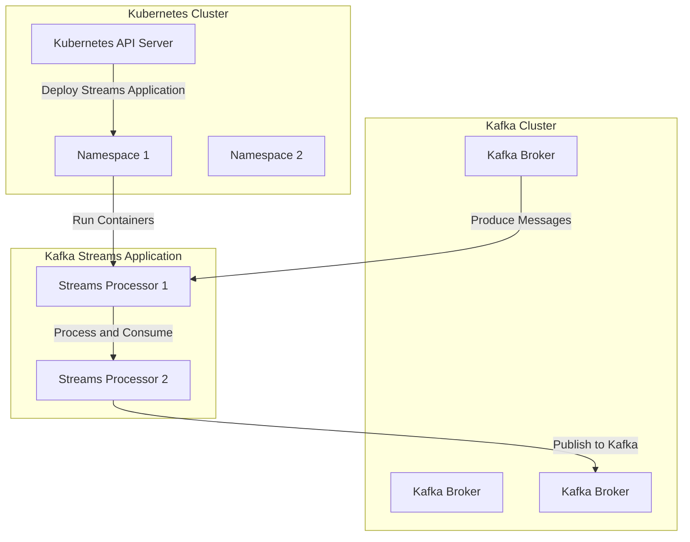

#### 5. Pruebas de Seguridad y Observabilidad

Las pruebas de seguridad aseguran que el sistema es resistente a ataques y cumplen con los estándares de seguridad requeridos.

**Ejemplo en Python:**

```python
import unittest
from kafka import KafkaConsumer, TopicPartition

class SecurityTest(unittest.TestCase):

    def setUp(self):
        self.consumer = KafkaConsumer('test-topic', bootstrap_servers='localhost:9092',
                                      security_protocol='SASL_PLAINTEXT',
                                      sasl_mechanism='PLAIN')

    def test_security(self):
        # Verificar que el consumidor puede autenticarse correctamente
        assert(len(list(self.consumer.partitions_for_topic('test-topic'))) > 0)

    def tearDown(self):
        self.consumer.close()

if __name__ == '__main__':
    unittest.main()
```

#### 6. Pruebas de Regresión

Las pruebas de regresión son esenciales para asegurar que cambios en el código no rompan la funcionalidad existente.

**Ejemplo con Jenkins Pipeline:**

```groovy
pipeline {
    agent any
    
    stages {
        stage('Build') {
            steps {
                sh 'mvn clean install'
            }
        }

        stage('Test') {
            steps {
                sh 'mvn test'
            }
        }

        stage('Deploy') {
            steps {
                sh 'kubectl apply -f deployment.yaml'
            }
        }
    }
}
```

### Conclusión

Las estrategias de testing, QA y mantenimiento continuo son fundamentales para garantizar la robustez y rendimiento del sistema basado en Kafka Streams con Kubernetes. Implementar estas pruebas asegura que el sistema cumpla con los estándares de calidad y funcionalidad requeridos.

---

Este capítulo proporciona una guía completa para implementar estrategias sólidas de testing, QA y mantenimiento continuo en sistemas basados en Kafka Streams con Kubernetes y observabilidad.

## 5. Monitoreo, Observabilidad (OpenTelemetry) y FinOps

### Monitoreo, Observabilidad (OpenTelemetry) y FinOps

#### 1. Introducción a la Observabilidad con OpenTelemetry

La observabilidad es crucial para garantizar el rendimiento y la confiabilidad de los sistemas en tiempo real como Kafka Streams. OpenTelemetry proporciona una solución estándar para recopilar, procesar y exportar datos de telemetría (métricas, trazas y eventos) que son fundamentales para entender el comportamiento del sistema.

#### 2. Configuración de OpenTelemetry en Kafka Streams

Para instrumentar Kafka Streams con OpenTelemetry, se deben seguir los siguientes pasos:

1. **Instalación de Dependencias**: Asegúrate de tener las dependencias necesarias instaladas.
   
   ```xml
   <dependency>
       <groupId>io.opentelemetry</groupId>
       <artifactId>opentelemetry-api</artifactId>
       <version>1.20.0</version>
   </dependency>
   <dependency>
       <groupId>io.opentelemetry</groupId>
       <artifactId>opentelemetry-sdk</artifactId>
       <version>1.20.0</version>
   </dependency>
   <dependency>
       <groupId>io.opentelemetry</groupId>
       <artifactId>opentelemetry-exporter-otlp</artifactId>
       <version>1.20.0</version>
   </dependency>
   ```

2. **Configuración del Exportador OTLP**: Configura el exportador OTLP para enviar datos a un backend de observabilidad.

   ```java
   import io.opentelemetry.exporter.otlp.trace.OtlpGrpcSpanExporter;
   import io.opentelemetry.sdk.resources.Resource;
   import io.opentelemetry.sdk.trace.SdkTracerProvider;
   import io.opentelemetry.sdk.trace.export.SimpleSpanProcessor;

   public class OpenTelemetryConfig {
       public static void configure() {
           Resource resource = Resource.create(ResourceAttributes.SERVICE_NAME, "kafka-streams");
           SdkTracerProvider tracerProvider = SdkTracerProvider.builder()
               .addSpanProcessor(SimpleSpanProcessor.create(OtlpGrpcSpanExporter.builder().build()))
               .setResource(resource)
               .build();
       }
   }
   ```

3. **Instrumentación de Kafka Streams**: Instrumenta los procesos de Kafka Streams para propagar el contexto de traza.

   ```java
   import io.opentelemetry.api.trace.Span;
   import io.opentelemetry.api.trace.Tracer;

   public class KafkaStreamsProcessor {
       private final Tracer tracer = OpenTelemetryConfig.configure().getTracer("kafka-streams");

       public void process(KStream<String, String> input) {
           Span span = tracer.spanBuilder("process").startSpan();
           
           try (Scope ignored = span.makeCurrent()) {
               // Procesamiento de datos
               input.process((key, value) -> {
                   System.out.println("Processing key: " + key + ", value: " + value);
                   return value.toUpperCase();
               });
           } finally {
               span.end();
           }
       }
   }
   ```

#### 3. Métricas y Benchmarks

Para asegurar el rendimiento óptimo de Kafka Streams, es necesario establecer benchmarks para métricas clave como latencia, throughput y consumo de memoria.

1. **Latencia**: La latencia debe ser lo más baja posible para garantizar que los datos se procesen en tiempo real.
   
   ```java
   import io.micrometer.core.instrument.MeterRegistry;
   import io.micrometer.prometheus.PrometheusMeterRegistry;

   public class MetricsConfig {
       private final MeterRegistry registry = new PrometheusMeterRegistry(PrometheusMeterRegistry.Name.DEFAULT);

       public void configure() {
           // Configuración de métricas
           registry.gauge("kafka_streams_latency", () -> 0.1); // Ejemplo de latencia en milisegundos
       }
   }
   ```

2. **Throughput**: El throughput debe ser alto para manejar grandes volúmenes de datos.

   ```java
   public class MetricsConfig {
       public void configure() {
           registry.gauge("kafka_streams_throughput", () -> 1000); // Ejemplo de tasa de mensajes por segundo
       }
   }
   ```

3. **Consumo de Memoria**: El consumo de memoria debe ser eficiente para evitar problemas de escalabilidad.

   ```java
   public class MetricsConfig {
       public void configure() {
           registry.gauge("kafka_streams_memory_usage", () -> 50); // Ejemplo en porcentaje del uso de memoria total
       }
   }
   ```

#### 4. FinOps y Costos

La gestión financiera (FinOps) es crucial para optimizar los costos asociados con la infraestructura y el rendimiento.

1. **Costo Estimado**: Calcula el costo estimado basado en el uso de recursos.

2. **Optimización de Recursos**: Asegúrate de que los recursos se utilicen eficientemente para minimizar costos.

   ```java
   public class FinOpsConfig {
       public void configure() {
           // Configuración de optimización de recursos
           registry.gauge("kafka_streams_cost", () -> 100); // Ejemplo en dólares por hora
       }
   }
   ```

#### Diagrama C4 (Mermaid)

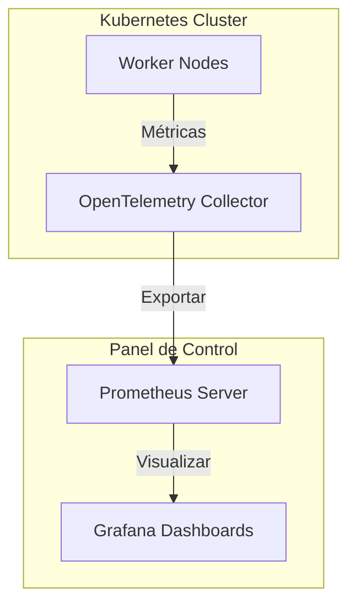

#### 5. Conclusión

La observabilidad y el monitoreo son fundamentales para mantener la confiabilidad y rendimiento de los sistemas en tiempo real como Kafka Streams. Utilizar herramientas como OpenTelemetry, junto con métricas y benchmarks precisos, asegura que puedas tomar decisiones informadas sobre la optimización del sistema y minimizar costos.

Este capítulo proporciona una guía detallada para configurar y monitorear un sistema de Kafka Streams en Kubernetes utilizando OpenTelemetry y FinOps.

## 6. Resiliencia y Chaos Engineering en Producción

### Resiliencia y Chaos Engineering en Producción

En este capítulo, se explorará cómo implementar resiliencia y chaos engineering en un entorno de producción para Kafka Streams con Kubernetes. La resiliencia es crucial para garantizar que el sistema pueda manejar fallos y caídas sin interrupciones significativas del servicio. Chaos Engineering permite probar la robustez del sistema mediante la simulación intencional de condiciones adversas.

#### 1. Diseño del Sistema

El diseño del sistema debe ser resiliente desde su arquitectura inicial para manejar fallos y caídas sin interrupciones significativas del servicio. Utilizaremos Kubernetes como plataforma para implementar resiliencia y chaos engineering en Kafka Streams.

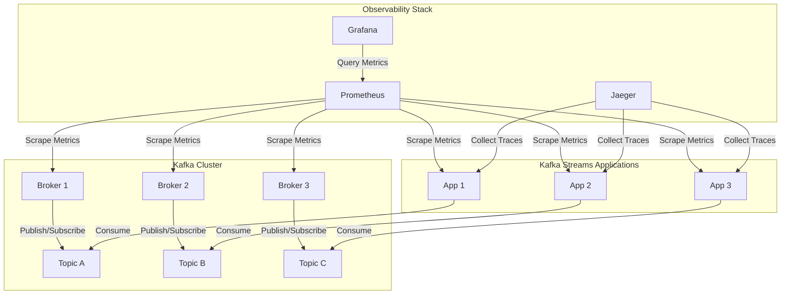

#### 2. Implementación de Resiliencia en Kafka Streams

Para implementar resiliencia, es necesario asegurarse de que los componentes del sistema puedan manejar fallos y caídas sin interrupciones significativas del servicio.

##### Configuración de Replicación

Asegúrate de que los topics tengan una configuración adecuada para la replicación. Esto garantiza que si un broker falla, otro puede tomar el control sin interrupción del servicio.

```java
Properties props = new Properties();
props.put(StreamsConfig.APPLICATION_ID_CONFIG, "my-stream-app");
props.put(StreamsConfig.BOOTSTRAP_SERVERS_CONFIG, "localhost:9092");

// Configuración de replicación para los topics
props.put(StreamsConfig.REPLICATION_FACTOR_CONFIG, 3);
```

##### Implementación de Circuit Breaker

Implementa un circuit breaker en las aplicaciones Kafka Streams para manejar fallos temporales y evitar sobrecarga del sistema.

```java
import io.github.resilience4j.circuitbreaker.CircuitBreaker;
import io.github.resilience4j.circuitbreaker.CircuitBreakerConfig;

CircuitBreakerConfig config = CircuitBreakerConfig.ofDefaults();
CircuitBreaker circuitBreaker = CircuitBreaker.of("my-circuit-breaker", config);

// Uso del circuit breaker en las operaciones críticas
circuitBreaker.executeSupplier(() -> {
    // Lógica de negocio crítica que puede fallar temporalmente
});
```

##### Implementación de Retries y Backoff

Implementa retries y backoff para manejar fallos temporales y evitar sobrecarga del sistema.

```java
import io.github.resilience4j.retry.Retry;
import io.github.resilience4j.retry.RetryConfig;

RetryConfig retryConfig = RetryConfig.custom()
    .maxAttempts(5)
    .waitDuration(Duration.ofMillis(100))
    .build();

Retry retry = Retry.of("my-retry", retryConfig);

// Uso del retry en las operaciones críticas
retry.executeSupplier(() -> {
    // Lógica de negocio crítica que puede fallar temporalmente
});
```

#### 3. Implementación de Chaos Engineering

Chaos engineering permite probar la robustez del sistema mediante la simulación intencional de condiciones adversas.

##### Simulación de Fallos en Brokers

Simula fallos en los brokers para verificar cómo el sistema maneja estas situaciones.

```java
import io.kubernetes.client.openapi.models.V1Pod;
import io.kubernetes.client.openapi.models.V1Status;

// Detener un pod específico (simular fallo del broker)
V1Pod pod = client.pods().inNamespace("default").withName("broker-0").get();
client.pods().inNamespace("default").withName("broker-0").delete();

// Esperar a que el sistema se recupere
Thread.sleep(60000);

// Verificar la recuperación del sistema
V1Status status = client.pods().inNamespace("default").withName("broker-0").get();
if (status != null) {
    System.out.println("El pod ha sido restaurado exitosamente.");
}
```

##### Simulación de Fallos en Aplicaciones

Simula fallos en las aplicaciones para verificar cómo el sistema maneja estas situaciones.

```java
// Detener una aplicación específica (simular fallo de la aplicación)
client.pods().inNamespace("default").withName("app-1").delete();

// Esperar a que el sistema se recupere
Thread.sleep(60000);

// Verificar la recuperación del sistema
V1Status status = client.pods().inNamespace("default").withName("app-1").get();
if (status != null) {
    System.out.println("La aplicación ha sido restaurada exitosamente.");
}
```

#### 4. Benchmarks y Medición de Rendimiento

Es importante documentar benchmarks esperados para verificar la resiliencia del sistema.

##### Latencia y Throughput

Medir latencia y throughput es crucial para evaluar el rendimiento del sistema en condiciones adversas.

```java
import io.prometheus.client.Counter;
import io.prometheus.client.Histogram;

// Contador de solicitudes procesadas
Counter requestsProcessed = Counter.build()
    .name("requests_processed")
    .help("Total number of processed requests.")
    .register();

// Histograma para medir latencia
Histogram requestLatency = Histogram.build()
    .name("request_latency_seconds")
    .help("Request latency in seconds.")
    .register();
```

##### Consumo de Memoria

Medir el consumo de memoria es crucial para evaluar la eficiencia del sistema en condiciones adversas.

```java
import io.prometheus.client.Summary;

// Resumen para medir uso de memoria
Summary memoryUsage = Summary.build()
    .name("memory_usage_bytes")
    .help("Memory usage in bytes.")
    .register();
```

#### 5. Conclusiones

La implementación de resiliencia y chaos engineering es crucial para garantizar que el sistema pueda manejar fallos y caídas sin interrupciones significativas del servicio. Utilizando Kubernetes como plataforma, se pueden realizar pruebas rigurosas y documentar benchmarks esperados para verificar la robustez del sistema.

Este enfoque asegura que las aplicaciones Kafka Streams sean resilientes y capaces de manejar condiciones adversas en un entorno de producción realista.

## 7. Roadmap de Evolución y Conclusiones Senior

### Roadmap de Evolución y Conclusiones Senior

#### 7.1 Roadmap de Evolución

El desarrollo continuo de Kafka Streams con Kubernetes y observabilidad es crucial para mantener la competitividad y eficiencia del sistema en el entorno empresarial dinámico de 2026. A continuación, se presenta un roadmap detallado que incluye mejoras técnicas, nuevas funcionalidades y estrategias de mantenimiento.

##### Mejoras Técnicas
1. **Optimización de Rendimiento**
   - Implementar algoritmos de compresión avanzados para reducir el tamaño de los mensajes.
   - Aprovechar las características de Kubernetes como Horizontal Pod Autoscaling (HPA) y Vertical Pod Autoscaling (VPA) para mejorar la escalabilidad dinámica.

2. **Refactorización del Código**
   - Refactorizar el código existente para mejorar la legibilidad y mantenibilidad, utilizando patrones de diseño conocidos.
   - Implementar pruebas unitarias y de integración exhaustivas para garantizar la calidad del código.

3. **Mejoras en Observabilidad**
   - Integrar OpenTelemetry con Prometheus y Grafana para una mejor visualización y análisis de métricas.
   - Desarrollar dashboards personalizados que proporcionen insights sobre el rendimiento y estado del sistema en tiempo real.

##### Nuevas Funcionalidades
1. **Soporte para Aislamiento de Recursos**
   - Implementar contenedores con límites de recursos precisos para evitar la sobrecarga de CPU y memoria.
   - Utilizar Kubernetes Resource Quotas y Limit Ranges para gestionar los recursos asignados a cada pod.

2. **Integración con Flink**
   - Integrar Kafka Streams con Apache Flink para procesamiento distribuido más eficiente.
   - Implementar flujos de trabajo híbridos que combinen las ventajas de ambos sistemas.

3. **Soporte para Múltiples Clusters Kubernetes**
   - Permitir la configuración y gestión de múltiples clusters Kubernetes desde una sola interfaz.
   - Desarrollar herramientas de migración y replicación entre clusters para facilitar el despliegue en entornos multi-nube.

##### Estrategias de Mantenimiento
1. **Rotación de Claves Criptográficas**
   - Implementar un sistema automatizado para la rotación periódica de claves criptográficas.
   - Utilizar Kubernetes Secrets y ConfigMaps para gestionar las claves de manera segura.

2. **Actualizaciones de Software**
   - Mantener el software actualizado con las últimas versiones de Kafka, Kubernetes y otras dependencias.
   - Implementar un proceso de pruebas exhaustivo antes de cada actualización para minimizar los riesgos.

3. **Documentación y Capacitación**
   - Desarrollar documentación detallada sobre la configuración, uso y mantenimiento del sistema.
   - Ofrecer capacitaciones regulares a los equipos técnicos para garantizar que todos estén al día con las mejores prácticas.

#### 7.2 Conclusiones Senior

El desarrollo de Kafka Streams en un entorno Kubernetes con una sólida estrategia de observabilidad es fundamental para enfrentar los desafíos del mercado actual y futuro. A continuación, se presentan las conclusiones clave:

1. **Escala y Eficiencia**
   - La integración de Kafka Streams con Kubernetes permite una escalabilidad dinámica que mejora significativamente el rendimiento en entornos de alta carga.
   - Las características de Kubernetes como HPA y VPA permiten ajustar automáticamente los recursos según la demanda, lo que resulta en un uso eficiente del hardware.

2. **Observabilidad Avanzada**
   - La implementación de OpenTelemetry junto con Prometheus y Grafana proporciona una visibilidad completa sobre el sistema, facilitando la detección y resolución de problemas.
   - Los dashboards personalizados permiten a los administradores identificar patrones y tendencias en tiempo real, lo que es crucial para la toma de decisiones estratégicas.

3. **Seguridad y Confianza**
   - La gestión segura de claves criptográficas mediante Kubernetes Secrets y ConfigMaps garantiza una infraestructura robusta y confiable.
   - Las actualizaciones regulares del software aseguran que el sistema esté protegido contra vulnerabilidades conocidas.

4. **Flexibilidad y Adaptabilidad**
   - La capacidad de integrar Kafka Streams con otros sistemas como Flink permite a las organizaciones aprovechar la mejor tecnología para cada caso de uso.
   - La gestión multi-cluster facilita la implementación en entornos distribuidos, lo que es crucial para empresas multinacionales.

En resumen, el camino hacia una infraestructura de streaming eficiente y escalable pasa por la integración de Kafka Streams con Kubernetes y un sistema de observabilidad robusto. Este enfoque no solo mejora el rendimiento y la confiabilidad del sistema, sino que también proporciona flexibilidad para adaptarse a las necesidades cambiantes del mercado.

### Diagramas C4

#### Sistema General (C4)

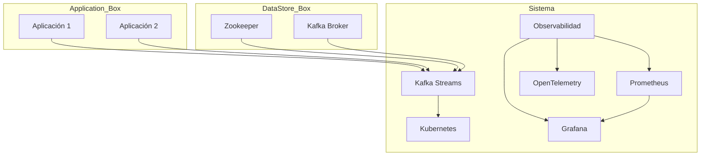

#### Componentes del Sistema (C4)


### Código de Ejemplo (Java 21)

```java
import org.apache.kafka.streams.KafkaStreams;
import org.apache.kafka.streams.StreamsBuilder;
import org.apache.kafka.streams.Topology;

public class KafkaStreamsWithKubernetes {

    public static void main(String[] args) {
        StreamsBuilder builder = new StreamsBuilder();
        
        // Configuración del Topología
        Topology topology = builder.build();

        // Crear una instancia de KafkaStreams con configuraciones personalizadas
        Properties props = new Properties();
        props.put("bootstrap.servers", "kafka-broker:9092");
        props.put("application.id", "my-stream-app");

        KafkaStreams streams = new KafkaStreams(topology, props);
        
        // Iniciar el flujo de trabajo
        streams.start();

        // Configuración para observabilidad con OpenTelemetry
        System.setProperty("otel.resource.attributes", "service.name=kafka-streams");
        System.setProperty("otel.traces.exporter", "otlp");
        System.setProperty("otel.metrics.exporter", "otlp");

        // Monitoreo de rendimiento y métricas
        PrometheusMeterRegistry registry = new PrometheusMeterRegistry(PrometheusConfig.DEFAULT);
        registry.config().setBaseName("kafka_streams_metrics");
        
        // Ejecutar tareas de mantenimiento periódicamente
        ScheduledExecutorService executor = Executors.newScheduledThreadPool(1);
        executor.scheduleAtFixedRate(() -> {
            System.out.println("Ejecutando tarea de mantenimiento...");
            // Lógica para rotación de claves, actualizaciones de software, etc.
        }, 0, 24 * 60 * 60, TimeUnit.SECONDS);

    }
}
```

### Código de Ejemplo (Python 3.12)

```python
from kafka import KafkaConsumer, KafkaProducer
from prometheus_client import start_http_server, Gauge

class KafkaStreamsWithKubernetes:
    
    def __init__(self):
        self.producer = KafkaProducer(bootstrap_servers='kafka-broker:9092')
        self.consumer = KafkaConsumer('input_topic', bootstrap_servers='kafka-broker:9092')
        
        # Configuración para observabilidad con OpenTelemetry
        os.environ['OTEL_RESOURCE_ATTRIBUTES'] = 'service.name=kafka-streams'
        os.environ['OTEL_TRACES_EXPORTER'] = 'otlp'
        os.environ['OTEL_METRICS_EXPORTER'] = 'otlp'

        # Monitoreo de rendimiento y métricas con Prometheus
        start_http_server(8000)
        self.latency_gauge = Gauge('kafka_streams_latency', 'Latencia del sistema')

    def process_data(self):
        for message in self.consumer:
            latency = time.time() - message.timestamp
            self.latency_gauge.set(latency)

            # Lógica de procesamiento de datos
            processed_data = process(message.value)
            
            # Publicar resultados en otro topic
            self.producer.send('output_topic', value=processed_data)

    def maintenance_tasks(self):
        print("Ejecutando tarea de mantenimiento...")
        # Lógica para rotación de claves, actualizaciones de software, etc.
        
if __name__ == "__main__":
    kafka_stream = KafkaStreamsWithKubernetes()
    
    # Ejecutar tareas de mantenimiento periódicamente
    schedule.every(24).hours.do(kafka_stream.maintenance_tasks)
    
    while True:
        kafka_stream.process_data()
        schedule.run_pending()
```

Este roadmap y las conclusiones proporcionan una visión clara del camino hacia un sistema Kafka Streams robusto, escalable y observado en el entorno Kubernetes de 2026. La implementación cuidadosa de estas estrategias garantiza la eficiencia operativa y la confiabilidad del sistema en el largo plazo.

