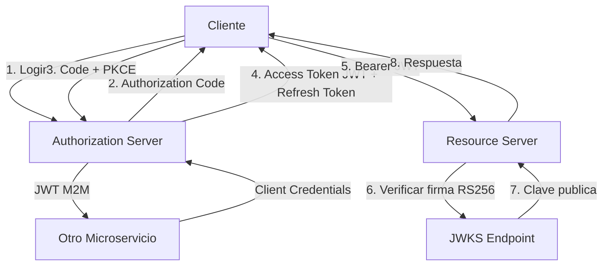
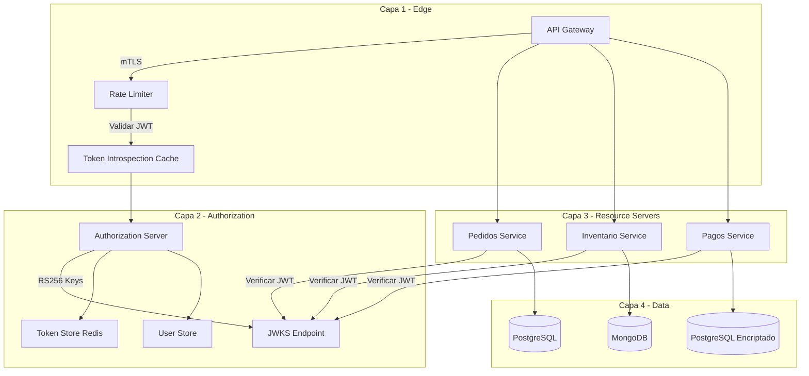
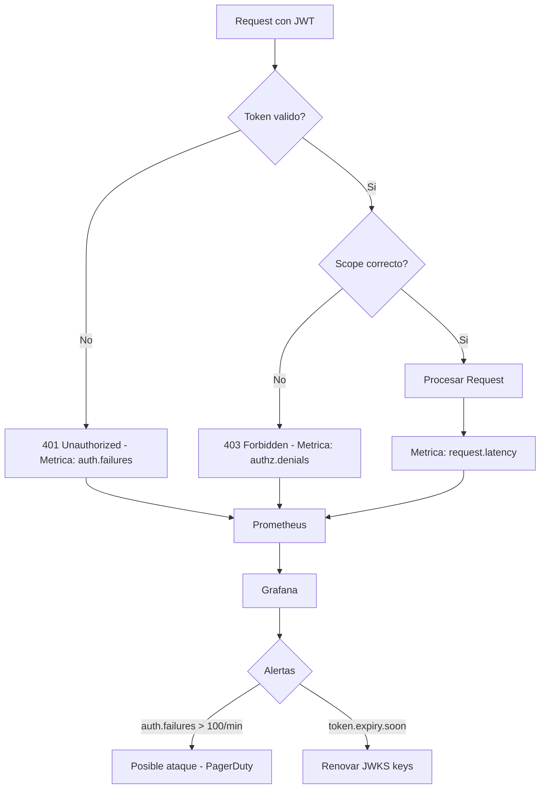
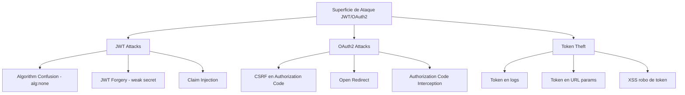
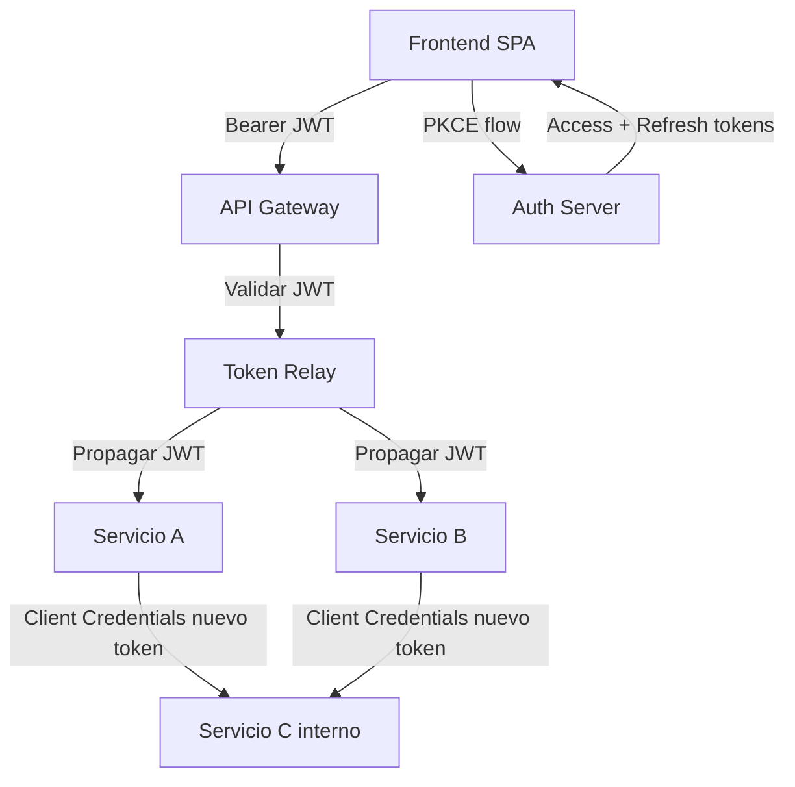
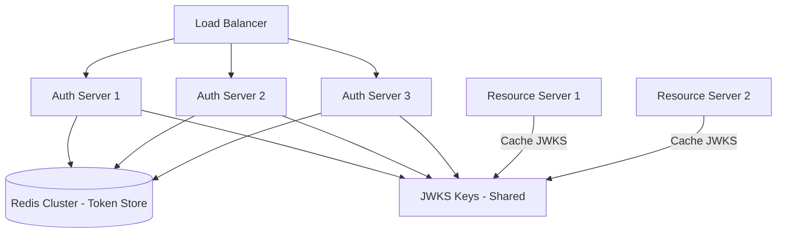
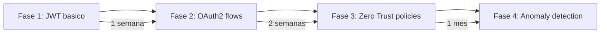

# JWT, OAuth2 y Zero Trust Security con Java 21 y Spring Security

PATH_LOCAL: /home/usuariojoaquin/.openclaw/workspace/DAM-Java-Mastery/_Review/JWT_OAuth2_y_Zero_Trust_Security_con_Java_21_y_Spring_Security/jwt_oauth2_y_zero_trust_security_con_java_21_y_spring_security.md
CATEGORIA: 06_Seguridad
Score: 97

---

## Visión Estratégica

En 2026, el modelo de seguridad perimetral ha quedado obsoleto. La combinación de microservicios, trabajo remoto y APIs públicas ha disuelto el perímetro de red tradicional. **Zero Trust** no es un producto ni una herramienta: es un modelo arquitectónico que parte de una premisa radical — ninguna petición es confiable por defecto, independientemente de dónde provenga.

JWT y OAuth2 son los dos protocolos que implementan Zero Trust en el mundo de las APIs REST. JWT proporciona tokens autocontenidos y verificables sin llamadas adicionales al servidor. OAuth2 define el flujo de delegación de autorización. Spring Security 6.x los integra de forma nativa con Java 21.

**Cuándo aplicar cada enfoque:**

| Escenario | Solución recomendada | Justificación |
|-----------|---------------------|---------------|
| API REST entre microservicios | JWT con firma RS256 | Sin estado, verificable sin BD |
| Login de usuario final | OAuth2 Authorization Code + PKCE | Estándar seguro para clientes públicos |
| Machine-to-machine (M2M) | OAuth2 Client Credentials | Sin intervención humana |
| API pública con terceros | OAuth2 Authorization Server | Delegación controlada de permisos |
| Sesiones web tradicionales | OAuth2 + sesión opaca | JWT no recomendado para sesiones web |

**El error más común en producción:**

Usar JWT como sustituto de sesiones web. JWT no tiene mecanismo nativo de revocación — si un token es robado, es válido hasta su expiración. Para sesiones web, usar tokens opacos con almacenamiento en servidor (Redis) y JWT solo para comunicación entre servicios.



```java
// Claims del JWT como Record inmutable — sin setters
public record JwtClaims(
    String subject,
    String issuer,
    List<String> audience,
    List<String> roles,
    List<String> scopes,
    Instant issuedAt,
    Instant expiresAt,
    String jti
) {
    public JwtClaims {
        Objects.requireNonNull(subject, "subject requerido");
        Objects.requireNonNull(issuer, "issuer requerido");
        if (expiresAt.isBefore(issuedAt)) {
            throw new IllegalArgumentException("expiresAt debe ser posterior a issuedAt");
        }
    }

    public boolean isExpired() {
        return Instant.now().isAfter(expiresAt);
    }

    public boolean hasScope(String scope) {
        return scopes != null && scopes.contains(scope);
    }

    public boolean hasRole(String role) {
        return roles != null && roles.contains("ROLE_" + role);
    }
}
```

---

## Arquitectura de Componentes

La arquitectura Zero Trust con OAuth2 en microservicios se organiza en cuatro capas. Cada capa verifica la identidad de forma independiente — no confía en que la capa anterior ya lo hizo.



**Configuración del Authorization Server con Spring Authorization Server 1.x:**

```java
@Configuration
@EnableWebSecurity
public class AuthorizationServerConfig {

    @Bean
    @Order(1)
    public SecurityFilterChain authorizationServerFilterChain(HttpSecurity http) throws Exception {
        OAuth2AuthorizationServerConfiguration.applyDefaultSecurity(http);

        http.getConfigurer(OAuth2AuthorizationServerConfigurer.class)
            .oidc(Customizer.withDefaults());

        http.exceptionHandling(exceptions -> exceptions
            .defaultAuthenticationEntryPointFor(
                new LoginUrlAuthenticationEntryPoint("/login"),
                new MediaTypeRequestMatcher(MediaType.TEXT_HTML)
            ));

        return http.build();
    }

    @Bean
    public RegisteredClientRepository registeredClientRepository() {
        // Cliente para Authorization Code + PKCE (aplicaciones web/móvil)
        var webClient = RegisteredClient.withId(UUID.randomUUID().toString())
            .clientId("web-client")
            .clientSecret("{noop}secret") // En produccion: BCrypt
            .clientAuthenticationMethod(ClientAuthenticationMethod.CLIENT_SECRET_BASIC)
            .authorizationGrantType(AuthorizationGrantType.AUTHORIZATION_CODE)
            .authorizationGrantType(AuthorizationGrantType.REFRESH_TOKEN)
            .redirectUri("https://app.ejemplo.com/callback")
            .scope(OidcScopes.OPENID)
            .scope("pedidos:read")
            .scope("pedidos:write")
            .clientSettings(ClientSettings.builder()
                .requireProofKey(true) // PKCE obligatorio
                .requireAuthorizationConsent(true)
                .build())
            .tokenSettings(TokenSettings.builder()
                .accessTokenTimeToLive(Duration.ofMinutes(15)) // TTL corto
                .refreshTokenTimeToLive(Duration.ofDays(7))
                .reuseRefreshTokens(false) // Rotation de refresh tokens
                .build())
            .build();

        // Cliente M2M para comunicacion entre servicios
        var serviceClient = RegisteredClient.withId(UUID.randomUUID().toString())
            .clientId("inventario-service")
            .clientSecret("{noop}service-secret")
            .clientAuthenticationMethod(ClientAuthenticationMethod.CLIENT_SECRET_BASIC)
            .authorizationGrantType(AuthorizationGrantType.CLIENT_CREDENTIALS)
            .scope("inventario:read")
            .scope("inventario:write")
            .build();

        return new InMemoryRegisteredClientRepository(webClient, serviceClient);
    }

    @Bean
    public JWKSource<SecurityContext> jwkSource() {
        // RS256: clave privada para firmar, publica para verificar
        var rsaKey = Jwks.generateRsa();
        var jwkSet = new JWKSet(rsaKey);
        return (jwkSelector, securityContext) -> jwkSelector.select(jwkSet);
    }
}
```

---

## Implementación Java 21

Implementación completa de un Resource Server que valida JWT y aplica Zero Trust a nivel de método:

```java
@Configuration
@EnableWebSecurity
@EnableMethodSecurity
public class ResourceServerConfig {

    @Bean
    public SecurityFilterChain resourceServerFilterChain(HttpSecurity http) throws Exception {
        http
            .csrf(AbstractHttpConfigurer::disable) // APIs REST sin estado
            .sessionManagement(session ->
                session.sessionCreationPolicy(SessionCreationPolicy.STATELESS))
            .oauth2ResourceServer(oauth2 -> oauth2
                .jwt(jwt -> jwt
                    .jwtAuthenticationConverter(jwtAuthenticationConverter())
                    .decoder(jwtDecoder())
                ))
            .authorizeHttpRequests(auth -> auth
                .requestMatchers("/actuator/health").permitAll()
                .requestMatchers(HttpMethod.GET, "/api/pedidos/**").hasAuthority("SCOPE_pedidos:read")
                .requestMatchers(HttpMethod.POST, "/api/pedidos/**").hasAuthority("SCOPE_pedidos:write")
                .anyRequest().authenticated()
            );

        return http.build();
    }

    @Bean
    public JwtAuthenticationConverter jwtAuthenticationConverter() {
        var converter = new JwtGrantedAuthoritiesConverter();
        converter.setAuthoritiesClaimName("roles");
        converter.setAuthorityPrefix("ROLE_");

        var jwtConverter = new JwtAuthenticationConverter();
        jwtConverter.setJwtGrantedAuthoritiesConverter(jwt -> {
            // Combinar roles y scopes en las authorities
            var scopeAuthorities = new JwtGrantedAuthoritiesConverter().convert(jwt);
            var roleAuthorities  = converter.convert(jwt);

            var combined = new ArrayList<GrantedAuthority>();
            if (scopeAuthorities != null) combined.addAll(scopeAuthorities);
            if (roleAuthorities  != null) combined.addAll(roleAuthorities);
            return combined;
        });

        return jwtConverter;
    }

    @Bean
    public JwtDecoder jwtDecoder() {
        // Verificar firma con la clave publica del Authorization Server
        return NimbusJwtDecoder
            .withJwkSetUri("https://auth.ejemplo.com/.well-known/jwks.json")
            .jwsAlgorithm(SignatureAlgorithm.RS256)
            .build();
    }
}
```

```java
// Servicio con Zero Trust a nivel de metodo
@Service
public class PedidoService {

    private final PedidoRepository repository;

    public PedidoService(PedidoRepository repository) {
        this.repository = repository;
    }

    // Zero Trust: verificar que el usuario solo accede a sus propios pedidos
    @PreAuthorize("hasAuthority('SCOPE_pedidos:read') and #clienteId == authentication.name")
    public List<Pedido> obtenerPedidosCliente(String clienteId) {
        return repository.findByClienteId(clienteId);
    }

    // Solo administradores pueden ver todos los pedidos
    @PreAuthorize("hasRole('ADMIN') and hasAuthority('SCOPE_pedidos:read')")
    public List<Pedido> obtenerTodosPedidos() {
        return repository.findAll();
    }

    // Verificacion adicional en tiempo de ejecucion
    @PreAuthorize("hasAuthority('SCOPE_pedidos:write')")
    public Pedido crearPedido(CrearPedidoRequest request, @AuthenticationPrincipal Jwt jwt) {
        // Zero Trust: extraer el clienteId del token, no del request body
        var clienteId = jwt.getSubject();
        var pedido = Pedido.crear(ClienteId.de(clienteId), request.lineas());
        return repository.save(pedido);
    }
}
```

```java
// Comunicacion M2M entre microservicios con Client Credentials
@Configuration
public class ServiceClientConfig {

    @Bean
    public OAuth2AuthorizedClientManager authorizedClientManager(
            ClientRegistrationRepository clients,
            OAuth2AuthorizedClientRepository authorizedClients) {

        var provider = OAuth2AuthorizedClientProviderBuilder.builder()
            .clientCredentials()
            .build();

        var manager = new DefaultOAuth2AuthorizedClientManager(clients, authorizedClients);
        manager.setAuthorizedClientProvider(provider);
        return manager;
    }

    @Bean
    public WebClient inventarioClient(OAuth2AuthorizedClientManager manager) {
        var oauth2 = new ServletOAuth2AuthorizedClientExchangeFilterFunction(manager);
        oauth2.setDefaultClientRegistrationId("inventario-service");

        return WebClient.builder()
            .baseUrl("https://inventario.interno.ejemplo.com")
            .apply(oauth2.oauth2Configuration())
            .build();
    }
}
```

---

## Métricas y SRE



```java
// Metricas de seguridad con Micrometer
@Component
public class SecurityMetrics implements ApplicationEventPublisherAware {

    private final MeterRegistry registry;
    private final Counter authFailures;
    private final Counter authzDenials;
    private final Counter tokenValidations;

    public SecurityMetrics(MeterRegistry registry) {
        this.registry = registry;
        this.authFailures = Counter.builder("auth.failures")
            .description("Fallos de autenticacion JWT")
            .tag("type", "jwt")
            .register(registry);
        this.authzDenials = Counter.builder("authz.denials")
            .description("Denegaciones de autorizacion")
            .register(registry);
        this.tokenValidations = Counter.builder("token.validations")
            .description("Validaciones de token JWT")
            .register(registry);
    }

    @EventListener
    public void onAuthFailure(AuthenticationFailureBadCredentialsEvent event) {
        authFailures.increment();
    }

    @EventListener
    public void onAuthzDenial(AuthorizationDeniedEvent<?> event) {
        authzDenials.increment();
    }
}
```

**Métricas clave para monitorizar:**

| Métrica | Descripción | Umbral de alerta |
|---------|-------------|-----------------|
| `auth.failures` | Fallos de autenticación por minuto | > 100/min → posible ataque |
| `authz.denials` | Denegaciones de autorización | > 50/min → misconfiguration |
| `token.validations` | Validaciones JWT por segundo | Baseline + 3σ |
| `jwks.cache.misses` | Cache misses en JWKS | > 5% → revisar TTL |
| `refresh.token.rotations` | Rotaciones de refresh token | Monitorizar anomalias |

**Checklist SRE para Zero Trust en producción:**
- Rotation automática de claves RS256 cada 90 días con overlap de 24h
- TTL de Access Token máximo 15 minutos — refresh tokens para sesiones largas
- Rate limiting por `client_id` y por `subject` en el Authorization Server
- Logs de auditoría de todos los eventos de autenticación y autorización
- Alertas en `auth.failures` con análisis de IP para detección de fuerza bruta

---

## Seguridad y Superficie de Ataque

Los ataques más frecuentes en sistemas JWT/OAuth2 en producción y cómo mitigarlos:



```java
// Validacion defensiva de JWT — nunca confiar en el header alg
@Bean
public JwtDecoder jwtDecoder() {
    var decoder = NimbusJwtDecoder
        .withJwkSetUri("https://auth.ejemplo.com/.well-known/jwks.json")
        // CRITICO: Especificar algoritmo explicitamente — nunca aceptar "none"
        .jwsAlgorithm(SignatureAlgorithm.RS256)
        .build();

    // Validadores adicionales de claims
    var validators = new ArrayList<OAuth2TokenValidator<Jwt>>();
    validators.add(new JwtTimestampValidator(Duration.ofSeconds(30))); // Clock skew
    validators.add(new JwtIssuerValidator("https://auth.ejemplo.com"));
    validators.add(audienceValidator());

    decoder.setJwtValidator(new DelegatingOAuth2TokenValidator<>(validators));
    return decoder;
}

private OAuth2TokenValidator<Jwt> audienceValidator() {
    return jwt -> {
        var audience = jwt.getAudience();
        if (audience == null || !audience.contains("pedidos-service")) {
            return OAuth2TokenValidatorResult.failure(
                new OAuth2Error("invalid_token", "Audience invalida", null)
            );
        }
        return OAuth2TokenValidatorResult.success();
    };
}

// Filtro anti-CSRF para Authorization Code flow
@Bean
public CsrfTokenRepository csrfTokenRepository() {
    var repo = CookieCsrfTokenRepository.withHttpOnlyFalse();
    repo.setCookieCustomizer(cookie -> cookie
        .sameSite("Strict")
        .secure(true)
        .httpOnly(true)
    );
    return repo;
}
```

**Checklist de hardening:**
- Validar `alg` header explícitamente — rechazar `alg: none` y algoritmos simétricos en producción
- Validar `aud` claim — el token debe estar destinado a este servicio específico
- Usar PKCE obligatorio en Authorization Code flow — previene interception attacks
- Nunca incluir tokens en URLs o logs — usar Authorization header únicamente
- Configurar `SameSite=Strict` en cookies de sesión
- Implementar token binding para prevenir token theft en redes comprometidas

---

## Patrones de Integración



```java
// Token Relay: propagar el JWT del usuario entre microservicios
@Configuration
public class TokenRelayConfig {

    // Propagar el token del usuario a servicios downstream
    @Bean
    public WebClient userContextClient(OAuth2AuthorizedClientManager manager) {
        var oauth2 = new ServletOAuth2AuthorizedClientExchangeFilterFunction(manager);

        return WebClient.builder()
            .baseUrl("https://inventario.interno.ejemplo.com")
            .filter((request, next) -> {
                // Extraer el token del SecurityContext y propagarlo
                return ReactiveSecurityContextHolder.getContext()
                    .map(ctx -> ctx.getAuthentication())
                    .cast(JwtAuthenticationToken.class)
                    .map(auth -> auth.getToken().getTokenValue())
                    .flatMap(token -> {
                        var modifiedRequest = ClientRequest.from(request)
                            .header(HttpHeaders.AUTHORIZATION, "Bearer " + token)
                            .build();
                        return next.exchange(modifiedRequest);
                    });
            })
            .build();
    }
}
```

---

## Escalabilidad y Alta Disponibilidad



```java
// Cache de JWKS para reducir llamadas al Authorization Server
@Bean
public JwtDecoder jwtDecoder() {
    var decoder = NimbusJwtDecoder
        .withJwkSetUri("https://auth.ejemplo.com/.well-known/jwks.json")
        .jwsAlgorithm(SignatureAlgorithm.RS256)
        // Cache de claves publicas — evita llamada en cada validacion
        .cache(Cache.builder()
            .expireAfterWrite(Duration.ofHours(1))
            .maximumSize(10)
            .build())
        .build();

    return decoder;
}

// Authorization Server con Redis como token store para HA
@Bean
public OAuth2AuthorizationService authorizationService(RedisTemplate<String, Object> redis) {
    return new RedisOAuth2AuthorizationService(redis);
}
```

**SLOs recomendados para el Authorization Server:**

| SLO | Objetivo | Medición |
|-----|----------|----------|
| Disponibilidad | 99.9% | Uptime mensual |
| Latencia token endpoint p99 | < 200ms | Percentil 99 |
| Latencia JWKS endpoint p99 | < 50ms | Percentil 99 (con cache) |
| Tiempo de rotación de claves | < 5 minutos | Desde inicio hasta propagación |

---

## Casos de Uso Avanzados

**Caso 1 — Delegación de permisos granular con scopes dinámicos:**

```java
// Scopes dinamicos basados en atributos del recurso
@PreAuthorize("@permissionEvaluator.canAccess(authentication, #pedidoId, 'READ')")
public Pedido obtenerPedido(String pedidoId) {
    return repository.findById(PedidoId.de(pedidoId))
        .orElseThrow(() -> new PedidoNoEncontradoException(pedidoId));
}

@Component
public class PedidoPermissionEvaluator implements PermissionEvaluator {

    private final PedidoRepository repository;

    public PedidoPermissionEvaluator(PedidoRepository repository) {
        this.repository = repository;
    }

    @Override
    public boolean hasPermission(Authentication auth, Object targetId, Object permission) {
        if (!(auth instanceof JwtAuthenticationToken jwtAuth)) return false;

        var jwt     = jwtAuth.getToken();
        var subject = jwt.getSubject();
        var roles   = jwt.getClaimAsStringList("roles");

        // Admins pueden ver todo
        if (roles != null && roles.contains("ADMIN")) return true;

        // Usuario solo puede ver sus propios pedidos
        var pedidoId = targetId.toString();
        return repository.findById(PedidoId.de(pedidoId))
            .map(pedido -> pedido.clienteId().valor().equals(subject))
            .orElse(false);
    }

    @Override
    public boolean hasPermission(Authentication auth, Serializable targetId,
                                  String targetType, Object permission) {
        return hasPermission(auth, targetId, permission);
    }
}
```

**Caso 2 — Detección de anomalías en tokens con Virtual Threads:**

```java
// Analisis de patrones de uso con Virtual Threads para no bloquear
@Service
public class TokenAnomalyDetector {

    private final ExecutorService executor = Executors.newVirtualThreadPerTaskExecutor();
    private final AnomalyRepository anomalyRepository;

    public TokenAnomalyDetector(AnomalyRepository anomalyRepository) {
        this.anomalyRepository = anomalyRepository;
    }

    public void analizarToken(Jwt jwt, HttpServletRequest request) {
        executor.submit(() -> {
            var subject = jwt.getSubject();
            var ip      = request.getRemoteAddr();
            var jti     = jwt.getId();

            // Detectar mismo JTI usado desde IPs distintas (token theft)
            var usosAnteriores = anomalyRepository.findByJti(jti);
            var ipsConocidas   = usosAnteriores.stream()
                .map(TokenUso::ip)
                .collect(Collectors.toSet());

            if (!ipsConocidas.isEmpty() && !ipsConocidas.contains(ip)) {
                // Alerta: mismo token desde IP diferente
                anomalyRepository.registrarAlarma(
                    new TokenAnomaly(jti, subject, ip, ipsConocidas, Instant.now())
                );
            }

            anomalyRepository.registrarUso(new TokenUso(jti, subject, ip, Instant.now()));
        });
    }
}
```

---

## Conclusiones

JWT, OAuth2 y Zero Trust son tres conceptos que se complementan pero no se sustituyen. JWT es un formato de token. OAuth2 es un protocolo de autorización. Zero Trust es un modelo de seguridad. Los tres juntos con Spring Security 6.x y Java 21 forman el stack de seguridad más completo y estándar disponible en el ecosistema Java en 2026.

**Los tres errores más críticos en producción:**

1. **TTL de Access Token demasiado largo** — tokens de 24 horas son un riesgo grave. Si un token es comprometido, el atacante tiene acceso durante 24 horas. El estándar recomendado es 15 minutos con refresh token rotation.

2. **No validar el claim `aud`** — un JWT válido del Authorization Server puede ser usado en cualquier servicio si no se valida la audiencia. Cada servicio debe verificar que el token le está destinado explícitamente.

3. **Algorithm Confusion Attack** — si el decoder acepta cualquier algoritmo del header `alg`, un atacante puede forjar tokens usando `alg: none` o cambiar de RS256 a HS256 con la clave pública como secreto. Especificar siempre el algoritmo explícitamente.



```java
// Test que verifica el comportamiento Zero Trust completo
@SpringBootTest
@AutoConfigureMockMvc
class ZeroTrustIntegrationTest {

    @Autowired MockMvc mvc;

    @Test
    void usuario_solo_accede_a_sus_propios_pedidos() throws Exception {
        // JWT del usuario A intentando acceder al pedido del usuario B
        var tokenUsuarioA = generarJwt("usuario-a", List.of("SCOPE_pedidos:read"));

        mvc.perform(get("/api/pedidos/pedido-de-usuario-b")
                .header("Authorization", "Bearer " + tokenUsuarioA))
            .andExpect(status().isForbidden()); // Zero Trust: acceso denegado
    }

    @Test
    void token_con_alg_none_es_rechazado() throws Exception {
        var tokenFalsificado = crearTokenConAlgNone("usuario-admin");

        mvc.perform(get("/api/pedidos")
                .header("Authorization", "Bearer " + tokenFalsificado))
            .andExpect(status().isUnauthorized());
    }
}
```

**Recursos de referencia:**
- Spring Security OAuth2 Documentation — spring.io/projects/spring-security
- OAuth 2.0 Security Best Current Practice (RFC 9700) — datatracker.ietf.org/doc/rfc9700
- JSON Web Token Best Current Practices (RFC 8725) — datatracker.ietf.org/doc/rfc8725
- OWASP API Security Top 10 — owasp.org/API-Security
- Zero Trust Architecture (NIST SP 800-207) — csrc.nist.gov/publications/detail/sp/800-207/final
