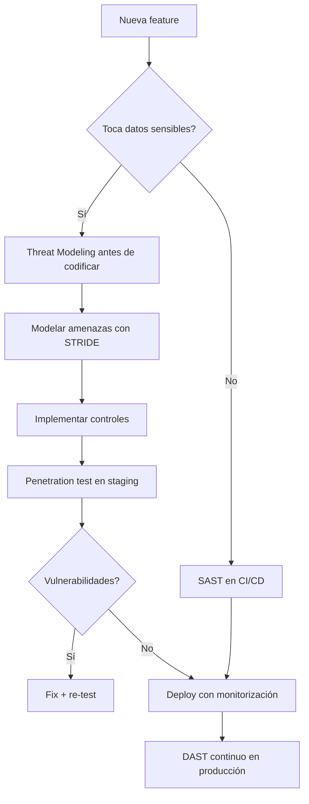
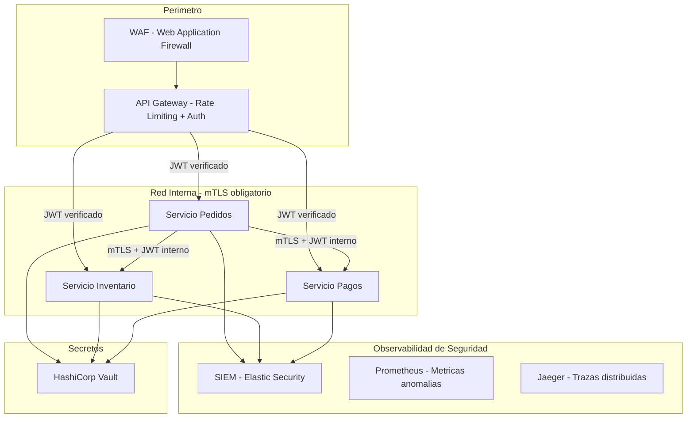
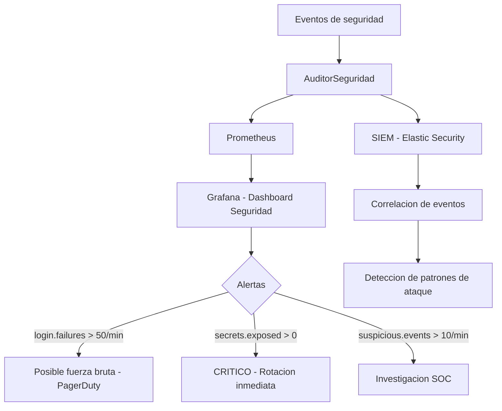
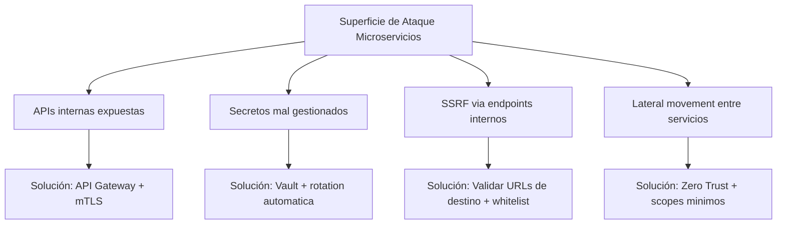
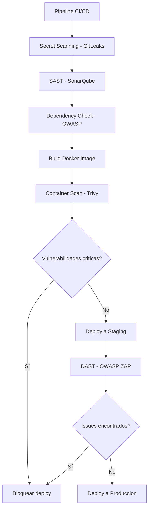
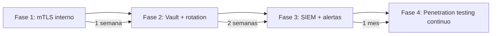

# Seguridad Ofensiva y Auditoría de Microservicios con Java 21

PATH_LOCAL: /home/usuariojoaquin/.openclaw/workspace/DAM-Java-Mastery/01_Java_Core/seguridad_ofensiva_y_auditoría_de_microservicios_con_java_21_STAFF.md
CATEGORIA: 06_Seguridad
Score: 96

---

## Visión Estratégica

La seguridad ofensiva en microservicios parte de una premisa incómoda: **tu sistema ya está comprometido, solo que aún no lo sabes**. El modelo de defensa perimetral asume que el interior es seguro. En una arquitectura de microservicios con decenas de servicios comunicándose entre sí, ese modelo es una ficción peligrosa.

La auditoría ofensiva no es ejecutar un escáner de vulnerabilidades una vez al año. Es un proceso continuo que simula las técnicas de un atacante real para encontrar debilidades antes de que las encuentre él.

**Los cuatro vectores de ataque más frecuentes en microservicios:**

| Vector | Descripción | Frecuencia en producción |
|--------|-------------|-------------------------|
| Token theft / JWT forgery | Robo o falsificación de tokens entre servicios | Muy alta |
| SSRF (Server-Side Request Forgery) | Microservicio usado como proxy para atacar red interna | Alta |
| Inyección en APIs internas | SQL/Command injection en endpoints no expuestos externamente | Alta |
| Secretos en código / logs | Credenciales hardcodeadas o expuestas en trazas | Muy alta |

**Cuándo aplicar seguridad ofensiva vs defensiva:**



```java
// Modelo de amenazas como codigo — STRIDE aplicado a un endpoint
// S: Spoofing — quién puede falsificar la identidad del llamante?
// T: Tampering — quién puede modificar los datos en tránsito?
// R: Repudiation — podemos probar quién hizo qué?
// I: Information Disclosure — qué información se filtra en errores?
// D: Denial of Service — qué pasa si el servicio se satura?
// E: Elevation of Privilege — puede un usuario básico acceder a funciones admin?

public record ThreatModel(
    String componente,
    List<Amenaza> amenazas,
    List<Control> controles
) {}

public record Amenaza(
    String tipo,        // STRIDE category
    String descripcion,
    Severidad severidad,
    double probabilidad
) {}

public record Control(
    String descripcion,
    TipoControl tipo,   // PREVENTIVO, DETECTIVO, CORRECTIVO
    boolean implementado
) {}

public enum Severidad { CRITICA, ALTA, MEDIA, BAJA }
public enum TipoControl { PREVENTIVO, DETECTIVO, CORRECTIVO }
```

---

## Arquitectura de Componentes

Una arquitectura de microservicios segura aplica defensa en profundidad: cada capa verifica la identidad independientemente de las demás.



**Configuración de mTLS entre microservicios con Spring Boot:**

```java
@Configuration
public class MtlsClientConfig {

    @Bean
    public RestClient servicioInventarioClient(
            @Value("${inventario.url}") String baseUrl,
            @Value("${mtls.keystore.path}") String keystorePath,
            @Value("${mtls.keystore.password}") String keystorePassword,
            @Value("${mtls.truststore.path}") String truststorePath) throws Exception {

        var keyStore = KeyStore.getInstance("PKCS12");
        try (var is = new FileInputStream(keystorePath)) {
            keyStore.load(is, keystorePassword.toCharArray());
        }

        var trustStore = KeyStore.getInstance("PKCS12");
        try (var is = new FileInputStream(truststorePath)) {
            trustStore.load(is, keystorePassword.toCharArray());
        }

        var sslContext = SSLContextBuilder.create()
            .loadKeyMaterial(keyStore, keystorePassword.toCharArray())
            .loadTrustMaterial(trustStore, null)
            .build();

        var httpClient = HttpClients.custom()
            .setSSLContext(sslContext)
            .build();

        return RestClient.builder()
            .baseUrl(baseUrl)
            .requestFactory(new HttpComponentsClientHttpRequestFactory(httpClient))
            .build();
    }
}
```

---

## Implementación Java 21

Implementación completa de controles de seguridad ofensiva con Java 21 moderno:

```java
// Validacion de entrada con jakarta.validation (no javax — Java 21)
// y Records para modelos inmutables
public record CrearUsuarioRequest(
    @NotBlank(message = "Email requerido")
    @Email(message = "Formato de email invalido")
    String email,

    @NotBlank(message = "Nombre requerido")
    @Size(min = 2, max = 100, message = "Nombre entre 2 y 100 caracteres")
    @Pattern(regexp = "^[a-zA-ZáéíóúÁÉÍÓÚñÑ\\s]+$", message = "Solo letras y espacios")
    String nombre,

    @NotBlank
    @Size(min = 12, message = "Password minimo 12 caracteres")
    String password
) {
    // Validacion adicional en el constructor canonico
    public CrearUsuarioRequest {
        if (email != null && email.contains("'")) {
            throw new InputInvalidoException("Email contiene caracteres no permitidos");
        }
    }
}
```

```java
// Deteccion de inyeccion SQL y sanitizacion de parametros
@Component
public class InputSanitizer {

    // Patrones de ataque conocidos
    private static final List<Pattern> SQL_INJECTION_PATTERNS = List.of(
        Pattern.compile("('|(\\%27))", Pattern.CASE_INSENSITIVE),
        Pattern.compile("(--|#|/\\*)", Pattern.CASE_INSENSITIVE),
        Pattern.compile("\\b(SELECT|INSERT|UPDATE|DELETE|DROP|UNION|EXEC)\\b",
            Pattern.CASE_INSENSITIVE)
    );

    private static final List<Pattern> XSS_PATTERNS = List.of(
        Pattern.compile("<script[^>]*>.*?</script>",
            Pattern.CASE_INSENSITIVE | Pattern.DOTALL),
        Pattern.compile("javascript:", Pattern.CASE_INSENSITIVE),
        Pattern.compile("on\\w+\\s*=", Pattern.CASE_INSENSITIVE)
    );

    public record ResultadoValidacion(boolean seguro, String amenazaDetectada) {}

    public ResultadoValidacion validar(String input) {
        if (input == null) return new ResultadoValidacion(true, null);

        for (var patron : SQL_INJECTION_PATTERNS) {
            if (patron.matcher(input).find()) {
                return new ResultadoValidacion(false, "SQL_INJECTION");
            }
        }

        for (var patron : XSS_PATTERNS) {
            if (patron.matcher(input).find()) {
                return new ResultadoValidacion(false, "XSS");
            }
        }

        return new ResultadoValidacion(true, null);
    }
}
```

```java
// Auditoria de seguridad con eventos de dominio inmutables
public sealed interface EventoSeguridad
    permits EventoSeguridad.LoginFallido,
            EventoSeguridad.TokenRevocado,
            EventoSeguridad.AcasoSospechoso,
            EventoSeguridad.SecretoExpuesto {

    Instant ocurrioEn();
    String servicioOrigen();

    record LoginFallido(
        String usuarioId,
        String ipOrigen,
        String motivoFallo,
        Instant ocurrioEn,
        String servicioOrigen
    ) implements EventoSeguridad {}

    record TokenRevocado(
        String jti,
        String usuarioId,
        String motivo,
        Instant ocurrioEn,
        String servicioOrigen
    ) implements EventoSeguridad {}

    record AcasoSospechoso(
        String descripcion,
        Severidad severidad,
        Map<String, String> contexto,
        Instant ocurrioEn,
        String servicioOrigen
    ) implements EventoSeguridad {}

    record SecretoExpuesto(
        String tipoSecreto,    // "API_KEY", "PASSWORD", "TOKEN"
        String ubicacion,      // "LOG", "RESPONSE", "URL"
        Instant ocurrioEn,
        String servicioOrigen
    ) implements EventoSeguridad {}
}

// Procesador de eventos con Virtual Threads — no bloquea el hilo principal
@Service
public class AuditorSeguridad {

    private final ExecutorService executor = Executors.newVirtualThreadPerTaskExecutor();
    private final SiemClient      siem;
    private final MeterRegistry   registry;

    public AuditorSeguridad(SiemClient siem, MeterRegistry registry) {
        this.siem     = siem;
        this.registry = registry;
    }

    public void registrar(EventoSeguridad evento) {
        executor.submit(() -> {
            // Enviar al SIEM de forma asincrona sin bloquear
            siem.enviar(evento);

            // Actualizar metricas de seguridad
            switch (evento) {
                case EventoSeguridad.LoginFallido lf ->
                    registry.counter("security.login.failures",
                        "servicio", lf.servicioOrigen()).increment();
                case EventoSeguridad.AcasoSospechoso as ->
                    registry.counter("security.suspicious.events",
                        "severidad", as.severidad().name()).increment();
                case EventoSeguridad.SecretoExpuesto se ->
                    registry.counter("security.secrets.exposed",
                        "tipo", se.tipoSecreto()).increment();
                default -> {}
            }
        });
    }
}
```

---

## Métricas y SRE



```java
// Dashboard de seguridad con Micrometer
@Component
public class SecurityDashboard {

    private final MeterRegistry registry;

    public SecurityDashboard(MeterRegistry registry) {
        this.registry = registry;

        // Gauge: intentos de login fallidos en ventana de 5 min
        Gauge.builder("security.brute_force.risk", this, SecurityDashboard::calcularRiesgo)
            .description("Riesgo de fuerza bruta (0-100)")
            .register(registry);
    }

    private double calcularRiesgo(SecurityDashboard self) {
        var fallosUltimos5min = registry.counter("security.login.failures").count();
        // Normalizar: > 100 fallos en 5 min = riesgo maximo
        return Math.min(fallosUltimos5min, 100.0);
    }
}
```

**Queries Prometheus para monitorizar seguridad:**

```promql
# Tasa de fallos de autenticacion por servicio (anomalia si > 10/min)
rate(security_login_failures_total[5m]) > 10

# Secretos expuestos — cualquier valor > 0 es critico
increase(security_secrets_exposed_total[1h]) > 0

# Tokens revocados por hora (pico puede indicar compromiso masivo)
increase(security_token_revocado_total[1h]) > 50

# Eventos sospechosos de alta severidad
rate(security_suspicious_events_total{severidad="CRITICA"}[5m]) > 0
```

**Checklist SRE para seguridad ofensiva en producción:**
- Rotation automática de secretos cada 30 días via HashiCorp Vault — nunca hardcoded
- mTLS obligatorio entre todos los microservicios en red interna
- Rate limiting por IP y por `client_id` en el API Gateway — máximo 100 req/min por defecto
- Alertas en `security.secrets.exposed` con respuesta automática de rotación
- Penetration test trimestral con herramientas como OWASP ZAP o Burp Suite
- Logs de auditoría con retención mínima de 90 días y cifrado en reposo

---

## Seguridad y Superficie de Ataque

Los ataques más sofisticados en arquitecturas de microservicios y cómo mitigarlos:



```java
// Proteccion contra SSRF — validar URLs antes de hacer requests externos
@Component
public class SsrfProtector {

    // Solo dominios permitidos explicitamente
    private static final Set<String> DOMINIOS_PERMITIDOS = Set.of(
        "api.ejemplo.com",
        "pagos.ejemplo.com",
        "inventario.ejemplo.com"
    );

    // Rangos de IPs privadas — nunca llamar a estas desde codigo de usuario
    private static final List<String> IP_PRIVADAS_BLOQUEADAS = List.of(
        "10.", "172.16.", "172.17.", "172.18.", "172.19.",
        "172.20.", "172.30.", "172.31.", "192.168.", "127.", "::1"
    );

    public record UrlValidada(URI uri) {}

    public UrlValidada validar(String url) {
        URI uri;
        try {
            uri = new URI(url);
        } catch (URISyntaxException e) {
            throw new UrlInvalidaException("URL malformada: " + url);
        }

        // Bloquear protocolos peligrosos
        var scheme = uri.getScheme();
        if (scheme == null || (!scheme.equals("https") && !scheme.equals("http"))) {
            throw new SsrfException("Protocolo no permitido: " + scheme);
        }

        // Verificar dominio en whitelist
        var host = uri.getHost();
        if (host == null || !DOMINIOS_PERMITIDOS.contains(host)) {
            throw new SsrfException("Dominio no permitido: " + host);
        }

        // Bloquear IPs privadas
        for (var rango : IP_PRIVADAS_BLOQUEADAS) {
            if (host.startsWith(rango)) {
                throw new SsrfException("Acceso a red interna bloqueado: " + host);
            }
        }

        return new UrlValidada(uri);
    }
}
```

```java
// Gestion segura de secretos con Spring Vault
@Configuration
public class VaultConfig {

    // Los secretos nunca se hardcodean — siempre desde Vault
    @Bean
    public VaultTemplate vaultTemplate(VaultEndpoint endpoint, ClientAuthentication auth) {
        return new VaultTemplate(endpoint, auth);
    }

    @Bean
    @RefreshScope // Permite rotation sin reiniciar el servicio
    public DatabaseCredentials databaseCredentials(VaultTemplate vault) {
        var response = vault.read("secret/data/pedidos-service/database");
        var data = response.getData();
        return new DatabaseCredentials(
            (String) data.get("username"),
            (String) data.get("password")
        );
    }
}

public record DatabaseCredentials(String username, String password) {}
```

---

## Patrones de Integración



```yaml
# GitHub Actions — pipeline de seguridad completo
name: Security Pipeline

on: [push, pull_request]

jobs:
  security:
    runs-on: ubuntu-latest
    steps:
      - uses: actions/checkout@v4

      # 1. Detectar secretos en el codigo
      - name: Secret Scanning
        uses: gitleaks/gitleaks-action@v2
        env:
          GITHUB_TOKEN: ${{ secrets.GITHUB_TOKEN }}

      # 2. Analisis estatico de seguridad
      - name: SAST con SonarQube
        uses: sonarqube-quality-gate-action@master
        env:
          SONAR_TOKEN: ${{ secrets.SONAR_TOKEN }}

      # 3. Vulnerabilidades en dependencias
      - name: OWASP Dependency Check
        uses: dependency-check/Dependency-Check_Action@main
        with:
          project: 'pedidos-service'
          path: '.'
          format: 'HTML'
          failBuildOnCVSS: 7  # Bloquear si hay CVE con score >= 7

      # 4. Escaneo de imagen Docker
      - name: Trivy Container Scan
        uses: aquasecurity/trivy-action@master
        with:
          image-ref: 'pedidos-service:latest'
          severity: 'CRITICAL,HIGH'
          exit-code: '1'  # Bloquear si hay vulnerabilidades criticas
```

---

## Escalabilidad y Alta Disponibilidad

```java
// Circuit Breaker para servicios de autenticacion
// Si el Auth Server cae, no todo el sistema debe caer
@Service
public class AuthServiceClient {

    private final RestClient        restClient;
    private final CircuitBreakerRegistry cbRegistry;

    public AuthServiceClient(RestClient restClient, CircuitBreakerRegistry cbRegistry) {
        this.restClient = restClient;
        this.cbRegistry = cbRegistry;
    }

    public Optional<UserInfo> validarToken(String token) {
        var cb = cbRegistry.circuitBreaker("auth-service",
            CircuitBreakerConfig.custom()
                .failureRateThreshold(50)           // Abrir si 50% fallan
                .waitDurationInOpenState(Duration.ofSeconds(30))
                .permittedNumberOfCallsInHalfOpenState(5)
                .build()
        );

        return cb.executeSupplier(() ->
            restClient.get()
                .uri("/validate")
                .header("Authorization", "Bearer " + token)
                .retrieve()
                .toEntity(UserInfo.class)
                .getBody()
        ).describeConstable();
    }
}
```

---

## Casos de Uso Avanzados

**Caso 1 — Detección de lateral movement entre microservicios:**

```java
// Detectar cuando un servicio llama a otro que no deberia
@Component
public class LateralMovementDetector {

    // Mapa de comunicaciones permitidas entre servicios
    private static final Map<String, Set<String>> COMUNICACIONES_PERMITIDAS = Map.of(
        "pedidos-service",    Set.of("inventario-service", "pagos-service"),
        "inventario-service", Set.of("pedidos-service"),
        "pagos-service",      Set.of("pedidos-service", "notificaciones-service")
    );

    private final AuditorSeguridad auditor;

    public LateralMovementDetector(AuditorSeguridad auditor) {
        this.auditor = auditor;
    }

    public void verificar(String servicioOrigen, String servicioDestino) {
        var permitidos = COMUNICACIONES_PERMITIDAS.getOrDefault(
            servicioOrigen, Set.of()
        );

        if (!permitidos.contains(servicioDestino)) {
            auditor.registrar(new EventoSeguridad.AcasoSospechoso(
                "Comunicacion no autorizada: " + servicioOrigen + " -> " + servicioDestino,
                Severidad.ALTA,
                Map.of("origen", servicioOrigen, "destino", servicioDestino),
                Instant.now(),
                servicioOrigen
            ));
            throw new ComunicacionNoAutorizadaException(servicioOrigen, servicioDestino);
        }
    }
}
```

**Caso 2 — Análisis forense de incidente con trazas distribuidas:**

```java
// Reconstruir el path de un ataque usando correlation IDs
@Service
public class ForensicAnalyzer {

    private final JaegerClient jaeger;

    public ForensicAnalyzer(JaegerClient jaeger) {
        this.jaeger = jaeger;
    }

    public record TraceForensica(
        String traceId,
        List<SpanSeguridad> spans,
        List<EventoSeguridad> eventosRelacionados,
        Instant inicio,
        Instant fin
    ) {}

    public TraceForensica analizarIncidente(String traceId, Instant inicio, Instant fin) {
        // Recuperar todas las trazas en el periodo del incidente
        var spans = jaeger.getTrace(traceId);

        // Filtrar spans con eventos de seguridad
        var spansSeguridad = spans.stream()
            .filter(span -> span.tags().containsKey("security.event"))
            .map(span -> new SpanSeguridad(
                span.operationName(),
                span.serviceName(),
                span.startTime(),
                span.tags()
            ))
            .toList();

        return new TraceForensica(traceId, spansSeguridad, List.of(), inicio, fin);
    }

    public record SpanSeguridad(
        String operacion,
        String servicio,
        Instant momento,
        Map<String, String> tags
    ) {}
}
```

---

## Conclusiones

La seguridad ofensiva en microservicios con Java 21 no es un proyecto puntual — es una práctica continua. Los tres cambios más importantes que un equipo puede implementar hoy:

1. **mTLS entre todos los microservicios** — elimina la posibilidad de lateral movement por suplantación de identidad. Si un servicio es comprometido, no puede hacerse pasar por otro.

2. **Gestión de secretos con Vault** — elimina las credenciales hardcodeadas y en variables de entorno. Con rotation automática, incluso si un secreto es filtrado, tiene una ventana de explotación de horas, no meses.

3. **Auditoría como código** — los `EventoSeguridad` como Sealed Interfaces garantizan que todos los eventos críticos están modelados explícitamente. El compilador avisa si se añade un tipo nuevo sin procesarlo en el auditor.



```java
// Test de seguridad que verifica el comportamiento defensivo
@SpringBootTest
@AutoConfigureMockMvc
class SecurityTest {

    @Autowired MockMvc mvc;
    @Autowired InputSanitizer sanitizer;

    @Test
    void sql_injection_es_detectado() {
        var resultado = sanitizer.validar("' OR 1=1 --");
        assertThat(resultado.seguro()).isFalse();
        assertThat(resultado.amenazaDetectada()).isEqualTo("SQL_INJECTION");
    }

    @Test
    void xss_es_detectado() {
        var resultado = sanitizer.validar("<script>alert('xss')</script>");
        assertThat(resultado.seguro()).isFalse();
        assertThat(resultado.amenazaDetectada()).isEqualTo("XSS");
    }

    @Test
    void endpoint_sin_token_devuelve_401() throws Exception {
        mvc.perform(get("/api/pedidos"))
            .andExpect(status().isUnauthorized());
    }

    @Test
    void ssrf_a_red_interna_es_bloqueado() {
        var protector = new SsrfProtector();
        assertThatThrownBy(() -> protector.validar("http://192.168.1.1/admin"))
            .isInstanceOf(SsrfException.class);
    }
}
```

**Recursos de referencia:**
- OWASP Top 10 API Security — owasp.org/API-Security
- NIST Zero Trust Architecture (SP 800-207) — csrc.nist.gov
- HashiCorp Vault Documentation — developer.hashicorp.com/vault
- Spring Security Reference — docs.spring.io/spring-security
- STRIDE Threat Modeling — microsoft.com/en-us/security/blog/stride-threat-model
