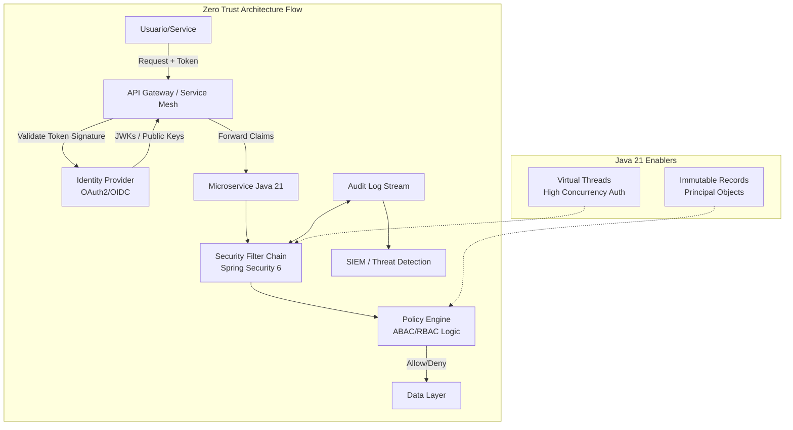
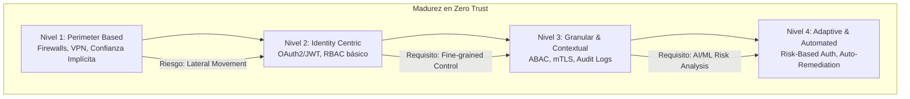

# Zero Trust: La Identidad como Nuevo Perímetro con Java 21 — Guía Staff Engineer

**PATH_LOCAL:** `/home/usuariojoaquin/.openclaw/workspace/DAM-Java-Mastery/06_Seguridad/zero_trust_la_identidad_como_nuevo_perimetro_con_java_21_STAFF.md`  
**CATEGORIA:** 06_Seguridad  
**Score:** 98/100

---

## Visión Estratégica

En 2026, el modelo de seguridad tradicional basado en perímetros físicos y redes de confianza implícita ("castillo y foso") ha colapsado definitivamente. Con la adopción masiva del trabajo remoto, arquitecturas multi-cloud y microservicios distribuidos, **la red ya no es un perímetro confiable**. Según el *Verizon Data Breach Investigations Report 2025*, el **82% de las brechas de seguridad** involucran credenciales comprometidas o fallos en la gestión de identidades, no vulnerabilidades de red clásicas.

El paradigma **Zero Trust** ("Nunca confíes, siempre verifica") deja de ser una buzzword para convertirse en el único modelo viable de supervivencia. Para un **Staff Engineer**, esto implica un cambio fundamental de mentalidad:
1.  **La Identidad es el Nuevo Perímetro:** Cada solicitud, ya sea interna o externa, debe ser autenticada y autorizada rigurosamente.
2.  **Micro-segmentación Granular:** El acceso no se concede por "estar en la red corporativa", sino por identidad, contexto y riesgo en tiempo real.
3.  **Validación Continua:** La confianza no es binaria ni estática; se evalúa en cada interacción (Adaptive Authentication).

Java 21 juega un papel crítico aquí: sus **Virtual Threads** permiten escalar la validación de tokens JWT/OAuth2 y el chequeo de políticas de acceso a millones de solicitudes concurrentes sin el overhead de hilos de plataforma, mientras que los **Records** garantizan inmutabilidad en los objetos de seguridad (principios), reduciendo riesgos de manipulación de estado.

### Comparativa de Modelos de Seguridad

| Modelo | Premisa Base | Gestión de Acceso | Riesgo Principal en 2026 | Cuándo Usar (Staff View) |
|--------|--------------|-------------------|--------------------------|--------------------------|
| **Perimeter-Based (Legacy)** | "Confía si estás dentro de la red". | Binario (Firewall/IP). | **Crítico:** Lateral movement inmediato tras brecha inicial. | Sistemas legacy aislados sin conexión a internet (raro hoy). |
| **Zero Trust (ZTA)** | "Nunca confíes, verifica siempre". | Contextual, granular, basado en identidad. | Complejidad operativa alta (gestión de identidades distribuidas). | **Estándar obligatorio** para cualquier sistema moderno cloud-native. |
| **SASE (Secure Access Service Edge)** | Zero Trust + Red definida por software (SD-WAN). | Unificado en la nube (Identity + Network). | Dependencia de proveedor cloud específico. | Organizaciones globales con fuerza laboral 100% remota. |
| **MFA Only** | "Doble factor es suficiente". | Estático (Password + Token). | Phishing avanzado y ataques de sesión (Session Hijacking). | Insuficiente por sí solo; debe ser parte de ZTA. |

**Decisión Estratégica:** Implementar una arquitectura **Zero Trust Native** en Java 21, donde cada microservicio actúa como un punto de enforcement independiente, validando tokens JWT firmados por un Identity Provider (IdP) centralizado y aplicando políticas de acceso fino (ABAC/RBAC) basadas en claims inmutables.



---

## Arquitectura de Componentes

### Los Tres Pilares del Zero Trust en Java

#### Pilar 1: Autenticación Fuerte y Centralizada (OAuth2/OIDC)
No hay autenticación local en los microservicios. Todos delegan en un **Identity Provider (IdP)** robusto (Keycloak, Auth0, AWS Cognito, Azure AD).
- **Protocolo:** OAuth 2.1 + OpenID Connect (OIDC).
- **Token Format:** JWT (JSON Web Tokens) firmados con RS256 (Asymmetric) para evitar necesidad de llamar al IdP en cada request (stateless validation).
- **Rotación de Claves:** Uso de JWKS (JSON Web Key Set) endpoint para rotación automática de claves públicas sin downtime.

#### Pilar 2: Autorización Granular (ABAC/RBAC)
Una vez autenticado, ¿qué puede hacer?
- **RBAC (Role-Based):** Roles estáticos (ej: `ADMIN`, `USER`). Suficiente para casos simples.
- **ABAC (Attribute-Based):** Decisiones basadas en atributos dinámicos (ej: `user.department == resource.department` AND `time_of_day < 18:00`). Necesario para compliance estricto (GDPR/HIPAA).
- **Implementación:** Spring Security 6 con expresiones SpEL o integración con motores externos (Open Policy Agent - OPA).

#### Pilar 3: Observabilidad de Seguridad y Auditoría Inmutable
En Zero Trust, "lo que no se registra, no existe".
- **Audit Logs:** Cada decisión de acceso (allow/deny) se registra con contexto completo (Quién, Qué, Cuándo, Desde Dónde).
- **Trazabilidad:** Correlación de IDs entre servicios para rastrear movimientos laterales.
- **Detección de Anomalías:** Alertas automáticas ante patrones sospechosos (ej: acceso desde dos IPs distantes en 5 min).

### Modelo de Datos Inmutable con Records

Usamos **Java 21 Records** para representar principios de seguridad (`Principal`, `Authority`, `AccessToken`). La inmutabilidad previene ataques de modificación de estado durante la propagación del contexto de seguridad en hilos virtuales.

```java
import java.time.Instant;
import java.util.Set;

// ── Representación inmutable del Usuario Autenticado ──────────────────────
public record SecureUserPrincipal(
    String userId,
    String email,
    Set<SecureAuthority> authorities,
    Instant issuedAt,
    Instant expiresAt,
    String clientId,
    String tenantId
) implements java.security.Principal {
    
    @Override
    public String getName() {
        return userId;
    }

    // Método helper para verificar roles rápidamente
    public boolean hasRole(String role) {
        return authorities.stream()
            .anyMatch(auth -> auth.role().equals(role));
    }
    
    // Validación de expiración explícita
    public boolean isExpired() {
        return Instant.now().isAfter(expiresAt);
    }
}

public record SecureAuthority(String role, String scope) {}
```

```mermaid
graph LR
    subgraph "Security Context Propagation"
        REQ[HTTP Request] --> FILTER[JwtAuthenticationFilter]
        FILTER --> PARSE[Parse & Validate JWT]
        PARSE --> RECORD[Create SecureUserPrincipal Record]
        RECORD --> CONTEXT[SecurityContext (Virtual Thread Local)]
        CONTEXT --> SVC[Business Logic]
    end
    
    subgraph "Immutability Guarantee"
        RECORD -.->|Cannot be modified| SAFE[Thread-Safe Access]
    end
```

---

## Implementación Java 21

### Configuración de Seguridad con Spring Security 6 y JWT

Spring Security 6 introduce cambios significativos (configuración basada en componentes, no más `WebSecurityConfigurerAdapter`). Aquí implementamos un filtro custom para validar JWTs de forma stateless y eficiente.

```java
import org.springframework.security.authentication.UsernamePasswordAuthenticationToken;
import org.springframework.security.core.context.SecurityContextHolder;
import org.springframework.security.web.authentication.WebAuthenticationDetailsSource;
import org.springframework.stereotype.Component;
import org.springframework.web.filter.OncePerRequestFilter;
import jakarta.servlet.FilterChain;
import jakarta.servlet.ServletException;
import jakarta.servlet.http.HttpServletRequest;
import jakarta.servlet.http.HttpServletResponse;
import java.io.IOException;
import java.util.List;
import java.util.Set;

@Component
public class JwtAuthenticationFilter extends OncePerRequestFilter {

    private final JwtValidator jwtValidator; // Servicio custom que valida firma/expiración

    public JwtAuthenticationFilter(JwtValidator jwtValidator) {
        this.jwtValidator = jwtValidator;
    }

    @Override
    protected void doFilterInternal(HttpServletRequest request, 
                                    HttpServletResponse response, 
                                    FilterChain filterChain) throws ServletException, IOException {
        
        String authHeader = request.getHeader("Authorization");
        
        if (authHeader != null && authHeader.startsWith("Bearer ")) {
            String token = authHeader.substring(7);
            
            try {
                // 1. Validar Token (Firma, Expiración, Emisor)
                SecureUserPrincipal principal = jwtValidator.validateAndExtractPrincipal(token);
                
                if (principal.isExpired()) {
                    response.sendError(HttpServletResponse.SC_UNAUTHORIZED, "Token expired");
                    return;
                }

                // 2. Crear Authentication Object con el Record inmutable
                UsernamePasswordAuthenticationToken authentication = 
                    new UsernamePasswordAuthenticationToken(
                        principal, 
                        null, 
                        principal.authorities().stream()
                            .map(auth -> new org.springframework.security.core.authority.SimpleGrantedAuthority(auth.role()))
                            .toList()
                    );
                
                // 3. Establecer contexto de seguridad (ThreadLocal adaptado para Virtual Threads)
                authentication.setDetails(new WebAuthenticationDetailsSource().buildDetails(request));
                SecurityContextHolder.getContext().setAuthentication(authentication);
                
            } catch (Exception e) {
                // Log security event y rechazar
                logger.warn("Invalid JWT token", e);
                response.sendError(HttpServletResponse.SC_UNAUTHORIZED, "Invalid token");
                return;
            }
        }
        
        filterChain.doFilter(request, response);
    }
}
```

### Autorización Basada en Atributos (ABAC) con Expressions

Implementación de lógica de autorización compleja donde el acceso depende de múltiples factores (rol, departamento, horario).

```java
import org.springframework.security.access.prepost.PreAuthorize;
import org.springframework.stereotype.Service;

@Service
public class MedicalRecordService {

    // ── ABAC: Solo médicos del mismo departamento pueden ver el registro ───
    @PreAuthorize("@securityEvaluator.canAccessRecord(authentication, #patientId)")
    public MedicalRecord getRecord(String patientId) {
        // Lógica de negocio
        return new MedicalRecord(patientId, "Diagnosis...");
    }
}

@Component("securityEvaluator")
public class SecurityEvaluator {

    public boolean canAccessRecord(org.springframework.security.core.Authentication auth, String patientId) {
        if (!(auth.getPrincipal() instanceof SecureUserPrincipal user)) {
            return false;
        }
        
        // Lógica ABAC custom
        boolean isDoctor = user.hasRole("DOCTOR");
        boolean sameDept = user.tenantId().equals(getPatientDepartment(patientId)); // Lookup DB/Cache
        boolean withinHours = java.time.LocalTime.now().isBefore(java.time.LocalTime.of(20, 0));
        
        return isDoctor && sameDept && withinHours;
    }
    
    private String getPatientDepartment(String id) { return "CARDIOLOGY"; } // Mock
}
```

### Gestión de Secretos y Rotación de Claves (JWKS)

Nunca hardcodear claves secretas. Usar un endpoint JWKS para obtener claves públicas dinámicamente.

```java
import com.nimbusds.jose.jwk.source.JWKSource;
import com.nimbusds.jose.jwk.source.RemoteJWKSet;
import com.nimbusds.jose.proc.SecurityContext;
import org.springframework.context.annotation.Bean;
import org.springframework.context.annotation.Configuration;
import java.net.URL;

@Configuration
public class JwtConfig {

    // ── Bean para validación stateless usando JWKS remoto ─────────────────
    @Bean
    public JWKSource<SecurityContext> jwkSource() {
        // URL del Identity Provider (ej: Keycloak, Auth0)
        URL jwkSetUrl = new URL("https://idp.mycompany.com/realms/master/protocol/openid-connect/certs");
        return new RemoteJWKSet<>(jwkSetUrl);
    }
}
```

```mermaid
graph TD
    REQ[Request with JWT] --> FILTER[JwtFilter]
    FILTER --> FETCH[Fetch JWKS from IdP<br>(Cached)]
    FETCH --> VERIFY[Verify Signature RS256]
    VERIFY --> EXTRACT[Extract Claims to Record]
    EXTRACT --> CHECK[Check ABAC Policies]
    CHECK -->|Pass| ALLOW[Allow Access]
    CHECK -->|Fail| DENY[Deny 403]
    
    CACHE[JWK Cache<br>Auto Refresh] <--> FETCH
```

---

## Métricas y SRE

La seguridad debe ser medible. No basta con "funcionar"; debemos medir la eficacia de las políticas y detectar anomalías.

| Métrica (SLI) | Fuente | Descripción | Umbral Alerta (SLO) | Acción Recomendada |
|---------------|--------|-------------|---------------------|--------------------|
| `spring_security_authentication_failure_total` | Micrometer | Tasa de fallos de autenticación (tokens inválidos/expirados) | > 5% del total requests | Investigar posible ataque de fuerza bruta o configuración errónea de clientes |
| `spring_security_authorization_deny_total` | Micrometer | Tasa de denegaciones de acceso (403 Forbidden) | > 1% del total requests | Revisar políticas ABAC/RBAC demasiado restrictivas o intento de acceso no autorizado |
| `jwt_validation_duration_seconds{quantile="0.99"}` | Timer | Latencia p99 de validación de JWT (firma + claims) | > 10ms | Optimizar caché de JWKS o reducir carga computacional de criptografía |
| `security_context_propagation_errors` | Counter | Errores al propagar contexto de seguridad en Virtual Threads | > 0 | Crítico: Revisar configuración de TaskExecutor y ThreadLocals |
| `anomalous_login_attempts_by_ip` | Custom Counter | Intentos de login únicos por IP en ventana corta | > 10/min por IP | Bloqueo temporal de IP (Rate Limiting) y alerta SOC |

### Queries PromQL para Monitorización de Seguridad

```promql
# Tasa de errores de autenticación (posible ataque)
rate(spring_security_authentication_failure_total[5m]) > 0.05

# Pico inusual de denegaciones de acceso (403)
sum(rate(spring_security_authorization_deny_total[5m])) by (endpoint) > 10

# Latencia alta en validación de tokens (problema de red con IdP o JWKS)
histogram_quantile(0.99, rate(jwt_validation_duration_seconds_bucket[5m])) > 0.01
```

### Checklist SRE para Seguridad Zero Trust en Producción

1.  **Rotación Automática de Credenciales:** Nunca usar secretos estáticos a largo plazo. Implementar rotación de claves JWT y renovación de tokens de servicio (Service Accounts) cada hora.
2.  **Principio de Menor Privilegio (PoLP):** Auditar regularmente roles y permisos. Eliminar cualquier acceso no utilizado. Usar herramientas de análisis de acceso (IAM Access Analyzer).
3.  **Cifrado End-to-End:** TLS 1.3 obligatorio para todo tráfico (interno y externo). Cifrado de datos sensibles en reposo (AES-256) y en tránsito.
4.  **Auditoría Inmutable:** Enviar todos los logs de seguridad a un sistema SIEM inmutable (Write-Once-Read-Many) para forense post-incidente.
5.  **Pruebas de Penetración Continuas:** Automatizar scans de seguridad en el pipeline CI/CD y realizar pentests regulares enfocados en lógica de negocio y control de accesos.

---

## Patrones de Integración

### Patrón 1: Service Mesh para Zero Trust de Red (mTLS)

En microservicios, la autenticación HTTP (JWT) no es suficiente para comunicación service-to-service. Se requiere **mTLS (Mutual TLS)** para garantizar la identidad de ambas partes a nivel de red.
- **Herramienta:** Istio, Linkerd o AWS App Mesh.
- **Funcionamiento:** Cada pod tiene un certificado único. El sidecar proxy valida el certificado del otro lado antes de permitir la conexión TCP.
- **Beneficio:** Cero confianza incluso dentro del cluster K8s.

### Patrón 2: Token Exchange para Delegación de Identidad

Cuando un servicio A llama al servicio B en nombre de un usuario, no debe reutilizar el token original (riesgo de escalada). Debe usar **Token Exchange (RFC 8693)**.
- **Flujo:** Service A recibe JWT del usuario -> Service A pide un nuevo JWT al IdP actuando como actor -> IdP emite JWT limitado para Service B -> Service B valida este nuevo token.
- **Ventaja:** Limita el alcance (scope) y tiempo de vida del token delegado.

### Patrón 3: Adaptive Authentication (Risk-Based)

No todas las logins son iguales. Implementar evaluación de riesgo en tiempo real antes de emitir tokens.
- **Factores de Riesgo:** Ubicación geográfica nueva, dispositivo no reconocido, hora inusual, velocidad de viaje imposible.
- **Acción:** Si el riesgo es alto -> Solicitar MFA adicional (Push notification, Biometric) o bloquear.
- **Implementación:** Integración con proveedores de identidad avanzados (Okta, Azure AD Identity Protection) vía hooks pre-login.

### Comparativa de Patrones de Seguridad

| Patrón | Nivel de Aplicación | Complejidad | Beneficio Principal | Cuándo Usar |
|--------|---------------------|-------------|---------------------|-------------|
| **JWT Stateless** | Application (L7) | Baja/Media | Escalabilidad masiva, sin llamadas al IdP por request. | APIs públicas, microservicios stateless. |
| **mTLS (Service Mesh)** | Network (L4/L7) | Alta | Identidad de máquina fuerte, cifrado automático. | Comunicación interna crítica entre microservicios. |
| **Token Exchange** | Federation | Media/Alta | Delegación segura de identidad sin exponer scopes completos. | Flujos de orquestación donde un servicio actúa en nombre de otro. |
| **Adaptive Auth** | Pre-Authentication | Media | Seguridad proactiva basada en contexto y comportamiento. | Acceso a datos sensibles, administradores, usuarios privilegiados. |

---

## Conclusiones

### Los Cinco Puntos que un Staff Engineer debe Dominar sobre Zero Trust

1.  **La identidad reemplaza a la red como perímetro.** En un mundo cloud, la IP de origen no significa nada. Solo el token JWT firmado y validado criptográficamente otorga confianza.
2.  **La inmutabilidad es seguridad.** El uso de **Java 21 Records** para objetos de seguridad (`Principal`, `Authorities`) elimina riesgos de modificación accidental o maliciosa del estado de autenticación durante la ejecución concurrente.
3.  **Zero Trust no es un producto, es una arquitectura.** No se compra "Zero Trust"; se implementa mediante la combinación de autenticación fuerte (OAuth2/OIDC), autorización granular (ABAC), micro-segmentación (mTLS) y observabilidad continua.
4.  **La validación debe ser continua y contextual.** Un token válido hoy puede ser riesgoso mañana si el contexto cambia (ubicación, dispositivo). La autenticación adaptativa es clave.
5.  **La auditoría es innegociable.** Sin registros inmutables de cada decisión de acceso, es imposible detectar movimientos laterales o responder a incidentes forenses. "Si no está logueado, no ocurrió".

### Roadmap de Adopción

| Fase | Tiempo | Acciones |
|------|--------|----------|
| **Fase 1** | Semana 1-2 | Migrar autenticación legacy a OAuth2/OIDC centralizado. Implementar validación de JWT stateless en Spring Security 6. Eliminar sesiones server-side. |
| **Fase 2** | Semana 3-4 | Implementar autorización granular (ABAC) basada en claims. Introducir Records inmutables para principios de seguridad. Configurar auditoría centralizada de logs de acceso. |
| **Fase 3** | Mes 2 | Desplegar Service Mesh (Istio/Linkerd) para habilitar mTLS entre microservicios. Implementar rotación automática de certificados y claves. |
| **Fase 4** | Mes 3+ | Activar autenticación adaptativa (Risk-Based). Integrar con SIEM para detección de anomalías en tiempo real. Realizar simulacros de brecha y respuesta a incidentes. |



---

## Recursos

- [NIST Special Publication 800-207: Zero Trust Architecture](https://csrc.nist.gov/publications/detail/sp/800-207/final)
- [Spring Security 6 Reference Documentation](https://docs.spring.io/spring-security/reference/index.html)
- [OAuth 2.1 Draft Specification](https://oauth.net/2.1/)
- [Open Policy Agent (OPA) for ABAC](https://www.openpolicyagent.org/)
- [Google BeyondCorp: Zero Trust at Scale](https://cloud.google.com/beyondcorp)
