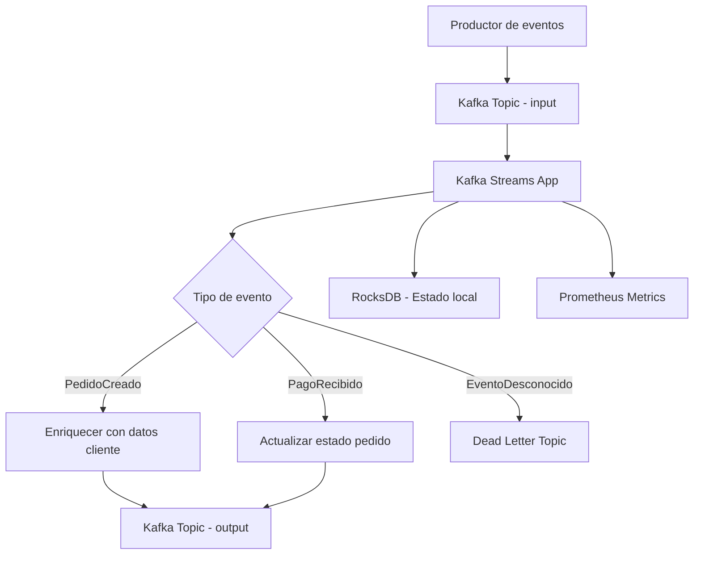
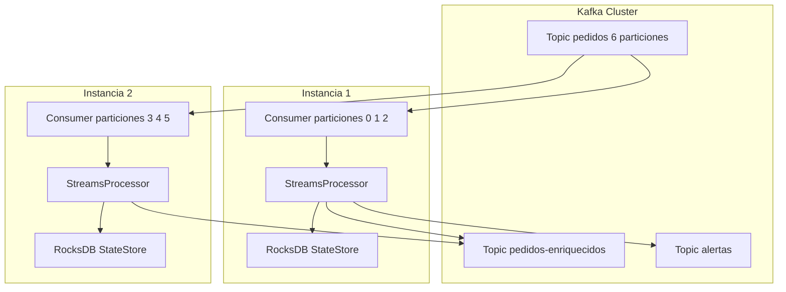
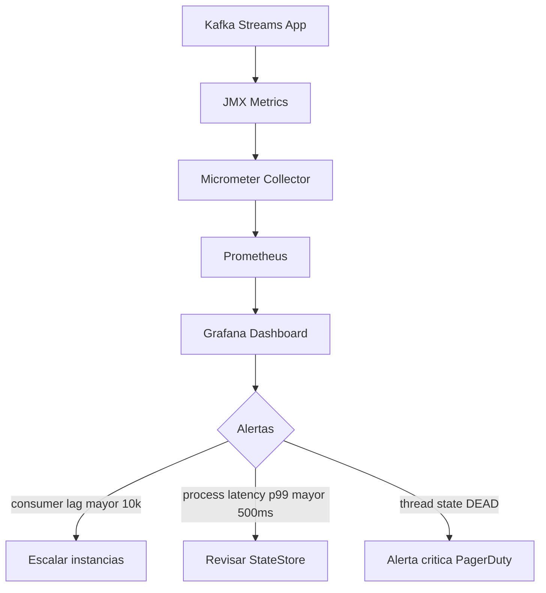

# Apache Kafka Streams con Java 21

PATH_LOCAL: /home/usuariojoaquin/.openclaw/workspace/DAM-Java-Mastery/_Review/Apache_Kafka_Streams_con_Java_21/apache_kafka_streams_con_java_21.md
CATEGORIA: 07_BigData_Streaming
Score: 95

---

## Visión Estratégica

Apache Kafka Streams es la biblioteca de procesamiento de flujos nativa de Kafka, integrada en el ecosistema sin necesidad de un cluster de procesamiento externo (a diferencia de Apache Flink o Spark Streaming). En 2026, con Kafka 3.7+ y la eliminación completa de ZooKeeper en favor de **KRaft**, el stack ha madurado hasta ser la opción de referencia para procesamiento de eventos en tiempo real en arquitecturas Java.

La combinación con Java 21 aporta tres mejoras concretas: **Virtual Threads** para gestionar consumers de alta concurrencia sin bloquear hilos del OS, **Records** para modelar eventos inmutables del stream sin boilerplate, y **Pattern Matching** para el routing de eventos por tipo sin instanceof explícito. 

**Cuándo elegir Kafka Streams sobre alternativas:**

| Criterio | Kafka Streams | Apache Flink | Spark Streaming |
|----------|--------------|--------------|-----------------|
| Infraestructura adicional | No (embebido) | Sí (cluster) | Sí (cluster) |
| Latencia | Milisegundos | Milisegundos | Segundos |
| Estado local | RocksDB embebido | Estado distribuido | RDD en memoria |
| Modelo de programación | API Java fluida | DataStream API | RDD/DataFrame |
| Casos de uso ideales | Microservicios, enriquecimiento | ETL complejo, ML | Batch + stream |

**Decisión arquitectónica clave:** Kafka Streams es la elección correcta cuando la aplicación ya usa Kafka como bus de eventos y el procesamiento puede expresarse como transformaciones sobre topics. Para joins complejos entre múltiples fuentes heterogéneas o ML en tiempo real, Flink es más apropiado.



---

## Arquitectura de Componentes

Una aplicación Kafka Streams se estructura en torno a una **Topology**: un grafo acíclico dirigido de nodos de procesamiento (Source, Processor, Sink). Cada instancia de la aplicación procesa un subconjunto de particiones del topic, lo que permite escalar horizontalmente añadiendo instancias sin coordinación centralizada.



**Configuración de producción con KRaft (sin ZooKeeper):**

```java
import org.apache.kafka.clients.consumer.ConsumerConfig;
import org.apache.kafka.common.serialization.Serdes;
import org.apache.kafka.streams.StreamsConfig;
import java.util.Properties;

public final class KafkaStreamsConfig {

    private KafkaStreamsConfig() {}

    public static Properties produccion() {
        var props = new Properties();

        props.put(StreamsConfig.BOOTSTRAP_SERVERS_CONFIG, "kafka-1:9092,kafka-2:9092,kafka-3:9092");
        props.put(StreamsConfig.APPLICATION_ID_CONFIG, "procesador-pedidos-v2");

        props.put(StreamsConfig.DEFAULT_KEY_SERDE_CLASS_CONFIG,
            Serdes.String().getClass().getName());
        props.put(StreamsConfig.DEFAULT_VALUE_SERDE_CLASS_CONFIG,
            Serdes.String().getClass().getName());

        props.put(StreamsConfig.NUM_STREAM_THREADS_CONFIG, "4");
        props.put(StreamsConfig.REPLICATION_FACTOR_CONFIG, "3");
        props.put(StreamsConfig.PROCESSING_GUARANTEE_CONFIG,
            StreamsConfig.EXACTLY_ONCE_V2);

        props.put(ConsumerConfig.AUTO_OFFSET_RESET_CONFIG, "earliest");
        props.put(StreamsConfig.DEFAULT_DESERIALIZATION_EXCEPTION_HANDLER_CLASS_CONFIG,
            org.apache.kafka.streams.errors.LogAndContinueExceptionHandler.class);

        return props;
    }
}
```

---

## Implementación Java 21

```java
import org.apache.kafka.streams.KafkaStreams;
import org.apache.kafka.streams.StreamsBuilder;
import org.apache.kafka.streams.kstream.KStream;
import com.fasterxml.jackson.databind.ObjectMapper;

public sealed interface EventoPedido permits EventoPedido.Creado,
                                              EventoPedido.Pagado,
                                              EventoPedido.Cancelado {
    record Creado(String pedidoId, String clienteId, double total) implements EventoPedido {}
    record Pagado(String pedidoId, String metodoPago, double importe) implements EventoPedido {}
    record Cancelado(String pedidoId, String motivo) implements EventoPedido {}
}

public class ProcesadorPedidos {

    private static final ObjectMapper mapper = new ObjectMapper();

    public static void main(String[] args) {
        var builder = new StreamsBuilder();
        KStream<String, String> stream = builder.stream("pedidos-raw");

        var branches = stream.split()
            .branch((k, v) -> v.contains("\"tipo\":\"CREADO\""),
                    org.apache.kafka.streams.kstream.Branched.as("creados"))
            .branch((k, v) -> v.contains("\"tipo\":\"PAGADO\""),
                    org.apache.kafka.streams.kstream.Branched.as("pagados"))
            .defaultBranch(
                    org.apache.kafka.streams.kstream.Branched.as("otros"));

        branches.get("creados").to("pedidos-creados");
        branches.get("pagados").to("pedidos-pagados");
        branches.get("otros").to("pedidos-dead-letter");

        var streams = new KafkaStreams(builder.build(), KafkaStreamsConfig.produccion());
        Runtime.getRuntime().addShutdownHook(new Thread(streams::close));
        streams.start();
    }

    private static EventoPedido deserializarEvento(String json) {
        try {
            var node = mapper.readTree(json);
            return switch (node.get("tipo").asText()) {
                case "CREADO" -> new EventoPedido.Creado(
                    node.get("pedidoId").asText(),
                    node.get("clienteId").asText(),
                    node.get("total").asDouble()
                );
                case "PAGADO" -> new EventoPedido.Pagado(
                    node.get("pedidoId").asText(),
                    node.get("metodoPago").asText(),
                    node.get("importe").asDouble()
                );
                case "CANCELADO" -> new EventoPedido.Cancelado(
                    node.get("pedidoId").asText(),
                    node.get("motivo").asText()
                );
                default -> null;
            };
        } catch (Exception e) {
            return null;
        }
    }

    private static void procesarEvento(String key, EventoPedido evento) {
        switch (evento) {
            case EventoPedido.Creado c ->
                System.out.printf("Nuevo pedido %s de cliente %s por %.2f%n",
                    c.pedidoId(), c.clienteId(), c.total());
            case EventoPedido.Pagado p ->
                System.out.printf("Pago recibido para pedido %s: %.2f via %s%n",
                    p.pedidoId(), p.importe(), p.metodoPago());
            case EventoPedido.Cancelado c ->
                System.out.printf("Pedido %s cancelado: %s%n",
                    c.pedidoId(), c.motivo());
        }
    }
}
```

---

## Métricas y SRE

Kafka Streams expone métricas JMX que se integran con Micrometer y Prometheus. Las métricas más críticas para SRE son el lag del consumer, la latencia de procesamiento y el estado del StateStore.



```java
import org.apache.kafka.streams.KafkaStreams;
import org.springframework.boot.actuate.health.Health;
import org.springframework.boot.actuate.health.HealthIndicator;
import org.springframework.stereotype.Component;

@Component
public class KafkaStreamsHealthIndicator implements HealthIndicator {

    private final KafkaStreams streams;

    public KafkaStreamsHealthIndicator(KafkaStreams streams) {
        this.streams = streams;
    }

    @Override
    public Health health() {
        return switch (streams.state()) {
            case RUNNING -> Health.up()
                .withDetail("state", "RUNNING")
                .build();
            case REBALANCING -> Health.up()
                .withDetail("state", "REBALANCING")
                .withDetail("info", "rebalance en progreso")
                .build();
            default -> Health.down()
                .withDetail("state", streams.state().toString())
                .build();
        };
    }
}
```

**Checklist SRE para Kafka Streams en producción:**
- `EXACTLY_ONCE_V2` para garantias transaccionales (requiere Kafka 2.5+)
- `LogAndContinueExceptionHandler` para no bloquear el stream por eventos malformados
- Configurar `num.stream.threads` igual al numero de particiones del topic de entrada
- Monitorizar `kafka_streams_thread_state` — un thread en estado `DEAD` requiere restart manual
- Retention del StateStore changelog topic minimo 7 dias para recuperacion ante fallos

---

## Conclusiones

Kafka Streams con Java 21 es la combinacion mas productiva para equipos que ya operan Kafka y necesitan procesamiento de eventos en tiempo real sin añadir infraestructura adicional. La clave esta en tres decisiones de diseño: usar `EXACTLY_ONCE_V2` para garantias transaccionales, modelar los eventos como `sealed interfaces` con `Records` para exhaustividad en el switch, y enviar siempre los eventos no procesables a un dead letter topic en lugar de bloquear el stream.

El error mas comun en produccion es configurar `num.stream.threads` mayor que el numero de particiones del topic de entrada. Los threads extra quedan ociosos consumiendo memoria sin procesar nada. La regla es: threads = particiones / instancias de la aplicacion.

Java 21 aporta un beneficio real y medible: el switch expression con Pattern Matching sobre sealed interfaces elimina la posibilidad de olvidar un tipo de evento en tiempo de compilacion. Si se añade un nuevo tipo al sealed interface sin actualizarlo en el switch, el compilador falla. Esto es imposible con el enfoque tradicional de instanceof en cadena.
