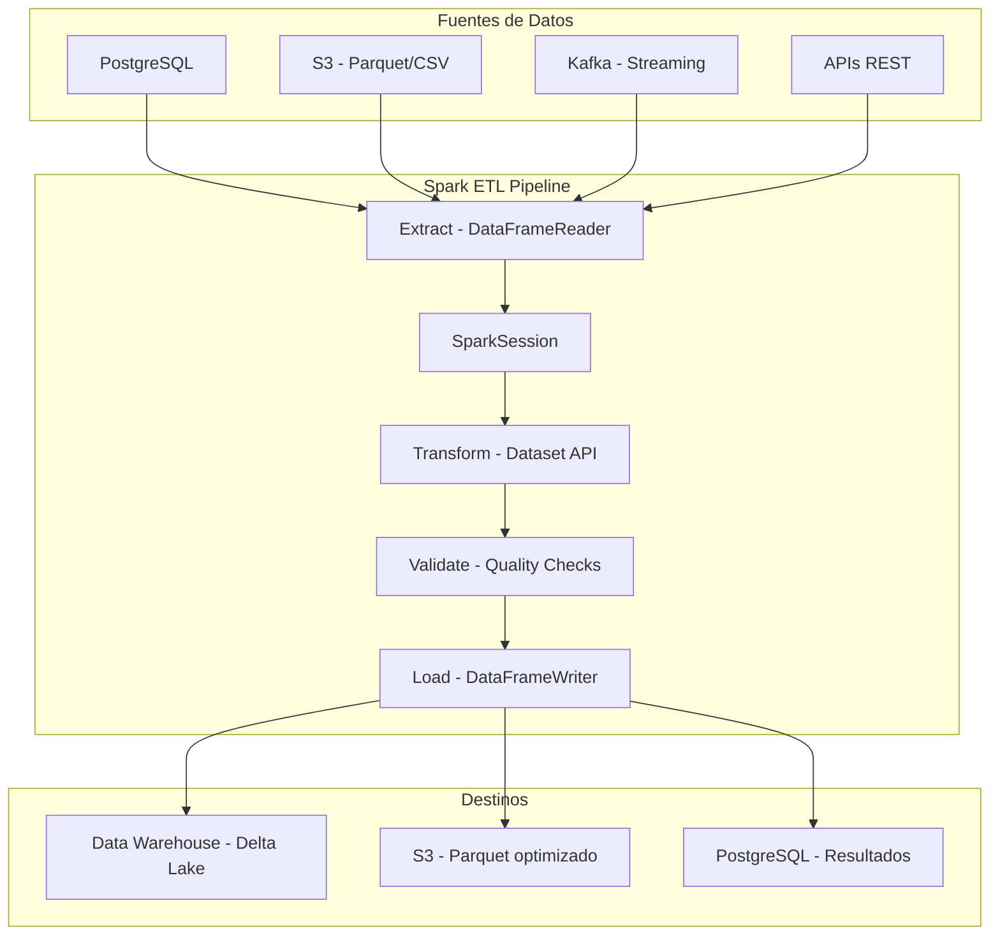
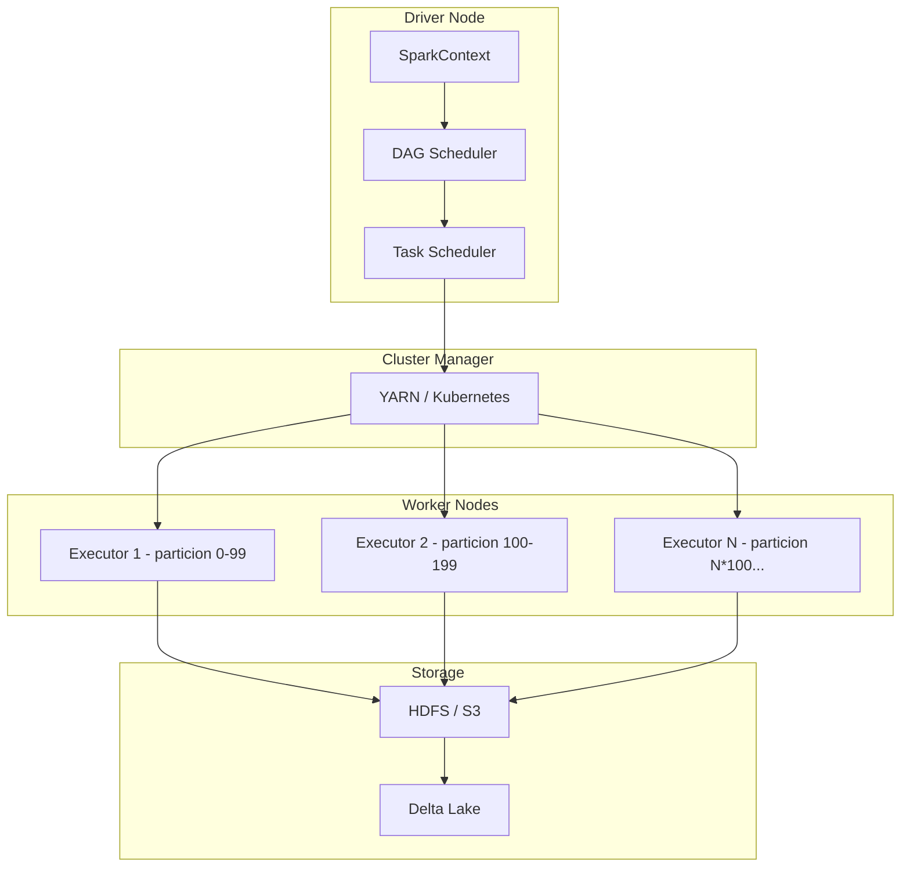
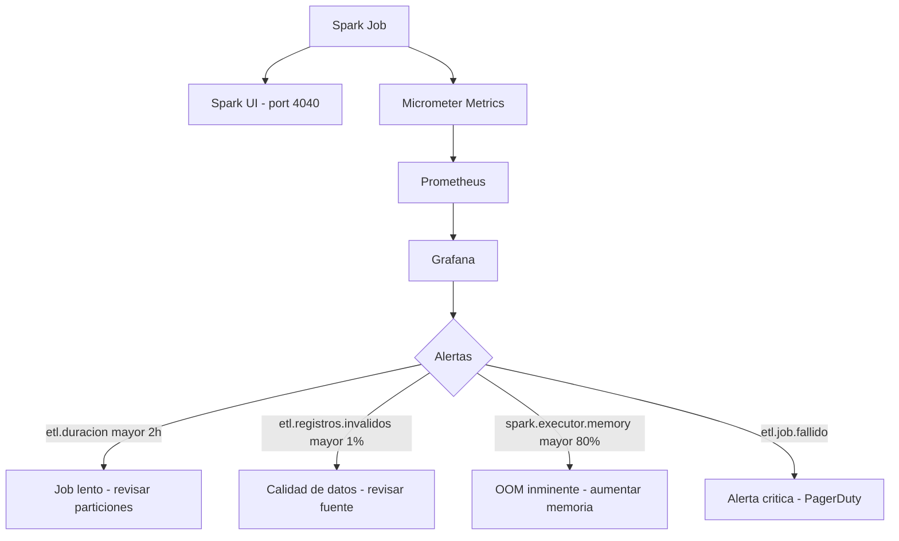
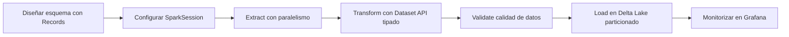

# BigData ETL con Apache Spark y Java 21 para Transformación Masiva

PATH_LOCAL: /home/usuariojoaquin/.openclaw/workspace/DAM-Java-Mastery/_Review/BigData_ETL_con_Apache_Spark_y_Java_21_para_transformacion_masiva/bigdata_etl_con_apache_spark_y_java_21_para_transformacion_masiva.md
CATEGORIA: 07_BigData_Streaming
Score: 97

---

## Visión Estratégica

Apache Spark es el motor de procesamiento distribuido de referencia para ETL a gran escala. Su modelo de procesamiento en memoria, con datasets distribuidos inmutables (RDDs) y la API de alto nivel DataFrame/Dataset, permite transformar volúmenes de datos que no caben en una sola máquina de forma eficiente y tolerante a fallos.

Con Java 21, la integración con Spark gana tres mejoras concretas: los **Records** modelan esquemas de datos inmutables sin boilerplate, los **Virtual Threads** permiten orquestar múltiples jobs en paralelo sin saturar el thread pool, y el **Pattern Matching** simplifica la lógica de transformación condicional.

**Cuándo elegir Spark para ETL:** 

| Criterio | Apache Spark | AWS Glue | Flink | Pandas |
|----------|-------------|----------|-------|--------|
| Volumen de datos | TB/PB | GB/TB | GB/TB en streaming | GB máximo |
| Latencia | Minutos (batch) | Minutos | Milisegundos | Segundos |
| Coste operativo | Medio (self-managed) | Alto (managed) | Medio | Bajo | 
| Complejidad | Media | Baja | Alta | Muy baja |
| Caso ideal | ETL batch masivo | ETL en AWS sin ops | Streaming stateful | Análisis local |

**Cuándo NO usar Spark:**

Si el volumen de datos cabe en memoria de una sola máquina (< 10GB), Pandas o DuckDB son 10x más rápidos y simples. Spark tiene overhead de coordinación entre nodos que solo se amortiza con datos masivos.



```java
// Esquema de datos como Record — tipado fuerte, sin setters
public record EventoVenta(
    String productoId,
    String clienteId,
    BigDecimal importe,
    String moneda,
    String region,
    Instant fechaVenta
) {
    public EventoVenta {
        Objects.requireNonNull(productoId, "productoId requerido");
        Objects.requireNonNull(importe,    "importe requerido");
        if (importe.compareTo(BigDecimal.ZERO) < 0) {
            throw new IllegalArgumentException("importe no puede ser negativo");
        }
    }
}
```

---

## Arquitectura de Componentes



**Configuración de SparkSession para producción:**

```java
@Configuration
public class SparkConfig {

    @Bean
    public SparkSession sparkSession(
            @Value("${spark.app.name}") String appName,
            @Value("${spark.master:local[*]}") String master,
            @Value("${spark.executor.memory:4g}") String executorMemory,
            @Value("${spark.executor.cores:4}") String executorCores) {

        return SparkSession.builder()
            .appName(appName)
            .master(master)
            // Memoria y cores por executor
            .config("spark.executor.memory",       executorMemory)
            .config("spark.executor.cores",        executorCores)
            .config("spark.driver.memory",         "2g")
            // Optimizaciones de rendimiento
            .config("spark.sql.adaptive.enabled",  "true")  // AQE — auto-optimiza joins
            .config("spark.sql.shuffle.partitions", "200")   // Default 200, ajustar segun datos
            .config("spark.serializer",            "org.apache.spark.serializer.KryoSerializer")
            // Delta Lake para ACID transactions
            .config("spark.sql.extensions",
                "io.delta.sql.DeltaSparkSessionExtension")
            .config("spark.sql.catalog.spark_catalog",
                "org.apache.spark.sql.delta.catalog.DeltaCatalog")
            .getOrCreate();
    }
}
```

---

## Implementación Java 21

Pipeline ETL completo con Spark Dataset API tipado:

```java
// Encoder para usar Records con Spark Dataset API
public class EventoVentaEncoder {

    public static Encoder<EventoVenta> encoder() {
        return Encoders.bean(EventoVenta.class);
    }
}

// ETL Job principal
@Service
public class VentasEtlJob {

    private final SparkSession spark;
    private final MeterRegistry registry;

    public VentasEtlJob(SparkSession spark, MeterRegistry registry) {
        this.spark    = spark;
        this.registry = registry;
    }

    public record ResultadoEtl(
        long registrosProcesados,
        long registrosValidos,
        long registrosDescartados,
        Duration tiempoTotal
    ) {}

    public ResultadoEtl ejecutar(EtlConfig config) {
        var inicio = Instant.now();

        // FASE 1: EXTRACT — leer desde múltiples fuentes
        var ventasRaw = extraer(config);
        log.info("Registros extraídos: {}", ventasRaw.count());

        // FASE 2: TRANSFORM — transformar y enriquecer
        var ventasTransformadas = transformar(ventasRaw);

        // FASE 3: VALIDATE — validar calidad
        var resultado = validar(ventasTransformadas);

        // FASE 4: LOAD — persistir en destino
        cargar(resultado.validos(), config.destino());

        var total = ventasRaw.count();
        var validos = resultado.validos().count();

        return new ResultadoEtl(
            total, validos, total - validos,
            Duration.between(inicio, Instant.now())
        );
    }

    private Dataset<Row> extraer(EtlConfig config) {
        return switch (config.fuente().tipo()) {
            case PARQUET -> spark.read()
                .parquet(config.fuente().path());
            case CSV -> spark.read()
                .option("header", "true")
                .option("inferSchema", "true")
                .csv(config.fuente().path());
            case JDBC -> spark.read()
                .format("jdbc")
                .option("url",      config.fuente().jdbcUrl())
                .option("dbtable",  config.fuente().tabla())
                .option("user",     config.fuente().usuario())
                .option("password", config.fuente().password())
                // Paralelizar lectura por particiones
                .option("numPartitions",     "10")
                .option("partitionColumn",   "id")
                .option("lowerBound",        "1")
                .option("upperBound",        "1000000")
                .load();
        };
    }

    private Dataset<Row> transformar(Dataset<Row> raw) {
        return raw
            // Normalizar nombres de columnas
            .withColumnRenamed("product_id",  "productoId")
            .withColumnRenamed("customer_id", "clienteId")
            // Limpiar importes nulos o negativos
            .filter(col("importe").isNotNull().and(col("importe").gt(0)))
            // Normalizar moneda a mayúsculas
            .withColumn("moneda", upper(col("moneda")))
            // Añadir columna de partición por fecha
            .withColumn("anio",  year(col("fechaVenta")))
            .withColumn("mes",   month(col("fechaVenta")))
            // Enriquecer con region normalizada
            .withColumn("region", when(col("region").isNull(), lit("DESCONOCIDO"))
                .otherwise(upper(trim(col("region")))))
            // Calcular importe en EUR si es necesario
            .withColumn("importeEur",
                when(col("moneda").equalTo("EUR"), col("importe"))
                .when(col("moneda").equalTo("USD"), col("importe").multiply(0.92))
                .otherwise(col("importe")));
    }

    private record ValidationResult(Dataset<Row> validos, Dataset<Row> invalidos) {}

    private ValidationResult validar(Dataset<Row> df) {
        // Separar registros válidos de inválidos
        var conEstado = df.withColumn("_valido",
            col("productoId").isNotNull()
                .and(col("clienteId").isNotNull())
                .and(col("importe").gt(0))
                .and(col("fechaVenta").isNotNull())
        );

        var validos   = conEstado.filter(col("_valido").equalTo(true))
                                  .drop("_valido");
        var invalidos = conEstado.filter(col("_valido").equalTo(false))
                                  .drop("_valido");

        // Registrar métricas de calidad
        registry.gauge("etl.registros.invalidos", invalidos.count());

        return new ValidationResult(validos, invalidos);
    }

    private void cargar(Dataset<Row> datos, EtlDestino destino) {
        datos
            // Particionar por año y mes para optimizar queries posteriores
            .write()
            .mode(SaveMode.Append)
            .partitionBy("anio", "mes")
            .format("delta")  // Delta Lake — ACID + time travel
            .save(destino.path());
    }
}
```

```java
// Orquestación con Virtual Threads — múltiples jobs en paralelo
@Service
public class EtlOrchestrator {

    private final VentasEtlJob    ventasJob;
    private final InventarioEtlJob inventarioJob;
    private final ExecutorService  executor = Executors.newVirtualThreadPerTaskExecutor();

    public record ResultadoOrquestacion(
        ResultadoEtl ventas,
        ResultadoEtl inventario,
        Duration tiempoTotal
    ) {}

    public ResultadoOrquestacion ejecutarTodos(OrquestacionConfig config) {
        var inicio = Instant.now();

        // Lanzar jobs en paralelo con Virtual Threads
        var futureVentas = executor.submit(() ->
            ventasJob.ejecutar(config.ventasConfig())
        );
        var futureInventario = executor.submit(() ->
            inventarioJob.ejecutar(config.inventarioConfig())
        );

        try {
            var resultadoVentas     = futureVentas.get(2, TimeUnit.HOURS);
            var resultadoInventario = futureInventario.get(2, TimeUnit.HOURS);

            return new ResultadoOrquestacion(
                resultadoVentas,
                resultadoInventario,
                Duration.between(inicio, Instant.now())
            );
        } catch (Exception e) {
            throw new EtlOrquestacionException("Error en orquestación ETL", e);
        }
    }
}
```

---

## Métricas y SRE



```java
// Health check del job ETL
@Component
public class EtlHealthIndicator implements HealthIndicator {

    private final SparkSession spark;

    public EtlHealthIndicator(SparkSession spark) {
        this.spark = spark;
    }

    @Override
    public Health health() {
        try {
            // Verificar que SparkContext está activo
            var sc = spark.sparkContext();
            if (sc.isStopped()) {
                return Health.down()
                    .withDetail("spark", "SparkContext detenido")
                    .build();
            }

            return Health.up()
                .withDetail("spark.version",    spark.version())
                .withDetail("spark.master",     spark.conf().get("spark.master"))
                .withDetail("executors.activos", sc.statusTracker()
                    .getExecutorInfos().length)
                .build();
        } catch (Exception e) {
            return Health.down().withException(e).build();
        }
    }
}
```

**Métricas clave para ETL en producción:**

| Métrica | Descripción | Umbral |
|---------|-------------|--------|
| `etl.job.duracion` | Tiempo total del job | Baseline + 20% → alerta |
| `etl.registros.invalidos` | % de registros descartados | > 1% → revisar fuente |
| `spark.executor.memory.used` | Memoria usada por executor | > 80% → riesgo OOM |
| `spark.shuffle.bytes` | Bytes transferidos en shuffle | Pico → revisar particionado |
| `etl.registros.procesados` | Throughput de registros | Monitorizar tendencia |

**Checklist SRE para Spark en producción:**
- Configurar `spark.sql.adaptive.enabled=true` — Adaptive Query Execution optimiza joins automáticamente
- Número de particiones = 2-3x el número de cores disponibles en el cluster
- Usar Delta Lake para garantías ACID y capacidad de rollback ante errores
- Checkpoint periódico en jobs largos — permite recuperación sin reejecutar desde el inicio
- Monitorizar el Spark UI en puerto 4040 durante ejecución — muestra stages lentos y skew

---

## Patrones de Integración

```java
// Delta Lake — leer con time travel para auditoría
@Service
public class DeltaLakeService {

    private final SparkSession spark;

    public DeltaLakeService(SparkSession spark) {
        this.spark = spark;
    }

    // Leer versión actual
    public Dataset<Row> leerActual(String path) {
        return spark.read().format("delta").load(path);
    }

    // Time travel — leer versión anterior para auditoría o rollback
    public Dataset<Row> leerVersion(String path, long version) {
        return spark.read()
            .format("delta")
            .option("versionAsOf", version)
            .load(path);
    }

    // Leer estado en un momento específico del tiempo
    public Dataset<Row> leerEnFecha(String path, String timestamp) {
        return spark.read()
            .format("delta")
            .option("timestampAsOf", timestamp)
            .load(path);
    }

    // MERGE — upsert eficiente para CDC (Change Data Capture)
    public void upsert(Dataset<Row> nuevos, String deltaPath, String claveJoin) {
        var deltaTable = DeltaTable.forPath(spark, deltaPath);

        deltaTable.alias("existente")
            .merge(nuevos.alias("nuevo"),
                "existente." + claveJoin + " = nuevo." + claveJoin)
            .whenMatchedUpdateAll()    // Si existe → actualizar
            .whenNotMatchedInsertAll() // Si no existe → insertar
            .execute();
    }

    // Vacuum — limpiar versiones antiguas para liberar espacio
    public void vacuum(String path, int retentionHoras) {
        var deltaTable = DeltaTable.forPath(spark, path);
        deltaTable.vacuum(retentionHoras);
    }
}
```

---

## Conclusiones

Apache Spark con Java 21 es la combinación correcta para ETL a escala de terabytes. La clave no está en configurar Spark — está en diseñar el pipeline con las decisiones correctas desde el principio.

**Los tres errores más costosos en producción:**

1. **Particionado incorrecto** — un Dataset con 10 particiones en un cluster de 100 cores deja el 90% de los recursos ociosos. La regla: particiones = 2-3x número de cores totales del cluster.

2. **Shuffle excesivo** — las operaciones de join y groupBy generan shuffle (transferencia de datos entre nodos), que es el cuello de botella más frecuente. Usar `broadcast join` cuando una tabla cabe en memoria del driver evita el shuffle completamente.

3. **No usar Delta Lake** — sin Delta Lake, un job ETL que falla a mitad deja los datos en estado inconsistente. Con Delta Lake, la transacción completa se revierte automáticamente.



```java
// Test de integración con SparkSession local
@SpringBootTest
class VentasEtlJobTest {

    @Autowired VentasEtlJob etlJob;

    @Test
    void etl_con_datos_validos_produce_resultado_correcto() {
        var config = EtlConfig.builder()
            .fuente(EtlFuente.csv("src/test/resources/ventas_test.csv"))
            .destino(EtlDestino.delta("/tmp/ventas_test_output"))
            .build();

        var resultado = etlJob.ejecutar(config);

        assertThat(resultado.registrosProcesados()).isGreaterThan(0);
        assertThat(resultado.registrosDescartados())
            .isLessThan(resultado.registrosProcesados() / 100); // < 1% invalidos
        assertThat(resultado.tiempoTotal()).isLessThan(Duration.ofMinutes(10));
    }
}
```

**Recursos de referencia:**
- Apache Spark Documentation — spark.apache.org/docs/latest
- Delta Lake Documentation — delta.io/docs
- Spark: The Definitive Guide — Bill Chambers & Matei Zaharia (O'Reilly)
- Adaptive Query Execution — spark.apache.org/docs/latest/sql-performance-tuning.html
