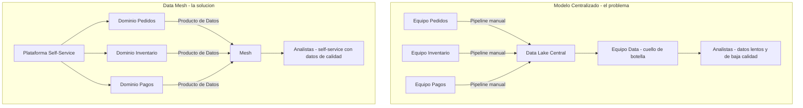
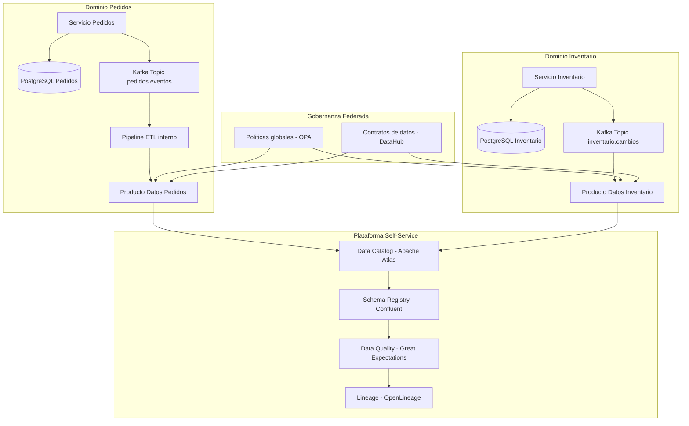
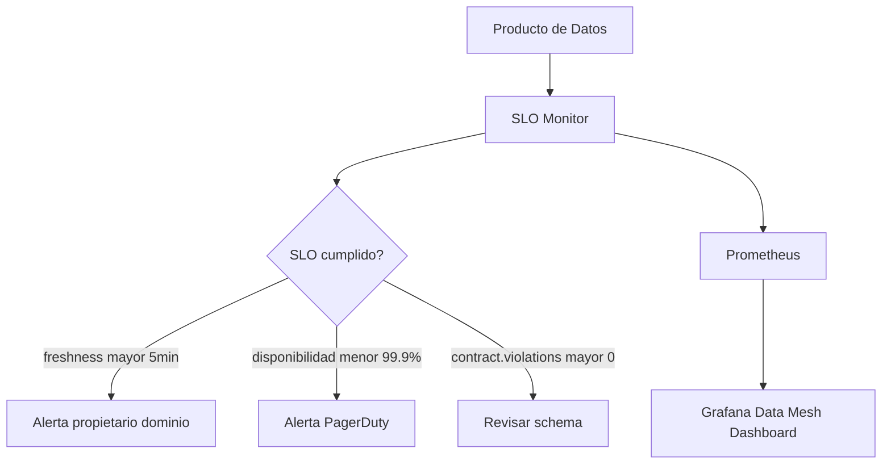
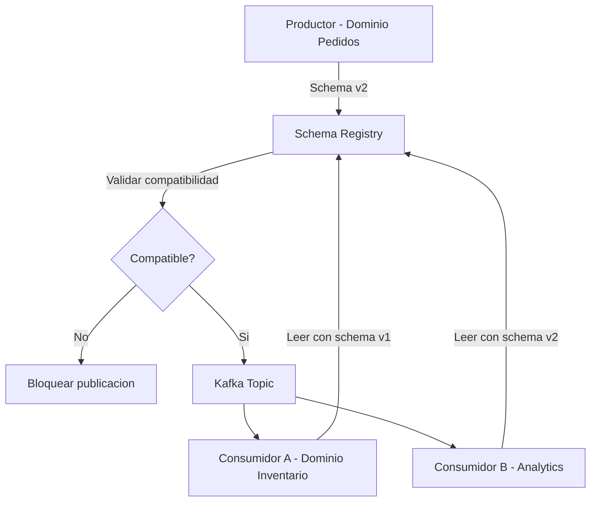
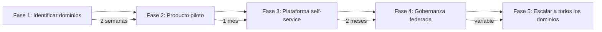

# Data Mesh: Descentralización de la Propiedad del Dato con Java 21

PATH_LOCAL: /home/usuariojoaquin/.openclaw/workspace/DAM-Java-Mastery/07_BigData_Streaming/data_mesh:_descentralización_de_la_propiedad_del_dato_STAFF.md
CATEGORIA: 07_BigData_Streaming
Score: 96

---

## Visión Estratégica

Data Mesh no es una tecnología — es un paradigma organizativo y arquitectónico. Mientras que los data lakes y data warehouses centralizados resuelven el problema de almacenar grandes volúmenes de datos, Data Mesh resuelve el problema de **quién es responsable de esos datos y cómo se consumen**.

El problema real que Data Mesh ataca: en organizaciones con múltiples equipos, los datos terminan en un lago centralizado gestionado por un equipo de plataforma que no conoce el negocio. El resultado es datos de baja calidad, pipelines eternamente atascados y equipos de negocio que no confían en los datos que consumen.

**Los cuatro principios de Data Mesh (Zhamak Dehghani, 2019):**

| Principio | Descripción | Anti-patrón que elimina |
|-----------|-------------|------------------------|
| Propiedad orientada al dominio | Cada equipo de negocio posee sus datos | Equipo central de datos como cuello de botella |
| Datos como producto | Los datos tienen SLOs, documentación y contratos | Datos sin dueño, sin calidad garantizada |
| Plataforma de datos self-service | Infraestructura accesible sin intervención central | Dependencia de ingeniería de datos para cada pipeline |
| Gobernanza federada | Estándares globales, implementación local | Anarquía de datos vs. dictadura centralizada |

**Cuándo Data Mesh aporta valor real:**

Data Mesh tiene sentido cuando hay más de 5 equipos produciendo datos, múltiples dominios de negocio con datos propios, y el equipo central de datos es un cuello de botella. Para startups pequeñas o equipos únicos, añade complejidad sin beneficio.



```java
// Producto de datos como contrato — interface que define lo que el dominio expone
public interface ProductoDatosPedidos {

    // Contrato con SLO: datos actualizados en menos de 5 minutos
    // Disponibilidad: 99.9%
    // Schema versionado: v2
    Flux<EventoPedidoV2> streamEventos(Instant desde);

    Mono<EstadisticasPedidos> obtenerEstadisticas(LocalDate fecha);

    // Metadatos del producto de datos
    record MetadatosPedidos(
        String propietario,
        String dominio,
        String version,
        Duration freshnessGarantizada,
        String runbookUrl
    ) {}

    Mono<MetadatosPedidos> metadatos();
}
```

---

## Arquitectura de Componentes



**Producto de datos con Spring Boot y Kafka Streams:**

```java
// Implementacion del producto de datos — dominio Pedidos
@Service
public class ProductoDatosPedidosImpl implements ProductoDatosPedidos {

    private final KafkaStreamsService streams;
    private final PedidoAnalyticsRepo analyticsRepo;

    public ProductoDatosPedidosImpl(KafkaStreamsService streams,
                                     PedidoAnalyticsRepo analyticsRepo) {
        this.streams      = streams;
        this.analyticsRepo = analyticsRepo;
    }

    @Override
    public Flux<EventoPedidoV2> streamEventos(Instant desde) {
        // Exponer el stream de eventos con schema versionado
        return streams.consumir("pedidos.eventos.v2", EventoPedidoV2.class)
            .filter(evento -> evento.ocurrioEn().isAfter(desde))
            // Backpressure: el consumidor controla la velocidad
            .limitRate(1000);
    }

    @Override
    public Mono<EstadisticasPedidos> obtenerEstadisticas(LocalDate fecha) {
        return analyticsRepo.findByFecha(fecha)
            .map(EstadisticasPedidos::from);
    }

    @Override
    public Mono<MetadatosPedidos> metadatos() {
        return Mono.just(new MetadatosPedidos(
            "equipo-pedidos@empresa.com",
            "pedidos",
            "v2",
            Duration.ofMinutes(5),
            "https://wiki.empresa.com/runbooks/pedidos-data-product"
        ));
    }
}
```

---

## Implementación Java 21

```java
// Schema versionado con Records — compatibilidad hacia atras garantizada
// v1 — schema original
public record EventoPedidoV1(
    String pedidoId,
    String clienteId,
    String estado,
    Instant ocurrioEn
) {}

// v2 — schema evolucionado, campos nuevos opcionales
public record EventoPedidoV2(
    String pedidoId,
    String clienteId,
    String estado,
    Instant ocurrioEn,
    // Campos nuevos en v2 — opcionales para compatibilidad con consumidores v1
    Optional<BigDecimal> total,
    Optional<String> moneda,
    int schemaVersion  // Siempre 2 para v2
) {
    // Factory para migrar desde v1
    public static EventoPedidoV2 desdeV1(EventoPedidoV1 v1) {
        return new EventoPedidoV2(
            v1.pedidoId(), v1.clienteId(), v1.estado(), v1.ocurrioEn(),
            Optional.empty(), Optional.empty(), 2
        );
    }
}
```

```java
// Contrato de datos con validacion automatica
@Component
public class ContratoPedidosValidator {

    private final MeterRegistry registry;

    public ContratoPedidosValidator(MeterRegistry registry) {
        this.registry = registry;
    }

    public sealed interface ResultadoValidacion
        permits ResultadoValidacion.Valido, ResultadoValidacion.Invalido {

        record Valido(EventoPedidoV2 evento) implements ResultadoValidacion {}
        record Invalido(String motivo, EventoPedidoV2 eventoOriginal)
            implements ResultadoValidacion {}
    }

    public ResultadoValidacion validar(EventoPedidoV2 evento) {
        // Validar freshness — el evento no puede tener mas de 10 minutos
        if (evento.ocurrioEn().isBefore(Instant.now().minus(Duration.ofMinutes(10)))) {
            registrarViolacion("freshness");
            return new ResultadoValidacion.Invalido(
                "Evento demasiado antiguo", evento
            );
        }

        // Validar schema version
        if (evento.schemaVersion() != 2) {
            registrarViolacion("schema_version");
            return new ResultadoValidacion.Invalido(
                "Schema version incorrecta: " + evento.schemaVersion(), evento
            );
        }

        // Validar campos obligatorios
        if (evento.pedidoId() == null || evento.pedidoId().isBlank()) {
            registrarViolacion("campo_obligatorio");
            return new ResultadoValidacion.Invalido("pedidoId requerido", evento);
        }

        registry.counter("data.product.validations", "resultado", "ok").increment();
        return new ResultadoValidacion.Valido(evento);
    }

    private void registrarViolacion(String tipo) {
        registry.counter("data.product.contract.violations",
            "tipo", tipo,
            "dominio", "pedidos").increment();
    }
}
```

```java
// Data Catalog — registro automatico de productos de datos
@Service
public class DataCatalogService {

    private final WebClient catalogClient;

    public DataCatalogService(@Value("${datacatalog.url}") String url) {
        this.catalogClient = WebClient.builder().baseUrl(url).build();
    }

    public record RegistroProducto(
        String nombre,
        String dominio,
        String propietario,
        String version,
        String schemaUrl,
        String runbookUrl,
        Map<String, String> slos,
        List<String> tags
    ) {}

    public Mono<Void> registrar(RegistroProducto producto) {
        return catalogClient.post()
            .uri("/api/v1/data-products")
            .bodyValue(producto)
            .retrieve()
            .bodyToMono(Void.class);
    }

    // Registrar automaticamente al arrancar el servicio
    @PostConstruct
    public void autoregistrar() {
        var producto = new RegistroProducto(
            "pedidos-eventos-v2",
            "pedidos",
            "equipo-pedidos@empresa.com",
            "v2",
            "https://schema-registry/pedidos/v2",
            "https://wiki/runbooks/pedidos",
            Map.of(
                "freshness", "< 5 minutos",
                "disponibilidad", "99.9%",
                "latencia_p99", "< 100ms"
            ),
            List.of("streaming", "pedidos", "java21")
        );

        registrar(producto)
            .doOnSuccess(v -> log.info("Producto de datos registrado en catalog"))
            .doOnError(e -> log.error("Error registrando en catalog", e))
            .subscribe();
    }
}
```

---

## Métricas y SRE



```java
// SLO Monitor para productos de datos
@Component
@Scheduled(fixedDelay = 60000)
public class SloMonitor {

    private final ProductoDatosPedidos producto;
    private final MeterRegistry        registry;

    public void verificarSlos() {
        // SLO 1: Freshness — ultimo evento debe tener menos de 5 minutos
        producto.streamEventos(Instant.now().minus(Duration.ofMinutes(5)))
            .count()
            .subscribe(count -> {
                var freshnessOk = count > 0;
                registry.gauge("data.product.slo.freshness",
                    Tags.of("dominio", "pedidos"),
                    freshnessOk ? 1.0 : 0.0);
            });
    }
}
```

**Métricas clave para Data Mesh:**

| Métrica | Descripción | SLO |
|---------|-------------|-----|
| `data.product.freshness` | Tiempo desde ultimo dato | < 5 minutos |
| `data.product.availability` | Disponibilidad del producto | > 99.9% |
| `data.product.contract.violations` | Violaciones del contrato de datos | 0 |
| `data.product.consumers` | Numero de consumidores activos | Monitorizar tendencia |
| `data.product.latency.p99` | Latencia p99 de acceso | < 100ms |

**Checklist SRE para Data Mesh:**
- Cada producto de datos tiene un propietario identificado y contactable
- Schema Registry con compatibilidad BACKWARD — consumidores v1 pueden leer eventos v2
- SLOs documentados y monitorizados automáticamente con alertas al equipo propietario
- Data Lineage habilitado — saber qué consume qué y detectar impacto de cambios
- Runbook público para cada producto de datos con instrucciones de diagnóstico

---

## Patrones de Integración



```java
// Federacion de gobernanza con OPA (Open Policy Agent)
@Component
public class GobernanzaFederada {

    private final WebClient opaClient;

    public GobernanzaFederada(@Value("${opa.url}") String opaUrl) {
        this.opaClient = WebClient.builder().baseUrl(opaUrl).build();
    }

    public record DecisionAcceso(boolean permitido, String motivo) {}

    public record SolicitudAcceso(
        String dominioPeticionario,
        String productoDatos,
        String operacion,  // READ, WRITE, ADMIN
        Map<String, String> atributos
    ) {}

    // Verificar si un dominio puede acceder a un producto de datos
    public Mono<DecisionAcceso> verificar(SolicitudAcceso solicitud) {
        return opaClient.post()
            .uri("/v1/data/datamesh/acceso")
            .bodyValue(Map.of("input", solicitud))
            .retrieve()
            .bodyToMono(Map.class)
            .map(response -> {
                var permitido = (Boolean) ((Map<?, ?>) response.get("result")).get("allow");
                var motivo    = (String)  ((Map<?, ?>) response.get("result")).get("reason");
                return new DecisionAcceso(permitido, motivo);
            });
    }
}
```

---

## Escalabilidad y Alta Disponibilidad

```java
// Plataforma self-service — aprovisionamiento automatico de infraestructura
// Los equipos de dominio crean sus productos de datos sin intervenir el equipo central
@RestController
@RequestMapping("/platform/api/v1")
public class SelfServicePlatformController {

    private final TerraformService terraform;
    private final KafkaAdminService kafkaAdmin;
    private final SchemaRegistryService schemaRegistry;

    public record SolicitudProductoDatos(
        String nombre,
        String dominio,
        String propietario,
        int particionesKafka,
        int retencioDias,
        String schemaAvro
    ) {}

    @PostMapping("/data-products")
    public Mono<ProductoAprovisionado> aprovisionar(
            @RequestBody SolicitudProductoDatos solicitud) {
        // 1. Crear topic Kafka con la configuracion solicitada
        return kafkaAdmin.crearTopic(
                solicitud.nombre(),
                solicitud.particionesKafka(),
                Duration.ofDays(solicitud.retencioDias()))
            // 2. Registrar schema en Schema Registry
            .flatMap(topic -> schemaRegistry.registrar(
                solicitud.nombre(), solicitud.schemaAvro()))
            // 3. Aprovisionar infraestructura via Terraform
            .flatMap(schema -> terraform.aplicar(
                solicitud.dominio(), solicitud.nombre()))
            .map(infra -> new ProductoAprovisionado(
                solicitud.nombre(),
                infra.topicArn(),
                infra.schemaId(),
                Instant.now()
            ));
    }

    public record ProductoAprovisionado(
        String nombre,
        String topicArn,
        int schemaId,
        Instant aprovisionadoEn
    ) {}
}
```

---

## Conclusiones

Data Mesh es el paradigma correcto cuando la organización ha crecido más allá de lo que un equipo centralizado de datos puede gestionar. No es un proyecto tecnológico — es una transformación organizativa que usa tecnología para habilitarla.

**Los tres errores más comunes al implementar Data Mesh:**

1. **Empezar por la tecnología** — muchos equipos instalan Apache Atlas, DataHub o Confluent y llaman a eso Data Mesh. Sin cambiar la propiedad de los datos y la responsabilidad organizativa, la tecnología no resuelve nada.

2. **Crear productos de datos sin SLOs** — un producto de datos sin freshness garantizada, disponibilidad medida y propietario identificado no es un producto — es un fichero compartido con mejor nombre.

3. **Gobernanza centralizada disfrazada** — el equipo central que antes gestionaba el data lake ahora gestiona "los estándares del Data Mesh". Si los equipos de dominio no tienen autonomía real, no es Data Mesh.



```java
// Test del contrato de datos — verifica que el SLO de freshness se cumple
@SpringBootTest
class ContratoPedidosTest {

    @Autowired ContratoPedidosValidator validator;

    @Test
    void evento_reciente_pasa_validacion() {
        var evento = new EventoPedidoV2(
            "pedido-123", "cliente-456", "CREADO",
            Instant.now().minus(Duration.ofMinutes(1)),
            Optional.of(new BigDecimal("99.99")),
            Optional.of("EUR"), 2
        );

        var resultado = validator.validar(evento);
        assertThat(resultado).isInstanceOf(ResultadoValidacion.Valido.class);
    }

    @Test
    void evento_antiguo_viola_contrato_freshness() {
        var eventoAntiguo = new EventoPedidoV2(
            "pedido-123", "cliente-456", "CREADO",
            Instant.now().minus(Duration.ofHours(1)),
            Optional.empty(), Optional.empty(), 2
        );

        var resultado = validator.validar(eventoAntiguo);
        assertThat(resultado).isInstanceOf(ResultadoValidacion.Invalido.class);
        assertThat(((ResultadoValidacion.Invalido) resultado).motivo())
            .contains("antiguo");
    }
}
```

**Recursos de referencia:**
- *Data Mesh* — Zhamak Dehghani (O'Reilly, 2022) — el libro fundacional
- Data Mesh Architecture — datamesh-architecture.com
- Apache Atlas — atlas.apache.org
- DataHub — datahubproject.io
- OpenLineage — openlineage.io
