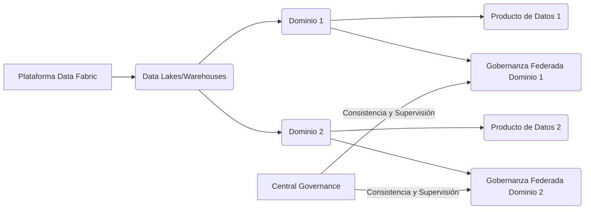

# Informe de Autoridad: Data Mesh: Descentralización de la propiedad del dato

## Introducción a Data Mesh

### Introducción a Data Mesh

**Data Mesh** es una arquitectura y un paradigma organizacional que redefine la forma en que las empresas manejan sus datos. A diferencia de la creencia común, implementar **Data Mesh** no implica necesariamente reemplazar completamente su infraestructura existente como data lakes o warehouses. En cambio, **Data Mesh** se integra con estos sistemas para mejorar la gestión y el uso de los datos a través de un enfoque descentralizado.

#### Complementando la Infraestructura Exisitente

La arquitectura de una empresa típica generalmente incluye data warehouses o lakes que actúan como puntos centrales donde se almacenan y procesan grandes volúmenes de datos. Sin embargo, estos sistemas suelen enfrentar desafíos de escalabilidad, latencia y gobernanza, especialmente cuando el volumen y la complejidad de los datos aumenta.

**Data Mesh** funciona sobre esta infraestructura existente, aprovechando sus capacidades mientras aborda los problemas a través de un enfoque organizacional. Esto significa que **Data Mesh** no es una tecnología que reemplace sino que complementa y mejora la eficacia de las soluciones de almacenamiento y procesamiento de datos.

#### Principios Fundamentales

1. **Dominio Orientado:** En **Data Mesh**, los equipos de dominio son responsables del manejo de sus propios conjuntos de datos. Esto permite a estos equipos actuar con autonomía, entender el contexto empresarial y las necesidades de sus usuarios finales.

2. **Datos como Productos:** Los datos se tratan como productos individuales que cumplen un propósito específico dentro del negocio. Cada conjunto de datos debe tener claridad en su propósitos y beneficios para los consumidores internos o externos, similar a cómo se gestionan otros productos empresariales.

3. **Infraestructura Auto-Servicio:** La infraestructura que apoya el almacenamiento y la entrega de datos es accesible a los equipos de dominio sin necesidad de intervención centralizada. Esto promueve una mayor agilidad y adaptabilidad en cómo se gestionan los datos.

4. **Gobernanza Computacional Federada:** Aunque cada equipo tiene autonomía, existe un nivel de gobernanza federada que asegura la calidad, seguridad y privacidad de los datos. Esta gobernanza no es centralizada sino distribuida a través del entramado de equipos de dominio.

#### Diagrama Conceptual

Un diagrama conceptual puede ayudar a visualizar cómo estos principios interactúan en una arquitectura **Data Mesh**:



#### Implementación Técnica

La implementación técnica de **Data Mesh** implica la creación de un entorno donde los equipos pueden almacenar, gestionar y compartir sus datos de manera independiente. Un enfoque común es utilizar una combinación de APIs personalizadas y microservicios para proporcionar un acceso seguro y controlado a los conjuntos de datos.

Por ejemplo, si estamos utilizando Java para desarrollar servicios de API que permitan la interacción con los datos almacenados en data lakes o warehouses, podríamos escribir código como el siguiente:

```java
import com.amazonaws.services.s3.AmazonS3;
import com.amazonaws.services.s3.model.GetObjectRequest;

public class DataMeshService {
    private AmazonS3 s3Client;

    public DataMeshService(AmazonS3 s3Client) {
        this.s3Client = s3Client;
    }

    public byte[] getDataFromDomain(String domainName, String bucketName, String objectKey) {
        GetObjectRequest request = new GetObjectRequest(bucketName, objectKey);
        return s3Client.getObject(request).getObjectContent().readAll();
    }
}
```

Este código proporciona un acceso controlado a los datos en función del dominio, permitiendo la descentralización de la responsabilidad y el manejo de los datos.

**Data Mesh** es una evolución natural en la gestión de datos que busca resolver problemas comunes asociados con el crecimiento exponencial de los volúmenes de datos y la complejidad asociada. Al implementar **Data Mesh**, las organizaciones pueden mejorar significativamente su capacidad para extraer valor de sus conjuntos de datos, manteniendo un enfoque centrado en el dominio que permite escalabilidad y flexibilidad.

## Principios Fundamentales de Data Mesh

### Principios Fundamentales de Data Mesh

La implementación exitosa de un enfoque de Data Mesh requiere una comprensión profunda de sus principios fundamentales. A continuación se describen los cuatro principios esenciales que rigen el concepto de Data Mesh, junto con explicaciones técnicas y ejemplos para profesionales de ingeniería:

1. **Dominio-Orientada Propiedad del Dato**
   Este principio establece que cada dominio empresarial es responsable del dato relevante dentro de su contexto. Es decir, los equipos que comprenden mejor la naturaleza y el valor del dato (especialistas en dominios) son los encargados de gestionarlo. Esto implica una estructura organizativa donde los equipos tienen claridad sobre cuál es su responsabilidad con respecto a los datos.

   **Técnica**: La aplicación práctica de este principio puede implicar la creación de APIs y módulos en Java que encapsulan las funcionalidades relacionadas con el dato del dominio. Estos módulos pueden ser mantenidos y actualizados por equipos específicos dentro del dominio, asegurando así una responsabilidad clara y un control más efectivo sobre los datos.

2. **Datos como Producto**
   Los datos son tratados de la misma manera que cualquier otro producto en la empresa: se les da valor comercial al diseñarlos para ser consumidos por múltiples partes interesadas internas y externas. Esto implica que cada conjunto de datos debe estar bien documentado, validado y soportado.

   **Técnica**: Implementación de una plataforma de documentación en línea donde los equipos puedan registrar sus conjuntos de datos, incluyendo metadatos técnicos (esquemas, tipos de dato) y metadatos comerciales (propósito, usos). Esto puede implicar la utilización de un sistema de gestión de repositorios como GitHub para almacenar y gestionar documentaciones y códigos relacionados con los datos.

3. **Infraestructura de Servicio al Cliente**
   La infraestructura de datos debe ser accesible e intuitiva para su uso por parte del consumidor final, permitiendo a cualquier equipo obtener acceso a la información necesaria sin requerir intervención centralizada.

   **Técnica**: Implementación de servicios RESTful en Java que proporcionan interfaces de usuario simplificadas (UI) y APIs para acceder fácilmente a los datos. Esto incluye la creación de endpoints que permiten realizar consultas, obtener metadatos y realizar operaciones CRUD (Crear, Leer, Actualizar, Borrar).

4. **Gobernanza Computacional Federada**
   Este principio es crucial para mantener un estándar uniforme en el cumplimiento normativo y la calidad del dato a través de toda la organización, a pesar de que los equipos son autónomos.

   **Técnica**: Implementación de políticas de seguridad y control de acceso basado en roles (RBAC) usando servicios como AWS IAM o Azure AD. Además, sistemas de monitoreo y alertas deben ser implementados para garantizar la integridad del dato, como Prometheus junto con Grafana para visualización.

#### Diagrama Mermaid

```mermaid
graph LR;
    A[Ingeniería] --> B{Datos};
    C[Operaciones] -->|APIs| D[(Infraestructura)];
    E[Comercial] --> F{(Gobernanza)};
    G[Domain Teams] --> H{Data Ownership};
    I[Central Governance] --> J{Policy Enforcement};
    K[Business Users] --> L{Trusted Answers};
    
    subgraph "Data Mesh"
        H;
        J;
    end
    
    subgraph "Data Fabric"
        D;
        F;
    end
    
    A -->|Metadata API| D;
    C -->|RESTful Services| D;
    E -->|Grafana/Dashboard| L;
    G -->|Java Modules/APIs| B;
    I -->|Policies/Alerts| J;
```

#### Código Técnico Ejemplo

Para ilustrar cómo estos principios pueden implementarse en código, aquí hay un ejemplo de cómo podrías estructurar una API RESTful para proporcionar acceso a datos específicos del dominio:

```java
import org.springframework.web.bind.annotation.*;

@RestController
@RequestMapping("/domain")
public class DomainDataController {

    @GetMapping("/{id}/data")
    public ResponseEntity<String> getData(@PathVariable("id") Long id) {
        // Implementación que recupera el dato basado en el ID de dominio.
        String data = retrieveDomainData(id);
        return ResponseEntity.ok(data);
    }

    private String retrieveDomainData(Long domainId) {
        // Lógica para recuperar datos del dominio usando servicios y repositorios específicos.
        DomainService service = new DomainService();
        return service.getData(domainId);
    }
}
```

Este ejemplo muestra cómo se podrían implementar APIs que proporcionan acceso a los datos de un dominio en específico, respetando la estructura de propiedad del dato basada en dominios.

### Conclusión

La adopción de estos principios fundamentales permite no sólo una gestión más eficiente y escalable de los datos, sino también una innovación acelerada en el uso de estos datos para impulsar decisiones comerciales estratégicas. La combinación del concepto de Data Mesh con la infraestructura existente ofrece un enfoque equilibrado entre centralización y descentralización que maximiza la eficiencia operativa mientras mantiene un alto nivel de control sobre los datos corporativos.

