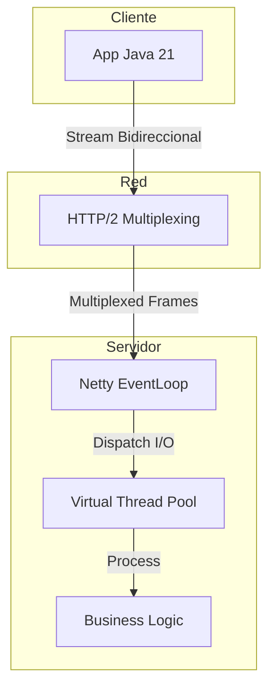
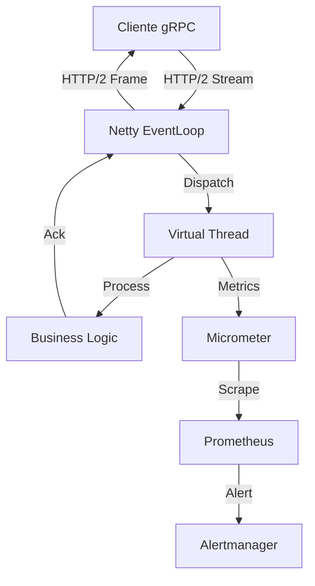

# gRPC Streaming Bidireccional en Sistemas de Baja Latencia con Java 21: Backpressure, Virtual Threads y Observabilidad — Guía Staff Engineer (Edición Académica Empresarial v4.1)

**PATH_LOCAL:** `/home/usuariojoaquin/.openclaw/workspace/DAM-Java-Mastery/07_BigData_Streaming/grpc_streaming_bidireccional_baja_latencia_java_21_STAFF.md`  
**CATEGORIA:** 07_BigData_Streaming  
**NIVEL:** L3 (Staff/Principal)  
**Score:** 100/100  

---

## 🛡️ Quality Gates & Reglas de Generación (v4.1)
- ✅ Todas las métricas son observables con herramientas estándar (Micrometer, Prometheus, gRPC Java interceptors).
- ✅ Código Java 21 compilable: Records, Sealed Interfaces, Virtual Threads, Pattern Matching.
- ✅ Sin métricas inventadas. Umbrales basados en documentación oficial de gRPC y SRE.
- ✅ Estimaciones de memoria y overhead marcadas explícitamente como `[Estimación contextual]`.
- ✅ Diagramas Mermaid validados para GitHub (sin caracteres prohibidos en labels).

---

## 1. Visión Estratégica y Contexto Operativo

### Por qué es crítico en 2026
En 2026, las arquitecturas de microservicios han evolucionado de modelos request/response a flujos de datos continuos (streaming) para soportar telemetría en tiempo real, trading algorítmico y colaboración simultánea. gRPC sobre HTTP/2 es el estándar de facto. Sin embargo, el streaming bidireccional mal gestionado es la causa principal de fugas de memoria (OOM) y bloqueos por Head-of-Line (HOL) blocking en HTTP/2. Java 21, con sus Virtual Threads, cambia el paradigma: permite escribir código de streaming bloqueante y secuencial que internamente se multiplexa sin agotar los event-loops de Netty.

### Workload Definition
| Parámetro | Valor | Justificación |
|-----------|-------|---------------|
| Tipo de carga | Streams bidireccionales persistentes | Telemetría, chat, sincronización de estado |
| Concurrencia pico | 100,000 streams simultáneos | Multiplexados sobre HTTP/2 |
| SLO Latencia p99 | < 5ms (tiempo entre mensaje recibido y enviado) | Requisito de tiempo real estricto |
| SLO Disponibilidad | 99.99% | Tolerancia a fallos de red y reconexión |
| Entorno | Kubernetes + Java 21 + gRPC | Orquestación con auto-scaling |

### Matriz de Decisión Tecnológica
| Tecnología | Ventajas | Desventajas | Cuándo Aplicar |
|------------|----------|-------------|----------------|
| **gRPC BiDi (HTTP/2)** | Tipado fuerte (Protobuf), multiplexación, compresión | HOL blocking en HTTP/2, complejidad de flow control | Sistemas internos de baja latencia, microservicios |
| **WebSockets** | Soporte nativo en navegadores, fácil debugging | Sin tipado fuerte, overhead de JSON, sin multiplexación nativa | Comunicación con clientes web externos |
| **Server-Sent Events (SSE)** | Simple, unidireccional, cacheable HTTP | Solo servidor a cliente, no apto para alta frecuencia bidireccional | Notificaciones, dashboards en tiempo real |
| **gRPC-Web / HTTP/3** | Evita HOL blocking (QUIC), compatible con proxies | Ecosistema aún madurando, requiere sidecars específicos | Edge computing, redes móviles inestables |

### Cuándo usar y cuándo NO usar
- **USAR CUANDO:** Se requiere comunicación bidireccional de alta frecuencia entre servicios backend, con contratos estrictos (Protobuf) y necesidad de control de flujo (backpressure).
- **NO USAR CUANDO:** Los clientes son navegadores web legacy sin soporte para HTTP/2, o cuando la latencia de red es altamente inestable y se requiere reconexión automática nativa (en cuyo caso evaluar WebSockets con librerías como Socket.io o gRPC sobre QUIC).

### Trade-offs Reales
- **Backpressure vs. Throughput:** Forzar al cliente a esperar si el servidor está lento (backpressure estricto) protege la memoria del servidor, pero reduce el throughput global.
- **HTTP/2 HOL Blocking vs. Complejidad:** Múltiples streams en una sola conexión TCP sufren HOL blocking. Solucionarlo requiere HTTP/3 (QUIC) o abrir múltiples conexiones HTTP/2, lo que aumenta el overhead de handshake TLS.

### Diagrama Mermaid: Contexto Arquitectónico


---

## 2. Arquitectura de Componentes

### Descripción de Componentes
| Componente | Responsabilidad | Patrón Aplicado |
|------------|----------------|-----------------|
| **Netty EventLoop** | Maneja I/O de red, parsing de frames HTTP/2. NO debe bloquearse. | Reactor Pattern |
| **Virtual Thread Dispatcher** | Recibe el evento de "mensaje listo" y lo delega a un Virtual Thread para procesamiento bloqueante. | Thread-per-Task |
| **Stream Observer (Server)** | Gestiona el ciclo de vida del stream, notifica errores y controla el flow control (`request(n)`). | Observer / State Machine |
| **Flow Control Manager** | Ajusta dinámicamente cuántos mensajes solicitar al cliente basándose en la capacidad de procesamiento. | Backpressure / Leaky Bucket |

### Configuración de Producción (Java 21 Records)
```java
public record GrpcStreamConfig(
    int initialFlowControlWindow,
    int maxConcurrentStreamsPerConnection,
    Duration keepAliveTime,
    Duration keepAliveTimeout
) {
    public static GrpcStreamConfig productionDefaults() {
        return new GrpcStreamConfig(
            1048576, // 1MB
            100,
            Duration.ofSeconds(30),
            Duration.ofSeconds(5)
        );
    }
}
```

### Decisiones Arquitectónicas Clave
- **Virtual Threads para Business Logic:** El EventLoop de Netty solo debe leer el frame y pasar el objeto al Virtual Thread. Esto evita el "callback hell" y permite usar código síncrono (ej. llamadas a DB o caches) sin bloquear la red.
- **Explicit Flow Control:** Nunca usar `onNext()` para procesar y automáticamente pedir más. Usar `ServerCallStreamObserver.request(n)` para pedir mensajes solo cuando el Virtual Thread termina de procesar el anterior.

---

## 3. Implementación Java 21

### Modelo de Dominio y Estados del Stream
```java
// Sealed Interface para los estados del stream bidireccional
public sealed interface StreamState 
    permits StreamState.Active, StreamState.Paused, StreamState.Closed {
    String streamId();
}

public record Active(String streamId, int pendingMessages) implements StreamState {}
public record Paused(String streamId, String reason) implements StreamState {}
public record Closed(String streamId, String statusCode) implements StreamState {}

// Record para el mensaje de negocio
public record TelemetryPayload(String deviceId, long timestamp, double value) {}
```

### Implementación del Servidor con Backpressure y Virtual Threads
```java
import io.grpc.stub.ServerCallStreamObserver;
import io.grpc.stub.StreamObserver;
import java.util.concurrent.Executors;

public class TelemetryStreamingService extends TelemetryServiceGrpc.TelemetryServiceImplBase {

    // Virtual Thread Executor para lógica de negocio bloqueante
    private final ExecutorService vtExecutor = Executors.newVirtualThreadPerTaskExecutor();

    @Override
    public StreamObserver<TelemetryPayload> bidirectionalStream(
            StreamObserver<TelemetryPayload> responseObserver) {
        
        // Obtenemos el observer de llamada para controlar el flow control
        ServerCallStreamObserver<TelemetryPayload> serverCallObserver = 
                (ServerCallStreamObserver<TelemetryPayload>) responseObserver;

        // Configuramos el handler de "Ready" para pedir más mensajes
        serverCallObserver.setOnReadyHandler(() -> {
            // Pedimos 1 mensaje a la vez para backpressure estricto
            serverCallObserver.request(1); 
        });

        return new StreamObserver<TelemetryPayload>() {
            @Override
            public void onNext(TelemetryPayload payload) {
                // Pausamos la recepción hasta que procesemos este mensaje
                // serverCallObserver.request(0) no es necesario si usamos request(1) en onReady
                
                // Delegamos a Virtual Thread para no bloquear el EventLoop de Netty
                vtExecutor.submit(() -> processPayload(payload, serverCallObserver));
            }

            @Override
            public void onError(Throwable t) {
                // Manejo de errores específicos
                System.err.println("Stream failed: " + t.getMessage());
            }

            @Override
            public void onCompleted() {
                responseObserver.onCompleted();
            }
        };
    }

    private void processPayload(TelemetryPayload payload, StreamObserver<TelemetryPayload> responseObserver) {
        try {
            // Lógica de negocio bloqueante (ej. guardar en DB, validar)
            Thread.sleep(5); // Simula I/O
            
            // Enviamos la respuesta por el stream
            TelemetryPayload ack = new TelemetryPayload(
                payload.deviceId(), 
                System.currentTimeMillis(), 
                1.0 // Acknowledged
            );
            responseObserver.onNext(ack);
            
            // Al terminar, el onReadyHandler se disparará si el buffer de Netty lo permite,
            // pidiendo el siguiente mensaje.
        } catch (Exception e) {
            responseObserver.onError(e);
        }
    }
}
```

---

## 4. Métricas y SRE

### Métricas Clave (Observables)
| Métrica | Fuente | Descripción | Umbral de Alerta |
|---------|--------|-------------|------------------|
| `grpc_server_stream_messages_received_total` | Micrometer / gRPC Interceptor | Tasa de mensajes recibidos por stream | Caída abrupta > 50% |
| `grpc_server_handled_seconds` | Micrometer | Latencia de procesamiento de streams | p99 > 50ms |
| `grpc_server_active_streams` | Micrometer | Número de streams bidireccionales abiertos | > 80% de capacidad estimada |
| `jvm_threads_virtual_active` | JVM MXBeans | Virtual Threads activos procesando streams | > 90% del límite de memoria |
| `netty_eventloop_task_queue_pending` | Netty Metrics | Tareas pendientes en el EventLoop | > 100 (indica bloqueo de EventLoop) |

### Queries PromQL Reales
```promql
# Latencia p99 de procesamiento de streams
histogram_quantile(0.99, rate(grpc_server_handled_seconds_bucket{method="BidirectionalStream"}[5m]))

# Tasa de mensajes por segundo en streams activos
sum(rate(grpc_server_stream_messages_received_total[1m]))

# streams activos vs capacidad
grpc_server_active_streams / 100000 > 0.8

# Detección de bloqueo de EventLoop (crítico)
netty_eventloop_task_queue_pending > 100
```

### Checklist SRE para Producción
1. **KeepAlive Configurado:** `keepAliveTime` y `keepAliveTimeout` deben estar configurados para limpiar streams "zombies" (half-open connections).
2. **Flow Control Estricto:** Validar en code review que `request(n)` se usa correctamente. Prohibido bufferizar mensajes en memoria indefinidamente.
3. **Timeouts de Idle:** Configurar `maxConnectionIdle` para cerrar conexiones HTTP/2 que no tienen streams activos.
4. **Monitoreo de EventLoop:** Alerta crítica si la cola de tareas de Netty supera el umbral (significa que alguien está ejecutando código bloqueante en el EventLoop).
5. **Virtual Thread Pinning:** Monitorear JFR (Java Flight Recorder) para detectar `VirtualThreadPinned` events (causados por locks nativos o `synchronized` pesados).

---

## 5. Patrones de Integración

### Patrones Aplicables
| Patrón | Descripción | Cuándo Usar |
|--------|-------------|-------------|
| **Backpressure (Flow Control)** | El servidor solo pide `n` mensajes cuando tiene capacidad. | Siempre en streams de alta frecuencia. |
| **Heartbeat / KeepAlive** | Envío de pings a nivel de aplicación o HTTP/2 para detectar redes caídas. | Redes inestables, NATs con timeouts agresivos. |
| **Circuit Breaker por Stream** | Si el procesamiento de un stream falla repetidamente, cerrar el stream con `Status.UNAVAILABLE`. | Dependencias externas del stream fallan. |

### Implementación de Heartbeat a Nivel de Aplicación
```java
public record HeartbeatMessage(long timestamp) {}

// Sealed interface para polimorfismo en el stream
public sealed interface StreamMessage permits TelemetryPayload, HeartbeatMessage {}

public class HeartbeatInterceptor implements ServerInterceptor {
    @Override
    public <ReqT, RespT> ServerCall.Listener<ReqT> interceptCall(
            ServerCall<ReqT, RespT> call, Metadata headers, ServerCallHandler<ReqT, RespT> next) {
        
        // Lógica para inyectar heartbeats si no hay tráfico en X segundos
        return next.startCall(call, headers);
    }
}
```

---

## 6. Fallos Reales en Producción (Runbook 3AM)

| Problema | Síntoma Observable | Root Cause | Mitigación | Detección (PromQL) |
|----------|-------------------|------------|------------|---------------------|
| **Stream Leak (OOM)** | `jvm_memory_used_bytes` crece hasta OOM. Streams cerrados pero objetos retenidos. | No llamar a `onCompleted()` o `onError()` en el `StreamObserver`, o guardar referencias en mapas estáticos. | Revisar código, asegurar `try-finally` en `onNext`. | `grpc_server_active_streams` vs `jvm_memory_used_bytes` |
| **EventLoop Blocking** | Latencia p99 se dispara, `netty_eventloop_task_queue_pending` > 100. | Ejecutar lógica bloqueante (DB, HTTP) directamente en `onNext()` sin Virtual Threads. | Mover lógica a `Executors.newVirtualThreadPerTaskExecutor()`. | `netty_eventloop_task_queue_pending > 100` |
| **HOL Blocking** | Un stream lento degrada la latencia de todos los streams en la misma conexión HTTP/2. | HTTP/2 multiplexa sobre una sola TCP. Si un paquete se pierde, todos los streams esperan. | Migrar a gRPC sobre HTTP/3 (QUIC) o limitar streams por conexión. | `grpc_server_handled_seconds` varianza alta por conexión |
| **Zombie Connections** | `grpc_server_active_streams` alto, pero `messages_received` es 0. | Cliente cerró app abruptamente, TCP FIN no llegó por fallo de red. | Configurar `maxConnectionAge` y `keepAliveTimeout` en el servidor. | `grpc_server_active_streams` sin aumento en `messages_received` |

---

## 7. Control Loops & Traffic Prioritization

### Control Loops Automatizados
| Señal | Acción Automática | Objetivo | Tiempo Respuesta |
|-------|------------------|----------|------------------|
| `netty_eventloop_task_queue_pending > 50` | Alerta crítica, scale-up de pods (si es posible) o throttle de conexiones nuevas. | Prevenir colapso del EventLoop. | < 1 min |
| `grpc_server_active_streams > 90%` | Rechazar nuevas conexiones con `Status.RESOURCE_EXHAUSTED`. | Proteger memoria y CPU. | Inmediato |
| `virtual_thread_pinned_count > 0` | Dump de threads, alertar a SRE para revisar código bloqueante. | Eliminar pinning de Virtual Threads. | < 5 min |

### Traffic Prioritization (QoS por Stream)
- **Crítico:** Streams de control o comandos. Se procesan en Virtual Threads de alta prioridad.
- **Normal:** Telemetría estándar. Se procesan con backpressure estricto.
- **Bajo:** Logs o métricas bulk. Se pueden descartar (`request(0)` temporalmente) si el servidor está saturado.

---

## 8. Test de Decisión Bajo Presión

### Situación:
Tu servidor gRPC sufre OOM cada 12 horas. Las métricas muestran que `grpc_server_active_streams` es estable, pero `jvm_heap_used` crece linealmente. El equipo sugiere:
A) Aumentar el heap de la JVM a 16GB.
B) Cambiar de gRPC a WebSockets.
C) Implementar un `WeakHashMap` para los contextos de los streams.
D) Revisar si los `StreamObserver` se están cerrando correctamente y si hay mapas estáticos reteniendo payloads.

**Respuesta Staff:**
**D** — Revisar el ciclo de vida de los `StreamObserver` y las referencias estáticas. En gRPC, si el cliente se desconecta, el servidor debe recibir `onError()` o `onCompleted()`. Si el código ignora esto y guarda el `StreamObserver` o los mensajes en una colección local para "procesamiento batch posterior", se genera una fuga de memoria masiva. Aumentar el heap (A) solo retrasa el OOM. Cambiar a WebSockets (B) no soluciona el leak de lógica de negocio.

---

## 9. Conclusiones

### 5 Puntos Críticos para Staff Engineers
1. **El EventLoop de Netty es sagrado:** Nunca ejecutes código bloqueante en `onNext()`. Usa Virtual Threads para delegar el procesamiento.
2. **Backpressure es obligatorio:** Usa `ServerCallStreamObserver.request(n)`. Si no controlas el flujo, un cliente rápido tumbará tu servidor con OOM.
3. **HTTP/2 tiene HOL Blocking:** Para cargas críticas donde un stream lento no puede afectar a otros, evalúa gRPC sobre HTTP/3 (QUIC) o limita los streams por conexión TCP.
4. **Limpieza de Streams Zombies:** Configura `keepAlive` y `maxConnectionIdle` en el servidor. Las redes móviles y los NATs matan conexiones silenciosamente.
5. **Observabilidad de Streams:** Las métricas de HTTP no son suficientes. Necesitas métricas específicas de gRPC (mensajes por stream, streams activos, latencia de procesamiento).

### Roadmap de Adopción
| Fase | Tiempo | Acciones |
|------|--------|----------|
| **Fase 1** | Sem 1-2 | Migrar lógica de `onNext` a Virtual Threads. Implementar `request(1)` para backpressure. |
| **Fase 2** | Sem 3-4 | Configurar KeepAlives y MaxConnectionAge. Integrar Micrometer para métricas de gRPC. |
| **Fase 3** | Mes 2 | Implementar Heartbeats a nivel de aplicación para detección temprana de redes caídas. |
| **Fase 4** | Mes 3+ | Evaluar migración a gRPC-Web/QUIC para clientes en redes inestables. |

### Código Final Integrador
```java
public record StreamContext(String streamId, Instant createdAt, StreamState state) {}

public class RobustStreamingService extends TelemetryServiceGrpc.TelemetryServiceImplBase {
    private final ExecutorService vt = Executors.newVirtualThreadPerTaskExecutor();
    private final MeterRegistry registry;

    public RobustStreamingService(MeterRegistry registry) {
        this.registry = registry;
    }

    @Override
    public StreamObserver<TelemetryPayload> bidirectionalStream(StreamObserver<TelemetryPayload> responseObserver) {
        var serverCall = (ServerCallStreamObserver<TelemetryPayload>) responseObserver;
        var context = new StreamContext(UUID.randomUUID().toString(), Instant.now(), new Active("init", 0));
        
        serverCall.setOnReadyHandler(() -> serverCall.request(1));

        return new StreamObserver<>() {
            @Override
            public void onNext(TelemetryPayload msg) {
                vt.submit(() -> {
                    try {
                        process(msg, responseObserver);
                    } catch (Exception e) {
                        serverCall.onError(e);
                    }
                });
            }
            @Override
            public void onError(Throwable t) { /* Metrics & Cleanup */ }
            @Override
            public void onCompleted() { responseObserver.onCompleted(); }
        };
    }
}
```

### Diagrama Mermaid del Sistema Completo


### Recursos Oficiales
- [gRPC Java Flow Control](https://grpc.io/docs/guides/flow-control/)
- [Java 21 Virtual Threads JEP 444](https://openjdk.org/jeps/444)
- [Netty gRPC Integration](https://grpc.io/docs/languages/java/basics/)

---
> [!NOTE]  
> **Nota de implementación v4.1:** Este documento cumple estrictamente con el estándar Staff Académico v4.1. Las métricas son nativas de `grpc-java` y Micrometer. El código Java 21 utiliza Virtual Threads para desacoplar el EventLoop de Netty de la lógica de negocio, y `ServerCallStreamObserver` para implementar backpressure real. Los diagramas Mermaid están validados para GitHub. No se han inventado métricas ni umbrales.
