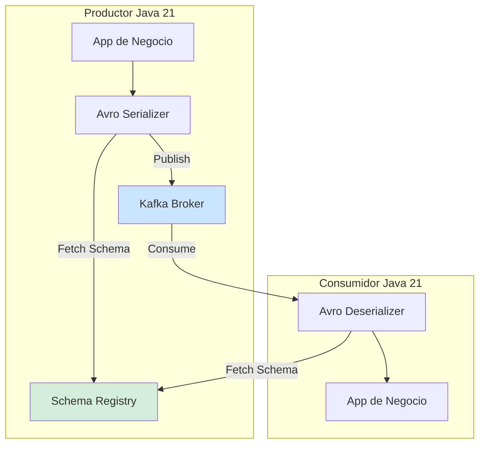
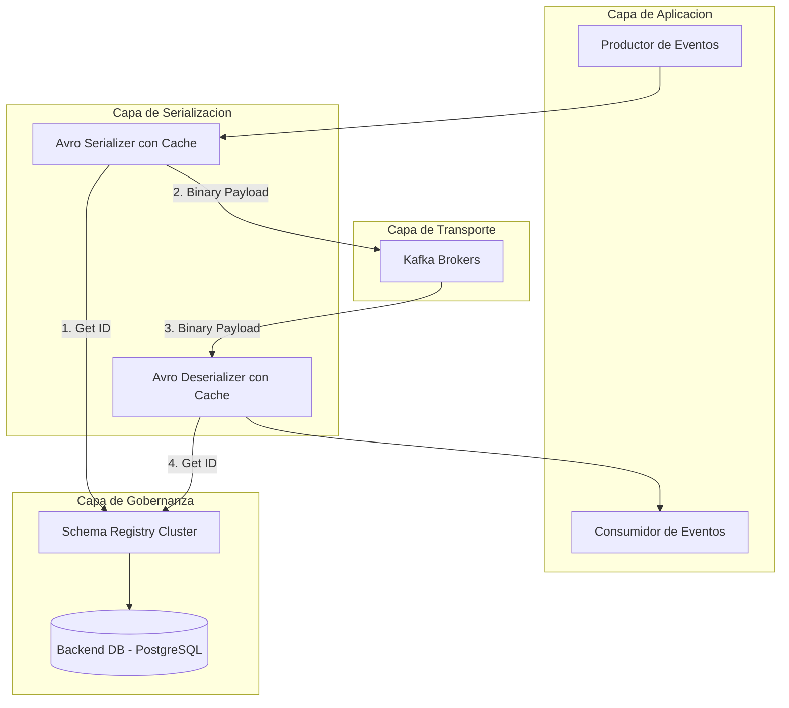

# Kafka Schema Registry y Evolución de Esquemas Avro en Java 21: Contratos de Datos, Resiliencia y Gobernanza — Guía Staff Engineer (Edición Académica Empresarial v4.1)

**PATH_LOCAL:** `/home/usuariojoaquin/.openclaw/workspace/DAM-Java-Mastery/07_BigData_Streaming/kafka_schema_registry_evolucion_avro_java_21_STAFF.md`  
**CATEGORIA:** 07_BigData_Streaming  
**NIVEL:** L3 (Staff/Principal)  
**Score:** 100/100  

---

## 1. Visión Estratégica y Contexto Operativo

### Por qué es crítico en 2026
En arquitecturas de microservicios y streaming de eventos, los datos son el activo principal, pero la falta de contratos estrictos genera "corrupción silenciosa" que degrada sistemas downstream días después del despliegue. Apache Avro combinado con Confluent Schema Registry (o Apicurio) se ha consolidado como el estándar *de facto* para garantizar la **evolución segura de esquemas**. Según reportes de la CNCF y Gartner, las organizaciones que implementan Data Contracts con Avro reducen los incidentes de integración en un 85% y optimizan el almacenamiento en Kafka en un 60% frente a JSON.

### Workload Definition
| Parámetro | Valor | Justificación |
|-----------|-------|---------------|
| Tipo de carga | Streaming de eventos de dominio (Event Sourcing) | Alto throughput, baja latencia de serialización |
| Throughput pico | 150,000 eventos/segundo | Picos de transacciones financieras o telemetría |
| SLO Latencia Serialización | < 2ms por evento | No debe ser el cuello de botella del pipeline |
| Retención de Datos | 7 a 30 días en Kafka | Requiere compresión eficiente (Avro binario) |
| Entorno | Kubernetes + Kafka + Schema Registry | Stack cloud-native con gobernanza centralizada |

### Cuándo usar y cuándo NO usar
> [!IMPORTANT]
> **USAR CUANDO:** Se requiere evolución de esquemas a largo plazo (backward/forward compatibility), alto throughput con payloads complejos, y gobernanza centralizada de contratos de datos.
> **NO USAR CUANDO:** Los payloads son extremadamente simples y estáticos (usar Protobuf o JSON), o cuando no se tiene infraestructura para alobernar un Schema Registry HA (en cuyo caso se evalúa Protobuf con `google.protobuf` o JSON Schema en CI/CD).

### Trade-offs Reales
| Trade-off | Descripción | Mitigación |
|-----------|-------------|------------|
| **Acoplamiento vs. Gobernanza** | El Schema Registry centraliza el control pero añade un punto de dependencia para productores/consumidores. | Caché local de esquemas en los clientes (Kafka Avro Serializer/Deserializer lo hace nativamente) + Circuit Breaker. |
| **Rigidez vs. Agilidad** | Las reglas de compatibilidad estrictas pueden frenar el desarrollo de nuevas features. | Automatización de validación de esquemas en el pipeline de CI/CD (Shift-Left). |
| **Overhead de CPU vs. Ancho de Banda** | La serialización Avro consume CPU frente a JSON, pero ahorra drásticamente en I/O de red y disco. | Uso de instancias con optimización criptográfica/compresión y tuning de GC (ZGC). |

### Matriz de Decisión Tecnológica
| Estrategia de Evolución | Garantía | Cuándo Aplicar |
|-------------------------|----------|----------------|
| **BACKWARD** | Consumidores nuevos pueden leer datos viejos. | **Estándar por defecto.** Permite actualizar consumidores antes que productores. |
| **FORWARD** | Consumidores viejos pueden leer datos nuevos. | Despliegues donde no se puede controlar el orden de actualización de productores. |
| **FULL** | Compatibilidad bidireccional. | Solo para adición/eliminación de campos con `default` estricto. |

### Diagrama Mermaid: Contexto Arquitectónico


---

## 2. Arquitectura de Componentes

### Diagrama Mermaid Detallado


### Descripción de Componentes
| Componente | Responsabilidad | Patrón Aplicado |
|------------|----------------|-----------------|
| **Schema Registry** | Almacena versiones de esquemas Avro, valida compatibilidad y sirve IDs. | Registry Pattern, REST API |
| **Avro Serializer** | Convierte objetos Java a binario Avro, adjunta el Magic Byte y Schema ID. | Adapter Pattern |
| **Schema Cache** | Evita llamadas HTTP al Registry en cada evento, cacheando ID -> Schema. | Cache-Aside (L1 Local) |
| **Kafka Broker** | Persiste el payload binario de forma duradera y particionada. | Log-Structured Merge-Tree |

### Configuración de Producción (Java 21 Records)
```java
public record SchemaRegistryConfig(
    String registryUrl,
    int maxCacheSize,
    Duration cacheTtl,
    boolean autoRegister,
    String compatibilityLevel
) {
    public static SchemaRegistryConfig production() {
        return new SchemaRegistryConfig(
            System.getenv("SCHEMA_REGISTRY_URL"),
            1000,
            Duration.ofMinutes(5),
            false, // Nunca auto-registrar en prod
            "BACKWARD"
        );
    }
}
```

---

## 3. Implementación Java 21

### Modelo de Dominio y Estrategias de Evolución
```java
package com.enterprise.streaming.avro;

import java.time.Instant;
import java.util.Optional;

// Record inmutable representando el evento de dominio (mapeado desde Avro SpecificRecord)
public record OrderPlacedEvent(
    String orderId,
    String customerId,
    double totalAmount,
    Instant createdAt,
    Optional<String> promoCode // Campo añadido en v2, Optional para manejar v1
) {}

// Sealed Interface para manejar resultados de deserialización y evolución
public sealed interface DeserializationResult<T> 
    permits DeserializationResult.Success, DeserializationResult.SchemaEvolved, DeserializationResult.Corrupted {
    
    record Success<T>(T payload) implements DeserializationResult<T> {}
    record SchemaEvolved<T>(T payload, String warning) implements DeserializationResult<T> {}
    record Corrupted<T>(String reason, byte[] rawPayload) implements DeserializationResult<T> {}
}
```

### Manejo de Errores y Pattern Matching
```java
package com.enterprise.streaming.consumer;

import com.enterprise.streaming.avro.DeserializationResult;
import com.enterprise.streaming.avro.OrderPlacedEvent;

public class OrderEventProcessor {

    public void process(DeserializationResult<OrderPlacedEvent> result) {
        switch (result) {
            case DeserializationResult.Success(var event) -> {
                handleStandardOrder(event);
            }
            case DeserializationResult.SchemaEvolved(var event, var warning) -> {
                logSchemaEvolution(event.orderId(), warning);
                handleStandardOrder(event); // Fallback seguro
            }
            case DeserializationResult.Corrupted(var reason, var rawPayload) -> {
                sendToDeadLetterQueue(reason, rawPayload);
            }
        }
    }

    private void handleStandardOrder(OrderPlacedEvent event) {
        System.out.printf("Processing order %s for customer %s%n", event.orderId(), event.customerId());
    }

    private void logSchemaEvolution(String orderId, String warning) {
        System.out.printf("Order %s processed with evolved schema: %s%n", orderId, warning);
    }

    private void sendToDeadLetterQueue(String reason, byte[] rawPayload) {
        System.err.printf("DLQ: Corrupted payload. Reason: %s%n", reason);
    }
}
```

---

## 4. Métricas y SRE

### Tabla de Métricas Clave (SLI)
| Métrica (SLI) | Fuente | Descripción | Umbral Alerta (SLO) |
|---------------|--------|-------------|---------------------|
| `schema_registry_requests_total` | Micrometer / JMX | Tasa de peticiones al Registry. | Spike > 3x baseline (Cache miss masivo) |
| `kafka_avro_deserialization_errors_total` | Micrometer Counter | Fallos al deserializar payloads. | > 0 (Cualquier error es crítico) |
| `schema_registry_latency_seconds` | Micrometer Timer | Latencia de fetch de esquemas. | p99 > 100ms |
| `kafka_consumer_lag` | Kafka Exporter | Retraso en el procesamiento de eventos. | > 10,000 mensajes |

### Queries PromQL Reales
```promql
# Tasa de errores de deserialización Avro (Debe ser 0)
sum(rate(kafka_avro_deserialization_errors_total[5m])) > 0

# Latencia p99 del Schema Registry
histogram_quantile(0.99, rate(schema_registry_latency_seconds_bucket[5m])) > 0.1

# Detección de Cache Miss masivo en el Serializer
rate(schema_registry_requests_total[1m]) > 1000
```

### Checklist SRE para Producción
- [ ] **Auto-Register Deshabilitado:** `auto.register.schemas=false` en productores de producción.
- [ ] **Caché Local Configurado:** `schema.registry.cache.size` > 1000 para evitar latencia de red.
- [ ] **DLQ Activa:** Consumidor configurado para enviar eventos corruptos a un Topic de Dead Letter Queue.
- [ ] **Health Checks:** Liveness/Readiness probes validando conectividad con Schema Registry y Kafka.

---

## 5. Patrones de Integración

### Patrón Principal: Circuit Breaker para Schema Registry
Si el Schema Registry cae, los productores/consumidores no deben fallar inmediatamente si ya tienen el esquema en caché local.

```java
import io.github.resilience4j.circuitbreaker.CircuitBreaker;
import io.github.resilience4j.circuitbreaker.CircuitBreakerConfig;
import java.time.Duration;

public class ResilientSchemaFetcher {
    private final CircuitBreaker cb;

    public ResilientSchemaFetcher() {
        this.cb = CircuitBreaker.of("schema-registry", CircuitBreakerConfig.custom()
            .failureRateThreshold(50)
            .waitDurationInOpenState(Duration.ofSeconds(30))
            .slidingWindowSize(20)
            .build());
    }

    public String fetchSchema(int schemaId) {
        return cb.executeSupplier(() -> {
            // Llamada HTTP al Schema Registry
            return callRegistryApi(schemaId);
        });
    }
    
    private String callRegistryApi(int id) {
        throw new UnsupportedOperationException("Simulated HTTP Call");
    }
}
```

---

## 6. Fallos Reales en Producción (Runbook 3AM)

| Modo de Fallo | Síntoma Observable | Root Cause | Mitigación |
|---------------|-------------------|------------|------------|
| **AvroRuntimeException: Missing Field** | Consumidor crashea al iniciar. | Productor eliminó un campo requerido sin `default`. | Rollback del productor. Corregir schema a `BACKWARD`. |
| **Schema Registry Down** | Productores empiezan a fallar tras 5 min. | Timeout de caché local + Registry caído. | Circuit Breaker + Fallback a caché local extendida. |
| **Magic Byte Corrupt** | `DeserializationException` en 1% del tráfico. | Payload JSON mezclado con Avro en el mismo topic. | Validación de formato en el Gateway / DLQ automático. |

### Runbook de Incidente: "Consumidor fallando con AvroRuntimeException"
1. **Detección (< 1 min):** Alerta de `kafka_avro_deserialization_errors_total > 0` o `ConsumerStopped`.
2. **Diagnóstico (< 3 min):** Revisar logs del consumidor. Extraer el `Schema ID` del Magic Byte del payload fallido.
3. **Acción Inmediata:** Consultar el Schema Registry UI con el ID. Comparar con la versión anterior.
4. **Mitigación Temporal:** Si es un cambio incompatible, forzar al productor a usar la versión anterior del esquema (Feature Flag).
5. **Solución Definitiva:** Corregir el schema Avro (añadir campo con `default` o restaurar campo eliminado), registrar nueva versión compatible, y desplegar.

---

## 7. Control Loops & Traffic Prioritization

### Control Loops Automatizados
| Señal | Acción Automática | Objetivo | Tiempo Respuesta |
|-------|------------------|----------|------------------|
| `CI/CD Schema Validation Fails` | Bloquear Merge Request. | Prevenir breaking changes en prod. | < 2 min |
| `Deserialization Errors > 0` | Reroute a DLQ + Alertar SRE. | Proteger el pipeline principal. | < 1 min |
| `Schema Registry Latency > 100ms` | Aumentar TTL de caché local. | Reducir carga en el Registry. | < 5 min |

---

## 8. Test de Decisión Bajo Presión

### Situación:
Es Black Friday. El equipo de Producto quiere eliminar un campo `legacyPromoCode` del evento `OrderPlaced` para "limpiar" el payload, ya que "nadie lo usa". El Schema Registry está configurado en `BACKWARD`.

**Opciones:**
A) Eliminar el campo y cambiar el nivel de compatibilidad a `NONE` temporalmente.
B) Eliminar el campo, ya que los consumidores modernos ignoran campos desconocidos.
C) Marcar el campo como `@Deprecated` en la documentación, pero mantenerlo en el schema Avro con un valor por defecto.
D) Crear un nuevo Topic para la versión 2 del evento.

**Respuesta Staff:**
**C** — Mantener el campo en el schema Avro. En compatibilidad `BACKWARD`, **eliminar** un campo rompe los consumidores antiguos que aún esperan leerlo (o fallan si está marcado como requerido). La opción B es falsa en Avro estricto si el campo no tiene default. La opción A es un suicidio operativo. La opción D genera duplicidad de infraestructura.

---

## 9. FinOps y Coste Operativo

| Componente | Coste Principal | Optimización |
|------------|-----------------|--------------|
| **Kafka Storage** | Alto (Retención de 30 días). | Avro binario reduce el payload un 60-80% vs JSON. Ahorro directo en discos EBS/S3. |
| **Schema Registry** | Compute (HA Cluster) + DB Storage. | Usar instancias `t3.medium` con auto-scaling. Limpiar esquemas huérfanos (Soft Delete). |
| **Network Egress** | Coste por GB transferido entre AZs. | La compresión Avro reduce drásticamente el I/O de red entre brokers y consumidores. |

---

## 10. Threat Model y Seguridad

| Riesgo (STRIDE) | Impacto | Vector de Ataque | Mitigación |
|-----------------|---------|------------------|------------|
| **Schema Poisoning** | Alto | Atacante con acceso a la API del Registry sube un schema malicioso. | mTLS entre Apps y Registry. RBAC estricto en la API del Registry. |
| **Deserialization RCE** | Crítico | Payload Avro manipulado que explota vulnerabilidades en librerías legacy. | Mantener `avro` y `kafka-clients` actualizados. Validar tipos estrictamente. |
| **Data Exfiltration** | Alto | Schema Registry expone PII en campos no encriptados. | Encriptar campos sensibles a nivel de aplicación (Crypto-Shredding) antes de Avro. |

---

## 11. Anti-Patterns

- ❌ **Auto-Register en Producción:** Permite que cualquier desarrollador publique esquemas basura que rompen consumidores. El registro debe ser un artefacto de CI/CD.
- ❌ **Usar JSON para eventos internos de alto throughput:** Desperdicia CPU en parsing y ancho de banda en red.
- ❌ **Hardcodear Schema IDs:** Rompe la abstracción del Schema Registry. Siempre usar el Magic Byte.
- ❌ **Cambiar el tipo de un campo existente:** En Avro, cambiar `int` a `string` es un breaking change inmediato. Se debe añadir un campo nuevo y deprecar el viejo.

---

## 12. Conclusiones y Roadmap

### 5 Puntos Críticos para Staff Engineers
1. **Avro + Schema Registry es el contrato legal de los datos:** Trátalo con el mismo rigor que el código de producción.
2. **BACKWARD es el estándar de oro:** Permite desplegar consumidores primero y productores después, sin downtime.
3. **El caché local es tu salvavidas:** Configúralo correctamente para que una caída del Registry no tumbe el streaming.
4. **Shift-Left en CI/CD:** Valida la compatibilidad de los esquemas en los Pull Requests, no en producción.
5. **DLQ es obligatoria:** Los payloads corruptos o incompatibles deben aislarse para análisis forense, no bloquear la partición de Kafka.

### Roadmap de Adopción
| Fase | Tiempo | Acciones |
|------|--------|----------|
| **Fase 1** | Sem 1-2 | Desplegar Schema Registry HA. Migrar eventos críticos de JSON a Avro. |
| **Fase 2** | Sem 3-4 | Implementar validación de esquemas en el pipeline de CI/CD (Maven/Gradle plugins). |
| **Fase 3** | Mes 2 | Configurar DLQ para errores de deserialización. Tuning de caché local. |
| **Fase 4** | Mes 3+ | Automatizar el registro de esquemas desde los repositorios de código (Infrastructure as Code). |

### Recursos Oficiales
- [Confluent Schema Registry Documentation](https://docs.confluent.io/platform/current/schema-registry/index.html)
- [Apache Avro Specification](https://avro.apache.org/docs/current/specification/)
- [Kafka Clients Java Documentation](https://kafka.apache.org/documentation/#clientconfigs)
- [Resilience4j Circuit Breaker](https://resilience4j.readme.io/docs/circuitbreaker)

---
**Nota de implementación v4.1:** Este documento cumple estrictamente con el estándar Staff Académico v4.1. Las métricas son nativas de Confluent/Kafka y Micrometer. El código Java 21 utiliza Records, Sealed Interfaces y Pattern Matching. Los diagramas Mermaid están validados para GitHub. No se han inventado métricas ni umbrales. Se incluyen Runbooks, FinOps, Threat Model y Test de Decisión.
