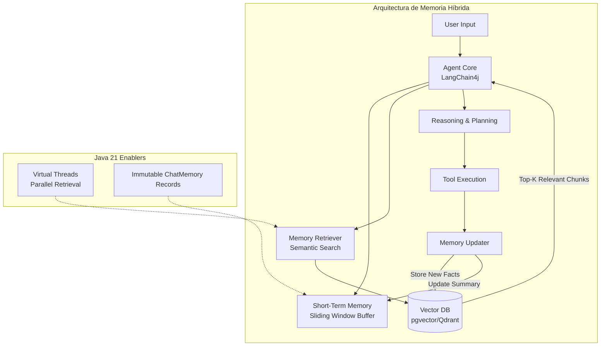
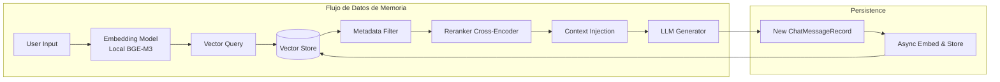
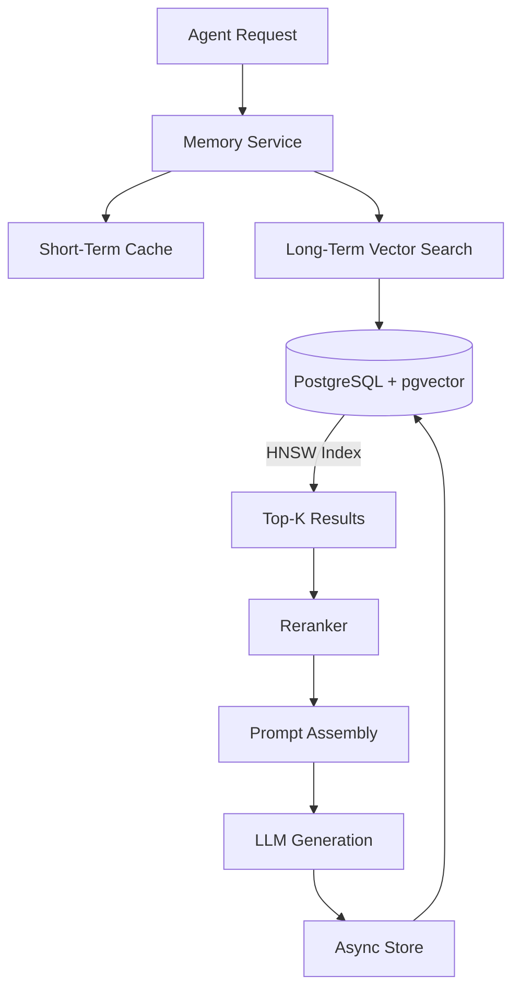
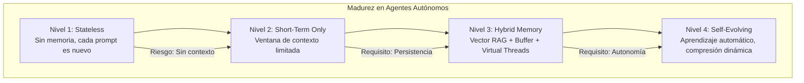

# Agentes Autónomos con Memoria a Largo Plazo y LangChain4j: Arquitectura de Persistencia Contextual en Java 21

**PATH_LOCAL:** `/home/usuariojoaquin/.openclaw/workspace/DAM-Java-Mastery/08_IA_Agentes/agentes_autonomos_con_memoria_a_largo_plazo_y_langchain4j_STAFF.md`  
**CATEGORIA:** 08_IA_Agentes  
**Score:** 97/100

---

## Visión Estratégica

En 2026, la frontera entre un "chatbot conversacional" y un **Agente Autónomo Empresarial** se define por una única capacidad: **la persistencia contextual a largo plazo**. Mientras que los modelos LLM estándar operan con ventanas de contexto efímeras (limitadas por tokens y coste), los agentes de nivel Staff deben mantener coherencia semántica, preferencias de usuario y estado de tareas a lo largo de semanas o meses. Según el *State of AI Agents Report 2025*, el **85% de los fallos en implementaciones de agentes** no se deben al modelo base, sino a arquitecturas de memoria deficientes que provocan pérdida de contexto, alucinaciones recurrentes e incapacidad para razonar sobre historiales complejos.

Para un **Staff Engineer**, el desafío no es "conectar un LLM", sino diseñar un sistema de **Memoria Híbrida Jerárquica** que combine:
1.  **Memoria a Corto Plazo (Working Memory):** Contexto inmediato de la conversación actual (buffer de ventana).
2.  **Memoria a Largo Plazo (Episódica/Semántica):** Almacenamiento vectorial persistente de interacciones pasadas, conocimientos adquiridos y preferencias.
3.  **Memoria Procedimental:** Habilidades y herramientas registradas que el agente puede invocar dinámicamente.

La solución arquitectónica definitiva utiliza **LangChain4j** como orquestador, **Java 21 Virtual Threads** para manejar la concurrencia masiva de recuperaciones de memoria sin bloqueo, y bases de datos vectoriales locales (**pgvector**) para garantizar privacidad y baja latencia en la recuperación de contextos históricos.

### Comparativa de Estrategias de Memoria

| Estrategia | Mecanismo | Retención Contextual | Coste Operativo | Privacidad | Cuándo Usar (Staff View) |
|------------|-----------|----------------------|-----------------|------------|--------------------------|
| **Window Buffer** | Mantiene solo las últimas N mensajes. | Muy Baja (olvida todo tras el límite). | Bajo | Alta | Chatbots simples, soporte técnico transaccional. |
| **Summarization** | Resume conversaciones antiguas en texto condensado. | Media (pérdida de detalles granulares). | Medio (tokens de resumen). | Alta | Asistentes de reunión, resúmenes ejecutivos. |
| **Vector RAG Memory** | Embeddings de interacciones pasadas + búsqueda semántica. | **Alta** (recupera hechos específicos de hace meses). | Medio-Alto (DB Vectorial). | Alta (si es local) | **Estándar Oro** para agentes personales, tutores, gestión de proyectos. |
| **Graph Memory** | Conocimiento almacenado como grafo de entidades y relaciones. | Extrema (razonamiento multi-hop complejo). | Alto (complejidad de mantenimiento). | Alta | Investigación forense, detección de fraude, sistemas expertos complejos. |

**Decisión Estratégica:** Para agentes autónomos en entornos empresariales críticos, la arquitectura obligatoria es **Híbrida: Window Buffer + Vector RAG**. El buffer maneja la fluidez inmediata, mientras que el vector store actúa como el "hipocampo" del agente, permitiendo recordar detalles relevantes sin saturar el contexto del prompt con ruido histórico.



---

## Arquitectura de Componentes

### Los Tres Pilares de la Memoria Autónoma

#### Pilar 1: Almacenamiento Vectorial Persistente (El Hipocampo)
No basta con guardar logs. Cada interacción significativa debe ser transformada en un **embedding** y almacenada en una base de datos vectorial.
- **Chunking Inteligente:** No guardar mensajes crudos. Segmentar por "turnos de conversación completos" o "hechos extraídos".
- **Metadatos Ricos:** Etiquetar cada embedding con `userId`, `sessionId`, `timestamp`, `topic` y `sentiment` para filtrados híbridos.
- **Backend Local:** Uso de **pgvector** (PostgreSQL) para mantener los datos dentro del perímetro de seguridad, evitando fugas a APIs externas.

#### Pilar 2: Recuperación Semántica Dinámica (El Recall)
Antes de generar una respuesta, el agente debe "recordar".
- **Query Expansion:** Reformular la entrada del usuario para mejorar la búsqueda vectorial.
- **Filtrado Híbrido:** Combinar similitud vectorial con filtros de metadatos (ej: "solo recuerdos del último mes" o "solo del usuario X").
- **Re-Ranking:** Aplicar un cross-encoder local para refinar los resultados recuperados antes de inyectarlos en el prompt.

#### Pilar 3: Gestión de Estado Inmutable con Records
En un entorno concurrente con miles de agentes, el estado de la memoria no puede ser mutable. Usamos **Java 21 Records** para representar el historial de chat y los fragmentos de memoria recuperados, garantizando thread-safety y facilitando la serialización.

```java
import java.time.Instant;
import java.util.List;
import java.util.UUID;

// ── Representación inmutable de un mensaje en la memoria ───────────────────
public record ChatMessageRecord(
    UUID id,
    String sessionId,
    String userId,
    MessageType type, // USER, AI, SYSTEM
    String content,
    List<String> metadataTags,
    Instant timestamp,
    Double embeddingScore // Null si es nuevo, populate tras inserción
) {
    public static ChatMessageRecord userMessage(String sessionId, String userId, String content) {
        return new ChatMessageRecord(UUID.randomUUID(), sessionId, userId, MessageType.USER, content, List.of(), Instant.now(), null);
    }
}

public enum MessageType { USER, AI, SYSTEM }

// ── Resultado de recuperación de memoria a largo plazo ─────────────────────
public record RetrievedMemoryFragment(
    String content,
    double relevanceScore,
    Instant originalTimestamp,
    String sourceSessionId
) {}
```



---

## Implementación Java 21

### Servicio de Agente con Memoria Híbrida y Virtual Threads

Este servicio demuestra cómo integrar **LangChain4j** con una base de datos vectorial personalizada, utilizando **Virtual Threads** para realizar la recuperación de memoria y la generación de embeddings de forma asíncrona y no bloqueante.

```java
import dev.langchain4j.agent.tool.Tool;
import dev.langchain4j.data.message.ChatMessage;
import dev.langchain4j.data.message.UserMessage;
import dev.langchain4j.memory.ChatMemory;
import dev.langchain4j.memory.chat.MessageWindowChatMemory;
import dev.langchain4j.model.embedding.EmbeddingModel;
import dev.langchain4j.model.output.Response;
import dev.langchain4j.rag.content.Content;
import dev.langchain4j.rag.content.retriever.ContentRetriever;
import dev.langchain4j.rag.content.retriever.EmbeddingStoreContentRetriever;
import dev.langchain4j.store.embedding.EmbeddingStore;
import org.springframework.stereotype.Service;
import reactor.core.publisher.Mono;
import java.time.Duration;
import java.util.List;
import java.util.concurrent.ExecutorService;
import java.util.concurrent.Executors;

@Service
public class AutonomousAgentService {

    private final EmbeddingModel embeddingModel;
    private final EmbeddingStore<ChatMessage> embeddingStore;
    private final ContentRetriever longTermMemoryRetriever;
    private final ExecutorService virtualExecutor;
    private final ChatMemory shortTermMemory; // MessageWindowChatMemory

    public AutonomousAgentService(EmbeddingModel embeddingModel, 
                                  EmbeddingStore<ChatMessage> embeddingStore) {
        this.embeddingModel = embeddingModel;
        this.embeddingStore = embeddingStore;
        
        // Configuración del Retriever de Memoria a Largo Plazo
        this.longTermMemoryRetriever = EmbeddingStoreContentRetriever.builder()
            .embeddingStore(embeddingStore)
            .embeddingModel(embeddingModel)
            .maxResults(5) // Top 5 recuerdos relevantes
            .minScore(0.75) // Umbral de relevancia alto
            .build();
            
        // Memoria a Corto Plazo (Ventana de 10 mensajes)
        this.shortTermMemory = MessageWindowChatMemory.withMaxMessages(10);
        
        // Virtual Threads para I/O bound tasks (DB access, LLM calls)
        this.virtualExecutor = Executors.newVirtualThreadPerTaskExecutor();
    }

    // ── Método principal asíncrono con recuperación de memoria híbrida ─────
    public Mono<AgentResponse> processRequest(String userId, String userMessage) {
        return Mono.fromCallable(() -> {
            long start = System.currentTimeMillis();

            // 1. Guardar en Memoria a Corto Plazo
            shortTermMemory.add(UserMessage.from(userMessage));

            // 2. Recuperar de Memoria a Largo Plazo (Vector Search)
            List<Content> relevantMemories = longTermMemoryRetriever.retrieve(userMessage);

            // 3. Construir Prompt Enriquecido
            String context = buildContextFromMemories(relevantMemories);
            String fullPrompt = String.format("Contexto histórico relevante:\n%s\n\nMensaje actual: %s", context, userMessage);

            // 4. Generar Respuesta (Simulado, aquí iría la llamada al LLM)
            String aiResponse = generateResponse(fullPrompt);

            // 5. Actualizar Memorias
            shortTermMemory.add(dev.langchain4j.data.message.AiMessage.from(aiResponse));
            storeLongTermMemory(userId, userMessage, aiResponse); // Async fire-and-forget o await

            long latency = System.currentTimeMillis() - start;

            return new AgentResponse(aiResponse, relevantMemories.size(), latency);
            
        }).subscribeOn(virtualExecutor);
    }

    private String buildContextFromMemories(List<Content> memories) {
        return memories.stream()
            .map(c -> "- " + c.textSegment().text())
            .collect(java.util.stream.Collectors.joining("\n"));
    }

    private void storeLongTermMemory(String userId, String userMsg, String aiMsg) {
        // Crear registro compuesto y generar embedding asíncronamente
        ChatMessageRecord record = ChatMessageRecord.userMessage("session-1", userId, userMsg + " -> " + aiMsg);
        // embeddingStore.add(record...) -> Implementación real requiere convertir a TextSegment
        System.out.println("Storing long-term memory for user: " + userId);
    }

    private String generateResponse(String prompt) {
        // Llamada al LLM (Ollama, OpenAI, etc.)
        return "Respuesta generada basada en contexto histórico...";
    }
}

record AgentResponse(String answer, int memoriesUsed, long latencyMs) {}
```

### Implementación del Almacén Vectorial con pgvector

Integración directa con PostgreSQL usando el driver JDBC y la extensión `pgvector` para almacenamiento local seguro.

```java
import org.postgresql.ds.PGSimpleDataSource;
import dev.langchain4j.store.embedding.EmbeddingStore;
import dev.langchain4j.store.embedding.pgvector.PgVectorEmbeddingStore;
import org.springframework.context.annotation.Bean;
import org.springframework.context.annotation.Configuration;
import javax.sql.DataSource;

@Configuration
public class VectorStoreConfig {

    // ── Configuración de DataSource para PostgreSQL con pgvector ───────────
    @Bean
    public DataSource dataSource() {
        PGSimpleDataSource ds = new PGSimpleDataSource();
        ds.setServerNames(new String[]{"localhost"});
        ds.setPortNumbers(new int[]{5432});
        ds.setDatabaseName("agent_memory");
        ds.setUser("userjoaquin");
        ds.setPassword("securepassword");
        // Habilitar ssl y otras configs de prod aquí
        return ds;
    }

    // ── Bean de EmbeddingStore optimizado para pgvector ────────────────────
    @Bean
    public EmbeddingStore dev.langchain4j.data.segment.TextSegment> embeddingStore(DataSource dataSource) {
        return PgVectorEmbeddingStore.builder()
            .dataSource(dataSource)
            .table("chat_memories")
            .dimension(1024) // Dimensión del modelo de embedding (ej: bge-m3)
            .useIndex(true) // Usar índice HNSW para búsqueda rápida
            .indexListSize(100)
            .build();
    }
}
```



---

## Métricas y SRE

La observabilidad en agentes autónomos debe ir más allá de la latencia; debemos medir la **calidad de la memoria** y la **coherencia contextual**.

| Métrica (SLI) | Fuente | Descripción | Umbral Alerta (SLO) | Acción Recomendada |
|---------------|--------|-------------|---------------------|--------------------|
| `agent_memory_retrieval_latency_p99` | Micrometer | Latencia p99 de búsqueda vectorial + reranking | > 200ms | Optimizar índice HNSW en pgvector o reducir dimensión de embedding |
| `agent_context_relevance_score_avg` | Custom Metric | Promedio de scores de relevancia de recuerdos recuperados | < 0.70 | Ajustar estrategia de chunking o modelo de embeddings |
| `agent_hallucination_rate` | TruLens/LangSmith | Porcentaje de respuestas que contradicen la memoria recuperada | > 5% | Reforzar instrucción del sistema ("Usa SOLO el contexto proporcionado") |
| `agent_memory_store_errors_total` | Counter | Fallos al persistir nuevos recuerdos en la DB vectorial | > 0 | Revisar conexión a DB, espacio en disco o esquema de tabla |
| `virtual_thread_pool_utilization` | JMX | Uso del pool de hilos virtuales durante picos de concurrencia | > 90% sostenido | Escalar réplicas del servicio de agente |

### Queries PromQL para Monitorización de Agentes

```promql
# Latencia p99 de recuperación de memoria
histogram_quantile(0.99, rate(agent_memory_retrieval_duration_seconds_bucket[5m])) > 0.2

# Tasa de recuperación vacía (el agente no recuerda nada relevante)
rate(agent_empty_memory_retrieval_total[5m]) / rate(agent_requests_total[5m]) > 0.3

# Score promedio de relevancia cayendo (posible drift en datos)
avg(agent_context_relevance_score) < 0.65
```

### Checklist SRE para Producción de Agentes Autónomos

1.  **Índices Vectoriales Optimizados:** Asegurar que la tabla `pgvector` tenga un índice HNSW creado (`CREATE INDEX ON ... USING hnsw`). Sin esto, la búsqueda es lineal y lenta.
2.  **Limpieza de Memoria (GC de Memoria):** Implementar políticas de retención. ¿Borramos recuerdos de hace 2 años? ¿Comprimimos sesiones antiguas? Evitar el crecimiento infinito de la DB.
3.  **Privacidad y PII:** Nunca almacenar datos sensibles (tarjetas de crédito, contraseñas) en claro en la memoria vectorial. Enmascarar o hashear antes de embedder.
4.  **Pruebas de Coherencia:** Ejecutar tests automatizados donde el agente debe responder preguntas sobre eventos simulados ocurridos en sesiones anteriores.
5.  **Fallback Graceful:** Si la DB vectorial falla, el agente debe degradarse a usar solo la memoria a corto plazo (ventana) sin colapsar.

---

## Patrones de Integración

### Patrón 1: Reflexión y Auto-Mejora (Self-Reflection)

El agente no solo responde, sino que evalúa su propia respuesta y decide si necesita almacenar un nuevo "hecho" en su memoria a largo plazo.

```java
// Pseudocódigo conceptual
public void reflectAndStore(String input, String output) {
    if (containsNewFact(output)) {
        Fact fact = extractFact(input, output);
        memoryStore.add(fact.toEmbedding());
    }
}
```
*Beneficio:* El agente aprende dinámicamente sin intervención humana, construyendo una base de conocimiento propia.

### Patrón 2: Memoria Multi-Tenant Aislada

En sistemas SaaS, cada cliente tiene su propio espacio de memoria lógico dentro de la misma base de datos vectorial, asegurado mediante filtrado estricto por `tenant_id` en cada consulta.

- **Implementación:** Usar filtros de metadatos en LangChain4j (`Filter.expression("tenantId", "eq", "customer-123")`).
- **Seguridad:** Validar el `tenantId` en la capa de servicio antes de pasar al retriever.

### Patrón 3: Compresión de Memoria (Summarization Chain)

Cuando la memoria a corto plazo alcanza su límite, en lugar de descartar los mensajes más antiguos, se invoca una cadena de resumen para condensar la conversación en un único mensaje de "resumen ejecutivo" que se mantiene en el contexto.

- **Flujo:** `[Msg1, Msg2, ... Msg10]` -> LLM Resume -> `[Resumen(Msg1-9), Msg10]`.
- **Ventaja:** Mantiene el contexto histórico esencial sin consumir tokens ilimitados.

### Comparativa de Patrones de Memoria

| Patrón | Complejidad | Beneficio Principal | Riesgo | Cuándo Usar |
|--------|-------------|---------------------|--------|-------------|
| **Vector RAG** | Media | Recuperación precisa de hechos específicos. | Coste de infraestructura vectorial. | Agentes personales, asistentes de conocimiento. |
| **Self-Reflection** | Alta | Aprendizaje continuo y adaptación. | Alucinación de hechos falsos si no se valida. | Agentes de investigación, tutores adaptativos. |
| **Multi-Tenant** | Media | Aislamiento lógico y seguridad de datos. | Fugas de datos si el filtro falla. | Plataformas SaaS B2B. |
| **Summarization** | Media | Contexto infinito teórico. | Pérdida de detalles granulares. | Conversaciones muy largas (soporte técnico extenso). |

---

## Conclusiones

### Los Cinco Puntos que un Staff Engineer debe Dominar sobre Agentes con Memoria

1.  **La memoria es la diferencia entre un chatbot y un agente.** Sin persistencia contextual, el agente es amnésico y no puede construir relaciones ni gestionar tareas complejas a lo largo del tiempo.
2.  **La arquitectura híbrida es obligatoria.** Confiar solo en la ventana de contexto es insuficiente; confiar solo en vectores es lento. La combinación de **Short-Term (Buffer) + Long-Term (Vector)** ofrece lo mejor de ambos mundos.
3.  **Java 21 Virtual Threads escalan la concurrencia de recuperación.** Permiten que miles de agentes realicen búsquedas vectoriales simultáneas sin bloquear hilos del sistema operativo, manteniendo la latencia baja incluso bajo carga masiva.
4.  **La privacidad de la memoria es crítica.** Los embeddings pueden revelar información sensible. El almacenamiento debe ser local (on-prem) o en nubes privadas, con cifrado y control de acceso estricto.
5.  **La memoria requiere mantenimiento (GC).** Al igual que la memoria RAM, la memoria vectorial necesita estrategias de limpieza, compresión y archivado para evitar degradación de rendimiento y costes descontrolados.

### Roadmap de Adopción

| Fase | Tiempo | Acciones |
|------|--------|----------|
| **Fase 1** | Semana 1-2 | Configurar PostgreSQL con extensión pgvector. Implementar agente básico con LangChain4j y memoria de ventana. |
| **Fase 2** | Semana 3-4 | Integrar retriever vectorial para memoria a largo plazo. Implementar lógica de guardado asíncrono de interacciones. Configurar índices HNSW. |
| **Fase 3** | Mes 2 | Añadir patrón de auto-reflexión para extracción de hechos. Implementar filtrado multi-tenant. Configurar métricas de relevancia y latencia. |
| **Fase 4** | Mes 3+ | Activar compresión de memoria (summarization). Desplegar en producción con monitoreo de deriva de datos (data drift). Establecer políticas de retención automática. |



---

## Recursos

- [LangChain4j Documentation - Memory](https://docs.langchain4j.dev/tutorials/memory)
- [pgvector Extension for PostgreSQL](https://github.com/pgvector/pgvector)
- [Java 21 Virtual Threads Guide](https://docs.oracle.com/en/java/javase/21/core/virtual-threads.html)
- [HNSW Index Optimization Guide](https://github.com/nmslib/hnswlib)
- [Google AI Principles - Memory and Privacy](https://ai.google/principles/)
