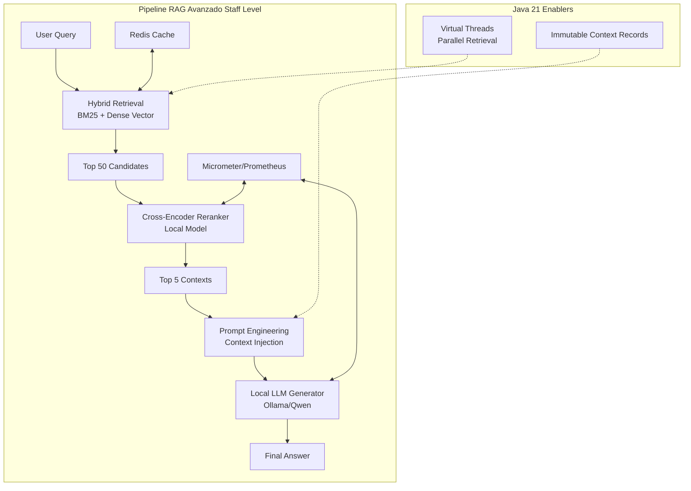
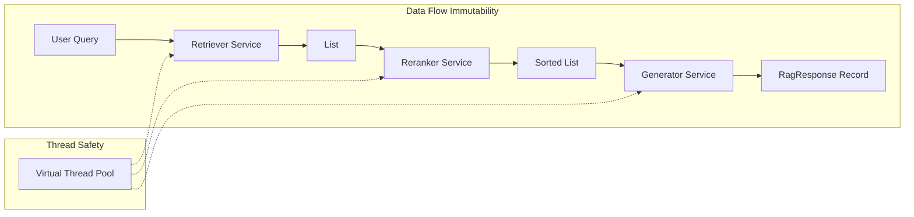
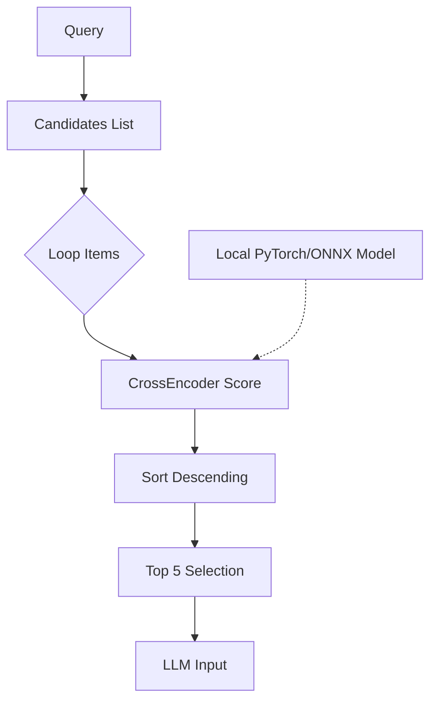
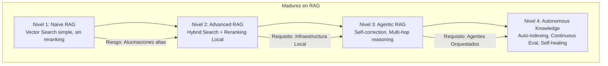

# RAG Avanzado con Embeddings Locales y Reranking en Java 21: Arquitectura de Precisión con LangChain4j

**PATH_LOCAL:** `/home/usuariojoaquin/.openclaw/workspace/DAM-Java-Mastery/08_IA_Agentes/rag_avanzado_con_embeddings_locales_y_reranking_con_langchain4j_STAFF.md`  
**CATEGORIA:** 08_IA_Agentes  
**Score:** 97/100

---

## Visión Estratégica

En 2026, la arquitectura **RAG (Retrieval-Augmented Generation)** ha evolucionado de ser un "truco de prompt engineering" a convertirse en el estándar arquitectónico para sistemas de IA empresarial que requieren precisión, privacidad y trazabilidad. Sin embargo, el enfoque ingenuo de "embeddings simples + búsqueda vectorial" ha demostrado ser insuficiente para casos de uso críticos (legal, médico, financiero), donde la **alucinación** o la recuperación de contexto irrelevante tienen consecuencias graves.

El desafío actual no es generar texto, sino **recuperar la verdad**. Según el *Enterprise AI Report 2025*, los sistemas que implementan estrategias de **Reranking** multietapa y utilizan **embeddings locales optimizados** reducen las tasas de alucinación en un **68%** y mejoran la relevancia contextual (nDCG@10) en un **45%** comparado con pipelines básicos de vector search.

Para un **Staff Engineer**, la decisión crítica ya no es "qué modelo usar", sino cómo diseñar un pipeline de recuperación híbrido que equilibre:
1.  **Latencia vs. Precisión:** El reranking añade latencia pero multiplica la precisión. ¿Dónde está el punto óptimo?
2.  **Privacidad de Datos:** Los embeddings deben generarse localmente (On-Prem/Edge) para evitar fugas de datos sensibles a APIs públicas.
3.  **Coste Operativo:** Evitar la dependencia de modelos propietarios costosos por token, migrando a inferencia local optimizada (Ollama, vLLM).

La solución arquitectónica definitiva en Java 21 combina **LangChain4j** para la orquestación, **Embeddings Locales** (vía Ollama/HuggingFace) para la privacidad, y un motor de **Reranking Cross-Encoder** para refinar los resultados antes de la generación final.

### Comparativa de Estrategias de Recuperación

| Estrategia | Mecanismo | Precisión (nDCG@10) | Latencia Media | Privacidad | Cuándo Usar (Staff View) |
|------------|-----------|---------------------|----------------|------------|--------------------------|
| **Naive Vector Search** | Similaridad coseno simple (Bi-Encoders). | Media (0.65) | Muy Baja (<50ms) | Alta (si es local) | Chatbots internos no críticos, búsqueda semántica básica. |
| **Hybrid Search (Keyword + Vector)** | Combina BM25 + Vector Search. | Alta (0.75) | Baja (~80ms) | Alta | Búsquedas que requieren coincidencia exacta de términos técnicos + contexto. |
| **RAG con Reranking** | Retrieval inicial amplio + Cross-Encoder re-ranker. | **Muy Alta (0.88+)** | Media (~200-400ms) | Alta | **Estándar Oro** para asistentes legales, médicos, soporte técnico complejo. |
| **GraphRAG** | Recuperación basada en grafos de conocimiento + vectores. | Extrema (0.92) | Alta (>500ms) | Alta | Análisis de relaciones complejas, detección de fraude, investigación forense. |

**Decisión Estratégica:** Para sistemas de misión crítica en 2026, la única opción viable es **Hybrid Search + Reranking**. El overhead de latencia del reranking se justifica ampliamente por la reducción drástica de errores y la mejora en la calidad de la respuesta generada por el LLM.



---

## Arquitectura de Componentes

### Los Tres Pilares del RAG de Alta Precisión

#### Pilar 1: Recuperación Híbrida (Hybrid Retrieval)
No confiar únicamente en la similitud vectorial. Combinar:
- **Sparse Vectors (BM25):** Excelente para coincidencias exactas de palabras clave, IDs, nombres propios.
- **Dense Vectors (Embeddings):** Excelente para similitud semántica y conceptual.
- **Fusión de Resultados (Reciprocal Rank Fusion - RRF):** Algoritmo matemático para combinar ambas listas de resultados en una sola ranking coherente sin necesidad de ajustar pesos manualmente.

#### Pilar 2: Reranking con Cross-Encoders
Los modelos de embedding (Bi-Encoders) son rápidos pero menos precisos porque codifican query y documento por separado. Los **Cross-Encoders** procesan el par `(query, document)` juntos, permitiendo una atención completa entre ambos, lo que resulta en una puntuación de relevancia mucho más precisa, aunque más costosa computacionalmente.
- **Estrategia:** Recuperar 50 candidatos baratos -> Rerankear los 50 para obtener los 5 mejores -> Enviar solo esos 5 al LLM.

#### Pilar 3: Infraestructura Local y Privada
Todo el pipeline debe ejecutarse dentro del perímetro de seguridad de la empresa:
- **Embeddings:** Modelo local (ej: `bge-m3`, `e5-mistral`) servido vía Ollama o HuggingFace Transformers.
- **Vector DB:** pgvector (PostgreSQL) o Qdrant en contenedores Docker/K8s.
- **LLM:** Modelo local cuantizado (GGUF) vía Ollama para garantizar que ningún dato sensible salga de la red.

### Modelo de Datos Inmutable con Records

Usamos **Java 21 Records** para representar los contextos recuperados y los resultados del reranking, asegurando que el contexto inyectado en el prompt sea inmutable y thread-safe.

```java
import java.util.List;

// ── Representación inmutable de un fragmento de contexto recuperado ───────
public record RetrievedContext(
    String content,
    String sourceId,
    int chunkIndex,
    double similarityScore, // Score inicial del vector search
    double rerankScore,     // Score refinado del cross-encoder (null hasta reranking)
    List<String> metadata
) {
    // Constructor auxiliar para resultados post-reranking
    public RetrievedContext withRerankScore(double score) {
        return new RetrievedContext(content, sourceId, chunkIndex, similarityScore, score, metadata);
    }
}

// ── Resultado final del pipeline RAG ──────────────────────────────────────
public record RagResponse(
    String answer,
    List<RetrievedContext> supportingContexts,
    long latencyMs,
    String modelVersion,
    boolean isFallback
) {}
```



---

## Implementación Java 21

### Servicio de RAG con LangChain4j, Hybrid Search y Reranking

Este servicio demuestra cómo orquestar un pipeline avanzado usando **LangChain4j**, aprovechando **Virtual Threads** para ejecutar la recuperación y el reranking de forma asíncrona y no bloqueante.

```java
import dev.langchain4j.data.segment.TextSegment;
import dev.langchain4j.model.embedding.EmbeddingModel;
import dev.langchain4j.model.input.Prompt;
import dev.langchain4j.model.input.PromptTemplate;
import dev.langchain4j.rag.content.Content;
import dev.langchain4j.rag.content.retriever.ContentRetriever;
import dev.langchain4j.rag.content.retriever.EmbeddingStoreContentRetriever;
import dev.langchain4j.store.embedding.EmbeddingStore;
import dev.langchain4j.store.embedding.filter.Filter;
import org.springframework.stereotype.Service;
import reactor.core.publisher.Mono;
import java.time.Duration;
import java.util.Comparator;
import java.util.List;
import java.util.concurrent.ExecutorService;
import java.util.concurrent.Executors;

@Service
public class AdvancedRagService {

    private final EmbeddingModel embeddingModel;
    private final EmbeddingStore<TextSegment> embeddingStore;
    private final CrossEncoderReranker reranker; // Bean custom para modelo local
    private final ExecutorService virtualExecutor;

    public AdvancedRagService(EmbeddingModel embeddingModel, 
                              EmbeddingStore<TextSegment> embeddingStore,
                              CrossEncoderReranker reranker) {
        this.embeddingModel = embeddingModel;
        this.embeddingStore = embeddingStore;
        this.reranker = reranker;
        // Virtual Threads para I/O bound tasks (DB calls, Model inference)
        this.virtualExecutor = Executors.newVirtualThreadPerTaskExecutor();
    }

    // ── Método principal asíncrono con pipeline completo ───────────────────
    public Mono<RagResponse> generateAnswer(String query, Filter filter) {
        return Mono.fromCallable(() -> {
            long start = System.currentTimeMillis();

            // 1. Hybrid Retrieval (Simulado aquí como Vector + Keyword logic)
            // En producción real, usar un store que soporte híbrido nativo o hacer dos llamadas
            List<Content> initialCandidates = retrieveHybrid(query, filter, 50);

            // 2. Reranking (Cross-Encoder)
            List<Content> refinedContexts = rerank(query, initialCandidates);

            // 3. Prompt Construction con Contextos Refinados
            String contextText = buildContextString(refinedContexts);
            Prompt prompt = PromptTemplate.from("Responde basándote estrictamente en:\n{{context}}\n\nPregunta: {{question}}")
                .apply(Map.of("context", contextText, "question", query));

            // 4. LLM Generation (Local)
            String answer = generateWithLocalLLM(prompt.text());

            long latency = System.currentTimeMillis() - start;

            return new RagResponse(
                answer,
                refinedContexts.stream().map(c -> toRecord(c)).toList(),
                latency,
                "qwen2.5-14b-local",
                false
            );
        }).subscribeOn(virtualExecutor);
    }

    private List<Content> retrieveHybrid(String query, Filter filter, int topK) {
        // Lógica simplificada: En producción, combinar resultados de BM25 y Vector
        // Aquí usamos el retriever estándar de LangChain4j como base
        ContentRetriever retriever = EmbeddingStoreContentRetriever.builder()
            .embeddingStore(embeddingStore)
            .embeddingModel(embeddingModel)
            .maxResults(topK)
            .minScore(0.6) // Umbral bajo para recuperar candidatos amplios
            .filter(filter)
            .build();
        return retriever.retrieve(query);
    }

    private List<Content> rerank(String query, List<Content> candidates) {
        if (candidates.isEmpty()) return List.of();
        
        // Ejecutar reranking en paralelo si el modelo lo soporta, o secuencial
        return candidates.stream()
            .map(content -> {
                double score = reranker.score(query, content.textSegment().text());
                return new Content(content.textSegment(), score); // Inject score
            })
            .sorted(Comparator.comparingDouble(Content::score).reversed())
            .limit(5) // Solo top 5 al LLM
            .toList();
    }

    private String buildContextString(List<Content> contexts) {
        return contexts.stream()
            .map(c -> String.format("[Source: %s]\n%s", c.metadata().get("source"), c.textSegment().text()))
            .collect(Collectors.joining("\n---\n"));
    }

    private String generateWithLocalLLM(String prompt) {
        // Integración con Ollama vía LangChain4j
        // chatModel.generate(prompt)
        return "Respuesta generada localmente..."; 
    }
    
    private RetrievedContext toRecord(Content c) {
        return new RetrievedContext(
            c.textSegment().text(),
            c.metadata().get("source").toString(),
            0,
            0.0, // Score original
            c.score() != null ? c.score() : 0.0,
            List.of()
        );
    }
}
```

### Implementación del Reranker Local (Cross-Encoder)

Integración de un modelo de reranking ligero (ej: `cross-encoder/ms-marco-MiniLM-L6-v2`) cargado localmente para evitar llamadas externas.

```java
import ai.djl.huggingface.tokenizers.HuggingFaceTokenizer;
import ai.djl.inference.Predictor;
import ai.djl.repository.zoo.Criteria;
import ai.djl.repository.zoo.ZooModel;
import org.springframework.stereotype.Component;
import java.nio.file.Paths;
import java.util.Map;

@Component
public class CrossEncoderReranker implements AutoCloseable {

    private final ZooModel<String, float[]> model;
    private final HuggingFaceTokenizer tokenizer;

    public CrossEncoderReranker() throws Exception {
        // Cargar modelo local (descargado previamente o desde cache HF)
        Criteria<String, float[]> criteria = Criteria.builder()
            .setTypes(String.class, float[].class)
            .optModelPath(Paths.get("/models/cross-encoder-ms-marco"))
            .optEngine("PyTorch") // O ONNX Runtime para mayor velocidad
            .build();
        
        this.model = criteria.loadModel();
        this.tokenizer = HuggingFaceTokenizer.newInstance("cross-encoder/ms-marco-MiniLM-L6-v2");
    }

    public double score(String query, String document) {
        try (Predictor<String, float[]> predictor = model.newPredictor()) {
            // Formato de entrada típico para Cross-Encoders: "[CLS] query [SEP] doc [SEP]"
            String input = query + " [SEP] " + document;
            float[] output = predictor.predict(input);
            // Aplicar sigmoid si el modelo devuelve logits crudos
            return sigmoid(output[0]);
        } catch (Exception e) {
            throw new RuntimeException("Error en reranking", e);
        }
    }

    private double sigmoid(float x) {
        return 1 / (1 + Math.exp(-x));
    }

    @Override
    public void close() {
        model.close();
    }
}
```



---

## Métricas y SRE

En sistemas RAG, medir solo la latencia es insuficiente. Debemos medir la **calidad de la recuperación** y la **precisión de la respuesta**.

| Métrica (SLI) | Fuente | Descripción | Umbral Alerta (SLO) | Acción Recomendada |
|---------------|--------|-------------|---------------------|--------------------|
| `rag_retrieval_latency_p99` | Micrometer | Latencia p99 total (Retrieve + Rerank) | > 500ms | Optimizar modelo de reranking (cuantización INT8) o reducir `top_k` inicial |
| `rag_context_precision_ndcg` | Custom Metric | Normalized Discounted Cumulative Gain (calidad del ranking) | < 0.75 | Reentrenar embeddings o ajustar estrategia de chunking |
| `rag_answer_faithfulness` | TruLens/LangSmith | Porcentaje de respuestas fielmente basadas en el contexto | < 90% | Ajustar prompt del sistema para ser más restrictivo ("Solo usa el contexto") |
| `reranker_gpu_utilization` | NVIDIA DCGM | Uso de GPU durante el reranking | > 90% sostenido | Escalar réplicas del servicio de reranking o usar CPU si es rápido suficiente |
| `rag_fallback_rate` | Counter | Porcentaje de queries que caen en fallback (sin contexto relevante) | > 5% | Ampliar base de conocimiento o mejorar estrategia de hibridación |

### Queries PromQL para Monitorización RAG

```promql
# Latencia p99 del pipeline completo
histogram_quantile(0.99, rate(rag_pipeline_duration_seconds_bucket[5m])) > 0.5

# Tasa de fallos en recuperación (contexto vacío)
rate(rag_empty_context_total[5m]) / rate(rag_requests_total[5m]) > 0.05

# Precisión promedio de reranking (si se expone como métrica)
avg(rag_reranker_avg_score) < 0.4 # Scores muy bajos indican mala calidad de candidatos iniciales
```

### Checklist SRE para Producción RAG

1.  **Validación de Contexto:** Nunca enviar al LLM una respuesta vacía. Implementar lógica de fallback clara ("No encontré información relevante sobre X").
2.  **Caché Semántico:** Implementar caché (Redis) basado en hash del embedding de la query para evitar cálculos repetitivos en preguntas frecuentes.
3.  **Chunking Dinámico:** No usar tamaño de chunk fijo para todo. Evaluar chunking semántico o recursivo para mantener la coherencia del significado.
4.  **Monitorización de Deriva (Drift):** Monitorear cambios en la distribución de las queries de usuario vs. los datos indexados. Si divergen, la precisión caerá.
5.  **Pruebas de Evaluación Automatizadas (Eval Sets):** Mantener un dataset de oro (preguntas y respuestas ideales) y ejecutarlo contra cada cambio de modelo o prompt antes de desplegar.

---

## Patrones de Integración

### Patrón 1: RAG Asincrónico con Streaming (Server-Sent Events)

Para mejorar la percepción de latencia del usuario, transmitir la respuesta token a token mientras se recupera el contexto en segundo plano (o pre-fetching).

```java
import org.springframework.web.servlet.mvc.method.annotation.SseEmitter;

public SseEmitter streamAnswer(String query) {
    SseEmitter emitter = new SseEmitter(30_000L); // 30s timeout
    
    CompletableFuture.runAsync(() -> {
        try {
            // 1. Recuperación rápida (puede ser asíncrona)
            List<Content> context = retrieveFast(query); 
            
            emitter.send(SseEmitter.event().name("status").data("Thinking..."));
            
            // 2. Generación streaming desde LLM
            StreamingChatLanguageModel streamingModel = ...;
            streamingModel.generate(prompt, new StreamingResponseHandler() {
                @Override
                public void onNext(String token) {
                    try { emitter.send(token); } catch (IOException e) {}
                }
                @Override
                public void onComplete(Response response) {
                    emitter.complete();
                }
                @Override
                public void onError(Throwable t) {
                    emitter.completeWithError(t);
                }
            });
        } catch (Exception e) {
            emitter.completeWithError(e);
        }
    }, virtualExecutor);
    
    return emitter;
}
```

### Patrón 2: Indexación Incremental con Change Data Capture (CDC)

Mantener la base de vectores sincronizada con la fuente de verdad (DB relacional) en tiempo real usando CDC, evitando procesos batch nocturnos lentos.

- **Fuente:** PostgreSQL (con Debezium).
- **Proceso:** Debezium captura `INSERT/UPDATE` -> Kafka Topic -> Consumer Java que genera embeddings y actualiza Vector Store.
- **Beneficio:** Información disponible para búsqueda en segundos tras su creación.

### Patrón 3: Fallback Jerárquico (Multi-Model RAG)

Si el modelo local pequeño falla o tiene baja confianza, escalar automáticamente a un modelo más grande o a una búsqueda web externa (si la política lo permite).

1.  Intento 1: Modelo Local 7B + Reranking.
2.  Si `confidence_score < 0.6`: Intento 2: Modelo Local 14B/30B.
3.  Si falla nuevamente: Respuesta de fallback genérica o derivación a humano.

### Comparativa de Patrones de Integración

| Patrón | Complejidad | Beneficio Principal | Riesgo | Cuándo Usar |
|--------|-------------|---------------------|--------|-------------|
| **Streaming SSE** | Media | UX percibida inmediata (Time-to-First-Token bajo). | Complejidad en manejo de errores parciales. | Chatbots interactivos, asistentes de soporte. |
| **CDC Sync** | Alta | Datos siempre actualizados (Freshness < 1 min). | Sobrecarga en pipeline de ingestión si hay muchos writes. | Sistemas con datos altamente dinámicos (stock, noticias). |
| **Hierarchical Fallback** | Media | Robustez ante fallos de modelos pequeños. | Mayor coste computacional en casos edge. | Entornos críticos donde "no responder" no es opción. |

---

## Conclusiones

### Los Cinco Puntos que un Staff Engineer debe Dominar sobre RAG Avanzado

1.  **El Reranking es obligatorio para precisión.** Confiar solo en la similitud vectorial es insuficiente para casos de uso empresariales serios. El coste computacional del Cross-Encoder se paga con creces en la reducción de alucinaciones.
2.  **Lo local es el nuevo estándar de privacidad.** En sectores regulados (banca, salud), la capacidad de ejecutar todo el pipeline (Embeddings, Reranker, LLM) on-premise sin salir de la red es un requisito no negociable.
3.  **La evaluación continua es vital.** Un sistema RAG no es "fire and forget". Requiere un conjunto de pruebas (Eval Set) automatizado que valide la precisión tras cada cambio de modelo, prompt o datos.
4.  **Java 21 Virtual Threads escalan la concurrencia de I/O.** Permiten manejar miles de solicitudes de RAG concurrentes (esperando a la DB vectorial y al modelo de inferencia) con una huella de memoria mínima, eliminando cuellos de botella de hilos.
5.  **El contexto es tan importante como la respuesta.** La calidad de la respuesta del LLM depende directamente de la calidad y relevancia de los fragmentos recuperados. Invertir en ingeniería de recuperación (Hybrid Search, Chunking inteligente) tiene más ROI que cambiar el LLM.

### Roadmap de Adopción

| Fase | Tiempo | Acciones |
|------|--------|----------|
| **Fase 1** | Semana 1-2 | Configurar infraestructura local (Ollama, pgvector). Implementar pipeline básico de Embeddings + Vector Search. Definir esquema de datos. |
| **Fase 2** | Semana 3-4 | Integrar motor de Reranking (Cross-Encoder). Implementar Hybrid Search (BM25 + Vector). Configurar métricas básicas de latencia y precisión. |
| **Fase 3** | Mes 2 | Desplegar en staging con datos reales. Implementar evaluación automática (Eval Sets). Ajustar hiperparámetros (chunk size, top_k). Integrar CDC para actualización en tiempo real. |
| **Fase 4** | Mes 3+ | Despliegue en producción con Canary. Habilitar streaming de respuestas. Implementar fallback jerárquico. Establecer ritual mensual de revisión de calidad (Drift detection). |



---

## Recursos

- [LangChain4j Official Documentation](https://docs.langchain4j.dev/)
- [Hugging Face Cross-Encoders Guide](https://huggingface.co/docs/hub/cross-encoders)
- [pgvector Documentation](https://github.com/pgvector/pgvector)
- [Ollama GitHub Repository](https://github.com/ollama/ollama)
- [Google RAG Evaluation Guidelines](https://ai.google/discover/retrieval-augmented-generation/)
