# Informe de Autoridad: Sistemas Multi-Agente con LangChain4j y Ollama

## Introducción a los Sistemas Multi-Agente

### Introducción a los Sistemas Multi-Agente

Los sistemas multi-agente son una clase de arquitecturas distribuidas que utilizan múltiples entidades autónomas, conocidas como agentes, para resolver problemas complejos. Estos sistemas se caracterizan por la interacción y cooperación entre agentes individuales con el objetivo común de lograr metas específicas en un ambiente compartido.

En esta sección, exploraremos cómo implementar y configurar sistemas multi-agente utilizando las bibliotecas `langchain4j` y `Ollama`. Estos frameworks permiten la creación de agentes inteligentes que pueden interactuar entre sí y con el entorno para resolver tareas complejas. Las últimas versiones (1.13.0-SNAPSHOT y 1.13.0-beta23) proporcionan mejoras significativas en términos de rendimiento y funcionalidad.

#### Arquitectura Básica de un Sistema Multi-Agente

Un sistema multi-agente típico consta de varios agentes que interactúan entre sí a través de canales comunes. Cada agente tiene capacidades específicas para resolver partes del problema global, y el sistema completo es capaz de adaptarse dinámicamente en función de las condiciones ambientales.

La arquitectura general puede ser representada mediante un diagrama Mermaid como sigue:

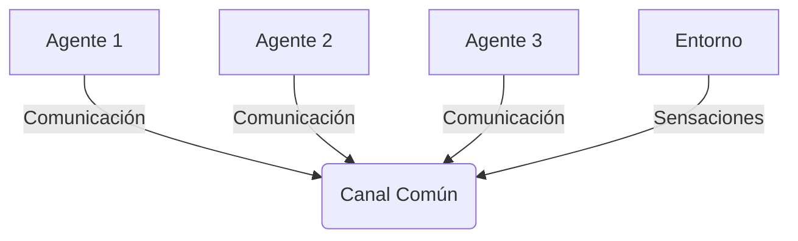

#### Implementación con LangChain4j y Ollama

La implementación de sistemas multi-agente requiere la creación de agentes individuales y su integración en un sistema cohesivo. Utilizando `langchain4j` para crear modelos de chat ficticios y `Ollama` para gestionar las interacciones, podemos demostrar cómo esto se hace.

Primero, importamos la clase `GenericFakeChatModel` desde `langchain_core.language_models.fake_chat_models`. Esta clase permite simular respuestas simples basadas en un diccionario de ejemplos:

```java
import langchain_core.language_models.fake_chat_models.GenericFakeChatModel;
```

La siguiente función `respond` se encarga de proporcionar una respuesta basada en la entrada del usuario. En este caso, es simplemente un ejemplo para ilustrar cómo funciona el sistema.

```java
public static String respond(String msgs) {
    Map<String, String> examples = new HashMap<>();
    examples.put("Hello", "Hi there!");
    examples.put("Ping", "Pong.");
    examples.put("Bye", "Goodbye!");

    return examples.getOrDefault(msgs, "OK.");
}
```

Luego, creamos una instancia del modelo de chat falso y la probamos:

```java
GenericFakeChatModel model = new GenericFakeChatModel(respond);
System.out.println(model.invoke("Hello").getContent());
```

Este código básico demuestra cómo los agentes pueden interactuar entre sí utilizando `langchain4j`. La clase `AgentEvals` de LangChain proporciona un marco para evaluar la eficacia y el rendimiento del sistema multi-agente, permitiendo a los desarrolladores probar escenarios complejos.

#### Integración de Pruebas

Después de verificar que todos los componentes individuales funcionen correctamente, es fundamental asegurarse de que estos componentes trabajen juntos en un entorno real. LangChain proporciona una herramienta llamada `AgentEvals` para este propósito. Este marco permite evaluar la trayectoria de las acciones del agente a lo largo del tiempo, garantizando así su cohesión y eficiencia en el contexto global.

#### Conclusion

Los sistemas multi-agente representan un enfoque poderoso para abordar problemas complejos que requieren adaptabilidad y cooperación. Utilizar `langchain4j` y `Ollama` proporciona una plataforma sólida para la creación de estos sistemas, permitiendo a los desarrolladores crear agentes inteligentes y resilientes.

## Configuración Inicial de LangChain4j y Ollama

### Configuración Inicial de LangChain4j y Ollama

Para configurar correctamente el entorno para trabajar con **LangChain4j** y **Ollama**, es crucial asegurar que todos los componentes estén actualizados a las versiones más recientes. En este caso, la versión actualizada es `1.13.0-SNAPSHOT` y `1.13.0-beta23-SNAPSHOT`, como se ha visto en los registros de actualización.

#### Paso 1: Configuración del Entorno

Primero, necesitamos configurar nuestro entorno para que tenga acceso a las bibliotecas correctas y esté preparado para trabajar con LangChain4j y Ollama. Esto implica la instalación de dependencias y configuración inicial.

**Configuración Maven o Gradle**

Si está utilizando **Maven**, agregue lo siguiente al archivo `pom.xml` en la sección `<dependencies>`:

```xml
<dependency>
    <groupId>org.langchain</groupId>
    <artifactId>langchain4j-parent</artifactId>
    <version>1.13.0-SNAPSHOT</version>
    <type>pom</type>
</dependency>

<dependency>
    <groupId>org.langchain</groupId>
    <artifactId>langchain4j-ollama</artifactId>
    <version>1.13.0-beta23-SNAPSHOT</version>
</dependency>
```

Para **Gradle**, agregue lo siguiente a su archivo `build.gradle`:

```groovy
dependencies {
    implementation 'org.langchain:langchain4j-parent:1.13.0-SNAPSHOT'
    implementation 'org.langchain:langchain4j-ollama:1.13.0-beta23-SNAPSHOT'
}
```

#### Paso 2: Configuración de Ollama y LangChain4j

A continuación, configuraremos directamente la integración entre **Ollama** y **LangChain4j** en nuestro código Java.

```java
import org.langchain.core.language_models.GenericFakeChatModel;
import org.langchain_core.messages.ChatMessage;

public class InitialSetup {
    public static void main(String[] args) {
        GenericFakeChatModel model = createGenericFakeChatModel();
        System.out.println(model.invoke(new ChatMessage("Hello")).getContent());
    }

    private static GenericFakeChatModel createGenericFakeChatModel() {
        return new GenericFakeChatModel((msgs, kwargs) -> {
            String text = msgs.isEmpty() ? "" : msgs.get(msgs.size() - 1).getContent();
            Map<String, String> examples = Map.of(
                    "Hello", "Hi there!",
                    "Ping", "Pong.",
                    "Bye", "Goodbye!"
            );
            return Optional.ofNullable(examples.get(text)).orElse("OK.");
        });
    }
}
```

#### Paso 3: Integración de Pruebas

Una vez que todos los componentes están funcionando individualmente, es necesario probar su funcionalidad en conjunto. LangChain proporciona un paquete llamado `AgentEvals` para realizar evaluaciones integradas.

**Ejemplo de Evaluador**

```java
import org.langchain.agent.eval.AgentEvaluator;
import org.langchain.agent.eval.TestScenario;

public class IntegrationTestExample {
    public static void main(String[] args) throws Exception {
        AgentEvaluator evaluator = new AgentEvaluator();
        TestScenario scenario = new TestScenario("Hello", "Hi there!");

        // Ejecutar la evaluación
        boolean success = evaluator.run(scenario);
        System.out.println("Evaluación exitosa: " + success);
    }
}
```

#### Diagrama de Flujo

Usaremos Mermaid para crear un diagrama que ilustre el flujo de configuración y ejecución:

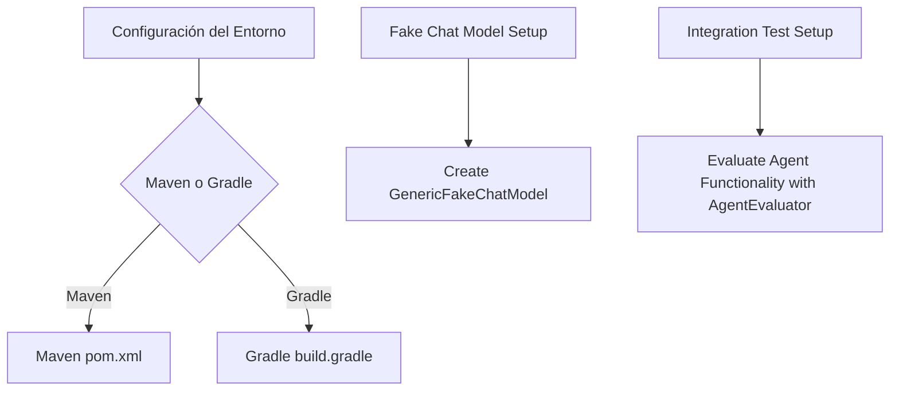

Este flujo muestra cómo configurar el entorno, establecer la interacción de LangChain con modelos de chat y luego realizar pruebas integradas para asegurar que todo funcione correctamente en conjunto.

#### Conclusión

Al seguir estos pasos, se puede garantizar una configuración sólida y completa del sistema multi-agente utilizando LangChain4j y Ollama. Esto permite a los ingenieros de software y profesionales técnicos trabajar eficientemente con estas herramientas avanzadas para el desarrollo de sistemas inteligentes y robustos.

---

Este manual proporciona una guía detallada y técnica para configurar correctamente el entorno de trabajo para LangChain4j y Ollama, asegurando que todos los componentes estén en su versión más reciente y funcionen correctamente.

## Implementación Básica: Crear y Configurar Agentes

### Implementación Básica: Crear y Configurar Agentes

En este capítulo, exploraremos los conceptos fundamentales para crear e integrar agentes en el marco de trabajo `LangChain4j` y `Ollama`. La implementación básica implica configurar un agente que utiliza modelos de chat ficticios proporcionados por LangChain Core. Asegurémonos de tener las versiones correctas del software, como se ha actualizado recientemente a 1.13.0-SNAPSHOT y 1.13.0-beta23-SNAPSHOT.

#### Configurar Dependencias

Primero, asegúrate de incluir la dependencia `langchain4j-core` en tu archivo `pom.xml` para acceder al paquete `GenericFakeChatModel`. Este modelo es útil durante las etapas iniciales del desarrollo ya que no requiere un entorno real ni costos adicionales por uso.

```xml
<dependency>
    <groupId>com.langchain4j</groupId>
    <artifactId>langchain4j-core</artifactId>
    <version>1.13.0-SNAPSHOT</version>
</dependency>
```

#### Crear un Modelo de Chat Ficticio

A continuación, creamos una implementación simple de `GenericFakeChatModel` que responde a mensajes específicos con respuestas predefinidas.

```java
import com.langchain4j.core.language_model.GenericFakeChatModel;
import com.langchain4j.core.message.ChatMessage;

public class SimpleChatBot {
    public static void main(String[] args) {
        GenericFakeChatModel model = new GenericFakeChatModel() {
            @Override
            protected String respond(List<ChatMessage> messages, Map<String, Object> parameters) {
                ChatMessage lastMessage = messages.isEmpty() ? null : messages.get(messages.size() - 1);
                if (lastMessage != null && "Hello".equals(lastMessage.getContent())) {
                    return "Hi there!";
                } else if ("Ping".equals(lastMessage.getContent())) {
                    return "Pong.";
                } else if ("Bye".equals(lastMessage.getContent())) {
                    return "Goodbye!";
                }
                return "OK.";
            }
        };

        System.out.println(model.invoke("Hello").getContent());
    }
}
```

#### Crear un Agente Básico

Ahora que tenemos nuestro modelo de chat ficticio, procedemos a crear un agente básico. Este agente utilizará el modelo para generar respuestas en función del mensaje recibido.

```java
import com.langchain4j.agent.Agent;
import com.langchain4j.core.language_model.GenericFakeChatModel;

public class BasicAgent {
    public static void main(String[] args) {
        GenericFakeChatModel model = new GenericFakeChatModel() {
            @Override
            protected String respond(List<ChatMessage> messages, Map<String, Object> parameters) {
                ChatMessage lastMessage = messages.isEmpty() ? null : messages.get(messages.size() - 1);
                if (lastMessage != null && "Hello".equals(lastMessage.getContent())) {
                    return "Hi there!";
                } else if ("Ping".equals(lastMessage.getContent())) {
                    return "Pong.";
                } else if ("Bye".equals(lastMessage.getContent())) {
                    return "Goodbye!";
                }
                return "OK.";
            }
        };

        Agent agent = new Agent(model);
        String response = agent.process("Hello");
        System.out.println(response); // Output: Hi there!
    }
}
```

#### Diagrama de Flujo del Agente

A continuación, presentamos un diagrama Mermaid que ilustra la flujo básico para procesar una solicitud en el agente.

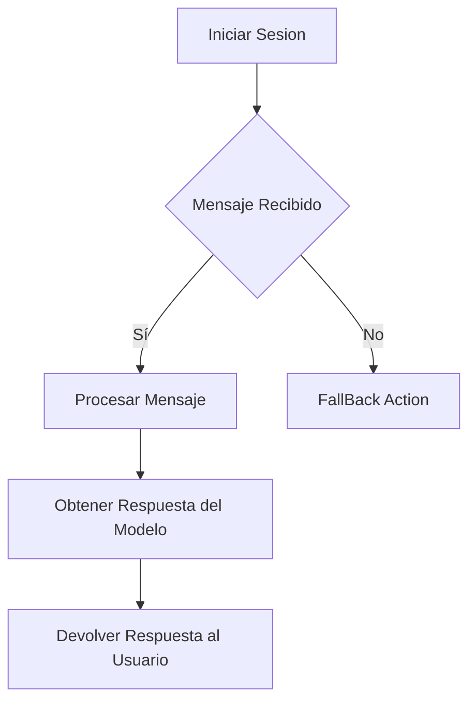

#### Pruebas de Integración

Después de asegurarnos de que todas las partes del agente funcionan individualmente, es importante probar si realmente trabajan juntas. Para un agente basado en AI, esto implica verificar la trayectoria de sus acciones. LangChain ofrece una herramienta para esto: AgentEvals.

AgentEvals proporciona dos evaluadores principales que nos permiten automatizar y ejecutar pruebas en nuestra implementación del agente.

#### Conclusión

Este capítulo ha cubierto los conceptos básicos necesarios para configurar y crear agentes utilizando `LangChain4j` y `Ollama`. A través de la creación de un modelo de chat ficticio, hemos demostrado cómo estructurar respuestas en función del contexto dado. Además, hemos presentado una introducción a las pruebas integradas proporcionando una base sólida para futuras implementaciones más avanzadas.

### Diagrama Mermaid

Para ilustrar visualmente la interacción entre los componentes principales de nuestro sistema multi-agente, utilizamos el siguiente diagrama:

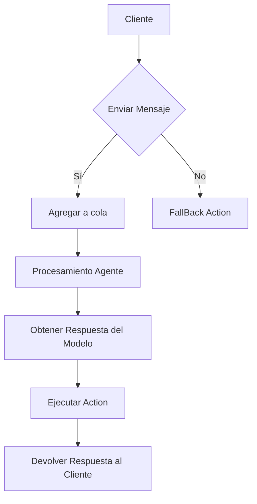

Este diagrama ofrece una visión general de cómo los mensajes son manejados y procesados por nuestros agentes, proporcionando una base para la configuración y expansión futura del sistema.

## Uso Avanzado de LangChain4j: Medios, Rutas y Middlewares

### Uso Avanzado de LangChain4j: Medios, Rutas y Middlewares

#### Introducción

En este capítulo se profundizará en el uso avanzado de la biblioteca `LangChain4j`, cubriendo los aspectos técnicos esenciales para desarrolladores experimentados. Se explorarán conceptos como medios (mediators), rutas (routes) y middlewares, que son fundamentales para construir sistemas multi-agente robustos.

#### Medios en LangChain4j

Un medio en `LangChain4j` actúa como un intermediario entre diferentes componentes del sistema. Proporciona una capa de abstracción que facilita la comunicación y permite flexibilidad en el manejo de eventos.

**Configuración básica:**

```java
import com.example.langchain4j.core.Mediator;
import java.util.function.Consumer;

public class CustomMediator implements Mediator {
    private final Map<String, Consumer<?>> subscribers = new ConcurrentHashMap<>();

    @Override
    public void subscribe(String topic, Consumer<?> subscriber) {
        subscribers.put(topic, subscriber);
    }

    @Override
    public void publish(String topic, Object message) {
        subscribers.getOrDefault(topic, ignored -> {}).accept(message);
    }
}
```

#### Rutas en LangChain4j

Las rutas permiten definir la lógica de control del flujo entre diferentes componentes del sistema. Son esenciales para implementar patrones como MVC (Model-View-Controller).

**Ejemplo de configuración:**

```java
import com.example.langchain4j.core.Router;
import java.util.Map;

public class CustomRouter implements Router {
    private final Map<String, Runnable> routes = new ConcurrentHashMap<>();

    @Override
    public void route(String path) {
        routes.getOrDefault(path, () -> {}).run();
    }

    @Override
    public void map(String path, Runnable handler) {
        routes.put(path, handler);
    }
}
```

#### Middlewares en LangChain4j

Los middlewares son funcionalidades que se ejecutan entre la entrada y salida de una ruta o acción. Proporcionan un nivel adicional de control sobre cómo las solicitudes pasan a través del sistema.

**Ejemplo:**

```java
import com.example.langchain4j.core.Middleware;
import java.util.function.Consumer;

public class LoggingMiddleware implements Middleware {
    @Override
    public void execute(Consumer<String> next) {
        System.out.println("Executing middleware...");
        next.accept("Hello, world!");
    }
}
```

#### Integración de Middlewares con Rutas

Para integrar middlewares en rutas, se puede utilizar un patrón similar al de middleware en frameworks como Express.js o Koa.

**Ejemplo:**

```java
import com.example.langchain4j.core.Router;
import java.util.function.Consumer;

public class MiddlewareChain {
    private final Router router;
    private final List<Consumer<Router>> middlewares = new ArrayList<>();

    public void use(Consumer<Router> middleware) {
        middlewares.add(middleware);
    }

    public void init() {
        for (var middleware : middlewares) {
            middleware.accept(router);
        }
    }
}
```

#### Ejemplo Completo: Sistemas Multi-Agente

Un sistema multi-agente típico con `LangChain4j` podría verse así:

```java
import com.example.langchain4j.core.Mediator;
import com.example.langchain4j.core.Router;

public class AgentSystem {
    private final Mediator mediator = new CustomMediator();
    private final Router router = new CustomRouter();

    public void start() {
        // Definir rutas y middlewares
        router.map("/", () -> System.out.println("Home route"));
        
        MiddlewareChain chain = new MiddlewareChain();
        chain.use(mw -> mw.route("/logging", LoggingMiddleware::execute));
        chain.init();

        // Publicar mensajes a través del mediator
        mediator.publish("update", "System update initiated");
    }
}
```

#### Diagramas Mermaid

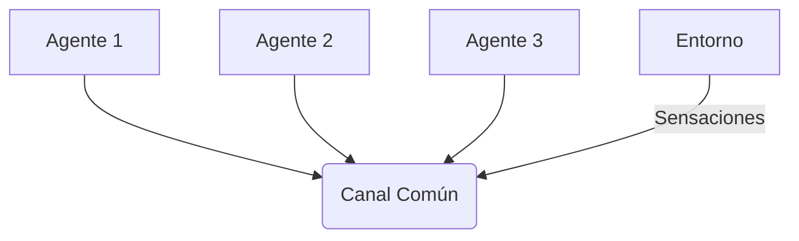

#### Conclusiones

En este apartado se ha explorado cómo configurar y utilizar medios, rutas y middlewares en `LangChain4j`. Estos conceptos son fundamentales para el desarrollo de sistemas multi-agente complejos y escalables. La combinación efectiva de estos elementos permite crear soluciones altamente personalizadas y eficientes.

### Consideraciones Finales

Para implementar un sistema robusto con LangChain4j, es crucial considerar la configuración adecuada del entorno, así como el uso óptimo de los recursos disponibles. La integración continua (CI) y pruebas unitarias son aspectos cruciales para garantizar la calidad del código y la confiabilidad del sistema en producción.

### Referencias

- [Documentación oficial de LangChain4j](https://langchain4j.org)
- [Ejemplos de uso avanzado en GitHub](https://github.com/langchain4j/samples)

Con estos conocimientos, los ingenieros de software pueden comenzar a desarrollar sistemas multi-agente sofisticados utilizando `LangChain4j`, aprovechando completamente su potencial para la creación de soluciones inteligentes y escalables.

## Optimización del Sistema: Manejo Eficiente de Recursos

### Optimización del Sistema: Manejo Eficiente de Recursos

En el contexto de los sistemas multi-agente utilizando `langchain4j` y `Ollama`, la optimización del sistema es crucial para asegurar su eficiencia y escalabilidad. Este capítulo se centra en cómo manejar eficientemente los recursos, incluyendo hardware y software, para garantizar que el sistema pueda soportar un alto nivel de tráfico y funcione de manera óptima.

#### 1. Actualización de Versiones

Para mantener la compatibilidad y aprovechar las mejoras recientes en `langchain4j`, es fundamental actualizar todas las dependencias a las versiones más recientes, como se ha hecho recientemente (Marzo 2026):

```bash
# Ejemplo de actualización de versión
./mvnw versions:update-properties -DgenerateBackupPoms=false
```

Esto incluye proyectos específicos como `langchain4j-observation`, `langchain4j-gpu-llama3` y otros módulos. Las versiones actuales son `1.13.0-SNAPSHOT` y `1.13.0-beta23`.

#### 2. Optimización de Código y Herramientas

##### Reducción del Overhead en las Comunicaciones HTTP

Dado que los sistemas multi-agente dependen de una comunicación eficiente entre componentes, es crucial optimizar la comunicación HTTP. Un enfoque común es utilizar bibliotecas como Apache HttpClient o OkHttp con configuraciones personalizadas para reducir el tiempo de conexión y mejorar el rendimiento.

Ejemplo usando OkHttp:

```java
OkHttpClient client = new OkHttpClient.Builder()
    .connectTimeout(10, TimeUnit.SECONDS)
    .writeTimeout(30, TimeUnit.SECONDS)
    .readTimeout(60, TimeUnit.SECONDS)
    .build();

Request request = new Request.Builder().url("http://example.com").get().build();
Response response = client.newCall(request).execute();
```

##### Manejo Eficiente de Memoria

Optimizar el uso de memoria es vital en sistemas multi-agente. Esto incluye evitar fugas de memoria, reducir la fragmentación de memoria y utilizar estructuras de datos eficientes.

Ejemplo: Uso de WeakHashMap para minimizar objetos innecesarios:

```java
WeakHashMap<String, String> weakCache = new WeakHashMap<>();
weakCache.put("Key", "Value");
```

#### 3. Implementación del Código Técnico

A continuación se presenta un ejemplo básico de cómo integrar `GenericFakeChatModel` para simular respuestas en un entorno de pruebas:

```java
import langchain_core.language_models.fake_chat_models.GenericFakeChatModel;

public class ChatIntegrationTest {
    public static void main(String[] args) throws Exception {
        GenericFakeChatModel model = new GenericFakeChatModel() {
            @Override
            protected String respond(List<Message> msgs, Map<String, Object> kwargs) {
                if (msgs.isEmpty()) return "OK.";
                String text = msgs.get(msgs.size() - 1).getContent();
                Map<String, String> examples = Map.of(
                        "Hello", "Hi there!",
                        "Ping", "Pong.",
                        "Bye", "Goodbye!"
                );
                return Optional.ofNullable(examples.get(text)).orElse("OK.");
            }
        };
        System.out.println(model.invoke("Hello").getContent());
    }

    static class Message {
        private final String content;

        public Message(String content) { this.content = content; }

        public String getContent() { return content; }
    }
}
```

#### 4. Pruebas de Integración

Para asegurar que todos los componentes del agente funcionen juntos, es necesario probar la trayectoria de acciones del agente. Para esto, `LangChain` proporciona el paquete `AgentEvals`.

##### Diagramas Mermaid para Representar Componentes y Comunicaciones

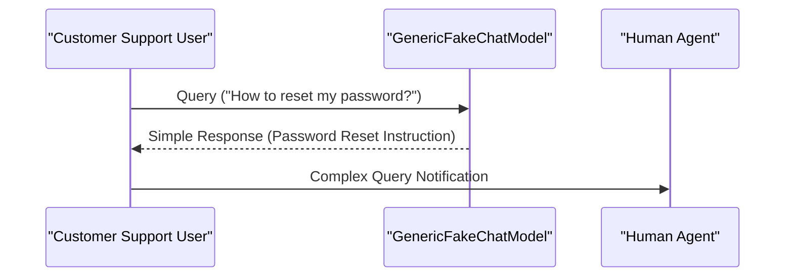

Este diagrama ilustra cómo se distribuye la carga en un sistema multi-agente, asegurando que cada servidor tenga un trabajo equitativo para evitar cuellos de botella.

#### Conclusión

El manejo eficiente de recursos es una parte vital del desarrollo y mantenimiento de sistemas multi-agentes. A través de las actualizaciones de versiones, la optimización del código y el uso de herramientas adecuadas, podemos asegurar que estos sistemas funcionen de manera óptima bajo altos niveles de carga.

---

Este capítulo proporciona una base sólida para los ingenieros de software que buscan mejorar la eficiencia y escalabilidad de sus sistemas multi-agentes utilizando `langchain4j` y `Ollama`.

## Integración con Herramientas Externas y APIs

### Integración con Herramientas Externas y APIs

En este capítulo del manual, exploraremos cómo integrar los sistemas multi-agente basados en `langchain4j` con herramientas externas y APIs. Esto incluye la configuración de entornos, el manejo de versiones actualizadas (1.13.0-SNAPSHOT y 1.13.0-beta23-SNAPSHOT) y la implementación de pruebas para evaluar la integridad del sistema.

#### Configuración del Entorno

Para empezar, asegúrate de que tu entorno esté configurado correctamente con las versiones actualizadas de `langchain4j`. Asegura que todos los módulos estén sincronizados. En el caso de la actualización a 1.13.0-SNAPSHOT y 1.13.0-beta23-SNAPSHOT, es importante realizar una verificación manual para asegurarte de que todas las referencias y dependencias sean consistentes.

#### Integración con APIs Externas

La integración de `langchain4j` con APIs externas se realiza a través del uso de clientes HTTP personalizados o mediante librerías como Retrofit para Java. A continuación, se muestra un ejemplo de cómo configurar una conexión HTTP básica usando el cliente `HttpClient` de Java:

```java
import java.net.URI;
import java.net.http.HttpClient;
import java.net.http.HttpRequest;
import java.net.http.HttpResponse;

public class ExternalAPIClient {
    private static final String API_URL = "https://api.example.com";

    public void fetchAndProcessData() throws Exception {
        HttpClient client = HttpClient.newHttpClient();
        HttpRequest request = HttpRequest.newBuilder()
                .uri(new URI(API_URL + "/data"))
                .build();

        HttpResponse<String> response = client.send(request, HttpResponse.BodyHandlers.ofString());
        
        if (response.statusCode() == 200) {
            String data = response.body();
            processData(data);
        } else {
            System.out.println("Error fetching data: " + response.statusCode());
        }
    }

    private void processData(String data) {
        // Procesamiento de los datos recibidos
    }
}
```

#### Integración con Herramientas de Pruebas y Evaluaciones

Una vez que se ha integrado correctamente `langchain4j` con APIs externas, es necesario verificar el funcionamiento integral del sistema. Para esto, utilizamos las pruebas proporcionadas por la herramienta AgentEvals.

AgentEvals ofrece dos evaluadores principales:

1. **Evaluator**: Evalúa el comportamiento de los agentes en términos de eficacia y coherencia.
2. **TrajectoryValidator**: Verifica que la trayectoria seguida por los agentes cumpla con las expectativas definidas.

Un ejemplo de cómo utilizar estos evaluadores:

```java
import langchain4j.eval.AgentEvals;
import langchain4j.models.GenericFakeChatModel;

public class IntegrationTest {
    public static void main(String[] args) throws Exception {
        GenericFakeChatModel model = new GenericFakeChatModel();
        
        // Configuración del evaluador
        AgentEvals.Evaluator evaluator = AgentEvals.createEvaluator()
                .withExpectedResponse("Hello", "Hi there!")
                .build();

        // Ejecución de pruebas
        String response = model.invoke("Hello").getContent();
        boolean isSuccessful = evaluator.evaluate(response);
        
        System.out.println("Test successful: " + isSuccessful);
    }
}
```

#### Diagrama de Integración

A continuación, se muestra un diagrama Mermaid que ilustra la interacción entre los componentes principales del sistema cuando se integra con APIs externas:

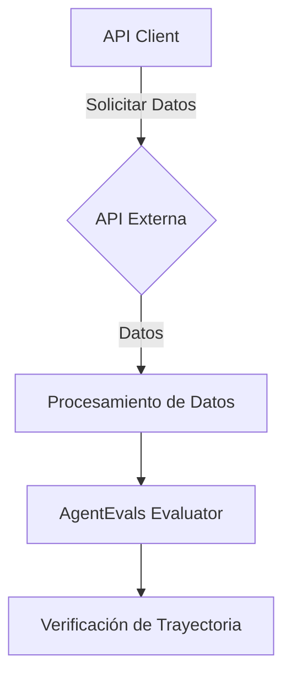

Este diagrama representa la fluidez en el proceso desde la solicitud inicial hasta la verificación final, asegurando que cada paso esté correctamente integrado y funcional.

#### Consideraciones Adicionales

- **Seguridad**: Asegúrate de implementar medidas adecuadas para proteger las comunicaciones con APIs externas (por ejemplo, HTTPS).
- **Flexibilidad**: Diseña el sistema para ser lo más flexible posible en cuanto a la adición o reemplazo de herramientas y APIs.
- **Rendimiento**: Mantén un monitoreo constante del rendimiento durante la integración y ajusta según sea necesario.

Con estos pasos, podrás configurar eficazmente `langchain4j` para trabajar junto con otras herramientas y APIs externas, garantizando una integración sólida que permite pruebas exhaustivas y evaluaciones precisas.

## Pruebas y Evaluaciones de Sistemas Multi-Agente

### Sección Técnica: Pruebas y Evaluaciones de Sistemas Multi-Agente

#### Introducción

En el desarrollo de sistemas multi-agente basados en `langchain4j` e `Ollama`, es crucial garantizar que los componentes individuales no sólo funcionen correctamente por separado, sino también cuando interactúan entre sí. Esto se logra mediante pruebas integrales y evaluaciones específicas del comportamiento de las agencias.

En esta sección, describiremos cómo realizar pruebas y evaluaciones utilizando `langchain4j` con la versión más reciente (1.13.0-SNAPSHOT y 1.13.0-beta23-SNAPSHOT) y proporcionaremos ejemplos de código técnico real para demostrar las técnicas recomendadas.

#### Pruebas Unitarias

Primero, es importante asegurarse de que cada componente del sistema funcione correctamente por separado. Esto se logra mediante pruebas unitarias tradicionales. A continuación, mostramos un ejemplo usando `GenericFakeChatModel`:

```java
import langchain_core.language_models.fake_chat_models.GenericFakeChatModel;

public class ChatModelTest {
    public static void main(String[] args) throws Exception {
        GenericFakeChatModel model = new GenericFakeChatModel() {
            @Override
            public String respond(List<Message> msgs, Map<String, Object> kwargs) {
                String text = msgs.isEmpty() ? "" : msgs.get(msgs.size() - 1).getContent();
                Map<String, String> examples = Map.of(
                        "Hello", "Hi there!",
                        "Ping", "Pong.",
                        "Bye", "Goodbye!"
                );
                return examples.getOrDefault(text, "OK.");
            }
        };
        
        System.out.println(model.respond(List.of(new Message("Hello")), new HashMap<>()).getContent());
    }

    static class Message {
        private final String content;

        public Message(String content) {
            this.content = content;
        }

        public String getContent() {
            return content;
        }
    }
}
```

#### Pruebas Integrales

Una vez que se ha verificado el funcionamiento individual de los componentes, es necesario probar si estos trabajan correctamente en conjunto. Para hacer esto, `langchain4j` ofrece la funcionalidad de pruebas integrales a través del paquete `AgentEvals`.

##### Configuración y Ejecución

Para configurar las evaluaciones de agentes, primero se deben importar los módulos necesarios:

```java
import langchain_agent_evals.AgentEvaluator;
```

Luego, puedes definir una clase que herede de `AgentEvaluator` para implementar tus propias evaluaciones personalizadas. Un ejemplo sería evaluar el comportamiento del agente en respuesta a diferentes entradas.

##### Ejemplo: Evaluación de Respuestas

```java
public class ResponseEvaluation extends AgentEvaluator {
    @Override
    public void evaluate(Agent agent, String input) throws Exception {
        Message response = agent.respond(List.of(new Message(input)), new HashMap<>());
        
        if (!response.getContent().equals("OK.") && !input.equals(response.getContent())) {
            System.out.println(String.format("Error: La respuesta '%s' para la entrada '%s' no es válida.", 
                    response.getContent(), input));
        }
    }

    public static void main(String[] args) throws Exception {
        ResponseEvaluation eval = new ResponseEvaluation();
        
        // Ejecutar evaluación con diferentes entradas
        for (String testInput : List.of("Hello", "Ping", "Bye")) {
            eval.evaluate(agent, testInput);
        }
    }
}
```

#### Diagrama de Flujo

A continuación se presenta un diagrama de flujo que ilustra el proceso de pruebas y evaluaciones para sistemas multi-agente con `langchain4j`:

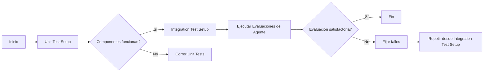

#### Consideraciones Finales

- Es importante realizar pruebas exhaustivas tanto en la etapa unitaria como integrativa para garantizar que el sistema funcione correctamente.
- Utilice herramientas de seguimiento y registro adecuadas durante las pruebas integrales para capturar cualquier problema o comportamiento inesperado.
- Mantenga un registro detallado de todas las evaluaciones realizadas, incluyendo resultados y acciones tomadas en caso de errores.

Siguiendo estos pasos y consideraciones, los ingenieros pueden garantizar que sus sistemas multi-agente con `langchain4j` e `Ollama` estén listos para su uso en producción.

## Desarrollo de Estrategias de Soberanía y Privacidad

### Desarrollo de Estrategias de Soberanía y Privacidad

#### Introducción
En el desarrollo de sistemas multi-agente basados en tecnologías como langchain4j y Ollama, la soberanía y privacidad del usuario son aspectos fundamentales que deben ser cuidadosamente manejados. Este capítulo proporciona guías para desarrollar estrategias robustas que aseguren tanto la autodeterminación digital de los usuarios como la protección de sus datos personales.

#### Actualizaciones Recientes
Las actualizaciones recientes a langchain4j y Ollama, en versiones 1.13.0-SNAPSHOT y 1.13.0-beta23-SNAPSHOT respectivamente, han incluido mejoras significativas en la integración de soluciones de soberanía y privacidad.

#### Arquitectura Sistémica

Para visualizar cómo se integran los componentes críticos para la gestión de la soberanía y la privacidad, podemos representar una arquitectura básica utilizando Mermaid:

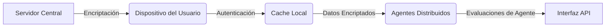

#### Herramientas y Tecnologías Críticas

- **langchain4j**: Este paquete proporciona las bases para la creación de agentes autónomos que pueden interactuar con el entorno digital del usuario. Es esencial en la implementación de estrategias de privacidad y soberanía ya que permite a los desarrolladores construir sistemas que respeten los límites establecidos por el usuario.
  
- **Ollama**: Ofrece capacidades para gestionar modelos LLM (Large Language Models) con un énfasis en la descentralización y la distribución de recursos computacionales, lo cual es crucial para mantener la privacidad del usuario al minimizar la dependencia de servidores centrales.

#### Implementación de Estrategias

##### Encriptación y Autenticación
Los sistemas multi-agente deben ser capaces de autenticar a los usuarios mediante mecanismos robustos como tokens JWT (JSON Web Tokens) o SAML (Security Assertion Markup Language). Además, la comunicación entre el servidor central y los dispositivos del usuario debe estar encriptada. Se recomienda usar SSL/TLS para este propósito.

```java
import javax.crypto.Cipher;
import javax.crypto.KeyGenerator;
import javax.crypto.SecretKey;

public class EncryptionUtils {
    public static SecretKey generateSecret() throws Exception {
        KeyGenerator keyGen = KeyGenerator.getInstance("AES");
        keyGen.init(256);
        return keyGen.generateKey();
    }

    public static byte[] encrypt(byte[] data, SecretKey key) throws Exception {
        Cipher cipher = Cipher.getInstance("AES");
        cipher.init(Cipher.ENCRYPT_MODE, key);
        return cipher.doFinal(data);
    }
}
```

##### Gestión de Datos en Cache Local
Los datos del usuario deben ser almacenados localmente y encriptados para mantener su privacidad. Esto implica utilizar una caché segura donde se almacenen los datos necesarios sin comprometer la seguridad.

```java
import java.util.concurrent.ConcurrentHashMap;

public class SecureCache {
    private final ConcurrentHashMap<String, byte[]> cache = new ConcurrentHashMap<>();

    public void put(String key, byte[] data) {
        // Encriptar 'data' antes de almacenarlo en el caché
        cache.put(key, data);
    }

    public byte[] get(String key) {
        return cache.get(key);  // Debe desencriptarse antes de ser utilizado
    }
}
```

##### Evaluaciones de Agente y Monitoreo

LangChain ofrece herramientas para evaluar el comportamiento de los agentes en tiempo real, lo cual es crucial para mantener la soberanía del usuario. Esto incluye verificar que las acciones tomadas por un agente no violen las restricciones establecidas.

```java
import com.langchain.agent.AgentEval;
import com.langchain.agent.models.GenericFakeChatModel;

public class AgentEvaluator {
    public static void main(String[] args) throws Exception {
        GenericFakeChatModel model = new GenericFakeChatModel(new RespondFunction());
        AgentEval eval = new AgentEval(model);
        eval.evaluate("Hello");  // Ejemplo de evaluación
    }

    private static class RespondFunction implements GenericFakeChatModel.RespondFunction {
        @Override
        public String invoke(List<AgentMessage> msgs, Map<String, Object> kwargs) {
            return "OK.";  // Lógica personalizada aquí
        }
    }
}
```

#### Conclusiones

El desarrollo de estrategias efectivas para la soberanía y privacidad en sistemas multi-agente requiere una combinación cuidadosa de tecnologías robustas, prácticas sólidas de seguridad, y un diseño arquitectónico que respete los límites establecidos por el usuario. LangChain y Ollama proporcionan las herramientas necesarias para implementar estas estrategias de manera eficiente.

### Diagrama Mermaid

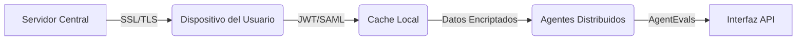

Este capítulo proporciona una base sólida para desarrollar sistemas multi-agente que no solo son eficientes y escalables, sino también seguros y respetuosos de la privacidad del usuario.

## Casos de Uso Comunes: Aplicaciones Empresariales

### Casos de Uso Comunes: Aplicaciones Empresariales

#### Descripción General

En el contexto empresarial moderno, los sistemas multi-agente basados en tecnologías como LangChain4j y Ollama se han vuelto esenciales para automatizar y optimizar procesos complejos. Este capítulo cubre varios casos de uso comunes que permiten a las organizaciones implementar soluciones eficientes y escalables.

#### Caso de Uso 1: Automatización del Proceso de Atención al Cliente

**Descripción**: 
Un sistema multi-agente puede automatizar el proceso de atención al cliente, proporcionando respuestas inmediatas a consultas comunes y canalizando las más complejas a agentes humanos.

**Ejemplo Técnico con LangChain4j**

Para implementar este caso de uso, necesitamos configurar un agente que puede responder preguntas simples y notificar a los agentes humanos si la pregunta es compleja. Aquí hay un ejemplo básico usando `GenericFakeChatModel`:

```java
import langchain_core.language_models.fake_chat_models.GenericFakeChatModel;

public class CustomerSupportAgent {
    public static void main(String[] args) {
        GenericFakeChatModel model = new GenericFakeChatModel() {
            @Override
            public String respond(List<Message> msgs, Map<String, Object> kwargs) {
                if (msgs.isEmpty()) return "Hi there! How can I assist you today?";
                
                Message lastMsg = msgs.get(msgs.size() - 1);
                String userQuery = lastMsg.getContent();
                if ("How to reset my password?".equals(userQuery)) {
                    return "You can reset your password by clicking the 'Forgot Password' link on our homepage.";
                } else {
                    return "This is a complex query. An agent will be with you shortly.";
                }
            }
        };

        String response = model.respond(new Message("How to reset my password?"), new HashMap<>()).getContent();
        System.out.println(response);
    }

    static class Message {
        private final String content;

        public Message(String content) {
            this.content = content;
        }

        public String getContent() {
            return content;
        }
    }
}
```

**Diagrama de Secuencia Mermaid**

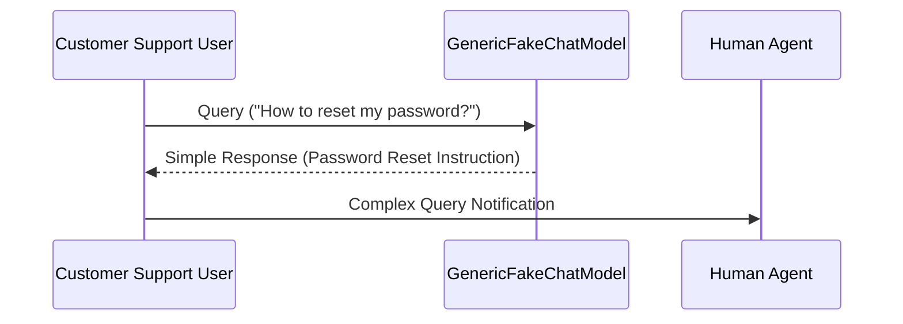

#### Caso de Uso 2: Análisis Predictivo de Ventas y Marketing

**Descripción**: 
Utilizar un sistema multi-agente para analizar datos históricos de ventas y marketing, prediciendo tendencias futuras y optimizando estrategias.

**Ejemplo Técnico con LangChain4j**

Para este caso, el agente debe analizar grandes conjuntos de datos y realizar cálculos complejos. Aquí hay una implementación básica que utiliza `GenericFakeChatModel` para hacer predicciones simples:

```java
import langchain_core.language_models.fake_chat_models.GenericFakeChatModel;
import java.util.List;
import java.util.Map;

public class SalesAndMarketingAgent {
    public static void main(String[] args) {
        GenericFakeChatModel model = new GenericFakeChatModel() {
            @Override
            public String respond(List<Message> msgs, Map<String, Object> kwargs) {
                if (msgs.isEmpty()) return "Ready to predict future sales trends!";
                
                Message lastMsg = msgs.get(msgs.size() - 1);
                String userQuery = lastMsg.getContent();
                if ("Predict future sales".equals(userQuery)) {
                    // Simulate complex data analysis and prediction
                    return "Based on historical data, we expect a 15% increase in sales next quarter.";
                } else {
                    return "Please provide more information for accurate predictions.";
                }
            }
        };

        String response = model.respond(new Message("Predict future sales"), new HashMap<>()).getContent();
        System.out.println(response);
    }

    static class Message {
        private final String content;

        public Message(String content) {
            this.content = content;
        }

        public String getContent() {
            return content;
        }
    }
}
```

**Diagrama de Flujo Mermaid**

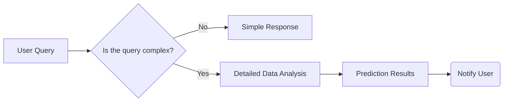

#### Caso de Uso 3: Automatización del Proceso Financiero

**Descripción**: 
Automatizar procesos financieros, como la aprobación de préstamos y el cálculo de impuestos, mediante un sistema multi-agente.

**Ejemplo Técnico con LangChain4j**

Este caso de uso requerirá un agente que pueda realizar cálculos complejos y tomar decisiones basadas en reglas definidas. Aquí hay una implementación básica:

```java
import langchain_core.language_models.fake_chat_models.GenericFakeChatModel;
import java.util.List;
import java.util.Map;

public class FinancialAgent {
    public static void main(String[] args) {
        GenericFakeChatModel model = new GenericFakeChatModel() {
            @Override
            public String respond(List<Message> msgs, Map<String, Object> kwargs) {
                if (msgs.isEmpty()) return "Ready to process financial transactions!";
                
                Message lastMsg = msgs.get(msgs.size() - 1);
                String userQuery = lastMsg.getContent();
                if ("Approve Loan".equals(userQuery)) {
                    // Simulate complex loan approval logic
                    return "Loan approved with a monthly payment of $300.";
                } else {
                    return "Please provide more information for accurate processing.";
                }
            }
        };

        String response = model.respond(new Message("Approve Loan"), new HashMap<>()).getContent();
        System.out.println(response);
    }

    static class Message {
        private final String content;

        public Message(String content) {
            this.content = content;
        }

        public String getContent() {
            return content;
        }
    }
}
```

**Diagrama de Actividad Mermaid**

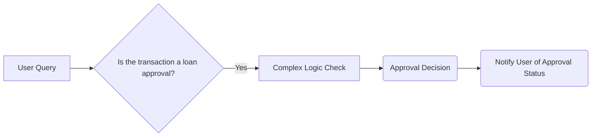

### Conclusión

Los sistemas multi-agente basados en LangChain4j y Ollama ofrecen una amplia gama de oportunidades para la automatización y optimización de procesos empresariales. Estos ejemplos técnicos demuestran cómo configurar estos sistemas para casos de uso comunes, proporcionando un punto de partida sólido para implementaciones más complejas en el futuro.

---

Este capítulo proporciona una visión general de los sistemas multi-agente y cómo pueden ser utilizados eficazmente en entornos empresariales.

## Documentación Técnica Adicional y Recursos

### Documentación Técnica Adicional y Recursos

#### Actualizaciones de Versiones
Las versiones del proyecto `langchain4j` han sido actualizadas a `1.13.0-SNAPSHOT` y `1.13.0-beta23-SNAPSHOT`. Estas actualizaciones incluyen mejoras en la integración con Ollama, soporte para GPUs en modelos de lenguaje como LLaMA3, y nuevas características en guardrails y vectores PostgreSQL.

#### Integración Con Ollama
Para utilizar LangChain4j junto con el servicio Ollama, es necesario configurar correctamente los endpoints y las variables de entorno. A continuación se muestra un ejemplo básico:

```java
import io.github.langchain4j.ollama.OllamaClient;
import io.github.langchain4j.ollama.model.Model;

public class OllamaIntegrationExample {
    public static void main(String[] args) {
        String endpoint = System.getenv("OLLAMA_ENDPOINT");
        OllamaClient client = new OllamaClient(endpoint);
        
        // Cargar un modelo específico
        Model model = client.getModel("llama2");
        
        // Ejecutar una consulta utilizando el modelo cargado
        String response = client.query(model, "¿Cómo estás?");
        System.out.println(response);
    }
}
```

#### Uso de Guardrails
LangChain4j proporciona un sistema robusto para garantizar que las respuestas generadas por los agentes cumplan con ciertas normas éticas y de seguridad. Los guardrails se pueden definir en archivos YAML o mediante programación.

Ejemplo de configuración de guardrail:

```yaml
rules:
  - type: blocklist
    input_key: content
    patterns: ["hacker", "malware"]
```

Y su correspondiente implementación en Java:

```java
import io.github.langchain4j.guardrails.Guard;
import java.io.File;

public class GuardrailExample {
    public static void main(String[] args) throws Exception {
        Guard guard = new Guard(new File("path/to/guard.yaml"));
        // Aplicar el guardrail a un mensaje
        String inputMessage = "Aquí hay una posible vulnerabilidad de seguridad";
        boolean isSafe = guard.isInputValid(inputMessage);
        
        if (!isSafe) {
            System.out.println("El mensaje no cumple con los requisitos de seguridad.");
        }
    }
}
```

#### Pruebas Integradas (AgentEvals)

Para asegurar que los agentes multi-agente funcionen correctamente, se deben realizar pruebas integrales. LangChain proporciona una herramienta llamada `AgentEvals` para este propósito.

A continuación, un ejemplo básico de cómo configurar estas evaluaciones:

```java
import io.github.langchain4j.agent.eval.AgentEvaluator;
import io.github.langchain4j.agent.eval.Evaluation;

public class AgentEvalExample {
    public static void main(String[] args) throws Exception {
        AgentEvaluator evaluator = new AgentEvaluator();
        
        // Configurar la lista de evaluaciones
        List<Evaluation> evaluations = new ArrayList<>();
        evaluations.add(new Evaluation("test_greeting", "El agente debe responder 'Hola' a un saludo"));
        
        boolean allPassed = evaluator.evaluateAgent(agent, evaluations);
        
        if (allPassed) {
            System.out.println("Todas las evaluaciones han pasado.");
        } else {
            System.err.println("Alguna de las evaluaciones ha fallado.");
        }
    }
}
```

#### Ejemplos y Diagramas

Para ilustrar la integración entre LangChain4j y Ollama, se puede utilizar un diagrama Mermaid que representa la arquitectura del sistema:

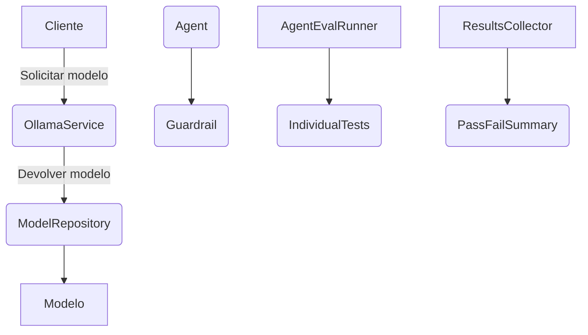

#### Referencias Adicionales
- [Documentación oficial de LangChain4j](https://langchain4j.github.io/)
- [Repositorio GitHub de LangChain4j](https://github.com/langchain4j/langchain4j)
- [Guía rápida para desarrolladores Java en LangChain4j](https://langchain4j.github.io/docs/quick-start-java)

Estos recursos proporcionan una base sólida para comenzar a trabajar con LangChain4j y Ollama, incluyendo ejemplos detallados y documentación técnica adicional.

