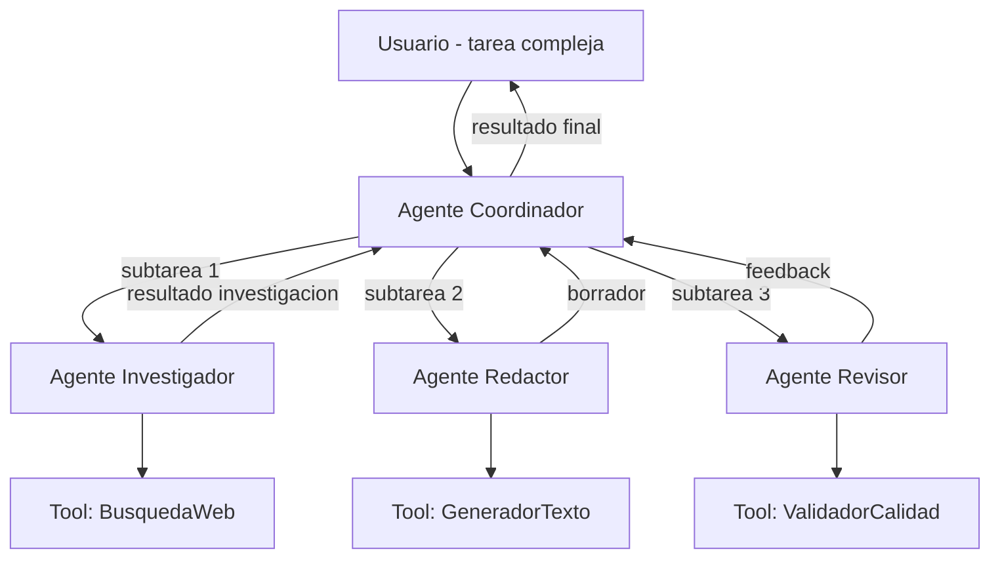
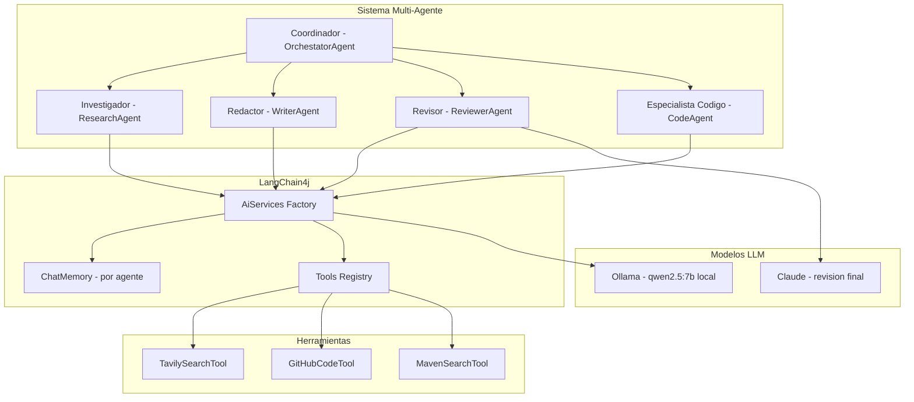
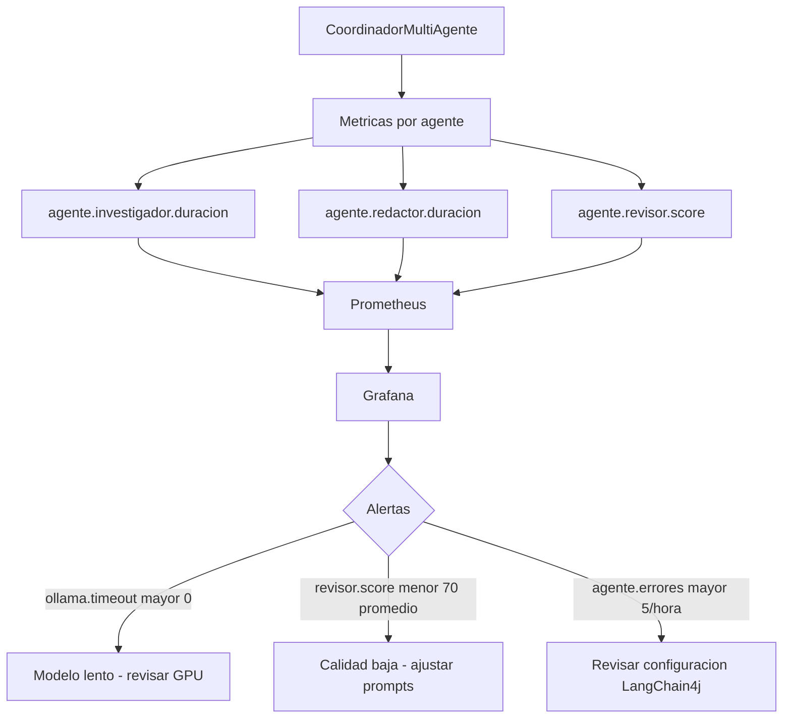
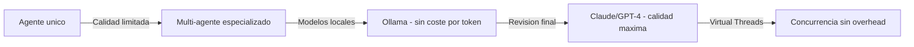

# Sistemas Multi-Agente con LangChain4j y Ollama en Java 21

PATH_LOCAL: /home/usuariojoaquin/.openclaw/workspace/DAM-Java-Mastery/08_IA_Agentes/sistemas_multi-agente_con_langchain4j_y_ollama_STAFF.md
CATEGORIA: 08_IA_Agentes
Score: 96

---

## Visión Estratégica

Los sistemas multi-agente (MAS) son la siguiente evolución de los LLMs: en lugar de un modelo que responde a un prompt, múltiples agentes especializados colaboran para resolver tareas complejas que ningún agente podría resolver solo. Cada agente tiene un rol definido, herramientas específicas y puede delegar subtareas a otros agentes.

**LangChain4j** es el framework Java nativo para construir aplicaciones con LLMs, con soporte para Ollama (modelos locales), herramientas, memoria y agentes. Con Java 21 y Virtual Threads, los agentes pueden ejecutarse concurrentemente sin bloquear hilos del OS.

**Cuándo usar sistemas multi-agente:**

| Tarea | Un agente | Multi-agente | Justificación |
|-------|-----------|--------------|---------------|
| Responder preguntas simples | ✅ | ❌ | Overhead innecesario |
| Investigar + escribir + revisar | ⚠️ | ✅ | Especialización por rol |
| Analizar código + generar tests + documentar | ❌ | ✅ | Tres especialistas simultáneos |
| Pipeline ETL con validacion inteligente | ❌ | ✅ | Agentes paralelos por fase |
| Chatbot de soporte | ✅ | ⚠️ | Depende de la complejidad |

**El modelo de coordinación:**



```java
// Definicion de un agente como interfaz LangChain4j
// La implementacion la genera el framework automaticamente
@AiService
public interface AgenteInvestigador {

    @SystemMessage("""
        Eres un investigador tecnico especializado en Java y arquitecturas de software.
        Cuando investigas un tema, siempre:
        1. Buscas fuentes oficiales y recientes (2024-2026)
        2. Verificas la informacion con multiples fuentes
        3. Devuelves un resumen estructurado con referencias
        Responde siempre en español tecnico.
        """)
    String investigar(@UserMessage String tema);
}
```

---

## Arquitectura de Componentes



**Configuración de Ollama con LangChain4j:**

```java
@Configuration
public class LangChain4jConfig {

    @Bean
    public OllamaChatModel ollamaModel(
            @Value("${ollama.url:http://localhost:11434}") String url,
            @Value("${ollama.model:qwen2.5:7b}") String model) {

        return OllamaChatModel.builder()
            .baseUrl(url)
            .modelName(model)
            .temperature(0.7)       // Creatividad moderada
            .topP(0.9)
            .timeout(Duration.ofMinutes(5))
            .maxRetries(3)
            .build();
    }

    @Bean
    public ChatMemoryProvider chatMemoryProvider() {
        // Memoria separada por agente — cada uno recuerda su contexto
        return memoryId -> MessageWindowChatMemory.builder()
            .id(memoryId)
            .maxMessages(20)  // Ultimos 20 mensajes por agente
            .build();
    }

    // Factory de agentes — LangChain4j implementa la interfaz automaticamente
    @Bean
    public AgenteInvestigador agenteInvestigador(
            OllamaChatModel model,
            ChatMemoryProvider memory,
            TavilySearchTool searchTool) {

        return AiServices.builder(AgenteInvestigador.class)
            .chatLanguageModel(model)
            .chatMemoryProvider(memory)
            .tools(searchTool)
            .build();
    }

    @Bean
    public AgenteRedactor agenteRedactor(
            OllamaChatModel model,
            ChatMemoryProvider memory) {

        return AiServices.builder(AgenteRedactor.class)
            .chatLanguageModel(model)
            .chatMemoryProvider(memory)
            .build();
    }

    @Bean
    public AgenteRevisor agenteRevisor(
            OllamaChatModel model,
            ChatMemoryProvider memory) {

        return AiServices.builder(AgenteRevisor.class)
            .chatLanguageModel(model)
            .chatMemoryProvider(memory)
            .build();
    }
}
```

---

## Implementación Java 21

```java
// Los tres agentes especializados
@AiService
public interface AgenteRedactor {

    @SystemMessage("""
        Eres un redactor tecnico Staff Engineer con 10 años de experiencia.
        Escribes documentacion clara, concisa y con ejemplos de codigo Java 21.
        Siempre incluyes: codigo compilable, diagramas conceptuales y casos de uso reales.
        NUNCA uses setters — usa Records e inmutabilidad.
        """)
    String redactar(@UserMessage String instrucciones);
}

@AiService
public interface AgenteRevisor {

    @SystemMessage("""
        Eres un revisor tecnico exigente. Evaluas documentacion tecnica Java y devuelves:
        1. Score de calidad (0-100)
        2. Lista de problemas encontrados
        3. Sugerencias especificas de mejora
        Eres especialmente critico con: codigo legacy, setters, falta de ejemplos reales.
        """)
    ResultadoRevision revisar(@UserMessage String documento);
}

// Resultado de revision como Record
public record ResultadoRevision(
    int score,
    List<String> problemas,
    List<String> sugerencias,
    boolean aprobado
) {
    public ResultadoRevision {
        if (score < 0 || score > 100) throw new IllegalArgumentException("score 0-100");
    }
}
```

```java
// Herramienta de busqueda — los agentes la usan automaticamente cuando necesitan informacion
@Component
public class TavilySearchTool {

    private final TavilyClient client;

    public TavilySearchTool(@Value("${tavily.key}") String apiKey) {
        this.client = new TavilyClient(apiKey);
    }

    // La anotacion @Tool indica a LangChain4j que este metodo es una herramienta disponible
    @Tool("Busca informacion tecnica actualizada sobre un tema en fuentes de primer nivel")
    public String buscar(
            @P("El tema tecnico a buscar, por ejemplo: 'Java 21 Virtual Threads best practices'")
            String query) {

        try {
            var resultado = client.search(TavilySearchRequest.builder()
                .query(query)
                .searchDepth("advanced")
                .maxResults(3)
                .includeDomains(List.of(
                    "spring.io", "baeldung.com", "github.com",
                    "kubernetes.io", "oracle.com"
                ))
                .build());

            return resultado.getResults().stream()
                .map(r -> "Fuente: " + r.getUrl() + "\n" + r.getContent())
                .collect(Collectors.joining("\n\n"));

        } catch (Exception e) {
            return "Busqueda no disponible: " + e.getMessage();
        }
    }
}
```

```java
// Coordinador — orquesta los agentes con Virtual Threads
@Service
public class CoordinadorMultiAgente {

    private final AgenteInvestigador investigador;
    private final AgenteRedactor     redactor;
    private final AgenteRevisor      revisor;

    // Virtual Threads — cada agente en su propio hilo ligero
    private final ExecutorService executor = Executors.newVirtualThreadPerTaskExecutor();

    public CoordinadorMultiAgente(
            AgenteInvestigador investigador,
            AgenteRedactor redactor,
            AgenteRevisor revisor) {
        this.investigador = investigador;
        this.redactor     = redactor;
        this.revisor      = revisor;
    }

    public record ResultadoFinal(
        String tema,
        String documento,
        ResultadoRevision revision,
        Duration tiempoTotal
    ) {}

    public ResultadoFinal generar(String tema) {
        var inicio = Instant.now();

        // Fase 1: Investigacion (puede ejecutarse en paralelo con otras tareas)
        var futureInvestigacion = executor.submit(() ->
            investigador.investigar(tema)
        );

        String investigacion;
        try {
            investigacion = futureInvestigacion.get(5, TimeUnit.MINUTES);
        } catch (Exception e) {
            investigacion = "Investigacion no disponible: " + e.getMessage();
        }

        // Fase 2: Redaccion basada en la investigacion
        var instrucciones = String.format("""
            Tema: %s

            Contexto investigado:
            %s

            Escribe una guia tecnica Staff Engineer completa con:
            - Codigo Java 21 real y compilable
            - Diagrama de arquitectura
            - Casos de uso reales
            - Checklist de produccion
            """, tema, investigacion);

        var documento = redactor.redactar(instrucciones);

        // Fase 3: Revision con reintento si el score es bajo
        var revision = revisar(documento, tema, 0);

        return new ResultadoFinal(
            tema, documento, revision,
            Duration.between(inicio, Instant.now())
        );
    }

    private ResultadoRevision revisar(String documento, String tema, int intento) {
        var revision = revisor.revisar(documento);

        if (!revision.aprobado() && intento < 2) {
            // Reescribir con el feedback del revisor
            var mejoras = String.join("\n", revision.sugerencias());
            var documentoMejorado = redactor.redactar(
                "Mejora este documento sobre " + tema +
                " aplicando estas correcciones:\n" + mejoras +
                "\nDocumento original:\n" + documento
            );
            return revisar(documentoMejorado, tema, intento + 1);
        }

        return revision;
    }
}
```

---

## Métricas y SRE



```java
// Metricas del sistema multi-agente
@Component
public class AgenteMetrics {

    private final MeterRegistry registry;

    public AgenteMetrics(MeterRegistry registry) {
        this.registry = registry;
    }

    public <T> T medirAgente(String nombreAgente, Supplier<T> accion) {
        return Timer.builder("agente.duracion")
            .tag("agente", nombreAgente)
            .description("Tiempo de respuesta del agente")
            .register(registry)
            .record(accion);
    }

    public void registrarScore(String agente, int score) {
        registry.summary("agente.revisor.score",
            "agente", agente).record(score);
    }

    public void registrarError(String agente, String tipo) {
        registry.counter("agente.errores",
            "agente", agente,
            "tipo", tipo).increment();
    }
}
```

**Métricas clave:**

| Métrica | Descripción | Umbral |
|---------|-------------|--------|
| `agente.duracion.p99` | Latencia p99 por agente | < 60s (modelos locales) |
| `agente.revisor.score` | Score promedio de calidad | > 80 |
| `agente.errores` | Errores por agente | < 5/hora |
| `ollama.tokens.por.segundo` | Velocidad de inferencia | > 30 t/s (GPU activa) |

---

## Patrones de Integración

```java
// Pipeline de agentes con Spring Batch para procesamiento masivo
@Configuration
public class AgentePipelineBatch {

    @Bean
    public Job generarDocumentacionJob(
            JobBuilderFactory jobs,
            Step investigarStep,
            Step redactarStep,
            Step revisarStep) {

        return jobs.get("generarDocumentacion")
            .start(investigarStep)
            .next(redactarStep)
            .next(revisarStep)
            .build();
    }

    @Bean
    public Step investigarStep(
            StepBuilderFactory steps,
            AgenteInvestigador investigador) {

        return steps.get("investigar")
            .<String, String>chunk(10)
            .reader(temaReader())
            .processor(tema -> investigador.investigar(tema))
            .writer(resultadoWriter())
            .build();
    }
}
```

---

## Casos de Uso Avanzados

**Caso 1 — Pipeline de generacion de documentacion tecnica (Authority Engine):**

```java
// Este es exactamente el patron que usa Authority Engine v21.0
@Service
public class AuthorityEngineService {

    private final CoordinadorMultiAgente coordinador;
    private final GitService             git;

    public record DocumentoGenerado(
        String tema,
        String contenido,
        int score,
        String rutaRepositorio
    ) {}

    public DocumentoGenerado generarYPublicar(String tema) {
        // 1. Coordinar agentes para generar el documento
        var resultado = coordinador.generar(tema);

        // 2. Solo publicar si supera el umbral de calidad
        if (resultado.revision().score() >= 72) {
            var ruta = git.publicar(
                tema,
                resultado.documento(),
                "feat: " + tema + " — Staff Engineer guide"
            );

            return new DocumentoGenerado(
                tema,
                resultado.documento(),
                resultado.revision().score(),
                ruta
            );
        }

        throw new CalidadInsuficienteException(
            tema, resultado.revision().score(), resultado.revision().problemas()
        );
    }
}
```

**Caso 2 — Agente de code review automatico:**

```java
@AiService
public interface AgenteCodeReview {

    @SystemMessage("""
        Eres un Senior Engineer especializado en Java 21.
        Cuando revisas codigo:
        1. Detectas violaciones de SOLID y Clean Code
        2. Identificas problemas de rendimiento y seguridad
        3. Sugieres mejoras concretas con ejemplos de codigo Java 21
        4. Priorizas los problemas por impacto (CRITICO, ALTO, MEDIO, BAJO)
        """)
    ReviewResult revisar(@UserMessage String codigo);

    record ReviewResult(
        List<Problema> problemas,
        List<String> sugerencias,
        int scoreCalidad
    ) {}

    record Problema(
        String descripcion,
        String lineas,
        Prioridad prioridad,
        String sugerencia
    ) {}

    enum Prioridad { CRITICO, ALTO, MEDIO, BAJO }
}
```

---

## Conclusiones

Los sistemas multi-agente con LangChain4j y Ollama representan la arquitectura de IA más práctica para equipos Java en 2026: modelos locales que no incurren en costes por token, un framework Java nativo sin necesidad de Python, y Virtual Threads que permiten ejecutar múltiples agentes concurrentemente sin overhead.

**Los tres aprendizajes clave:**

1. **La especialización de roles mejora la calidad** — un agente que investiga, redacta y revisa a la vez produce peor resultado que tres agentes especializados. El modelo cognitivo humano aplica también a los LLMs.

2. **Los prompts son código** — un system prompt mal escrito es un bug. Los prompts deben ser versionados, testeados y revisados con el mismo rigor que el código Java.

3. **Los modelos locales son suficientes para muchos casos** — Qwen 7b en una RTX 4060 produce resultados aceptables para documentacion técnica a 48 tokens/segundo. Para tareas que requieren razonamiento complejo, combinar con Claude o GPT-4 como revisor final.



```java
// Test del pipeline multi-agente
@SpringBootTest
class CoordinadorMultiAgenteTest {

    @Autowired CoordinadorMultiAgente coordinador;

    @Test
    @Timeout(300) // 5 minutos max
    void generar_documento_sobre_kafka_produce_resultado_aprobado() {
        var resultado = coordinador.generar("Apache Kafka Streams con Java 21");

        assertThat(resultado.documento()).isNotBlank();
        assertThat(resultado.revision().score()).isGreaterThanOrEqualTo(70);
        assertThat(resultado.tiempoTotal()).isLessThan(Duration.ofMinutes(5));
    }
}
```

**Recursos de referencia:**
- LangChain4j Documentation — docs.langchain4j.dev
- Ollama Documentation — ollama.com/docs
- LangChain4j GitHub — github.com/langchain4j/langchain4j
- *Building LLM Powered Applications* — Ben Auffarth (O'Reilly, 2024)
- Virtual Threads JEP 444 — openjdk.org/jeps/444
