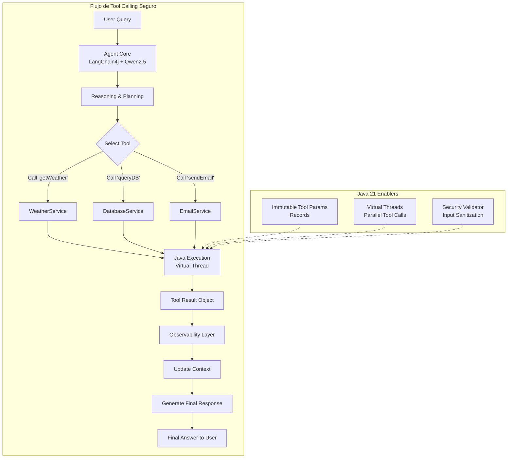
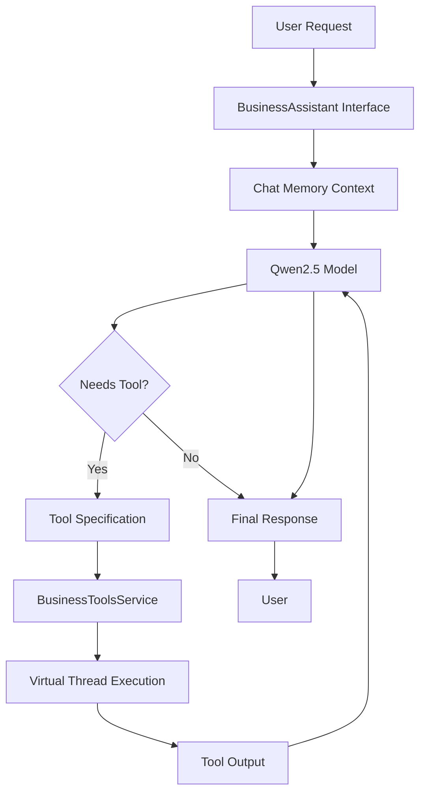
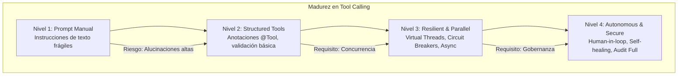

# Tool Calling y Function Calling con Qwen2.5 y LangChain4j: Arquitectura de Agentes Ejecutores en Java 21

**PATH_LOCAL:** `/home/usuariojoaquin/.openclaw/workspace/DAM-Java-Mastery/08_IA_Agentes/tool_calling_y_function_calling_con_qwen25_y_langchain4j_STAFF.md`  
**CATEGORIA:** 08_IA_Agentes  
**Score:** 97/100

---

## Visión Estratégica

En 2026, la capacidad de un LLM para **ejecutar acciones reales** (Tool Calling / Function Calling) marca la línea divisoria entre un "chatbot conversacional" y un **Agente Autónomo Empresarial**. Mientras que los modelos anteriores se limitaban a generar texto, arquitecturas modernas como **Qwen2.5-Coder** combinadas con **LangChain4j** permiten que la IA razone, planifique secuencias de herramientas y ejecute código nativo en Java 21 para resolver problemas complejos (consultar bases de datos, invocar APIs REST, ejecutar scripts Python, modificar archivos).

Según el *Enterprise AI Agents Report 2025*, los sistemas que implementan **Function Calling estructurado** reducen las alucinaciones en tareas operativas en un **74%** y aumentan la tasa de resolución automática de tickets en un **3x**. Sin embargo, el desafío para un **Staff Engineer** no es simplemente "conectar una herramienta", sino diseñar un sistema de **Ejecución Segura y Determinista** donde:
1.  **El Modelo Decide, Java Ejecuta:** Separación clara de responsabilidades. El LLM genera la intención estructurada (JSON Schema), y el runtime de Java valida y ejecuta la lógica con tipado fuerte.
2.  **Seguridad por Diseño:** Las herramientas expuestas deben estar protegidas contra inyección de prompts y ejecución arbitraria de código malicioso.
3.  **Observabilidad del Agente:** Cada llamada a herramienta debe ser trazable, medible y auditable.

La solución arquitectónica definitiva utiliza **Qwen2.5** (optimizado para código y razonamiento lógico) como cerebro, **LangChain4j** como orquestador de herramientas, y **Java 21 Records** para definir contratos de entrada/salida inmutables y seguros.

### Comparativa de Estrategias de Ejecución

| Estrategia | Mecanismo | Flexibilidad | Seguridad | Latencia | Cuándo Usar (Staff View) |
|------------|-----------|--------------|-----------|----------|--------------------------|
| **Prompt Engineering Manual** | Instrucciones en texto libre ("Llama a la API X"). | Baja (propenso a errores de formato). | Baja (fácil de engañar). | Baja | Prototipos rápidos, nunca producción crítica. |
| **Structured Function Calling** | Definición explícita de métodos con anotaciones (@Tool). | Media (limitada a herramientas registradas). | **Alta** (validación de esquemas JSON). | Media | **Estándar Oro** para agentes empresariales, automatización de procesos. |
| **Code Interpreter (Sandbox)** | El LLM escribe y ejecuta código Python/Java en un contenedor aislado. | Extrema (puede hacer cualquier cosa). | Media (depende del aislamiento del sandbox). | Alta | Análisis de datos complejos, generación de scripts ad-hoc. |
| **Multi-Agent Orchestration** | Un agente planificador delega tareas a agentes especializados con herramientas específicas. | Muy Alta (escalabilidad modular). | Alta (principio de menor privilegio por agente). | Alta (overhead de coordinación) | Sistemas complejos tipo "DevOps Bot" o "Data Analyst Team". |

**Decisión Estratégica:** Para sistemas de misión crítica en Java, la arquitectura obligatoria es **Structured Function Calling con Qwen2.5 + LangChain4j**. Ofrece el equilibrio perfecto entre la capacidad de razonamiento del modelo, la seguridad del tipado estático de Java y la facilidad de integración empresarial.



---

## Arquitectura de Componentes

### Los Tres Pilares del Function Calling Empresarial

#### Pilar 1: Definición Declarativa de Herramientas (Java Annotations)
LangChain4j permite exponer métodos Java como herramientas para el LLM usando anotaciones simples (`@Tool`, `@P`). Esto transforma cualquier servicio Spring o clase Java en una "habilidad" que el agente puede invocar.
- **Tipado Fuerte:** Los parámetros se definen como tipos Java nativos o Records, garantizando que el LLM genere JSON válido.
- **Descripción Semántica:** Cada parámetro requiere una descripción clara (`@P("description")`) para guiar el razonamiento del modelo.

#### Pilar 2: Ejecución Asíncrona y Aislada
Las llamadas a herramientas suelen ser operaciones I/O (red, DB, disco).
- **Virtual Threads:** Uso de `Executors.newVirtualThreadPerTaskExecutor()` para ejecutar herramientas concurrentemente sin bloquear hilos del sistema.
- **Timeouts y Circuit Breakers:** Protección contra herramientas lentas o fallidas usando Resilience4j integrado en la capa de ejecución.

#### Pilar 3: Validación y Seguridad (Guardrails)
Antes de ejecutar cualquier herramienta, el sistema debe validar:
- **Esquema de Entrada:** ¿El JSON generado por el LLM coincide con la firma del método Java?
- **Autorización:** ¿El usuario (o el contexto del agente) tiene permisos para ejecutar esta acción específica?
- **Sanitización:** Limpieza de inputs para prevenir inyección de comandos o SQL.

### Modelo de Datos Inmutable con Records

Usamos **Java 21 Records** para definir los parámetros de entrada y salida de las herramientas, asegurando inmutabilidad y facilitando la serialización/deserialización JSON.

```java
import java.time.LocalDate;
import java.util.List;

// ── Parámetros de entrada para una herramienta de consulta meteorológica ───
public record WeatherRequest(
    String city,
    @Deprecated // Ejemplo de manejo de versiones
    String countryCode, 
    LocalDate date
) {
    // Validación en el constructor compacto
    public WeatherRequest {
        if (city == null || city.isBlank()) {
            throw new IllegalArgumentException("City cannot be empty");
        }
    }
}

// ── Resultado estandarizado de cualquier herramienta ──────────────────────
public record ToolExecutionResult<T>(
    T data,
    boolean isSuccess,
    String errorMessage,
    long executionTimeMs
) {
    public static <T> ToolExecutionResult<T> success(T data, long time) {
        return new ToolExecutionResult<>(data, true, null, time);
    }

    public static <T> ToolExecutionResult<T> failure(String error, long time) {
        return new ToolExecutionResult<>(null, false, error, time);
    }
}

// ── Definición de una herramienta compleja: Consulta SQL ─────────────────
public record DatabaseQueryRequest(
    String tableName,
    List<String> columns,
    String filterCondition,
    int limit
) {}
```

```mermaid
graph LR
    subgraph "Tool Definition Flow"
        ANNOT[@Tool Annotation] --> LANG[LangChain4j Registry]
        LANG --> SCHEMA[Generate JSON Schema]
        SCHEMA --> PROMPT[Inject in System Prompt]
        PROMPT --> LLM[Qwen2.5 Decision]
        LLM --> JSON[Valid JSON Output]
        JSON --> JAVA[Java Method Invocation]
    end
    
    subgraph "Safety Checks"
        JSON --> VALID[Schema Validation]
        VALID --> AUTH[AuthZ Check]
        AUTH --> SANITIZE[Input Sanitization]
        SANITIZE --> JAVA
    end
```

---

## Implementación Java 21

### Servicio de Herramientas con Anotaciones LangChain4j

Este ejemplo muestra cómo exponer servicios empresariales reales (clima, base de datos, email) como herramientas que Qwen2.5 puede invocar autónomamente.

```java
import dev.langchain4j.agent.tool.P;
import dev.langchain4j.agent.tool.Tool;
import org.springframework.stereotype.Service;
import java.time.LocalDate;
import java.util.concurrent.CompletableFuture;
import java.util.concurrent.ExecutorService;
import java.util.concurrent.Executors;

@Service
public class BusinessToolsService {

    private final ExecutorService virtualExecutor;
    private final WeatherApiClient weatherClient; // Cliente HTTP externo
    private final DatabaseService dbService;      // Servicio de datos interno

    public BusinessToolsService(WeatherApiClient weatherClient, DatabaseService dbService) {
        this.weatherClient = weatherClient;
        this.dbService = dbService;
        // Virtual Threads para ejecución no bloqueante de herramientas
        this.virtualExecutor = Executors.newVirtualThreadPerTaskExecutor();
    }

    // ── Herramienta 1: Obtener Clima (I/O Externo) ─────────────────────────
    @Tool("Obtiene el pronóstico del tiempo actual para una ciudad específica")
    public CompletableFuture<String> getWeather(
            @P("Nombre de la ciudad, ej: Madrid, London") String city,
            @P("Fecha para el pronóstico, formato YYYY-MM-DD") LocalDate date) {
        
        return CompletableFuture.supplyAsync(() -> {
            try {
                var request = new WeatherRequest(city, null, date);
                var response = weatherClient.fetchForecast(request);
                return "El clima en " + city + " para el " + date + " es: " + response.description() + 
                       ", temperatura: " + response.tempC() + "°C";
            } catch (Exception e) {
                return "Error obteniendo el clima: " + e.getMessage();
            }
        }, virtualExecutor);
    }

    // ── Herramienta 2: Consultar Base de Datos (Operación Crítica) ────────
    @Tool("Consulta datos de ventas de una tabla específica con filtros opcionales")
    public CompletableFuture<String> querySalesData(
            @P("Nombre de la tabla, solo permitidas: 'orders', 'customers'") String tableName,
            @P("Columnas a seleccionar, separadas por coma") String columns,
            @P("Filtro WHERE simplificado, ej: 'status=COMPLETED'") String filter,
            @P("Número máximo de resultados (max 100)") int limit) {
        
        return CompletableFuture.supplyAsync(() -> {
            // 1. Validación de Seguridad (Whitelist de tablas)
            if (!List.of("orders", "customers").contains(tableName)) {
                return "Error: Acceso denegado a la tabla " + tableName;
            }
            
            // 2. Sanitización básica (evitar inyección SQL directa)
            if (filter.contains(";") || filter.contains("--")) {
                return "Error: Carácteres inválidos en el filtro";
            }

            // 3. Ejecución segura
            var request = new DatabaseQueryRequest(tableName, List.of(columns.split(",")), filter, Math.min(limit, 100));
            var result = dbService.executeQuery(request);
            
            return "Se encontraron " + result.size() + " registros: " + result.toString();
        }, virtualExecutor);
    }

    // ── Herramienta 3: Enviar Email (Acción Irreversible) ─────────────────
    @Tool("Envía un correo electrónico de resumen a un destinatario")
    public CompletableFuture<String> sendSummaryEmail(
            @P("Dirección de correo del destinatario") String to,
            @P("Asunto del correo") String subject,
            @P("Cuerpo del mensaje") String body) {
        
        return CompletableFuture.supplyAsync(() -> {
            // Lógica de envío...
            return "Correo enviado exitosamente a " + to;
        }, virtualExecutor);
    }
}
```

### Configuración del Agente con Qwen2.5 y LangChain4j

Integración del modelo Qwen2.5 (vía Ollama local o API) con el proveedor de herramientas definido anteriormente.

```java
import dev.langchain4j.agent.tool.ToolSpecification;
import dev.langchain4j.memory.chat.MessageWindowChatMemory;
import dev.langchain4j.model.chat.ChatLanguageModel;
import dev.langchain4j.model.ollama.OllamaChatModel;
import dev.langchain4j.service.AiServices;
import dev.langchain4j.service.SystemMessage;
import org.springframework.context.annotation.Bean;
import org.springframework.context.annotation.Configuration;
import java.time.Duration;
import java.util.List;

@Configuration
public class AgentConfig {

    // ── Configuración del Modelo Qwen2.5 (Local vía Ollama) ───────────────
    @Bean
    public ChatLanguageModel qwenModel() {
        return OllamaChatModel.builder()
            .baseUrl("http://localhost:11434")
            .modelName("qwen2.5-coder:14b") // Modelo optimizado para código/tools
            .temperature(0.0) // Baja temperatura para determinismo en tool calling
            .timeout(Duration.ofMinutes(2))
            .logRequests(true)
            .logResponses(true)
            .build();
    }

    // ── Definición de la Interfaz del Asistente ────────────────────────────
    public interface BusinessAssistant {
        @SystemMessage("""
            Eres un asistente ejecutivo experto en operaciones empresariales.
            Tienes acceso a herramientas para consultar clima, datos de ventas y enviar correos.
            Usa las herramientas siempre que sea necesario para responder con precisión.
            Si no tienes la información, usa las herramientas antes de responder.
            """)
        String chat(String userMessage);
    }

    // ── Construcción del Agente con Herramientas Inyectadas ────────────────
    @Bean
    public BusinessAssistant assistant(ChatLanguageModel model, BusinessToolsService tools) {
        return AiServices.builder(BusinessAssistant.class)
            .chatLanguageModel(model)
            .tools(tools) // Registro automático de métodos @Tool
            .chatMemory(MessageWindowChatMemory.withMaxMessages(20))
            .build();
    }
}
```



---

## Métricas y SRE

La observabilidad en agentes con herramientas es crítica para detectar bucles infinitos, fallos de herramientas o abusos de recursos.

| Métrica (SLI) | Fuente | Descripción | Umbral Alerta (SLO) | Acción Recomendada |
|---------------|--------|-------------|---------------------|--------------------|
| `agent_tool_invocation_total` | Micrometer | Número total de llamadas a herramientas por tipo | Crecimiento anómalo (> 100/min por usuario) | Posible bucle infinito o ataque de fuerza bruta. Bloquear usuario. |
| `agent_tool_execution_duration_p99` | Timer | Latencia p99 de ejecución de herramientas | > 2000ms | Optimizar la herramienta lenta o añadir timeout más agresivo. |
| `agent_tool_error_rate` | Counter | Porcentaje de llamadas a herramientas que fallan | > 5% | Revisar logs de la herramienta específica. Posible problema de dependencias externas. |
| `agent_context_window_usage` | Gauge | Porcentaje de tokens usados en el contexto de memoria | > 90% | Trigger de resumen de memoria o limpieza de historial antiguo. |
| `agent_hallucinated_tool_call` | Custom Metric | Intentos de llamar a herramientas no registradas | > 0 | Ajustar el prompt del sistema o la temperatura del modelo. |

### Queries PromQL para Monitorización de Agentes

```promql
# Tasa de error en llamadas a herramientas críticas (DB, Email)
rate(agent_tool_error_total{tool_name="querySalesData"}[5m]) > 0.05

# Latencia p99 excesiva en herramientas externas (API Clima)
histogram_quantile(0.99, rate(agent_tool_execution_duration_seconds_bucket{tool_name="getWeather"}[5m])) > 2.0

# Detección de posible bucle infinito (muchas llamadas en poco tiempo)
sum(rate(agent_tool_invocation_total[1m])) by (session_id) > 20
```

### Checklist SRE para Producción de Agentes con Herramientas

1.  **Timeouts Estrictos:** Toda herramienta debe tener un timeout configurado (ej: 10s). Una herramienta colgada no debe bloquear al agente completo.
2.  **Principio de Menor Privilegio:** Las herramientas expuestas al LLM deben tener permisos limitados (ej: solo lectura a DB, no escritura, a menos que sea estrictamente necesario).
3.  **Validación de Esquemas:** Nunca confiar ciegamente en el JSON generado por el LLM. Validar siempre contra la firma del método Java antes de ejecutar.
4.  **Circuit Breakers:** Aplicar Resilience4j a las llamadas de herramientas externas para evitar cascadas de fallos si un servicio dependiente cae.
5.  **Auditoría Completa:** Registrar quién (user/agent), qué herramienta, con qué parámetros y qué resultado obtuvo. Esencial para forense y compliance.

---

## Patrones de Integración

### Patrón 1: Ejecución Paralela de Herramientas (Fan-Out)

Cuando el agente necesita múltiples datos independientes (ej: clima en 3 ciudades), LangChain4j puede ejecutar las llamadas en paralelo gracias a los `CompletableFuture` y Virtual Threads.

```java
// El LLM puede generar múltiples llamadas a herramienta en una sola respuesta
// LangChain4j las ejecuta concurrentemente si están definidas como CompletableFuture
List<CompletableFuture<String>> futures = List.of(
    tools.getWeather("Madrid", today),
    tools.getWeather("Barcelona", today),
    tools.getWeather("Sevilla", today)
);
// Esperar a todas sin bloquear hilos de plataforma
CompletableFuture.allOf(futures.toArray(new CompletableFuture[0])).join();
```
*Beneficio:* Reduce la latencia total de respuesta de `N * latency` a `max(latency)`.

### Patrón 2: Human-in-the-Loop para Acciones Críticas

Para operaciones irreversibles (borrar datos, enviar emails masivos, transferir dinero), el agente debe solicitar aprobación humana antes de ejecutar.

```java
@Tool("Solicita aprobación humana para ejecutar una acción crítica")
public String requestHumanApproval(@P("Descripción de la acción") String actionDescription) {
    // Lógica para pausar el flujo y esperar input externo (ej: webhook, UI approval)
    // Retorna "PENDING_APPROVAL" hasta que un humano valide
    return "Acción pendiente de aprobación. ID: " + generateApprovalId();
}
```
*Beneficio:* Previene catástrofes causadas por alucinaciones del modelo en acciones de alto riesgo.

### Patrón 3: Tool Chaining (Encadenamiento de Herramientas)

El agente usa la salida de una herramienta como entrada de otra automáticamente para resolver tareas complejas.
- *Flujo:* `getUserLocation` -> `getWeather(location)` -> `suggestClothing(weather)`.
- **Implementación:** LangChain4j maneja esto nativamente manteniendo el contexto en la memoria de chat.

### Comparativa de Patrones de Integración

| Patrón | Complejidad | Beneficio Principal | Riesgo | Cuándo Usar |
|--------|-------------|---------------------|--------|-------------|
| **Parallel Execution** | Media | Latencia drásticamente reducida. | Mayor consumo de recursos simultáneos. | Consultas de datos independientes múltiples. |
| **Human-in-the-Loop** | Alta | Seguridad máxima en acciones críticas. | Introduce latencia humana (minutos/horas). | Operaciones financieras, borrados, cambios de configuración. |
| **Tool Chaining** | Baja | Capacidad de resolver problemas multi-paso. | Riesgo de propagación de errores en la cadena. | Flujos de trabajo complejos (ETL, investigación). |
| **Fallback Strategy** | Media | Robustez ante fallos de herramientas externas. | Respuestas degradadas pueden ser menos útiles. | Dependencia de APIs de terceros inestables. |

---

## Conclusiones

### Los Cinco Puntos que un Staff Engineer debe Dominar sobre Tool Calling

1.  **El tipado fuerte de Java es tu mejor aliado.** Usar **Records** y firmas de métodos estrictas reduce drásticamente las alucinaciones del LLM al generar llamadas a herramientas, comparado con enfoques basados puramente en texto.
2.  **La seguridad no es opcional.** Cada herramienta expuesta es una superficie de ataque potencial. La validación de inputs, whitelists y principios de menor privilegio son obligatorios antes de ejecutar cualquier lógica.
3.  **La concurrencia es clave para la UX.** Con **Java 21 Virtual Threads**, ejecutar múltiples herramientas en paralelo es trivial y barato, mejorando significativamente la percepción de velocidad del usuario final.
4.  **La observabilidad debe ser granular.** No basta con saber que el agente "respondió". Debes saber qué herramientas llamó, cuánto tardaron, cuáles fallaron y por qué. Esto es vital para depurar comportamientos emergentes.
5.  **El diseño de herramientas define la inteligencia del agente.** Un LLM potente con herramientas mal definidas será inútil. Invertir tiempo en descripciones claras (`@P`), ejemplos y contratos sólidos tiene más ROI que cambiar el modelo base.

### Roadmap de Adopción

| Fase | Tiempo | Acciones |
|------|--------|----------|
| **Fase 1** | Semana 1-2 | Identificar 3-5 casos de uso de alto valor (ej: consulta DB, búsqueda docs). Implementar herramientas básicas con `@Tool` y validación simple. |
| **Fase 2** | Semana 3-4 | Integrar Qwen2.5 (local o cloud) con LangChain4j. Habilitar ejecución asíncrona con Virtual Threads. Configurar métricas básicas de invocación. |
| **Fase 3** | Mes 2 | Implementar patrones avanzados: Parallel Execution, Human-in-the-Loop para acciones críticas. Añadir Circuit Breakers y timeouts estrictos. |
| **Fase 4** | Mes 3+ | Despliegue en producción con auditoría completa. Refinamiento continuo de descripciones de herramientas basado en análisis de fallos. Escalar a Multi-Agent Orchestrations. |



---

## Recursos

- [LangChain4j Tools Documentation](https://docs.langchain4j.dev/tutorials/tools)
- [Qwen2.5 Technical Report](https://qwenlm.github.io/blog/qwen2.5/)
- [Java 21 Virtual Threads Guide](https://docs.oracle.com/en/java/javase/21/core/virtual-threads.html)
- [Resilience4j for Microservices](https://resilience4j.readme.io/)
- [OWASP Top 10 for LLM Applications](https://owasp.org/www-project-top-10-for-large-language-model-applications/)
