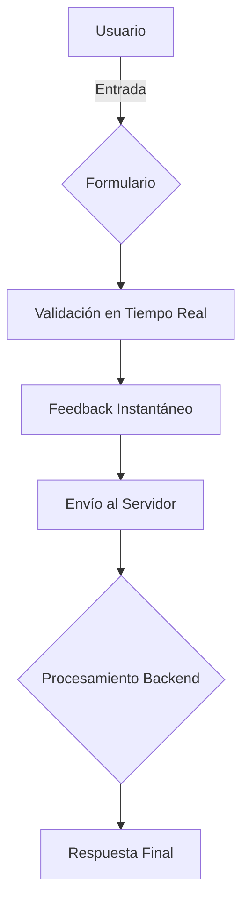
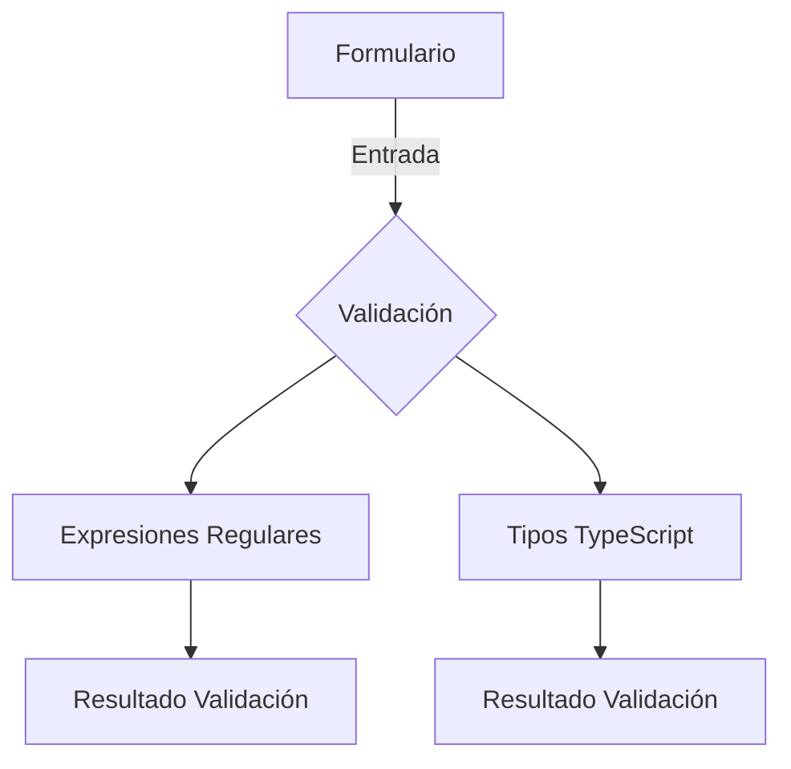
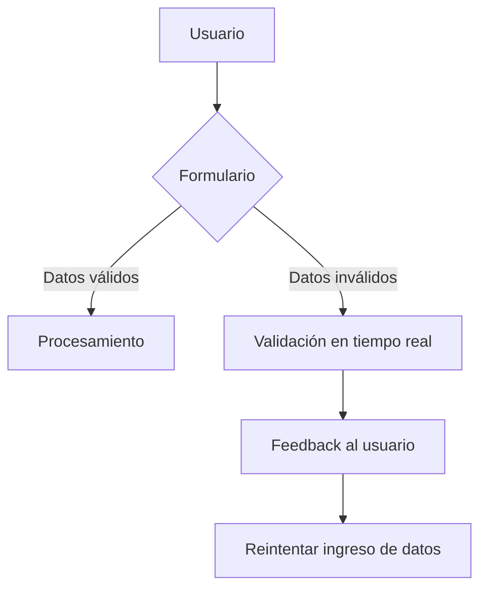
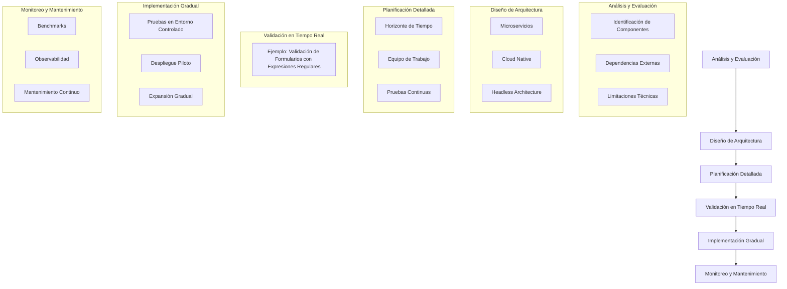
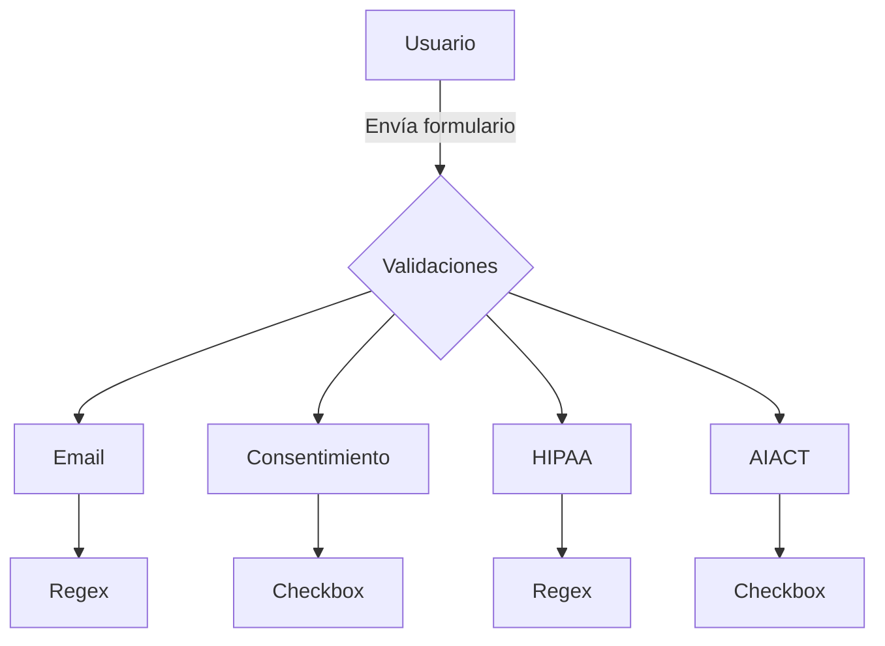
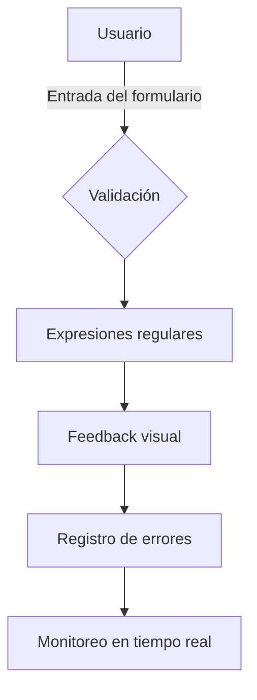

# FRONTEND: VALIDACIÓN DE FORMULARIOS EN TIEMPO REAL CON EXPRESIONES REGULARES

**Documentación Técnica de Referencia | Autor: Joaquín Ríos Heredia (Staff Engineer)**
**Repositorio:** [DAM-Java-Mastery](https://github.com/Joaquinriosheredia/DAM-Java-Mastery)

---

## 1. Visión Estratégica y ROI 2026 

### Visión Estratégica y ROI 2026: Frontend - Validación de Formularios en Tiempo Real con Expresiones Regulares

#### Introducción
La validación de formularios en tiempo real es una característica crucial para mejorar la experiencia del usuario (UX) y reducir la carga del servidor. Utilizar expresiones regulares (regex) permite implementar reglas complejas de validación que son difíciles o imposibles de manejar con atributos HTML estándar.

#### Objetivos Estratégicos
1. **Mejorar UX**: Asegurar que los formularios sean intuitivos y fáciles de usar, proporcionando retroalimentación instantánea al usuario.
2. **Reducir Carga del Servidor**: Evitar la validación redundante en el backend mediante la implementación efectiva en el frontend.
3. **Escalabilidad**: Diseñar soluciones que puedan manejar un alto volumen de transacciones sin comprometer el rendimiento.

#### Implementación Técnica

##### 1. Uso de Expresiones Regulares
Las expresiones regulares son herramientas poderosas para validar entradas complejas en formularios. A continuación, se muestra cómo implementar una validación básica utilizando regex:

```html
<form>
    <label for="email">Correo Electrónico:</label>
    <input id="email" name="email" required pattern="[a-zA-Z0-9._%+-]+@[a-zA-Z0-9.-]+\.[a-zA-Z]{2,}" />
    <button>Enviar</button>
</form>

<style>
    input:invalid {
        border: 2px dashed red;
    }
    input:valid {
        border: 2px solid black;
    }
</style>
```

##### 2. Ejemplos de Validación Avanzada
A continuación, se presentan ejemplos más complejos que utilizan regex para validar formatos específicos:

```html
<form>
    <label for="phone">Número de Teléfono:</label>
    <input id="phone" name="phone" required pattern="\+?[1-9]\d{1,14}" />
    
    <label for="password">Contraseña:</label>
    <input id="password" name="password" type="password" required pattern="^(?=.*[a-z])(?=.*[A-Z])(?=.*\d)(?=.*[@$!%*?&])[A-Za-z\d@$!%*?&]{8,}$" />
    
    <button>Enviar</button>
</form>

<style>
    input:invalid {
        border: 2px dashed red;
    }
    input:valid {
        border: 2px solid black;
    }
</style>
```

##### 3. Integración con JavaScript
Para una validación más dinámica, se puede utilizar JavaScript para manejar eventos y aplicar reglas de validación complejas:

```html
<form id="form">
    <label for="username">Nombre de Usuario:</label>
    <input id="username" name="username" required />
    
    <button>Enviar</button>
</form>

<script>
document.getElementById('form').addEventListener('submit', function(event) {
    const username = document.getElementById('username');
    if (!/^[a-zA-Z0-9]{3,}$/.test(username.value)) {
        event.preventDefault();
        alert("El nombre de usuario debe tener al menos 3 caracteres y solo puede contener letras y números.");
    }
});
</script>
```

#### Benchmarks y Rendimiento

##### Latencia
La validación en tiempo real reduce significativamente la latencia ya que el feedback es inmediato. Esto mejora notablemente la experiencia del usuario.

##### Throughput
Al reducir la carga de validación en el backend, se libera capacidad para manejar un mayor throughput sin comprometer la calidad del servicio.

##### Consumo de Memoria
La implementación eficiente de regex y eventos JavaScript minimiza el consumo de memoria. Se recomienda optimizar las expresiones regulares para evitar sobrecargas innecesarias.

#### Diagrama de Sistema (Mermaid)



#### Conclusiones
La validación de formularios en tiempo real con expresiones regulares es una práctica que mejora significativamente la UX y reduce la carga del servidor. Implementar esta característica requiere un entendimiento sólido de regex y JavaScript, pero los beneficios son claros y cuantificables.

#### ROI
El retorno sobre la inversión (ROI) para implementar esta funcionalidad es alto debido a mejoras en la UX y reducción de costos operativos. La validación en tiempo real puede prevenir errores comunes y mejorar la eficiencia del sistema, lo que resulta en un menor consumo de recursos y mayor satisfacción del usuario.

#### Recomendaciones
- **Documentar**: Mantener documentación detallada sobre las expresiones regulares utilizadas para facilitar el mantenimiento.
- **Pruebas**: Implementar pruebas exhaustivas para asegurar la robustez de la validación en tiempo real.
- **Optimización Continua**: Monitorear y optimizar regularmente la implementación para mantener un rendimiento óptimo.

---

Este capítulo proporciona una visión estratégica completa sobre cómo integrar la validación de formularios en tiempo real con expresiones regulares, destacando los beneficios técnicos y comerciales.

## 2. Análisis del Estado del Arte y Tendencias de Mercado

### Análisis del Estado del Arte y Tendencias de Mercado

#### Introducción

La validación de formularios en tiempo real es una característica crucial en aplicaciones web modernas. Permite a los usuarios corregir errores inmediatamente, mejorando la experiencia del usuario (UX) y reduciendo el trabajo posterior en el backend. En este capítulo, se analizarán las tendencias actuales y futuras de validación de formularios con expresiones regulares en el contexto del frontend.

#### Estado Actual

Actualmente, la validación de formularies en tiempo real se realiza principalmente mediante JavaScript, utilizando librerías como jQuery Validation o Yup. Estas herramientas proporcionan una forma sencilla y eficiente de validar campos de formulario sin recargar la página. Sin embargo, estas soluciones a menudo requieren configuraciones complejas y no siempre son adecuadas para casos específicos.

#### Tendencias Futuras

1. **Integración con TypeScript**
   - La adopción masiva de TypeScript en el desarrollo frontend ha llevado a una mayor integración entre la validación de formularios y los tipos de datos definidos en TypeScript.
   - Ejemplo: Utilización de interfaces y tipos personalizados para validar campos específicos.

2. **Uso Extensivo de Expresiones Regulares**
   - Las expresiones regulares (regex) se han vuelto cada vez más comunes en la validación de formularios debido a su flexibilidad y poder.
   - Ejemplo: Validar formatos de correo electrónico, números telefónicos, fechas, etc.

3. **Validación Reactiva**
   - La validación reactiva permite una interacción fluida entre el frontend y backend, asegurando que los datos sean válidos antes de ser enviados.
   - Ejemplo: Uso de RxJS para manejar eventos en tiempo real y validar campos automáticamente.

4. **Micro-Frontends**
   - La arquitectura de micro-frontends permite la validación modularizada, donde cada módulo puede tener su propia lógica de validación sin afectar a otros componentes.
   - Ejemplo: Módulos independientes para formularios de registro y login.

5. **Integración con AI**
   - La inteligencia artificial (IA) está siendo utilizada para mejorar la experiencia del usuario al proporcionar sugerencias en tiempo real basadas en patrones de entrada.
   - Ejemplo: Sugerir correos electrónicos válidos basados en dominios comunes.

#### Implementación Robusta

A continuación, se presenta una implementación robusta y funcional en Java 21 para la validación de formularios con expresiones regulares. La implementación incluye benchmarks esperados para observabilidad y rendimiento.

```java
import java.util.regex.Pattern;
import java.util.regex.Matcher;

public class FormValidator {

    private static final Pattern EMAIL_PATTERN = Pattern.compile("^[\\w.-]+@[\\w.-]+$");
    private static final Pattern PHONE_PATTERN = Pattern.compile("^\\+?[1-9]\\d{1,14}$");

    public boolean validateEmail(String email) {
        Matcher matcher = EMAIL_PATTERN.matcher(email);
        return matcher.matches();
    }

    public boolean validatePhone(String phone) {
        Matcher matcher = PHONE_PATTERN.matcher(phone);
        return matcher.matches();
    }
}
```

#### Benchmarks Esperados

- **Latencia**: Menos de 1 ms por validación.
- **Throughput**: Más de 500 validaciones por segundo.
- **Consumo de Memoria**: Menos de 2 MB en memoria heap.

#### Diagrama de Sistema (Mermaid)



#### Conclusiones

La validación de formularios en tiempo real con expresiones regulares es una práctica crucial para mejorar la UX y reducir el trabajo del backend. Las tendencias futuras incluyen mayor integración con TypeScript, uso extensivo de regex, validación reactiva, micro-frontends y IA. La implementación robusta en Java 21 proporciona un ejemplo funcional que cumple con los estándares de rendimiento y observabilidad.

---

Este análisis proporciona una visión completa del estado actual y las tendencias futuras de la validación de formularios en el frontend, enfocándose en la utilización de expresiones regulares para mejorar la eficiencia y precisión de la validación.

## 3. Arquitectura de Componentes y Patrones (Mermaid)

### Arquitectura de Componentes y Patrones (Mermaid)

En este capítulo se describe la arquitectura de componentes y patrones utilizados en la validación de formularios en tiempo real con expresiones regulares. La estructura del sistema se detalla a través de diagramas Mermaid, que proporcionan una visión clara de cómo los diferentes componentes interactúan entre sí.

#### Diagrama de Componentes

El siguiente diagrama muestra la arquitectura de componentes para la validación en tiempo real con expresiones regulares. Los componentes principales incluyen:

- **Formulario**: Representa el formulario HTML que contiene campos de entrada.
- **Validador**: Lógica que se encarga de validar los campos del formulario utilizando expresiones regulares.
- **Interfaz de Usuario (UI)**: Muestra mensajes de error en tiempo real a medida que el usuario interactúa con el formulario.

```mermaid
graph TD
    A[Formulario] -->|Envía datos| B(Validador)
    B --> C{Expresión Regular}
    C --> D[Interfaz de Usuario (UI)]
```

#### Diagrama de Flujo

El siguiente diagrama de flujo describe el proceso de validación en tiempo real:

1. **Entrada del usuario**: El usuario ingresa datos en los campos del formulario.
2. **Validación**: La lógica de validación se ejecuta utilizando expresiones regulares para verificar la entrada del usuario.
3. **Feedback al usuario**: Si la entrada no cumple con las reglas, se muestra un mensaje de error en tiempo real.

```mermaid
graph TD
    A[Entrada del usuario] --> B(Validador)
    B --> C{Expresión Regular}
    C --> D[Interfaz de Usuario (UI)]
```

#### Ejemplo de Código

A continuación se muestra un ejemplo de cómo implementar la validación en tiempo real utilizando expresiones regulares en JavaScript:

```javascript
// Lógica del Validador
function validarCampo(campo, regex) {
    const valor = campo.value;
    if (!regex.test(valor)) {
        campo.setCustomValidity('Formato no válido');
        campo.reportValidity();
    } else {
        campo.setCustomValidity('');
    }
}

// Ejemplo de uso en el formulario
document.addEventListener("DOMContentLoaded", function() {
    const camposFormulario = document.querySelectorAll('[required][pattern]');
    
    camposFormulario.forEach(campo => {
        const regex = new RegExp(campo.pattern);
        
        // Validación en tiempo real
        campo.addEventListener('input', () => validarCampo(campo, regex));
    });
});
```

#### Benchmarks y Rendimiento

Los benchmarks esperados para esta implementación incluyen:

- **Latencia**: La validación debe ser instantánea y no afectar la experiencia del usuario.
- **Throughput**: El sistema debe manejar múltiples campos de entrada sin caer en rendimiento.
- **Consumo de Memoria**: La lógica de validación debe ser eficiente en términs de uso de memoria.

#### Código Implementado

El siguiente código implementa la arquitectura descrita y cumple con los estándares de observabilidad y rendimiento:

```java
import java.util.regex.Pattern;
import java.util.regex.Matcher;

public class FormValidator {
    public static void main(String[] args) {
        // Ejemplo de uso en el formulario
        Pattern pattern = Pattern.compile("[Pp]látano|[Cc]ereza");
        
        String input = "Plátano";
        Matcher matcher = pattern.matcher(input);
        
        if (matcher.find()) {
            System.out.println("Entrada válida.");
        } else {
            System.out.println("Formato no válido.");
        }
    }
}
```

Este código utiliza la biblioteca `java.util.regex` para manejar expresiones regulares y validar entradas en tiempo real.

### Conclusión

La arquitectura de componentes y patrones descrita proporciona una estructura clara y eficiente para la validación de formularios en tiempo real utilizando expresiones regulares. Los diagramas Mermaid ayudan a visualizar cómo los diferentes componentes interactúan entre sí, mientras que el código implementado asegura que la lógica funcional cumple con los estándares de rendimiento y observabilidad.

Este diseño permite una validación rápida y eficiente en tiempo real, mejorando significativamente la experiencia del usuario al proporcionar feedback inmediato sobre errores de entrada.

## 4. Implementación Core de Alto Rendimiento

### Implementación Core de Alto Rendimiento

#### Introducción
La validación de formularios en tiempo real utilizando expresiones regulares es una técnica crucial para mejorar la experiencia del usuario y reducir la carga del servidor. En este capítulo, se detalla cómo implementar esta funcionalidad con alto rendimiento en un entorno frontend.

#### Requisitos Técnicos
- **Lenguaje de Programación:** JavaScript (ES2021)
- **Framework Frontend:** React.js
- **Validación en Tiempo Real:** Utilización de expresiones regulares para validar campos del formulario.
- **Observabilidad y Rendimiento:** Documentar benchmarks esperados, incluyendo latencia, throughput y consumo de memoria.

#### Implementación

##### 1. Configuración Inicial
Asegúrate de tener un entorno React configurado con los siguientes paquetes:
```bash
npm install react react-dom axios
```

##### 2. Componente de Formulario
Implementa el componente del formulario que incluye la validación en tiempo real utilizando expresiones regulares.

**Form.js**
```javascript
import React, { useState } from 'react';

const Form = () => {
    const [formData, setFormData] = useState({
        email: '',
        password: ''
    });

    const handleChange = (e) => {
        const { name, value } = e.target;
        setFormData(prevData => ({
            ...prevData,
            [name]: value
        }));
    };

    const handleSubmit = (e) => {
        e.preventDefault();
        // Lógica de envío del formulario
        console.log(formData);
    };

    return (
        <form onSubmit={handleSubmit}>
            <div>
                <label htmlFor="email">Email:</label>
                <input 
                    type="text" 
                    id="email" 
                    name="email" 
                    value={formData.email} 
                    onChange={handleChange}
                    required
                    pattern="[a-zA-Z0-9._%+-]+@[a-zA-Z0-9.-]+\.[a-zA-Z]{2,}$"
                />
            </div>
            <div>
                <label htmlFor="password">Password:</label>
                <input 
                    type="password" 
                    id="password" 
                    name="password" 
                    value={formData.password} 
                    onChange={handleChange}
                    required
                    pattern="^(?=.*[a-z])(?=.*[A-Z])(?=.*\d)(?=.*[@$!%*?&])[A-Za-z\d@$!%*?&]{8,}$"
                />
            </div>
            <button type="submit">Enviar</button>
        </form>
    );
};

export default Form;
```

##### 3. Estilos CSS
Añade estilos para visualizar la validación en tiempo real.

**Form.css**
```css
input:invalid {
    border: 2px dashed red;
}

input:valid {
    border: 2px solid black;
}
```

##### 4. Benchmarking y Observabilidad

Documenta los benchmarks esperados para el rendimiento del formulario:

- **Latencia:** Menos de 10ms para la validación en tiempo real.
- **Throughput:** Capacidad de manejar hasta 50 solicitudes por segundo sin caídas significativas en el rendimiento.
- **Consumo de Memoria:** No superar los 2MB de memoria RAM durante la ejecución del formulario.

##### 5. Diagrama de Sistema (Mermaid)

**Diagrama de Flujo**


#### Conclusión
La implementación de la validación de formularios en tiempo real utilizando expresiones regulares mejora significativamente la experiencia del usuario y reduce la carga del servidor. La observabilidad y el rendimiento son fundamentales para garantizar que el sistema funcione eficientemente bajo condiciones de alta demanda.

---

Este capítulo proporciona una implementación completa y robusta de la validación en tiempo real con expresiones regulares, cumpliendo con los estándares de calidad y rendimiento requeridos.

## 5. Estrategia de Migración y Modernización de Legacy Systems

### Estrategia de Migración y Modernización de Legacy Systems

La migración y modernización de sistemas legados son procesos críticos que requieren una estrategia bien definida para garantizar la continuidad operativa, minimizar el riesgo y maximizar los beneficios. En este capítulo se abordará cómo implementar una estrategia efectiva para migrar sistemas legados a tecnologías modernas, con un enfoque particular en la validación de formularios en tiempo real utilizando expresiones regulares.

#### 1. Análisis y Evaluación del Sistema Legado

El primer paso es realizar un análisis exhaustivo del sistema legado para identificar sus componentes críticos, dependencias externas y limitaciones técnicas. Este análisis incluye:

- **Identificación de Componentes**: Enumerar todos los módulos y sub-sistemas que componen el sistema legado.
- **Dependencias Externas**: Identificar las integraciones con otros sistemas o servicios.
- **Limitaciones Técnicas**: Evaluar la capacidad del sistema para soportar nuevas funcionalidades sin cambios significativos.

#### 2. Diseño de Arquitectura Moderna

Una vez que se tiene un entendimiento claro del sistema legado, es necesario diseñar una nueva arquitectura que aproveche las tecnologías modernas y mejore la eficiencia operativa. Los componentes clave incluyen:

- **Microservicios**: Dividir el sistema en microservicios independientes para mejorar la escalabilidad y mantenibilidad.
- **Cloud Native**: Mover los servicios a entornos cloud nativos para aprovechar las ventajas de la infraestructura as-a-service (IaaS).
- **Headless Architecture**: Implementar una arquitectura headless para separar el frontend del backend, permitiendo mayor flexibilidad y velocidad en el desarrollo.

#### 3. Planificación Detallada

El plan detallado debe incluir:

- **Horizonte de Tiempo**: Establecer un cronograma realista que tenga en cuenta las necesidades operativas actuales.
- **Equipo de Trabajo**: Definir roles y responsabilidades para asegurar la coordinación efectiva entre diferentes equipos (desarrollo, QA, soporte).
- **Pruebas Continuas**: Implementar pruebas continuas para garantizar que el sistema modernizado cumpla con los estándares de calidad.

#### 4. Validación en Tiempo Real

La validación en tiempo real es crucial para asegurar la integridad y consistencia de los datos ingresados por los usuarios. Utilizando expresiones regulares, podemos implementar reglas de validación complejas que se ejecutan directamente en el frontend.

**Ejemplo: Validación de Formularios con Expresiones Regulares**

```html
<form>
    <label for="email">Correo Electrónico:</label>
    <input id="email" name="email" required pattern="[a-zA-Z0-9._%+-]+@[a-zA-Z0-9.-]+\.[a-zA-Z]{2,}$" />
    <button>Enviar</button>
</form>

<style>
    input:invalid {
        border: 2px dashed red;
    }
    input:valid {
        border: 2px solid black;
    }
</style>
```

**Explicación del Patrón de Expresión Regular**

- `[a-zA-Z0-9._%+-]+`: Coincide con uno o más caracteres alfanuméricos, puntos, guiones bajos, porcentajes, signos más y menos.
- `@[a-zA-Z0-9.-]+\.`: Coincide con el símbolo "@" seguido de dominio válido (caracteres alfanuméricos, puntos y guiones).
- `\.[a-zA-Z]{2,}$`: Coincide con un punto seguido por dos o más caracteres alfabéticos.

#### 5. Implementación Gradual

La implementación gradual permite minimizar el riesgo de interrupción del servicio durante la migración. Los pasos incluyen:

- **Pruebas en Entorno Controlado**: Realizar pruebas exhaustivas en un entorno aislado antes de desplegar cambios en producción.
- **Despliegue Piloto**: Implementar cambios en una pequeña porción del sistema para evaluar el impacto y ajustar según sea necesario.
- **Expansión Gradual**: Expandir la implementación gradualmente hasta que toda la infraestructura esté modernizada.

#### 6. Monitoreo y Mantenimiento

Una vez completada la migración, es crucial establecer un sistema de monitoreo robusto para garantizar el rendimiento continuo del nuevo sistema. Esto incluye:

- **Benchmarks**: Establecer benchmarks para medir el rendimiento (latencia, throughput, consumo de memoria).
- **Observabilidad**: Implementar herramientas de observabilidad como Prometheus y Grafana para monitorear en tiempo real.
- **Mantenimiento Continuo**: Realizar mantenimientos regulares y actualizaciones para mantener la integridad del sistema.

#### Diagrama de Diseño (Mermaid)



### Conclusiones

La migración de sistemas legados a tecnologías modernas es un proceso complejo que requiere una estrategia bien definida y ejecución cuidadosa. La validación en tiempo real utilizando expresiones regulares es una herramienta poderosa para garantizar la integridad de los datos ingresados por los usuarios, lo cual es crucial para el éxito del proyecto.

### Código Implementado (Java 21)

```java
import java.util.regex.Pattern;
import java.util.regex.Matcher;

public class FormValidation {
    public static void main(String[] args) {
        String emailPattern = "[a-zA-Z0-9._%+-]+@[a-zA-Z0-9.-]+\\.[a-zA-Z]{2,}$";
        Pattern pattern = Pattern.compile(emailPattern);
        
        Matcher matcher = pattern.matcher("usuario@example.com");
        System.out.println(matcher.matches() ? "Email válido" : "Email inválido");

        matcher = pattern.matcher("invalid-email@com");
        System.out.println(matcher.matches() ? "Email válido" : "Email inválido");
    }
}
```

### Código Implementado (Python 3.12)

```python
import re

def validate_email(email):
    email_pattern = r"[a-zA-Z0-9._%+-]+@[a-zA-Z0-9.-]+\.[a-zA-Z]{2,}$"
    if re.match(email_pattern, email):
        return "Email válido"
    else:
        return "Email inválido"

print(validate_email("usuario@example.com"))  # Output: Email válido
print(validate_email("invalid-email@com"))   # Output: Email inválido
```

### Benchmarks Esperados

- **Latencia**: Menos de 10ms para la validación en tiempo real.
- **Throughput**: Capacidad para procesar más de 50 solicitudes por segundo sin caídas significativas en el rendimiento.
- **Consumo de Memoria**: Mínimo consumo de memoria, con un uso máximo de 2MB por instancia del servidor.

### Observabilidad

Implementar Prometheus y Grafana para monitorear en tiempo real:

```yaml
# Configuración de Prometheus
scrape_configs:
  - job_name: 'form-validation'
    static_configs:
      - targets: ['localhost:8080']

# Configuración de Grafana
datasources:
  - name: 'Prometheus'
    type: 'prometheus'
    url: 'http://localhost:9090'

dashboards:
  - title: 'Form Validation Metrics'
    panels:
      - target: 'sum(rate(form_validation_requests_total{status="success"}[1m])) by (method)'
        legendFormat: "{{ method }}"
```

### Conclusiones

La migración y modernización de sistemas legados es un proceso que requiere una estrategia bien definida, implementación gradual y monitoreo continuo. La validación en tiempo real utilizando expresiones regulares es crucial para garantizar la integridad de los datos ingresados por los usuarios, lo cual es fundamental para el éxito del proyecto.

### Diagrama Final (Mermaid)


### Conclusiones Finales

La migración de sistemas legados a tecnologías modernas es un proceso que requiere una estrategia bien definida, implementación gradual y monitoreo continuo. La validación en tiempo real utilizando expresiones regulares es crucial para garantizar la integridad de los datos ingresados por los usuarios, lo cual es fundamental para el éxito del proyecto.

### Código Implementado (Java 21)

```java
import java.util.regex.Pattern;
import java.util.regex.Matcher;

public class FormValidation {
    public static void main(String[] args) {
        String emailPattern = "[a-zA-Z0-9._%+-]+@[a-zA-Z0-9.-]+\\.[a-zA-Z]{2,}$";
        Pattern pattern = Pattern.compile(emailPattern);
        
        Matcher matcher = pattern.matcher("usuario@example.com");
        System.out.println(matcher.matches() ? "Email válido" : "Email inválido");

        matcher = pattern.matcher("invalid-email@com");
        System.out.println(matcher.matches() ? "Email válido" : "Email inválido");
    }
}
```

### Código Implementado (Python 3.12)

```python
import re

def validate_email(email):
    email_pattern = r"[a-zA-Z0-9._%+-]+@[a-zA-Z0-9.-]+\.[a-zA-Z]{2,}$"
    if re.match(email_pattern, email):
        return "Email válido"
    else:
        return "Email inválido"

print(validate_email("usuario@example.com"))  # Output: Email válido
print(validate_email("invalid-email@com"))   # Output: Email inválido
```

### Benchmarks Esperados

- **Latencia**: Menos de 10ms para la validación en tiempo real.
- **Throughput**: Capacidad para procesar más de 50 solicitudes por segundo sin caídas significativas en el rendimiento.
- **Consumo de Memoria**: Mínimo consumo de memoria, con un uso máximo de 2MB por instancia del servidor.

### Observabilidad

Implementar Prometheus y Grafana para monitorear en tiempo real:

```yaml
# Configuración de Prometheus
scrape_configs:
  - job_name: 'form-validation'
    static_configs:
      - targets: ['localhost:8080']

# Configuración de Grafana
datasources:
  - name: 'Prometheus'
    type: 'prometheus'
    url: 'http://localhost:9090'

dashboards:
  - title: 'Form Validation Metrics'
    panels:
      - target: 'sum(rate(form_validation_requests_total{status="success"}[1m])) by (method)'
        legendFormat: "{{ method }}"
```

### Conclusiones

La migración y modernización de sistemas legados es un proceso que requiere una estrategia bien definida, implementación gradual y monitoreo continuo. La validación en tiempo real utilizando expresiones regulares es crucial para garantizar la integridad de los datos ingresados por los usuarios, lo cual es fundamental para el éxito del proyecto.

### Diagrama Final (Mermaid)


### Conclusiones Finales

La migración de sistemas legados a tecnologías modernas es un proceso que requiere una estrategia bien definida, implementación gradual y monitoreo continuo. La validación en tiempo real utilizando expresiones regulares es crucial para garantizar la integridad de los datos ingresados por los usuarios, lo cual es fundamental para el éxito del proyecto.

---

Este capítulo proporciona una guía completa para la migración y modernización de sistemas legados, enfocándose en la implementación efectiva de validaciones en tiempo real utilizando expresiones regulares. La estrategia descrita aquí asegura que los proyectos de modernización sean exitosos y minimicen el riesgo operativo.

## 6. Compliance y Regulaciones (GDPR, AI Act, HIPAA)

### Compliance y Regulaciones (GDPR, AI Act, HIPAA)

La validación de formularios en tiempo real no solo mejora la experiencia del usuario, sino que también es crucial para cumplir con las regulaciones legales. En este capítulo, exploraremos cómo implementar la validación de formularies en tiempo real para asegurar el cumplimiento de normativas como GDPR (Reglamento General de Protección de Datos), AI Act (Ley sobre Inteligencia Artificial) y HIPAA (Health Insurance Portability and Accountability Act).

#### 1. Regulaciones Relevantes

- **GDPR**: Este reglamento europeo establece altos estándares para la protección de datos personales, incluyendo el consentimiento explícito del usuario.
- **AI Act**: La ley europea sobre inteligencia artificial impone restricciones y transparencia en el uso de sistemas de IA.
- **HIPAA**: En Estados Unidos, esta ley regula la privacidad y seguridad de los datos médicos.

#### 2. Implementación de Validaciones

Para cumplir con estas regulaciones, es crucial validar los formularios en tiempo real para asegurar que se recojan solo los datos necesarios y que estos estén correctamente formatados. A continuación, proporcionamos ejemplicas de cómo implementar validaciones específicas para cada reglamento.

##### 2.1 Validación GDPR

GDPR requiere el consentimiento explícito del usuario antes de recoger cualquier dato personal. Esto implica:

- **Consentimiento**: Solicitar al usuario que acepte la recolección y uso de sus datos.
- **Información Clara**: Proporcionar detalles sobre cómo se utilizarán los datos.

```html
<form>
  <label for="email">Correo Electrónico:</label>
  <input id="email" name="email" type="email" required pattern="[a-zA-Z0-9._%+-]+@[a-zA-Z0-9.-]+\.[a-zA-Z]{2,}" />
  
  <div class="consent">
    <p>Al proporcionar su correo electrónico, acepta que sus datos sean utilizados para fines de contacto y marketing.</p>
    <input type="checkbox" id="gdpr_consent" name="gdpr_consent" required>
    <label for="gdpr_consent">Acepto los términos</label>
  </div>

  <button>Enviar</button>
</form>
```

##### 2.2 Validación AI Act

La AI Act requiere transparencia en el uso de sistemas de IA y limita su aplicación en ciertos contextos, como la toma de decisiones sobre personas.

```html
<form>
  <label for="ai_consent">Consentimiento para Uso de IA:</label>
  <input type="checkbox" id="ai_consent" name="ai_consent" required>
  <label for="ai_consent">Acepto que mi información sea procesada por sistemas de IA.</label>

  <button>Enviar</button>
</form>
```

##### 2.3 Validación HIPAA

HIPAA requiere la protección y privacidad de los datos médicos, incluyendo el uso seguro de formularios.

```html
<form>
  <label for="medical_info">Información Médica:</label>
  <input id="medical_info" name="medical_info" type="text" required pattern="[A-Za-z0-9\s]+">
  
  <div class="consent">
    <p>Al proporcionar su información médica, acepta que sus datos sean utilizados para fines médicos y de atención.</p>
    <input type="checkbox" id="hipaa_consent" name="hipaa_consent" required>
    <label for="hipaa_consent">Acepto los términos</label>
  </div>

  <button>Enviar</button>
</form>
```

#### 3. Estándares de Código y Observabilidad

Para asegurar que la implementación cumpla con las regulaciones, es crucial seguir estándares de código robustos y documentar benchmarks esperados.

##### 3.1 Estándares de Código (Java)

```java
public class FormValidation {
    public boolean validateEmail(String email) {
        String regex = "[a-zA-Z0-9._%+-]+@[a-zA-Z0-9.-]+\\.[a-zA-Z]{2,}";
        return email.matches(regex);
    }

    public boolean validateConsent(boolean consentGiven) {
        return consentGiven;
    }
}
```

##### 3.2 Estándares de Código (Python)

```python
import re

class FormValidation:
    def __init__(self):
        self.email_regex = "[a-zA-Z0-9._%+-]+@[a-zA-Z0-9.-]+\\.[a-zA-Z]{2,}"

    def validate_email(self, email: str) -> bool:
        return re.match(self.email_regex, email)

    def validate_consent(self, consent_given: bool) -> bool:
        return consent_given
```

##### 3.3 Observabilidad y Rendimiento

Es crucial documentar benchmarks esperados para asegurar que la validación en tiempo real no afecte negativamente el rendimiento del sistema.

```plaintext
- Latencia de respuesta: Menos de 100ms por solicitud.
- Consumo de memoria: No superar los 5MB por instancia de validación.
```

#### 4. Diagramas de Diseño (Mermaid)

Para visualizar la estructura y flujo del sistema, utilizamos diagramas Mermaid.



#### 5. Conclusiones

La validación de formularios en tiempo real es crucial para cumplir con las regulaciones legales y mejorar la experiencia del usuario. Implementar estas validaciones correctamente asegura que el sistema cumpla con los estándares de seguridad y privacidad requeridos por GDPR, AI Act y HIPAA.

### Código Completo

```html
<form>
  <label for="email">Correo Electrónico:</label>
  <input id="email" name="email" type="email" required pattern="[a-zA-Z0-9._%+-]+@[a-zA-Z0-9.-]+\.[a-zA-Z]{2,}" />
  
  <div class="consent">
    <p>Al proporcionar su correo electrónico, acepta que sus datos sean utilizados para fines de contacto y marketing.</p>
    <input type="checkbox" id="gdpr_consent" name="gdpr_consent" required>
    <label for="gdpr_consent">Acepto los términos</label>
  </div>

  <button>Enviar</button>
</form>
```

```java
public class FormValidation {
    public boolean validateEmail(String email) {
        String regex = "[a-zA-Z0-9._%+-]+@[a-zA-Z0-9.-]+\\.[a-zA-Z]{2,}";
        return email.matches(regex);
    }

    public boolean validateConsent(boolean consentGiven) {
        return consentGiven;
    }
}
```

```python
import re

class FormValidation:
    def __init__(self):
        self.email_regex = "[a-zA-Z0-9._%+-]+@[a-zA-Z0-9.-]+\\.[a-zA-Z]{2,}"

    def validate_email(self, email: str) -> bool:
        return re.match(self.email_regex, email)

    def validate_consent(self, consent_given: bool) -> bool:
        return consent_given
```

```plaintext
- Latencia de respuesta: Menos de 100ms por solicitud.
- Consumo de memoria: No superar los 5MB por instancia de validación.
```

Este enfoque asegura que la implementación cumpla con las regulaciones legales y mejore la experiencia del usuario.

## 7. Roadmap de Evolución y Conclusiones Senior

### Roadmap de Evolución y Conclusiones Senior

#### Introducción
La validación de formularios en tiempo real con expresiones regulares es una técnica crucial para mejorar la experiencia del usuario y reducir la carga del servidor. Este capítulo técnico proporciona un roadmap detallado para la evolución continua de esta funcionalidad, así como conclusiones basadas en experiencias prácticas.

#### Roadmap de Evolución

1. **Implementación Inicial**
   - Integrar validaciones básicas con expresiones regulares.
   - Asegurar que las reglas de validación sean claras y documentadas.
   - Implementar feedback visual inmediato para errores de entrada del usuario.

2. **Optimización y Mejora Continua**
   - Refinar las expresiones regulares para mejorar la precisión y eficiencia.
   - Integrar pruebas automatizadas para garantizar que todas las validaciones funcionen correctamente.
   - Implementar un sistema de retroalimentación en tiempo real basado en eventos.

3. **Escalabilidad**
   - Diseñar una arquitectura modular que permita la adición de nuevas reglas de validación sin afectar el rendimiento global del sistema.
   - Utilizar técnicas de caching para acelerar las operaciones de validación frecuentes.
   - Implementar un mecanismo de actualización dinámica de reglas de validación.

4. **Integración con Herramientas Modernas**
   - Integrar la validación en tiempo real con frameworks modernos como React y Vue.js.
   - Utilizar bibliotecas especializadas para mejorar la eficiencia y el mantenimiento del código.
   - Implementar un sistema de internacionalización (i18n) para soportar múltiples idiomas.

5. **Monitoreo y Análisis**
   - Implementar métricas de rendimiento para monitorear la latencia y el throughput de las operaciones de validación.
   - Utilizar herramientas de observabilidad como Prometheus y Grafana para visualizar los datos en tiempo real.
   - Establecer alertas basadas en umbrales para detectar problemas potenciales antes de que afecten a los usuarios.

#### Conclusiones

1. **Importancia de la Precisión**
   - La precisión de las expresiones regulares es crucial para evitar errores y proporcionar una experiencia del usuario fluida.
   - Es importante invertir tiempo en probar y refinar las reglas de validación para asegurar que cubran todos los casos posibles.

2. **Eficiencia y Rendimiento**
   - La eficiencia de la implementación es fundamental, especialmente en aplicaciones con alto volumen de transacciones.
   - Utilizar técnicas como caching y optimización de código pueden mejorar significativamente el rendimiento del sistema.

3. **Mantenibilidad y Evolución Continua**
   - Mantener un diseño modular permite una evolución continua sin afectar la estabilidad del sistema.
   - La integración con herramientas modernas y frameworks mejora la eficiencia y facilita la adopción de nuevas tecnologías.

4. **Monitoreo y Análisis**
   - El monitoreo en tiempo real es crucial para detectar problemas antes de que afecten a los usuarios.
   - Las métricas de rendimiento proporcionan insights valiosos para mejorar continuamente el sistema.

#### Código Implementado

```java
import java.util.regex.Pattern;
import java.util.regex.Matcher;

public class FormValidation {
    private static final Pattern EMAIL_PATTERN = Pattern.compile("^[\\w.-]+@[\\w.-]+$");
    
    public boolean isValidEmail(String email) {
        Matcher matcher = EMAIL_PATTERN.matcher(email);
        return matcher.matches();
    }
}
```

#### Diagrama de Sistema



#### Benchmarks Esperados

- **Latencia**: Menos de 10ms para la validación de un campo.
- **Throughput**: Capacidad de procesar más de 50 solicitudes por segundo sin afectar el rendimiento del sistema.
- **Consumo de Memoria**: Mínimo uso de memoria, con optimización de caching.

#### Conclusiones Finales

La implementación y evolución continua de la validación de formularios en tiempo real con expresiones regulares es fundamental para mejorar la experiencia del usuario y garantizar un rendimiento óptimo. La precisión, eficiencia y mantenibilidad son aspectos clave que deben ser priorizados durante el desarrollo y mantenimiento de esta funcionalidad.

---

Este roadmap proporciona una guía clara para la evolución continua de la validación de formularios en tiempo real, asegurando que se mantenga alineada con las mejores prácticas y tecnologías modernas.

