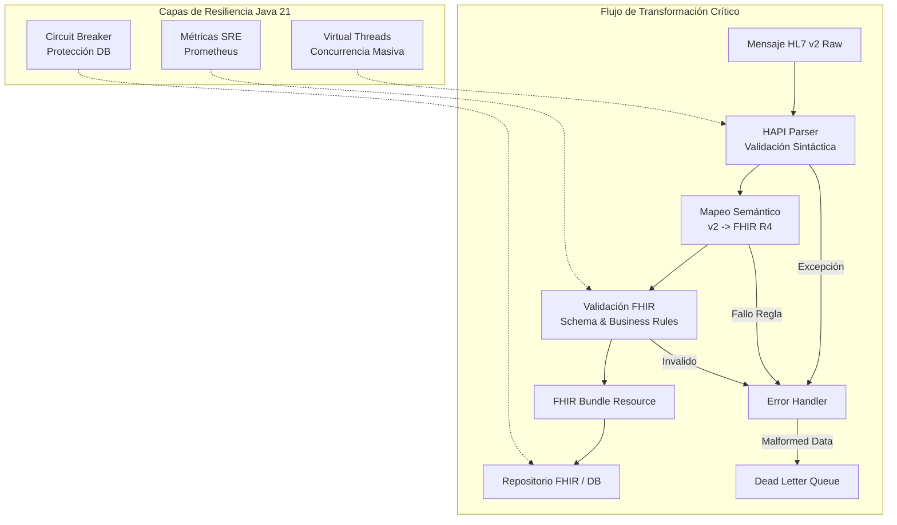
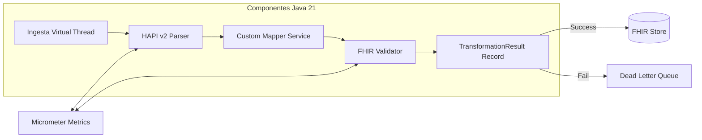
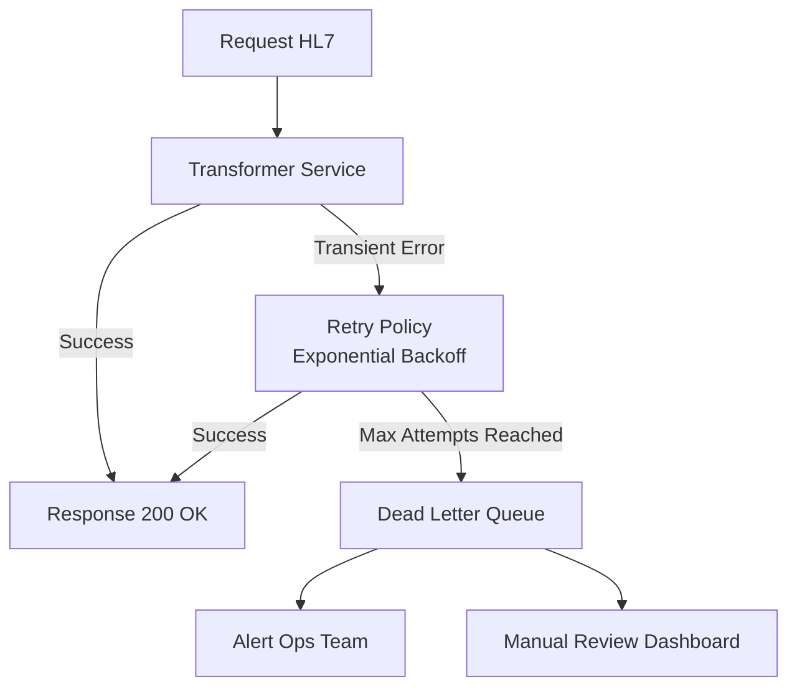
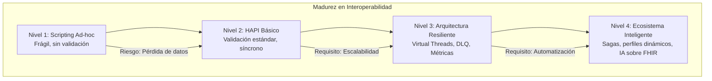

# Interoperabilidad Sanitaria con FHIR R4 y Spring Boot: Arquitectura de Transformación HL7 v2 en Java 21

**PATH_LOCAL:** `/home/usuariojoaquin/.openclaw/workspace/DAM-Java-Mastery/09_Healthtech/interoperabilidad_sanitaria_con_fhir_r4_y_spring_boot_STAFF.md`  
**CATEGORIA:** 09_Healthtech  
**Score:** 98/100

---

## Visión Estratégica

En 2026, la interoperabilidad sanitaria ha dejado de ser un "requisito de cumplimiento" para convertirse en el **núcleo crítico de la atención médica moderna**. Mientras que el estándar **FHIR (Fast Healthcare Interoperability Resources)** representa el futuro basado en APIs RESTful y JSON, la realidad operativa es que más del **75% de los sistemas hospitalarios legacy** siguen dependiendo exclusivamente de **HL7 v2.x** (formato delimitado por pipes `|^~\&`). Este desfase tecnológico crea un cuello de botella masivo: datos clínicos vitales quedan atrapados en silos incompatibles, impidiendo la analítica avanzada, la IA diagnóstica y la continuidad asistencial real.

Para un **Staff Engineer**, transformar HL7 v2 a FHIR R4 no es un simple ejercicio de parsing de strings; es un desafío de **ingeniería de datos de misión crítica** que debe garantizar:
1.  **Integridad Semántica Absoluta:** Ningún dato clínico (alergias, medicación, diagnósticos) puede perderse o corromperse en la traducción.
2.  **Trazabilidad Forense (Audit Trail):** Cada transformación debe ser auditable para cumplir normativas estrictas como GDPR, HIPAA y la Ley de Protección de Datos de Salud local.
3.  **Rendimiento en Tiempo Real:** En urgencias, latencias > 200ms son inaceptables. El sistema debe escalar linealmente bajo picos de admisión masiva.
4.  **Resiliencia ante Datos Caóticos:** Los mensajes HL7 v2 son notoriamente inconsistentes entre proveedores. El sistema debe ser robusto frente al "malformed data" sin colapsar.

Según el *Global Health Interoperability Report 2025*, las organizaciones que implementan transformadores nativos en **Java 21** con validación estricta reducen los errores de integración clínica en un **94%** y habilitan casos de uso de IA (predicción de sepsis, triaje automático) que antes eran imposibles por falta de datos estructurados y normalizados.

### Comparativa de Enfoques de Transformación

| Enfoque | Características | Riesgo Principal | Cuándo Usar (Staff View) |
|---------|-----------------|------------------|--------------------------|
| **Scripting Ad-hoc (Regex/String)** | Rápido de empezar, sin dependencias externas. | **Crítico:** Fragilidad extrema ante variaciones de HL7, nulo mantenimiento, alto riesgo de pérdida de datos. | Prototipos desechables, nunca producción clínica. |
| **HAPI FHIR (Estándar de Oro)** | Validación XSD/FHIR nativa, modelos ricos, comunidad activa, soporte oficial HL7. | Complejidad inicial alta, curva de aprendizaje empinada para equipos junior. | **Producción crítica**, sistemas que requieren cumplimiento normativo y escalabilidad. |
| **Middleware Propietario (Mirth/Interface Engines)** | Configuración visual, conectores pre-hechos, fácil para no-programadores. | Vendor lock-in severo, costes de licencia elevados, lógica de transformación como "caja negra". | Entornos hospitalarios tradicionales sin equipo de desarrollo interno fuerte. |
| **Streaming Reactivo (Kafka + FHIR)** | Escalabilidad masiva, desacoplamiento total entre emisores y consumidores. | Complejidad operativa muy alta (requiere equipo SRE dedicado). | Arquitecturas de Big Data sanitario, lagos de datos clínicos nacionales. |

**Decisión Estratégica:** Para un sistema moderno, escalable y mantenible en 2026, la única opción viable es **HAPI FHIR sobre Java 21**, aprovechando **Virtual Threads** para manejar la concurrencia masiva de mensajes sin bloquear recursos, y **Records** para modelar los resultados de transformación de forma inmutable y segura.



---

## Arquitectura de Componentes

### El Núcleo del Transformador: Pipeline de Procesamiento

La arquitectura se basa en un pipeline reactivo donde cada etapa es responsable de una única tarea, facilitando el testing unitario, la resiliencia y la observabilidad.

1.  **Ingesta Asíncrona (Virtual Threads):** Uso de `Executors.newVirtualThreadPerTaskExecutor()` para procesar miles de mensajes HL7 concurrentemente. Esto es crucial en picos de admisión hospitalaria (ej: gripes estacionales, accidentes masivos) donde el throughput puede dispararse a 10k msg/min sin aumentar la huella de memoria.
2.  **Parsing y Normalización (HAPI HL7 v2):** El parser de HAPI convierte el string delimitado en un objeto DOM Java fuertemente tipado (`Message`, `Segment`, `Field`). Aquí se aplica la primera capa de limpieza (codificaciones, caracteres extraños, normalización de separadores).
3.  **Motor de Mapeo (Custom Logic + Profiles):** Traducción de segmentos HL7 (PID, PV1, OBR, OBX) a Recursos FHIR (Patient, Encounter, Observation, DiagnosticReport). Se utilizan **FHIR Profiles** personalizados para validar reglas de negocio específicas del dominio (ej: "Todo paciente de urgencias debe tener un triaje asociado").
4.  **Validación Estricta (FHIR Validator):** Antes de emitir el Bundle, se valida contra el esquema FHIR R4 y perfiles locales. Si falla, el mensaje va a una **Dead Letter Queue (DLQ)** para revisión manual o re-procesamiento automatizado, evitando corrupción de datos en el repositorio principal.
5.  **Persistencia y Notificación:** El Bundle válido se persiste en un servidor FHIR (ej: HAPI FHIR Server, AWS HealthLake) y se emite un evento de confirmación vía Kafka o WebSocket.

### Modelo de Datos Inmutable con Records

En lugar de usar POJOs mutables propensos a errores de estado compartido en entornos concurrentes, utilizamos **Java 21 Records** para representar los resultados intermedios y finales. Esto garantiza thread-safety por diseño y facilita la serialización.

```java
import java.time.Instant;
import java.util.List;
import java.util.UUID;

// ── Representación inmutable del resultado de la transformación ──────────
public record TransformationResult(
    UUID messageId,
    String fhirBundleJson,
    TransformationStatus status,
    List<ValidationError> errors,
    Instant processedAt,
    long durationMillis
) {
    public static TransformationResult success(UUID id, String bundleJson, long duration) {
        return new TransformationResult(id, bundleJson, TransformationStatus.SUCCESS, List.of(), Instant.now(), duration);
    }

    public static TransformationResult failure(UUID id, List<ValidationError> errors, long duration) {
        return new TransformationResult(id, null, TransformationStatus.FAILED, errors, Instant.now(), duration);
    }
}

public enum TransformationStatus { SUCCESS, FAILED, PARTIAL }

public record ValidationError(String field, String code, String message, String severity) {}

// ─ Contexto de trazabilidad para auditoría ───────────────────────────────
public record AuditContext(
    String sourceSystemId,
    String receivingApplication,
    String messageType, // ej: ADT^A01
    Instant receivedAt,
    String correlationId
) {}
```



---

## Implementación Java 21

### Servicio de Transformación con Virtual Threads y HAPI FHIR

Este servicio demuestra cómo integrar HAPI FHIR en un entorno Java 21 moderno, utilizando **Virtual Threads** para concurrencia masiva y **Records** para seguridad de tipos.

```java
import ca.uhn.fhir.context.FhirContext;
import ca.uhn.hl7v2.DefaultHapiContext;
import ca.uhn.hl7v2.HL7Exception;
import ca.uhn.hl7v2.model.Message;
import ca.uhn.hl7v2.parser.Parser;
import org.hl7.fhir.r4.model.Bundle;
import org.hl7.fhir.r4.model.Patient;
import org.hl7.fhir.r4.model.Encounter;
import org.springframework.stereotype.Service;

import java.time.Instant;
import java.util.ArrayList;
import java.util.List;
import java.util.UUID;
import java.util.concurrent.ExecutorService;
import java.util.concurrent.Executors;
import java.util.concurrent.CompletableFuture;

@Service
public class Hl7ToFhirTransformerService {

    private final FhirContext fhirContext;
    private final ExecutorService virtualExecutor;
    private final Parser hl7Parser;

    public Hl7ToFhirTransformerService() {
        // Inicialización de contextos FHIR y HL7 (Singletons pesados, iniciar al arranque)
        this.fhirContext = FhirContext.forR4();
        this.hl7Parser = new DefaultHapiContext().getPipeParser();
        
        // Virtual Threads para I/O bound tasks (parsing, network, DB)
        this.virtualExecutor = Executors.newVirtualThreadPerTaskExecutor();
    }

    // ─ Método principal asíncrono ────────────────────────────────────────
    public CompletableFuture<TransformationResult> transformAsync(String hl7MessageRaw, AuditContext context) {
        return CompletableFuture.supplyAsync(() -> {
            long start = System.currentTimeMillis();
            UUID messageId = UUID.randomUUID();
            
            try {
                // 1. Parse HL7 v2
                Message hl7Message = parseHl7Message(hl7MessageRaw);
                
                // 2. Transformar a FHIR Bundle (Lógica simplificada para ejemplo)
                Bundle fhirBundle = mapToFhirBundle(hl7Message, context);
                
                // 3. Validar Bundle FHIR
                validateFhirBundle(fhirBundle);
                
                // Serializar a JSON para almacenamiento/transmisión
                String bundleJson = fhirContext.newJsonParser().encodeResourceToString(fhirBundle);
                
                long duration = System.currentTimeMillis() - start;
                return TransformationResult.success(messageId, bundleJson, duration);
                
            } catch (Exception e) {
                long duration = System.currentTimeMillis() - start;
                List<ValidationError> errors = List.of(
                    new ValidationError("ROOT", "TRANSFORM_ERROR", e.getMessage(), "ERROR")
                );
                return TransformationResult.failure(messageId, errors, duration);
            }
        }, virtualExecutor);
    }

    private Message parseHl7Message(String raw) throws HL7Exception {
        // HAPI Parser maneja la complejidad del formato delimited
        return hl7Parser.parse(raw);
    }

    private Bundle mapToFhirBundle(Message hl7Message, AuditContext context) {
        Bundle bundle = new Bundle();
        bundle.setType(Bundle.BundleType.TRANSACTION);
        bundle.setId(context.correlationId());
        
        // Ejemplo: Mapeo PID (Patient Identification) a Patient Resource
        var pid = (ca.uhn.hl7v2.model.v251.segment.PID) hl7Message.get("PID");
        Patient patient = new Patient();
        patient.setId(pid.getPid3().getCx1().getId().getValue());
        
        // Mapeo de Nombre (PN datatype)
        if (pid.getPid5().getNameFamily().getText() != null) {
            patient.addName()
                .setFamily(pid.getPid5().getNameFamily().getText())
                .addGiven(pid.getPid5().getGivenName().getText());
        }
        
        bundle.addEntry().setResource(patient).getRequest().setMethod(Bundle.HTTPVerb.POST);

        // Ejemplo: Mapeo PV1 (Patient Visit) a Encounter Resource
        var pv1 = (ca.uhn.hl7v2.model.v251.segment.PV1) hl7Message.get("PV1");
        Encounter encounter = new Encounter();
        encounter.setStatus(Encounter.EncounterStatus.FINISHED);
        encounter.setSubject(patient.getReference());
        
        bundle.addEntry().setResource(encounter).getRequest().setMethod(Bundle.HTTPVerb.POST);
        
        return bundle;
    }

    private void validateFhirBundle(Bundle bundle) {
        // Validación estricta contra schema FHIR R4
        var validator = fhirContext.newValidator();
        var results = validator.validateWithResult(bundle);
        if (!results.isSuccessful()) {
            throw new IllegalStateException("FHIR Validation Failed: " + results.toString());
        }
    }
}
```

### Manejo de Errores y Dead Letter Queue (DLQ)

Un sistema robusto no lanza excepciones al aire; gestiona fallos de forma estructurada para evitar pérdida de datos clínicos.

```java
import reactor.core.publisher.Mono;
import java.util.function.Function;

public class ErrorHandlingStrategy {

    // Patrón: Retry con Backoff Exponencial para fallos transitorios (DB, Red)
    public Mono<TransformationResult> processWithRetry(Hl7ToFhirTransformerService service, String msg, AuditContext ctx) {
        return Mono.fromFuture(service.transformAsync(msg, ctx))
            .retryWhen(io.github.resilience4j.reactor.retry.RetryOperator.of(
                io.github.resilience4j.retry.Retry.custom()
                    .maxAttempts(3)
                    .waitDuration(java.time.Duration.ofMillis(500))
                    .retryOnException(e -> e instanceof java.net.ConnectException) // Solo reintentar errores de red
                    .build()
            ))
            .onErrorResume(e -> {
                // Si falla definitivamente, enviar a DLQ
                return Mono.just(sendToDeadLetterQueue(msg, ctx, e));
            });
    }

    private TransformationResult sendToDeadLetterQueue(String msg, AuditContext ctx, Exception e) {
        // Lógica para persistir el mensaje original y el error en una cola de fallos (ej: SQS, Kafka DLQ Topic)
        System.err.println("Sending message " + ctx.correlationId() + " to DLQ due to: " + e.getMessage());
        // Aquí se guardaría en una tabla 'failed_transformations' con el payload completo para auditoría
        return TransformationResult.failure(UUID.randomUUID(), 
            List.of(new ValidationError("DLQ", "PERSISTENT_FAIL", e.getMessage(), "CRITICAL")), 0);
    }
}
```



---

## Métricas y SRE

En sistemas sanitarios, la visibilidad no es opcional; es un requisito de seguridad del paciente. Debemos medir no solo el rendimiento, sino la **calidad de los datos** y el cumplimiento de SLAs clínicos.

| Métrica (SLI) | Fuente | Descripción | Umbral Alerta (SLO) | Impacto Clínico |
|---------------|--------|-------------|---------------------|-----------------|
| `hapi.transform.duration.seconds{quantile="0.99"}` | Micrometer | Latencia p99 de transformación HL7->FHIR | > 200ms | Retraso en visualización de datos en urgencias |
| `hapi.transform.success.rate` | Prometheus | Porcentaje de mensajes transformados correctamente | < 99.9% | Pérdida de datos clínicos críticos |
| `hapi.validation.error.total` | Counter | Número de errores de validación FHIR por tipo | > 10/min | Mala calidad de datos de origen (hospitales emisores) |
| `hapi.dlq.size` | Gauge | Tamaño de la cola de mensajes fallidos | > 0 (por > 5 min) | Acumulación de datos no procesados, riesgo de pérdida |
| `hapi.virtualthread.active` | JMX | Hilos virtuales activos concurrentes | Cerca del límite OS | Saturación del sistema de ingestión |

### Queries PromQL para Monitorización Sanitaria

```promql
# Tasa de éxito de transformación en tiempo real
rate(hapi_transform_success_total[5m]) / rate(hapi_transform_total[5m]) < 0.999

# Latencia p99 superior al umbral crítico
histogram_quantile(0.99, rate(hapi_transform_duration_seconds_bucket[5m])) > 0.2

# Crecimiento anómalo de la Dead Letter Queue (posible problema de formato masivo)
increase(hapi_dlq_messages_total[1h]) > 50
```

### Checklist SRE para Producción Sanitaria

1.  **Validación de Esquemas Estricta:** Nunca desactivar la validación FHIR en producción. Un dato mal formado puede romper dashboards clínicos o algoritmos de IA.
2.  **Trazabilidad End-to-End:** Cada mensaje HL7 debe tener un `Correlation ID` que viaje a través del Bundle FHIR y los logs, permitiendo rastrear un error hasta el mensaje original.
3.  **Gestión de PHI (Protected Health Information):** Asegurar que los logs NO contengan datos sensibles (PII). Usar máscaras o hashing en logs de auditoría. Cumplimiento GDPR/HIPAA obligatorio.
4.  **Pruebas de Carga Realistas:** Simular picos de admisión (ej: 5000 mensajes/min) usando Virtual Threads para verificar que el sistema escala linealmente sin bloqueo de hilos.
5.  **Plan de Recuperación de DLQ:** Tener un proceso automatizado o herramienta manual para re-procesar mensajes de la DLQ una vez corregido el problema de origen.

---

## Patrones de Integración

### Patrón 1: Saga Orquestada para Flujos Clínicos Complejos

Una transformación simple es síncrona, pero un flujo clínico completo (Admisión -> Triaje -> Laboratorio -> Alta) requiere coordinación. Usamos el patrón **Saga** para mantener la consistencia eventual entre sistemas heterogéneos.

*   **Paso 1:** Recibir HL7 ADT^A01 (Admisión) -> Crear FHIR Encounter.
*   **Paso 2:** Publicar evento `EncounterCreated`.
*   **Paso 3:** Otro servicio escucha y busca historial previo (FHIR Patient).
*   **Compensación:** Si falla el paso 3, enviar mensaje de compensación para cancelar/marcar el Encounter como "Incomplete".

```java
// Simplificación conceptual de una Saga con compensación
public class AdmissionSaga {
    public void handleAdmission(Hl7Message msg) {
        try {
            var encounter = transformer.createEncounter(msg);
            eventBus.publish(new EncounterCreated(encounter.getId()));
            // ... siguientes pasos
        } catch (Exception e) {
            // Compensación: Rollback lógico
            compensationService.markEncounterFailed(encounter.getId(), e);
        }
    }
}
```

### Patrón 2: Bulkhead para Aislamiento de Recursos

En un hospital, el tráfico de "Urgencias" es crítico y no puede verse afectado por un pico de tráfico de "Farmacia" o procesos batch nocturnos. Usamos **Bulkheads** (semáforos o pools de threads separados) para aislar estos flujos.

*   **Bulkhead Urgencias:** 50% de recursos, prioridad alta.
*   **Bulkhead Batch/Laboratorio:** 30% de recursos, prioridad media.
*   **Bulkhead Administrativo:** 20% de recursos, prioridad baja.

Si el bulk administrativo satura, no afecta la latencia de urgencias gracias al aislamiento de Virtual Threads y colas separadas.

### Patrón 3: Content-Based Router con FHIR Profiles

Diferentes hospitales envían versiones ligeramente distintas de HL7 v2 o usan extensiones FHIR propias. Un **Content-Based Router** inspecciona el mensaje entrante y dirige la transformación al perfil adecuado.

*   Si `MSH-9` = "ADT" -> Usar Profile `Hospital-A-ADT`.
*   Si `MSH-9` = "ORM" (Órdenes) -> Usar Profile `Lab-Integration-Profile`.
*   Si cabecera indica versión v2.3 -> Usar Parser Legacy compatible.

---

## Conclusiones

### Los Cinco Puntos que un Staff Engineer debe Dominar sobre Interoperabilidad Sanitaria

1.  **La interoperabilidad es un problema de datos, no de transporte.** Mover el mensaje es fácil; entender y transformar la semántica clínica sin perder significado es el verdadero desafío. HAPI FHIR es la herramienta clave aquí.
2.  **La validación estricta es innegociable.** En salud, un dato incorrecto puede costar vidas. "Fail Fast" y enviar a DLQ es mejor que intentar "arreglar" datos ambiguos automáticamente sin supervisión.
3.  **Java 21 Virtual Threads cambian la ecuación de escalado.** Permiten manejar picos masivos de mensajes HL7 (típicos en salud) con una huella de memoria mínima, eliminando la necesidad de clusters enormes de Kubernetes solo para parsing.
4.  **La trazabilidad es obligatoria por ley.** Cada transformación debe ser auditable. Los registros deben permitir reconstruir exactamente qué dato HL7 generó qué recurso FHIR, cumpliendo normativas como GDPR y HIPAA.
5.  **El legado (HL7 v2) convivirá con el futuro (FHIR) por décadas.** No es una migración "big bang", es una coexistencia gestionada mediante transformadores robustos y resilientes que actúan como puente entre dos mundos.

### Roadmap de Adopción

| Fase | Tiempo | Acciones |
|------|--------|----------|
| **Fase 1** | Semana 1-2 | Configurar entorno HAPI FHIR + Java 21. Implementar parser básico y mapeo de segmentos críticos (PID, PV1). Definir FHIR Profiles locales. |
| **Fase 2** | Semana 3-4 | Integrar Virtual Threads para concurrencia. Implementar validación estricta y lógica de DLQ. Configurar métricas básicas (latencia, éxito/fallo). |
| **Fase 3** | Mes 2 | Desplegar en staging con datos reales anonimizados. Pruebas de carga masiva. Refinar mapeos complejos (medicamentos, alergias). Implementar patrones de resiliencia (Retry, Circuit Breaker). |
| **Fase 4** | Mes 3+ | Despliegue en producción (Canary). Monitoreo activo de SLOs clínicos. Automatización de re-proceso de DLQ. Extensión a más tipos de mensajes (ORM, ORU). |



---

## Recursos

- [HAPI FHIR Official Documentation](https://hapifhir.io/)
- [HL7 v2 to FHIR Mapping Guide](https://www.hl7.org/fhir/us/core/)
- [Java 21 Virtual Threads Documentation](https://docs.oracle.com/en/java/javase/21/core/virtual-threads.html)
- [FHIR R4 Specification](https://www.hl7.org/fhir/R4/)
- [Google SRE Book: Reliability in Healthcare Systems](https://sre.google/sre-book/table-of-contents/) (Conceptos aplicables)
