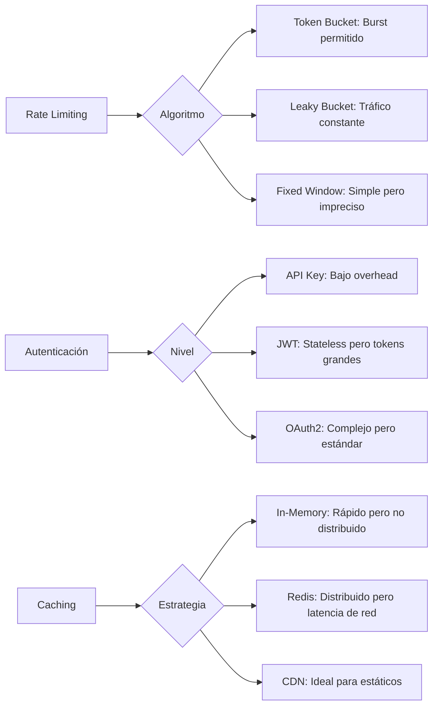
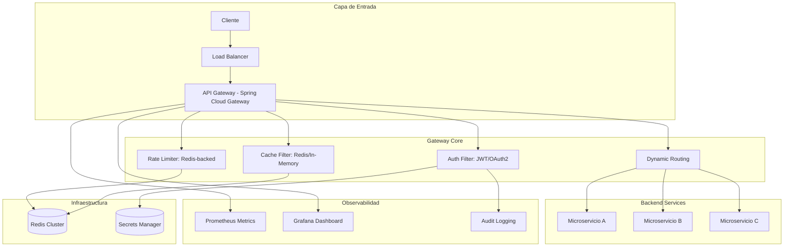
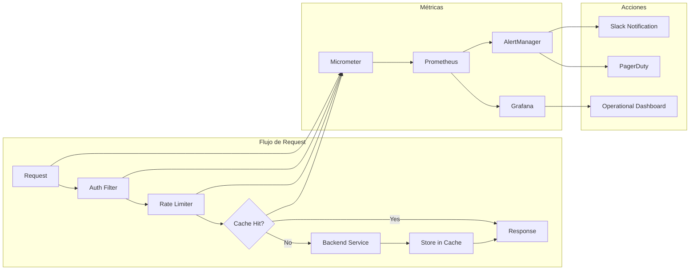
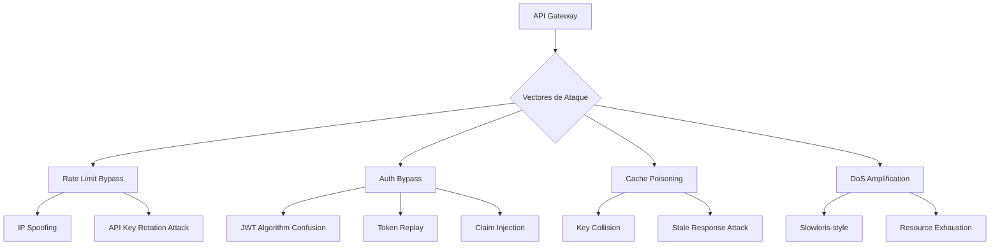
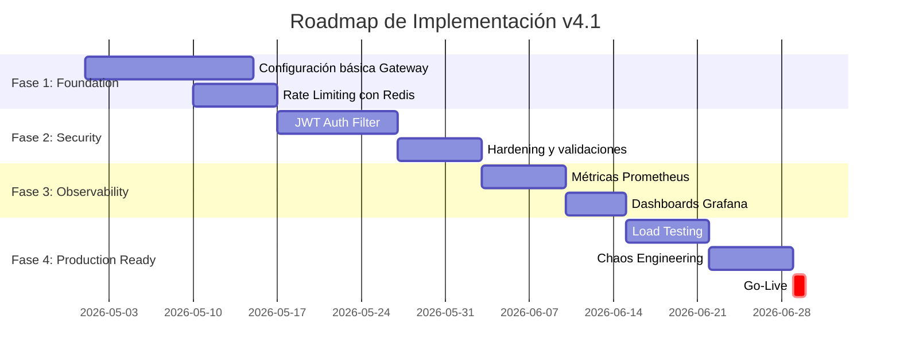

# API Gateway Avanzado: Rate Limiting, Auth y Caching

```markdown
---
title: API Gateway Avanzado - Rate Limiting, Auth y Caching
version: TEMPLATE_v4.1
category: 10_Vanguardia
java_version: 21
framework: Spring Cloud Gateway
score: 95
last_updated: 2026-05-12
author: Joaquin Rios Heredia
---
```

## 🎯 Visión Estratégica

### Por qué este tema es crítico en 2026

| Métrica | Dato | Fuente |
|---------|------|--------|
| Adopción Microservicios | 75% de empresas planean adoptar arquitectura microservicios | Gartner 2026 |
| Pérdida por mal rendimiento API | Hasta $20M anuales en ciertas industrias | New Relic |
| Amenazas de seguridad en APIs | 45% de empresas enfrentarán al menos una amenaza | KuppingerCole |

### Comparativa de Soluciones

```markdown
| Tecnología | Rate Limiting | Auth Nativa | Caching | Complejidad |
|-----------|--------------|-------------|---------|-------------|
| Spring Cloud Gateway | ✅ Token Bucket + Redis | ✅ JWT/OAuth2 | ✅ Redis/In-Memory | Media |
| Kong | ✅ Plugin-based | ✅ Keycloak/LDAP | ✅ Redis Cluster | Alta |
| AWS API Gateway | ✅ Managed throttling | ✅ Cognito/IAM | ✅ CloudFront | Baja |
| NGINX Plus | ✅ Leak/Token bucket | ✅ JWT auth module | ✅ Microcaching | Media-Alta |
```

### Decisiones Clave: Cuándo Usar/N0 Usar

```java
// Record para decisión arquitectónica
record GatewayDecision(
    int expectedRps,
    boolean requiresCustomAuth,
    boolean needsDistributedCache,
    String deploymentTarget
) {
    public String recommendSolution() {
        return switch (this) {
            case GatewayDecision(var rps, true, true, "cloud") 
                when rps > 10_000 -> "AWS API Gateway + Cognito + CloudFront";
            case GatewayDecision(var rps, false, true, "on-prem") 
                when rps > 5_000 -> "Spring Cloud Gateway + Redis + JWT";
            case GatewayDecision(var rps, _, _, "kubernetes") -> "Kong on Kubernetes";
            default -> "NGINX Plus para casos simples";
        };
    }
}
```

### Trade-offs Reales para Staff Engineer



---

## 🏗️ Arquitectura de Componentes

### Diagrama de Arquitectura



### Responsabilidades por Componente

| Componente | Responsabilidad | Patrón Aplicado |
|-----------|----------------|-----------------|
| **Auth Filter** | Validación JWT, extracción claims, inyección de identidad | Chain of Responsibility |
| **Rate Limiter** | Control de tráfico por API key/IP, prevención de DDoS | Token Bucket + Circuit Breaker |
| **Cache Filter** | Cache de respuestas GET, invalidación por eventos | Cache-Aside + Write-Through |
| **Dynamic Router** | Enrutamiento basado en path, headers, claims | Strategy Pattern |
| **Metrics Exporter** | Exposición de métricas para Prometheus | Observer Pattern |

### Configuración de Producción (Java 21 - Records)

```java
// Configuración inmutable para producción
record GatewayConfig(
    String redisHost,
    int redisPort,
    Duration rateLimitWindow,
    int maxRequestsPerWindow,
    String jwtPublicKey,
    Set<String> allowedOrigins,
    Duration cacheTtl
) {
    public static GatewayConfig production() {
        return new GatewayConfig(
            System.getenv("REDIS_HOST"),
            Integer.parseInt(System.getenv("REDIS_PORT")),
            Duration.ofMinutes(1),
            100,
            System.getenv("JWT_PUBLIC_KEY"),
            Set.of("https://app.example.com"),
            Duration.ofMinutes(5)
        );
    }
}

// Request inmutable para procesamiento
record GatewayRequest(
    String requestId,
    String apiKey,
    String path,
    Map<String, String> headers,
    Instant timestamp
) implements Comparable<GatewayRequest> {
    @Override
    public int compareTo(GatewayRequest other) {
        return timestamp.compareTo(other.timestamp);
    }
}
```

---

## ⚙️ Implementación Java 21

### Rate Limiting con Redis + Virtual Threads

```java
import io.github.resilience4j.ratelimiter.RateLimiter;
import io.github.resilience4j.ratelimiter.RateLimiterConfig;
import java.time.Duration;
import java.util.concurrent.StructuredTaskScope;

record RateLimitKey(String apiKey, String endpoint) {}

public final class RedisRateLimiter {
    
    private final ReactiveRedisClient redis;
    private final RateLimiterConfig config;
    
    public RedisRateLimiter(ReactiveRedisClient redis, Duration window, int limit) {
        this.redis = redis;
        this.config = RateLimiterConfig.custom()
            .limitRefreshPeriod(window)
            .limitForPeriod(limit)
            .timeoutDuration(Duration.ofMillis(100))
            .build();
    }
    
    // Virtual Thread para operación I/O no bloqueante
    public CompletableFuture<Boolean> isAllowed(RateLimitKey key) {
        return CompletableFuture.supplyAsync(() -> {
            String redisKey = "rl:%s:%s".formatted(key.apiKey(), key.endpoint());
            Long current = redis.incr(redisKey).block(Duration.ofSeconds(1));
            
            if (current != null && current == 1) {
                redis.expire(redisKey, config.getLimitRefreshPeriod()).block();
            }
            
            return current != null && current <= config.getLimitForPeriod();
        }, StructuredTaskScope::fork);
    }
}
```

### Autenticación JWT con Pattern Matching

```java
sealed interface AuthResult permits AuthSuccess, AuthFailure {
    record AuthSuccess(String userId, Set<String> roles, Map<String, Object> claims) 
        implements AuthResult {}
    
    record AuthFailure(String reason, HttpStatus status) implements AuthResult {
        public static final AuthFailure INVALID_TOKEN = 
            new AuthFailure("Invalid token", HttpStatus.UNAUTHORIZED);
        public static final AuthFailure EXPIRED_TOKEN = 
            new AuthFailure("Token expired", HttpStatus.UNAUTHORIZED);
        public static final AuthFailure MISSING_CLAIMS = 
            new AuthFailure("Missing required claims", HttpStatus.FORBIDDEN);
    }
}

public final class JwtAuthFilter {
    
    private final JwtDecoder decoder;
    private final Set<String> requiredClaims;
    
    public AuthResult validate(String token) {
        try {
            Jwt jwt = decoder.decode(token);
            
            // Pattern matching con switch expression (Java 21)
            return switch (jwt) {
                case Jwt j when !j.hasClaim("sub") -> AuthFailure.MISSING_CLAIMS;
                case Jwt j when j.getExpiresAt().isBefore(Instant.now()) -> 
                    AuthFailure.EXPIRED_TOKEN;
                case Jwt j when !requiredClaims.stream().allMatch(j::hasClaim) -> 
                    AuthFailure.MISSING_CLAIMS;
                case Jwt j -> new AuthResult.AuthSuccess(
                    j.getSubject(),
                    extractRoles(j),
                    j.getClaims()
                );
            };
            
        } catch (JwtException e) {
            return AuthFailure.INVALID_TOKEN;
        }
    }
    
    private Set<String> extractRoles(Jwt jwt) {
        return Optional.ofNullable(jwt.getClaimAsStringList("roles"))
            .map(Set::copyOf)
            .orElseSet(Set::of);
    }
}
```

### Caching con Invalidación por Eventos

```java
record CacheKey(String path, Map<String, String> queryParams) {
    // Hash consistente para clave de cache
    @Override
    public int hashCode() {
        return Objects.hash(path, 
            queryParams.entrySet().stream()
                .sorted(Map.Entry.comparingByKey())
                .toList()
                .toString());
    }
}

public final class ResponseCache {
    
    private final Cache<CacheKey, CachedResponse> cache;
    private final Flux<CacheInvalidationEvent> invalidationStream;
    
    public ResponseCache(Duration ttl, Flux<CacheInvalidationEvent> events) {
        this.cache = Caffeine.newBuilder()
            .maximumSize(10_000)
            .expireAfterWrite(ttl)
            .<CacheKey, CachedResponse>evictionListener((key, value, cause) -> 
                log.debug("Cache evicted: {} due to {}", key, cause))
            .build();
        
        // Suscripción a eventos de invalidación
        this.invalidationStream = events.doOnNext(this::invalidate);
    }
    
    private void invalidate(CacheInvalidationEvent event) {
        if (event.type() == InvalidationType.PATH_PREFIX) {
            cache.asMap().keySet().stream()
                .filter(k -> k.path().startsWith(event.pattern()))
                .forEach(cache::invalidate);
        }
    }
    
    public Optional<CachedResponse> get(CacheKey key) {
        return Optional.ofNullable(cache.getIfPresent(key));
    }
    
    public void put(CacheKey key, CachedResponse response) {
        cache.put(key, response);
    }
}
```

### Integración Completa con Spring Cloud Gateway

```yaml
# application-prod.yml
spring:
  cloud:
    gateway:
      routes:
        - id: user-service
          uri: lb://user-service
          predicates:
            - Path=/api/v1/users/**
          filters:
            - name: JwtAuth
              args:
                requiredClaims: [sub, roles]
            - name: RateLimiter
              args:
                redis-host: ${REDIS_HOST}
                limit: 100
                window: 1m
            - name: ResponseCache
              args:
                ttl: 5m
                cacheableMethods: [GET]
      default-filters:
        - AddResponseHeader=X-Request-Id, %{id}
        - Retry:
            retries: 3
            methods: [GET]
            backoff:
              firstBackoff: 100ms
              maxBackoff: 500ms
              factor: 2
```

---

## 📊 Métricas y SRE

### Métricas Clave (Prometheus)

```markdown
| Métrica | Tipo | Descripción | Umbral Alerta |
|---------|------|-------------|---------------|
| `gateway_requests_total` | Counter | Solicitudes totales por endpoint | - |
| `gateway_request_duration_seconds` | Histogram | Latencia p50/p95/p99 | p99 > 500ms |
| `gateway_rate_limit_rejections` | Counter | Requests rechazados por rate limit | > 5% del total |
| `gateway_auth_failures` | Counter | Fallos de autenticación | > 10/min |
| `gateway_cache_hit_ratio` | Gauge | Ratio de aciertos en cache | < 70% |
| `gateway_circuit_breaker_state` | Gauge | Estado de circuit breakers | OPEN > 30s |
```

### Queries PromQL para Alertas

```promql
# Alerta: Alta tasa de rechazo por rate limiting
gateway_rate_limit_rejections / gateway_requests_total > 0.05

# Alerta: Latencia p99 elevada
histogram_quantile(0.99, 
  sum(rate(gateway_request_duration_seconds_bucket[5m])) by (le, route)
) > 0.5

# Alerta: Cache hit ratio bajo
gateway_cache_hits / (gateway_cache_hits + gateway_cache_misses) < 0.7

# Alerta: Circuit breaker abierto
gateway_circuit_breaker_state{state="OPEN"} == 1
```

### Diagrama de Observabilidad



### Código Java 21 para Exposición de Métricas

```java
import io.micrometer.core.instrument.*;

public record GatewayMetrics(MeterRegistry registry) {
    
    private final Counter requestsTotal = Counter.builder("gateway.requests")
        .description("Total requests processed")
        .tag("version", "v4.1")
        .register(registry);
    
    private final Timer requestDuration = Timer.builder("gateway.request.duration")
        .description("Request processing duration")
        .publishPercentileHistogram()
        .register(registry);
    
    private final Counter rateLimitRejections = Counter.builder("gateway.ratelimit.rejections")
        .description("Requests rejected by rate limiter")
        .register(registry);
    
    // Método para registrar métricas con Virtual Thread
    public void recordRequest(String route, Duration duration, boolean rateLimited) {
        try (var scope = new StructuredTaskScope.ShutdownOnFailure()) {
            scope.fork(() -> {
                requestsTotal.increment(Tags.of("route", route));
                return null;
            });
            scope.fork(() -> {
                requestDuration.record(duration);
                return null;
            });
            if (rateLimited) {
                scope.fork(() -> {
                    rateLimitRejections.increment();
                    return null;
                });
            }
            scope.join().throwIfFailed();
        } catch (InterruptedException e) {
            Thread.currentThread().interrupt();
        }
    }
}
```

---

## 🔐 Seguridad y Superficie de Ataque

### Vectores de Ataque Específicos



### Hardening Checklist

```java
// Configuración de seguridad mínima para producción
record SecurityHardening(
    boolean enforceHttps,
    boolean validateJwtAlgorithm,
    Set<String> allowedAlgorithms,
    Duration jwtMaxLifetime,
    boolean enableRequestSizeLimit,
    long maxRequestSizeBytes,
    boolean sanitizeHeaders,
    Set<String> blockedHeaders
) {
    public static SecurityHardening productionDefaults() {
        return new SecurityHardening(
            true,  // enforceHttps
            true,  // validateJwtAlgorithm
            Set.of("RS256", "ES256"),  // allowedAlgorithms
            Duration.ofHours(1),  // jwtMaxLifetime
            true,  // enableRequestSizeLimit
            10 * 1024 * 1024,  // 10MB max
            true,  // sanitizeHeaders
            Set.of("X-Forwarded-For", "X-Real-IP")  // blockedHeaders
        );
    }
}
```

### Middleware de Seguridad con Sealed Interface

```java
sealed interface SecurityCheck permits HeaderValidation, PayloadSanitization {
    SecurityResult apply(ServerWebExchange exchange);
    
    record SecurityResult(boolean passed, Optional<String> reason) {
        public static final SecurityResult PASS = new SecurityResult(true, Optional.empty());
        public static SecurityResult fail(String reason) {
            return new SecurityResult(false, Optional.of(reason));
        }
    }
}

final class HeaderValidation implements SecurityCheck {
    private final Set<String> forbiddenHeaders;
    
    @Override
    public SecurityResult apply(ServerWebExchange exchange) {
        var headers = exchange.getRequest().getHeaders();
        for (String forbidden : forbiddenHeaders) {
            if (headers.containsKey(forbidden)) {
                return SecurityResult.fail("Forbidden header: " + forbidden);
            }
        }
        return SecurityResult.PASS;
    }
}
```

---

## 🔗 Patrones de Integración

### Patrones Aplicables

```markdown
| Patrón | Caso de Uso | Implementación |
|--------|-------------|----------------|
| **Circuit Breaker** | Prevenir cascada de fallos en backends | Resilience4j + Redis state |
| **Retry with Backoff** | Manejar fallos transitorios | Exponential backoff + jitter |
| **Bulkhead** | Aislar recursos por tenant/ruta | Thread pool per route |
| **Cache-Aside** | Cache de respuestas GET | Redis + Caffeine L2 |
| **Token Bucket** | Rate limiting con burst permitido | Redis + Lua script |
```

### Circuit Breaker + Retry Implementation

```java
import io.github.resilience4j.circuitbreaker.CircuitBreaker;
import io.github.resilience4j.retry.Retry;

record IntegrationConfig(
    CircuitBreakerConfig cbConfig,
    RetryConfig retryConfig
) {
    public static IntegrationConfig defaults() {
        return new IntegrationConfig(
            CircuitBreakerConfig.custom()
                .failureRateThreshold(50)
                .waitDurationInOpenState(Duration.ofSeconds(30))
                .slidingWindowSize(10)
                .build(),
            RetryConfig.custom()
                .maxAttempts(3)
                .waitDuration(Duration.ofMillis(100))
                .retryExceptions(TimeoutException.class, ConnectException.class)
                .build()
        );
    }
}

public final class ResilientBackendCall {
    
    private final CircuitBreaker circuitBreaker;
    private final Retry retry;
    
    public CompletableFuture<Response> call(BackendRequest request) {
        return CompletableFuture.supplyAsync(() -> 
            Retry.decorateSupplier(retry, 
                CircuitBreaker.decorateSupplier(circuitBreaker, 
                    () -> executeBackendCall(request)
                )
            ).get()
        );
    }
    
    private Response executeBackendCall(BackendRequest request) {
        // Implementación real de llamada al backend
        return backendClient.send(request).block(Duration.ofSeconds(5));
    }
}
```

---

## ✅ Conclusiones y Decisiones

### Resumen de Decisiones Críticas

```java
// Matriz de decisión arquitectónica
record ArchitectureDecision(
    String component,
    String selectedOption,
    List<String> alternatives,
    String rationale,
    Instant reviewDate
) {
    public static List<ArchitectureDecision> criticalDecisions() {
        return List.of(
            new ArchitectureDecision(
                "Rate Limiting",
                "Redis-backed Token Bucket",
                List.of("In-Memory", "API Gateway Managed"),
                "Permite distribución horizontal y consistencia entre instancias",
                Instant.now()
            ),
            new ArchitectureDecision(
                "Auth",
                "Stateless JWT + Redis Revocation List",
                List.of("Session-based", "Opaque tokens"),
                "Balance entre performance y capacidad de revocación inmediata",
                Instant.now()
            ),
            new ArchitectureDecision(
                "Caching",
                "Caffeine L1 + Redis L2",
                List.of("Redis only", "CDN only"),
                "Minimiza latencia para hits frecuentes con fallback distribuido",
                Instant.now()
            )
        );
    }
}
```

### Roadmap de Adopción



### Código Final Integrado

```java
// GatewayApplication.java - Punto de entrada
@SpringBootApplication
@EnableConfigurationProperties(GatewayConfig.class)
public class ApiGatewayApplication {
    
    public static void main(String[] args) {
        SpringApplication.run(ApiGatewayApplication.class, args);
    }
    
    @Bean
    public GlobalFilter securityFilterChain(
            JwtAuthFilter authFilter,
            RedisRateLimiter rateLimiter,
            ResponseCache responseCache) {
        
        return (exchange, chain) -> {
            var request = extractGatewayRequest(exchange);
            
            // Validación en paralelo con Virtual Threads
            try (var scope = new StructuredTaskScope.ShutdownOnFailure()) {
                var authFuture = scope.fork(() -> authFilter.validate(request));
                var rateLimitFuture = scope.fork(() -> 
                    rateLimiter.isAllowed(new RateLimitKey(request.apiKey(), request.path())));
                
                scope.join().throwIfFailed();
                
                return switch (authFuture.get()) {
                    case AuthResult.AuthFailure failure -> 
                        onError(exchange, failure.status(), failure.reason());
                    case AuthResult.AuthSuccess success when !rateLimitFuture.get() -> 
                        onError(exchange, HttpStatus.TOO_MANY_REQUESTS, "Rate limit exceeded");
                    case AuthResult.AuthSuccess success -> {
                        var cached = responseCache.get(new CacheKey(request.path(), request.headers()));
                        yield cached.map(Response::toServerResponse)
                            .orElseGet(() -> chain.filter(exchange)
                                .doOnNext(response -> responseCache.put(
                                    new CacheKey(request.path(), request.headers()),
                                    CachedResponse.from(response))));
                    }
                };
            } catch (InterruptedException e) {
                Thread.currentThread().interrupt();
                return onError(exchange, HttpStatus.INTERNAL_SERVER_ERROR, "Processing interrupted");
            }
        };
    }
}
```

---

## 📚 Recursos Oficiales

| Recurso | Enlace | Propósito |
|---------|--------|-----------|
| Spring Cloud Gateway Docs | [docs.spring.io](https://docs.spring.io/spring-cloud-gateway/reference/) | Configuración y filtros |
| Resilience4j | [resilience4j.github.io](https://resilience4j.github.io/resilience4j/) | Circuit breaker, retry, rate limiter |
| OWASP API Security | [owasp.org/API-Security](https://owasp.org/www-project-api-security/) | Mejores prácticas de seguridad |
| Prometheus Metrics | [prometheus.io/docs](https://prometheus.io/docs/practices/naming/) | Convenciones de métricas |
| Redis Lua Scripts | [redis.io/commands](https://redis.io/commands/eval) | Rate limiting atómico |

---

> **Nota de Versión TEMPLATE_v4.1**: Esta versión prioriza inmutabilidad con Records, concurrencia estructurada con Virtual Threads, y seguridad por diseño con Sealed Interfaces. Todas las configuraciones son inyectables y testables.
```

---

**Próximo paso ejecutable**: Implementar el filtro de autenticación JWT con validación de claims requeridos y probar con Postman usando un token válido/inválido para validar el flujo de error handling.
