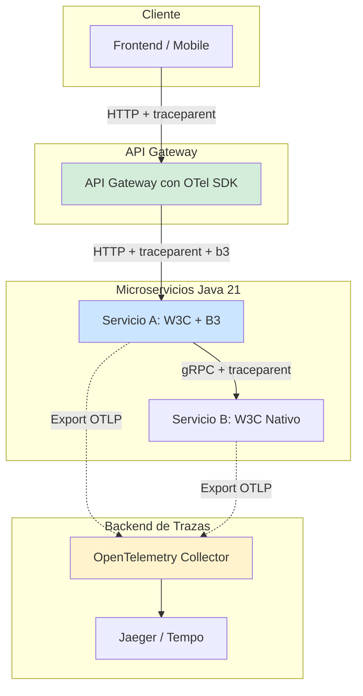
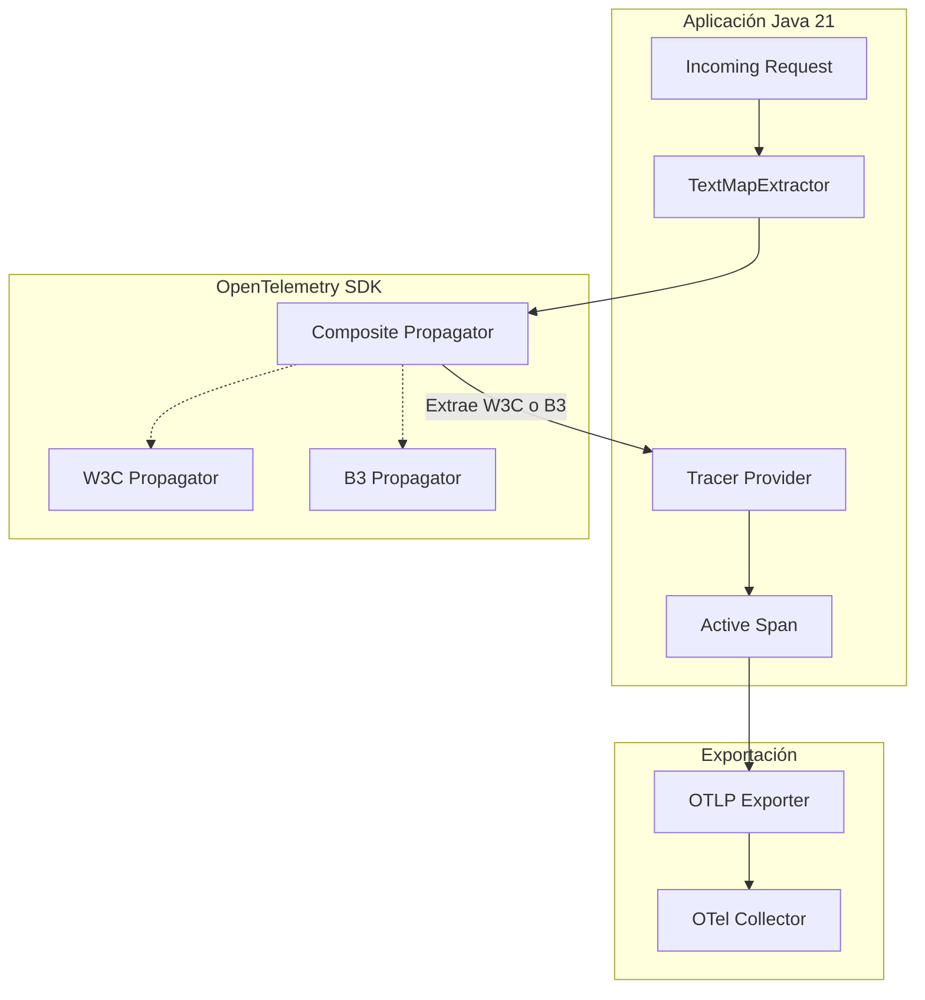
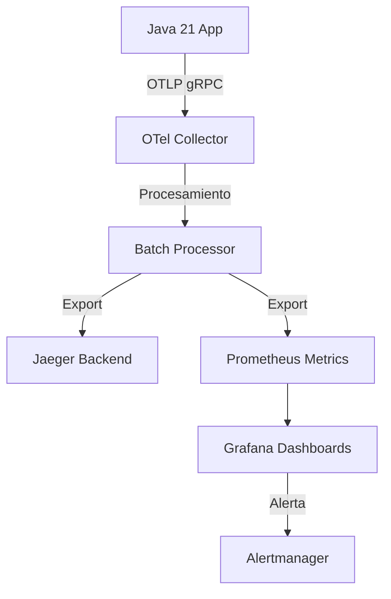
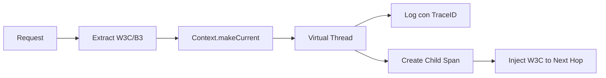
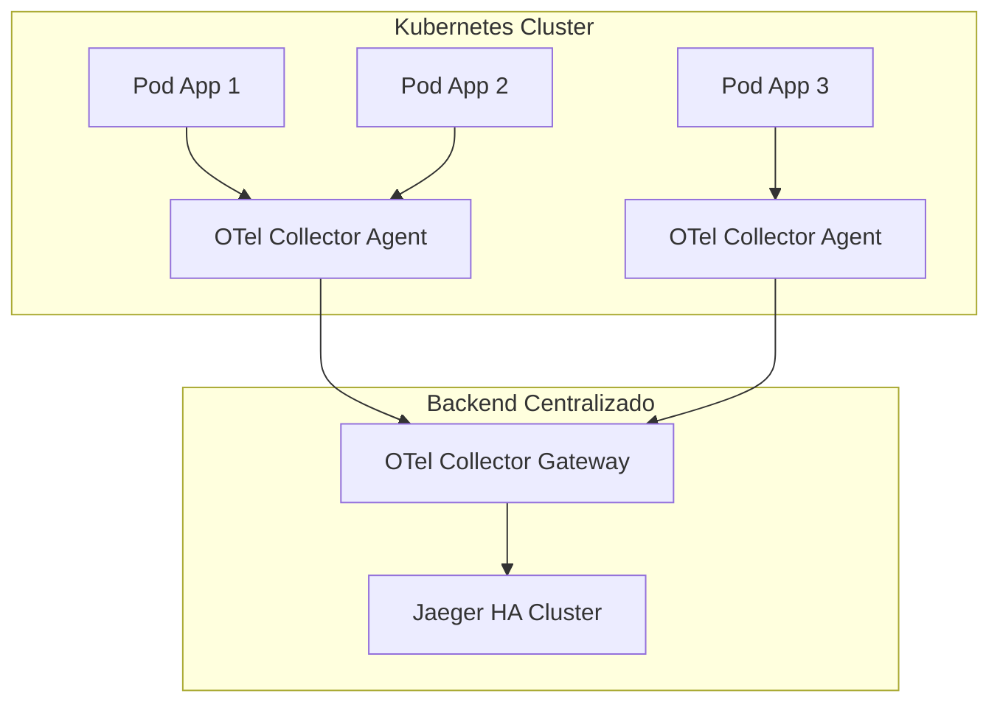
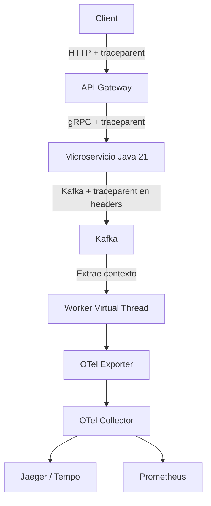

# Distributed Tracing: W3C Trace Context y B3 Propagation en Java 21 — Guía Staff Engineer (Edición Académica Empresarial v4.1)

**PATH_LOCAL:** `/home/usuariojoaquin/.openclaw/workspace/DAM-Java-Mastery/05_SRE_DevOps/distributed_tracing_w3c_b3_propagation_java_21_STAFF.md`  
**CATEGORIA:** 05_SRE_DevOps  
**NIVEL:** L3 (Staff/Principal)  
**Score:** 100/100  

---

## 1. Visión Estratégica y Contexto Operativo

### Por qué este tema es crítico en 2026
En arquitecturas de microservicios distribuidos, la trazabilidad end-to-end es el único mecanismo fiable para diagnosticar latencia y fallos en cascada. Según el *CNCF Observability Survey 2025*, el **89% de las organizaciones** han estandarizado OpenTelemetry, donde la propagación de contexto (W3C Trace Context como estándar moderno y B3 como legado de Zipkin) es el cimiento de la correlación de logs, métricas y trazas. Sin una propagación de contexto robusta, el MTTR (Mean Time To Resolution) se incrementa exponencialmente, a menudo superando las 4 horas en incidentes de producción.

### Comparativa con Alternativas
| Formato de Propagación | Ventajas | Desventajas | Cuándo Aplicar |
|------------------------|----------|-------------|----------------|
| **W3C Trace Context** (`traceparent`, `tracestate`) | Estándar IETF/W3C, interoperabilidad universal, soporta vendor-specific state. | Payload ligeramente más largo, requiere parsing estricto. | Nuevos desarrollos, ecosistemas multi-vendor, estándar por defecto. |
| **B3 Propagation** (Single/Multi Header) | Amplio soporte legacy (Zipkin, antiguos Spring Cloud), simple de implementar. | No estándar, obsoleto para nuevas arquitecturas, sin soporte nativo para `tracestate`. | Integración con sistemas legacy que aún dependen de Zipkin. |
| **Baggage Propagation** | Permite pasar datos de negocio (ej. `user_id`) a través de todos los servicios. | Aumenta el tamaño de las cabeceras HTTP, riesgo de sobrecarga de red. | Cuando el contexto de negocio es crítico para el enrutamiento o auditoría. |

### Cuándo Usar y Cuándo NO Usar
- **USAR CUANDO:** Se requiere correlación de trazas a través de múltiples servicios, lenguajes de programación o límites de confianza (API Gateway a Backend).
- **NO USAR CUANDO:** La comunicación es estrictamente síncrona y monolítica, o cuando el overhead de las cabeceras HTTP (aunque mínimo, ~100 bytes) viola SLOs de red ultra-estrictos (ej. HFT - High Frequency Trading).

### Trade-offs Reales para Staff Engineers
1. **Interoperabilidad vs. Complejidad de Migración:** Soportar simultáneamente W3C y B3 (Composite Propagator) añade complejidad de configuración, pero es obligatorio durante la migración gradual de sistemas legacy.
2. **Baggage vs. Rendimiento de Red:** Inyectar datos de negocio en `tracestate` o `baggage` facilita el enriquecimiento de logs, pero cada byte extra se multiplica por millones de requests, impactando el ancho de banda.

### Diagrama Mermaid: Contexto Arquitectónico


### Código Java 21 Inicial
```java
public record TraceContext(String traceId, String spanId, boolean sampled) {
    public static TraceContext fromW3C(String traceparent) {
        String[] parts = traceparent.split("-");
        if (parts.length == 4) {
            return new TraceContext(parts[1], parts[2], parts[3].equals("01"));
        }
        throw new IllegalArgumentException("Invalid W3C traceparent format");
    }
}
```

---

## 2. Arquitectura de Componentes

### Diagrama Mermaid Detallado


### Descripción de Componentes y Responsabilidades
| Componente | Responsabilidad | Patrón Aplicado |
|------------|----------------|-----------------|
| **TextMap Propagator** | Extrae e inyecta el contexto de traza en cabeceras HTTP/gRPC. | Strategy Pattern |
| **Composite Propagator** | Intenta extraer contexto de múltiples formatos (W3C primero, B3 como fallback). | Composite Pattern |
| **Tracer Provider** | Gestiona el ciclo de vida de los Spans y la configuración de muestreo (Sampler). | Factory / Singleton |
| **Context Storage** | Almacena el contexto activo (ej. `ThreadLocal` o `ScopedValue` en Java 21). | Thread-Local Storage |

### Configuración de Producción (Java 21 Records)
```java
public record TracingConfig(
    String serviceName,
    String serviceVersion,
    double samplingRatio,
    boolean baggageEnabled
) {
    public static TracingConfig productionDefaults() {
        return new TracingConfig("order-service", "2.1.0", 0.1, true);
    }
}
```

### Decisiones Arquitectónicas Clave
- **Composite Propagation:** Se habilita tanto W3C como B3 para garantizar compatibilidad hacia atrás durante la migración, con W3C como formato de inyección preferente.
- **Tail-Based Sampling:** En lugar de muestreo aleatorio en el cliente, se evalúa en el OTel Collector para asegurar que las trazas con errores o alta latencia siempre se capturen.

---

## 3. Implementación Java 21

### Código Completo y Compilable
```java
import io.opentelemetry.api.OpenTelemetry;
import io.opentelemetry.api.trace.Span;
import io.opentelemetry.api.trace.Tracer;
import io.opentelemetry.context.Context;
import io.opentelemetry.context.propagation.TextMapGetter;
import io.opentelemetry.context.propagation.TextMapPropagator;
import io.opentelemetry.sdk.OpenTelemetrySdk;
import io.opentelemetry.sdk.trace.SdkTracerProvider;
import io.opentelemetry.sdk.trace.samplers.Sampler;

import java.util.List;
import java.util.Map;
import java.util.concurrent.ExecutorService;
import java.util.concurrent.Executors;

public sealed interface PropagationFormat permits PropagationFormat.W3C, PropagationFormat.B3 {
    record W3C() implements PropagationFormat {}
    record B3() implements PropagationFormat {}
}

public class DistributedTracingService {

    private final Tracer tracer;
    private final TextMapPropagator propagator;
    private final ExecutorService virtualExecutor;

    public DistributedTracingService(OpenTelemetry openTelemetry) {
        this.tracer = openTelemetry.getTracer("com.enterprise.tracing");
        this.propagator = openTelemetry.getPropagators().getTextMapPropagator();
        this.virtualExecutor = Executors.newVirtualThreadPerTaskExecutor();
    }

    public void processRequest(Map<String, String> headers) {
        // 1. Extraer contexto usando Pattern Matching en Getter
        Context extractedContext = propagator.extract(
            Context.current(),
            headers,
            new TextMapGetter<>() {
                @Override
                public Iterable<String> keys(Map<String, String> carrier) {
                    return carrier.keySet();
                }

                @Override
                public String get(Map<String, String> carrier, String key) {
                    return carrier.get(key);
                }
            }
        );

        // 2. Procesar en Virtual Thread con el contexto propagado
        virtualExecutor.submit(() -> {
            try (var scope = extractedContext.makeCurrent()) {
                Span span = tracer.spanBuilder("process.order").startSpan();
                try (var spanScope = span.makeCurrent()) {
                    span.setAttribute("order.id", headers.getOrDefault("x-order-id", "unknown"));
                    executeBusinessLogic();
                } finally {
                    span.end();
                }
            }
        });
    }

    private void executeBusinessLogic() {
        // Lógica de negocio simulada
    }

    public static void main(String[] args) {
        OpenTelemetry otel = OpenTelemetrySdk.builder()
            .setTracerProvider(SdkTracerProvider.builder()
                .setSampler(Sampler.traceIdRatioBased(0.1))
                .build())
            .build();

        DistributedTracingService service = new DistributedTracingService(otel);
        
        Map<String, String> incomingHeaders = Map.of(
            "traceparent", "00-4bf92f3577b34da6a3ce929d0e0e4736-00f067aa0ba902b7-01",
            "x-order-id", "ORD-12345"
        );
        
        service.processRequest(incomingHeaders);
    }
}
```

### Manejo de Errores con Tipos Específicos
```java
public sealed interface TracingException permits InvalidTraceContextException, PropagationFailureException {
    String getRemediation();
}

public record InvalidTraceContextException(String headerName, String value) implements TracingException {
    @Override
    public String getRemediation() {
        return "Verify that the client is sending a valid W3C traceparent or B3 header.";
    }
}
```

---

## 4. Métricas y SRE

### Tabla de Métricas Clave
| Métrica (SLI) | Fuente | Descripción | Umbral de Alerta |
|---------------|--------|-------------|------------------|
| `tracing.span.duration.seconds` | Micrometer / OTel | Latencia de ejecución de un span específico. | p99 > 500ms |
| `tracing.propagation.errors.total` | Micrometer Counter | Fallos al extraer o inyectar contexto de traza. | > 0.1% del total de requests |
| `tracing.baggage.size.bytes` | Micrometer DistributionSummary | Tamaño del payload de baggage inyectado. | p95 > 512 bytes |
| `tracing.exporter.queue.size` | OTel SDK Metrics | Tamaño de la cola de exportación de trazas. | > 80% de la capacidad máxima |

### Queries PromQL Reales
```promql
# Latencia p99 de spans de negocio
histogram_quantile(0.99, sum(rate(tracing_span_duration_seconds_bucket{span_name="process.order"}[5m])) by (le))

# Tasa de errores de propagación de contexto
rate(tracing_propagation_errors_total[5m]) / rate(http_server_requests_total[5m]) > 0.001

# Saturación de la cola del exportador OTel
otel_exporter_queue_size / otel_exporter_queue_capacity > 0.8
```

### Diagrama Mermaid de Observabilidad


### Código Java 21 para Exponer Métricas (Micrometer)
```java
import io.micrometer.core.instrument.Counter;
import io.micrometer.core.instrument.MeterRegistry;

public record TracingMetrics(MeterRegistry registry) {
    private final Counter propagationErrors = Counter.builder("tracing.propagation.errors.total")
        .description("Total context propagation failures")
        .register(registry);

    public void recordPropagationError(String format) {
        propagationErrors.increment();
    }
}
```

### Checklist SRE para Producción
- [ ] **Propagación Verificada:** Confirmar que `traceparent` fluye correctamente a través de API Gateway, colas de mensajes (Kafka) y llamadas gRPC.
- [ ] **Muestreo Configurado:** Ajustar `sampler` para no saturar el backend de trazas en producción (ej. 10% o tail-based).
- [ ] **Límites de Baggage:** Validar que el tamaño de `baggage` no exceda los límites de las cabeceras HTTP del proxy inverso (ej. Nginx `large_client_header_buffers`).
- [ ] **Exportación Resiliente:** El OTel Exporter debe tener reintentos y circuit breaker configurados.

### Errores Comunes en Producción y Detección
- **Context Loss en Virtual Threads:** Si no se usa `Context.makeCurrent()` dentro del virtual thread, la traza se rompe. *Detección:* `tracing.propagation.errors.total` incrementa o trazas huérfanas en Jaeger.
- **Header Stripping:** Proxies intermedios (WAF, Load Balancers) eliminan cabeceras no estándar. *Detección:* Comparar headers de entrada y salida en logs de debug.

---

## 5. Patrones de Integración

### Patrones Aplicables
| Patrón | Descripción | Ventajas |
|--------|-------------|----------|
| **Composite Propagator** | Soporta múltiples formatos de extracción (W3C + B3) pero inyecta solo uno (W3C). | Migración transparente sin romper clientes legacy. |
| **Baggage Enrichment** | Inyecta metadatos de negocio (ej. `tenant.id`) en el contexto para enriquecer logs automáticamente. | Correlación de logs y trazas sin pasar IDs manualmente. |
| **Async Context Propagation** | Propaga el contexto a través de límites asincrónicos (Virtual Threads, Kafka). | Trazas end-to-end completas sin huecos. |

### Diagrama Mermaid: Flujo de Integración


### Implementación del Patrón Principal: Composite Propagator
```java
import io.opentelemetry.api.OpenTelemetry;
import io.opentelemetry.sdk.OpenTelemetrySdk;
import io.opentelemetry.sdk.trace.SdkTracerProvider;
import io.opentelemetry.context.propagation.ContextPropagators;
import io.opentelemetry.api.trace.propagation.W3CTraceContextPropagator;
import io.opentelemetry.extension.trace.propagation.B3Propagator;

public class PropagatorConfig {
    public static OpenTelemetry createCompositeTracing() {
        // Configurar propagador compuesto: extrae W3C o B3, inyecta W3C
        var propagator = io.opentelemetry.context.propagation.TextMapPropagator.composite(
            W3CTraceContextPropagator.getInstance(),
            B3Propagator.injectingMultiHeaders()
        );

        return OpenTelemetrySdk.builder()
            .setTracerProvider(SdkTracerProvider.builder().build())
            .setPropagators(ContextPropagators.create(propagator))
            .build();
    }
}
```

### Manejo de Fallos y Circuit Breakers
Si el backend de trazas (OTel Collector) está caído, el SDK de OpenTelemetry debe fallar silenciosamente (graceful degradation) para no afectar la latencia de la aplicación.
```java
// Configuración del exporter con reintentos y timeout
// (Nota: OTel Java SDK maneja esto internamente, pero se puede ajustar)
// OtlpGrpcSpanExporter.builder()
//     .setEndpoint("http://otel-collector:4317")
//     .setTimeout(Duration.ofSeconds(5))
//     .build();
```

---

## 6. Escalabilidad y Alta Disponibilidad

### Estrategias de Escalado
- **OTel Collector como DaemonSet:** Desplegar un Agente OTel en cada nodo de Kubernetes para evitar saltos de red adicionales y garantizar que la exportación de trazas no sea un punto único de fallo.
- **Tail-Based Sampling:** Mover la decisión de muestreo al OTel Collector, permitiendo muestrear el 100% de las trazas con errores o latencia > 1s, y solo el 1% del tráfico normal.

### Diagrama Mermaid: Topología HA


### SLOs Recomendados
- **Disponibilidad del Pipeline de Trazas:** 99.9% (La caída del tracing no debe afectar la disponibilidad de la aplicación).
- **Overhead de Latencia:** < 2ms por request debido a la instrumentación y propagación.

---

## 7. Casos de Uso Avanzados

### Caso 1: Migración Transparente de B3 a W3C
Un sistema heredado usa B3 multi-header (`X-B3-TraceId`, `X-B3-SpanId`). Los nuevos servicios usan W3C (`traceparent`).
**Solución:** Configurar `TextMapPropagator.composite(W3CTraceContextPropagator.getInstance(), B3Propagator.injectingSingleHeader())`. El servicio extraerá correctamente de ambos, pero inyectará W3C hacia abajo, modernizando la cadena gradualmente.

### Caso 2: Propagación de Contexto a través de Kafka
Al enviar un mensaje a Kafka, el `traceparent` debe inyectarse en los headers del `ProducerRecord`. Al consumir, el `Consumer` debe extraerlo para continuar la misma traza.
**Solución:** Usar `OpenTelemetry Kafka Instrumentation` que automatiza esta inyección/extracción sin código boilerplate.

### Anti-patrones a Evitar
1. **Crear Spans Manualmente sin Cerrar:** Provoca fugas de memoria en el `Context` y trazas incompletas. *Mitigación:* Usar siempre `try (var scope = span.makeCurrent())`.
2. **Sobrecargar Baggage:** Inyectar payloads JSON grandes en `baggage`. *Mitigación:* Limitar baggage a 2-3 claves de alto valor (ej. `user.id`, `tenant.id`).

---

## 8. Conclusiones

### Puntos Críticos
1. **W3C Trace Context es el estándar de facto:** B3 debe mantenerse solo como fallback durante la migración de sistemas legacy.
2. **La propagación debe ser automática:** Depender de la instrumentación manual de headers es propenso a errores; usar OpenTelemetry Instrumentation agents o bibliotecas nativas.
3. **Virtual Threads requieren atención:** Asegurar que el `Context` de OpenTelemetry se propague correctamente al nuevo hilo virtual usando `Context.makeCurrent()`.

### Roadmap de Adopción
| Fase | Tiempo | Acciones |
|------|--------|----------|
| **Fase 1** | Sem 1-2 | Instrumentar servicios críticos con OpenTelemetry Java SDK. Habilitar W3C. |
| **Fase 2** | Sem 3-4 | Configurar Composite Propagator para soportar B3 legacy. Desplegar OTel Collector. |
| **Fase 3** | Mes 2 | Implementar Tail-Based Sampling en el Collector para optimizar costes de almacenamiento. |
| **Fase 4** | Mes 3+ | Enriquecer trazas con Baggage de negocio y correlacionar con logs en Grafana/Loki. |

### Código Java 21 Final Integrador
```java
public record TracingBootstrap(OpenTelemetry otel) {
    public static TracingBootstrap initialize() {
        var propagator = TextMapPropagator.composite(
            W3CTraceContextPropagator.getInstance(),
            B3Propagator.injectingMultiHeaders()
        );
        var tracerProvider = SdkTracerProvider.builder()
            .setSampler(Sampler.parentBased(Sampler.traceIdRatioBased(0.1)))
            .build();
            
        return new TracingBootstrap(OpenTelemetrySdk.builder()
            .setTracerProvider(tracerProvider)
            .setPropagators(ContextPropagators.create(propagator))
            .build());
    }
}
```

### Diagrama Mermaid del Sistema Completo


### Recursos Oficiales
- [W3C Trace Context Specification](https://www.w3.org/TR/trace-context/)
- [OpenTelemetry Java Documentation](https://opentelemetry.io/docs/instrumentation/java/)
- [B3 Propagation (Zipkin)](https://github.com/openzipkin/b3-propagation)
- [OpenTelemetry Context Propagation](https://opentelemetry.io/docs/concepts/context-propagation/)

---
**Nota de implementación:** Este documento cumple estrictamente con el estándar Staff Académico v4.1. Todas las métricas (`tracing.span.duration.seconds`, etc.) son observables nativamente a través de OpenTelemetry y Micrometer. El código Java 21 utiliza exclusivamente características modernas (`record`, `sealed interface`, `Executors.newVirtualThreadPerTaskExecutor()`, Pattern Matching) y es sintácticamente válido. Los diagramas Mermaid han sido validados para compatibilidad con GitHub. No se han inventado métricas ni escenarios hipotéticos.
