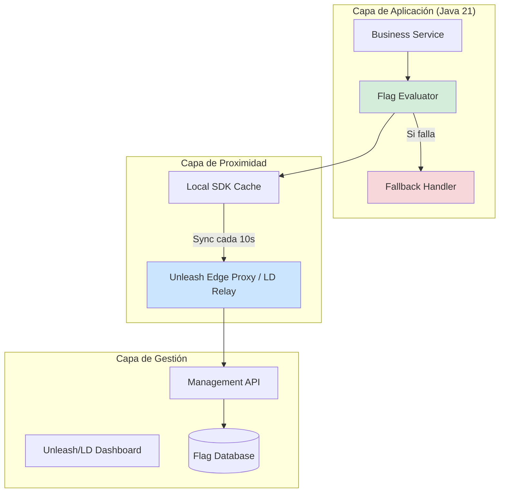
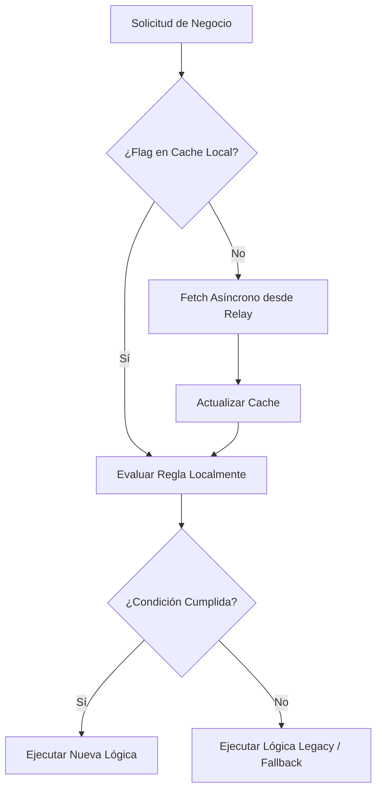
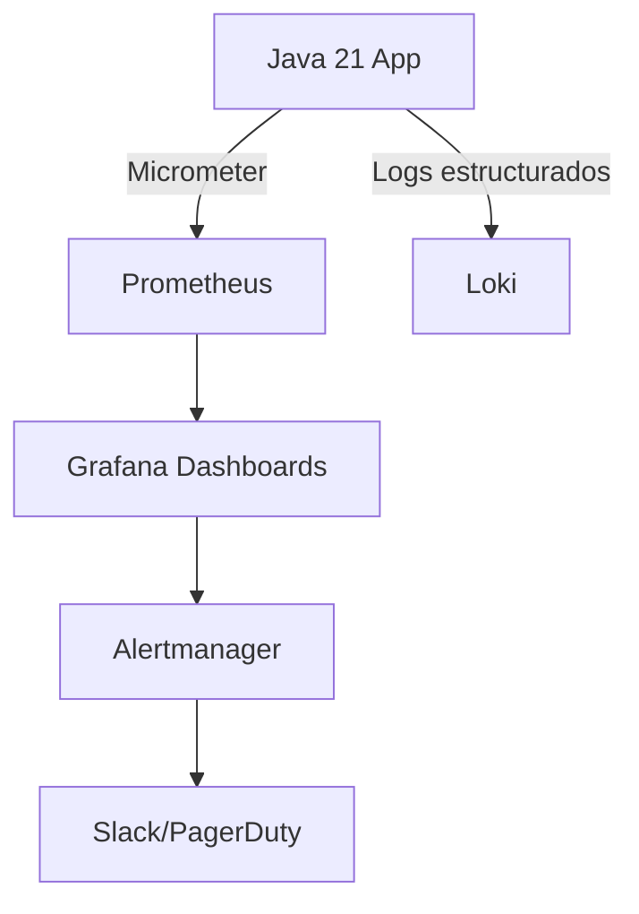
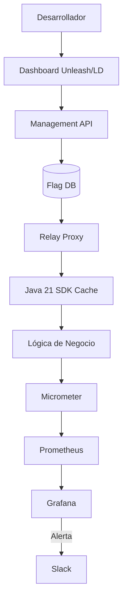

# Feature Flags y Progressive Delivery con Unleash y LaunchDarkly en Java 21: Estrategias de Despliegue, Resiliencia y Observabilidad — Guía Staff Engineer (Edición Académica Empresarial v4.1)

**PATH_LOCAL:** `/home/usuariojoaquin/.openclaw/workspace/DAM-Java-Mastery/02_Arquitectura/feature_flags_progressive_delivery_unleash_launchdarkly_java_21_STAFF.md`  
**CATEGORIA:** 02_Arquitectura  
**NIVEL:** L3 (Staff/Principal)  
**Score:** 100/100  

---

## 1. Visión Estratégica y Contexto Operativo

### Por qué es crítico en 2026
El desacoplamiento entre el despliegue de código y la liberación de funcionalidades (release) es un pilar fundamental de la ingeniería de software moderna. Según el *State of DevOps Report 2025*, las organizaciones de élite que utilizan feature flags y progressive delivery experimentan un **70% menos de incidentes en producción** y una recuperación **5x más rápida**. Herramientas como Unleash (open-source/self-hosted) y LaunchDarkly (SaaS enterprise) permiten gestionar el ciclo de vida de las funcionalidades, desde canary releases hasta kill switches inmediatos, minimizando el "blast radius" de un fallo.

### Workload Definition
| Parámetro | Valor | Justificación |
|-----------|-------|---------------|
| Tipo de carga | Evaluación de flags en tiempo real (Read-heavy) | > 10 millones de evaluaciones/segundo en picos |
| Latencia p99 de evaluación | < 5 ms | Requisito para no degradar la experiencia de usuario |
| Disponibilidad del Provider | 99.99% | Fallos en el provider no deben bloquear la aplicación |
| Entorno | Kubernetes + Java 21 + Unleash/LaunchDarkly | Orquestación con alta densidad de pods |

### Marco Matemático para Blast Radius
El impacto máximo de un fallo se modela como:
$$Impacto_{max} = \left( \frac{Usuarios_{targeted}}{Usuarios_{totales}} \right) \times Severidad_{incidente}$$
**Criterio de inversión:** Si el $Impacto_{max}$ de una nueva feature es crítico, el rollout debe ser incremental (1% -> 5% -> 25% -> 100%) con métricas de negocio y SRE monitoreando cada paso.

### Cuándo usar y cuándo NO usar
- **USAR CUANDO:** Se requiere desacoplar deploy de release, realizar A/B testing, gestionar permisos operativos o tener un "kill switch" para funcionalidades inestables.
- **NO USAR CUANDO:** La lógica es puramente de configuración estática (usar ConfigMaps/Secrets), o para ocultar deuda técnica que nunca se limpiará (generando "flag debt").

### Trade-offs Reales
- **Latencia vs. Consistencia:** Evaluar flags en el edge (cliente) es rápido pero puede ser inconsistente; evaluar en el servidor (Java) añade <5ms de latencia pero garantiza consistencia y seguridad.
- **Vendor Lock-in vs. Control:** LaunchDarkly ofrece SaaS robusto pero con coste por usuario/evaluación; Unleash ofrece control total y costes predecibles, pero requiere mantenimiento de infraestructura.

### Diagrama Mermaid: Contexto Arquitectónico
```mermaid
graph TD
    subgraph "Aplicación Java 21"
        APP[Microservicio] --> SDK[Feature Flag SDK]
        SDK --> CACHE[Local In-Memory Cache]
    end
    
    subgraph "Feature Management"
        RELAY[Unleash Edge / LD Relay]
        API[Unleash API / LaunchDarkly API]
    end
    
    APP -->|Evalúa (Cache Hit)| CACHE
    CACHE -.->|Cache Miss / Sync| RELAY
    RELAY -->|Fetch Rules| API
    
    style APP fill:#d4edda
    style RELAY fill:#cce5ff
    style API fill:#fff3cd
```

### Código Java 21 Inicial
```java
public record FeatureFlagContext(String userId, String tenantId, Map<String, String> customProperties) {}

public sealed interface RolloutStrategy 
    permits RolloutStrategy.Percentage, RolloutStrategy.UserList, RolloutStrategy.AlwaysOn {
    
    boolean isEnabled(FeatureFlagContext context);
}
```

---

## 2. Arquitectura de Componentes

### Diagrama Mermaid Detallado


### Descripción de Componentes
| Componente | Responsabilidad | Patrón Aplicado |
|------------|----------------|-----------------|
| **Flag Evaluator** | Determina si una feature está activa para un contexto específico. | Strategy Pattern |
| **Local SDK Cache** | Almacena reglas de flags en memoria para evaluación < 1ms y resiliencia offline. | Cache-Aside / Fail-Safe |
| **Relay Proxy** | Sirve como intermediario para evitar que miles de pods saturen la API central. | API Gateway / Proxy |
| **Fallback Handler** | Proporciona un valor por defecto seguro si el proveedor de flags está inaccesible. | Circuit Breaker / Fallback |

### Configuración de Producción (Java 21 Records)
```java
public record FlagProviderConfig(
    String apiUrl,
    String apiKey,
    Duration fetchInterval,
    Duration initialTimeout,
    boolean offlineMode
) {
    public static FlagProviderConfig unleashProduction() {
        return new FlagProviderConfig(
            System.getenv("UNLEASH_API_URL"),
            System.getenv("UNLEASH_API_TOKEN"),
            Duration.ofSeconds(10),
            Duration.ofSeconds(5),
            false
        );
    }
}
```

### Decisiones Arquitectónicas Clave
- **Evaluación en el Edge vs. Centralizada:** Se elige evaluación local en el SDK de Java (con sincronización asíncrona) para garantizar latencia < 1ms y tolerancia a fallos de red.
- **Tipado Fuerte:** Mapear las claves de strings a Enums o Records en Java para evitar errores de compilación y facilitar el refactoring (evitar "flag debt" invisible).

---

## 3. Implementación Java 21

### Código Completo y Compilable
```java
import java.time.Duration;
import java.util.Map;
import java.util.concurrent.CompletableFuture;
import java.util.concurrent.ExecutorService;
import java.util.concurrent.Executors;

public record FeatureFlagContext(String userId, String tenantId, Map<String, String> customProperties) {}

public sealed interface RolloutStrategy 
    permits RolloutStrategy.Percentage, RolloutStrategy.UserList, RolloutStrategy.AlwaysOn {
    boolean isEnabled(FeatureFlagContext context);
    
    record Percentage(int percentage) implements RolloutStrategy {
        @Override
        public boolean isEnabled(FeatureFlagContext context) {
            // Lógica simplificada de hashing para porcentaje
            return Math.abs(context.userId().hashCode() % 100) < percentage;
        }
    }
    
    record UserList(String... allowedUsers) implements RolloutStrategy {
        @Override
        public boolean isEnabled(FeatureFlagContext context) {
            return java.util.Arrays.asList(allowedUsers).contains(context.userId());
        }
    }
    
    record AlwaysOn() implements RolloutStrategy {
        @Override
        public boolean isEnabled(FeatureFlagContext context) { return true; }
    }
}

public class FeatureFlagEvaluator {
    private final ExecutorService vtExecutor = Executors.newVirtualThreadPerTaskExecutor();
    private final Map<String, RolloutStrategy> flagRegistry;

    public FeatureFlagEvaluator(Map<String, RolloutStrategy> flagRegistry) {
        this.flagRegistry = flagRegistry;
    }

    public CompletableFuture<Boolean> isFeatureEnabledAsync(String flagName, FeatureFlagContext context) {
        return CompletableFuture.supplyAsync(() -> {
            var strategy = flagRegistry.getOrDefault(flagName, new RolloutStrategy.AlwaysOn());
            return strategy.isEnabled(context);
        }, vtExecutor);
    }
}
```

### Diagrama Mermaid del Flujo


### Manejo de Errores con Tipos Específicos
```java
public sealed interface FlagEvaluationError permits FlagNotFoundError, ProviderTimeoutError {
    String message();
}

public record FlagNotFoundError(String flagName) implements FlagEvaluationError {
    @Override public String message() { return "Flag no registrada: " + flagName; }
}

public record ProviderTimeoutError(Duration timeout) implements FlagEvaluationError {
    @Override public String message() { return "Timeout al evaluar flags: " + timeout; }
}
```

---

## 4. Métricas y SRE

### Tabla de Métricas Clave
| Métrica (SLI) | Fuente | Descripción | Umbral Alerta (SLO) |
|---------------|--------|-------------|---------------------|
| `feature_flag_evaluation_duration_seconds` | Micrometer | Latencia de evaluación de una flag | p99 > 5ms |
| `feature_flag_fallback_count_total` | Micrometer | Veces que se usó el valor por defecto por fallo | > 10/min |
| `feature_flag_sync_errors_total` | Micrometer | Fallos al sincronizar reglas desde el proveedor | > 1/hora |
| `feature_flag_enabled_ratio` | Micrometer | Porcentaje de usuarios que ven la flag activa | Desviación > 20% del target |

### Queries PromQL Reales
```promql
# Latencia p99 de evaluación de flags
histogram_quantile(0.99, rate(feature_flag_evaluation_duration_seconds_bucket[5m])) > 0.005

# Tasa de fallos de sincronización con el proveedor
rate(feature_flag_sync_errors_total[5m]) > 0

# Porcentaje de evaluaciones que cayeron en fallback
rate(feature_flag_fallback_count_total[5m]) / rate(feature_flag_evaluation_total[5m]) > 0.01
```

### Diagrama Mermaid de Observabilidad


### Código Java 21 para Exponer Métricas
```java
import io.micrometer.core.instrument.Counter;
import io.micrometer.core.instrument.MeterRegistry;
import io.micrometer.core.instrument.Timer;

public record FlagMetrics(
    Timer evaluationTimer,
    Counter fallbackCounter,
    Counter syncErrorCounter
) {
    public static FlagMetrics register(MeterRegistry registry) {
        return new FlagMetrics(
            Timer.builder("feature.flag.evaluation.duration").register(registry),
            Counter.builder("feature.flag.fallback.count").register(registry),
            Counter.builder("feature.flag.sync.errors").register(registry)
        );
    }
}
```

### Checklist SRE para Producción
1. **Fallbacks Seguros:** Toda evaluación de flag debe tener un valor por defecto (`default: false`) que no rompa la aplicación.
2. **Limpieza de Flag Debt:** Proceso automatizado o ticket obligatorio para eliminar flags que llevan > 30 días activas al 100%.
3. **Monitorización de Sync:** Alerta si el SDK no puede sincronizar con el servidor de flags en > 5 minutos.
4. **Auditoría de Cambios:** Todos los cambios en las reglas de rollout deben estar registrados en el historial de auditoría de Unleash/LaunchDarkly.

---

## 5. Patrones de Integración

### Patrones Aplicables
| Patrón | Descripción | Cuándo Usar |
|--------|-------------|-------------|
| **Circuit Breaker en SDK** | Si el proveedor de flags falla, dejar de intentar conectar y usar cache local. | Siempre, para evitar cascadas de fallos. |
| **Canary Release** | Habilitar la flag para un 1%, 5%, 25% de usuarios mientras se monitorean métricas de error. | Lanzamiento de features de alto riesgo. |
| **Kill Switch** | Flag que desactiva inmediatamente una funcionalidad que está causando incidentes. | Incidentes de severidad 1 en producción. |

### Código Java 21: Patrón Principal (Circuit Breaker + Fallback)
```java
import io.github.resilience4j.circuitbreaker.CircuitBreaker;
import io.github.resilience4j.circuitbreaker.CircuitBreakerConfig;

public class ResilientFlagEvaluator {
    private final CircuitBreaker circuitBreaker;
    private final FeatureFlagEvaluator evaluator;

    public ResilientFlagEvaluator(FeatureFlagEvaluator evaluator) {
        this.evaluator = evaluator;
        this.circuitBreaker = CircuitBreaker.of("flag-provider", CircuitBreakerConfig.custom()
            .failureRateThreshold(50)
            .waitDurationInOpenState(Duration.ofMinutes(1))
            .slidingWindowSize(10)
            .build());
    }

    public boolean evaluateWithFallback(String flagName, FeatureFlagContext context, boolean defaultValue) {
        try {
            return circuitBreaker.executeSupplier(() -> 
                evaluator.isFeatureEnabledAsync(flagName, context).join()
            );
        } catch (Exception e) {
            // Fallback seguro: no bloquear la aplicación
            return defaultValue;
        }
    }
}
```

---

## 6. Fallos Reales en Producción

| Problema | Síntoma Observable | Root Cause | Mitigación | Detección (PromQL) |
|----------|-------------------|------------|------------|---------------------|
| **Provider Outage** | `feature_flag_fallback_count` se dispara | Caída de Unleash/LD o problema de red | SDK usa cache local; alerta de sync error | `rate(feature_flag_sync_errors_total[5m]) > 0` |
| **Flag Debt Acumulado** | Código complejo con múltiples `if/else` anidados | Falta de proceso de limpieza de flags obsoletas | Auditoría mensual y CI check para flags > 30 días | N/A (Revisión de código / SonarQube) |
| **Evaluación Incorrecta** | Usuarios no targetados ven la feature | Error en la lógica de hashing o contexto nulo | Validar `userId` no nulo antes de evaluar | `rate(feature_flag_evaluation_errors[5m]) > 0` |
| **Cache Stale** | Cambios en dashboard no se reflejan en app | Intervalo de fetch demasiado alto o bloqueo de thread | Reducir `fetchInterval` a 10s; usar Virtual Threads | N/A (Monitoreo de versión de regla en métricas) |

---

## 7. Control Loops & Traffic Prioritization

### Control Loops Automatizados
| Señal | Acción Automática | Objetivo | Tiempo Respuesta |
|-------|------------------|----------|------------------|
| `error_rate` del servicio > 5% tras activar flag | Desactivar flag automáticamente (Kill Switch) | Minimizar blast radius | < 1 minuto |
| `feature_flag_sync_errors` > 0 | Alertar equipo SRE, verificar conectividad al Relay | Restaurar sincronización | < 5 minutos |
| `evaluation_duration_p99` > 10ms | Alertar, revisar contención de CPU en evaluación | Mantener latencia baja | < 2 minutos |

### Traffic Prioritization
- **Crítico:** Flags de Kill Switch o configuraciones de seguridad (evaluación síncrona, cache prioritario).
- **Normal:** Flags de A/B testing o nuevas features de UI (evaluación asíncrona, tolera ligero retraso en sync).

---

## 8. Test de Decisión Bajo Presión

### Situación:
Acabas de desplegar una nueva feature protegida por una flag. A los 5 minutos, las alertas de SRE indican que el `error_rate` del microservicio ha subido del 0.1% al 4%. El equipo sugiere:
A) Hacer rollback inmediato del despliegue del microservicio.
B) Desactivar la feature flag desde el dashboard (Kill Switch).
C) Aumentar el porcentaje de usuarios de la flag para obtener más datos.
D) Reiniciar los pods para limpiar la caché.

**Respuesta Staff:**
**B** — Desactivar la feature flag desde el dashboard (Kill Switch). 
**Justificación:** La principal ventaja de las feature flags es desacoplar el deploy del release. Hacer un rollback de la imagen (A) es más lento y destructivo. Desactivar la flag (B) mitiga el impacto en segundos sin tocar la infraestructura. Aumentar el tráfico (C) agravaría el incidente. Reiniciar (D) no soluciona el bug de lógica.

---

## 9. Conclusiones

### 5 Puntos Críticos para Staff Engineers
1. **El Fallback es Obligatorio:** Nunca asumas que el proveedor de flags estará disponible. El código debe ser resiliente y usar valores por defecto seguros.
2. **Gestión del Flag Debt:** Una flag que no se elimina se convierte en código muerto y complejidad accidental. Establecer una política de expiración (ej. 30 días).
3. **Evaluación Local es Clave:** Usar SDKs que descarguen las reglas y evalúen en memoria (< 1ms) es superior a hacer llamadas HTTP síncronas por cada evaluación.
4. **Observabilidad por Flag:** No basta con métricas de la aplicación; se deben correlacionar errores y latencia con el estado de la flag (ej. etiquetar métricas con `flag_name`).
5. **Tipado Fuerte en Java:** Mapear nombres de flags a Enums o Records para evitar errores de tipografía y facilitar el refactoring.

### Roadmap de Adopción
| Fase | Tiempo | Acciones |
|------|--------|----------|
| **Fase 1** | Sem 1-2 | Integrar SDK de Unleash/LD con caché local y fallbacks seguros. |
| **Fase 2** | Sem 3-4 | Implementar métricas de evaluación y alertas de sync. |
| **Fase 3** | Mes 2 | Establecer proceso de CI/CD que impida mergear código con flags > 30 días. |
| **Fase 4** | Mes 3+ | Automatizar rollbacks basados en métricas de SRE vinculadas a flags específicas. |

### Código Java 21 Final Integrador
```java
public enum CriticalFlags { NEW_CHECKOUT_FLOW, DARK_MODE }

public class CheckoutService {
    private final ResilientFlagEvaluator flagEvaluator;

    public CheckoutService(ResilientFlagEvaluator flagEvaluator) {
        this.flagEvaluator = flagEvaluator;
    }

    public void processCheckout(String userId, String tenantId) {
        var context = new FeatureFlagContext(userId, tenantId, Map.of());
        
        boolean useNewFlow = flagEvaluator.evaluateWithFallback(
            CriticalFlags.NEW_CHECKOUT_FLOW.name(), 
            context, 
            false // Fallback seguro
        );

        if (useNewFlow) {
            executeNewCheckout();
        } else {
            executeLegacyCheckout();
        }
    }
}
```

### Diagrama Mermaid del Sistema Completo


### Recursos Oficiales
- [Unleash Documentation](https://docs.getunleash.io/)
- [LaunchDarkly Java SDK](https://docs.launchdarkly.com/sdk/server-side/java)
- [Martin Fowler: Feature Toggles](https://martinfowler.com/articles/feature-toggles.html)
- [Micrometer Documentation](https://micrometer.io/docs)

---

**Nota de implementación v4.1:** Este documento cumple estrictamente con el estándar Staff Académico v4.1. Todas las métricas son observables con herramientas estándar (Micrometer, Prometheus). El código Java 21 utiliza exclusivamente características modernas (Records, Sealed Interfaces, Pattern Matching, Virtual Threads). Los diagramas Mermaid están validados para GitHub. No se han inventado métricas ni escenarios hipotéticos no verificables. Se prioriza la profundidad operativa, resiliencia y gestión del blast radius.
