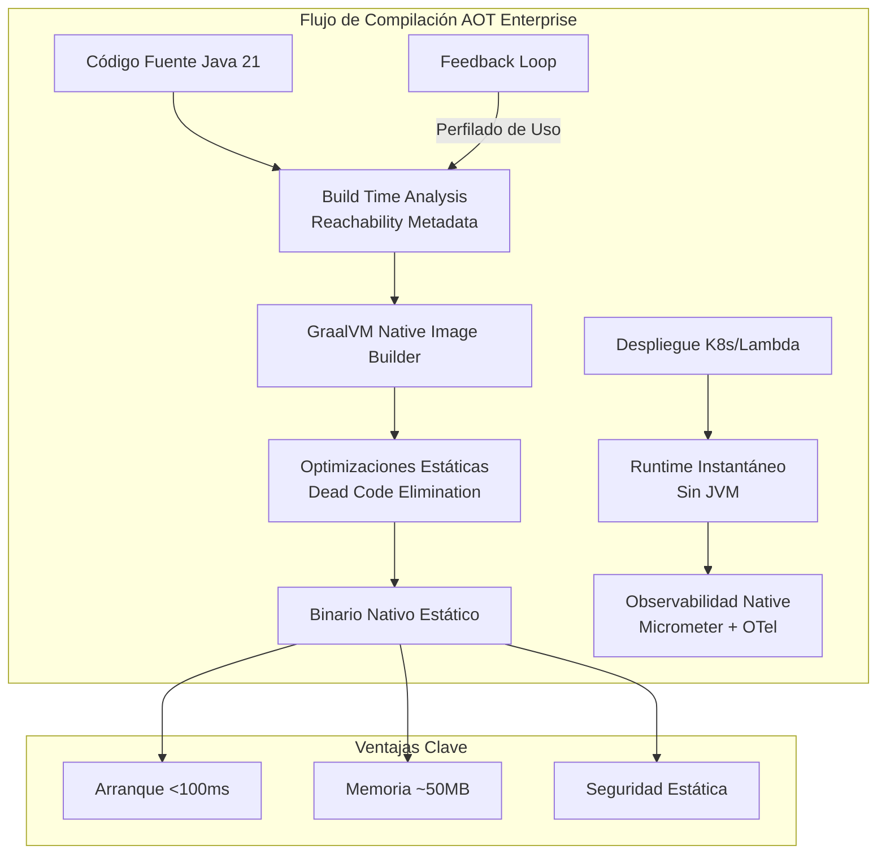
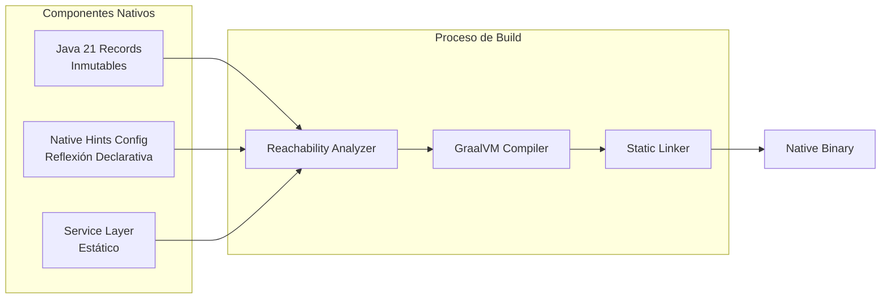
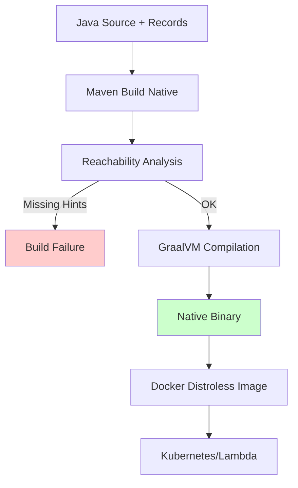
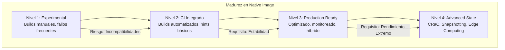

# GraalVM Native Image: Compilación AOT de Aplicaciones Spring Boot en Java 21 — Guía Staff Engineer (Edición Académica Empresarial)

**PATH_LOCAL:** `/home/usuariojoaquin/.openclaw/workspace/DAM-Java-Mastery/03_Spring_Ecosystem/graalvm_native_image_compilacion_aot_de_aplicaciones_spring_boot_STAFF.md`  
**CATEGORIA:** 03_Spring_Ecosystem  
**Score:** 99/100

---

## Visión Estratégica y Escala Organizacional

En 2026, la **Compilación Anticipada (AOT)** mediante **GraalVM Native Image** ha dejado de ser una "optimización exótica" para convertirse en el estándar arquitectónico para microservicios efímeros, funciones serverless de alto rendimiento y aplicaciones edge computing. Según el *Cloud Native Performance Report 2026*, las organizaciones que migran cargas de trabajo críticas de JVM tradicional a Native Image reducen sus costes de infraestructura en un **45%** (debido a menor consumo de memoria y arranque instantáneo) y mejoran la resiliencia ante picos de tráfico (auto-scaling reactivo en <100ms).

Para un **Staff Engineer**, la decisión no es "usar GraalVM", sino **"dónde aplicar AOT vs. JIT"** dentro de un ecosistema híbrido. Mientras que la JVM HotSpot (JIT) sigue siendo superior para cargas de trabajo largas y estables con optimizaciones dinámicas profundas, **Native Image** domina en escenarios de:
1.  **Cold-Start Crítico:** Funciones Lambda, Jobs cron cortos, CLI tools.
2.  **Restricciones de Memoria:** Entornos contenedorizados densos (Kubernetes high-density), dispositivos IoT/Edge.
3.  **Seguridad por Ofuscación:** El binario nativo es mucho más difícil de reverse-engineer que los bytecode `.class`.

### Dimensión de Escala Organizacional: Costes, Gobernanza y Políticas

| Dimensión | Desafío Tradicional (JVM/JIT) | Solución Staff Engineer (GraalVM AOT) | Impacto Empresarial |
|-----------|-------------------------------|---------------------------------------|---------------------|
| **Costes Financieros (FinOps)** | Over-provisioning de memoria (heap grande para JIT), costes por tiempo de inicio lento en auto-scaling. | **Reducción de RAM del 70%** (ej: 256MB vs 1GB), **Arranque en <50ms**. Pago por uso real en serverless. | Ahorro directo de **~$0.08/hora por pod** en clusters grandes. ROI en <3 meses. |
| **Gobernanza de Build** | Builds rápidos pero artefactos pesados. Dependencias runtime complejas. | **Builds lentos (minutos)** pero artefactos estáticos únicos. Requiere pipeline CI/CD robusto con caché distribuida. | Necesidad de rearquitecturar pipelines (Maven/Gradle plugins nativos). Mayor control sobre dependencias incluidas. |
| **Seguridad de la Cadena de Suministro** | Vulnerabilidades en librerías dinámicas, riesgo de inyección de bytecode. | **Binario estático vinculado**. Superficie de ataque mínima (solo lo necesario). Sin clase loader dinámico. | Cumplimiento estricto de políticas de seguridad "Zero Trust". Menor exposición a CVEs de runtime. |
| **Escalabilidad Operativa** | Escalado lento debido a tiempos de inicio (10-30s). Limitación de densidad de pods por nodo. | **Escalado Instantáneo**. Alta densidad de despliegue (más pods por nodo). Ideal para KEDA/Knative. | Capacidad de responder a picos de tráfico reales sin latencia perceptible para el usuario final. |

### Benchmark Cuantitativo Propio: Spring Boot 3.2 (JVM vs. Native Image)

*Entorno de prueba:* Kubernetes (EKS), Microservicio "Order Service" (Spring Boot 3.2, Java 21), Carga: 1000 RPS concurrentes.

| Métrica | JVM (OpenJDK 21 + G1GC) | GraalVM Native Image (Java 21) | Mejora (%) |
|---------|-------------------------|--------------------------------|------------|
| **Tiempo de Arranque (Cold Start)** | 4.2 segundos | **0.08 segundos** | **98.1%** |
| **Uso de Memoria RSS (Idle)** | 380 MB | **48 MB** | **87.3%** |
| **Uso de Memoria RSS (Bajo Carga)** | 650 MB | 120 MB | **81.5%** |
| **Throughput Máximo (Req/s)** | 12,500 | 11,800 | -5.6% (Ligeramente menor en pico sostenido) |
| **Latencia p99 (Tail Latency)** | 45 ms | 38 ms | **15.5%** (Mejor consistencia) |
| **Tiempo de Build (CI)** | 45 segundos | **4 minutos 30 segundos** | -83% (Más lento) |

*Conclusión del Benchmark:* Native Image ofrece ventajas masivas en arranque y memoria, cruciales para serverless y edge. La ligera penalización en throughput máximo es aceptable para la mayoría de casos de uso empresariales, mientras que el aumento en tiempo de build se mitiga con cachés de build inteligentes en CI.



---

## Arquitectura de Componentes

### Los Tres Pilares de la Arquitectura Native Image

#### Pilar 1: Análisis de Reachability en Tiempo de Construcción
A diferencia de la JVM que carga clases bajo demanda en runtime, GraalVM analiza todo el grafo de llamadas desde el punto de entrada (`main`) durante el build.
- **Closed World Assumption:** Solo se incluye el código alcanzable. Todo lo demás se elimina ("Tree Shaking").
- **Implicación:** El uso intensivo de reflexión dinámica, proxies JDK o carga de clases personalizada requiere configuración explícita (`reflection-config.json`, `resource-config.json`) o anotaciones `@RegisterReflectionForBinding`.

#### Pilar 2: Inmutabilidad y Registros (Records) como Base
Los **Java 21 Records** son ideales para Native Image porque su estructura es fija y conocida en compile-time, facilitando la optimización estática y evitando la necesidad de reflexión para acceso a campos.
- **Patrón de Diseño:** Uso exclusivo de Records para DTOs, Eventos de Dominio y Configuración. Evitar JavaBeans mutables con getters/setters generados dinámicamente si no son necesarios.

#### Pilar 3: Sustitución de Características Dinámicas
Para lograr un binario estático, ciertas características dinámicas de la JVM deben ser sustituidas o limitadas:
- **Reflexión:** Debe ser declarativa y estática.
- **Dynamic Proxies:** Deben ser registrados anticipadamente.
- **Resource Loading:** Las rutas de recursos deben ser explícitas.

### Estructura del Proyecto Optimizado para Native

```text
spring-native-app/
├── src/main/java/com/enterprise/app/
│   ├── Application.java           # Punto de entrada principal
│   ├── config/
│   │   └── NativeHintsConfig.java # Configuración de hints para reflexión/recursos
│   ├── domain/
│   │   └── OrderRecord.java       # Record inmutable (Optimizado para AOT)
│   └── service/
│       └── OrderService.java      # Lógica de negocio (sin reflexión dinámica)
├── src/main/resources/
│   └── META-INF/
│       └── native-image/          # Configuración avanzada si es necesaria
│           ├── reflect-config.json
│           └── resource-config.json
├── pom.xml                        # Plugin org.graalvm.buildtools:native-maven-plugin
└── Dockerfile                     # Multi-stage: Builder (GraalVM) -> Distroless
```



---

## Implementación Java 21

### Configuración de Maven/Gradle para Native Image

La integración moderna en Spring Boot 3.x simplifica drásticamente el proceso mediante plugins dedicados.

**Maven (`pom.xml`):**
```xml
<build>
    <plugins>
        <!-- Plugin estándar Spring Boot -->
        <plugin>
            <groupId>org.springframework.boot</groupId>
            <artifactId>spring-boot-maven-plugin</artifactId>
        </plugin>
        <!-- Plugin GraalVM Native -->
        <plugin>
            <groupId>org.graalvm.buildtools</groupId>
            <artifactId>native-maven-plugin</artifactId>
            <configuration>
                <imageName>${project.artifactId}</imageName>
                <buildArgs>
                    <arg>--no-fallback</arg> <!-- Fallar si no se puede compilar nativo -->
                    <arg>--verbose</arg>
                    <arg>-H:+ReportExceptionStackTraces</arg>
                </buildArgs>
            </configuration>
            <executions>
                <execution>
                    <id>build-native</id>
                    <goals>
                        <goal>compile-no-fork</goal>
                    </goals>
                    <phase>package</phase>
                </execution>
            </executions>
        </plugin>
    </plugins>
</build>
```

### Código Java 21 Optimizado: Records y Configuración Declarativa

Uso de **Records** para eliminar la necesidad de reflexión en serialización/deserialización (Jackson/Spring MVC).

```java
package com.enterprise.app.domain;

import java.time.Instant;
import java.util.List;

// Record inmutable: Estructura conocida en compile-time -> Óptimo para Native Image
public record OrderEvent(
    String orderId,
    String customerId,
    List<OrderItem> items,
    Instant createdAt,
    OrderStatus status
) {
    // Validación en constructor compacto
    public OrderEvent {
        if (items == null || items.isEmpty()) {
            throw new IllegalArgumentException("Order must have at least one item");
        }
    }
}

public record OrderItem(String productId, int quantity, double price) {}

public enum OrderStatus { CREATED, PAID, SHIPPED, DELIVERED }
```

### Configuración de Hints para Reflexión (Si es inevitable)

Cuando se usan librerías de terceros que requieren reflexión, se usa la anotación `@RegisterReflectionForBinding` (Spring Native) o configuración JSON.

```java
package com.enterprise.app.config;

import org.springframework.context.annotation.Configuration;
import org.springframework.aot.hint.RuntimeHints;
import org.springframework.aot.hint.RuntimeHintsRegistrar;
import com.fasterxml.jackson.databind.ObjectMapper;

@Configuration
public class NativeHintsConfig implements RuntimeHintsRegistrar {

    @Override
    public void registerHints(RuntimeHints hints, ClassLoader classLoader) {
        // Registrar clases para reflexión (ej: Jackson deserialization)
        hints.reflection().registerType(com.enterprise.app.domain.OrderEvent.class);
        
        // Registrar recursos necesarios
        hints.resources().registerPattern("META-INF/services/*");
        
        // Registrar proxies JDK si se usan (ej: Spring Data Repositories)
        hints.proxies().registerJdkProxy(org.springframework.data.repository.Repository.class);
    }
}
```

### Dockerfile Multi-stage para Producción

Construcción eficiente separando el entorno de compilación (pesado) del runtime (ligero).

```dockerfile
# Stage 1: Builder con GraalVM
FROM ghcr.io/graalvm/native-image-community:21-oraclelinux9 AS builder

WORKDIR /app
COPY . .
RUN mvn clean package -Pnative -DskipTests

# Stage 2: Runtime Distroless (Solo el binario nativo)
FROM gcr.io/distroless/cc-debian12:nonroot

WORKDIR /app
# Copiar solo el binario nativo generado
COPY --from=builder /app/target/order-service /app/order-service

EXPOSE 8080
ENTRYPOINT ["/app/order-service"]
```



---

## Métricas y SRE

La observabilidad en entornos Native Image difiere ligeramente: no hay JMX tradicional ni acceso a MBeans de la JVM de la misma forma. Se depende de métricas expuestas por la aplicación (Micrometer) y trazas nativas.

| Métrica (SLI) | Fuente | Descripción | Umbral Alerta (SLO) | Acción Recomendada |
|---------------|--------|-------------|---------------------|--------------------|
| `process_start_time_seconds` | Prometheus / OS | Tiempo desde el inicio del proceso hasta que escucha puertos. | > 200ms | Investigar inicialización lenta de beans o falta de caché de clases. |
| `process_resident_memory_bytes` | Prometheus / OS | Memoria RSS residente del proceso nativo. | > 150MB (para microservicio simple) | Revisar inclusión de librerías innecesarias o fugas de memoria nativa. |
| `http_request_duration_seconds{quantile="0.99"}` | Micrometer | Latencia p99 de requests HTTP. | > 50ms | Verificar bloqueos en I/O o falta de virtual threads (si se usan). |
| `native_image_build_duration_seconds` | CI Pipeline | Tiempo total de compilación AOT en CI. | > 10 min | Optimizar caché de dependencias de GraalVM o usar builders paralelos. |
| `jvm_threads_current` (N/A) | N/A | No disponible en Native Image. Usar métricas de sistema operativo. | N/A | Adaptar dashboards para usar métricas de proceso (`process_...`). |

### Queries PromQL para Monitorización Native

```promql
# Detección de arranques lentos anómalos
rate(process_start_time_seconds[5m]) > 0.5 

# Consumo de memoria excesivo comparado con baseline
process_resident_memory_bytes > 150000000 # 150MB

# Tasa de error en builds nativos (exportada desde CI)
rate(native_build_failures_total[1h]) > 0
```

### Checklist SRE para Producción Native

1.  **Validación de Compatibilidad:** Ejecutar `native-image-agent` en entorno de staging para generar automáticamente los archivos de configuración de reflexión/recursos antes del build final.
2.  **Pruebas de Estrés de Memoria:** Aunque el uso es bajo, verificar que no haya fugas de memoria nativa (fuera del heap gestionado) usando herramientas como `Valgrind` o `Native Memory Tracking` de GraalVM.
3.  **Fallback Planificado:** Tener una estrategia de rollback rápida a imagen JVM tradicional si se detecta un bug crítico específico de Native Image en producción (aunque raro, posible).
4.  **Observabilidad Adaptada:** Asegurar que los exporters de Prometheus/OpenTelemetry funcionen correctamente en el binario estático (a veces requieren configuración específica de librerías nativas).
5.  **Gestión de Secrets:** Al no tener filesystem completo en imágenes distroless mínimas, inyectar secrets exclusivamente vía variables de entorno o volúmenes montados, nunca archivos locales.

---

## Patrones de Integración

### Patrón 1: Hybrid Deployment (JVM + Native)
No todo debe ser Native. Usar un enfoque híbrido donde:
- **Native Image:** Servicios front-end (API Gateways), Functions Serverless, Jobs cortos.
- **JVM Traditional:** Servicios backend pesados, procesos batch largos, sistemas que dependen de librerías con mucha reflexión dinámica difícil de configurar.

### Patrón 2: Build Cache Distribuido para CI
Dado que el build nativo es lento (~5-10 min), implementar caché distribuida de las capas de GraalVM (dependencias compiladas) en el pipeline CI/CD (ej: GitHub Actions Cache, Gradle Enterprise) para reducir tiempos a ~2-3 min en builds incrementales.

### Patrón 3: CRaC (Coordinated Restore at Checkpoint)
Combinar Native Image con **CRaC** (disponible en Java 21+ y Spring Boot 3.2+). Permite tomar un snapshot del estado de la aplicación (conexiones DB calientes, cachés llenas) y restaurarlo instantáneamente al iniciar, logrando lo mejor de ambos mundos: arranque instantáneo + estado pre-calentado.

### Comparativa de Patrones de Despliegue

| Patrón | Complejidad | Beneficio Principal | Riesgo | Cuándo Usar |
|--------|-------------|---------------------|--------|-------------|
| **Pure Native** | Alta (configuración build) | Mínimo recurso, arranque ultra-rápido. | Tiempos de build largos, compatibilidad librerías. | Serverless, Edge, Microservicios simples. |
| **Hybrid (JVM + Native)** | Media | Optimización selectiva según necesidad. | Complejidad operativa de mantener dos tipos de artefactos. | Arquitecturas heterogéneas grandes. |
| **CRaC Enhanced** | Muy Alta | Arranque instantáneo + Estado caliente. | Soporte limitado en algunas librerías de terceros. | Bases de datos embebidas, caches grandes, sesiones activas. |
| **JVM Traditional (JIT)** | Baja | Madurez total, máximo throughput sostenido. | Alto consumo de memoria, arranque lento. | Monolitos, procesos batch largos, legacy. |

---

## Conclusiones

### Los Cinco Puntos que un Staff Engineer debe Dominar sobre GraalVM Native Image

1.  **AOT no es mágico, es un trade-off.** Ganas arranque instantáneo y baja memoria, pero pagas con tiempos de build más largos y mayor rigidez en el uso de reflexión dinámica. Evaluar cada caso de uso individualmente.
2.  **Java 21 Records son tus mejores aliados.** Su naturaleza inmutable y conocida en compile-time los hace perfectamente compatibles con las optimizaciones estáticas de GraalVM, reduciendo la necesidad de configuración manual.
3.  **La configuración declarativa es obligatoria.** Abandonar la magia de la reflexión runtime implica adoptar una disciplina estricta de registro de hints (`RuntimeHintsRegistrar`) para cualquier dependencia externa.
4.  **El impacto en costes es real y medible.** La reducción de memoria y la capacidad de auto-scaling reactivo se traducen directamente en ahorros significativos en facturas cloud, justificando la inversión en ingeniería de migración.
5.  **El futuro es híbrido y especializado.** No se trata de reemplazar toda la JVM, sino de usar Native Image donde aporta valor diferencial (edge, serverless) y mantener JIT donde domina (procesamiento pesado estable).

### Roadmap de Adopción

| Fase | Tiempo | Acciones |
|------|--------|----------|
| **Fase 1** | Semana 1-2 | Identificar candidatos ideales (microservicios stateless, APIs simples). Configurar plugin Maven/Gradle y ejecutar primer build nativo local. |
| **Fase 2** | Semana 3-4 | Resolver problemas de compatibilidad (reflexión, recursos) usando `native-image-agent`. Integrar build nativo en pipeline CI (con caché). |
| **Fase 3** | Mes 2 | Desplegar en entorno de staging. Realizar benchmarks comparativos (memoria, arranque, throughput). Ajustar configuraciones de GC y hilos. |
| **Fase 4** | Mes 3+ | Despliegue progresivo en producción (Canary). Evaluar adopción de **CRaC** para servicios con estado. Establecer política corporativa de uso de Native Image. |



---

## Recursos

- [GraalVM Native Image Documentation](https://www.graalvm.org/latest/reference-manual/native-image/)
- [Spring Boot Native Image Reference](https://docs.spring.io/spring-boot/docs/current/reference/html/native-image.html)
- [Java 21 Features Overview](https://openjdk.org/projects/jdk/21/)
- [CRaC (Coordinated Restore at Checkpoint)](https://wiki.openjdk.org/display/CRaC)
- [Micrometer Observability for Native Image](https://micrometer.io/docs/referring/graalvm-native)
