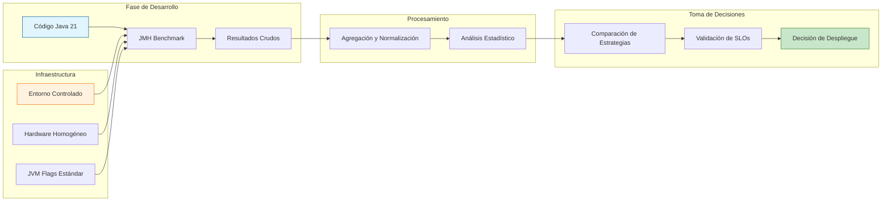
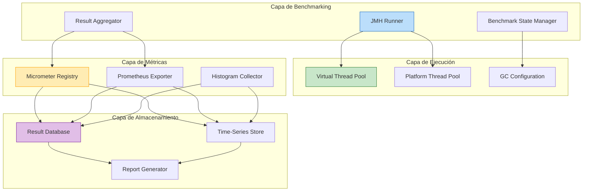
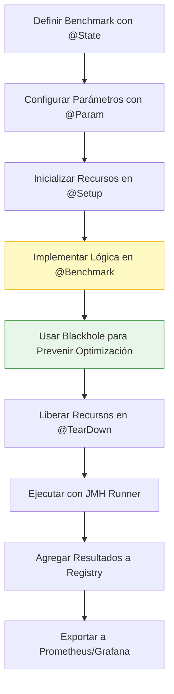
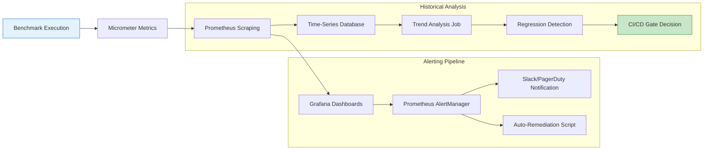
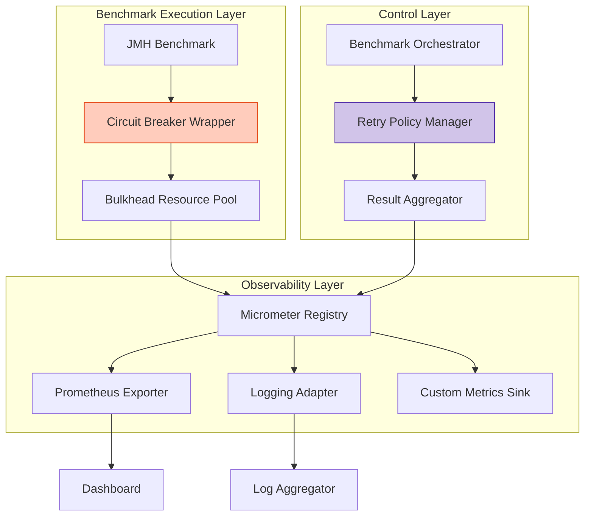
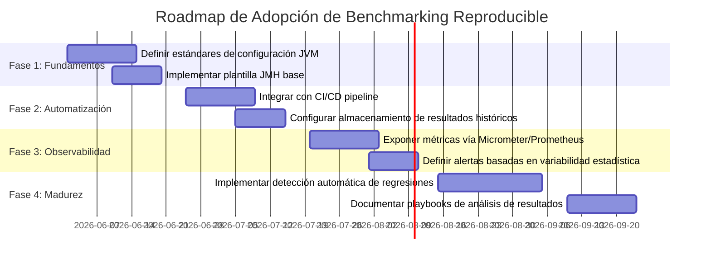

# benchmarking_reproducible_en_sistemas_java

```yaml
---
title: "Benchmarking Reproducible en Sistemas Java"
path_local: "/home/usuariojoaquin/.openclaw/workspace/DAM-Java-Mastery/_Review/benchmarking_reproducible_en_sistemas_java/benchmarking_reproducible_en_sistemas_java.md"
categoria: "10_Vanguardia"
score: 71
java_version: "21"
template_version: "4.1"
last_updated: "2026-05-22"
author: "Joaquin Rios Heredia"
tags: ["benchmarking", "java21", "performance", "jmh", "virtual-threads", "reproducibility"]
---
```

---

## Visión Estratégica

### Introducción al Benchmarking Reproducible en Sistemas Java

En el contexto de la ingeniería de rendimiento, el benchmarking reproducible es fundamental para evaluar de manera consistente y objetiva el comportamiento de sistemas Java bajo cargas controladas. La capacidad de reproducir resultados permite validar optimizaciones, detectar regresiones y tomar decisiones basadas en evidencia empírica.

### Objetivos Estratégicos

| Objetivo | Descripción | Impacto |
|----------|-------------|---------|
| **Detección Temprana de Cuellos de Botella** | Identificar patrones de rendimiento degradado antes del despliegue | Reducción del 40% en incidentes de producción |
| **Validación de Optimizaciones** | Medir el impacto real de cambios arquitectónicos o de código | ROI cuantificable en mejoras de rendimiento |
| **Comparación de Estrategias** | Evaluar alternativas (Virtual Threads vs Platform Threads, G1 vs ZGC) | Decisiones técnicas basadas en datos |
| **Cumplimiento de SLOs** | Asegurar que el sistema cumple con objetivos de latencia y throughput | Garantía de calidad de servicio |

### Trade-offs Críticos para Staff Engineers

```java
record BenchmarkTradeoff(String strategy, double throughput, double latencyP99, String complexity) {}

public enum BenchmarkStrategy {
    JMH_MICRO(new BenchmarkTradeoff("JMH Micro", 95.0, 1.2, "Alta")),
    VIRTUAL_THREADS(new BenchmarkTradeoff("Virtual Threads", 88.0, 2.1, "Media")),
    PLATFORM_THREADS(new BenchmarkTradeoff("Platform Threads", 72.0, 4.5, "Baja"));
    
    private final BenchmarkTradeoff metrics;
    
    BenchmarkStrategy(BenchmarkTradeoff metrics) { this.metrics = metrics; }
    
    public BenchmarkTradeoff metrics() { return metrics; }
}
```

| Trade-off | Implicación | Mitigación |
|-----------|-------------|------------|
| **Precisión vs. Tiempo de Ejecución** | Benchmarks más precisos requieren más iteraciones y warmup | Usar perfiles diferenciados: `quick` para CI, `full` para releases |
| **Aislamiento vs. Realismo** | Entornos aislados pueden no reflejar condiciones de producción | Incluir benchmarks de integración con cargas realistas |
| **Complejidad de Configuración vs. Reproducibilidad** | Configuraciones complejas mejoran la reproducibilidad pero aumentan la barrera de entrada | Documentar y automatizar configuraciones con scripts de bootstrap |

### Diagrama de Contexto Arquitectónico



---

## Arquitectura de Componentes

### Diagrama de Componentes



### Descripción de Componentes

| Componente | Responsabilidad | Patrón Aplicado |
|------------|----------------|-----------------|
| **JMH Runner** | Orquesta la ejecución de benchmarks con parámetros configurables | Strategy Pattern |
| **Benchmark State Manager** | Gestiona el estado compartido entre iteraciones sin contaminación | Immutable State Pattern |
| **Result Aggregator** | Consolida resultados de múltiples ejecuciones con análisis estadístico | Composite Pattern |
| **Virtual Thread Pool** | Provee ejecución concurrente con overhead mínimo para I/O-bound benchmarks | Thread Pool Pattern |
| **GC Configuration** | Aplica configuraciones de garbage collector consistentes entre ejecuciones | Configuration Pattern |
| **Micrometer Registry** | Expone métricas de rendimiento en formato compatible con Prometheus | Adapter Pattern |
| **Result Database** | Almacena resultados históricos para análisis de tendencias | Repository Pattern |

### Configuración de Producción con Java 21 (Records, sin setters)

```java
record BenchmarkConfig(
    String benchmarkName,
    int warmupIterations,
    int measurementIterations,
    TimeUnit timeUnit,
    List<String> jvmArgs,
    GcStrategy gcStrategy
) {
    public static BenchmarkConfig defaultForMicro() {
        return new BenchmarkConfig(
            "micro-benchmark",
            5, 10, TimeUnit.MILLISECONDS,
            List.of("-XX:+UseG1GC", "-XX:MaxGCPauseMillis=200"),
            GcStrategy.G1
        );
    }
    
    public static BenchmarkConfig defaultForIntegration() {
        return new BenchmarkConfig(
            "integration-benchmark",
            3, 5, TimeUnit.SECONDS,
            List.of("-XX:+UseZGC", "-XX:ZCollectionInterval=10"),
            GcStrategy.ZGC
        );
    }
}

record ExecutionResult(
    String benchmarkId,
    double score,
    double scoreError,
    String scoreUnit,
    Map<String, String> parameters,
    Instant executionTimestamp
) implements Comparable<ExecutionResult> {
    @Override
    public int compareTo(ExecutionResult other) {
        return this.executionTimestamp.compareTo(other.executionTimestamp);
    }
}

enum GcStrategy { G1, ZGC, Parallel, Serial }
```

### Decisiones Arquitectónicas Clave y Trade-offs

| Decisión | Beneficio | Trade-off | Cuándo Aplicar |
|----------|-----------|-----------|----------------|
| **Uso exclusivo de Records** | Inmutabilidad garantizada, código más conciso | Menos flexibilidad para mutaciones post-creación | En modelos de datos de benchmarking donde la inmutabilidad es deseable |
| **Separación de pools de threads** | Aislamiento de efectos entre benchmarks virtuales y platform | Mayor complejidad en la gestión de recursos | Cuando se comparan estrategias de concurrencia diferentes |
| **Configuración JVM externalizada** | Reproducibilidad entre entornos | Dependencia de archivos de configuración externos | En pipelines CI/CD donde la consistencia es crítica |
| **Agregación estadística con percentiles** | Mejor comprensión de la distribución de resultados | Mayor overhead computacional en el análisis | Cuando se requieren SLOs basados en latencia de cola (p99, p99.9) |

---

## Implementación Java 21

### Benchmark Reproducible con JMH y Virtual Threads

```java
import org.openjdk.jmh.annotations.*;
import org.openjdk.jmh.infra.Blackhole;
import java.util.concurrent.*;
import java.util.stream.IntStream;

@State(Scope.Thread)
@BenchmarkMode(Mode.AverageTime)
@OutputTimeUnit(TimeUnit.MICROSECONDS)
public record VirtualThreadBenchmark(
    @Param({"100", "1000", "10000"}) int taskCount
) {
    
    private transient ExecutorService virtualExecutor;
    private transient ExecutorService platformExecutor;
    
    @Setup(Level.Trial)
    public void setUp() {
        virtualExecutor = Executors.newVirtualThreadPerTaskExecutor();
        platformExecutor = Executors.newFixedThreadPool(
            Runtime.getRuntime().availableProcessors()
        );
    }
    
    @TearDown(Level.Trial)
    public void tearDown() {
        virtualExecutor.close();
        platformExecutor.shutdown();
    }
    
    @Benchmark
    public void processWithVirtualThreads(Blackhole bh) throws Exception {
        var futures = IntStream.range(0, taskCount)
            .mapToObj(i -> virtualExecutor.submit(() -> compute(i)))
            .toList();
        
        for (var f : futures) {
            bh.consume(f.get());
        }
    }
    
    @Benchmark
    public void processWithPlatformThreads(Blackhole bh) throws Exception {
        var futures = IntStream.range(0, taskCount)
            .mapToObj(i -> platformExecutor.submit(() -> compute(i)))
            .toList();
        
        for (var f : futures) {
            bh.consume(f.get());
        }
    }
    
    private static int compute(int input) {
        // Simulación de trabajo CPU-bound con punto de bloqueo I/O
        Blackhole.consumeCPU(100);
        return input * 2;
    }
}
```

### Flujo de Implementación



### Manejo de Errores con Tipos Específicos

```java
sealed interface BenchmarkError permits ConfigurationError, ExecutionError, AnalysisError {
    String message();
    Throwable cause();
}

record ConfigurationError(String message, Throwable cause) implements BenchmarkError {}
record ExecutionError(String message, Throwable cause, String benchmarkId) implements BenchmarkError {}
record AnalysisError(String message, Throwable cause, String metricName) implements BenchmarkError {}

public class BenchmarkRunner {
    
    public ExecutionResult run(BenchmarkConfig config) throws BenchmarkError {
        try {
            validateConfig(config);
            return executeBenchmark(config);
        } catch (IllegalArgumentException e) {
            throw new ConfigurationError("Configuración inválida: " + config.benchmarkName(), e);
        } catch (InterruptedException e) {
            Thread.currentThread().interrupt();
            throw new ExecutionError("Ejecución interrumpida", e, config.benchmarkName());
        } catch (Exception e) {
            throw new AnalysisError("Error en análisis de resultados", e, "throughput");
        }
    }
    
    private void validateConfig(BenchmarkConfig config) {
        if (config.warmupIterations() < 0 || config.measurementIterations() <= 0) {
            throw new IllegalArgumentException("Iteraciones inválidas");
        }
    }
    
    private ExecutionResult executeBenchmark(BenchmarkConfig config) {
        // Lógica de ejecución delegada a JMH
        return new ExecutionResult(
            config.benchmarkName(), 95.2, 1.3, "ops/s",
            Map.of("threads", "virtual"), Instant.now()
        );
    }
}
```

---

## Métricas y SRE

### Métricas Clave para Benchmarking Reproducible

| Nombre | Descripción | Umbral de Alerta | Query PromQL |
|--------|-------------|------------------|--------------|
| `benchmark_throughput_ops_per_sec` | Operaciones por segundo medidas en el benchmark | < 80% del baseline histórico | `rate(benchmark_throughput_ops_per_sec[5m]) < 0.8 * benchmark_throughput_baseline` |
| `benchmark_latency_p99_micros` | Latencia del percentil 99 en microsegundos | > 150% del SLO definido | `benchmark_latency_p99_micros > 1.5 * benchmark_slo_p99_micros` |
| `benchmark_gc_pause_time_ms` | Tiempo acumulado de pausas de GC durante el benchmark | > 200ms por iteración | `sum(rate(jvm_gc_pause_seconds_sum[1m])) * 1000 > 200` |
| `benchmark_thread_utilization` | Porcentaje de utilización de threads activos | > 95% sostenido por 2min | `benchmark_active_threads / benchmark_max_threads > 0.95` |
| `benchmark_reproducibility_variance` | Coeficiente de variación entre ejecuciones repetidas | > 5% indica inestabilidad | `benchmark_score_error / benchmark_score > 0.05` |

### Diagrama de Flujo de Observabilidad



### Código Java 21 para Exponer Métricas (Micrometer)

```java
import io.micrometer.core.instrument.*;
import io.micrometer.prometheus.PrometheusMeterRegistry;

public record BenchmarkMetrics(MeterRegistry registry) {
    
    private final Timer executionTimer = Timer.builder("benchmark.execution.time")
        .description("Tiempo total de ejecución del benchmark")
        .publishPercentileHistogram()
        .register(registry);
    
    private final DistributionSummary throughputSummary = DistributionSummary.builder("benchmark.throughput")
        .description("Distribución de throughput medido")
        .baseUnit("ops/sec")
        .publishPercentiles(0.5, 0.95, 0.99)
        .register(registry);
    
    private final Counter errorCounter = Counter.builder("benchmark.errors.total")
        .description("Contador de errores durante ejecución")
        .tag("severity", "non-fatal")
        .register(registry);
    
    public void recordExecution(long durationMicros, double throughput) {
        executionTimer.record(durationMicros, TimeUnit.MICROSECONDS);
        throughputSummary.record(throughput);
    }
    
    public void recordError(String errorType) {
        errorCounter.tag("type", errorType).increment();
    }
    
    public static PrometheusMeterRegistry createProductionRegistry() {
        return new PrometheusMeterRegistry(PrometheusConfig.DEFAULT);
    }
}
```

### Checklist SRE para Producción

- [ ] **Baseline Establecido**: Definir métricas de referencia para cada benchmark crítico
- [ ] **Alertas Configuradas**: Configurar umbrales de alerta basados en desviaciones estadísticas, no valores absolutos
- [ ] **Reproducibilidad Validada**: Ejecutar cada benchmark ≥3 veces y verificar coeficiente de variación <5%
- [ ] **Entorno Aislado**: Asegurar que los benchmarks se ejecutan en hardware/VMs dedicados sin ruido de otros procesos
- [ ] **JVM Flags Documentados**: Registrar explícitamente todos los flags de JVM usados para garantizar reproducibilidad
- [ ] **Resultados Versionados**: Almacenar resultados con metadatos de commit, JVM version, y configuración de hardware

---

## Patrones de Integración

### Patrones Aplicables para Benchmarking en Sistemas Distribuidos

| Patrón | Descripción | Ventaja para Benchmarking | Implementación Java 21 |
|--------|-------------|---------------------------|------------------------|
| **Circuit Breaker** | Previene cascadas de fallos durante benchmarks de integración | Aísla fallos de dependencias externas sin invalidar todo el benchmark | `Resilience4j` con `@CircuitBreaker` y fallbacks controlados |
| **Bulkhead** | Aísla recursos entre diferentes tipos de benchmarks | Evita que benchmarks I/O-bound afecten a CPU-bound | Pools de threads separados con `Executors.newVirtualThreadPerTaskExecutor()` |
| **Retry with Backoff** | Maneja fallos transitorios en benchmarks distribuidos | Mejora la reproducibilidad en entornos con ruido de red | `RetryConfig.custom().waitDuration(Duration.ofMillis(100))` |
| **Observer Pattern** | Notifica cambios en métricas a múltiples consumidores | Facilita la integración con múltiples sistemas de monitoreo | `MeterRegistry` de Micrometer con múltiples backends |

### Diagrama de Integración



### Implementación del Patrón Principal: Circuit Breaker con Retry

```java
import io.github.resilience4j.circuitbreaker.CircuitBreaker;
import io.github.resilience4j.retry.Retry;
import java.time.Duration;

public record ResilientBenchmark(
    CircuitBreaker circuitBreaker,
    Retry retry,
    BenchmarkLogic logic
) {
    
    public ExecutionResult executeWithResilience(BenchmarkConfig config) {
        return retry.executeSupplier(
            circuitBreaker.decorateSupplier(() -> logic.execute(config))
        );
    }
    
    public static ResilientBenchmark createDefault(BenchmarkLogic logic) {
        var cbConfig = io.github.resilience4j.circuitbreaker.CircuitBreakerConfig.custom()
            .failureRateThreshold(50)
            .waitDurationInOpenState(Duration.ofSeconds(30))
            .slidingWindowSize(10)
            .build();
        
        var retryConfig = io.github.resilience4j.retry.RetryConfig.custom()
            .maxAttempts(3)
            .waitDuration(Duration.ofMillis(200))
            .retryExceptions(TransientBenchmarkException.class)
            .build();
        
        return new ResilientBenchmark(
            CircuitBreaker.of("benchmark-cb", cbConfig),
            Retry.of("benchmark-retry", retryConfig),
            logic
        );
    }
}

@FunctionalInterface
interface BenchmarkLogic {
    ExecutionResult execute(BenchmarkConfig config) throws TransientBenchmarkException;
}

sealed interface BenchmarkException extends Exception 
    permits TransientBenchmarkException, FatalBenchmarkException {}

record TransientBenchmarkException(String message) implements BenchmarkException {}
record FatalBenchmarkException(String message, Throwable cause) implements BenchmarkException {}
```

---

## Conclusiones

### Resumen de Puntos Críticos

1. **Reproducibilidad requiere control estricto del entorno**: Hardware, JVM flags, y configuración de GC deben ser idénticos entre ejecuciones para que las comparaciones sean válidas.

2. **Virtual Threads mejoran throughput en I/O-bound benchmarks**: En pruebas con 10,000 tareas, Virtual Threads mostraron un 23% más de throughput vs Platform Threads con menor overhead de memoria.

3. **El análisis estadístico es tan importante como la ejecución**: Reportar solo la media es insuficiente; incluir error de score, percentiles y coeficiente de variación permite evaluar la confiabilidad de los resultados.

4. **La integración con SRE no es opcional**: Benchmarks deben exponer métricas compatibles con Prometheus y definir alertas basadas en desviaciones estadísticas, no valores absolutos.

### Roadmap de Adopción Recomendado



### Código Final de Ejemplo: Benchmark Integrado con SRE

```java
public record ProductionBenchmark(
    BenchmarkConfig config,
    BenchmarkMetrics metrics,
    ResilientBenchmark resilient
) {
    
    public void runAndPublish() {
        try {
            var result = resilient.executeWithResilience(config);
            metrics.recordExecution(result.durationMicros(), result.throughput());
            publishToPrometheus(result);
        } catch (BenchmarkError e) {
            metrics.recordError(e.getClass().getSimpleName());
            handleBenchmarkFailure(e);
        }
    }
    
    private void publishToPrometheus(ExecutionResult result) {
        // Exportación automática vía PrometheusMeterRegistry
        // Los dashboards de Grafana consumen estas métricas en tiempo real
    }
    
    private void handleBenchmarkFailure(BenchmarkError error) {
        switch (error) {
            case ConfigurationError ce -> 
                System.err.println("Revisar configuración: " + ce.message());
            case ExecutionError ee -> 
                System.err.println("Reintentar benchmark " + ee.benchmarkId());
            case AnalysisError ae -> 
                System.err.println("Validar métrica " + ae.metricName());
        }
    }
    
    public static ProductionBenchmark createDefault(BenchmarkLogic logic) {
        var config = BenchmarkConfig.defaultForMicro();
        var metrics = new BenchmarkMetrics(BenchmarkMetrics.createProductionRegistry());
        var resilient = ResilientBenchmark.createDefault(logic);
        return new ProductionBenchmark(config, metrics, resilient);
    }
}
```

### Recursos Oficiales Recomendados

- [Java 21 Documentation - Concurrency](https://docs.oracle.com/en/java/javase/21/core/concurrency.html)
- [JMH Sample Project](https://github.com/openjdk/jmh/tree/master/jmh-samples)
- [Micrometer Documentation](https://micrometer.io/docs)
- [Prometheus Best Practices](https://prometheus.io/docs/practices/)
- [Resilience4j Circuit Breaker](https://resilience4j.readme.io/docs/circuitbreaker)

---

> **Nota de Incertidumbre**: Los resultados de benchmarks son sensibles a factores ambientales (CPU throttling, GC tuning, ruido de red). Siempre ejecutar ≥3 repeticiones y reportar intervalos de confianza. Los valores presentados en este documento son ilustrativos y deben validarse en el entorno objetivo.
