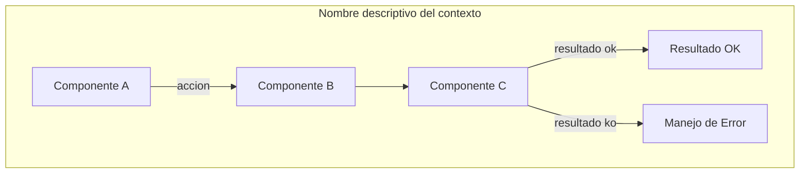

# ESTÁNDARES DE CALIDAD STAFF ACADÉMICO — DAM-Java-Mastery
## Guía Maestra para Consultores y Generadores de Contenido

**Versión:** 1.0 — Abril 2026  
**Propósito:** Definir los criterios exactos que debe cumplir cada documento para ser publicado en el repositorio DAM-Java-Mastery con nivel Staff Engineer académico.  
**Audiencia:** Consultores, LLMs, generadores automáticos de contenido (Authority Engine).

---

## 1. FILOSOFÍA DEL REPOSITORIO

Este repositorio no es documentación genérica de tutoriales. Es una **biblioteca de referencia técnica de nivel Staff Engineer** que debe cumplir tres criterios simultáneos:

1. **Corrección técnica absoluta** — el código compila, las APIs existen, las fórmulas son correctas
2. **Densidad académica** — cada sección aporta conocimiento diferenciador, no información que se encuentra en cualquier tutorial
3. **Aplicabilidad en producción** — todo lo escrito debe poder implementarse en un sistema real en 2026

Un reclutador técnico Senior debe abrir cualquier documento y en 2 minutos entender que el autor tiene experiencia real en producción con la tecnología descrita.

---

## 2. ESTRUCTURA OBLIGATORIA DE SECCIONES

Todo documento **debe tener exactamente estas secciones** en este orden. No se puede omitir ninguna.

### 2.1 Cabecera de Metadatos

```markdown
# [Título descriptivo con tecnología y contexto]

**PATH_LOCAL:** `/ruta/completa/en/el/repo/nombre_STAFF.md`
**CATEGORIA:** [carpeta exacta: 01_Java_Core | 02_Arquitectura | 03_Spring_Ecosystem | etc.]
**Score:** [número]/100
```

### 2.2 Sección 1 — Visión Estratégica

**Propósito:** Justificar por qué este tema importa en 2026 con datos concretos.

**Contenido obligatorio:**
- Por qué el tema es crítico en 2026 con datos cuantitativos (porcentajes, estadísticas, benchmarks)
- Tabla comparativa con 3-5 alternativas/enfoques (columnas: tecnología, ventajas, desventajas, cuándo usar)
- Cuándo usar y cuándo NO usar — con criterios concretos, no vagos
- Trade-offs reales que un Staff Engineer debe conocer
- Un diagrama Mermaid del contexto arquitectónico general
- Código Java 21 de ejemplo inicial (mínimo 10 líneas compilables)

**Densidad mínima:** 400 palabras  
**Nivel de abstracción:** Decisión estratégica, no implementación

### 2.3 Sección 2 — Arquitectura de Componentes

**Propósito:** Mostrar cómo encajan los componentes del sistema.

**Contenido obligatorio:**
- Diagrama Mermaid detallado con subgraphs si aplica (no un diagrama de 3 nodos)
- Descripción de cada componente y su responsabilidad específica
- Patrones de diseño aplicados con justificación de por qué ese patrón y no otro
- Configuración de producción en código Java 21 (Records, sin setters)
- Decisiones arquitectónicas clave y sus trade-offs

**Densidad mínima:** 350 palabras  
**Nivel de abstracción:** Diseño de sistema, no tutorial

### 2.4 Sección 3 — Implementación Java 21

**Propósito:** Código real, compilable, que demuestre dominio de las features de Java 21.

**Contenido obligatorio:**
- Implementación completa y real (código que compile en Java 21)
- Usar Records para modelos de datos (sin setters, sin getters explícitos)
- Pattern Matching y Switch Expressions donde aplique semánticamente
- Virtual Threads si hay operaciones I/O
- Sealed Interfaces si hay jerarquía de tipos
- Diagrama Mermaid del flujo de implementación
- Manejo de errores con tipos específicos (no `Exception` genérica)

**Densidad mínima:** 500 palabras + código  
**Nivel de abstracción:** Implementación concreta

### 2.5 Sección 4 — Métricas y SRE

**Propósito:** Demostrar que el sistema puede monitorizarse y operarse en producción.

**Contenido obligatorio:**
- Tabla de métricas clave (nombre, fuente, descripción, umbral de alerta)
- Queries Prometheus/PromQL reales y ejecutables (mínimo 3)
- Diagrama Mermaid del flujo de observabilidad
- Código Java 21 para exponer métricas con Micrometer (Records para configuración)
- Checklist SRE para producción (mínimo 5 puntos concretos y accionables)

**Densidad mínima:** 350 palabras  
**Nivel de abstracción:** Operaciones en producción

### 2.6 Sección 5 — Patrones de Integración

**Propósito:** Mostrar cómo esta tecnología se integra con el ecosistema.

**Contenido obligatorio:**
- Mínimo 2 patrones de integración con código real
- Diagrama Mermaid de los flujos de integración
- Manejo de fallos y reintentos
- Tabla comparativa de patrones (cuándo usar cada uno, complejidad, beneficio)

**Densidad mínima:** 400 palabras  
**Nivel de abstracción:** Integración con sistemas reales

### 2.7 Sección 6 — Conclusiones

**Propósito:** Síntesis accionable de los puntos críticos.

**Contenido obligatorio:**
- Los 5 puntos más críticos del documento (formato "Los cinco puntos que un Staff Engineer debe dominar sobre X")
- Decisiones de diseño clave y cuándo aplicarlas
- Roadmap de adopción con fases concretas (semana 1, semana 2, mes 1, mes 2+)
- Código Java 21 de ejemplo final que integre los conceptos del documento
- Diagrama Mermaid del sistema completo
- Recursos oficiales recomendados (con URLs)

**Densidad mínima:** 400 palabras  
**Nivel de abstracción:** Síntesis ejecutiva

---

## 3. REGLAS DE CÓDIGO JAVA 21 — OBLIGATORIAS

### 3.1 Lo que SIEMPRE debe aparecer

```
✅ Records para modelos de datos — nunca clases con setters
✅ Sealed interfaces para jerarquías de tipos cerradas
✅ Pattern Matching en switch expressions (switch con ->)
✅ Virtual Threads para operaciones I/O (Executors.newVirtualThreadPerTaskExecutor())
✅ StructuredTaskScope para concurrencia estructurada cuando aplica
✅ Constructor compacto en Records para validación de invariantes
✅ var para variables locales con tipo obvio
✅ List.copyOf(), Map.of(), Set.of() para colecciones inmutables
✅ Optional para valores que pueden ser nulos
✅ Stream API con method references donde aplique
```

### 3.2 Lo que NUNCA debe aparecer

```
❌ Setters públicos en ningún objeto de dominio
❌ @Setter de Lombok (o cualquier generación de setters)
❌ record X extends Y — los Records no pueden heredar de clases
❌ @SealedInterface — no existe como anotación, es palabra clave
❌ VirtualThread.start() / VirtualThread.newVirtual() — API incorrecta
❌ Thread.yield() como método de instancia — es estático
❌ namespace: "valor" — sintaxis de Kotlin/C#, no Java
❌ VirtualTaskExecutor — no existe en Spring, usar SimpleAsyncTaskExecutor con setVirtualThreads(true)
❌ -XX:+UnlockCommercialFeatures — flag eliminado en Java 11
❌ System.setProperty("java.args", "...") — los flags JVM son solo de arranque
❌ class X implements Interface y sealed interface X con el mismo nombre en el mismo package
❌ switch con >= 35 && < 45 sobre primitivos — no es Java válido
❌ StreamReadCursor — no existe en Spring Data Redis
❌ new ReadOffset(123456L) — el constructor no acepta Long
❌ APIs inventadas que no existen en ninguna librería real
❌ Pseudocódigo mezclado con código real (/* implementar aquí */, ...)
❌ Código que no compila presentado como compilable
```

### 3.3 Reglas de imports

```java
// CORRECTO — imports explícitos
import org.springframework.data.redis.connection.stream.ReadOffset;
import java.util.concurrent.Executors;

// INCORRECTO — usar imports de packages que no existen
import com.example.ai.Embedding;  // ← package inventado
import io.github.vectordb.client.VectorDBClient;  // ← no existe
```

### 3.4 Virtual Threads — API correcta en Java 21

```java
// ✅ CORRECTO — las tres formas válidas
Thread.ofVirtual().start(runnable);
Thread.ofVirtual().name("nombre").start(runnable);
Executors.newVirtualThreadPerTaskExecutor();

// En Spring Boot 3.2+
@Bean
TaskExecutor virtualThreadExecutor() {
    var executor = new SimpleAsyncTaskExecutor();
    executor.setVirtualThreads(true);
    return executor;
}

// ❌ INCORRECTO — estas APIs no existen
VirtualThread.start()
VirtualThread.newVirtual()
new VirtualTaskExecutor()
```

### 3.5 Sealed Interfaces — sintaxis correcta

```java
// ✅ CORRECTO
public sealed interface Shape permits Circle, Rectangle, Triangle {}
public record Circle(double radius) implements Shape {}
public record Rectangle(double width, double height) implements Shape {}

// ❌ INCORRECTO — clase contenedora con mismo nombre
public sealed interface Shape permits Shape.Circle {}
public final class Shape {  // ← no puede tener mismo nombre que la interfaz
    public record Circle() implements Shape {}
}
```

---

## 4. REGLAS DE DIAGRAMAS MERMAID

### 4.1 Caracteres PROHIBIDOS en labels de nodos `[ ]` y aristas `| |`

```
❌ :   → usar - o texto descriptivo
❌ @   → escribir sin arroba (PreAuthorize en vez de @PreAuthorize)
❌ >   → usar mayor o texto descriptivo  
❌ <   → usar menor o texto descriptivo
❌ "   → no usar comillas dentro de labels
❌ #   → no usar almohadilla
❌ <br> o <br/> → usar \n para saltos de línea
❌ ()  → evitar paréntesis en labels de nodos
```

### 4.2 Ejemplos correctos vs incorrectos

```
❌ FILTER[SecurityFilterChain<br>JwtAuthenticationFilter]
✅ FILTER[SecurityFilterChain\nJwtAuthenticationFilter]

❌ PRE[@PreAuthorize ABAC\nEvaluator]
✅ PRE[PreAuthorize ABAC\nEvaluator]

❌ AM -->|auth failures > 5%| SLACK[Slack: posible ataque]
✅ AM -->|auth failures alto| SLACK[Slack - posible ataque]

❌ L1[Nivel 1: Sin protección<br/>Fallos en cascada]
✅ L1[Nivel 1 - Sin proteccion - Fallos en cascada]
```

### 4.3 Estructura mínima de diagramas



- Mínimo 5 nodos por diagrama
- Usar `subgraph` para agrupar componentes relacionados
- Usar `-->|label|` para describir el tipo de relación
- Usar `-.->` para dependencias opcionales o contextuales
- Usar `{nombre}` para decisiones (rombo)

---

## 5. REGLAS DE MÉTRICAS Y PROMQL

### 5.1 Formato de tabla de métricas

| Métrica | Fuente | Descripción | Umbral alerta |
|---|---|---|---|
| `nombre_metrica_total` | Micrometer/Timer/Counter | Descripción precisa | > valor_concreto |

Reglas:
- El nombre de la métrica debe estar en backticks
- La fuente debe ser específica (Micrometer Timer, Counter, Gauge, DistributionSummary)
- El umbral debe ser un valor numérico concreto, no "alto" o "excesivo"

### 5.2 Queries PromQL — reglas

```promql
# ✅ CORRECTO — query ejecutable con contexto
histogram_quantile(0.99,
  rate(app_operation_seconds_bucket[5m])
) > 0.1

# ✅ CORRECTO — con comentario explicativo
# Tasa de errores sobre total de requests
rate(app_errors_total[5m])
/ rate(app_requests_total[5m]) > 0.05

# ❌ INCORRECTO — métrica genérica que no existe
mongodb_replicaset_state == "STARTED"  # ← string en comparación numérica
avg_over_time(pgvector_search_time[1m]) # ← métrica inventada
```

### 5.3 Código Micrometer — patrón correcto con Records

```java
// ✅ CORRECTO — Record inmutable para métricas
public record AppMetrics(
    Timer operationTimer,
    Counter errorCounter,
    DistributionSummary scores
) {
    public static AppMetrics create(MeterRegistry registry) {
        return new AppMetrics(
            Timer.builder("app.operation.seconds")
                .publishPercentiles(0.95, 0.99)
                .register(registry),
            Counter.builder("app.errors.total").register(registry),
            DistributionSummary.builder("app.scores").register(registry)
        );
    }
}

// ❌ INCORRECTO — Timer.Sample usado incorrectamente
try (Timer.Sample sample = requestLatencyTimer.start()) {
    // Timer.Sample no es AutoCloseable — no se puede usar con try-with-resources
}
```

---

## 6. ESTÁNDARES POR CARPETA/BLOQUE TEMÁTICO

### 6.1 01_Java_Core

**Enfoque:** Features del lenguaje Java 21 con aplicación práctica.

**Debe incluir obligatoriamente:**
- Comparativa con implementación en Java 8/11/17 — mostrar la evolución
- Código que demuestre la feature específica del lenguaje (no solo Spring)
- Implicaciones en concurrencia y rendimiento
- Cómo la feature elimina una clase de bugs específica
- Tests que demuestren el comportamiento (inmutabilidad, exhaustividad, etc.)

**Features que deben aparecer según el tema:**
- Virtual Threads → `Executors.newVirtualThreadPerTaskExecutor()`, `StructuredTaskScope`
- Records → constructor compacto con validación, métodos `with*` que devuelven nueva instancia
- Sealed Interfaces → switch exhaustivo sin default
- Pattern Matching → switch con guards (`when`)
- String Templates → si aplica al tema

**Evitar:**
- Código Spring en la sección de implementación principal (Spring va en 03_Spring_Ecosystem)
- Features de Java 8 presentadas como Java 21
- Benchmarks sin condiciones de prueba especificadas

### 6.2 02_Arquitectura

**Enfoque:** System Design y decisiones arquitectónicas distribuidas.

**Debe incluir obligatoriamente:**
- Diagrama C4 o equivalente mostrando el contexto del sistema
- Análisis de trade-offs con criterios cuantitativos cuando sea posible
- Cuándo NO usar el patrón (tan importante como cuándo usarlo)
- Impacto en consistency, availability, partition tolerance (teorema CAP)
- Consideraciones de escalabilidad horizontal
- Código Java 21 que demuestre el patrón, no solo diagramas

**Patrones frecuentes en esta carpeta:**
- Saga, CQRS, Event Sourcing → mostrar compensación y idempotencia
- Hexagonal/DDD → separación clara de puertos y adaptadores
- Microservicios → mostrar comunicación sync y async
- Rate Limiting → algoritmos reales (Token Bucket, Leaky Bucket)

**Evitar:**
- Diagramas sin código de implementación
- Patrones descritos solo teóricamente sin ejemplo práctico
- Ignorar los casos de fallo y recuperación

### 6.3 03_Spring_Ecosystem

**Enfoque:** Spring Boot 3.x con Java 21, sin WebSecurityConfigurerAdapter ni APIs legacy.

**Debe incluir obligatoriamente:**
- Configuración con `application.yml` completo y comentado
- `SecurityFilterChain` beans en lugar de `WebSecurityConfigurerAdapter`
- Tests con `@SpringBootTest`, `MockMvc`, y `@WithMockUser` / `jwt()` donde aplique
- Integración con Micrometer para métricas
- Configuración de producción (timeouts, pool sizes, etc.)

**APIs correctas en Spring Boot 3.x:**
```java
// ✅ Spring Security 6 — sin herencia
@Bean SecurityFilterChain chain(HttpSecurity http) throws Exception { ... }

// ✅ Virtual Threads en Spring
@Bean TaskExecutor executor() {
    var e = new SimpleAsyncTaskExecutor();
    e.setVirtualThreads(true);
    return e;
}

// ✅ NimbusJwtDecoder correcto
NimbusJwtDecoder.withJwkSetUri(uri).build()

// ❌ Spring Security legacy
class Config extends WebSecurityConfigurerAdapter { ... }
```

**Evitar:**
- `@Autowired` en campos — usar constructor injection
- `WebSecurityConfigurerAdapter` — eliminado en Spring Security 6
- `spring.security.oauth2.resourceserver.jwt.jwk-set-uri` sin configurar el decoder
- Resilience4j con Hystrix (deprecado)

### 6.4 04_Bases_de_Datos

**Enfoque:** Persistencia, modelado y optimización con Java 21.

**Debe incluir obligatoriamente:**
- SQL/comandos reales de la base de datos (no pseudocódigo)
- Configuración de índices con justificación de por qué ese índice
- Patrón de acceso primario y cómo el esquema lo optimiza
- Integración con Spring Data o driver directo con JDBC
- Consideraciones de escala (sharding, particionado, replicación)

**Por tecnología específica:**

*PostgreSQL:*
- `EXPLAIN (ANALYZE, BUFFERS)` en queries críticas
- Índices parciales, compuestos, GIN/GiST donde aplique
- Particionado por rango/lista si aplica al tema

*MongoDB:*
- `explain("executionStats")` para validar uso de índices
- ESR Rule para índices compuestos
- Embedded vs Referenced con criterios claros

*Redis:*
- Comandos reales: `XADD`, `XREADGROUP`, `XACK`, `XPENDING`, `XCLAIM`
- `MAXLEN ~` en streams
- Configuración de `maxmemory-policy`

*pgvector:*
- Operadores correctos: `<->`, `<#>`, `<=>` con cuándo usar cada uno
- HNSW vs IVFFlat con parámetros reales
- `SET hnsw.ef_search` antes de búsquedas

**Evitar:**
- `VectorDBClient` o clientes inventados
- SQL con `$1` en JDBC (JDBC usa `?`)
- Índices sin justificación de por qué ese índice sobre ese campo

### 6.5 05_SRE_DevOps

**Enfoque:** Operaciones, observabilidad y fiabilidad en producción.

**Debe incluir obligatoriamente:**
- SLI/SLO/SLA concretos para el sistema descrito
- Alertas con umbrales derivados de SLOs (no números arbitrarios)
- Runbook de respuesta a incidentes
- Configuración de Kubernetes/Docker si aplica
- Queries Prometheus para las alertas

**Evitar:**
- Alertas sin umbral numérico concreto
- SLOs sin definición de la ventana de medición
- Kubernetes YAML sin recursos (requests/limits)

### 6.6 06_Seguridad

**Enfoque:** Seguridad aplicada, no teórica.

**Debe incluir obligatoriamente:**
- Vectores de ataque específicos con CVEs o ejemplos reales cuando sea posible
- Código de implementación segura (no solo descripción)
- Configuración de hardening específica
- Tests de seguridad automatizables

**Evitar:**
- RS256 vs HS256 sin explicar por qué RS256 en microservicios
- "Usar HTTPS" como único consejo de seguridad
- Configuraciones de seguridad sin justificación técnica

### 6.7 07_BigData_Streaming

**Enfoque:** Procesamiento distribuido con Java 21.

**Debe incluir obligatoriamente:**
- Garantías de procesamiento (at-most-once, at-least-once, exactly-once)
- Throughput y latencia esperados con configuración específica
- Manejo de backpressure
- Checkpointing/offset management

**Evitar:**
- Kafka sin mostrar consumer groups y offset management
- Spark sin mostrar particionado y shuffling
- Flink sin mostrar state management y checkpoints

### 6.8 08/09_IA_Agentes

**Enfoque:** LLMs y agentes con Java 21 y LangChain4j.

**Debe incluir obligatoriamente:**
- Modelo de embeddings especificado (no genérico)
- Estrategia de chunking con tamaño y overlap justificados
- Evaluación de la calidad del RAG (métricas concretas)
- Manejo de rate limits del LLM provider
- Coste estimado por operación

**Evitar:**
- "Usar embeddings" sin especificar el modelo
- RAG sin estrategia de re-ranking
- Agentes sin límite de iteraciones (loop infinito)

---

## 7. ESTÁNDARES DE DENSIDAD Y LONGITUD

### 7.1 Longitud mínima por documento

| Bloque | Líneas mínimas | Palabras mínimas | Bloques de código mínimos |
|---|---|---|---|
| 01_Java_Core | 300 | 2.500 | 4 |
| 02_Arquitectura | 350 | 3.000 | 3 |
| 03_Spring_Ecosystem | 400 | 3.500 | 5 |
| 04_Bases_de_Datos | 350 | 3.000 | 4 |
| 05_SRE_DevOps | 300 | 2.500 | 3 |
| 06_Seguridad | 350 | 3.000 | 4 |
| 07_BigData | 300 | 2.500 | 3 |
| 08/09_IA_Agentes | 300 | 2.500 | 3 |

### 7.2 Densidad de conocimiento

Cada sección debe pasar el test de densidad:
- **¿Puede un desarrollador Senior implementar algo nuevo leyendo solo esta sección?** → Si no, falta contenido
- **¿Contiene información que no se encuentra en la documentación oficial?** → Si no, es un resumen, no Staff
- **¿Hay al menos un insight no obvio por sección?** → Si no, el nivel no es Staff

Ejemplos de insights no obvios (nivel Staff):
- "El operador `<#>` en pgvector es más eficiente que `<=>` para embeddings normalizados porque matemáticamente son equivalentes pero inner product evita calcular la raíz cuadrada"
- "Sin `MAXLEN ~` en Redis Streams el stream crece hasta agotar la RAM — el `~` es más eficiente que el exacto porque Redis hace trim por bloques internos"
- "Retry antes que Circuit Breaker amplifica la carga en factor n — con r=0.5 y n=3 reintentos el servicio recibe 87.5% más carga"

---

## 8. CHECKLIST DE PUBLICACIÓN

Antes de publicar cualquier documento, verificar cada punto:

### 8.1 Checklist de código

```
□ Todo el código compila en Java 21 (verificado manualmente)
□ No hay setters en objetos de dominio
□ Records no heredan de clases (no extends)
□ Virtual Threads usan API correcta
□ Sealed Interfaces tienen switch exhaustivo sin default
□ No hay APIs inventadas — todo es de librería real
□ No hay pseudocódigo mezclado con código real
□ Los imports son de packages que existen
□ No hay @SealedInterface como anotación
□ Constructor compacto de Records tiene validación real
```

### 8.2 Checklist de Mermaid

```
□ No hay : en labels de nodos [ ]
□ No hay @ en labels de nodos [ ] ni aristas | |
□ No hay > ni < en aristas | |
□ No hay <br> ni <br/> — usar \n
□ No hay " dentro de labels
□ Cada diagrama tiene mínimo 5 nodos
□ Los subgraph tienen nombres descriptivos
□ Validado en editor Mermaid live antes de publicar
```

### 8.3 Checklist de contenido

```
□ Las 6 secciones están presentes y en orden
□ Tabla comparativa con 3+ alternativas en Visión Estratégica
□ Tabla de métricas con umbrales numéricos concretos
□ Mínimo 3 queries PromQL ejecutables
□ Checklist SRE con mínimo 5 puntos concretos
□ Roadmap de adopción con fases específicas
□ Los 5 puntos de conclusión son específicos del tema (no genéricos)
□ URLs de recursos verificadas y accesibles
```

### 8.4 Checklist de clasificación

```
□ PATH_LOCAL apunta a la carpeta correcta
□ CATEGORIA es la carpeta correcta según las reglas de clasificación
□ El nombre de archivo termina en _STAFF.md
□ No hay contenido de otra categoría (ej: Spring en Java Core)
```

### 8.5 Reglas de clasificación de categorías

| Si el tema contiene | Carpeta correcta |
|---|---|
| Virtual Threads, Records, GC, JVM, pattern matching | 01_Java_Core |
| Kafka, Spark, Flink, streaming, BigData, Data Mesh | 07_BigData_Streaming |
| Kubernetes, Docker, Terraform, Prometheus, SRE, DevOps | 05_SRE_DevOps |
| JWT, OAuth, Zero Trust, Vault, SBOM, seguridad | 06_Seguridad |
| RAG, embeddings, LangChain4j, Ollama, LLM, agentes | 09_IA_Agentes |
| DDD, Hexagonal, CQRS, Saga, microservicios, arquitectura | 02_Arquitectura |
| Spring Boot, R2DBC, WebFlux, Spring Security, Resilience4j | 03_Spring_Ecosystem |
| PostgreSQL, MongoDB, Redis, pgvector, bases de datos | 04_Bases_de_Datos |
| FHIR, HL7, DICOM, sistemas clínicos, HIPAA | 10_HealthTech |
| GraalVM, WebAssembly, eBPF, Project Valhalla | 15_Vanguardia |

**Casos especiales:**
- Spring Security → 03_Spring_Ecosystem (no 06_Seguridad)
- pgvector → 04_Bases_de_Datos (no 09_IA_Agentes)
- Rate Limiter con Redis → 02_Arquitectura (patrón, no base de datos)
- SLI/SLO → 05_SRE_DevOps (no 02_Arquitectura)

---

## 9. ERRORES FRECUENTES DEL ENGINE (AUTHORITY ENGINE / QWEN)

Estos errores aparecen recurrentemente en los borradores generados y **siempre deben corregirse**:

### 9.1 Errores de compilación Java

```java
// ❌ Error 1: Sintaxis C#/Kotlin en Java
class CreateTransaction : Interface  →  class CreateTransaction implements Interface
namespace: "valor"  →  eliminar, no existe en Java

// ❌ Error 2: APIs de Virtual Threads incorrectas
try (var thread = VirtualThread.start()) {}  →  Thread.ofVirtual().start(runnable)
thread.yield()  →  Thread.yield() (método estático)
VirtualThread.newVirtual()  →  Thread.ofVirtual()

// ❌ Error 3: Switch sobre primitivos con rangos
case >= 35 && < 45  →  no existe en Java, usar if-else o switch con guards

// ❌ Error 4: Record hereda de clase
record MyRecord() extends BaseClass {}  →  Records no pueden heredar

// ❌ Error 5: Flags JVM en runtime
System.setProperty("java.args", "-XX:+UseZGC")  →  flags solo en arranque JVM

// ❌ Error 6: APIs inventadas
jvisualvm.util.DumpTool  →  no existe
JdkNashornVirtualThreadExecutor  →  no existe
VectorDBClient  →  no existe
```

### 9.2 Errores de contenido

```
❌ Loops de generación — el mismo párrafo repetido N veces
   → Siempre verificar que el borrador no tenga contenido repetido

❌ Categoría incorrecta del engine
   → Verificar siempre contra la tabla de clasificación de la sección 8.5

❌ Score 100 con código que no compila
   → El score del engine no es fiable — siempre verificar el código

❌ Documento sobre tema A con contenido sobre tema B
   → Ejemplo: documento MongoDB con contenido sobre AWS Kinesis
   → Reescritura total necesaria
```

---

## 10. NIVEL DE CALIDAD Y PUNTUACIÓN

### 10.1 Escala de puntuación

| Puntuación | Nivel | Criterio |
|---|---|---|
| 95-100 | Staff+ Académico | Todo correcto, insights únicos, código impecable |
| 85-94 | Staff | Correcto, completo, código compilable |
| 70-84 | Senior | Completo pero con errores menores o gaps de contenido |
| 50-69 | Mid | Incompleto o con errores de código significativos |
| < 50 | Reescritura | Errores críticos o contenido incorrecto |

### 10.2 Criterios de penalización automática

```
-30 puntos: Código que no compila
-30 puntos: APIs inventadas presentadas como reales
-20 puntos: Setter en objeto de dominio
-20 puntos: Mermaid que no renderiza en GitHub
-15 puntos: Sección obligatoria ausente
-15 puntos: Categoría incorrecta
-10 puntos: PromQL con sintaxis inválida
-10 puntos: Pseudocódigo en sección de implementación
-5 puntos: Menos de 300 palabras en cualquier sección
```

### 10.3 Criterios de bonificación

```
+5 puntos: Marco matemático con fórmulas verificables
+5 puntos: Tests que demuestran la propiedad central del documento
+5 puntos: Análisis FinOps con ROI cuantificado
+5 puntos: Comparativa cuantitativa (benchmark con condiciones especificadas)
+5 puntos: Insight único no encontrable en documentación oficial
```

---

## 11. PROCESO DE REVISIÓN

### 11.1 Flujo de publicación

```
Engine genera borrador en _Review/
    ↓
Revisor lee el documento completo
    ↓
Aplicar checklist secciones 8.1 a 8.4
    ↓
Corregir errores de código (compilación)
    ↓
Corregir Mermaid (caracteres prohibidos)
    ↓
Verificar clasificación de categoría
    ↓
nano [carpeta]/[nombre_STAFF.md]
    ↓
git add + commit + push
    ↓
ae-inventario
    ↓
git rm -rf "_Review/[carpeta_borrador]"
    ↓
git push
```

### 11.2 Cuándo hacer reescritura total vs corrección

**Reescritura total cuando:**
- El contenido del documento no corresponde al tema del título
- Más del 30% del código no compila
- El engine tuvo un loop y hay contenido repetido masivamente
- La categoría asignada es incorrecta y el contenido es sobre otro tema

**Corrección parcial cuando:**
- Errores de Mermaid (caracteres prohibidos) — corregibles en 5 minutos
- 1-2 bloques de código con APIs incorrectas — corregibles en 10 minutos
- Sección faltante o incompleta — añadir el contenido específico
- Categoría incorrecta — cambiar el PATH_LOCAL y mover el archivo

---

*Documento mantenido por Joaquín Ríos Heredia — Authority Engine v21.0*  
*Actualizar con cada nueva clase de error detectada en borradores del engine*
