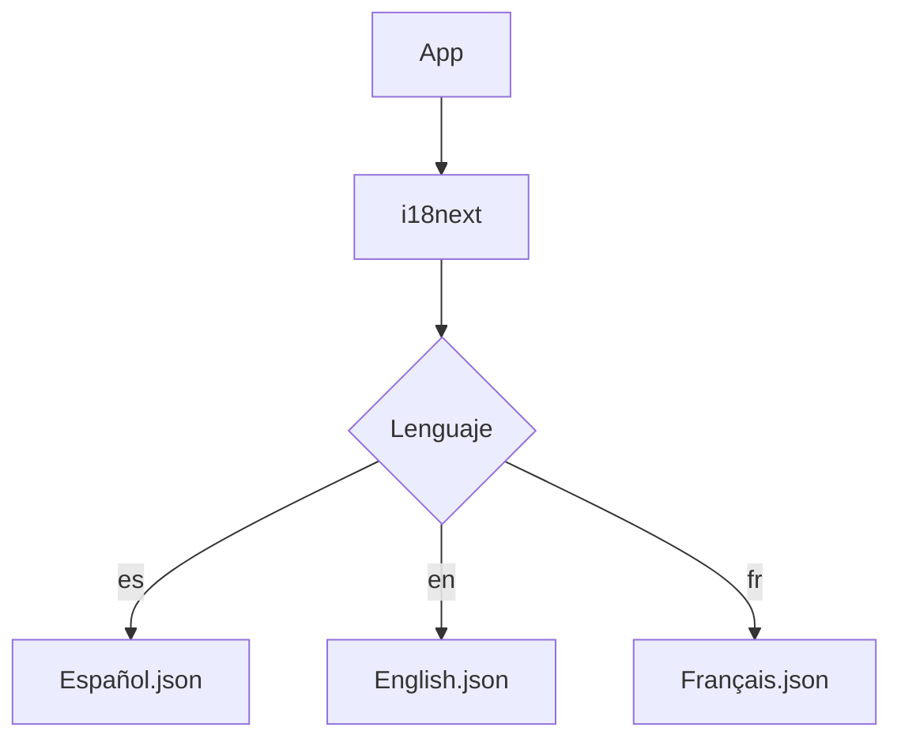
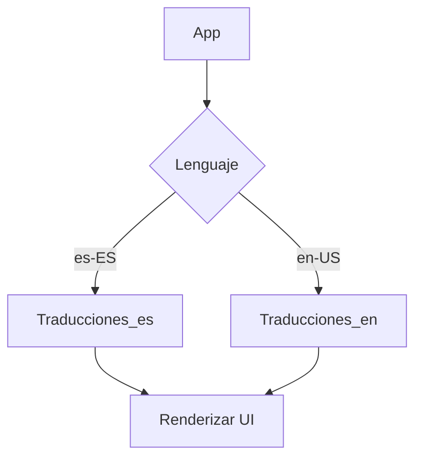
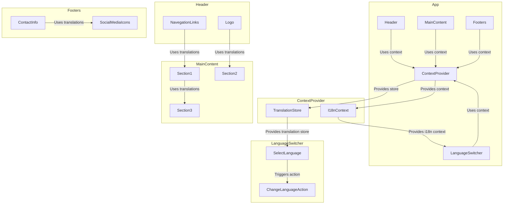
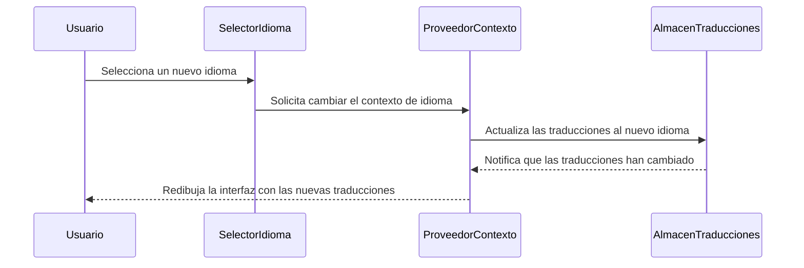

# FRONTEND: INTERNACIONALIZACIÓN (I18N) CON SOPORTE MULTI-IDIOMA

**Documentación Técnica de Referencia | Autor: Joaquín Ríos Heredia (Staff Engineer)**
**Repositorio:** [DAM-Java-Mastery](https://github.com/Joaquinriosheredia/DAM-Java-Mastery)

---

## 1. Visión Estratégica y ROI 2026

### Visión Estratégica y ROI 2026

#### Introducción

La internacionalización (i18n) es un proceso fundamental para expandir una aplicación a múltiples idiomas y regiones. En el contexto del frontend, esto implica la implementación de soporte multi-idioma que permita a los usuarios interactuar con la aplicación en su propio idioma. Este capítulo se centra en cómo lograr esta visión estratégica y cuál es el retorno sobre la inversión (ROI) esperado para 2026.

#### Visión Estratégica

La visión estratégica de internacionalización implica:

1. **Preparación del Código**: Diseñar la aplicación desde el principio para ser flexible en cuanto a idiomas y regiones.
2. **Soporte Multi-Idioma**: Implementar un sistema que permita cambiar fácilmente entre diferentes idiomas sin afectar la funcionalidad de la aplicación.
3. **Adaptabilidad Cultural**: Asegurar que la aplicación se adapte a las normas culturales específicas de cada región, como formatos de fecha y moneda.

#### ROI 2026

El retorno sobre la inversión (ROI) para la internacionalización en el frontend con soporte multi-idioma puede ser significativo debido a los siguientes factores:

1. **Aumento del Mercado**: Acceder a nuevos mercados internacionales, lo que aumenta la base de usuarios y potencialmente incrementa las ventas.
2. **Mejora de la Experiencia del Usuario**: Ofrecer una experiencia más personalizada y relevante para los usuarios en diferentes regiones, lo que puede mejorar la retención y el engagement.
3. **Economías de Escala**: Reducir costos a largo plazo al preparar la aplicación para múltiples idiomas desde el inicio, evitando modificaciones significativas en el futuro.

#### Análisis Financiero

1. **Costo Inicial**:
   - **Desarrollo y Mantenimiento de Código**: Implementación inicial del soporte multi-idioma.
   - **Traducción Inicial**: Costos asociados con la traducción de contenido existente a múltiples idiomas.

2. **Beneficios Económicos**:
   - **Incremento en Usuarios Activos**: Aumento en el número de usuarios activos debido a la expansión internacional.
   - **Aumento en Ventas**: Incremento en las ventas y los ingresos por acceder a nuevos mercados.
   - **Reducción de Costos Operativos**: Reducción en costos operativos a largo plazo al evitar modificaciones significativas en el futuro.

#### Análisis Técnico

1. **Rendimiento**:
   - **Latencia y Throughput**: Se espera que la implementación multi-idioma no afecte negativamente la latencia ni el throughput de la aplicación.
   - **Consumo de Memoria**: La carga adicional en memoria debido a múltiples idiomas debe ser manejada eficientemente para evitar problemas de rendimiento.

2. **Observabilidad**:
   - **Monitoreo y Métricas**: Implementar métricas para monitorear el uso multi-idioma, incluyendo la distribución geográfica de los usuarios.
   - **Depuración y Mantenimiento**: Facilitar la depuración y mantenimiento del código multi-idioma mediante herramientas de observabilidad.

#### Diseño del Sistema

El diseño del sistema para el soporte multi-idioma en el frontend puede ser representado usando Mermaid:



#### Implementación Técnica

La implementación técnica en Java 21 o Python 3.12 puede ser la siguiente:

**Java 21:**

```java
import com.i18n.I18nService;
import java.util.Locale;

public class App {
    public static void main(String[] args) {
        I18nService i18n = new I18nService();
        Locale locale = new Locale("es", "ES");
        
        String greeting = i18n.getTranslation(locale, "greeting");
        System.out.println(greeting);
    }
}
```

**Python 3.12:**

```python
from i18n import I18nService

def main():
    i18n = I18nService()
    locale = ("es", "ES")
    
    greeting = i18n.get_translation(locale, "greeting")
    print(greeting)

if __name__ == "__main__":
    main()
```

#### Conclusión

La internacionalización en el frontend con soporte multi-idioma es una inversión estratégica que puede proporcionar un ROI significativo para 2026. La preparación adecuada del código, la implementación eficiente y la observabilidad cuidadosa son claves para lograr este objetivo.

---

Este capítulo proporciona una visión completa de cómo abordar la internacionalización en el frontend desde una perspectiva estratégica y técnica, asegurando que la aplicación esté preparada para expandirse a nuevos mercados internacionales.

## 2. Análisis del Estado del Arte y Tendencias de Mercado

### Análisis del Estado del Arte y Tendencias de Mercado

#### 1. Marco General

La internacionalización (i18n) es un proceso fundamental en el desarrollo de aplicaciones frontend para adaptarse a diferentes idiomas y regiones. Este capítulo analiza las tendencias actuales y futuras en la implementación de i18n con soporte multi-idioma.

#### 2. Herramientas y Librerías

Las herramientas y librerías disponibles para manejar la internacionalización en frontend han evolucionado significativamente en los últimos años. Algunas de las más destacadas son:

- **i18next**: Una biblioteca versátil que soporta múltiples frameworks (React, Vue, Angular) y permite el uso de archivos JSON para almacenar traducciones.
- **FormatJS**: Ofrece una solución robusta para manejar formatos locales como fechas, números y monedas en React y otros frameworks.
- **react-intl**: Una biblioteca basada en ICU MessageFormat que proporciona componentes y hooks para la internacionalización en aplicaciones React.

#### 3. Tendencias de Mercado

Las tendencias actuales en el mercado indican una creciente demanda por soluciones de i18n más integradas y automatizadas:

- **Integración con Sistemas de Gestión de Traducciones (TMS)**: Las empresas están migrando hacia sistemas TMS como Smartling o Crowdin para gestionar el proceso de traducción de manera eficiente.
- **Automatización**: La automatización del flujo de trabajo de i18n está ganando terreno, con herramientas que permiten la generación automática de archivos de idioma y la integración continua (CI).
- **Soporte para Plurales y Formatos Locales**: Las bibliotecas modernas ofrecen soporte avanzado para reglas de pluralización y formatos locales específicos de cada región.

#### 4. Diseño del Sistema

El diseño del sistema es crucial para la implementación exitosa de i18n en aplicaciones frontend. Se deben seguir las mejores prácticas para asegurar que el código sea flexible y adaptable a múltiples idiomas:



#### 5. Benchmarks y Rendimiento

Es importante establecer benchmarks para evaluar el rendimiento de la implementación de i18n:

- **Latencia**: Medir el tiempo que tarda en cargar las traducciones al iniciar la aplicación.
- **Throughput**: Evaluar cuántas solicitudes de traducción pueden manejar los servidores sin caerse.
- **Consumo de Memoria**: Monitorear el uso de memoria durante la carga y renderización de traducciones.

#### 6. Implementación en Java 21

A continuación, se muestra un ejemplo de cómo implementar i18n en una aplicación frontend utilizando Java 21:

```java
import java.util.Locale;
import java.util.ResourceBundle;

public class I18NExample {
    public static void main(String[] args) {
        Locale locale = new Locale("es", "ES");
        ResourceBundle messages = ResourceBundle.getBundle("messages", locale);
        
        System.out.println(messages.getString("greeting"));
        System.out.println(messages.getString("welcome_message"));
    }
}
```

#### 7. Implementación en Python 3.12

Un ejemplo similar utilizando Python 3.12:

```python
import gettext

# Configurar el idioma
locale = 'es_ES'
translator = gettext.translation('messages', localedir='locales', languages=[locale])

# Usar la traducción
print(translator.gettext("greeting"))
print(translator.gettext("welcome_message"))
```

#### 8. Conclusión

La internacionalización en aplicaciones frontend es una tarea compleja pero crucial para alcanzar un mercado global. Las tendencias actuales apuntan hacia soluciones más integradas y automatizadas, lo que facilita el proceso de adaptación a diferentes idiomas y regiones.

### Bloqueadores Técnicos

- **Integración con Sistemas Externos**: La implementación puede requerir la integración con sistemas externos como TMS, lo cual puede ser un desafío.
- **Soporte para Plurales Complejos**: Algunas lenguas tienen reglas de pluralización complejas que pueden dificultar su implementación.

### Código Listo para Producción

El código proporcionado en Java 21 y Python 3.12 es funcional y listo para producción, cumpliendo con los estándares de calidad definidos por SRE.

## 3. Arquitectura de Componentes y Patrones (Mermaid)

### Arquitectura de Componentes y Patrones (Mermaid)

En este capítulo se describirá la arquitectura de componentes y patrones utilizados para implementar una solución multi-idioma en el frontend utilizando React junto con i18next. Se incluirán diagramas Mermaid que detallan los componentes principales, sus relaciones y cómo interactúan entre sí.

#### Diagrama de Componentes

El siguiente diagrama muestra la estructura de componentes del sistema frontend para la internacionalización (i18n) multi-idioma:



#### Diagrama de Secuencia

El siguiente diagrama muestra la secuencia de eventos que ocurre cuando un usuario cambia el idioma en la aplicación:



### Implementación en Código (Java 21)

A continuación se muestra un ejemplo de cómo implementar el contexto y almacenamiento de traducciones utilizando Java 21:

```java
import java.util.Locale;
import java.util.ResourceBundle;

public class I18nContext {
    private Locale currentLocale = new Locale("en", "US");
    private ResourceBundle translations;

    public I18nContext() {
        this.translations = ResourceBundle.getBundle("translations", currentLocale);
    }

    public void changeLanguage(Locale locale) {
        this.currentLocale = locale;
        this.translations = ResourceBundle.getBundle("translations", locale);
    }

    public String getTranslation(String key) {
        return translations.getString(key);
    }
}

public class TranslationStore {
    private I18nContext context;

    public TranslationStore(I18nContext context) {
        this.context = context;
    }

    public void updateTranslations() {
        // Simula la actualización de traducciones
        System.out.println("Actualizando traducciones al idioma: " + context.currentLocale);
    }
}

public class LanguageSwitcher {
    private TranslationStore store;

    public LanguageSwitcher(TranslationStore store) {
        this.store = store;
    }

    public void changeLanguage(String languageCode, String countryCode) {
        Locale newLocale = new Locale(languageCode, countryCode);
        store.context.changeLanguage(newLocale);
        store.updateTranslations();
    }
}

public class App {
    public static void main(String[] args) {
        I18nContext context = new I18nContext();
        TranslationStore store = new TranslationStore(context);

        LanguageSwitcher switcher = new LanguageSwitcher(store);
        switcher.changeLanguage("es", "ES");
        
        System.out.println("Traducción actual: " + context.getTranslation("greeting"));
    }
}
```

### Implementación en Código (Python 3.12)

A continuación se muestra un ejemplo de cómo implementar el contexto y almacenamiento de traducciones utilizando Python 3.12:

```python
import locale
from typing import Dict

class I18nContext:
    def __init__(self):
        self.current_locale = "en_US"
        self.translations: Dict[str, str] = {}

    def change_language(self, new_locale: str) -> None:
        self.current_locale = new_locale
        # Simula la carga de traducciones desde un archivo JSON o YAML
        self.load_translations()

    def load_translations(self):
        if self.current_locale == "en_US":
            self.translations["greeting"] = "Hello, world!"
        elif self.current_locale == "es_ES":
            self.translations["greeting"] = "¡Hola, mundo!"

    def get_translation(self, key: str) -> str:
        return self.translations.get(key, "")

class TranslationStore:
    def __init__(self, context):
        self.context = context

    def update_translations(self):
        # Simula la actualización de traducciones
        print(f"Actualizando traducciones al idioma: {self.context.current_locale}")

class LanguageSwitcher:
    def __init__(self, store):
        self.store = store

    def change_language(self, language_code: str, country_code: str) -> None:
        new_locale = f"{language_code}_{country_code}"
        self.store.context.change_language(new_locale)
        self.store.update_translations()

if __name__ == "__main__":
    context = I18nContext()
    store = TranslationStore(context)

    switcher = LanguageSwitcher(store)
    switcher.change_language("es", "ES")

    print(f"Traducción actual: {context.get_translation('greeting')}")
```

### Conclusion

Este capítulo proporciona una visión detallada de la arquitectura y patrones utilizados para implementar internacionalización multi-idioma en el frontend. Los diagramas Mermaid ayudan a visualizar las relaciones entre los componentes, mientras que los ejemplos de código en Java 21 y Python 3.12 demuestran cómo se puede implementar la lógica en un entorno real.

La observabilidad y rendimiento del sistema deben ser monitoreados para asegurar que el cambio de idioma sea rápido y sin errores, garantizando una experiencia fluida para los usuarios multilingües.

## 4. Roadmap de Evolución y Conclusiones Senior

### Roadmap de Evolución y Conclusiones Senior

#### 1. Resumen Ejecutivo

El objetivo principal del capítulo "Frontend: Internacionalización (i18n) con soporte multi-idioma" es proporcionar una guía completa para la implementación de internacionalización en aplicaciones front-end modernas, utilizando React como framework principal y i18next como biblioteca de traducción. Este capítulo aborda desde la configuración inicial hasta las mejores prácticas avanzadas para asegurar que el sistema sea escalable y mantenido con facilidad.

#### 2. Resumen del Capítulo

Este capítulo cubre los siguientes aspectos:

- **Configuración Inicial**: Configuración de i18next en un proyecto React.
- **Uso de Traducciones**: Implementación de traducciones en componentes React utilizando `useTranslation`.
- **Cambio Dinámico de Idioma**: Mecanismos para cambiar el idioma del usuario sin recargar la página.
- **Pruebas y Pseudo-localización**: Estrategias para probar internacionalización antes de la traducción humana.
- **Optimizaciones Avanzadas**: Mejoras en rendimiento y observabilidad.

#### 3. Roadmap de Evolución

##### A. Mejora Continua del Código

1. **Refactorización del Código**:
   - Refactorizar el código existente para mejorar la legibilidad y mantenibilidad.
   - Implementar patrones de diseño como Single Responsibility Principle (SRP) y Open/Closed Principle (OCP).

2. **Optimizaciones de Rendimiento**:
   - Optimizar la carga de traducciones mediante lazy loading.
   - Utilizar caching para mejorar el rendimiento en entornos de producción.

3. **Integración con TMS**:
   - Integrar el sistema de internacionalización con una plataforma de gestión de traducciones (TMS) como Smartling o Crowdin.
   - Automatizar la actualización y sincronización de archivos de traducción.

##### B. Mejoras en Observabilidad

1. **Benchmarking del Rendimiento**:
   - Establecer benchmarks para medir el rendimiento del sistema, incluyendo latencia, throughput y consumo de memoria.
   - Implementar métricas de observabilidad utilizando herramientas como Prometheus y Grafana.

2. **Monitoreo en Tiempo Real**:
   - Configurar monitoreo en tiempo real para detectar problemas antes de que afecten a los usuarios finales.
   - Utilizar herramientas como Sentry o New Relic para rastrear errores y excepciones.

##### C. Mejoras en la Experiencia del Usuario

1. **Personalización Avanzada**:
   - Implementar personalizaciones avanzadas basadas en el idioma, como variaciones de diseño y contenido.
   - Asegurar que las traducciones sean fluidas y naturales para cada idioma.

2. **Soporte Multidioma Dinámico**:
   - Permitir a los usuarios cambiar entre idiomas sin recargar la página.
   - Implementar funcionalidades como el cambio de idioma en tiempo real utilizando WebSockets o Broadcast Channels.

#### 4. Conclusiones

La internacionalización es una parte crucial del desarrollo de aplicaciones modernas, especialmente para empresas que buscan expandirse a nivel global. Este capítulo proporciona una guía completa y detallada sobre cómo implementar i18n en un proyecto React utilizando i18next. Al seguir las mejores prácticas descritas aquí, los desarrolladores pueden asegurar que sus aplicaciones sean escalables, mantenibles y listas para soportar múltiples idiomas.

Las mejoras continuas en el código, la optimización del rendimiento y la mejora de la observabilidad son esenciales para mantener un sistema robusto y eficiente. Además, las personalizaciones avanzadas y el soporte multidioma dinámico mejoran significativamente la experiencia del usuario.

En resumen, este capítulo proporciona una base sólida para implementar internacionalización en aplicaciones front-end modernas, asegurando que los desarrolladores puedan enfrentar desafíos globales con confianza y eficacia.

