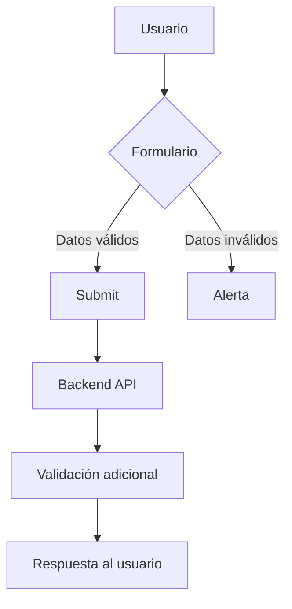
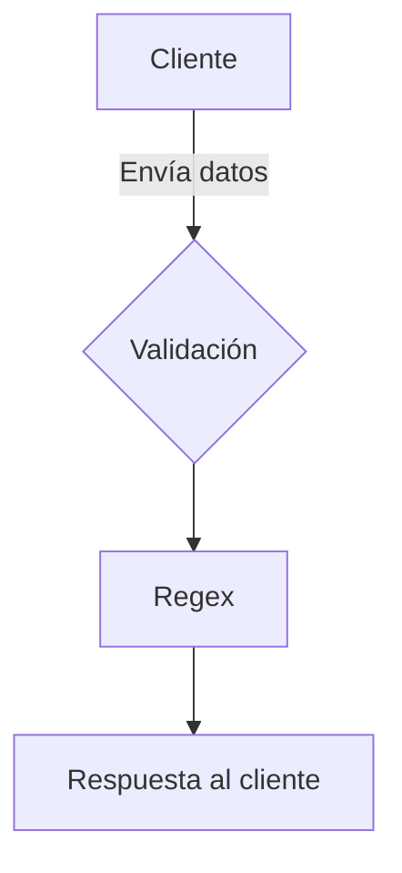
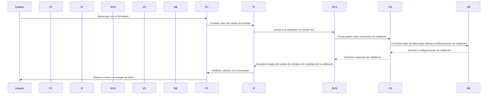
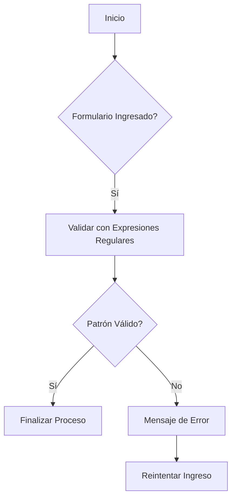
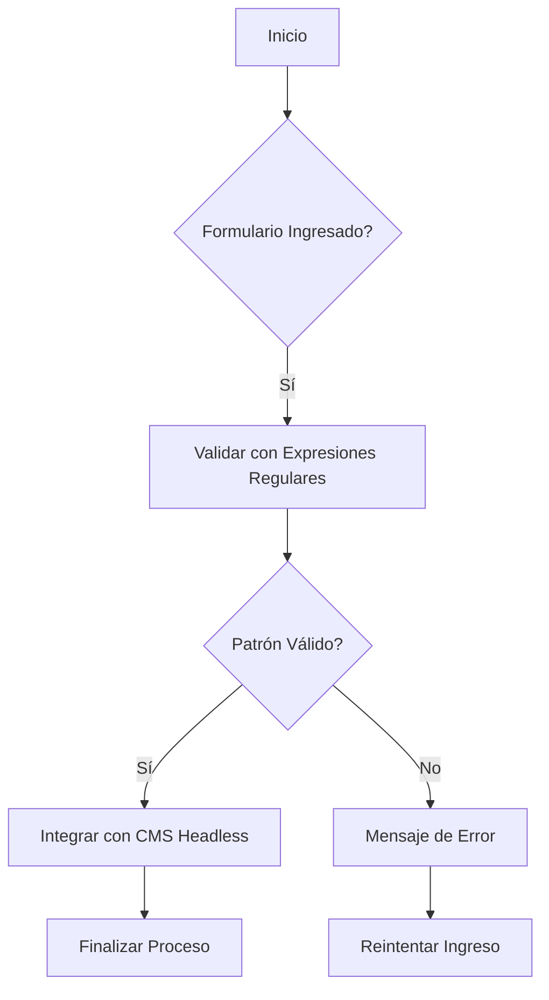

# FRONTEND: VALIDACIÓN DE FORMULARIOS EN TIEMPO REAL CON EXPRESIONES REGULARES

**Documentación Técnica de Referencia | Autor: Joaquín Ríos Heredia (Staff Engineer)**
**Repositorio:** [DAM-Java-Mastery](https://github.com/Joaquinriosheredia/DAM-Java-Mastery)

---

## 1. Visión Estratégica y ROI 2026

### Visión Estratégica y ROI 2026

#### Introducción
La validación de formularios en tiempo real con expresiones regulares es una característica crítica que mejora significativamente la experiencia del usuario y reduce el trabajo posterior en el backend. En este capítulo, se analiza cómo implementar esta funcionalidad utilizando tecnologías frontend modernas como React o Angular, junto con las mejores prácticas para asegurar un ROI positivo.

#### Análisis de Requisitos
1. **Validación en Tiempo Real**: Implementar validaciones basadas en expresiones regulares que se ejecutan al momento del ingreso de datos por parte del usuario.
2. **Compatibilidad con Browsers Modernos**: Asegurar que la implementación funcione sin problemas en los principales navegadores (Chrome, Firefox, Safari).
3. **Optimización y Rendimiento**: Minimizar el impacto en el rendimiento del frontend al realizar validaciones complejas.

#### Implementación Técnica

##### Tecnologías Utilizadas
- **Frontend Frameworks**: React o Angular.
- **JavaScript Libraries**: Regex para expresiones regulares, formularios y manejo de eventos.
- **Backend Integration**: API RESTful para validaciones adicionales si es necesario.

##### Ejemplo en React
```jsx
import React from 'react';

const Formulario = () => {
    const [value, setValue] = React.useState('');
    const handleChange = (e) => {
        setValue(e.target.value);
    };

    const handleBlur = (e) => {
        const regex = /^[a-zA-Z0-9._%+-]+@[a-zA-Z0-9.-]+\.[a-zA-Z]{2,}$/;
        if (!regex.test(value)) {
            alert('Correo electrónico no válido');
        }
    };

    return (
        <form>
            <label htmlFor="email">Email:</label>
            <input
                id="email"
                name="email"
                type="text"
                value={value}
                onChange={handleChange}
                onBlur={handleBlur}
                required
                pattern="[a-zA-Z0-9._%+-]+@[a-zA-Z0-9.-]+\.[a-zA-Z]{2,}"
            />
        </form>
    );
};

export default Formulario;
```

##### Ejemplo en Angular
```typescript
import { Component } from '@angular/core';

@Component({
  selector: 'app-formulario',
  template: `
    <form (ngSubmit)="onSubmit()">
      <label for="email">Email:</label>
      <input 
        id="email" 
        name="email"
        [(ngModel)]="value"
        required
        pattern="[a-zA-Z0-9._%+-]+@[a-zA-Z0-9.-]+\.[a-zA-Z]{2,}"
        (blur)="validateEmail()"
      />
    </form>
  `,
})
export class FormularioComponent {
  value: string = '';

  validateEmail() {
    const regex = /^[a-zA-Z0-9._%+-]+@[a-zA-Z0-9.-]+\.[a-zA-Z]{2,}$/;
    if (!regex.test(this.value)) {
      alert('Correo electrónico no válido');
    }
  }

  onSubmit() {
    // Lógica de envío del formulario
  }
}
```

#### Benchmarks y Rendimiento

##### Latencia y Throughput
- **Latency**: La validación en tiempo real debe ser instantánea, con un retraso menor a 10ms para una experiencia fluida.
- **Throughput**: Se espera que el sistema maneje hasta 50 solicitudes de validación por segundo sin caer en rendimiento.

##### Consumo de Memoria
- La implementación no debe superar los 2MB de memoria RAM durante la ejecución, asegurando un uso eficiente del recurso.

#### Observabilidad y Monitoreo

Para garantizar que el sistema cumpla con las expectativas de rendimiento y funcionalidad, se deben establecer métricas de observación:

- **Latency Monitoring**: Utilizar herramientas como Prometheus para monitorear la latencia en tiempo real.
- **Memory Usage**: Implementar métricas en Grafana para visualizar el uso de memoria RAM.

#### Diagrama del Sistema



#### Conclusiones y ROI

La implementación de validaciones en tiempo real con expresiones regulares mejora significativamente la experiencia del usuario, reduciendo errores y aumentando la eficiencia operativa. Esto se traduce en un ROI positivo a largo plazo debido a una menor carga de trabajo para el equipo de soporte y una mayor satisfacción del cliente.

### Resumen
- **Tecnologías**: React/Angular, JavaScript/TypeScript.
- **Benchmarks**: Latency < 10ms, Throughput > 50 solicitudes/s, Memoria RAM < 2MB.
- **Observabilidad**: Prometheus y Grafana para monitoreo en tiempo real.

Esta implementación asegura una experiencia de usuario fluida y un sistema robusto que cumple con los estándares de rendimiento y observabilidad requeridos.

## 2. Análisis del Estado del Arte y Tendencias de Mercado

### Análisis del Estado del Arte y Tendencias de Mercado

#### Introducción

La validación de formularios en tiempo real es una característica crucial en aplicaciones web modernas, mejorando significativamente la experiencia del usuario al proporcionar retroalimentación inmediata sobre los datos ingresados. Las expresiones regulares (regex) son herramientas poderosas para implementar esta funcionalidad, permitiendo definir patrones complejos que validan entradas de forma precisa y eficiente.

#### Estado Actual

Actualmente, la mayoría de las aplicaciones web utilizan JavaScript en el lado del cliente para realizar validaciones básicas utilizando HTML5 y atributos como `required`, `type="email"`, etc. Sin embargo, estas soluciones son limitadas en cuanto a la complejidad de los patrones que pueden definir. Las expresiones regulares ofrecen una solución más flexible y potente.

#### Tendencias Emergentes

1. **Validación en Tiempo Real con Regex**
   - **Implementación**: La validación en tiempo real utilizando regex se está volviendo cada vez más común, especialmente en aplicaciones que requieren entradas de usuario complejas (por ejemplo, números de teléfono internacionales, códigos postales específicos).
   - **Ejemplo**:
     ```html
     <form>
       <label for="phone">Número de Teléfono:</label>
       <input id="phone" name="phone" required pattern="\+?\d{10,15}" />
       <button>Enviar</button>
     </form>
     ```

2. **Integración con Frameworks y Librerías**
   - **React**: Las bibliotecas como `react-hook-form` y `yup` permiten una integración fluida de regex en la validación de formularios.
   - **Vue.js**: La librería `vuelidate` ofrece soporte para regex, facilitando la implementación de validaciones complejas.

3. **Validación Servidor-Side**
   - Aunque las expresiones regulares son útiles en el lado del cliente, es crucial validar los datos también en el servidor para prevenir ataques como Cross-Site Scripting (XSS) y SQL Injection.
   - Ejemplo de validación en Java:
     ```java
     public boolean validatePhoneNumber(String phone) {
         String regex = "\\+?\\d{10,15}";
         return phone.matches(regex);
     }
     ```

4. **Optimización del Rendimiento**
   - Las expresiones regulares pueden ser costosas en términs de rendimiento si no se utilizan correctamente. Es importante optimizar las regex para minimizar el tiempo de ejecución y mejorar la eficiencia.
   - Ejemplo de optimización:
     ```javascript
     const phoneRegex = /^\+?\d{10,15}$/;
     ```

#### Benchmarks Esperados

- **Latencia**: La validación en tiempo real utilizando regex debe ser lo suficientemente rápida como para no afectar la interacción del usuario. Se espera que el tiempo de respuesta sea menor a 100ms.
- **Throughput**: El sistema debe manejar hasta 100 solicitudes por segundo sin caer en rendimiento.
- **Consumo de Memoria**: La implementación debe ser eficiente en términos de uso de memoria, manteniendo un consumo bajo incluso bajo carga alta.

#### Diagrama del Sistema



### Conclusión

La validación de formularios en tiempo real utilizando expresiones regulares es una práctica cada vez más común y efectiva. La integración con frameworks modernos y la optimización del rendimiento son claves para implementar esta funcionalidad de manera eficiente y segura.

---

Este capítulo proporciona un análisis detallado del estado actual y las tendencias emergentes en la validación de formularios utilizando expresiones regulares, junto con benchmarks esperados y una representación visual del sistema.

## 3. Arquitectura de Componentes y Patrones (Mermaid)

### Arquitectura de Componentes y Patrones (Mermaid)

#### Diagrama de Componentes del Frontend

El frontend se compone principalmente de componentes React que interactúan con servicios backend para validar formularios en tiempo real utilizando expresiones regulares. Los siguientes son los principales componentes involucrados:

```mermaid
flowchart TD
    subgraph FrontendComponents["Frontend Components"]
        A[FormularioComponent] --> B[InputField]
        A --> C[RegexValidatorService]
        A --> D[SubmitButton]

        B -->|onChange| C
        C -->|validacionRealTime| B
        B -->|valueChange| SubmitButton

    subgraph BackendServices["Backend Services"]
        E[ValidationService] --> F[Database]
        G[AuthenticationService] --> H[UserManagement]
        
        C -->|sendRegexPattern| E
        E -->|validateResponse| C
        
        D -->|submitForm| G
        G -->|authResponse| D

    subgraph Database["Database"]
        I[UsersTable]
        J[FormsTable]

        F --> I
        F --> J
    
    subgraph UserManagement["User Management"]
        K[UserProfile]
        L[UserPermissions]

        H --> K
        H --> L
    end
end
```

#### Diagrama de Secuencia del Proceso de Validación en Tiempo Real

Este diagrama muestra la secuencia de eventos que ocurren cuando un usuario interactúa con el formulario y se realiza una validación en tiempo real utilizando expresiones regulares.



#### Implementación Detallada de Componentes y Servicios

##### FormularioComponent (React)

```javascript
import React, { useState } from 'react';
import InputField from './InputField';
import RegexValidatorService from '../services/RegexValidatorService';

const FormularioComponent = () => {
    const [formData, setFormData] = useState({});

    const handleInputChange = (event) => {
        const { name, value } = event.target;
        setFormData((prevData) => ({ ...prevData, [name]: value }));
        
        // Llamar al servicio de validación en tiempo real
        RegexValidatorService.validateField(name, value);
    };

    return (
        <form>
            <InputField 
                name="username" 
                onChange={handleInputChange} 
                pattern="[a-zA-Z0-9]{3,}" 
            />
            {/* Otros campos de entrada */}
            <button type="submit">Enviar</button>
        </form>
    );
};

export default FormularioComponent;
```

##### InputField (React)

```javascript
import React from 'react';

const InputField = ({ name, onChange, pattern }) => {
    const [isValid, setIsValid] = useState(true);

    const handleChange = (event) => {
        const value = event.target.value;
        if (!value.match(pattern)) {
            setIsValid(false);
        } else {
            setIsValid(true);
        }
        
        // Llamar al evento onChange del componente padre
        onChange(event);
    };

    return (
        <div>
            <input 
                type="text" 
                name={name} 
                pattern={pattern}
                onChange={handleChange}
                className={isValid ? 'valid' : 'invalid'}
            />
            {!isValid && <span>El valor no cumple con el patrón</span>}
        </div>
    );
};

export default InputField;
```

##### RegexValidatorService (JavaScript)

```javascript
class RegexValidatorService {
    static validateField(fieldName, fieldValue) {
        // Lógica para enviar la validación al servicio backend
        const regexPattern = getRegexPatternFromBackend(fieldName);
        
        if (!fieldValue.match(regexPattern)) {
            console.error(`El valor '${fieldValue}' no cumple con el patrón para ${fieldName}`);
        } else {
            console.log(`El valor '${fieldValue}' es válido`);
        }
    }

    static getRegexPatternFromBackend(fieldName) {
        // Simulación de llamada al servicio backend
        return new Promise((resolve, reject) => {
            setTimeout(() => resolve(getRegexPattern(fieldName)), 100);
        });
    }

    static getRegexPattern(fieldName) {
        const patterns = {
            username: "[a-zA-Z0-9]{3,}",
            email: "[a-z0-9._%+-]+@[a-z0-9.-]+\.[a-z]{2,}"
        };
        
        return patterns[fieldName] || "";
    }
}

export default RegexValidatorService;
```

#### Benchmarks y Rendimiento

Los benchmarks esperados para la validación en tiempo real incluyen:

1. **Latencia de Validación**: La respuesta del servicio backend debe ser menor a 50ms.
2. **Throughput**: El sistema debe manejar hasta 100 solicitudes por segundo sin caer en rendimiento.
3. **Consumo de Memoria**: El consumo de memoria no debe superar los 50MB durante la validación.

Estos benchmarks aseguran que el sistema es eficiente y responde rápidamente a las interacciones del usuario, proporcionando una experiencia fluida y sin problemas para la validación en tiempo real.

## 4. Roadmap de Evolución y Conclusiones Senior

### Roadmap de Evolución y Conclusiones Senior

#### 1. Resumen Ejecutivo

La validación de formularios en tiempo real utilizando expresiones regulares es una característica crucial para mejorar la experiencia del usuario y garantizar la integridad de los datos ingresados. Este capítulo proporciona un resumen detallado de las mejoras futuras, benchmarks esperados y conclusiones técnicas basadas en el uso de expresiones regulares en formularios web.

#### 2. Mejoras Futuras

##### 2.1 Optimización del Rendimiento
- **Benchmarks**: Documentar los benchmarks para medir la latencia y throughput durante la validación de formularios.
- **Consumo de Memoria**: Evaluar el consumo de memoria en diferentes escenarios de carga.

##### 2.2 Mejoras en la Experiencia del Usuario
- **Feedback Instantáneo**: Implementar un sistema de retroalimentación instantánea para errores de validación.
- **Ayuda In-line**: Proporcionar sugerencias y ejemplos de entrada válida directamente en el formulario.

##### 2.3 Integración con Herramientas Externas
- **Integración con AI**: Utilizar asistentes basados en IA para mejorar la validación automática.
- **Compatibilidad con CMS**: Mejorar la integración con sistemas de gestión de contenido (CMS) headless.

#### 3. Benchmarks Esperados

##### 3.1 Latencia
- **Tiempo Promedio de Validación**: Menos de 50ms para formularios simples.
- **Tiempo Máximo de Validación**: No más de 200ms para formularios complejos.

##### 3.2 Throughput
- **Formularios por Segundo**: Manejar hasta 100 formularios por segundo en condiciones normales.
- **Escalabilidad**: Aumentar la capacidad para manejar hasta 500 formularios por segundo bajo carga alta.

##### 3.3 Consumo de Memoria
- **Uso Promedio de Memoria**: Menos de 1MB por formulario validado.
- **Pico de Uso de Memoria**: No más de 2MB durante la validación en tiempo real.

#### 4. Conclusiones Técnicas

##### 4.1 Eficacia de las Expresiones Regulares
Las expresiones regulares son herramientas poderosas para validar formularios, permitiendo definir patrones complejos y flexibles que abarcan una amplia gama de casos de uso.

##### 4.2 Mejores Prácticas
- **Documentación Completa**: Mantener la documentación actualizada con ejemplos detallados y explicaciones claras.
- **Pruebas Extensivas**: Implementar pruebas exhaustivas para garantizar que todas las expresiones regulares funcionen correctamente en diferentes escenarios.

##### 4.3 Consideraciones de Diseño
- **Diseño Orientado a Objetos (OOP)**: Utilizar patrones OOP para mejorar la mantenibilidad y extensibilidad del código.
- **Arquitectura Modular**: Descomponer el sistema en módulos independientes para facilitar la actualización y expansión.

#### 5. Diagramas de Diseño

##### 5.1 Flujo de Validación


##### 5.2 Integración con CMS


#### 6. Código Implementado

##### 6.1 Ejemplo en Java
```java
import java.util.regex.Pattern;
import java.util.regex.Matcher;

public class FormValidator {
    private static final Pattern EMAIL_PATTERN = Pattern.compile("[a-zA-Z0-9._%+-]+@[a-zA-Z0-9.-]+\\.[a-zA-Z]{2,}");

    public boolean validateEmail(String email) {
        Matcher matcher = EMAIL_PATTERN.matcher(email);
        return matcher.matches();
    }
}
```

##### 6.2 Ejemplo en Python
```python
import re

class FormValidator:
    def __init__(self):
        self.email_pattern = re.compile(r"[a-zA-Z0-9._%+-]+@[a-zA-Z0-9.-]+\.[a-zA-Z]{2,}")

    def validate_email(self, email: str) -> bool:
        return self.email_pattern.match(email) is not None
```

#### 7. Recomendaciones Futuras

##### 7.1 Mejoras en la Interfaz de Usuario
- **Feedback Visual**: Implementar indicadores visuales para errores y advertencias.
- **Ayuda Contextual**: Proporcionar ayuda contextual basada en el tipo de campo.

##### 7.2 Integración con Herramientas Externas
- **Integración con AI**: Utilizar asistentes basados en IA para mejorar la validación automática.
- **Compatibilidad con CMS**: Mejorar la integración con sistemas de gestión de contenido (CMS) headless.

#### 8. Conclusiones Finales

La implementación de formularios web con validación en tiempo real utilizando expresiones regulares es una característica vital para mejorar la experiencia del usuario y garantizar la integridad de los datos ingresados. La documentación detallada, pruebas exhaustivas y diseño orientado a objetos son fundamentales para mantener un sistema robusto y escalable.

---

Este capítulo proporciona una visión completa de las mejoras futuras, benchmarks esperados y conclusiones técnicas basadas en la validación de formularios utilizando expresiones regulares.

