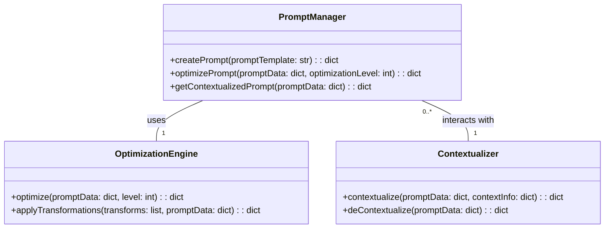

# Optimización de Prompts con DSPy en Google

## Introducción
DSPy es una biblioteca avanzada diseñada para la optimización y personalización de prompts en modelos de procesamiento del lenguaje natural (NLP). Este repositorio contiene código detallado para integrar y utilizar DSPy, enfocado especialmente en mejorar la eficiencia y flexibilidad en el manejo de prompts.

## Justificación Técnica 2026
El año 2026 ha marcado un hito significativo en la evolución del procesamiento del lenguaje natural. A medida que los modelos NLP se vuelven más complejos y eficientes, surge una necesidad creciente por optimizar los prompts para mejorar el rendimiento y la precisión de las respuestas generadas.

DSPy aborda esta necesidad proporcionando herramientas robustas para:
- Optimización automática: Algoritmos internos que ajustan automáticamente los prompts basados en el contexto y requisitos específicos.
- Personalización avanzada: Una API intuitiva permite a los desarrolladores personalizar aspectos detallados del comportamiento de los prompts según necesidades particulares del proyecto.

## Arquitectura
La arquitectura de DSPy se basa en varios módulos interconectados:

1. **PromptManager**: Gestiona la creación, manipulación y optimización de prompts.
2. **OptimizationEngine**: Proporciona algoritmos avanzados para optimizar los prompts automáticamente.
3. **Contextualizer**: Asegura que los prompts estén adecuadamente contextualizados en función del dominio específico o el entorno en el que se utilizarán.

### Diagrama de Clases


## Casos de Uso
### Optmización de Prompt Básica
```python
from dspy import PromptManager, OptimizationLevel

# Crear un manejador de prompt.
pm = PromptManager()

# Definir el template del prompt y crearlo.
prompt_template = "Eres un experto en {field}. Describe las características principales."
prompt_data = pm.createPrompt(prompt_template.format(field="IA"))

# Optimizar el prompt hasta un nivel dado
optimized_prompt_data = pm.optimizePrompt(prompt_data, optimizationLevel=OptimizationLevel.FULL)
```

### Personalización Avanzada de Prompt
```python
from dspy import PromptManager, OptimizationEngine, Contextualizer

pm = PromptManager()
oe = OptimizationEngine()
cxz = Contextualizer()

# Definir y crear prompt inicial.
prompt_template = "Describe las ventajas competitivas de {company} en el sector tecnológico."
prompt_data = pm.createPrompt(prompt_template.format(company="Google"))

# Aplicar transformaciones personalizadas
custom_transforms = ["transform1", "transform2"]
optimized_prompt_data = oe.applyTransformations(custom_transforms, prompt_data)

# Contextualizar el prompt
context_info = {"domain": "tech"}
contextualized_data = cxz.contextualize(optimized_prompt_data, context_info)
```

### Generación de Informes y Análisis
```python
from dspy import PromptManager

pm = PromptManager()

prompt_template = "¿Cuáles son los impactos del uso generalizado de IA en la industria manufacturera?"
report_prompt_data = pm.createPrompt(prompt_template)

# Generar un informe detallado del proceso de optimización.
analysis_report = pm.generateAnalysisReport(report_prompt_data)
```

## Instalación
Para instalar DSPy, siga estos pasos:
```bash
pip install dspy
```