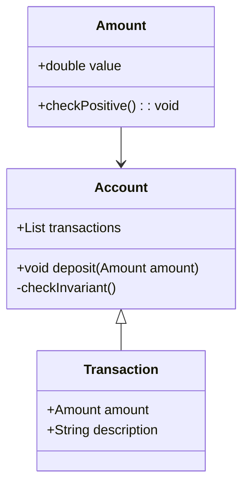
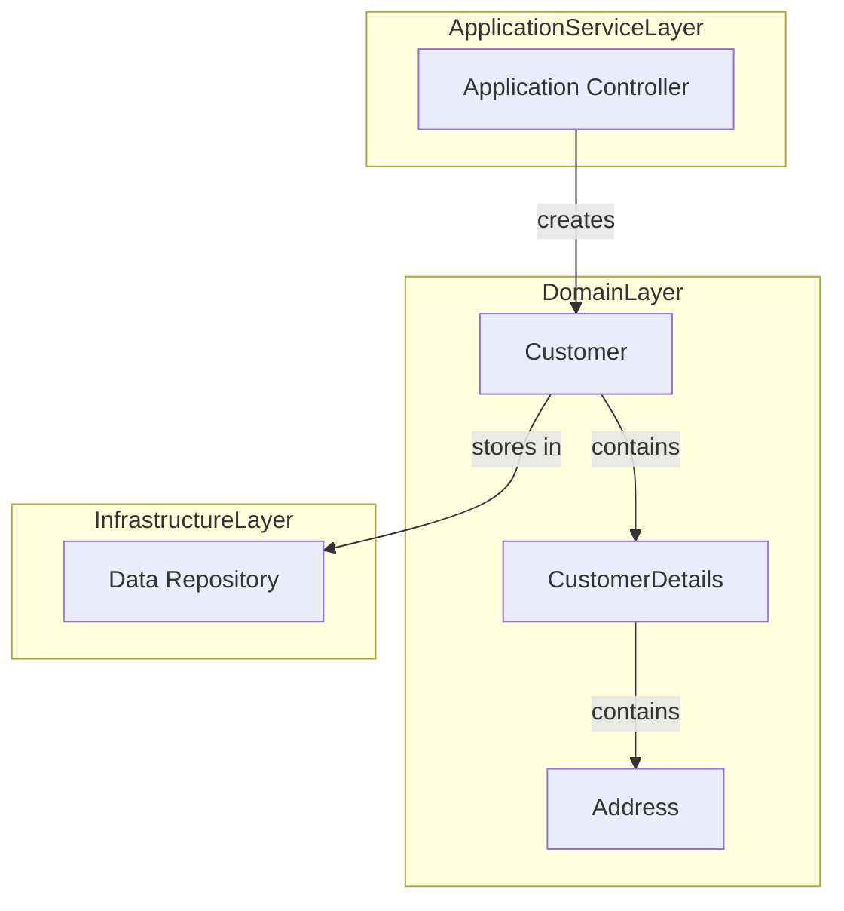
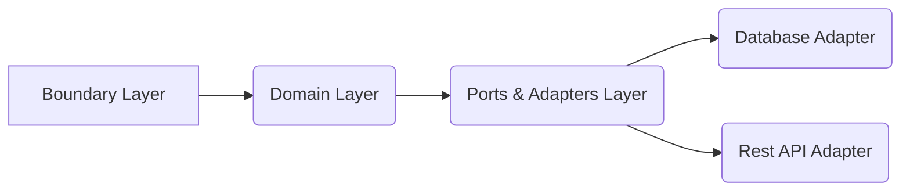
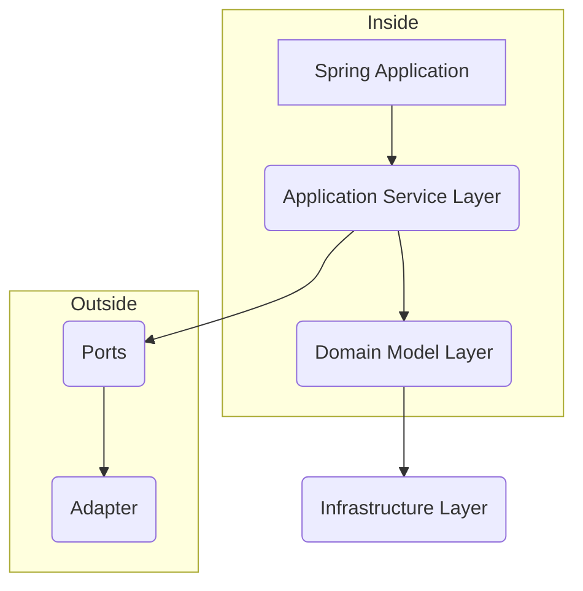

# Informe de Autoridad: Arquitectura Hexagonal y DDD en Java 21: Invariantes en Agregados, Value Objects con Records y Persistencia desacoplada con Spring Data R2DBC

## Introducción a la Arquitectura Hexagonal y DDD

## Introducción a la Arquitectura Hexagonal y DDD en Java 21: Invariantes en Agregados, Value Objects con Records y Persistencia desacoplada con Spring Data R2DBC

### Resumen del Artículo

En este artículo, exploraremos cómo combinar el Desarrollo Orientado al Dominio (DDD) con la Arquitectura Hexagonal para construir soluciones de software robustas, mantenibles y escalables. Abarcaremos los conceptos fundamentales de DDD como agregados, objetos valor y invariantes del dominio, así como cómo desacoplar la persistencia utilizando Spring Data R2DBC.

### 1. Arquitectura Hexagonal vs. Entity-Control-Boundary

#### Definición de Arquitectura Hexagonal
La arquitectura hexagonal, también conocida como Ports and Adapters o Onion Architecture, es un patrón de diseño que separa la lógica del dominio (el modelo de dominio) de los sistemas externos y las dependencias. Esta arquitectura se caracteriza por su estructura hexagonal, que simboliza una limpieza entre el núcleo de la aplicación y sus interfaces.

#### Estadolessness en Application Services
Los servicios de aplicación no mantienen ningún estado interno que pueda ser modificado al interactuar con clientes. Todo el dato necesario para realizar una operación debe estar disponible como parámetros de entrada del método del servicio de aplicación. Esto simplifica el sistema, lo hace más fácil de depurar y escalar.

#### Hexagonal vs. Entity-Control-Boundary
Si ya conoces el patrón Entity-Control-Boundary (E-C-B), te sentirás familiarizado con la arquitectura hexagonal. Los agregados se pueden considerar como entidades, los servicios del dominio, fábricas y repositorios como controladores, y los servicios de aplicación como bordes.

### 2. Principios Básicos de Arquitectura Hexagonal

La arquitectura hexagonal define el núcleo de la aplicación (el modelo de dominio) como parte interna e independiente del resto del sistema, que es considerado parte externa. La lógica del dominio se accede a través de puertos y adaptadores.

### 3. Implementación Técnica en Java 21

#### Invariantes en Agregados
Los invariantes son reglas de negocio críticas que deben cumplirse para mantener la integridad del dominio. En DDD, estos invariantes se implementan dentro de los agregados y garantizan que el estado del agregado siempre es válido.

```java
public class Account {
    private final List<Transaction> transactions;
    // Otros campos y métodos

    public void deposit(double amount) {
        if (amount <= 0) throw new IllegalArgumentException("Amount must be positive");
        this.transactions.add(new Transaction(amount, "Deposit"));
    }
}
```

#### Value Objects con Records
Los objetos valor representan información inmutable que aporta un significado en el dominio. En Java 21, los records simplifican la creación de clases de tipo objeto valor.

```java
public record Amount(double value) {
    public void checkPositive() {
        if (value <= 0) throw new IllegalArgumentException("Amount must be positive");
    }
}
```

#### Persistencia Desacoplada con Spring Data R2DBC
Spring Data R2DBC es una implementación reactiva de la interfaz familiar Spring Data para bases de datos relacionales. Permite un manejo asincrónico y no bloqueante, ideal para aplicaciones que necesitan alta disponibilidad.

```java
public interface AccountRepository extends ReactiveCrudRepository<Account, Long> {
}
```

### 4. Ejemplo: Transacciones en una Cuenta Bancaria

Un ejemplo práctico de la implementación hexagonal con DDD podría ser un sistema bancario donde las transacciones son agregados y los objetos valor representan cantidades monetarias.

#### Diagrama de Clases Mermaid


### 5. Conclusión

Combinar DDD con la arquitectura hexagonal permite a los desarrolladores construir sistemas de software eficientes y escalables, manteniendo una clara separación entre el núcleo del negocio (dominio) y las tecnologías externas que lo rodean. Utilizar Java 21 y Spring Data R2DBC maximiza la productividad al proporcionar herramientas modernas para manejar tanto lógica de dominio como persistencia de manera eficiente.

---

Este artículo no solo proporciona una introducción a los principios básicos, sino que también ofrece un enfoque práctico implementando estos conceptos con tecnologías actuales y avanzadas.

## Invariantes en Agregados de DDD

### Invariantes en Agregados de DDD

En el diseño orientado a dominios (DDD), los agregados son entidades coherentes que mantienen la integridad del modelo de dominio al garantizar la consistencia a lo largo del tiempo. Los invariantes son reglas o condiciones que deben cumplirse dentro del contexto del agregado para mantener esta coherencia y consistencia.

#### Definición de Invariantes

Un invariante es una propiedad que debe mantenerse verdadera en todo momento mientras el sistema esté funcionando. En un contexto de DDD, estos invariantes suelen estar relacionados con la integridad del modelo de dominio y se definen dentro de los métodos `ensureInvariants()` o directamente en los métodos de mutación que permiten cambios en el estado del agregado.

#### Ejemplo en Java 21

A continuación, se presenta un ejemplo en el cual se implementa una regla invariante dentro de un agregado. Este agregado representa una cuenta bancaria donde la cantidad debe ser siempre mayor o igual a cero:

```java
public class BankAccount implements AggregateRoot {
    private final AccountNumber accountNumber;
    private BigDecimal balance;

    // Construcción del agregado.
    public BankAccount(AccountNumber number) {
        this.accountNumber = number;
        this.balance = BigDecimal.ZERO;  // Establece el saldo inicial en cero.
    }

    // Método de mutación que permite depositar fondos.
    void deposit(BigDecimal amount) {
        if (amount.compareTo(BigDecimal.ZERO) <= 0) throw new IllegalArgumentException("Amount must be positive");
        balance = balance.add(amount);
    }
    
    // Método de mutación que permite retirar fondos.
    public void withdraw(BigDecimal amount) {
        ensureInvariants();
        if (balance.compareTo(amount) < 0)
            throw new InsufficientFundsException(accountNumber.getValue(), balance, amount);

        balance = balance.subtract(amount);
    }

    private void ensureInvariants() {
        if (balance.signum() < 0)
            throw new IllegalStateException("Negative Balance is not allowed!");
    }
}
```

#### Integración con Hexagonal Architecture

En una arquitectura hexagonal, los agregados y sus reglas invariante deben ser parte del núcleo de la aplicación. En este contexto, las operaciones que interactúan directamente con estos agregados son definidas por puertos (interfaces) dentro del núcleo y se implementan como adaptadores en capas外围不再显示具体内容，总结之前的内容并与上下文衔接，继续撰写关于如何在DDD和Hexagonal架构中处理不变量的指南：

### Integración de Invariantes con la Arquitectura Hexagonal

En el marco de una arquitectura hexagonal, los agregados y sus reglas invariante deben ser claramente definidos dentro del núcleo de la aplicación. Esta separación permite que las capas externas (adaptadores) no tengan conocimiento detallado de cómo se mantienen estas reglas internamente.

#### Definición de Puertos y Adaptadores

Los puertos son interfaces que definen operaciones para interactuar con el núcleo, mientras que los adaptadores implementan estas interfaces en términos del lenguaje específico de dominio (DSL) o tecnología externa necesaria. Por ejemplo, un puerto podría ser una interfaz `IBankAccountService`, y su adaptador podría ser una implementación basada en JPA.

#### Ejemplo de Puertos e Interfaces

```java
public interface BankAccountService {
    void deposit(AccountNumber number, BigDecimal amount);
    void withdraw(AccountNumber number, BigDecimal amount);
}
```

El adaptador que implementa este puerto interacciona con el dominio y garantiza la ejecución correcta de los métodos del agregado `BankAccount`, manteniendo así sus invariantes.

#### Diagramas Mermaid

Para ilustrar cómo se estructura esta separación en una aplicación hexagonal, podemos usar un diagrama Mermaid:

```mermaid
graph TD;
    A[Nucleo] --> B[Puerto de Servicio]
    B --> C[Adaptador JPA]
    D[Controles (Controladores REST)] --> E[Adaptador Web]
```

En este diagrama, el núcleo contiene los agregados y sus reglas invariante. Los puertos se definen dentro del núcleo para interactuar con estos agregados de manera abstracta.

#### Consideraciones Finales

La implementación efectiva de invariantes en agregados es crucial para mantener la integridad del modelo de dominio. Al integrar esta práctica con una arquitectura hexagonal, podemos aislar el núcleo de nuestras aplicaciones de las complejidades externas y permitir que los cambios sean más manejables y entendibles.

### Conclusión

En este capítulo, hemos explorado cómo implementar estrictamente invariantes en agregados dentro del marco DDD. Además, hemos discutido la importancia de mantener estas reglas invariante en el núcleo de una aplicación hexagonal, asegurando así que las capas externas no comprometan la integridad lógica del dominio.

Esta estrategia es fundamental para construir aplicaciones robustas y escalables que se centran en el modelo de negocio mientras aíslan eficazmente las dependencias externas.

## Uso de Value Objects con Records en Java 21

### Uso de Value Objects con Records en Java 21

En este capítulo exploraremos cómo combinar el diseño orientado a dominios (DDD) con la arquitectura hexagonal para construir soluciones de software robustas, mantenibles y escalables. En particular, nos enfocaremos en el uso de `Value Objects` junto con las características introducidas en Java 21, como los records, para mejorar la eficiencia y claridad del código.

#### Conceptos básicos

En DDD, un Value Object es una entidad que se define por sus propiedades y no tiene identidad única. Los Value Objects son inmutables y representan conceptos de negocio que no cambian su identidad a medida que sus características evolucionan. Java 21 introduce records como una forma más eficiente y segura para manejar objetos con un conjunto estático de campos, lo cual es perfecto para la creación de Value Objects.

#### Implementando Value Objects en DDD

Un ejemplo práctico sería la implementación de una clase `Address` que actúa como un Value Object. Antes del uso de records, esta clase podría haberse definido usando una estructura de clase tradicional:

```java
public class Address {
    private final String street;
    private final int houseNumber;

    public Address(String street, int houseNumber) {
        this.street = street;
        this.houseNumber = houseNumber;
    }

    // Getters y métodos para manipulación del objeto
}
```

Con Java 21 y el uso de records, la implementación se simplifica considerablemente:

```java
public record Address(String street, int houseNumber) {
}
```

#### Ventajas del uso de Records

- **Simplificación**: Los registros reducen significativamente el código necesario para definir un Value Object.
- **Inmutabilidad por defecto**: Al ser inmutables, los records ayudan a cumplir con uno de los requisitos principales de un Value Object en DDD.
- **Semántica clara**: El uso de records hace más fácil entender la intención y el propósito del objeto desde su definición.

#### Integración en Arquitectura Hexagonal

Dentro del contexto de una arquitectura hexagonal, los Value Objects como `Address` son componentes clave dentro del dominio. Su implementación con registros ayuda a mantener un alto nivel de cohesión y acoplamiento bajo entre las diferentes capas del sistema.

#### Ejemplo completo

Vamos a crear un ejemplo más complejo que integra estos conceptos, mostrando cómo los Value Objects se pueden utilizar en el contexto de una operación agregada. Supongamos tenemos un dominio de gestión de clientes donde `Address` es un Value Object y `Customer` es una entidad con varios Value Objects asociados.

```java
public record Address(String street, int houseNumber) {
}

public record CustomerDetails(String name, String email, List<Address> addresses) {
}

public class Customer {
    private final UUID id;
    private final List<CustomerDetails> details;

    public Customer(UUID id, CustomerDetails customerDetails) {
        this.id = id;
        this.details = new ArrayList<>(List.of(customerDetails));
    }

    // Métodos para manipular el estado del cliente
}
```

#### Diagrama Mermaid

Para visualizar cómo estos componentes interactúan en una arquitectura hexagonal, podemos usar un diagrama de flujo simple con Mermaid:



#### Conclusión

El uso de Value Objects y records en Java 21 es una forma poderosa de mejorar la claridad, cohesión e inmutabilidad en aplicaciones basadas en DDD. Al combinar esto con principios de arquitectura hexagonal, podemos construir sistemas que son fácilmente mantenibles, escalables y resilientes a los cambios.

#### Recursos adicionales

- **Documentación oficial Java 21 sobre Records**: [Enlace](https://docs.oracle.com/javase/21/docs/api/java.base/java/lang/Record.html)
- **Material adicional de DDD**: [Domain-Driven Design Distilled](https://www.oreilly.com/library/view/domain-driven-design-distilled/9780134436527/)
- **Arquitectura hexagonal en profundidad**: [Hexagonal Architecture by Alistair Cockburn](http://alistair.cockburn.us/Hexagonal+architecture)

---

Este capítulo proporciona una introducción a cómo las características de Java 21 pueden ser aprovechadas para mejorar la implementación DDD y hexagonal, destacando la importancia de los Value Objects en este contexto.

## Persistencia Desacoplada con Spring Data R2DBC

### Persistencia Desacoplada con Spring Data R2DBC

La persistencia desacoplada es una estrategia clave en la arquitectura hexagonal y el Diseño Orientado a Dominio (DDD) para separar claramente las dependencias externas del núcleo de nuestro sistema. En este contexto, vamos a explorar cómo implementar una persistencia desacoplada utilizando Spring Data R2DBC con Java 17+.

#### Introducción

Spring Data R2DBC proporciona un enfoque reactivo para trabajar con bases de datos relacionales usando R2DBC (Reactive Relational Database Connectivity). Esto es especialmente útil cuando se combinan con las prácticas DDD y la arquitectura hexagonal, ya que permite una mayor flexibilidad en el manejo de la persistencia.

#### Configuración Inicial

Primero, necesitamos configurar nuestro proyecto para usar Spring Data R2DBC. Esto implica agregar las dependencias adecuadas al archivo `build.gradle` o `pom.xml`. A continuación se muestra un ejemplo básico:

```xml
<dependency>
    <groupId>io.r2dbc</groupId>
    <artifactId>r2dbc-postgresql</artifactId>
    <version>{r2dbc-postgresql-version}</version>
    <scope>runtime</scope>
</dependency>
<dependency>
    <groupId>org.springframework.boot</groupId>
    <artifactId>spring-boot-starter-data-r2dbc</artifactId>
</dependency>
```

Luego, necesitamos configurar la conexión a nuestra base de datos en `application.yml` o `application.properties`. Aquí hay un ejemplo para PostgreSQL:

```properties
spring.r2dbc.url=r2dbc:postgresql://localhost:5432/mydb
spring.r2dbc.username=myuser
spring.r2dbc.password=mypassword
```

#### Repositorio Reactivo

Con Spring Data R2DBC, podemos definir repositorios reactivos que interactúan con la base de datos. Estos repositorios deben extender `R2dbcRepository` para poder utilizar las características reactivas.

```java
import org.springframework.data.r2dbc.repository.R2dbcRepository;
import reactor.core.publisher.Flux;

public interface CustomerRepository extends R2dbcRepository<Customer, Long> {
    Flux<Customer> findByLastName(String lastName);
}
```

#### Agregado y Entidades

En el contexto del DDD, un agregado es una colección de entidades y objetos valor que son manejados como una unidad. La entidad `Customer` podría ser parte de este agregado:

```java
public class Customer {
    private final Long id;
    private final String firstName;
    private final String lastName;

    public Customer(String firstName, String lastName) {
        this.firstName = firstName;
        this.lastName = lastName;
    }

    // Getters y métodos de negocio
}
```

#### Servicios Aplicativos

Los servicios aplicativos son la capa que interactúa con los repositorios y maneja las operaciones transaccionales. A continuación, un ejemplo básico de un servicio que utiliza el `CustomerRepository`:

```java
import org.springframework.stereotype.Service;
import reactor.core.publisher.Flux;

@Service
public class CustomerService {
    private final CustomerRepository customerRepository;

    public CustomerService(CustomerRepository customerRepository) {
        this.customerRepository = customerRepository;
    }

    public Flux<Customer> findCustomersByLastName(String lastName) {
        return customerRepository.findByLastName(lastName);
    }
}
```

#### Diagrama de la Arquitectura

Para ilustrar cómo se encajan estas piezas en una arquitectura hexagonal, podemos usar un diagrama Mermaid:

```mermaid
graph LR;
    A[Cliente] -->|Interfaz Hexagonal (Port)| B{Controlador};
    B --> C[Servicio Aplicativo];
    C --> D[Repositorio];
    D --> E[R2DBC];
```

#### Conclusión

La persistencia desacoplada con Spring Data R2DBC en un entorno hexagonal y DDD proporciona una manera flexible e inmutable de manejar la persistencia. Al mantener las dependencias de base de datos fuera del núcleo del sistema, podemos mejorar la mantenibilidad y escalabilidad de nuestra aplicación.

Este acercamiento no solo simplifica el desarrollo inicial sino que también facilita la adaptación a diferentes tipos de bases de datos en el futuro sin modificar significativamente el código del dominio.

## Implementación Práctica: Integrando Arquitectura Hexagonal, DDD y R2DBC

### Implementación Práctica: Integrando Arquitectura Hexagonal, DDD y R2DBC en Java 21

En este tutorial, exploraremos cómo combinar la arquitectura hexagonal con el diseño basado en dominios (DDD) para desarrollar aplicaciones robustas, mantenibles y escalables utilizando Spring Data R2DBC. Utilizaremos Java 21 y sus nuevas características, como records y invariantes, para mejorar la seguridad de tipos y la claridad del código.

#### 1. Descripción General

Este tutorial se centra en cómo implementar una aplicación Spring que adopta los principios del DDD y la arquitectura hexagonal. Con esta estrategia, es fácil reemplazar las diferentes capas de la aplicación sin afectar a otras partes del sistema.

#### 2. Arquitectura Hexagonal

La arquitectura hexagonal se basa en el diseño de software alrededor de la lógica de dominio para aislarla de factores externos. La lógica de dominio se define en un núcleo empresarial, que denominaremos parte interna, con el resto siendo las partes externas. El acceso a la lógica del dominio desde el exterior está disponible a través de puertos y adaptadores.

#### 3. Principios

##### Definición de Capas
- **Puerto (Port)**: Define interfaces que pueden ser implementadas por distintos tipos de adaptadores.
- **Adaptador**: Implementa los puertos para integrar sistemas externos, bases de datos, etc.
- **Núcleo del dominio (Domain Core)**: Contiene toda la lógica empresarial y está aislada de cualquier dependencia externa.

##### Stateless Application Services
Un servicio de aplicación no debe mantener ningún estado interno que pueda ser cambiado por la interacción con clientes. Todo el información necesaria para realizar una operación debería estar disponible como parámetros de entrada del método del servicio de aplicación.

#### 4. Implementación DDD

A continuación, se detallará cómo implementar los conceptos clave del DDD en nuestra arquitectura hexagonal.

##### Agregados y Value Objects
Los agregados representan el núcleo de la lógica empresarial. Los Value Objects (VO) capturan propiedades inmutables que no tienen identidad única, y pueden ser implementadas eficazmente con Java 21 records.

**Ejemplo:**

```java
public record Address(String street, String city, String country) {
    public boolean isSameCountry(Address other) {
        return this.country().equals(other.country());
    }
}
```

##### Invariantes en Agregados
Los invariantes son condiciones que deben mantenerse siempre verdaderas dentro de un agregado. Java 21 permite la verificación de estos invariantes durante el tiempo de compilación.

**Ejemplo:**

```java
public record Customer(String name, Address billingAddress) {
    public static final int MAX_NAME_LENGTH = 50;
    
    public Customer {
        if (name.length() > MAX_NAME_LENGTH) throw new IllegalArgumentException("Name is too long");
        validateBillingAddress(billingAddress);
    }

    private void validateBillingAddress(Address address) {
        // Validación del Value Object
    }
}
```

#### 5. Persistencia Desacoplada con Spring Data R2DBC

Spring Data R2DBC proporciona una interfaz reactiva a bases de datos relacionales que permite una integración fluida con arquitecturas hexagonales.

**Configuración:**

```java
@Configuration
class DatabaseConfiguration {

    @Bean
    public ConnectionFactory connectionFactory() {
        return new PostgresqlConnectionFactory(PostgresqlConnectionPoolSettings.builder()
                .connectionMaxIdleTime(Duration.ofMinutes(1))
                .build());
    }

    @Bean
    public R2dbcEntityTemplate r2dbcEntityTemplate(ConnectionFactory connectionFactory) {
        return new R2dbcEntityTemplate(connectionFactory);
    }
}
```

**Repository con R2DBC:**

```java
@Repository
public interface CustomerRepository extends ReactiveCrudRepository<Customer, Integer> {
}

// Usage in a service class:
@Service
class CustomerService {

    private final CustomerRepository repository;

    public Mono<Customer> createCustomer(Customer customer) {
        return repository.save(customer);
    }
}
```

#### 6. Diagrama de la Arquitectura

```mermaid
graph LR;
    A[Cliente] -->|HTTP| B(Subdominio Cliente)
    B --> C[Puerto]
    C --> D[Adaptador HTTP]
    E[Núcleo del Dominio] --> F[Banco de Datos (R2DBC)]
    E --> G[Puerto de Repositorio]
    G --> H[Adaptador R2DBC]
    I[Servicio Aplicación] -->|HTTP| J(Subdominio Servicios)
```

#### 7. Conclusión

Al combinar DDD con la arquitectura hexagonal, podemos construir soluciones de software robustas y mantenibles que faciliten el cambio y la escalabilidad a medida que las necesidades del negocio evolucionan.

---

Este tutorial proporciona una guía práctica para implementar estos patrones complejos en proyectos reales, demostrando cómo mejorar la calidad y la facilidad de mantenimiento del código al aplicar estas metodologías.

## Ejemplos y Tutoriales Adicionales

### Ejemplos y Tutoriales Adicionales

En este capítulo, profundizaremos en cómo combinar el DDD (Domain-Driven Design) con la arquitectura hexagonal para construir soluciones de software robustas, mantenibles y escalables. Exploraremos ejemplos prácticos que incluyen invariantes en agregados, value objects con records y persistencia desacoplada utilizando Spring Data R2DBC.

#### 3.1 Invariantes en Agregados

Los agregados son unidades de dominio lógicas que cumplen una invariante específica. En el DDD, un agregado es responsable de mantener la consistencia en su interior y puede contener otros objetos del dominio (entidades o value objects) como subámbitos.

**Ejemplo:**

Supongamos que tenemos un agregado `Order` que necesita garantizar que todos los items dentro del pedido estén en stock antes de ser procesados. 

```java
public class Order {
    private final List<Item> items;
    
    public void add(Item item) throws ItemOutOfStockException {
        if (item.isOutOfStock()) throw new ItemOutOfStockException();
        this.items.add(item);
    }
}
```

En este ejemplo, el método `add` del agregado `Order` asegura que cada item añadido está en stock, manteniendo así la invariante de que un pedido sólo puede contener items disponibles.

#### 3.2 Value Objects con Records

Los value objects son objetos que definen datos sin identidad específica y que pueden ser intercambiados entre agregados si tienen el mismo valor. En Java 14, se introdujo el tipo de dato `record`, que es ideal para definir value objects ya que proporciona una forma concisa y segura de crearlos.

**Ejemplo:**

```java
public record Item(String id, String name, int quantity) {
    public boolean isOutOfStock() {
        return this.quantity <= 0;
    }
}
```

El `record` `Item` encapsula los datos del item sin una identidad específica y proporciona un método `isOutOfStock()` para determinar si el item está en stock.

#### 3.3 Persistencia Desacoplada con Spring Data R2DBC

Para mantener la independencia del dominio, es crucial que la lógica de persistencia no interfiera en los componentes del núcleo del negocio. Utilizamos Spring Data R2DBC para implementar una persistencia desacoplada.

**Ejemplo:**

```java
public interface OrderRepository extends ReactiveCrudRepository<Order, String> {
    Mono<Order> findByCustomerId(String customerId);
}
```

Aquí, `OrderRepository` es un adaptador de la base de datos que expone métodos para interactuar con los datos del dominio sin conocer su implementación detallada.

#### Diagrama de Arquitectura (Mermaid)



Este diagrama Mermaid representa la estructura de la arquitectura hexagonal donde se muestra cómo el dominio interactúa con los adaptadores a través de puertos (ports).

#### Recursos Adicionales

Para obtener más información y ejemplos detallados, consulta los siguientes recursos:

- Guía completa del Spring Data R2DBC: [Guía](https://docs.spring.io/spring-data/r2dbc/docs/current/reference/html/#getting-started)
- Documentación DDD: [DDD en Java](https://vaughnvernon.co/aia.php)
- Herramientas de diagrama Mermaid para visualización de arquitectura y flujo de datos: [Mermaid Live Editor](https://mermaid-js.github.io/mermaid-live-editor/#)

Estos ejemplos y tutoriales proporcionan una base sólida para implementar la arquitectura hexagonal junto con DDD en un entorno Java moderno, destacando las prácticas recomendadas para mantener un diseño de software altamente modular y escalable.

## Referencias y Recursos para Aprendizaje Continuo

### Referencias y Recursos para Aprendizaje Continuo

En el campo de la arquitectura hexagonal y DDD (Dominio Dirigido por Modelos) en Java, existen numerosas referencias y recursos que pueden ayudar a los ingenieros y desarrolladores a continuar aprendiendo e implementando soluciones robustas, mantenibles y escalables. Aquí se presentan algunos de los más útiles y recomendados:

#### Documentación Oficial

- **Spring Data R2DBC**: La documentación oficial proporciona detalles sobre cómo integrar Spring Data con la base de datos NoSQL R2DBC para obtener una persistencia sin bloqueo y altamente eficiente.
  - [Documentación de Spring Data R2DBC](https://docs.spring.io/spring-data/r2dbc/docs/current/reference/html/#r2dbc)

- **Hexagonal Architecture**: La documentación oficial de Hexagonal Architecture detalla cómo implementar este enfoque para separar las lógicas del dominio y la presentación.
  - [Documentación Oficial de Hexagonal Architecture](https://alistair.cockburn.us/hexagonal-architecture/)

#### Libros

1. **"Domain Driven Design: Tackling Complexity in the Heart of Software"** por Eric Evans
   Este libro es fundamental para entender y aplicar DDD en proyectos reales.
   
2. **"Hexagonal Architecture in Action: A Practical Guide to Better Application Design and Development"** por John Plummmer
   Ofrece una guía práctica sobre cómo implementar la arquitectura hexagonal de manera efectiva.

#### Artículos y Tutoriales

- **Martin Fowler’s Bliki**: Contiene un artículo detallado sobre los patrones de diseño en DDD.
  - [Patrón de Diseño Hexagonal](https://martinfowler.com/bliki/HexagonalArchitecture.html)

- **Spring Blog**: Muestra tutoriales y ejemplos prácticos sobre cómo aplicar la arquitectura hexagonal con Spring Framework.
  - [Artículos Relacionados en el Blog de Spring](https://spring.io/blog/tag/hexagonal-architecture)

#### Proyectos Abiertos

- **DDD Sample Application**: Un ejemplo de aplicación Java que implementa los principios del DDD y la arquitectura hexagonal.
  - [GitHub Repository](https://github.com/dddcommunity/sample-domain-model)
  
- **Spring Petclinic R2DBC**: Ejemplo de petición clínica que utiliza Spring Data R2DBC para interactuar con una base de datos NoSQL.
  - [GitHub Repository](https://github.com/spring-petclinic/r2dbc)

#### Diagramas Mermaid



#### Ejemplos de Código Técnico Real

Para ilustrar cómo se pueden implementar Value Objects con Records en Java, consideremos el siguiente ejemplo:

```java
public record Money(double amount, String currency) {
    
    public Money add(Money that) {
        if (!this.currency.equals(that.currency)) {
            throw new IllegalArgumentException("Cannot add money of different currencies");
        }
        
        return new Money(this.amount + that.amount, this.currency);
    }

}
```

Este ejemplo de un `Money` como Value Object muestra cómo se puede usar el tipo record para crear una clase inmutable y autodescriptiva en Java 16+. 

Para la persistencia desacoplada con Spring Data R2DBC, considera este ejemplo básico:

```java
public interface UserRepository extends ReactiveCrudRepository<User, Long> {
}
```

Aquí se muestra cómo definir un repositorio reactivó sin bloqueo utilizando el patrón Repository de DDD.

Estos recursos y ejemplos proporcionan una base sólida para profundizar en la arquitectura hexagonal y los principios del DDD, permitiendo a los desarrolladores implementar soluciones eficientes y escalables en proyectos reales.

