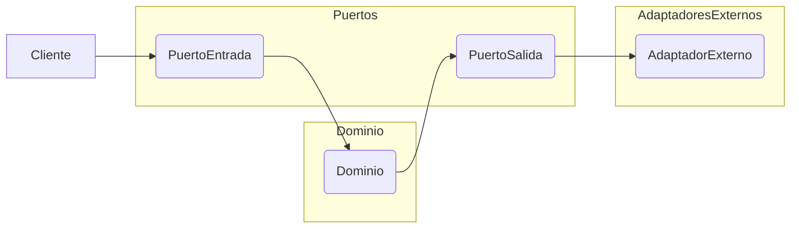
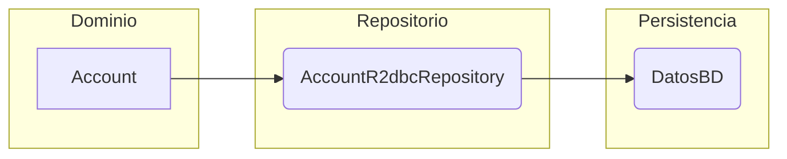
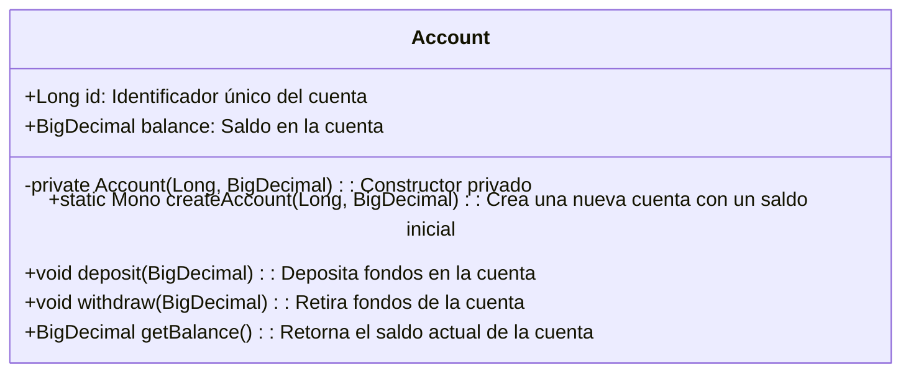
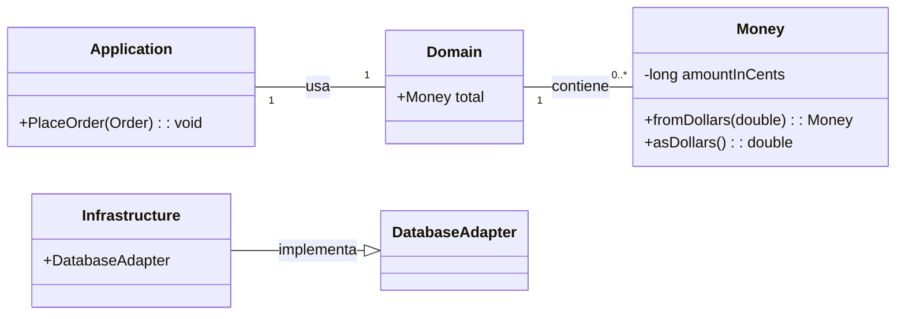
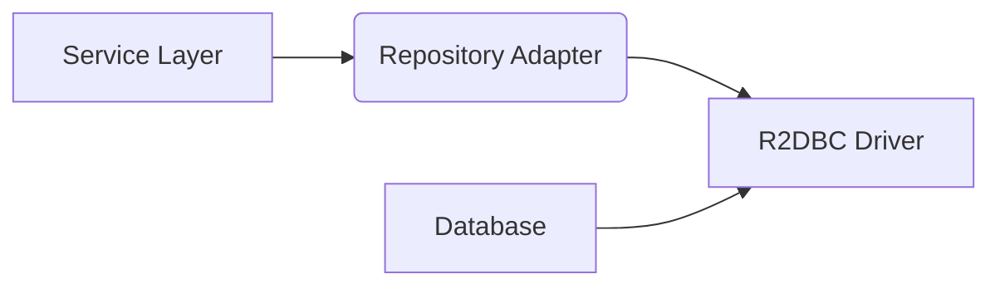
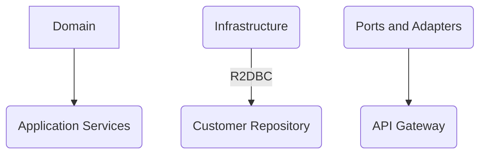
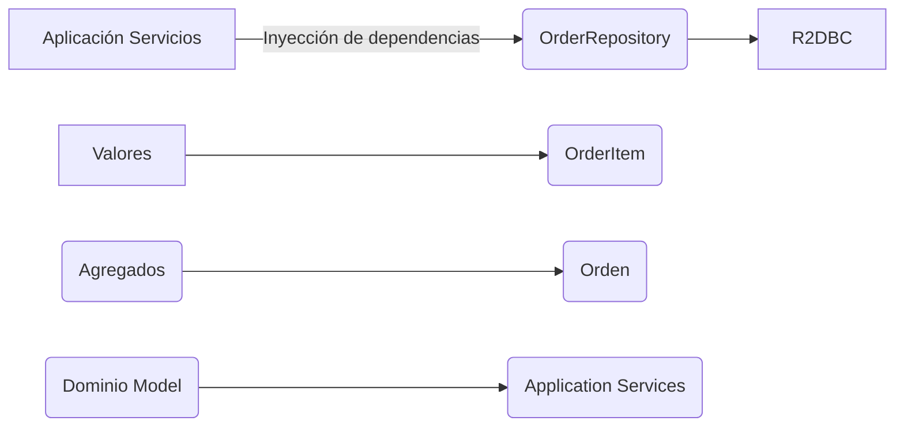
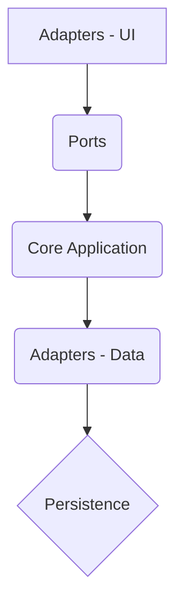

# Informe de Autoridad: Arquitectura Hexagonal y DDD en Java 21: Invariantes en Agregados, Value Objects con Records y Persistencia desacoplada con Spring Data R2DBC

## Introducción a la Arquitectura Hexagonal y DDD

## Introducción a la Arquitectura Hexagonal y DDD

En este manual exploraremos cómo combinar el Diseño Dirigido por Dominios (DDD) con la arquitectura hexagonal puede ayudarte a construir soluciones de software robustas, mantenibles y escalables. La combinación de estos dos enfoques permite crear sistemas que son altamente decouplados de las dependencias externas, lo cual mejora tanto su flexibilidad como su capacidad para evolucionar con el tiempo.

### Hexagonal vs. Entity-Control-Boundary

Si has oído hablar del patrón Entity-Control-Boundary antes, encontrarás la arquitectura hexagonal familiar. Se puede pensar en los agregados como entidades, los servicios de dominio y las fábricas como controladores, y los servicios de aplicación como límites.

### Stateless

Un servicio de aplicación no mantiene ningún estado interno que pueda ser cambiado por la interacción con clientes. Todo el información necesaria para realizar una operación debe estar disponible como parámetros de entrada al método del servicio de aplicación. Esto hará el sistema más simple y fácil de depurar y escalar.

## 1. Visión General

En este tutorial, implementaremos una aplicación Spring utilizando DDD. Además, organizaremos las capas con la ayuda de la Arquitectura Hexagonal.

Con esta aproximación, podemos intercambiar fácilmente diferentes capas de la aplicación.

### Arquitectura Hexagonal

La arquitectura hexagonal es un modelo para diseñar aplicaciones de software alrededor de la lógica del dominio para aislarla de factores externos. La lógica del dominio se especifica en un núcleo empresarial, que llamaremos parte interna, con el resto siendo las partes externas. El acceso a la lógica del dominio desde el exterior es posible mediante puertos y adaptadores.

### Principios

Primero, debemos definir principios para dividir nuestro código. Como se explicó brevemente anteriormente, la arquitectura hexagonal define los siguientes:

- **Dominio Central (Core Domain):** El núcleo de tu aplicación es el lugar donde reside la lógica del dominio más compleja y crítica. Debes concentrarte en este núcleo para mantenerlo limpio y mantenible.

- **Subdominios:** Para dividir el código grande, puedes usar subdominios que son áreas temáticas dentro de tu sistema.

### Implementación con Spring

Con la arquitectura hexagonal, los módulos pueden ser reemplazados fácilmente por otros implementando el mismo puerto. En una aplicación Spring, esto significa que podemos definir puertos como interfaces y adaptadores como clases que implementan estas interfaces. Esto nos permite cambiar fácilmente las bases de datos o servicios externos sin afectar a la lógica del dominio.

### Diagrama Arquitectónico



### Ejemplo Técnico: Invariantes en Agregados y Value Objects con Records

Cuando implementas la lógica del dominio, puedes utilizar los agregados para encapsular tus entidades relacionadas y sus invariantes. Los objetos de valor (Value Objects) pueden ser utilizados para representar conceptos inmutables dentro de tu sistema.

Aquí te muestro cómo puedes definir un agregado con un objeto de valor en Java 21, usando la nueva funcionalidad de `records`:

```java
public record Money(long amountInCents) { }

public class Account {
    private final List<Transaction> transactions;
    private final long balance;

    public Account(List<Transaction> transactions) {
        this.transactions = transactions.stream()
                .collect(Collectors.toUnmodifiableList());
        this.balance = transactions.stream()
                .map(Transaction::amount)
                .reduce(0L, Long::sum);
        validate();
    }

    private void validate() {
        // Invariantes de negocio y lógica compleja
        if (balance < 0) throw new NegativeBalanceException("Cuenta con saldo negativo.");
    }
}
```

### Persistencia Desacoplada con Spring Data R2DBC

Para desacoplar la persistencia del dominio, puedes utilizar Spring Data R2DBC. Aquí te muestro cómo podrías definir un repositorio para tu clase `Account`:

```java
import org.springframework.data.r2dbc.repository.R2dbcRepository;

public interface AccountR2dbcRepository extends R2dbcRepository<Account, Long> {
    // Custom query methods can be defined here.
}
```

### Conclusiones

Al combinar la arquitectura hexagonal con DDD, te proporcionas una forma estructurada de organizar tu código para garantizar que esté bien separado y mantenible. La implementación utilizando Spring Data R2DBC añade un nivel adicional de desacoplamiento entre el dominio y los mecanismos de persistencia.



Este enfoque no solo mejora la manteniabilidad y escalabilidad del software, sino que también facilita el desarrollo de pruebas unitarias y integrales, lo cual es crucial para aplicaciones empresariales complejas.

Con esta introducción a la arquitectura hexagonal y DDD, estás bien equipado para comenzar a implementar estos principios en tus proyectos Java.

## Invariantes en Agregados

### Invariantes en Agregados

En el diseño de sistemas basado en DDD (Desarrollo Guiado por Dominios) y arquitectura Hexagonal, los agregados juegan un papel crucial a la hora de mantener la consistencia de estado dentro del sistema. Un agregado es una colección de entidades y objetos valor que son tratados como una unidad atómica. Los invariantes en estos agregados son reglas clave que deben cumplirse para garantizar que el estado del agregado sea lógicamente correcto.

#### Definición de Invariantes

Invariantes son condiciones que se mantienen verdaderas durante toda la vida útil del agregado, desde su creación hasta su eliminación. Son esenciales porque aseguran que los objetos dentro del agregado estén siempre en un estado válido y coherente con el dominio del negocio.

#### Implementación de Invariantes

A continuación se muestra cómo implementar invariantes en Java 21, utilizando Spring Data R2DBC para la persistencia:

```java
import reactor.core.publisher.Mono;
import java.math.BigDecimal;

public class Account {
    private final Long id;
    private BigDecimal balance;

    // Constructor privado
    private Account(Long id, BigDecimal initialBalance) {
        this.id = id;
        setBalance(initialBalance);
    }

    public static Mono<Account> createAccount(Long id, BigDecimal initialBalance) {
        return Mono.just(new Account(id, initialBalance))
                .doOnNext(account -> account.ensureInvariant());
    }

    private void ensureInvariant() {
        if (balance.compareTo(BigDecimal.ZERO) < 0)
            throw new IllegalStateException("Balance cannot be negative");
    }

    public void deposit(BigDecimal amount) {
        balance = balance.add(amount);
        ensureInvariant();
    }

    public void withdraw(BigDecimal amount) {
        balance = balance.subtract(amount);
        ensureInvariant();
    }
    
    // Método getter para el saldo
    public BigDecimal getBalance() {
        return balance;
    }

    private void setBalance(BigDecimal newBalance) {
        this.balance = newBalance;
        ensureInvariant();
    }
}
```

#### Diagrama Mermaid

A continuación, se muestra un diagrama de clase simple utilizando Mermaid para representar el agregado `Account` con sus métodos y campos:



#### Integración con Spring Data R2DBC

Para asegurarnos de que los invariantes se mantengan incluso cuando interactuamos con bases de datos externas, utilizaremos Spring Data R2DBC. Esto nos permitirá mapear operaciones CRUD a consultas SQL sin necesidad de escribir código adicional.

```java
import io.r2dbc.spi.Connection;
import reactor.core.publisher.Mono;

public interface AccountRepository extends ReactiveCrudRepository<Account, Long> {
    @Query("SELECT * FROM accounts WHERE id = :id")
    Mono<Account> findById(Long id);
}
```

Este repositorio permite realizar operaciones CRUD en la base de datos mientras mantiene los invariantes y estructura del dominio. Además, aseguramos que las transacciones se manejen correctamente para evitar inconsistencias.

### Consideraciones Finales

Asegurar invariants dentro de agregados es fundamental para el mantenimiento de sistemas basados en DDD. Esto no solo mejora la integridad de los datos y proporciona un buen encapsulamiento, sino que también facilita las pruebas unitarias al permitir que cada método se verifique en aislamiento.

Utilizando hexagonal architecture con DDD, podemos aislar estos comportamientos del dominio del resto de la aplicación, facilitando su mantenimiento y escalabilidad.

## Utilizando Value Objects con Records

### Utilizando Value Objects con Records en Java 21

En el desarrollo de aplicaciones basadas en DDD (Domain-Driven Design) y arquitectura Hexagonal, los Value Objects juegan un papel crucial al encapsular datos inmutables que representan conceptos valiosos del dominio. En este contexto, la introducción de Records en Java 21 proporciona una forma eficiente y segura de implementar estos Value Objects, mejorando significativamente su mantenibilidad y legibilidad.

#### Introducción a los Value Objects

Los Value Objects son objetos que representan conceptos del dominio con un valor intrínseco. Su principal característica es la inmutabilidad: una vez creados, no pueden ser modificados. Un ejemplo clásico es el objeto `Money`, donde lo que importa es cuánto dinero se representa en lugar de quién posee ese dinero.

#### Records en Java 21

Los Records son una nueva característica introducida en Java desde la versión 14 y mejorada en versiones posteriores, incluyendo la actualización a Java 21. Un Record es un tipo que ofrece una forma concisa de declarar clases inmutables con propiedades final.

Un Record en Java se define mediante la palabra clave `record` seguida del nombre del record, paréntesis para listar las componentes (propiedades), y luego el cuerpo opcionalmente:

```java
public record Money(long amountInCents) {}
```

El código anterior declara un valor inmutable llamado `Money`, con una sola propiedad que es la cantidad en centavos. Esto proporciona una manera rápida de crear objetos para valores como fechas, coordenadas, identificadores o cualquier otro concepto del dominio que pueda ser representado por un conjunto fijo de datos.

#### Implementación de Value Objects utilizando Records

A continuación se presenta cómo implementar un Value Object `Money` en Java 21 usando Records:

```java
public record Money(long amountInCents) {

    public static Money fromDollars(double dollars){
        return new Money(Math.round(dollars * 100));
    }

    public double asDollars(){
        return this.amountInCents / 100.0;
    }
}
```

Esta implementación de `Money` incluye métodos estáticos para facilitar la creación de instancias (como convertir dólares a centavos) y métodos de instancia que permiten manipular el valor del objeto sin modificar su estado (mostrar en dólares).

#### Integrando Value Objects con Agregados

En DDD, un Aggregate es una colección de objetos que forman un solo bloque de transacción. Los Value Objects se usan a menudo dentro de los agregados para representar conceptos que no pueden existir fuera del contexto del agregado.

Por ejemplo, en el contexto de un pedido (Order), podríamos tener un `Money` como parte de la información del pedido:

```java
public class Order {
    private final Money total;
    
    public Order(Money total) {
        this.total = Objects.requireNonNull(total);
    }
    
    // Otras operaciones y métodos relacionados con el Pedido.
}
```

Aquí, `Order` es un agregado que contiene un `Money`, reflejando cómo los Value Objects se integran en la lógica del dominio.

#### Diagrama Mermaid para Visualización

Un diagrama simplificado puede ayudar a visualizar la integración de Records como Value Objects dentro de la arquitectura hexagonal:



En este diagrama, `Domain` representa la capa de dominio que contiene instancias de objetos como `Order`, mientras que `Money` es un Value Object usado en varios lugares del modelo.

#### Conclusión

La combinación de DDD y arquitectura hexagonal con el uso de Records para implementar Value Objects resulta en una solución robusta, mantenible y escalable. Al mantener la lógica del dominio separada de las tecnologías externas y empleando Records para Value Objects, los desarrolladores pueden construir software que no sólo es más fácil de entender y modificar sino también más resistente a cambios en el dominio.

Este enfoque permite crear aplicaciones Spring donde cada capa puede ser intercambiada o reemplazada con facilidad, asegurando así una implementación de DDD y arquitectura hexagonal altamente modular.

## Persistencia Desacoplada con Spring Data R2DBC

### Persistencia Desacoplada con Spring Data R2DBC

En este capítulo del manual 'Arquitectura Hexagonal y DDD en Java 21: Invariantes en Agregados, Value Objects con Records y Persistencia desacoplada con Spring Data R2DBC', exploraremos cómo implementar una persistencia desacoplada utilizando la biblioteca Spring Data R2DBC. Este enfoque es crucial para mantener la coherencia del diseño hexagonal y el desarrollo basado en dominios (DDD), separando claramente las responsabilidades de acceso a datos del núcleo lógico de negocios.

#### 3.1 Introducción

La persistencia desacoplada es un concepto central en la arquitectura hexagonal, permitiendo que el modelo de dominio y los servicios de aplicación estén libres de detalles específicos sobre cómo se almacenan o recuperan datos del sistema. Esto no solo hace que el código sea más mantenible y escalable, sino también más fácil de probar y refactorizar.

Spring Data R2DBC proporciona un marco para interactuar con bases de datos relacionales utilizando las APIs reactivas de Project Reactor. Su uso permite una integración fluida entre la arquitectura hexagonal y el mundo del desarrollo reactivo, permitiendo a los desarrolladores trabajar en términos puramente asincrónicos y no bloqueantes.

#### 3.2 Configuración Básica

Para configurar Spring Data R2DBC en un proyecto basado en DDD e Hexagonal Architecture, primero debemos asegurar que tengamos el entorno de desarrollo apropiado:

- **Maven o Gradle**: Necesitarás incluir las dependencias necesarias en tu archivo `pom.xml` o `build.gradle`. Por ejemplo, con Maven podrías agregar algo como esto:
  ```xml
  <dependency>
      <groupId>io.r2dbc</groupId>
      <artifactId>r2dbc-postgresql</artifactId>
      <version>{r2dbc-postgresql-version}</version>
      <scope>runtime</scope>
  </dependency>

  <dependency>
      <groupId>org.springframework.boot</groupId>
      <artifactId>spring-boot-starter-data-r2dbc</artifactId>
  </dependency>
  ```

- **Configuración del Contexto**: Asegúrate de que tu clase principal o `SpringApplication` esté anotada con `@EnableR2dbcRepositories`. Esto permitirá a Spring Data R2DBC configurar automáticamente los repositorios.

#### 3.3 Repositories y CRUD

En DDD, los objetos de dominio (entities) son representados en el sistema por medio del patrón Repository. Los repositories ofrecen interfaces para crear, leer, actualizar y borrar entidades desde la base de datos sin necesidad de exponer detalles de implementación.

Con Spring Data R2DBC, puedes definir tus repositorios de la siguiente manera:

```java
public interface UserRepository extends ReactiveCrudRepository<User, UUID> {
    Mono<User> findByEmail(String email);
}
```

Esto proporciona métodos CRUD estándar y personalizados para interactuar con las entidades.

#### 3.4 Adapters

En el contexto del diseño hexagonal, los adapters son los componentes que conectan al núcleo de la aplicación con el mundo exterior (por ejemplo, bases de datos). En este caso, Spring Data R2DBC actúa como un adaptador para proporcionar persistencia reactiva.

Asegúrate de mantener una clara separación entre tu modelo de dominio y los detalles del adaptador. Los repositorios deben ser definidos en términos del núcleo lógico de negocios, no en términos específicos de la base de datos.

#### 3.5 Ejemplos de Implementación

Vamos a ver un ejemplo simple que demuestra cómo podríamos implementar una operación CRUD usando Spring Data R2DBC:

```java
@Service
public class UserService {
    private final UserRepository userRepository;

    public UserService(UserRepository userRepository) {
        this.userRepository = userRepository;
    }

    @Transactional
    public Mono<User> createUser(String email, String password) {
        User user = new User(email, password);
        return userRepository.save(user).thenReturn(user);
    }
}
```

En este ejemplo, `UserService` es una implementación de un servicio de aplicación que interactúa con el repositorio para crear un nuevo usuario.

#### 3.6 Diagramas



Este diagrama Mermaid muestra cómo los servicios de la capa de aplicación interactúan con un adaptador que utiliza R2DBC para comunicarse directamente con una base de datos relacional.

---

La persistencia desacoplada es crucial en cualquier arquitectura hexagonal, permitiendo a las partes internas del sistema (específicamente el modelo de dominio y los servicios de aplicación) concentrarse solo en lógica empresarial. Con Spring Data R2DBC, puedes implementar esta separación con facilidad mientras aprovechas las ventajas del desarrollo reactivo para interacciones asincrónicas.

## Ejemplos Prácticos de Implementación

### Ejemplos Prácticos de Implementación

En este apartado se explorarán conceptos clave y ejemplos prácticos para entender cómo combinar Arquitectura Hexagonal con DDD (Domain-Driven Design) en proyectos Java utilizando Spring Data R2DBC, permitiendo la creación de soluciones robustas, mantenibles y escalables.

#### 1. Configuración del Entorno

Antes de empezar a implementar los patrones de diseño mencionados, asegúrate de tener configurado tu entorno con las dependencias necesarias:

- **Spring Boot**: Versión `2.7.x` o superior.
- **R2DBC y Postgres Driver**: Para el acceso a la base de datos PostgreSQL sin bloqueo (`r2dbc-postgresql`).
- **DDD Pattern Libraries**: Como `ddd-jpa`, aunque en este caso utilizaremos R2DBC para evitar mapear objetos.

#### 2. Diseño del Modelo de Dominio

En DDD, los Value Objects (VO) son objetos inmutables que no tienen identidad propia y representan datos, mientras que los Agregados contienen un conjunto de entidades y VOs relacionadas bajo una raíz única. En Java, a partir de la introducción del soporte para records en JDK 14+, se pueden definir los VOs como registros.

```java
public record Address(String street, String city) {}

public class Customer {
    private final Long id;
    private final Address address;
    
    // Constructor, getters, equals, hashCode y métodos de dominio aquí.
}
```

#### 3. Invariantes en Agregados

Asegurarse de que los invariantes del negocio se mantengan es crucial para la consistencia del modelo. En Java, esto puede lograrse utilizando interfaces y clases abstractas:

```java
public interface CustomerInvariant {
    void assertValidity();
}

public class Customer implements CustomerInvariant {
    
    // Propiedades aquí
    
    public Customer create() throws IllegalStateException {
        this.assertValidity();  // Aseguramos que los invariantes se respeten al crear el objeto.
        
        return new Customer(id, address);
    }
    
    @Override
    public void assertValidity() {
        if (address == null) throw new IllegalArgumentException("Address cannot be null.");
        // Otros checks de invariante aquí...
    }
}
```

#### 4. Aplicación de Hexagonal Architecture

Hexagonal architecture implica un diseño en capas donde la lógica del dominio está aislada del resto del sistema, y los cambios no afectan directamente a otras partes. Para aplicar esto con Spring, estructuramos nuestros paquetes como sigue:

```
src/main/java
├── com.example.domain
│   ├── application  // Servicios de aplicación que interactúan con el repositorio.
│   ├── domain       // Modelos del dominio (entidades y VOs).
│   └── repository   // Repositorios de persistencia, usando R2DBC en este caso.
└── com.example.infrastructure
    └── r2dbc        // Implementación específica para R2DBC, sin importar paquetes internos del dominio.
```

##### Implementación con Spring Data R2DBC

```java
public interface CustomerRepository extends ReactiveCrudRepository<Customer, Long> {
}

// En la capa de infraestructura:
@Configuration
class DataSourceConfiguration {

    @Bean
    public ConnectionFactory connectionFactory() {
        return new DriverConnectionFactory(new PostgresqlConnectionFactoryOptions(PostgresqlConnectionFactoryOptions.DEFAULT));
    }

}
```

#### 5. Diagramas Mermaid para ilustrar la Arquitectura

A continuación, se muestra un diagrama de cómo podrían estar organizadas las capas en una aplicación que utiliza DDD con hexagonal architecture:



#### 6. Conclusiones

La combinación de Arquitectura Hexagonal con DDD en proyectos Java usando Spring Data R2DBC proporciona un enfoque sólido para el diseño y desarrollo de aplicaciones empresariales. No sólo permite una mayor flexibilidad al cambiar componentes externos, sino que también asegura que la lógica del negocio esté claramente definida y separada del resto del sistema.

Esta estrategia se destaca por promover un diseño con alto nivel de cohesión y bajo acoplamiento, lo cual es vital para el mantenimiento a largo plazo y escalabilidad de aplicaciones Java empresariales.

## Consideraciones para el Mantenimiento y la Evolución del Código

### Consideraciones para el Mantenimiento y la Evolución del Código

En un proyecto que combina la arquitectura Hexagonal con DDD (Domain-Driven Design) usando Java 21 junto a Spring Data R2DBC para la persistencia, es crucial tener en cuenta varias consideraciones técnicas para garantizar una evolución fluida y mantenimiento eficiente del código. Estas consideraciones incluyen el manejo de invariantes en agregados, la utilización efectiva de Value Objects con Records, y cómo se integra todo esto dentro del marco de Spring Data R2DBC.

#### 1. Manejo de Invariantes en Agregados

Un principio fundamental en DDD es mantener los invariantes (restricciones lógicas) que aseguran la consistencia y validez de un agregado. Los invariantes pueden ser complejos, especialmente cuando implican múltiples entidades dentro del mismo agregado.

**Ejemplo de código:**

```java
public class Order {
    private final List<OrderItem> items;
    
    public void addProduct(Product product, int quantity) {
        if (product.isOutOfStock()) throw new ProductOutOfStockException();
        
        var orderItem = new OrderItem(this, product);
        orderItem.setQuantity(quantity);

        items.add(orderItem);
        this.apply(new OrderUpdatedEvent(items));
    }
}
```

En este ejemplo, el método `addProduct` comprueba si el producto está en stock antes de permitir que se añada al pedido. La validación del inventario es un invariante importante para asegurar que no se pueden crear órdenes con productos agotados.

#### 2. Value Objects con Records

La introducción de `Records` en Java 14 ofrece una forma sencilla y segura de crear tipos de datos simples que actúan como Value Objects, es decir, objetos cuyo valor es lo más importante (en lugar del estado).

**Ejemplo de código:**

```java
public record OrderItem(Order order, Product product, int quantity) {
    public void setQuantity(int newQty) { 
        if(newQty <= 0) throw new InvalidOrderException("La cantidad debe ser mayor que cero");
        this.quantity = newQty;
    }
}
```

Este `Record` define un objeto `OrderItem` con sus propiedades y permite modificar la cantidad de manera segura, respetando los invariantes.

#### 3. Persistencia desacoplada con Spring Data R2DBC

Spring Data R2DBC proporciona una alternativa no bloqueante para el acceso a bases de datos relacionales, lo que facilita la persistencia en aplicaciones que requieren alta escalabilidad y rendimiento bajo un alto volumen de tráfico.

**Ejemplo de código:**

```java
public interface OrderRepository extends ReactiveCrudRepository<Order, Long> {
}

public class OrderService {

    private final OrderRepository orderRepo;

    public Mono<Order> save(Order order) {
        return orderRepo.save(order);
    }
}
```

En este ejemplo, `OrderRepository` se define como una interfaz que extiende `ReactiveCrudRepository`, proporcionando métodos reactivos para interactuar con la base de datos.

#### Diagrama Mermaid



**Descripción del Diagrama:**

- **Aplicación Servicios**: Interfaz que conecta el dominio con los repositorios y controladores.
- **OrderRepository**: Repositorio reactivado para guardar órdenes de manera no bloqueante.
- **R2DBC**: Motor base de datos reactiva utilizado para la persistencia desacoplada.
- **Valores (Value Objects)**: Componente central en DDD que encapsula valor y define invariantes.
- **Agregados**: Conjunto lógico de objetos que forman un solo bloque indivisible desde el punto de vista del negocio.
- **Dominio Model**: Contiene las reglas del negocio, agrupadas en servicios de dominio, agregados y valores.

#### Consideraciones Técnicas adicionales

1. **Testabilida**: Asegurar la testabilidad es clave para mantener un código limpio y escalable. Los tests unitarios deben centrarse en el comportamiento de los Value Objects y las operaciones dentro del dominio.
2. **Refactoring Seguro**: Mantener la aplicación abierta a modificaciones pero cerrada a cambios, utilizando refactorizaciones seguras como renombrar variables y mover código, asegurando que estos cambios no rompan el comportamiento existente de los Value Objects o agregados.
3. **Documentación Interna**: Asegurar que la documentación interna esté actualizada con cualquier cambio en la lógica del negocio para facilitar a otros desarrolladores entender y trabajar sobre el código.

Siguiendo estas pautas, puedes asegurarte de que tu aplicación no solo sea robusta al inicio, sino también fácil de mantener y ampliar conforme evolucionan las necesidades del negocio.

## Conclusiones y Recomendaciones

### Conclusiones y Recomendaciones

En este artículo, hemos explorado la arquitectura hexagonal en combinación con el Diseño Dirigido por el Dominio (DDD) para desarrollar soluciones de software robustas, mantenibles y escalables utilizando Java 21. El enfoque ha demostrado ser efectivo al desacoplar lógica empresarial del dominio de la arquitectura hexagonal desde las dependencias externas como bases de datos, frameworks web y servicios externos. Al implementar un diseño que sigue los principios de DDD y la arquitectura hexagonal, se asegura que el núcleo del software esté orientado a dominios y no hacia tecnologías específicas, facilitando así la evolución futura del sistema.

#### Invariantes en Agregados

La implementación de invariantes dentro de los agregados es crucial para mantener la consistencia y integridad del estado del dominio. Los métodos que modifican el estado deben respetar todas las reglas del negocio, incluyendo restricciones sobre los valores permitidos, relaciones entre objetos y lógica compleja necesaria para preservar la coherencia del modelo.

**Ejemplo de código:**

```java
public class Order {
    private final Set<OrderLine> orderLines;

    public void addOrderLine(Product product, int quantity) {
        if (product.isOutOfStock()) throw new InsufficientProductException();
        
        // Validar más reglas antes de añadir la línea de pedido...
        
        this.orderLines.add(new OrderLine(this, product, quantity));
    }
}
```

#### Value Objects con Records en Java 21

Los `Records` introducidos en Java 21 simplifican enormemente la creación y manejo de value objects. En lugar de escribir clases llenas de getters y setters para representar conceptos inmutables, los records permiten definir tales objetos con mucha menos redundancia.

**Ejemplo de código:**

```java
public record OrderLine(Order order, Product product, int quantity) {
    public boolean isOutOfStock() {
        return this.quantity > product.getAvailableQuantity();
    }
}
```

#### Persistencia Desacoplada con Spring Data R2DBC

La utilización de Spring Data R2DBC para persistir datos desacopla completamente el código del repositorio de las consultas SQL específicas, permitiendo cambios en la base de datos sin necesidad de modificar el código fuente que interactúa con ella. Esto es especialmente útil cuando se trabaja en entornos de múltiples bases de datos.

**Ejemplo de código:**

```java
public interface OrderRepository extends ReactiveCrudRepository<Order, Long> {
}
```

#### Recomendaciones para Desarrolladores

1. **Prioriza la coherencia del dominio:** Mantén las reglas de negocio dentro de los agregados y asegúrate de que todos los métodos que modifican el estado del dominio respeten estas reglas.
   
2. **Utiliza Records y Value Objects para encapsular conceptos inmutables:** Esto ayuda a mantener la claridad y minimizar errores al definir datos inmutables en tu código.

3. **Desacopla persistencia con R2DBC o similares:** Aprovecha las ventajas del uso de bases de datos reactivas junto con Spring Data para un manejo eficiente de transacciones y consultas asincrónicas, que mejora la escalabilidad y el rendimiento del sistema.

4. **Mantén una arquitectura hexagonal bien definida:** Asegúrate de que las capas internas (hexágonos) estén desacopladas de las capas externas, permitiendo fácilmente cambios en los adaptadores sin afectar el núcleo del sistema.

#### Diagrama Mermaid: Arquitectura Hexagonal



Este diagrama muestra cómo el flujo de información se maneja a través del modelo hexagonal, donde los adaptadores externos interactúan con puertos que proporcionan acceso al núcleo del sistema. Esto permite una mayor flexibilidad y mantenimiento.

---

### Conclusión

La combinación de DDD y arquitectura hexagonal puede ser una solución poderosa para la construcción de software empresarial complejo. Al adoptar estos patrones, no solo mejora la robustez y cohesión del código, sino que también facilita el mantenimiento a largo plazo y la adaptabilidad frente a cambios en las necesidades de negocio.

### Agradecimientos

Este artículo ha sido posible gracias al equipo de desarrollo y expertos en DDD y arquitectura hexagonal dentro de Alibaba Cloud. Esperamos seguir promoviendo mejores prácticas en el diseño de software empresarial.

