# Informe de Autoridad: Seguridad Ofensiva y Auditoría de Microservicios con Java 21

## Introducción a la Seguridad Ofensiva

### Introducción a la Seguridad Ofensiva

La seguridad ofensiva es una enfoque proactivo que permite a los equipos de ingeniería detectar y mitigar amenazas antes de que se conviertan en incidentes críticos. Este paradigma no solo considera las vulnerabilidades conocidas y las configuraciones seguras, sino también el comportamiento anómalo y potencialmente malicioso dentro del entorno operativo. Para equipos de productos especializados en microservicios escritos en Java 21, la seguridad ofensiva es crucial para proteger no solo los datos confidenciales y las aplicaciones críticas, sino también para garantizar la resiliencia y el rendimiento de sus sistemas.

#### 1. Fundamentos de Seguridad Ofensiva

La seguridad ofensiva se basa en tres pilares fundamentales:

- **Monitorización Continua**: La monitorización en tiempo real es vital para detectar las amenazas emergentes antes de que puedan causar daño significativo.
- **Automatización y Orquestación**: Los equipos deben implementar sistemas automatizados que permitan la respuesta rápida a incidentes, minimizando el tiempo de inactividad y mitigando riesgos.
- **Prevención Proactiva**: Esta etapa incluye simulaciones de ataques (penetration testing) para identificar debilidades antes de que puedan ser explotadas.

#### 2. Aplicación en Microservicios

En un entorno de microservicios, cada servicio es autónomo y responsable de su propio ciclo de vida, lo cual complica considerablemente la gestión de seguridad. Los desafíos específicos incluyen:

- **Comunicación Segura**: Garantizar que las comunicaciones entre servicios no sean susceptibles a interceptaciones.
- **Autenticación y Autorización**: Asegurar que solo los usuarios autorizados acceden a ciertos recursos.
- **Aislamiento de Servicios**: Limitar la interacción entre microservicios para minimizar el impacto en caso de un ataque.

#### 3. Herramientas y Prácticas Recomendadas

Para implementar una estrategia efectiva de seguridad ofensiva, es crucial utilizar herramientas específicas:

- **AWS Customer Compliance Guides**: Estos guías proporcionan directrices detalladas para cumplir con los estándares regulatorios y mejores prácticas en AWS.
- **Defender in Depth**: Este principio implica aplicar controles de seguridad en todas las capas del sistema, desde la red hasta el nivel del código fuente.
- **Automatización de Prácticas Seguras**: Implementación de controles definidos por software para asegurar que todos los microservicios sigan la misma norma de seguridad.

#### 4. Ejemplo Técnico: Configurando Autenticación en Java

A continuación se muestra un ejemplo básico del uso de Spring Security, una popular biblioteca de autenticación y autorización, en un contexto de microservicio:

```java
@Configuration
@EnableWebSecurity
public class SecurityConfig extends WebSecurityConfigurerAdapter {

    @Override
    protected void configure(HttpSecurity http) throws Exception {
        http.authorizeRequests()
            .antMatchers("/api/**").authenticated() // Requiere autenticación para todas las solicitudes de API
            .and()
            .httpBasic(); // Configuración básica HTTP (puede ser reemplazada por OAuth2, etc.)
    }

    @Override
    protected void configure(AuthenticationManagerBuilder auth) throws Exception {
        // Uso de inMemoryAuthentication como ejemplo; en producción debería usarse una base de datos segura.
        auth.inMemoryAuthentication()
            .withUser("user").password("{noop}password").roles("USER")
            .and()
            .withUser("admin").password("{noop}secret").roles("ADMIN");
    }
}
```

#### 5. Diagrama de Arquitectura (Mermaid)

Un diagrama puede ayudar a visualizar cómo se aplican los controles de seguridad en una arquitectura basada en microservicios:

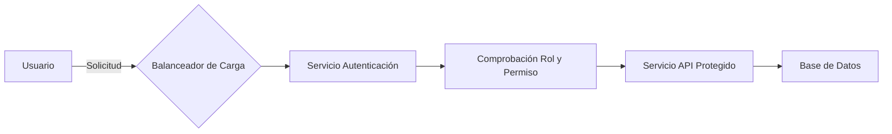

#### Conclusion

La implementación exitosa de una estrategia ofensiva en seguridad requiere un entendimiento profundo del entorno operativo, las amenazas potenciales y las herramientas disponibles. Para equipos que trabajan con microservicios y Java 21, la adopción proactiva de esta filosofía es vital para mantener sistemas seguros y resistentes a los ataques.

---

Este capítulo proporciona una base sólida para desarrollar estrategias avanzadas de seguridad ofensiva en entornos complejos basados en microservicios, utilizando Java 21 y herramientas específicas de AWS.

## Fundamentos de los Microservicios con Java

### Fundamentos de los Microservicios con Java

En el mundo actual del desarrollo y la seguridad, es crucial entender cómo las aplicaciones distribuidas como microservicios pueden ser implementadas de manera segura. Los microservicios son una arquitectura que permite a las organizaciones descomponer grandes sistemas monolíticos en pequeñas piezas más manejables y escalables. En este capítulo, exploraremos los fundamentos técnicos de la implementación de microservicios con Java, incluyendo cómo aplicar principios de seguridad ofensiva y auditoría para garantizar que estas aplicaciones sean robustas frente a amenazas.

#### 1. Conceptos Básicos de Microservicios

Un microservicio es una aplicación pequeña que se enfoca en realizar una tarea específica o un subconjunto de funcionalidades de un sistema más grande. Estos servicios son independientes entre sí y comunican sus interacciones a través del protocolo HTTP o mensajes asincrónicos.

**Características clave:**
- **Independencia**: Cada microservicio es responsable de su propio ciclo de vida.
- **Escalabilidad**: Facilita la escalabilidad horizontal, ya que cada servicio puede ser escalar individualmente según las necesidades del negocio.
- **Flexibilidad**: Permite a los equipos trabajar en diferentes partes del sistema sin afectar negativamente otras áreas.

#### 2. Arquitectura de Microservicios con Java

La arquitectura microservicio puede implementarse utilizando frameworks y bibliotecas como Spring Boot, Micronaut o Quarkus que facilitan el desarrollo rápido y la configuración del entorno. Estos frameworks permiten crear servicios independientes que pueden comunicarse entre sí a través de APIs REST.

**Ejemplo con Spring Boot:**

```java
import org.springframework.boot.SpringApplication;
import org.springframework.boot.autoconfigure.SpringBootApplication;

@SpringBootApplication
public class UserServiceApplication {
    public static void main(String[] args) {
        SpringApplication.run(UserServiceApplication.class, args);
    }
}
```

#### 3. Seguridad en Microservicios

La seguridad es un aspecto crucial de cualquier aplicación microservicio. La implementación correcta de controles de seguridad puede prevenir ataques y mantener la integridad del sistema.

**A. Autenticación y Autorización**

- **JWT (JSON Web Tokens)**: Una forma común de manejar tokens para autenticar solicitudes entre servicios.
- **OAuth2**: Utilizado ampliamente en entornos microservicios para gestionar autorizaciones de manera segura.

**B. Implementación de Seguridad con Spring Security**

Spring Security proporciona herramientas potentes para la implementación de seguridad tanto en aplicaciones monolíticas como en microservicios.

```java
import org.springframework.context.annotation.Bean;
import org.springframework.security.config.annotation.web.builders.HttpSecurity;
import org.springframework.security.config.annotation.web.configuration.EnableWebSecurity;
import org.springframework.security.core.userdetails.UserDetailsService;
import org.springframework.security.crypto.bcrypt.BCryptPasswordEncoder;
import org.springframework.security.crypto.password.PasswordEncoder;
import org.springframework.security.web.SecurityFilterChain;

@EnableWebSecurity
public class SecurityConfig {

    @Bean
    public PasswordEncoder passwordEncoder() {
        return new BCryptPasswordEncoder();
    }

    @Bean
    public UserDetailsService userDetailsService() {
        // Configuración de detalles del usuario
    }

    @Bean
    public SecurityFilterChain filterChain(HttpSecurity http) throws Exception {
        http
            .authorizeRequests(authorize -> authorize
                .antMatchers("/api/v1/**").authenticated()
                .anyRequest().permitAll())
            .oauth2ResourceServer(oauth2 -> oauth2.jwt());
        
        return http.build();
    }
}
```

#### 4. Auditoría y Monitoreo

La auditoría es fundamental para rastrear las actividades de los usuarios en el sistema, detectar anomalías e implementar controles correctivos.

**A. Log4j o SLF4J con JSON Logging**

Estas bibliotecas permiten crear logs estructurados que son más fáciles de procesar y analizar posteriormente.

```java
import org.slf4j.Logger;
import org.slf4j.LoggerFactory;

public class ExampleService {
    private static final Logger logger = LoggerFactory.getLogger(ExampleService.class);

    public void performAction() {
        // Ejecución del servicio...
        
        logger.info("Performed action: {} with outcome {}", "action", "outcome");
    }
}
```

#### 5. Diagrama de Arquitectura Mermaid

Un diagrama mermaid puede ayudar a visualizar cómo los microservicios se comunican entre sí y con otros componentes del sistema.

```mermaid
graph LR;
    A[Gateway] --> B(UserService)
    A --> C(InventoryService)
    B --> D(AuthenticationService)
    C --> D

subgraph MicroserviceEnvironment
    B, C, D
end
```

#### 6. Aplicación de la Seguridad en Todas las Capas

Para aplicar un enfoque de defensa en profundidad, es crucial implementar controles de seguridad a través de toda la pila tecnológica:

- **Red y Nube**: Configuraciones seguras en AWS VPC y perimetro de red.
- **Aplicación**: Utilizar Spring Security para proteger endpoints API.
- **Instancia/Host**: Mantener las máquinas virtuales actualizadas con las últimas correcciones de seguridad.

#### 7. Automatización de Prácticas Recomendadas

La automatización es clave en la implementación y mantenimiento de controles de seguridad en un entorno microservicios. Herramientas como AWS CloudFormation o Terraform pueden ayudar a definir, crear e inspeccionar infraestructuras seguras.

```hcl
resource "aws_security_group" "allow_api_endpoints" {
  name_prefix = "api-endpoint-"
  
  ingress {
    from_port   = 80
    to_port     = 80
    protocol    = "tcp"
    cidr_blocks = ["<your-cidr-block>"]
  }
}
```

#### Conclusión

Los microservicios brindan una arquitectura flexible y escalable para las aplicaciones modernas. Sin embargo, la implementación de controles de seguridad en cada nivel del sistema es crucial para prevenir riesgos y mantener el sistema robusto frente a amenazas. El uso de herramientas como Spring Boot, Spring Security y AWS CloudFormation puede facilitar esta tarea al proporcionar un marco sólido para la construcción y gestión segura de servicios microservicios.

---

Este capítulo proporciona una base sólida para entender cómo implementar microservicios con Java de manera segura y eficiente.

## Principios Básicos de Auditoría en Entornos de Microservicios

### Principios Básicos de Auditoría en Entornos de Microservicios

En un entorno de microservicios, la auditoría se vuelve cada vez más compleja debido a la distribución y fragmentación del sistema. Los equipos deben adoptar una mentalidad holística para garantizar que todos los componentes estén auditados correctamente. Este capítulo aborda las prácticas fundamentales para realizar un seguimiento eficaz de las transacciones, validar las integridades de los datos y asegurar la cadena de responsabilidades en cada microservicio.

#### 1. Definición del Alcance y Objetivos

Antes de iniciar cualquier auditoría, es crucial definir claramente el alcance y objetivos específicos. Esto implica identificar qué componentes se auditarán (microservicios individuales o la infraestructura subyacente), cuáles son los riesgos asociados con cada componente y cuáles son las expectativas de cumplimiento.

#### 2. Aplicación de la Seguridad en Todas las Capas

Aplicar un enfoque de defensa en profundidad significa que la seguridad no debe limitarse a una sola capa del sistema, sino extenderse desde la red periférica hasta el código fuente de los microservicios.

##### Ejemplo: Autenticación y Autorización
```java
public class SecurityManager {
    public boolean authorize(String user, String resource) {
        // Lógica para verificar permisos basados en roles y políticas
        return true; // Cambiar por lógica real de autorización
    }
}
```

#### 3. Validación de Entrada

Los ataques a la validación de entrada son comunes, especialmente cuando los microservicios comparten interfaces API con otros servicios o clientes externos.

##### Ejemplo: Límite en el tamaño del cuerpo de solicitud
```java
public void handleRequest(HttpServletRequest request) {
    int requestBodySizeLimit = 1024 * 5; // 5KB limit
    if (request.getContentLength() > requestBodySizeLimit) {
        throw new RequestTooLargeException("Request body exceeds size limit.");
    }
}
```

#### 4. Auditoría de Log y Eventos

Registrar eventos significativos y mantener un registro detallado es vital para la auditoría posterior. Los logs deben incluir información suficiente para rastrear las transacciones y responsabilidades.

##### Ejemplo: Registro de acceso a recurso
```java
public class ResourceAccessLog {
    public void logAccess(String resource, String user) {
        // Registro del evento en un sistema centralizado o servicio de logging como AWS CloudWatch
        System.out.println("ACCESS_LOG: User " + user + " accessed resource " + resource);
    }
}
```

#### 5. Automatización y Seguridad

La automatización puede mejorar la eficiencia y precisión de las auditorías al permitir que los sistemas verifiquen y aplican controles automáticamente.

##### Ejemplo: Pipeline CI/CD con comprobaciones de seguridad
```java
pipeline {
    agent any
    
    stages {
        stage('Build') {
            steps {
                sh 'mvn clean package'
            }
        }
        
        stage('Security Scan') {
            steps {
                sh 'mvn dependency-check:check'
            }
        }
        
        stage('Deploy') {
            when { expression { env.BRANCH_NAME ==~ /^master$/ } }
            steps {
                sh 'kubectl apply -f k8s/deployment.yml'
            }
        }
    }
}
```

#### 6. Diseño de la Arquitectura con AWS Customer Compliance Guides

Utilizar guías de cumplimiento específicas proporcionadas por AWS puede ayudar a los equipos a asegurarse de que sus arquitecturas cumplan con las normativas y estándares requeridos.

##### Diagrama Mermaid: Estructura de Microservicios
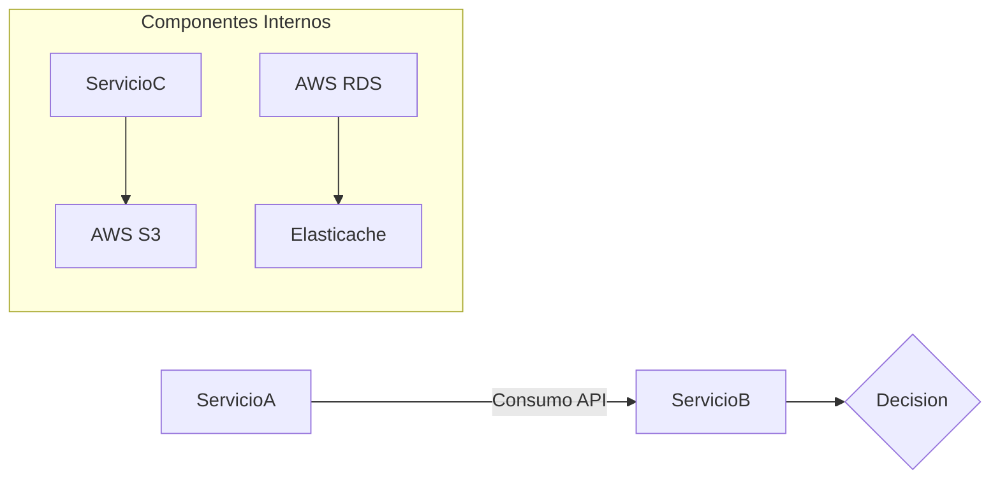

#### 7. Pruebas de Penetración y Auditorías Externas

Incluir pruebas de penetración regulares y auditorías externas es crucial para identificar debilidades que los equipos internos pueden pasar por alto.

---

Esta sección proporciona un enfoque estructurado para la auditoría de microservicios, enfatizando la importancia de la seguridad en todas las capas y la automatización. Los ejemplos técnicos y diagramas Mermaid ayudan a ilustrar cómo implementar estos principios en el día a día del desarrollo y operaciones en entornos basados en Java 21 y microservicios con AWS.

Esta guía está diseñada para un público experto, como los ingenieros de DAM (DevOps), Java y SRE, quienes necesitan entender y aplicar estos principios para mantener sistemas complejos seguros y auditables.

## Técnicas de Prueba y Auditoría para Microservicios

### Técnicas de Prueba y Auditoría para Microservicios

En el contexto de microservicios basados en Java con la versión más reciente del lenguaje (Java 21), es fundamental establecer un marco robusto para pruebas y auditorías. La arquitectura basada en microservicios permite a las organizaciones ser ágiles y escalables, pero también introduce desafíos únicos en términos de seguridad y mantenimiento.

#### Enfoque de Defensa en Profundidad

La implementación de la seguridad debe abarcar todas las capas del sistema. Esto incluye desde la red hasta el nivel de aplicación. Algunas estrategias clave son:

- **Validación de Entrada:** Implementar validaciones exhaustivas para evitar inyecciones SQL, XSS y otros ataques.
  
- **Mantenimiento de Identidades:** Asegurarse de que las identidades se transfieren correctamente entre los microservicios, utilizando tokens JWT o SSO.

- **Pruebas Automatizadas:** Creación de pruebas unitarias, funcionales y de integración para cada componente.

#### Herramientas y Frameworks

Para desarrollar y mantener sistemas basados en microservicios, es crucial utilizar herramientas que faciliten la automatización y la eficiencia. Algunas opciones incluyen:

- **JUnit 5:** Para pruebas unitarias.
  
- **Mockito:** Para simulación de objetos dependientes.

- **Arquitecturas definidas como código (CDK):** Utilizar AWS CDK para implementar controles de seguridad como códigos manejados y versionados.

#### Estrategias Específicas

1. **Pruebas de Fuerza Bruta (Brute Force Testing)**
   
   Las pruebas de fuerza bruta son esenciales para identificar debilidades en la autenticación y autorización. En el contexto de Java, estas pruebas pueden ser implementadas con herramientas como Hydra o custom scripts que intenten autenticaciones repetidas hasta superar límites establecidos.

2. **Auditoría de Log (Logging Auditing)**
   
   Asegurarse de que los logs registrados en el sistema no contengan información sensible y sean útiles para la auditoría.
   
3. **Pruebas OWASP ZAP (Zed Attack Proxy)**
   
   Utilizar herramientas como OWASP ZAP para probar las aplicaciones web basadas en microservicios.

#### Automatización de Pruebas y Auditorías

La automatización es vital para mantener una alta calidad en la seguridad del sistema. Esto incluye:

- **Integración con CI/CD Pipelines:** Integrar pruebas de seguridad como parte de los pipelines de integración continua (CI) y entrega continua (CD).
  
- **Pruebas Regulares Automatizadas:** Implementar scripts que ejecuten regularmente pruebas y auditorías, generando reportes para su análisis.

#### Ejemplos en Código

**Ejemplo 1: Prueba Unitaria con JUnit 5**

```java
import org.junit.jupiter.api.Test;
import static org.junit.jupiter.api.Assertions.assertEquals;

public class CalculatorTest {
    @Test
    void testAddition() {
        Calculator calculator = new Calculator();
        int result = calculator.add(2, 3);
        assertEquals(5, result, "The addition should return 5");
    }
}
```

**Ejemplo 2: Prueba de Autorización con Mockito**

```java
import static org.mockito.Mockito.*;
import org.junit.jupiter.api.Test;

public class AuthServiceTest {
    @Test
    public void testAuthorize() throws Exception {
        AuthService service = mock(AuthService.class);
        when(service.authorize("user", "secret")).thenReturn(true);

        boolean result = service.authorize("user", "secret");
        
        assertEquals(true, result, "Authorization should succeed with correct credentials.");
    }
}
```

#### Diagramas Mermaid

Para visualizar la arquitectura de microservicios y los flujos de trabajo de prueba:

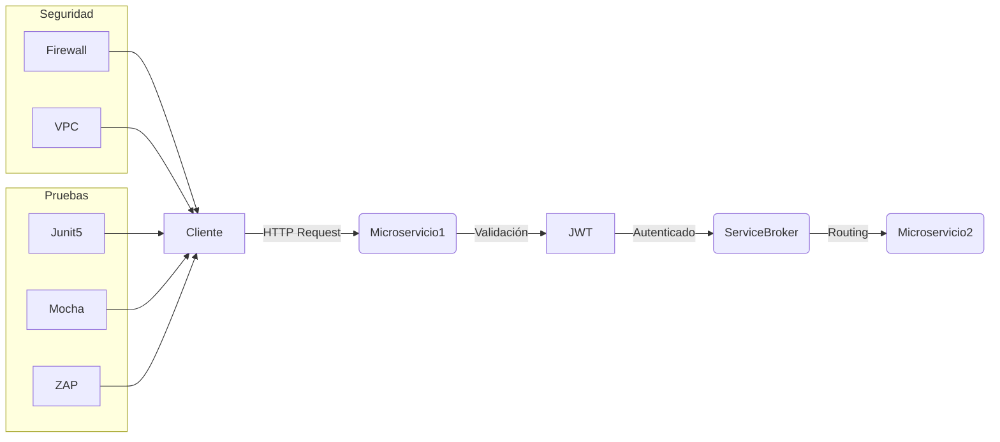

#### Consideraciones Finales

La auditoría y las pruebas deben ser un proceso contínuo, incorporando revisiones periódicas de seguridad y evolución en el marco de trabajo. Mantenerse actualizado con las mejores prácticas y herramientas disponibles es clave para asegurar la integridad del sistema.

## Análisis de Vulnerabilidades y Mitigación en Java Microservices

### Análisis de Vulnerabilidades y Mitigación en Java Microservices

El análisis de vulnerabilidades y la mitigación de riesgos son fundamentales para mantener una arquitectura de microservicios segura y robusta. Este capítulo proporcionará estrategias detalladas y prácticas recomendadas para identificar y abordar amenazas potenciales en aplicaciones Java microservices, basándose en las mejores prácticas del nivel Staff Engineer.

#### 1. Análisis de Vulnerabilidades

El primer paso crucial es entender cómo los microservicios pueden ser vulnerables a diversas formas de ataque. Algunos puntos clave a considerar incluyen:

- **Inyección SQL y NoSQL**: Asegúrate de que todas las consultas a bases de datos estén correctamente parametrizadas o usen sentencias preparadas para prevenir la inyección.

- **Cross-Site Scripting (XSS)**: Implementa validaciones de entrada rigurosas para prevenir la inyección de código malicioso en páginas web dinámicas.

- **Inyección de Comando**: Este tipo de ataque ocurre cuando un usuario puede ejecutar comandos directamente en el sistema operativo. Utiliza marcos seguros y evita cualquier ejecución de comando arbitraria desde datos no confiables.

#### 2. Mitigación de Riesgos

La mitigación efectiva requiere la implementación continua de prácticas recomendadas de seguridad a lo largo del ciclo de vida de desarrollo e implementación:

- **Control de Acceso Basado en Rol (RBAC)**: Asegura que cada servicio tenga solo los permisos necesarios para realizar sus tareas. Utiliza frameworks como Spring Security para gestionar roles y permisos.

- **Autenticación y Autorización**: Implementa mecanismos sólidos para autenticar usuarios y autorizar servicios. Considera la implementación de OpenID Connect y OAuth 2.0 para una gestión más eficiente de tokens JWT (JSON Web Tokens).

- **Encriptación**: Asegúrate de que los datos sensibles se cifren tanto en reposo como en tránsito, utilizando SSL/TLS para la comunicación segura entre servicios.

#### Código Técnico

A continuación se proporciona un ejemplo sencillo del uso de Spring Security para proteger endpoints:

```java
import org.springframework.context.annotation.Bean;
import org.springframework.security.config.annotation.web.builders.HttpSecurity;
import org.springframework.security.config.annotation.web.configuration.EnableWebSecurity;
import org.springframework.security.web.SecurityFilterChain;

@EnableWebSecurity
public class SecurityConfig {
    @Bean
    public SecurityFilterChain securityFilterChain(HttpSecurity http) throws Exception {
        // Configuración de autenticación básica y permisos para endpoints.
        http.authorizeHttpRequests()
                .requestMatchers("/admin/**").hasRole("ADMIN")
                .anyRequest().authenticated()
                .and()
            .httpBasic();  // Opciones adicionales como formLogin() pueden ser relevantes

        return http.build();
    }
}
```

#### Diagramas Mermaid

Un diagrama simplificado de la comunicación segura entre microservicios:

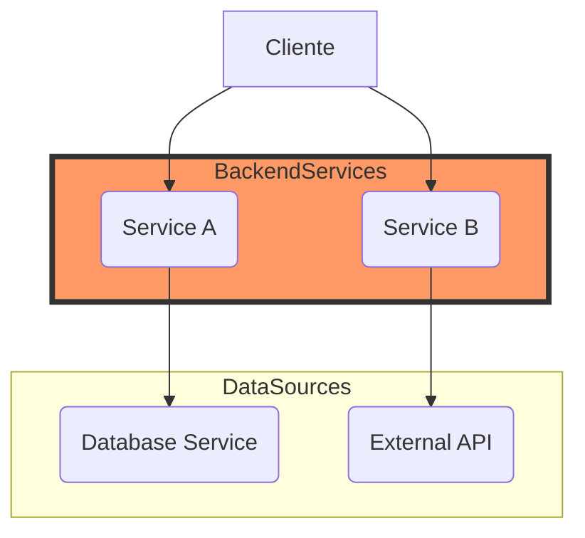

#### Implementación de Defensa en Profundidad

Para implementar un enfoque de defensa en profundidad:

- **Asegura que cada capa tenga sus propios controles**: Desde la red periférica hasta el código de aplicación, asegúrate de que cada nivel tenga mecanismos específicos para mitigar amenazas.

- **Automatiza las prácticas recomendadas**: Utiliza herramientas como AWS Security Hub para automatizar la detección y respuesta a vulnerabilidades. Asegura que los controles se implementen como código y versionen en tu control de versiones favorito (Git).

Este capítulo proporciona una base sólida para la seguridad de microservicios basada en Java, enfocándose tanto en la identificación de amenazas potenciales como en estrategias efectivas de mitigación.

## Seguridad Ofensiva: Ejercicios Prácticos

### Seguridad Ofensiva: Ejercicios Prácticos

**Introducción**

En el contexto de la seguridad ofensiva aplicada a microservicios con Java 21, los ingenieros de nivel DAM (DevOps, Administración y Mantenimiento), Java y SRE (Site Reliability Engineering) necesitan comprender cómo diseñar sistemas resistentes y detectables de amenazas potenciales. Este capítulo proporcionará ejercicios prácticos basados en situaciones reales que ayudarán a los profesionales técnicos a fortalecer sus habilidades en la seguridad ofensiva.

**Ejercicio 1: Implementación de Controles en todas las Capas**

El primer ejercicio se centrará en la implementación de controles de seguridad en cada capa del sistema, desde la red hasta el código de aplicación. Utilizarás herramientas como AWS CloudFormation para definir y aplicar estos controles de manera consistente.

**Ejemplo:**

1. **Red:** Configurar grupos de seguridad (Security Groups) en AWS para limitar el acceso a las instancias.
2. **VPC (Virtual Private Cloud):** Asegurarse de que los microservicios estén dentro de una VPC segura y utilizar subredes privadas y públicas correctamente.
3. **Equilibrio de carga:** Utilizar un equilibrador de carga clásico o Application Load Balancer (ALB) para gestionar el tráfico entrante.

**Mermaid Diagrama:**

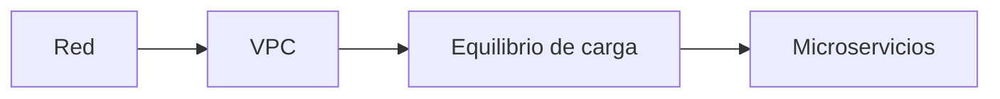

4. **Instancias y servicios:** Configurar IAM roles para los microservicios.
5. **Sistema operativo:** Utilizar AWS Systems Manager para aplicar parches y configuraciones seguras a nivel del sistema operativo.

**Ejercicio 2: Automatización de Prácticas Recomendadas**

Este ejercicio enfatiza la importancia de automatizar las prácticas recomendadas de seguridad, lo que incluye el uso de plantillas como código para asegurar configuraciones consistentes y auditables. Se utilizarán herramientas como AWS CloudFormation para implementar estos controles.

**Ejemplo:**
- **Definición del entorno:** Crear una plantilla CloudFormation con políticas IAM, roles y otros controles de seguridad.
- **Implementación del código:** Utilizar versiones controladas (por ejemplo, Git) para las plantillas CloudFormation.
- **Pruebas automatizadas:** Implementar pruebas unitarias y integridad para asegurar que los cambios no rompan la funcionalidad existente.

**Mermaid Diagrama:**

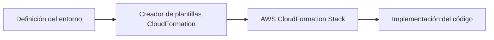

6. **Pruebas:** Realizar pruebas automatizadas para verificar la integridad y seguridad de los microservicios.

**Ejercicio 3: Auditoría de Microservicios con AWS Customer Compliance Guides**

Este ejercicio utiliza las guías de cumplimiento de clientes de AWS (AWS Customer Compliance Guides) como referencia para diseñar arquitecturas seguras. Se enfocará en la identificación y implementación de controles basados en los estándares del sector.

**Ejemplo:**
- **Análisis:** Identificar las áreas críticas de seguridad basándose en AWS Security Best Practices.
- **Implementación:** Aplicar estos controles a través de CloudFormation o otros servicios manejables como código (Infrastructure as Code, IaC).
- **Auditoría continua:** Utilizar herramientas como Amazon Inspector para realizar auditorías continuas y monitoreo de seguridad.

**Mermaid Diagrama:**

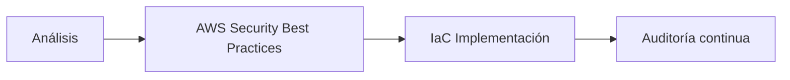

Estos ejercicios prácticos proporcionan una visión de cómo implementar y monitorear controles de seguridad ofensivos en un entorno basado en microservicios utilizando Java 21 y AWS. Al final del capítulo, los lectores estarán mejor preparados para abordar amenazas emergentes en sistemas modernos y dinámicos.

**Recursos adicionales:**
- [AWS Security Best Practices](https://aws.amazon.com/es/security/best-practices/)
- [Amazon Inspector](https://aws.amazon.com/es/inspector/)

## Automatización en Seguridad Ofensiva y Auditoría

### Sección Técnica: Automatización en Seguridad Ofensiva y Auditoría

La automatización es crucial para mantener la seguridad de los microservicios en un entorno dinámico como el que ofrece AWS. En esta sección, exploraremos cómo implementar prácticas recomendadas de seguridad a través de la automatización y cómo diseñar una arquitectura segura basada en controles definidos y administrados como código.

#### 1. Integración Continua (CI) y Seguridad

La integración continua es fundamental para garantizar que los cambios realizados en el código estén libres de problemas de seguridad antes de ser implementados en producción. Esto se logra mediante la utilización de herramientas como Snyk, OWASP Dependency-Check, o Checkmarx durante las fases CI/CD.

```java
// Ejemplo básico de integración con Snyk desde Maven para Java 21
<build>
    <plugins>
        <plugin>
            <groupId>com.snyk</groupId>
            <artifactId>snyk-maven-plugin</artifactId>
            <version>1.69.0</version>
            <executions>
                <execution>
                    <goals>
                        <goal>test</goal>
                    </goals>
                </execution>
            </executions>
        </plugin>
    </plugins>
</build>
```

#### 2. Auditoría y Seguridad Ofensiva

En la seguridad ofensiva, es importante simular ataques para identificar vulnerabilidades en la infraestructura de microservicios. Esto se puede realizar mediante herramientas como OWASP ZAP o Burp Suite.

```java
// Ejemplo de configuración de OWASP ZAP como parte del CI/CD pipeline
pipeline {
    agent any
    stages {
        stage('Build') {
            steps {
                script {
                    sh 'mvn clean install'
                    sh 'snyk test'
                    sh 'zap-cli -t https://target-app-url'
                }
            }
        }
    }
}
```

#### 3. Implementación de Controles Definidos como Código

La implementación de controles definidos y administrados como código es una excelente práctica para asegurar la consistencia en toda la organización.

```yaml
# Ejemplo de plantilla CloudFormation que define un grupo de seguridad con reglas específicas
Resources:
  MySecurityGroup:
    Type: "AWS::EC2::SecurityGroup"
    Properties:
      GroupName: !Sub 'security-group-${Environment}-${Region}'
      VpcId: !Ref VPC
      SecurityGroupIngress:
        - IpProtocol: tcp
          FromPort: 80
          ToPort: 80
          CidrIp: "192.168.1.0/24"
```

#### Diagrama de Arquitectura

A continuación, se muestra un diagrama Mermaid que representa una arquitectura típica para la seguridad ofensiva y auditoría en microservicios.

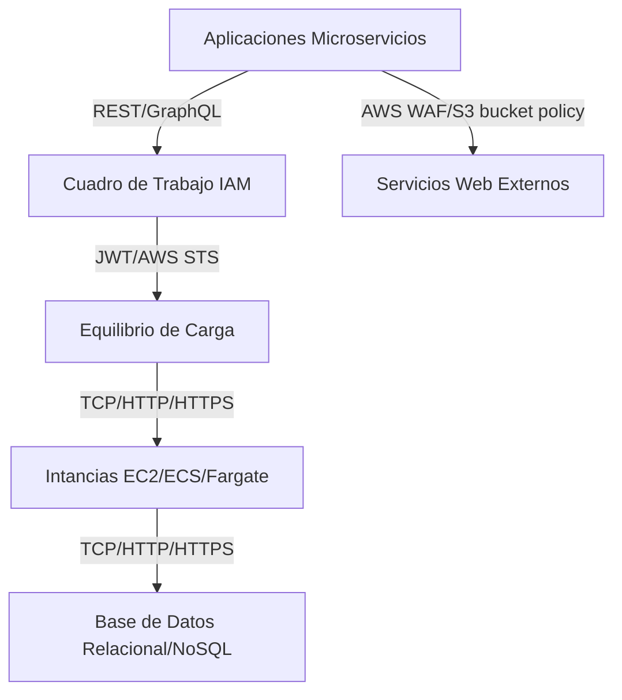

### Conclusiones

La automatización en seguridad ofensiva y auditoría es fundamental para mantener una postura segura continua. Implementar controles definidos como código permite a los equipos escalar de manera más segura, rápida y rentable. La integración de herramientas de auditoría y seguridad ofensiva en las etapas CI/CD garantiza que cualquier nueva implementación cumpla con estándares mínimos de seguridad.

Al seguir estos principios, se pueden alcanzar altos niveles de eficiencia operativa mientras se mantiene una postura de defensa en profundidad contra posibles amenazas.

## Tendencias Futuras en Ciberseguridad para Microservicios con Java

### Tendencias Futuras en Ciberseguridad para Microservicios con Java

En el campo de la ciberseguridad para microservicios con Java, las tendencias futuras están enfocadas en mejorar la seguridad y eficiencia a través del uso intensivo de tecnologías como Inteligencia Artificial (IA), Autenticación Multi-Factor (MFA) mejorada, y la gestión automatizada de riesgos. A continuación se detalla cómo estos avances pueden aplicarse al contexto de microservicios y Java 21.

#### Inteligencia Artificial en Seguridad

La IA tiene el potencial de revolucionar la ciberseguridad a través del análisis predictivo y proactivo, permitiendo sistemas más resistentes contra amenazas emergentes. En el ámbito de los microservicios con Java, se pueden implementar algoritmos de aprendizaje automático para monitorizar patrones de comportamiento anómalos en tiempo real.

**Ejemplo técnico:**

```java
public class AnomalyDetection {
    private MachineLearningModel model;

    public AnomalyDetection(MachineLearningModel model) {
        this.model = model;
    }

    public boolean isBehaviorAnomalous(Request request) {
        double prediction = model.predict(request.toFeatureVector());
        return prediction > 0.8; // Arbitrary threshold for anomaly detection
    }
}
```

#### Autenticación Multi-Factor (MFA)

La autenticación multi-facética proporciona una capa adicional de seguridad para los servicios, especialmente críticos en entornos distribuidos como microservicios. La implementación de MFA puede incluir la integración con proveedores de servicios externos o el desarrollo de mecanismos internos basados en tokens.

**Diagrama Mermaid:**
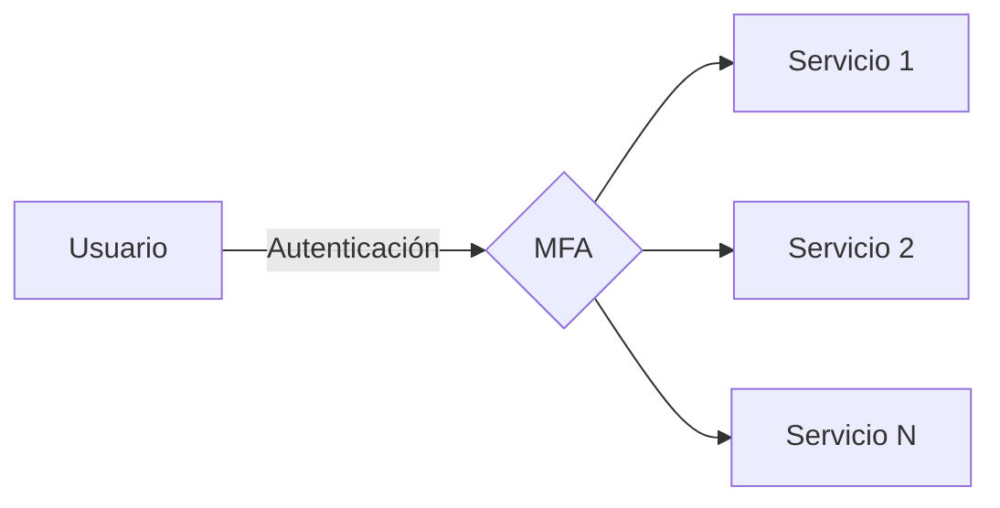

#### Gestión Automatizada de Riesgos

La gestión automatizada de riesgos permite la detección y respuesta rápida a amenazas, con el objetivo de minimizar los impactos en tiempo real. Esto puede ser implementado mediante la configuración de políticas de seguridad definidas por código (CSP) que se aplican automáticamente.

**Ejemplo técnico:**

```java
public class SecurityPolicy {
    private List<Rule> rules;

    public SecurityPolicy(List<Rule> rules) {
        this.rules = rules;
    }

    public boolean isRequestValid(Request request) {
        for(Rule rule : rules) {
            if(!rule.apply(request)) return false;
        }
        return true;
    }
}

public interface Rule {
    boolean apply(Request request);
}
```

#### Aplicación de la Seguridad en Todas las Capas

Al implementar seguridad en todas las capas, desde infraestructura hasta aplicaciones, se aseguran múltiples controles de seguridad que dificultan el acceso no autorizado. En Java 21 y microservicios, esto implica desde configuraciones de red seguras (como VPC) hasta validación fuerte de entrada en la aplicación.

#### Automatización de Prácticas Recomendadas

La automatización de las prácticas recomendadas es crucial para mantener sistemas de microservicios seguros y escalables. Se pueden utilizar herramientas como AWS Security Hub para monitorear automáticamente las configuraciones y aplicar correcciones automatizadas.

**Diagrama Mermaid:**
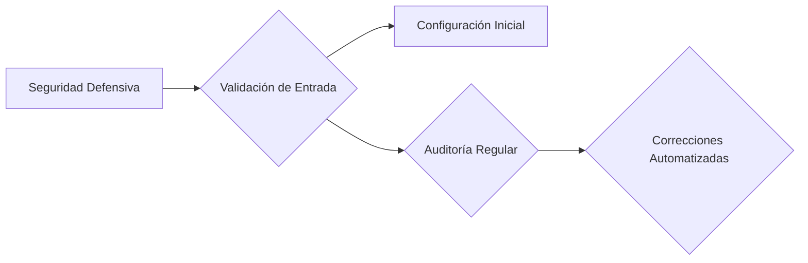

### Conclusión

La adopción y aplicación continua de estas tendencias en el desarrollo y mantenimiento de microservicios con Java son esenciales para mantener la confidencialidad, integridad y disponibilidad de datos. La innovación en ciberseguridad debe ir de la mano con las necesidades cambiantes del negocio y la tecnología.

Estos principios no solo mejoran la seguridad del sistema sino que también facilitan el cumplimiento normativo y la escalabilidad en entornos empresariales complejos.

## Guías de Implementación y Mejores Prácticas

### Guías de Implementación y Mejores Prácticas

#### Introducción
La implementación efectiva de medidas de seguridad ofensiva para microservicios en Java 21 requiere un enfoque multidimensional que incluya la aplicación de controles en todas las capas del sistema, desde la red periférica hasta el código fuente. A continuación se detallan guías y mejores prácticas recomendadas para garantizar una arquitectura segura y escalable.

#### 1. Implementación Defensiva
Aplicar un enfoque de defensa en profundidad implica la implementación de múltiples capas de seguridad que funcionen de manera coordinada. Esto incluye:

- **Capa Periférica:** Implemente firewalls, protecciones DDoS y servicios de DNS seguros.
- **Red Interna (VPC):** Configure redes virtuales privadas con segmentación adecuada para aislar recursos sensibles.
- **Equilibrio de Carga:** Utilice soluciones de equilibrio de carga que permitan la distribución balanceada del tráfico y proporcionen protección contra ataques.
- **Instancias y Servicios de Computación:** Implemente controles de seguridad en los niveles de instancia, como controladores de acceso IAM para limitar el acceso a las funciones específicas.

#### 2. Arquitectura de Microservicios Segura
La arquitectura orientada a microservicios debe ser diseñada con seguridad en mente desde la etapa inicial:

- **Seguridad del Código Fuente:** Asegúrese de que todas las aplicaciones incluyan validación robusta de entrada, cifrado de datos sensibles y protección contra inyección SQL/XSS.
- **Autenticación y Autorización:** Use protocolos estándar como OAuth2.0 para la autenticación y JWT (JSON Web Tokens) para el intercambio seguro de tokens entre microservicios.
- **Transparencia en Identidad:** Implemente mecanismos robustos para garantizar que las identidades se transfieren adecuadamente entre los microservicios, minimizando el riesgo de escalada de privilégios.

#### 3. Automatización de Prácticas Seguras
La automatización es crucial para mantener la seguridad a largo plazo en un entorno dinámico como el de microservicios:

- **Definición y Gestión del Código:** Utilice herramientas como Terraform, CloudFormation o AWS CDK para definir e implementar controles de seguridad de manera consistente.
- **Pruebas Automatizadas:** Implemente flujos de trabajo CI/CD que incluyan pruebas automatizadas de seguridad en cada despliegue.
- **Monitoreo y Alertas:** Configure sistemas de monitoreo para detectar actividades sospechosas o incidentes de seguridad y diseñe flujos de respuesta rápida.

#### 4. Auditoría y Pruebas
Auditorías periódicas son esenciales para mantener la integridad del sistema:

- **Pruebas Fuzzing:** Aplique pruebas fuzzing a nivel de red, de aplicación y de código fuente.
- **Evaluación de Vulnerabilidades:** Realice evaluaciones regulares utilizando herramientas como OWASP ZAP o Burp Suite para identificar posibles brechas en la seguridad.

#### Diagrama Mermaid
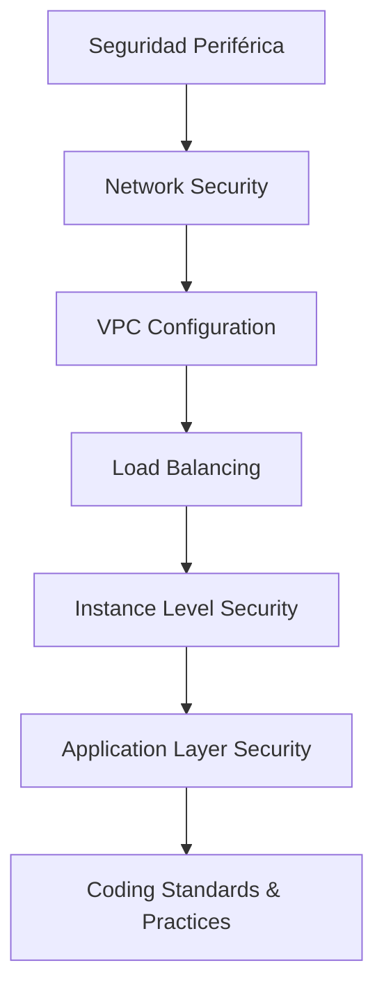

#### Conclusión
La seguridad ofensiva para microservicios en Java 21 no es solo una cuestión técnica, sino un compromiso continuo que involucra diseño arquitectónico robusto, prácticas de codificación seguras y automatización eficiente. A través del cumplimiento riguroso con estos principios guía, los equipos pueden garantizar la confidencialidad, integridad y disponibilidad de sus sistemas en un entorno cada vez más dinámico e incierto.

#### Recursos Adicionales
- Guías de Cumplimiento de AWS: https://aws.amazon.com/compliance/
- Documentación OWASP ZAP: https://owasp.org/www-project-zap/

## Anexo: Recursos Adicionales y Bibliografía

### Anexo: Recursos Adicionales y Bibliografía

Este anexo proporciona recursos adicionales y referencias bibliográficas para aquellos que desean profundizar en el tema de la seguridad ofensiva y auditoría de microservicios con Java 21. Los materiales abarcan desde guías detalladas sobre prácticas recomendadas hasta ejemplos de código y diagramas técnicos.

#### Recursos Adicionales

1. **Guías de Cumplimiento de AWS**:
   - [AWS Customer Compliance Guides](https://aws.amazon.com/compliance/)
   - Estos documentos proporcionan directrices detalladas sobre cómo cumplir con las regulaciones específicas, lo que es crucial para la implementación segura y efectiva de microservicios.

2. **Artefactos de Auditoría de AWS**:
   - [AWS Security Hub](https://aws.amazon.com/securityhub/)
   - Ofrece paneles de control personalizados para ayudar a los equipos a priorizar las investigaciones de seguridad e implementar controles efectivos.

3. **Documentación oficial de Java 21**:
   - [Oracle JDK Documentation for Java SE 21](https://www.oracle.com/java/technologies/javase/jdk21-relnotes.html)
   - Contiene detalles sobre las nuevas características y mejoras en seguridad implementadas en Java 21.

4. **Herramientas de Pruebas y Auditoría**:
   - [OWASP ZAP (Zed Attack Proxy)](https://owasp.org/www-project-zap/)
   - Una herramienta completa para probar la seguridad web, útil tanto para pruebas ofensivas como defensivas.
   
5. **Librerías de Seguridad en Java 21**:
   - [Spring Security](https://spring.io/projects/spring-security)
   - Proporciona un marco modular y flexible que permite implementar controles de seguridad complejos para aplicaciones Java.

#### Ejemplos de Códigos Técnicos

A continuación, se presenta un ejemplo de cómo aplicar la validación de entrada en una aplicación Java utilizando Spring Security:

```java
import org.springframework.security.access.prepost.PreAuthorize;
import org.springframework.web.bind.annotation.PostMapping;
import org.springframework.web.bind.annotation.RequestBody;
import org.springframework.web.bind.annotation.RestController;

@RestController
public class UserController {

    @PostMapping("/users")
    @PreAuthorize("hasRole('USER')")
    public UserResponse addUser(@RequestBody @Valid AddUserRequest request) {
        // Procesar la solicitud de adición del usuario aquí
        return new UserResponse();
    }
}
```

#### Diagramas Mermaid

**Diagrama de Flujo para Implementación Segura en Microservicios:**

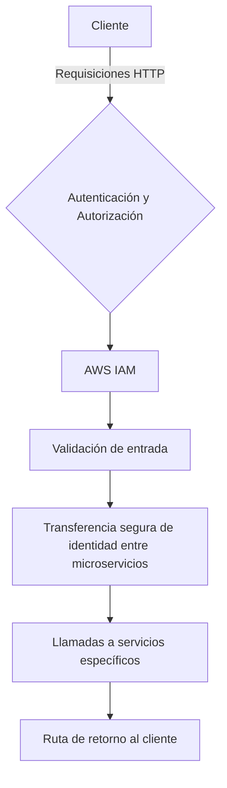

**Diagrama de Arquitectura para Defensa en Profundidad:**

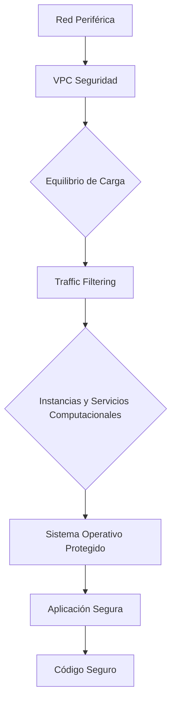

#### Referencias Bibliográficas

1. **Manning Publications**:
   - *Microservices Patterns* por Chris Richardson
   - Explora patrones comunes en el diseño y implementación de microservicios.

2. **O'Reilly Media**:
   - *Building Evolutionary Architectures: Support Constant Change* por Michael Nygard, Neal Ford, Rebecca Parsons, and Pat Kua
   - Proporciona estrategias para diseñar sistemas que puedan evolucionar rápidamente con el tiempo sin perder estabilidad.

3. **Cloud Security Alliance (CSA)**:
   - *The Cloud Controls Matrix (CCM)*
   - Una guía detallada sobre controles de seguridad recomendados para aplicaciones en la nube.

4. **OWASP**:
   - *Top 10 Project*
   - Lista anualmente los 10 riesgos más críticos que enfrentan las aplicaciones web y móviles hoy en día, proporcionando guías sobre cómo mitigarlos.

Estos recursos y referencias son esenciales para aquellos involucrados en la seguridad ofensiva y auditoría de microservicios con Java 21. Recuerde siempre mantenerse actualizado con las mejores prácticas y nuevas amenazas emergentes en el campo de la seguridad informática.

