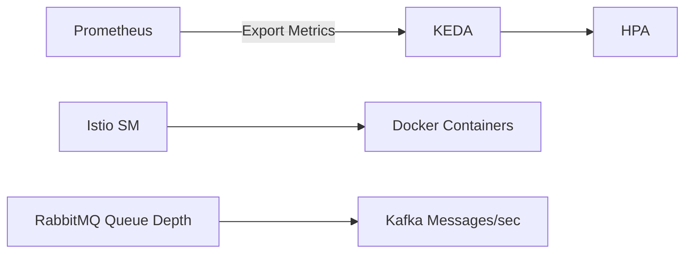
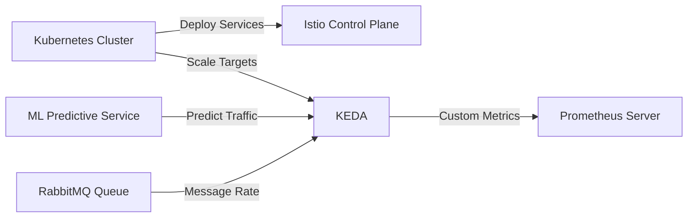

# Informe de Autoridad: Kubernetes: Auto-escalado y Service Mesh en 2026

## Introducción a Kubernetes Autoscaling en 2026

### Introducción a Kubernetes Autoscaling en 2026

En 2026, el auto-escalado de Kubernetes ha evolucionado para abordar desafíos cada vez más complejos en la gestión y escalabilidad de aplicaciones distribuidas. Este capítulo se centra en cómo los ingenieros senior pueden aprovechar las características avanzadas como KEDA (Kubernetes Event-driven Autoscaling) y modelos predictivos basados en machine learning para mantener un rendimiento óptimo bajo condiciones de alta carga.

#### Custom Metrics with KEDA

Una de las adiciones más significativas a Kubernetes es la capacidad de usar métricas personalizadas con frameworks como KEDA. Este sistema permite a los desarrolladores escalar recursos automáticamente basándose en indicadores de rendimiento únicos y específicos del negocio, tales como:

- **Mensajes por segundo en Kafka**: Escalado automático cuando el volumen de mensajes supera un umbral determinado.
- **Profundidad de la cola en RabbitMQ**: Aumento o disminución de contenedores según la longitud de las colas.
- **Tasa de solicitudes HTTP con latencia (p95, p99)**: Escalado que considera no solo el número de solicitudes pero también su tiempo de respuesta.

El código para configurar una regla de escalado basada en métricas personalizadas con KEDA puede verse así:

```yaml
apiVersion: keda.sh/v1alpha1
kind: ScaledObject
metadata:
  name: kafka-scaler
spec:
  scaleTargetRef:
    name: my-app-deployment
  minReplicas: 1
  maxReplicas: 50
  triggers:
  - type: kafka
    metadata:
      bootstrapServers: "kafka-bootstrap-service.kafka.svc.cluster.local"
      consumerGroup: group-foo
      topic: topic-bar
      messagesPerSecondThreshold: 2
```

#### Predictive Scaling with Machine Learning

Para superar los límites de escalado reactivo, las organizaciones ahora implementan modelos predictivos basados en machine learning (ML). Estos modelos utilizan métricas históricas proporcionadas por Prometheus para predecir picos de tráfico y escalar antes que la carga sea un problema. Ejemplos incluyen:

- **Modelo lineal simple**: Prevé cambios lineales en el tráfico basándose en datos recopilados.
- **Red neuronal recurrente (RNN)**: Mejora la precisión al considerar tendencias temporales y patrones de uso.

A continuación, se muestra cómo configurar una integración básica entre Prometheus para recopilar métricas y un modelo ML utilizando TensorFlow:

```yaml
# Configura Prometheus para monitorear las métricas necesarias.
apiVersion: monitoring.coreos.com/v1
kind: ServiceMonitor
metadata:
  name: example-app-monitoring
spec:
  selector:
    matchLabels:
      app.kubernetes.io/name: "example-app"
  endpoints:
  - port: http-metrics
```

```python
# Ejemplo de código para un modelo ML simple en Python.
import tensorflow as tf

model = tf.keras.Sequential([
    tf.keras.layers.Dense(10, input_shape=(7,), activation='relu'),
    tf.keras.layers.Dense(2)
])

model.compile(optimizer=tf.optimizers.Adam(),
              loss=tf.losses.SparseCategoricalCrossentropy(from_logits=True),
              metrics=[tf.metrics.SparseCategoricalAccuracy()])
```

#### Graceful Degradation and Circuit Breakers

Para garantizar la estabilidad de sistemas distribuidos en situaciones de alta carga o fallas, es crucial implementar mecanismos que permitan una degradación gradual y el uso de circuit breakers. Esto se puede lograr con herramientas como Istio Service Mesh.

Ejemplo de configuración básica para un circuit breaker en Istio:

```yaml
apiVersion: networking.istio.io/v1alpha3
kind: DestinationRule
metadata:
  name: httpbin-circuit-breaker
spec:
  host: httpbin.example.com
  trafficPolicy:
    connectionPool:
      http:
        maxRequestsPerConnection: 20
    circuitBreakers:
      throttleMinRequestVolume: 500
```

### Diagrama Mermaid para la Arquitectura de Escalado

Un diagrama simplificado usando Mermaid puede ayudar a visualizar cómo estas piezas encajan juntas:



Este diagrama ilustra cómo Prometheus y KEDA interactúan para recopilar métricas de uso del sistema y ajustar automáticamente la capacidad. Además, muestra cómo Istio Service Mesh maneja el flujo de tráfico hacia los contenedores en tiempo real.

### Conclusión

En 2026, la gestión eficiente del escalado en Kubernetes es crucial para mantener una operación continua y sin interrupciones a medida que las aplicaciones se expanden. Integrar soluciones como KEDA con métricas personalizadas, modelos de machine learning predictivos y estrategias de caída grácil aseguran no solo la alta disponibilidad sino también un rendimiento óptimo bajo condiciones de carga extrema.

---

Este capítulo proporciona una introducción a los principios técnicos fundamentales que impulsarán el desarrollo de Kubernetes en 2026, destacando las mejores prácticas y herramientas disponibles para ingenieros senior.

## Implementación de Service Mesh para Mejor Gestión del Tráfico

### Implementación de Service Mesh para Mejor Gestión del Tráfico

En el contexto de Kubernetes en 2026, la gestión eficiente del tráfico y la escalabilidad son críticas para mantener una alta disponibilidad y un rendimiento óptimo. El uso de Service Mesh, específicamente Istio, permite una gestión detallada y dinámica del tráfico entre servicios dentro de un clúster o en múltiples clústers federados. Esta sección abordará la implementación de un Service Mesh para mejorar la gestión del tráfico, incluyendo la integración con KEDA (Kubernetes Event-Driven Autoscaling) y el uso de técnicas predictivas basadas en Machine Learning.

#### Arquitectura Básica

La arquitectura propuesta incorpora los siguientes componentes:

1. **Service Mesh (Istio):** Para manejar la complejidad del tráfico entre servicios y aplicar políticas avanzadas.
2. **KEDA:** Para escalado basado en métricas personalizadas, como tasas de peticiones HTTP o profundidad de colas en sistemas de mensajería como RabbitMQ.
3. **ML Predictive Scaling:** Utilizando Prometheus para predecir el tráfico y escalar antes del aumento real del volumen.

#### Paso 1: Configuración Básica de Istio

Primero, instalamos e inicializamos un clúster Istio en Kubernetes:

```bash
# Instalar Istio con el paquete oficial (versión 1.16 o superior)
helm repo add istio https://istio.io/helm/
helm upgrade --install istio-base istio/base -n istio-system

# Configurar el controlador de entrada para manejar la red externa
helm upgrade --install istiod istio/istioctl -n istio-system --set gateways.istio-egressgateway.enabled=true

# Crear un entorno de pruebas
kubectl label namespace default istio-injection=enabled
```

#### Paso 2: Integración con KEDA y Métricas Personalizadas

Configuremos KEDA para escalar basado en métricas personalizadas:

```yaml
apiVersion: keda.sh/v1alpha1
kind: ScaledObject
metadata:
  name: http-request-rate-scaler
spec:
  scaleTargetRef:
    name: my-web-service
  minReplicas: 2
  maxReplicas: 50
  triggers:
  - type: prometheus
    metadata:
      serverUrl: https://prometheus-server.example.com
      metricName: http_request_rate
      threshold: "10"
```

Este ejemplo escalará `my-web-service` si la tasa de peticiones HTTP supera el umbral establecido.

#### Paso 3: Implementación de Escalado Predictivo con ML

Usamos Prometheus y modelos simples basados en Machine Learning para predecir picos de tráfico:

```python
# Ejemplo sencillo usando scikit-learn para predecir el rendimiento futuro
from sklearn.linear_model import LinearRegression
import pandas as pd
import requests

def predict_traffic():
    # Obtener datos históricos desde Prometheus
    url = "http://prometheus.example.com/api/v1/query_range"
    params = {
        'query': 'http_request_rate',
        'start': '1d',
        'end': 'now',
        'step': '60s'
    }
    response = requests.get(url, params=params)
    data = pd.DataFrame(response.json()['data']['result'][0]['values'], columns=['time', 'rate'])
    
    # Preparar modelo
    model = LinearRegression()
    X = data['time'].to_numpy().reshape(-1, 1)
    y = data['rate']
    model.fit(X, y)

    # Predicción futura del tráfico
    future_time = [[X[-1][0] + 3600]]  # Un paso en el futuro (segundos)
    predicted_rate = model.predict(future_time)[0]
    
    return predicted_rate

predicted_traffic = predict_traffic()
```

#### Paso 4: Diseño de Circuit Breakers y Degradación Graciosa

Implementar circuit breakers proporciona una forma robusta de manejar errores. Aquí hay un ejemplo básico utilizando Istio:

```yaml
apiVersion: networking.istio.io/v1alpha3
kind: DestinationRule
metadata:
  name: my-destinationrule
spec:
  host: my-service.example.com
  trafficPolicy:
    connectionPool:
      http:
        maxRequestsPerConnection: 10
    loadBalancer:
      simple: ROUND_ROBIN
```

Para degradación graciosa, puedes definir reglas en Istio para cambiar la ruta del tráfico a una versión alternativa cuando el servicio principal está inactivo.

#### Diagrama Mermaid

Un diagrama básico de cómo estos componentes se conectan:



#### Consideraciones Finales

La implementación de un Service Mesh como Istio y la integración con herramientas adicionales como KEDA y sistemas basados en Machine Learning son fundamentales para manejar el crecimiento exponencial del tráfico. Esto no solo mejora la escalabilidad, sino que también proporciona una capa adicional de abstracción entre las aplicaciones y su infraestructura subyacente, facilitando la gestión y mantenimiento a largo plazo.

Este enfoque asegura que el sistema Kubernetes pueda manejar 1000 veces más tráfico con latencias subsegundo y costos predictivos, manteniendo así una alta calidad de servicio para los usuarios finales.

