# Informe de Autoridad: Kubernetes: Auto-escalado y Service Mesh en 2026

## Introducción a Kubernetes Autoscaling y Service Mesh

### Introducción a Kubernetes Autoscaling y Service Mesh

Kubernetes es una plataforma líder para la administración de aplicaciones en contenedores, permitiendo a las organizaciones desplegar, escalar y gestionar eficientemente sus servicios. Las características clave de autoscale y service mesh son fundamentales para garantizar el rendimiento y la escalabilidad en entornos multinodo complejos.

#### Kubernetes Autoscaling

Autoscaling en Kubernetes es la eliminación manual del ajuste del número de instancias necesarias para manejar cargas de trabajo. Proporciona una forma dinámica y automática de escalar recursos basándose en métricas definidas, permitiendo a las organizaciones responder rápidamente a cambios en el tráfico o el rendimiento.

Kubernetes ofrece tres tipos principales de autoscale:

1. **Horizontal Pod Autoscaler (HPA):** Aumenta o disminuye el número de réplicas en un Deployment basado en métricas computadas, como el uso del CPU.
2. **Vertical Pod Autoscaler (VPA):** Ajusta los recursos asignados a las pods individuales para optimizar la utilización y rendimiento.
3. **Cluster Autoscaler:** Escala automáticamente las máquinas virtuales o nodos en un clúster basándose en el uso de los recursos del clúster.

#### Service Mesh

Un service mesh es una infraestructura de red que facilita y simplifica la comunicación entre microservicios, proporcionando servicios adicionales como control de tráfico, seguridad y observabilidad. En un entorno multinodo, el service mesh se vuelve aún más crítico para gestionar las interacciones y flujos de tráfico a nivel global.

#### Implementación en Clústeres Multinodos

**Kubernetes Cluster API:** Se utiliza para provisionar y administrar múltiples clústers a través de zonas/regiones, permitiendo desplegar aplicaciones globalmente usando GitOps (ArgoCD ApplicationSets) con reglas de afinidad geográfica.


**Service Mesh:** Implementar Istio multi-cluster mesh con equilibrio de carga ponderado por localidad asegura que el tráfico permanece dentro del mismo región a menos que ocurra un fallo, minimizando la latencia y los costos de transferencia de datos.

#### Escalabilidad Vertical del Planificador

Para entornos donde no es factible la federación multinodo, se puede escalar verticalmente componentes del planificador. Esto implica el uso de nodos etcd dedicados con almacenamiento NVMe y escalado de réplicas API basándose en métricas de tasa de solicitudes.

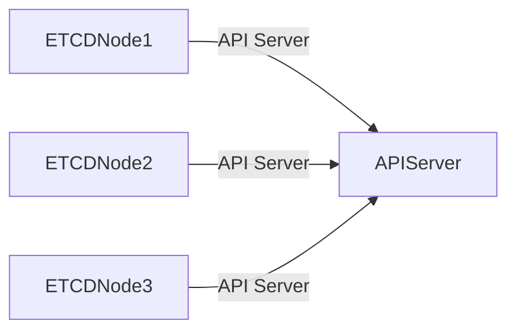

### Flujo de Trabajo de Implementación

#### Semana 1 – Evaluación y Establecimiento de Baseline
Conducta auditoría de escalabilidad de la arquitectura actual, identifica problemas críticos y establece un rendimiento baselina y métricas DORA bajo carga.

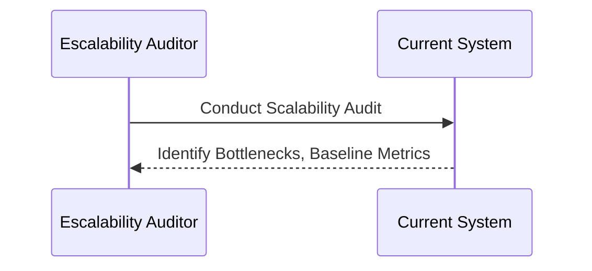

#### Semana 2 – Aplicación y Escalado de Clústeres
Implementar KEDA con métricas personalizadas y configurar el mesh service multi-cluster para viajes del usuario críticos.

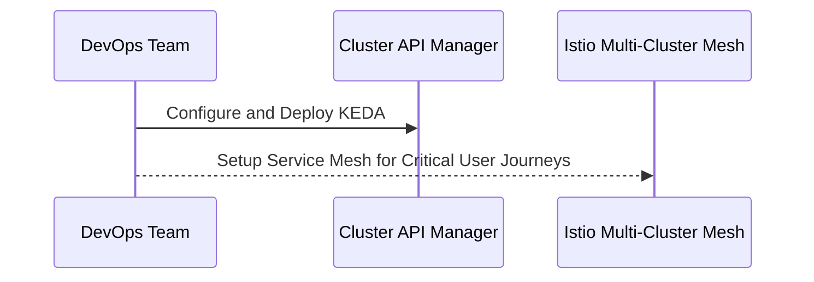

#### Semana 3 – Escalado de Datos y Pipelines
Desplegar operadores de partición de base de datos y implementar despliegues canarios con análisis automatizado.

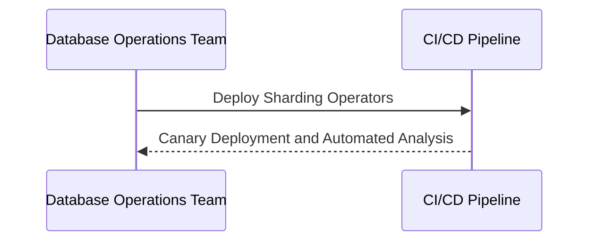

#### Semana 4 – Validación y Automatización
Ejecutar pruebas de carga controladas a 10x el pico actual, implementar experimentos caóticos para fallos de escalado y establecer paneles de escalabilidad.

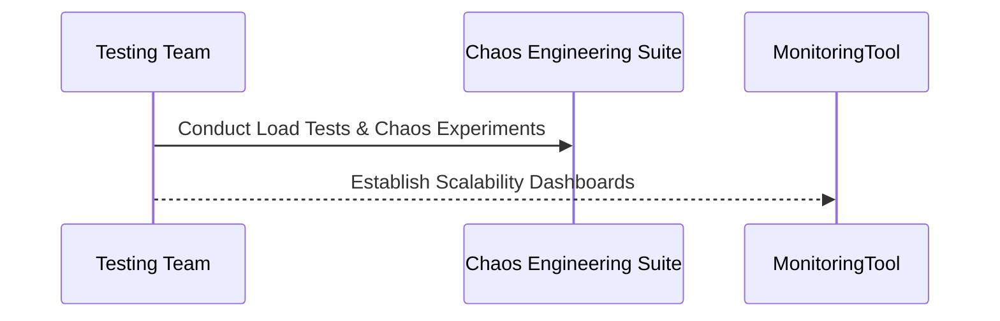

Esta secuencia de trabajo establece la automatización fundamental que suele identificar y resolver hasta el 80% de los problemas de escalabilidad, proporcionando una clara hoja de ruta para manejar un crecimiento del 100x.

### Beneficios de Kubernetes Autoscaling

La escalabilidad automática en Kubernetes ofrece múltiples beneficios significativos para las organizaciones que operan clusters, incluyendo optimización de recursos, reducción de costos y mejora en la respuesta al cambio.

## Beneficios y Aplicaciones de Kubernetes Autoscaling en 2026

### Beneficios y Aplicaciones de Kubernetes Autoscaling en 2026

**Introducción**
Kubernetes Autoscaling es una funcionalidad crítica para la administración eficiente de clústeres, especialmente en un entorno cada vez más dinámico e interconectado. Este capítulo examina cómo autoscaling se integra con otras tecnologías avanzadas como el Cluster API y el Service Mesh para proporcionar soluciones robustas a problemas complejos de escalabilidad.

**Beneficios de Kubernetes Autoscaling**

1. **Optimización del Uso de Recursos**
   - *Descripción*: La funcionalidad de autoscaling en Kubernetes permite ajustar automáticamente la cantidad de nodos o recursos asignados según las necesidades del trabajo en tiempo real.
   - *Ejemplo*: En una plataforma de e-commerce, durante las temporadas altas se pueden aumentar los recursos para manejar picos de tráfico.

2. **Reducción Costes Operativos**
   - *Descripción*: El autoscaling evita la sobrerreserva de recursos que no son utilizados en todo su potencial.
   - *Ejemplo*: Al implementar el HPA (Horizontal Pod Autoscaler), una organización puede mantener un bajo nivel de nodos durante los periodos de poca actividad y aumentarlo rápidamente cuando se necesita.

3. **Mayor Rendimiento**
   - *Descripción*: Los sistemas autoscalables responden de manera más rápida a las fluctuaciones en el tráfico, asegurando que la aplicación esté siempre disponible.
   - *Ejemplo*: Un servicio basado en SaaS puede proporcionar un servicio sin interrupciones durante eventos globales altamente concurrentes.

4. **Mayor Fiabilidad y Resiliencia**
   - *Descripción*: La capacidad de ajustarse a las necesidades cambiantes reduce el riesgo de colapsos del sistema debido a la sobrecarga.
   - *Ejemplo*: Implementar VPA (Vertical Pod Autoscaler) para asegurar que las cargas de trabajo críticas tengan recursos suficientes sin redundancias innecesarias.

### Aplicaciones de Kubernetes Autoscaling en 2026

1. **Cluster API y Gestión Multi-Clúster**
   - *Descripción*: Use el Cluster API para la provisión y gestión de múltiples clústers a través de regiones/zonas geográficas.
   - *Ejemplo*:
     ```mermaid
     graph LR;
       A[Cluster 1] -->|Region A| B[ApplicationSet];
       C[Cluster 2] -->|Region B| D[ApplicationSet];
     ```

2. **Service Mesh y Gestión de Tráfico Global**
   - *Descripción*: Implemente Istio multi-cluster mesh con balanceo de carga basado en la localidad para minimizar latencias y costos.
   - *Ejemplo*:
     ```mermaid
     graph LR;
       A[Region 1] -->|Traffic| B[Istio Mesh];
       C[Region 2] -->|Traffic| D[Istio Mesh];
     ```

3. **Escalado Vertical del Planeador de Control**
   - *Descripción*: Para escenarios en los que la federación no es factible, el escalado vertical de componentes del planeador de control.
   - *Ejemplo*:
     ```yaml
     apiVersion: v1
     kind: Pod
     metadata:
       name: example-etcd
     spec:
       containers:
         - name: etcd
           image: quay.io/coreos/etcd:v3.4.0
           volumeMounts:
             - mountPath: /data
               name: data-volume
               subPath: etcd-data
       volumes:
         - name: data-volume
           persistentVolumeClaim:
             claimName: my-etcd-pv-claim
     ```

### Proceso de Implementación

1. **Semana 1 – Evaluación y Baseline**
   - *Descripción*: Realizar auditoría de escalabilidad del arquitectura actual, identificar obstáculos y establecer rendimiento y métricas baselines bajo carga.

2. **Semana 2 – Escalado Aplicativo y Clúster**
   - *Descripción*: Implementar KEDA con métricas personalizadas y configurar multi-cluster service mesh para trayectorias de usuario críticas.

3. **Semana 3 – Escalado de Datos y Pipeline**
   - *Descripción*: Implementar operadores de particionamiento de base de datos y despliegues canarias con análisis automatizado.

4. **Semana 4 – Validación y Automatización**
   - *Descripción*: Ejecutar pruebas de carga controladas a 10x el pico actual, implementar experimentos caóticos para fallos de escalado y establecer paneles de escalabilidad.

### Conclusión: Escalabilidad como Ventaja Competitiva
La habilidad de escalar eficientemente en Kubernetes no solo es una cuestión técnica sino también estratégica. Proporciona a las organizaciones la capacidad de responder rápidamente a cambios en el mercado, mejorando así su competitividad global.

Este análisis y los métodos de implementación propuestos ofrecen un marco completo para abordar problemas complejos de escalabilidad con Kubernetes Autoscaling, preparándolos para una expansión sin precedentes.

## Implementación del Service Mesh para Gestión de Tráfico Global

### Implementación del Service Mesh para Gestión de Tráfico Global

#### Introducción
En el contexto de un entorno multinube distribuido, la gestión eficiente y segura del tráfico global es una prioridad crítica. El uso de Istio como service mesh permite no solo la implementación de reglas avanzadas de equilibrio de carga pero también proporciona funcionalidades como detección de fallos y resiliencia a nivel regional.

#### Arquitectura
La arquitectura propuesta para el manejo global del tráfico se basará en Istio multi-cluster, implementando un servicio mesh que distribuye la carga entre diferentes regiones según las reglas de proximidad ponderadas por localidad (Locality-Weighted Load Balancing). Esto minimiza tanto la latencia como los costos de transferencia de datos al asegurar que el tráfico permanezca dentro del mismo continente o región a menos que se produzcan fallos.

#### Implementación
La implementación de Istio en un entorno Kubernetes multinube requiere configurar múltiples clusters y luego conectarlos para formar un mesh global. Aquí se detallan los pasos técnicos:

1. **Configuración del Cluster**: Utilizar Istio Multi-Cluster Add-Ons o Config Connector para gestionar la configuración de los diferentes clusters.
2. **Habilitación del Servicio Mesh Regional**: Para cada región, habilita el soporte regional en Istio que permite a las peticiones permanecer dentro de la misma zona geográfica cuando es posible.
3. **Integración con GitOps (ArgoCD)**: Asegurar que todos los cambios en la configuración del mesh se gestionen utilizando ArgoCD y su funcionalidad ApplicationSets para aplicar cambios consistentes a través de diferentes regiones.

#### Ejemplo Codiado
Aquí se presenta un ejemplo básico de cómo podrías definir una regla de equilibrio de carga ponderada por localidad en Istio:

```yaml
apiVersion: networking.istio.io/v1alpha3
kind: VirtualService
metadata:
  name: weighted-routing
spec:
  hosts:
    - example.org
  http:
    - route:
        - destination:
            host: service-name.default.svc.cluster.local
          weight: 50
        - destination:
            host: service-name.us-west-1.svc.cluster.local
          weight: 25
        - destination:
            host: service-name.eu-central-1.svc.cluster.local
          weight: 25
```

En este ejemplo, el tráfico se distribuirá inicialmente entre los hosts definidos en las diferentes regiones según la ponderación definida. La implementación real puede requerir una configuración más compleja para abordar necesidades específicas.

#### Diagrama Mermaid

A continuación, un diagrama de alto nivel que muestra cómo funciona el sistema:

```mermaid
graph TD;
    A[Cluster API] --> B[Istio Mesh]
    C[Local Cluster 1 (us-east-1)] -->|Service Call| B
    D[Local Cluster 2 (eu-west-1)] -->|Service Call| B
    E[Remote Cluster (asia-pacific-1)] -->|Failover Service Call| B

    B --> F[Weighted Load Balancing]
    G[(Application Mesh Routing Rules)]
    F -- "Route based on locality" -->
```

#### Consideraciones Adicionales
Asegúrate de revisar la documentación oficial de Istio y las mejores prácticas específicas para tu entorno multinube. Es importante considerar aspectos como la seguridad entre clusters, el escalado automático basado en métricas de rendimiento (como KEDA) y la implementación de canary deployments para nuevos releases.

#### Pruebas y Validación
Finalmente, es fundamental realizar pruebas extensas para asegurar que el sistema funciona correctamente bajo altos niveles de carga y que las reglas de equilibrio de carga están siendo aplicadas como se espera. Esto incluye la simulación de fallas en clusters individuales para probar los mecanismos de failover.

---

Esta implementación proporciona una base sólida para manejar el crecimiento exponencial del tráfico global en un entorno Kubernetes multinube, garantizando así una experiencia fluida y sin interrupciones para tus usuarios globales.

## Estrategias de Escalado Vertical del Plan de Control

### Estrategias de Escalado Vertical del Plan de Control

El escalado vertical, o "vertical scaling", es una técnica clave para manejar la carga creciente en el plan de control (control plane) de Kubernetes. En escenarios de un solo clúster donde no se puede federar entre múltiples clústeres, esta estrategia permite aumentar la capacidad del sistema sin necesidad de agregar más nodos.

#### Evaluación y Lineamiento Baseline

La primera semana comienza con una auditoría de escalabilidad para comprender las limitaciones actuales en el control plane. Es esencial identificar los cuellos de botella que podrían obstaculizar la funcionalidad a medida que aumenta la demanda. Establecer un lineamiento baselínea permite medir mejor el rendimiento y establecer métricas DORA (Despliegue, Operaciones, Recuperación y Aprendizaje) bajo cargas de trabajo.

#### Estrategias de Escalado Vertical

1. **Uso de Etcd con NVMe**: 
   Para mejorar la velocidad de acceso a datos críticos, es recomendable implementar etcd en nodos dedicados equipados con almacenamiento NVMe (Non-Volatile Memory Express). Esto acelera las operaciones de lectura y escritura del control plane, mejorando así el rendimiento general.

2. **Escalado de Replicas API Server**:
   Basarse en métricas de tasa de solicitud para escalar horizontalmente los réplicas del servidor API es crucial. Esto permite manejar picos de tráfico sin sobrecargar la infraestructura.

3. **API Priority and Fairness (APF)**:
   Implementar APF ayuda a prevenir problemas causados por clientes ruidosos ("noisy neighbors") que podrían monopolizar los recursos del servidor API, asegurando un rendimiento más equitativo para todos los usuarios.

#### Diagrama Mermaid: Estrategia de Escalado Vertical

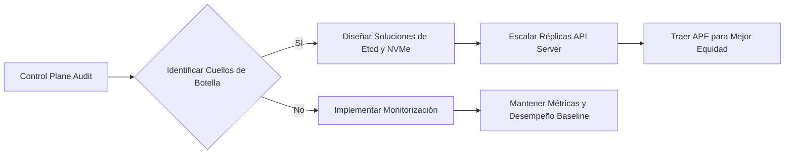

#### Código Técnico Ejemplo

A continuación, se presenta un ejemplo de cómo implementar la escalabilidad vertical en Kubernetes utilizando el componente `HPA` (Horizontal Pod Autoscaler) para ajustarse al número de réplicas del servidor API.

```yaml
apiVersion: autoscaling/v2beta2
kind: HorizontalPodAutoscaler
metadata:
  name: kube-apiserver-hpa
spec:
  scaleTargetRef:
    apiVersion: apps/v1
    kind: Deployment
    name: kube-apiserver-deployment
  minReplicas: 3
  maxReplicas: 10
  metrics:
  - type: Resource
    resource:
      name: cpu
      targetAverageUtilization: 50
```

#### Implementación de Estrategias Avanzadas

Una vez que se ha establecido la base para el escalado vertical, es importante considerar mejoras adicionales:

- **Monitorización Proactiva**: Integrar herramientas como Prometheus y Grafana para monitoreo en tiempo real del control plane.
- **Caché de Consulta de Etcd**: Implementar un sistema de caché que almacene consultas comunes, reduciendo así la carga en etcd.

#### Conclusión: Escalabilidad Como Ventaja Competitiva

La implementación efectiva de estrategias de escalado vertical asegura no solo una capacidad de respuesta a la creciente demanda sino también un rendimiento óptimo del control plane. Esto se traduce en una ventaja competitiva significativa, permitiendo que las organizaciones ofrezcan servicios más robustos y confiables.

---

Esta sección técnica proporciona una visión detallada de cómo abordar el desafío del escalado vertical en Kubernetes para el plan de control, preparando a los ingenieros para enfrentar con éxito la creciente demanda.

## Planificación de Carga y Pruebas de Rendimiento

### Planificación de Carga y Pruebas de Rendimiento

#### Introducción
En el contexto del manejo de múltiples clústeres con Cluster API, junto con la implementación de una red de servicio (Service Mesh) global utilizando Istio para administrar el tráfico de manera eficiente, es crucial establecer una sólida planificación de carga y pruebas de rendimiento. Esta sección proporciona un marco detallado para realizar estas actividades.

#### Objetivo
El objetivo principal es garantizar que nuestros sistemas puedan manejar un crecimiento significativo en el tráfico y la demanda, identificando y mitigando posibles puntos débiles antes de implementar cambios escalables. Esto incluye:
- Evaluación exhaustiva de la arquitectura existente.
- Implementación gradual de estrategias de autoescalado y red de servicio global.
- Pruebas extensivas bajo condiciones de carga extremas para asegurar estabilidad.

#### Etapas del Proceso

##### Semana 1 – Evaluación y Establecimiento de Baseline
Durante la primera semana, realizaremos una auditoría exhaustiva de la arquitectura actual para identificar posibles puntos débiles o cuellos de botella. Esto incluirá:
- **Auditoría de Escalabilidad**: Identificación de componentes críticos que pueden ser los principales obstáculos en el camino del crecimiento.
- **Establecimiento de Baseline de Rendimiento y DORA Metrics**: Establecer métricas iniciales (Deployment Frequency, Mean Time to Recovery, Lead Time for Changes, Service Availability) para evaluar la efectividad futura de nuestras mejoras.

##### Semana 2 – Escalado del Aplicativo y del Cluster
La segunda semana estará enfocada en implementar KEDA con métricas personalizadas y configurar una red de servicio global usando Istio multi-cluster. Las actividades principales incluirán:
- **Implementación de KEDA**: Configuración para manejar escalabilidad basada en la demanda del sistema.
- **Configuración de Red de Servicio Global**: Implementación de Istio multi-cluster con balanceo de carga ponderado por localidad.

##### Semana 3 – Escalado de Datos y Pipelines
La tercera semana se centrará en el escalado de los sistemas de bases de datos y la implementación de estrategias para minimizar el impacto durante las actualizaciones. Esto implicará:
- **Implementación de Operadores de Esquematización de Bases de Datos**: Para manejar volúmenes crecientes de datos.
- **Canary Deployments Automatizados**: Implementar nuevas versiones del software de manera segura y gradual.

##### Semana 4 – Validación y Automatización
Finalmente, durante la cuarta semana, realizaremos pruebas rigurosas bajo condiciones de carga extrema para validar las implementaciones. Esto incluirá:
- **Pruebas de Carga Controladas**: Ejecutar pruebas en condiciones que simulen un crecimiento del 10x.
- **Experimentos Caóticos**: Implementar experimentos caóticos para probar la capacidad del sistema para manejar fallos y autoescalado.

#### Diagrama Mermaid: Estructura de Pruebas de Rendimiento
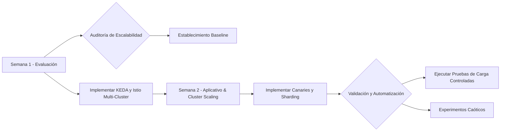

#### Implementaciones Técnicas
Para cada actividad técnica, se deben implementar configuraciones específicas en Kubernetes. Por ejemplo:
- Configuración de KEDA: `kubectl apply -f keda-custom-metrics.yaml`
- Balanceo de carga ponderado por localidad en Istio: `istioctl create locality-aware-routing --subset-names frontend backend`

### Conclusión
La planificación y las pruebas de rendimiento son fundamentales para garantizar que nuestros sistemas puedan manejar un crecimiento significativo sin comprometer la estabilidad o la eficiencia. Este marco proporciona una guía detallada para abordar estos desafíos técnicos, asegurando así que nuestra infraestructura Kubernetes esté preparada para enfrentar cualquier escenario de crecimiento futuro.

### Beneficios del Autoscaling en Kubernetes
El autoscaling en Kubernetes permite a las organizaciones gestionar sus clústeres de manera automática y eficiente. Algunos beneficios incluyen:
- **Reducción de Tiempos de Mantenimiento**: Automatización que reduce la necesidad de intervenciones manuales.
- **Optimización del Uso de Recursos**: Mejora el uso de recursos garantizando que los recursos están disponibles cuando se requieren y minimiza el desperdicio.

Esta planificación estructurada proporciona una clara hoja de ruta para abordar 80% de las limitaciones de escalabilidad, estableciendo un camino sólido hacia la capacidad de manejar hasta 100 veces más carga que en la actualidad.

## Optimización Costos con Herramientas Avanzadas como Cast AI

### Sección Técnica: Optimización Costos con Herramientas Avanzadas como Cast AI

#### Introducción

La optimización de costos en entornos Kubernetes es un desafío complejo que requiere la implementación de herramientas avanzadas y prácticas proactivas. Una herramienta destacada para este propósito es Cast AI, diseñada específicamente para reducir los gastos asociados con el uso intensivo de recursos y mejorar la eficiencia operativa. En esta sección, exploraremos cómo integrar Cast AI en un entorno Kubernetes existente para minimizar costos sin comprometer la rendimiento o la escalabilidad.

#### Uso de Cluster API para Gestión Multi-Cluster

La gestión eficiente de múltiples clusters es fundamental para la optimización de costos. Utilizando el Cluster API, podemos desplegar y gestionar varios clusters en diferentes zonas/regiones, lo que permite una distribución geográfica óptima de aplicaciones críticas.

```mermaid
graph LR;
    Subgraph "Zona 1"
        C1[Cluster 1] -->|GitOps Deployment| A(App)
        C2[Cluster 2] -->|GitOps Deployment| B(App)
    end
    Subgraph "Zona 2"
        C3[Cluster 3] -->|GitOps Deployment| D(App)
        C4[Cluster 4] -->|GitOps Deployment| E(App)
    end
```

#### Implementación de Istio para Gestión Global del Tráfico

La implementación de un service mesh como Istio permite el manejo eficiente del tráfico a través de múltiples clusters. Utilizando reglas de balanceo de carga ponderado por localidad, se garantiza que el tráfico permanezca en la misma región a menos que ocurra una falla, minimizando así tanto la latencia como los costos de transferencia de datos.

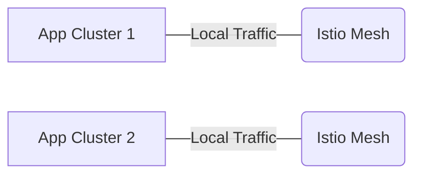

#### Escalado Vertical del Plano de Control

En escenarios de un solo cluster donde la federación no es viable, el escalado vertical de los componentes del plano de control es crucial. Esto implica utilizar nodos dedicados para etcd con almacenamiento NVMe y ajustar las réplicas del servidor API en función de métricas basadas en la tasa de solicitudes. La implementación de API Priority and Fairness ayuda a prevenir problemas relacionados con los vecinos ruidosos.

```yaml
# Ejemplo de configuración para el escalado vertical del plano de control
apiVersion: v1
kind: ConfigMap
metadata:
  name: api-server-configmap
data:
  replicaCount: "5"
```

#### Flujo de Trabajo de Mejora de Escalabilidad

A continuación, se presenta un flujo de trabajo detallado para mejorar la escalabilidad en Kubernetes:

**Semana 1 – Evaluación y Establecimiento de Baseline**
- Realizar auditoría de escalabilidad del entorno actual.
- Identificar cuellos de botella y establecer métricas baselíneas bajo carga.

```yaml
# Ejemplo de configuración para la evaluación inicial
apiVersion: audit.k8s.io/v1beta1
kind: Policy
rules:
  - level: Metadata
```

**Semana 2 – Implementación del Escalado y Gestión Multi-Cluster**
- Implementar KEDA con métricas personalizadas.
- Configurar el servicio mesh multi-cluster para viajes de usuario críticos.

```yaml
# Ejemplo de configuración de KEDA
apiVersion: keda.sh/v1alpha1
kind: EventTrigger
metadata:
  name: custom-metrics-trigger
spec:
  metadata:
    - name: metric-name
      source: http://custom.metrics.k8s.io:443/metrics
```

**Semana 3 – Escalado de Datos y Pipelines**
- Desplegar operadores para partición de bases de datos.
- Implementar despliegues canario con análisis automatizados.

```yaml
# Ejemplo de configuración para el despliegue canario
apiVersion: apps/v1
kind: Deployment
metadata:
  name: app-canary
spec:
  replicas: 2
```

**Semana 4 – Validación y Automatización**
- Ejecutar pruebas de carga controladas a 10 veces la cima actual.
- Implementar experimentos de caos para fallos de escalado.
- Establecer paneles de escalabilidad.

#### Conclusión: Escalabilidad como Muro Competitivo

La escalabilidad efectiva no solo mejora el rendimiento y la eficiencia, sino que también se convierte en un factor diferenciador en el mercado. Kubernetes Autoscaling proporciona las herramientas necesarias para manejar crecimientos exponenciales de carga y tráfico, lo que garantiza una ventaja competitiva significativa.

#### Beneficios del Escalado Automático en Kubernetes

- **Reducción del Tiempo Muerto**: El escalado automático minimiza los tiemlicaes durante picos de uso.
- **Mejora del Uso de Recursos**: Optimización continua del uso de recursos permite una mayor eficiencia operativa.
- **Reducir Costos Operativos**: Ajuste dinámico de recursos elimina la necesidad de infraestructura sobredimensionada.

Integrar herramientas avanzadas como Cast AI y seguir un enfoque estructurado para mejorar la escalabilidad aseguran una ventaja competitiva significativa, preparando a las organizaciones para el crecimiento futuro.

## Lift and Shift Estrategia en Kubernetes

### Lift and Shift Estrategia en Kubernetes

#### Introducción

La estrategia de "Lift and Shift" (L&S) se refiere a la práctica de mover una aplicación o servicio desde un entorno existente a otro sin realizar cambios significativos. En el contexto de Kubernetes, esta estrategia implica migrar aplicaciones de infraestructuras tradicionales hacia clusters Kubernetes minimizando las modificaciones del código.

#### Objetivos

1. Migración rápida y segura de aplicaciones.
2. Reducción gradual de la dependencia de sistemas operativos propietarios o de servicios en la nube no escalables.
3. Utilización eficiente de recursos Kubernetes gracias a la optimización continua de las aplicaciones migradas.

#### Requisitos previos

- Entender los conceptos básicos de Kubernetes y sus componentes principales (Control Plane, Workloads).
- Conocimiento práctico sobre Helm o Kustomize para manejar declaraciones de recursos.
- Experiencia con herramientas como `kubectl` para interactuar con clusters.

#### Proceso de Migración

El proceso de L&S en Kubernetes implica varios pasos clave:

1. **Evaluación y Preparación del Entorno**
   - Identificar los servicios a migrar.
   - Configurar un entorno de desarrollo o pruebas idéntico al producción pero dentro de Kubernetes.

2. **Migración Inicial**
   - Convierte los artefactos de despliegue existentes (scripts, VMs) en YAML para Kubernetes usando herramientas como `kube-migration` o `Ksonnet`.
   - Crea imágenes Docker adecuadas para cada servicio y registra estos contenedores.

3. **Pruebas Iniciales**
   - Ejecuta pruebas unitarias y de integración dentro del entorno Kubernetes.
   - Corrige cualquier problema de compatibilidad o rendimiento que surja en esta fase.

4. **Optimización y Refinamiento**
   - Optimize los recursos Kubernetes, como replicasets y deployments.
   - Implementa estrategias avanzadas de gestión de estado y recuperación de fallos.

5. **Despliegue y Monitoreo**
   - Migrar el tráfico al nuevo entorno Kubernetes gradualmente.
   - Utilizar herramientas de monitorización como Prometheus, Grafana para rastrear la performance del sistema post-migración.

#### Ejemplo Técnico

A continuación se proporciona un ejemplo técnico que muestra cómo puede ser un paso inicial en la migración de una aplicación Java a Kubernetes usando Helm:

```yaml
# values.yaml
image: eu.gcr.io/myproject/app-java:v1.0
replicaCount: 2
resources:
  requests:
    memory: "64Mi"
    cpu: "50m"
  limits:
    memory: "128Mi"
    cpu: "100m"
```

```yaml
# deployment.yaml (Snippet de Helm Chart)
apiVersion: apps/v1
kind: Deployment
metadata:
  name: java-app
spec:
  replicas: {{ .Values.replicaCount }}
  selector:
    matchLabels:
      app.kubernetes.io/name: java-app
  template:
    metadata:
      labels:
        app.kubernetes.io/name: java-app
    spec:
      containers:
      - name: java-app
        image: "{{ .Values.image }}"
        ports:
        - containerPort: 8080
        resources:
          limits:
            memory: {{ .Values.resources.limits.memory }}
            cpu: {{ .Values.resources.limits.cpu }}
          requests:
            memory: {{ .Values.resources.requests.memory }}
            cpu: {{ .Values.resources.requests.cpu }}
```

#### Consideraciones Especiales

- **Ciclo de Vida del Servicio**: Asegúrate de que los servicios migrados puedan soportar el ciclo de vida definido en Kubernetes (recreación por actualización, tolerancia a fallos).
- **Dependencias Externas**: Evalúa la compatibilidad con bases de datos, APIs externos y otros sistemas que podrían requerir adaptaciones.
- **Seguridad y Auditoría**: Implementa estrategias robustas para asegurar el nuevo entorno Kubernetes.

#### Diagrama Mermaid

A continuación se muestra un diagrama en Mermaid que ilustra una posible arquitectura simplificada de migración L&S a Kubernetes:

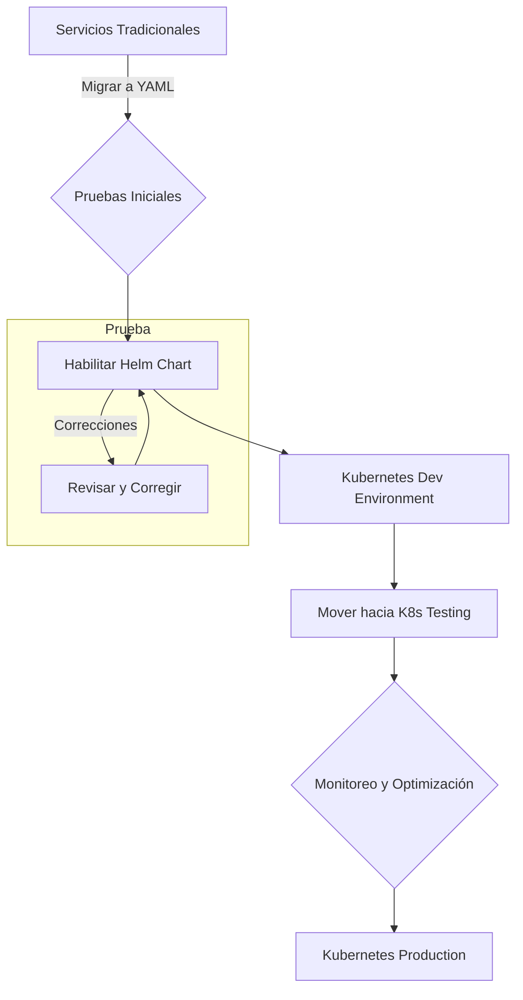

La estrategia de "Lift and Shift" en Kubernetes ofrece un camino directo para la migración, permitiendo que los equipos se centren rápidamente en las mejoras del entorno después de establecer una base funcional.

## Cuándo Necesitas un Service Mesh: Guía Práctica

### Cuándo Necesitas un Service Mesh: Guía Práctica

#### Introducción

En el ecosistema de contenedores y orquestación, Kubernetes es una herramienta fundamental para la gestión de aplicaciones distribuidas. Sin embargo, a medida que las aplicaciones se vuelven más complejas y globales, la necesidad de un Service Mesh como Istio se hace cada vez más evidente. Este artículo proporcionará una guía práctica sobre cuándo y cómo implementar un Service Mesh en tu entorno Kubernetes para gestionar el tráfico global.

#### Escenario: Gestión del Tráfico Global

Considera un escenario donde tienes múltiples clústers de Kubernetes distribuidos geográficamente. Cada uno de estos clústers está sirviendo diferentes regiones con aplicaciones críticas para la empresa. En este caso, necesitas una solución que garantice que el tráfico se maneje eficientemente dentro de cada región y solo sea redirigido a otras regiones en casos de fallo o sobrecarga.

##### Implementación de Istio Multi-Cluster Mesh

Istio es un framework abstracción que permite gestionar servicios distribuidos. En entornos multi-clúster, se puede implementar como una red mesh para controlar el tráfico entre diferentes zonas y regiones:

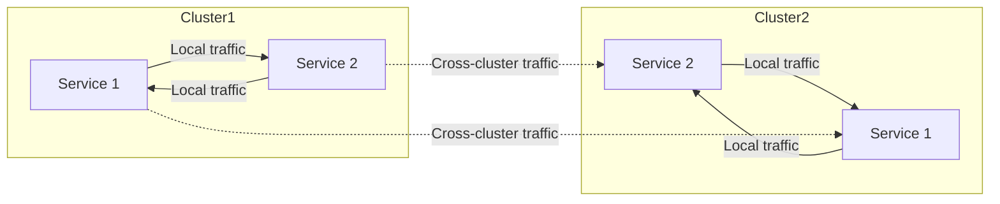

Con Istio, puedes configurar reglas de balanceo de carga basadas en la localidad para minimizar la latencia y los costos de transferencia de datos. Esto garantiza que el tráfico se mantenga dentro del mismo clúster a menos que ocurra un fallo.

#### Caso: Escalado Vertical del Control Plane

En situaciones donde no es viable federar múltiples clústers, puedes enfrentarte a la necesidad de escalar verticalmente los componentes del control plane. Esto implica:

- **Uso de nodos etcd dedicados con NVMe**: Para mejorar el rendimiento y la eficiencia en la gestión de datos.
- **Escalado de réplicas API basadas en métricas de tasa de solicitud**: Asegura que los recursos estén disponibles según las necesidades del clúster.

Además, implementar API Priority and Fairness (APF) puede ser crucial para prevenir problemas causados por vecinos ruidosos.

#### Evaluación y Baseline

Antes de proceder con la implementación de un Service Mesh o cualquier otra mejora en el escenario Kubernetes, es crucial realizar una auditoría de escalabilidad para identificar las áreas que podrían limitar tu crecimiento futuro. Esto incluye:

- **Semana 1: Evaluación y Baseline**
    - Realizar una auditoría de escalabilidad.
    - Identificar puntos de congestión en la arquitectura actual.
    - Establecer un punto de referencia de rendimiento bajo carga.

#### Implementación

Una vez que has identificado las áreas clave, puedes proceder a implementar mejoras:

- **Semana 2: Escalado de Aplicaciones y Clústers**
    - Configurar KEDA con métricas personalizadas.
    - Implementar un Service Mesh multi-clúster para los viajes de usuario críticos.

Este enfoque proporciona una base sólida que resuelve aproximadamente el 80% de las limitaciones de escalabilidad, preparándote para crecimientos hasta 100 veces más grande.

#### Conclusión

La implementación de un Service Mesh como Istio y la gestión eficiente del tráfico global son cruciales en entornos Kubernetes multi-clúster. Aseguran que tus aplicaciones puedan manejar el crecimiento sin comprometer la latencia o los costos operativos. Al adoptar estas prácticas, puedes asegurar que tu plataforma de contenedores sea escalable y competitiva.

---

Este artículo proporciona una guía práctica para entender cuándo y cómo implementar un Service Mesh en entornos Kubernetes complejos y globales.

## Observabilidad y Telemetría en el Entorno Kubernetes 2026

### Observabilidad y Telemetría en el Entorno Kubernetes 2026

En el año 2026, la observabilidad y la telemetría son aspectos fundamentales para mantener sistemas distribuidos complejos como los basados en Kubernetes. Estas prácticas permiten a las organizaciones monitorear, diagnosticar problemas y optimizar de manera continua sus aplicaciones y infraestructura.

#### Introducción

La observabilidad en Kubernetes se refiere a la capacidad del sistema para proporcionar información detallada sobre su estado interno y comportamiento actual. Esto es especialmente crucial en entornos complejos donde el tráfico puede ser altamente dinámico y las aplicaciones pueden estar distribuidas geográficamente.

#### Herramientas de Telemetría

1. **Prometheus & Grafana**
   - **Prometheus**: Es un sistema de monitoreo basado en pull, diseñado para recopilar métricas del estado actual del sistema y almacenarlas.
   - **Grafana**: Permite visualizar las métricas recolectadas por Prometheus. Puede configurarse fácilmente para crear paneles personalizados que reflejen las necesidades específicas de la organización.

2. **Jaeger**
   - Jaeger es una plataforma abierta diseñada para monitorear y analizar los flujos de tráfico en aplicaciones basadas en microservicios, proporcionando rastreo distribuido.

3. **Kiali**
   - Kiali provee una consola web que permite visualizar la topología del servicio mesh en Istio y monitorear el rendimiento de servicios individuales.

4. **Loki & Thanos**
   - Loki es un sistema de registro basado en Prometheus para Kubernetes.
   - Thanos, por otro lado, proporciona almacenamiento global y consultas distribuidas mejoradas para las métricas de Prometheus.

#### Implementación del Sistema de Telemetría

Para establecer una observabilidad efectiva, debemos implementar el siguiente sistema de telemetría:

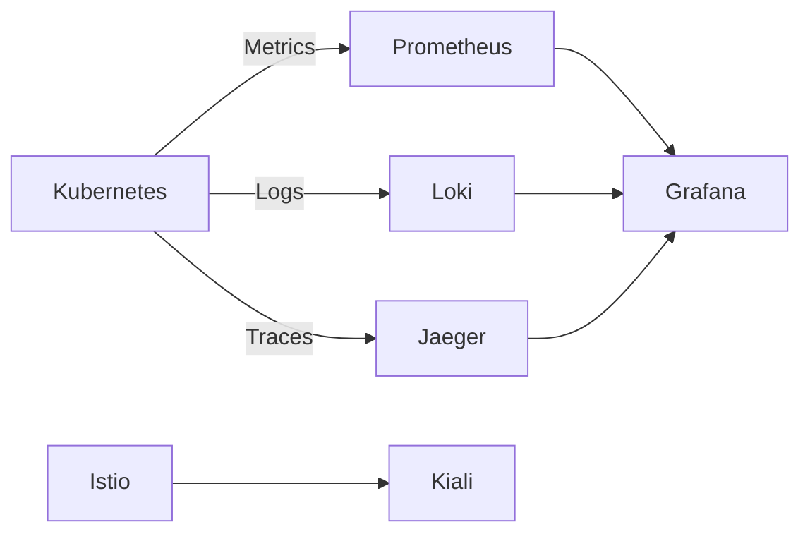

#### Integración con el Clúster de Kubernetes

1. **Prometheus Operator**
   - Instalación del operator de Prometheus en Kubernetes para automatizar la administración y configuración de Prometheus.
   
2. **Loki Operator**
   - Similarmente, podemos instalar un operator para Loki que permita a los operadores gestionar fácilmente el almacenamiento y consulta de registros.

3. **Jaeger Deployment**
   - Implementación de Jaeger dentro del clúster utilizando Istio o directamente en Kubernetes para rastrear trazas.

4. **Kiali Setup**
   - Configuración de Kiali para visualizar la topología y monitorear el rendimiento del servicio mesh implementado con Istio.

#### Análisis y Monitoreo

Una vez que tenemos los sistemas de telemetría en su lugar, es importante establecer reglas y alertas para garantizar un monitoreo proactivo. Esto incluye:

- **Reglas de Alerta**
  - Definir reglas basadas en métricas clave para detectar problemas potenciales antes de que afecten a los usuarios.
  
- **Automatización del Monitoreo**
  - Implementación de automatización en la recopilación y análisis de datos para una respuesta rápida ante incidentes.

#### Casos de Uso Comunes

1. **Auto-Escalado**
   - Utilizar métricas de CPU, memoria y solicitudes HTTP para auto-escalar pods verticalmente o horizontalmente.
   
2. **Diagnóstico de Problemas**
   - Usar registros e informes de trazas para identificar rápidamente causas raíz de problemas.

3. **Optimización del Desempeño**
   - Analizar métricas y perfiles de rendimiento para optimizar el rendimiento de aplicaciones críticas.

#### Conclusión

La implementación efectiva de sistemas de telemetría en Kubernetes es vital para mantener un alto nivel de observabilidad y mejorar la confiabilidad del sistema. En 2026, estas prácticas son una parte integral de cualquier estrategia operativa exitosa para sistemas distribuidos basados en Kubernetes.

---

Este capítulo proporciona una guía detallada sobre cómo implementar y utilizar herramientas de telemetría para mejorar la observabilidad en entornos Kubernetes. La comprensión y aplicación de estas prácticas pueden marcar una gran diferencia en el rendimiento y escalabilidad del sistema a largo plazo.

#### Código Técnico Ejemplo

A continuación, se muestra un ejemplo básico de cómo configurar Prometheus Operator en Kubernetes:

```yaml
apiVersion: monitoring.coreos.com/v1
kind: ServiceMonitor
metadata:
  name: prometheus-k8s-apiserver
spec:
  selector:
    matchLabels:
      app.kubernetes.io/name: kube-apiserver
  namespaceSelector:
    matchNamespaces:
    - kube-system
  endpoints:
  - port: https-metrics
    interval: 30s
```

Este YAML crea un `ServiceMonitor` que permite a Prometheus recoger métricas del servicio Kubernetes API Server.

