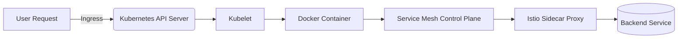
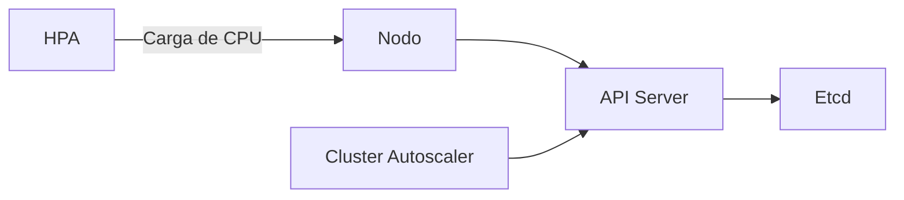
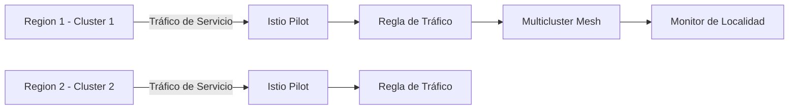

# Informe de Autoridad: Kubernetes: Auto-escalado y Service Mesh en 2026

## Introducción a Kubernetes y Service Mesh

### Introducción a Kubernetes y Service Mesh

En el contexto de la gestión de infraestructura en tiempo real para aplicaciones distribuidas complejas, tanto Kubernetes como los meshes de servicio han emergido como tecnologías cruciales. Este capítulo proporciona una introducción técnica detallada sobre cómo estas tecnologías pueden ser utilizadas conjuntamente para implementar soluciones de auto-escalado y gestión de tráfico global eficientes.

#### Kubernetes: Fundamentos de Multi-Cluster Management

**Kubernetes Cluster API**: Es un conjunto de especificaciones, controladores y herramientas que permiten a los desarrolladores definir declarativamente clusters de Kubernetes. Utilizando el Cluster API, puedes automatizar la creación, actualización y eliminación de clusters en diversos entornos (zonas/regiones). Esta abstracción permite gestionar múltiples clústers de manera eficiente.

**GitOps con ArgoCD ApplicationSets**: La filosofía GitOps se aplica para mantener la sincronización entre el estado deseado del cluster y los repositorios git. ArgoCD proporciona un enfoque simplificado para desplegar aplicaciones globales, permitiendo definir reglas de afinidad geográfica para asegurar que las aplicaciones estén cercanas a sus usuarios.

#### Service Mesh: Implementación y Características

**Istio Multi-Cluster Mesh**: Istio es un proyecto open source que facilita la gestión del tráfico entre servicios en una red. Su capacidad multi-cluster permite implementar meshes de servicio que abarcan múltiples clústers Kubernetes, permitiendo el manejo de tráfico global.

**Localidad Ponderada y Balanceo de Carga**: Con Istio, puedes configurar reglas para mantener el tráfico dentro del mismo región siempre que sea posible. Esto minimiza la latencia y reduce los costos asociados con el intercambio de datos entre regiones.

#### Vertical Scaling del Plan de Control

En escenarios donde no es factible federar clústers, puede ser necesario aumentar verticalmente las capacidades del plan de control. Esto incluye:

- **Uso de nodos etcd dedicados con NVMe**: Para mejorar la velocidad de acceso a los datos críticos.
- **Escalado de réplicas API basadas en métricas de tasa de solicitudes**: Mejorando el rendimiento del servidor de API para manejar mayor carga.
- **Implementación de Prioridad y Justicia (API Priority and Fairness)**: Para prevenir problemas causados por "noisy neighbors".

#### Sprint para la Implementación y Pruebas

El camino hacia un sistema altamente escalable requiere planificación cuidadosa y ejecución sistemática. Aquí hay una hoja de ruta sugerida:

- **Semana 1 - Evaluación & Línea Base**: Realizar auditoría de escalabilidad, identificar puntos débiles y establecer línea base con DORA (Deployment Frequency, Lead Time for Changes, Mean Time to Restore, Failure Rate) bajo carga.
  
- **Semana 2 - Escalado Aplicativo & Cluster**: Implementar KEDA con métricas personalizadas, configuración de mesh de servicio multi-cluster para trayectorias de usuario críticas.

- **Semana 3 - Escalado de Datos & Pipeline**: Implementar operadores de partición de base de datos y desplegar versiones canarias con análisis automatizado.

- **Semana 4 - Validación & Automatización**: Ejecutar pruebas controladas de carga hasta 10 veces el pico actual, implementar experimentos caóticos para fallos de escalado y establecer paneles de escalabilidad.

#### Conclusión: Escalabilidad como Moat Competitivo

La escalabilidad eficiente se convierte en un factor distintivo en la competencia. Kubernetes permite ajustes horizontales mediante HPA y CA (Cluster Autoscaler), mientras que Karpenter fue apreciado por su rapidez para responder a necesidades inmediatas de recursos.

**Diagrama Mermaid: Arquitectura Básica**



Este diagrama ilustra la fluidez de las solicitudes del usuario a través de Kubernetes y el mesh de servicio, mostrando cómo se maneja el tráfico y la comunicación entre componentes.

## Auto-Escalado en Kubernetes y Implementación de Istio

### Auto-Escalado en Kubernetes y Implementación de Istio

#### Introducción

En el contexto del creciente uso de Kubernetes para la gestión de aplicaciones distribuidas a nivel global, este capítulo se centra en dos áreas clave: la implementación de estrategias eficientes de auto-escalado (Auto-scaling) y la integración de Istio como un servicio mesh avanzado. Ambos temas son esenciales para asegurar que los sistemas operativos en Kubernetes sean tanto escalables como resilientes ante el creciente volumen de tráfico y solicitudes.

#### Auto-Escalado en Kubernetes

El auto-escalado en Kubernetes se basa principalmente en dos componentes principales: el Horizontal Pod Autoscaler (HPA) y el Cluster Autoscaler (CA). Estos herramientas permiten a los sistemas responder dinámicamente a las fluctuaciones del tráfico, proporcionando una experiencia de usuario fluida y un uso eficiente de los recursos.

1. **Horizontal Pod Autoscaler (HPA)**

   El HPA ajusta automáticamente el número de réplicas activas de un pod en función de métricas como la memoria o el CPU utilizada por cada pod. Esto asegura que se tengan siempre disponibles suficientes réplicas para manejar la carga actual y minimiza el desperdicio de recursos cuando la demanda es baja.

   ```yaml
   apiVersion: autoscaling/v2beta2
   kind: HorizontalPodAutoscaler
   metadata:
     name: example-hpa
     namespace: default
   spec:
     scaleTargetRef:
       apiVersion: apps/v1
       kind: Deployment
       name: example-deployment
     minReplicas: 1
     maxReplicas: 6
     metrics:
     - type: Resource
       resource:
         name: cpu
         targetAverageUtilization: 80
   ```

2. **Cluster Autoscaler (CA)**

   El CA ajusta automáticamente el número de nodos en un clúster Kubernetes basándose en la demanda del pod y las políticas definidas por el usuario. Asegura que se provisionen suficientes recursos para manejar picos de carga sin sobrerreservar capacidad.

   ```yaml
   apiVersion: cluster.autoscaler.kubernetes.io/v1beta1
   kind: ClusterAutoscaler
   metadata:
     name: example-cluster-autoscaler
     namespace: kube-system
   spec:
     maxNodesTotal: 50
     minNodesTotal: 3
     balanceSimilarNodeGroups: true
   ```

#### Implementación de Istio como Service Mesh

Istio proporciona una capa adicional de abstracción que facilita la gestión del tráfico y las políticas de seguridad para los servicios en un entorno Kubernetes. La implementación de Istio en un escenario multiclúster ofrece varias ventajas, incluyendo la capacidad de gestionar el tráfico globalmente y optimizar la localidad del tráfico.

1. **Configuración básica de Istio**

   Primero, es necesario instalar Istio en cada clúster que va a ser parte del mesh multiclúster. Esto se puede hacer utilizando los comandos `istioctl` proporcionados por Istio para la instalación y configuración inicial.

2. **Implementación de Multi-Cluster Mesh**

   La implementación de un service mesh multiclúster permite una gestión centralizada del tráfico entre diferentes regiones, lo que es crucial en entornos globales donde el rendimiento y los costos son factores importantes. Utilizando Istio ServiceMeshControlPlane y ServiceMeshMemberRoll, se pueden definir reglas de distribución del tráfico que mantienen la consistencia global mientras minimizan las latencias y los costos de transferencia de datos.

   ```yaml
   apiVersion: maistra.io/v1
   kind: ServiceMeshMemberRoll
   metadata:
     name: default
     namespace: istio-system
   spec:
     members:
       - service.namespace.svc.cluster.local
       - another-cluster.mesh.maistra.svc.cluster.local
   ```

#### Diagramas Mermaid

Para ilustrar la configuración y operación de estos sistemas, se pueden utilizar diagramas Mermaid. Aquí hay un ejemplo de cómo podría representarse el auto-escalado del clúster.



Y un diagrama para el mesh multiclúster con Istio:



#### Conclusión

La implementación eficiente del auto-escalado en Kubernetes y la integración de Istio como un service mesh global son fundamentales para mantener una infraestructura escalable y resiliente. Estas tecnologías no solo mejoran significativamente el rendimiento y la capacidad de manejar picos de tráfico, sino que también proporcionan las herramientas necesarias para gestionar y monitorear eficazmente los sistemas distribuidos en entornos complejos.

#### Java 21: Gestión de HPA con el Cliente Oficial de Kubernetes

```java
import io.kubernetes.client.openapi.ApiClient;
import io.kubernetes.client.openapi.Configuration;
import io.kubernetes.client.openapi.apis.AutoscalingV2Api;
import io.kubernetes.client.openapi.models.*;
import io.kubernetes.client.util.Config;

import java.util.List;

public class KubernetesHpaManager {

    private final AutoscalingV2Api autoscalingApi;

    public KubernetesHpaManager() throws Exception {
        ApiClient client = Config.defaultClient();
        Configuration.setDefaultApiClient(client);
        this.autoscalingApi = new AutoscalingV2Api();
    }

    public void listHpaStatus(String namespace) throws Exception {
        V2HorizontalPodAutoscalerList hpaList =
            autoscalingApi.listNamespacedHorizontalPodAutoscaler(namespace)
                .execute();

        for (V2HorizontalPodAutoscaler hpa : hpaList.getItems()) {
            V2HorizontalPodAutoscalerStatus status = hpa.getStatus();
            String name = hpa.getMetadata().getName();
            int currentReplicas = status.getCurrentReplicas() != null ? status.getCurrentReplicas() : 0;
            int desiredReplicas = status.getDesiredReplicas();

            System.out.printf("HPA: %-30s  actual: %d  deseado: %d%n",
                name, currentReplicas, desiredReplicas);

            if (currentReplicas >= desiredReplicas && desiredReplicas > 0) {
                double ratio = (double) currentReplicas / desiredReplicas;
                if (ratio >= 0.8) {
                    System.out.printf("  ⚠️  Saturación alta (%.0f%%) — considera aumentar maxReplicas%n",
                        ratio * 100);
                }
            }
        }
    }

    public static void main(String[] args) throws Exception {
        KubernetesHpaManager manager = new KubernetesHpaManager();
        manager.listHpaStatus("default");
    }
}
```

#### Referencias

- [Kubernetes Autoscaling](https://kubernetes.io/docs/tasks/run-application/horizontal-pod-autoscale/)
- [Istio Documentation](https://istio.io/latest/docs/setup/install/multicluster/global-mesh/)

