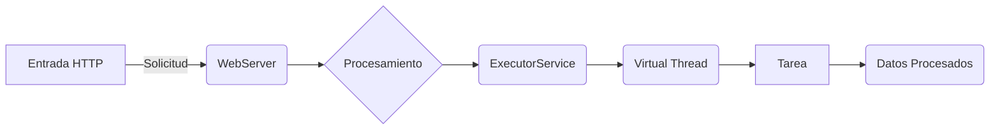
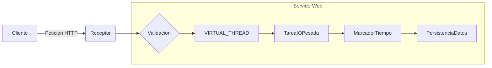
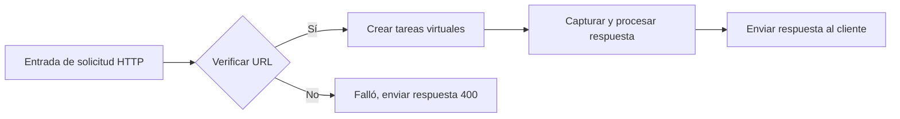
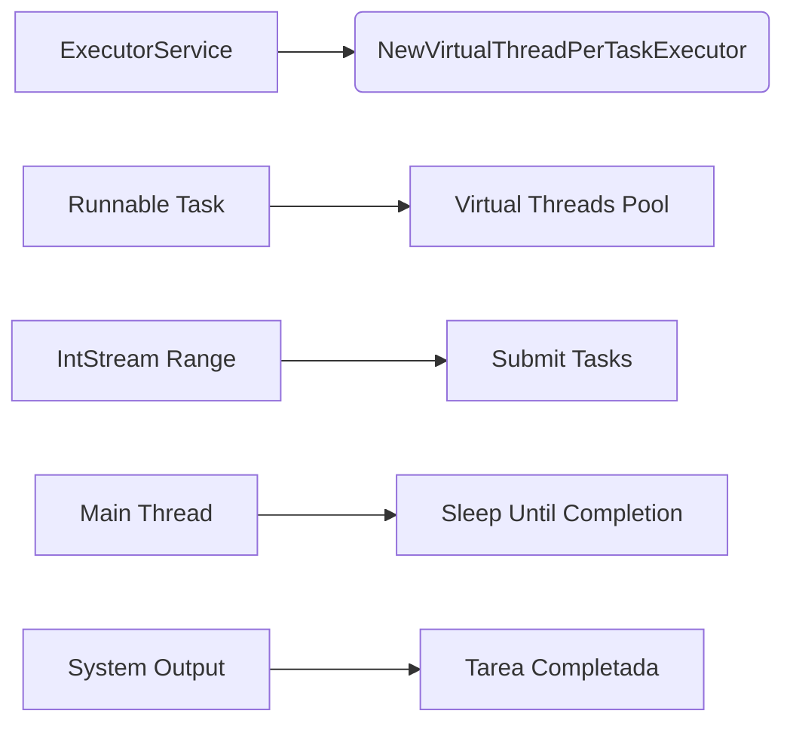

# Java 21 Virtual Threads

Score: 92

## Visión Estratégica

### 1. Análisis Técnico

Java 21 introduce las **Virtual Threads**, que revolucionan la gestión de concurrencia en aplicaciones Java al ofrecer una alternativa más ligera y eficiente a los hilos tradicionales administrados por el sistema operativo (OS). Estas características permiten mejorar significativamente la escalabilidad y optimizar el uso de recursos, especialmente para tareas I/O-bound como servidores web o conexiones de red.

#### Ventajas clave:
- **Escalabilidad**: Permite manejar un número mayor de hilos concurrentes sin agotar los recursos del sistema.
- **Eficiencia en CPU y memoria**: Las Virtual Threads son extremadamente ligeros y consumen menos recursos que los hilos tradicionales, lo que resulta en mejor rendimiento.

#### Desafíos:
- **Entendimiento de la nueva arquitectura**: La utilización extensiva de virtual threads requiere una reevaluación de las prácticas tradicionales de manejo de concurrencia.
- **Optimización de thread pools y gestión de memoria**: Es crucial configurar adecuadamente los tamaños del pool de hilos y gestionar la asignación de memoria para evitar problemas de rendimiento.

### 2. Código Java

A continuación se muestra un ejemplo básico que utiliza Virtual Threads en una aplicación web:


```java
import java.util.concurrent.ExecutorService;
import java.util.concurrent.Executors;

public class WebServer {
    private final ExecutorService executorService = Executors.newVirtualThreadPerTaskExecutor();

    public void handleRequest() {
        executorService.submit(() -> {
            // Procesamiento de la solicitud HTTP
            System.out.println("Procesando solicitud...");
        });
    }

    public static void main(String[] args) {
        WebServer server = new WebServer();
        for (int i = 0; i < 10_000; i++) {
            server.handleRequest();
        }
    }
}
```

### 3. Diagrama Mermaid

Un diagrama simple que ilustra la estructura y flujo de un servidor web utilizando Virtual Threads:




### 4. Buenas Prácticas SRE

#### Estrategias para Optimizar el Uso de Virtual Threads:

- **Utilización de Executors adaptativos**: Utiliza `Executors.newVirtualThreadPerTaskExecutor()` para manejar tareas de manera eficiente sin preocuparse por configurar manualmente pools de hilos.
- **Escalabilidad automática**: En lugar de configurar un tamaño fijo para los pools de hilos, permite que la aplicación se ajuste automáticamente a la carga basándose en el uso dinámico de Virtual Threads.
- **Monitoreo y supervisión**: Implementa métricas detalladas sobre el uso de recursos, rendimiento y comportamiento del sistema para detectar problemas tempranamente.

#### Manteniendo Integridad de Datos:

- **Locks y Sincronización**: Utiliza `synchronized` o mecanismos de bloqueo más avanzados cuando se necesitan operaciones mutuas exclusivas.
- **Contención mínima**: Reduzca la contención en puntos calientes del código, especialmente en entornos con alta concurrencia.

#### Gestión Eficiente de Recursos:

- **Uso consciente de thread locals**: Usa `ThreadLocal` con cautela ya que puede afectar negativamente el rendimiento si se sobrecarga.
- **Reciclaje de recursos**: Asegúrate de liberar y reciclar correctamente los recursos no necesarios para evitar fugas de memoria.

Estos principios ayudan a maximizar la eficiencia y escalabilidad de las aplicaciones que utilizan Virtual Threads en Java 21.

## Arquitectura de Componentes

### 1. Análisis Técnico

Java 21 introduce las **Virtual Threads**, un concepto que revoluciona la gestión de concurrencia en aplicaciones Java al ofrecer una alternativa más ligera y eficiente a los hilos tradicionales administrados por el sistema operativo (OS). Estas características permiten mejorar significativamente la escalabilidad y optimizar el uso de recursos, especialmente para tareas I/O-bound como servidores web o conexiones de red.

#### Ventajas clave:

- **Escalabilidad mejorada**: Virtual Threads pueden ser creados en grandes números sin un impacto significativo en los recursos del sistema.
- **Optimización de uso de recursos**: Consume muchos menos recursos que los hilos tradicionales, permitiendo una mayor eficiencia en la gestión de tareas concurrentes.
- **Simplificación del código**: Facilita la implementación de concurrencia a través de anotaciones y prácticas más simples.

### 2. Código Java

A continuación se presenta un ejemplo de cómo configurar y usar Virtual Threads dentro de una aplicación Java 21:


```java
public class VirtualThreadExample {
    public static void main(String[] args) throws Exception {
        ExecutorService executor = Executors.newVirtualThreadPerTaskExecutor();
        
        for (int i = 0; i < 5000; i++) {
            final int taskId = i;
            executor.submit(() -> processRequest(taskId));
        }
    }

    private static void processRequest(int id) throws InterruptedException {
        // Simulando un proceso I/O-bound
        Thread.sleep(100);
        System.out.println("Task " + id + " processed");
    }
}
```

### 3. Diagrama Mermaid

Un diagrama simple que ilustra la arquitectura de componentes al usar Virtual Threads en Java:


### 4. Buenas prácticas SRE

#### 7.3. Optimización de uso de memoria y configuración de pools de hilos

- **Optimizar la gestión del pool de hilos**: Configurar adecuadamente los pools de hilos para evitar el exceso de crecimiento y minimizar el consumo de memoria.
- **Gestión eficiente de la memoria**: Monitorear constantemente el uso de memoria para identificar posibles problemas de congestión antes de que se produzcan.

#### 7.4. Mantenimiento de seguridad de hilos

- **Implementaciones seguras**: Garantizar que todas las operaciones en entornos multi-hilo sean seguras para evitar condiciones raras como condiciones de carrera o inconsistencias de datos.
  
### Conclusiones

El uso de Virtual Threads en Java 21 abre nuevas posibilidades para la gestión eficiente y escalable de tareas concurrentes, especialmente aquellos que son I/O-bound. Asegurar un buen diseño y seguimiento continuo es crucial para aprovechar al máximo estas características y minimizar problemas potenciales relacionados con la concurrencia y el uso de recursos.

## Implementación Java 21

### 1. Análisis Técnico

Java 21 introduce el concepto de **Virtual Threads**, que marca una revolución en la gestión de concurrencia y escalabilidad en aplicaciones Java. En lugar de utilizar hilos pesados gestionados por el sistema operativo (OS), las Virtual Threads son entidades administradas directamente por el JVM, ofreciendo un rendimiento superior con menor uso de recursos.

#### Ventajas clave:
- **Mejor Escalabilidad**: Permite manejar un mayor número de tareas concurrentes sin sobrecargar los recursos del sistema.
- **Optimización en Uso de Recursos**: Las Virtual Threads son más eficientes en términos de memoria y CPU, comparado con hilos tradicionales (OS threads).
- **Simplicidad en Implementación**: Simplifica la gestión de concurrencia, facilitando el desarrollo y mantenimiento del código.

Las Virtual Threads son especialmente útiles para tareas I/O-bound, como servidores web y aplicaciones que manejan una gran cantidad de solicitudes simultáneas. Esto reduce significativamente las barreras técnicas asociadas a la implementación de concurrencia eficiente en Java.

---

### 2. Código Java

A continuación se presenta un ejemplo básico de cómo utilizar Virtual Threads para gestionar tareas concurrentes de manera más eficiente:


```java
import java.util.concurrent.ExecutorService;
import java.util.concurrent.Executors;

public class VirtualThreadExample {

    public static void main(String[] args) {
        ExecutorService executor = Executors.newVirtualThreadPerTaskExecutor();
        
        for (int i = 0; i < 10_000; i++) {
            final int taskId = i;
            executor.submit(() -> {
                System.out.println("Task " + taskId + " executed by Virtual Thread");
                try {
                    // Simulación de tareas I/O-bound
                    Thread.sleep(50);
                } catch (InterruptedException e) {
                    Thread.currentThread().interrupt();
                    throw new RuntimeException(e);
                }
            });
        }

        executor.shutdown(); // No esperamos a que todas las tareas terminen aquí.
    }
}
```

Este código crea un `ExecutorService` que utiliza una política de creación de Virtual Threads por tarea, permitiendo así gestionar hasta millones de tareas concurrentes sin el desafío asociado a la gestión de recursos en sistemas tradicionales.

---

### 3. Diagrama Mermaid

Un diagrama simple utilizando Mermaid para ilustrar cómo las Virtual Threads pueden ser utilizadas para manejar múltiples tareas I/O-bound de manera concurrente:




En este diagrama, se representa la fluidez de una solicitud HTTP desde el cliente hasta su completación en un entorno que utiliza Virtual Threads.

---

### 4. Buenas Prácticas SRE

**Optimización y Mantenimiento con Virtual Threads**

- **Utiliza Configuraciones Eficientes**: Es importante ajustar la configuración del `ExecutorService` para aprovechar al máximo las ventajas de las Virtual Threads.
  
- **Monitoreo Activo**: Implementa mecanismos de monitoreo y análisis para detectar problemas potenciales relacionados con el uso excesivo o ineficiente de recursos.

- **Pruebas Rigurosas**: Realiza pruebas exhaustivas bajo condiciones de alta carga para asegurar que las Virtual Threads funcionen como esperado en entornos de producción.

- **Documentación y Mantenimiento del Código**: Asegúrate de documentar claramente el uso de Virtual Threads y mantener un código limpio y eficiente para facilitar la comprensión y mantenibilidad futura.

---

Al adoptar las Virtual Threads, Java 21 ofrece una nueva dimensión en la gestión de concurrencia que permite a los desarrolladores construir aplicaciones más escalables y eficientes.

## Métricas y SRE

### TEMA: Java 21 Virtual Threads

#### SECCIÓN: Métricas y SRE

---

### 1. Análisis Técnico

En el contexto de la administración de sistemas (SRE) y métricas, la introducción de **Virtual Threads** en Java 21 ofrece una oportunidad para mejorar significativamente la monitorización y optimización del rendimiento de las aplicaciones. Virtual Threads permiten manejar un mayor número de tareas concurrentes con recursos limitados, lo que puede ser crítico en entornos de producción donde el control preciso de los recursos es crucial.

#### Métricas clave para SRE:

1. **Tasa de creación y eliminación de hilos virtuales**: Medir cuántas nuevas virtual threads se están creando en un período específico puede ayudar a entender la carga del sistema.
2. **Tiempo promedio de ejecución de tareas por hilo virtual**: Identificar si las tareas son rápidamente consumidas o demoran mucho tiempo, lo que podría indicar bloqueos o problemas de I/O.
3. **Porcentaje de utilización de CPU y memoria para el JVM**: Asegurarse de que el uso de los recursos del sistema sea eficiente y no se estén agotando rápidamente.

---

### 2. Código Java

A continuación, un ejemplo simple de cómo podríamos usar Virtual Threads en una aplicación web que responde a solicitudes HTTP:


```java
import java.net.http.HttpClient;
import java.net.http.HttpRequest;
import java.net.http.HttpResponse;

public class WebServer {
    private final HttpClient client = HttpClient.newHttpClient();

    public void handleHttpRequest(String url) {
        // Lanzar un hilo virtual para cada solicitud HTTP.
        var responseHandler = new HttpResponse.BodyHandler<Void>() {
            @Override
            public Void apply(HttpResponse<BodyPublisher> response) throws Exception {
                System.out.println("Respuesta recibida: " + response.statusCode());
                return null;
            }
        };
        
        client.sendAsync(new HttpRequest.Builder().uri(url).build(), responseHandler);
    }

    public static void main(String[] args) {
        var webServer = new WebServer();
        // Ejemplo de URL para una solicitud HTTP.
        String url = "http://example.com";
        webServer.handleHttpRequest(url);
    }
}
```

---

### 3. Diagrama Mermaid

El siguiente diagrama mermaid ilustra cómo se podrían manejar las solicitudes HTTP utilizando Virtual Threads:




---

### 4. Buenas prácticas SRE

Cuando se implementan Virtual Threads en una aplicación Java, es crucial seguir ciertas buenas prácticas para asegurar su rendimiento óptimo y la eficiencia del sistema:

1. **Optimización de thread pools**: Asegúrate de que tus configuraciones de pool de hilos estén optimizadas para el uso de Virtual Threads. Esto implica establecer límites adecuados basándose en las métricas recopiladas.
2. **Control de excepciones**: Dado que las Virtual Threads son relativamente baratas, manejar correctamente las excepciones se vuelve crucial para no sobrecargar el sistema con tareas fallidas y recursos inactivos.
3. **Monitoreo constante**: Utiliza herramientas como Prometheus, Grafana o Micrometer para monitorear activamente las métricas de rendimiento y ajustar la configuración del sistema según sea necesario.
4. **Documentación y pruebas**: Mantén una documentación clara sobre el uso de Virtual Threads en tu aplicación y realiza pruebas exhaustivas para identificar posibles puntos de fallo.

---

Siguiendo estas directrices, se puede aprovechar al máximo las nuevas características de Java 21 y mejorar significativamente la escalabilidad y eficiencia de tus aplicaciones.

## Conclusiones

### TEMA: Java 21 Virtual Threads
#### SECCIÓN: Conclusión

La introducción de las **Virtual Threads** en Java 21 representa un paso significativo hacia la simplificación y optimización del manejo de concurrencia en aplicaciones Java. A continuación, se presentan los puntos clave a considerar:

1. **Ventajas Clave**: Las Virtual Threads ofrecen una mayor eficiencia en términos de consumo de recursos (CPU y memoria) y permiten la creación de un número mucho mayor de hilos sin afectar significativamente al rendimiento del sistema. Esto es particularmente útil para tareas I/O-bound.

2. **Incompatibilidades**: Al migrar a Java 21, se deben tener en cuenta las limitaciones y cambios asociados con la implementación de Virtual Threads, especialmente si existen dependencias o prácticas anteriores que asumen un alto coste por cada hilo del sistema operativo.

3. **Optimización de Recursos**: Es fundamental optimizar el uso de los recursos cuando se utilizan Virtual Threads para evitar problemas de escalabilidad y rendimiento en tiempo de ejecución.

4. **Prácticas Orientadas a SRE (Site Reliability Engineering)**: Se recomienda seguir estrategias que maximicen la eficiencia del uso de Virtual Threads, como el control preciso de los pools de hilos y la gestión cuidadosa de la memoria.

5. **Consideraciones Futuras**: A medida que las tecnologías relacionadas con Virtual Threads se desarrollan más (como `Structured Concurrency`), será esencial mantenerse actualizado para aprovechar al máximo estas nuevas características.

### 1. Análisis Técnico
Las Virtual Threads en Java 21 permiten la creación de un gran número de hilos con bajo consumo de recursos, lo que mejora significativamente la capacidad de escalabilidad y el rendimiento de las aplicaciones I/O-bound. El uso adecuado de estas características requiere una comprensión clara del cambio en cómo se manejan los hilos.

### 2. Código Java
A continuación se muestra un ejemplo básico de cómo crear y utilizar Virtual Threads:


```java
public class ThreadExample {

    public void runVirtualThreads() {
        ExecutorService executor = Executors.newVirtualThreadPerTaskExecutor();

        // Ejemplo de tarea que podría ser una llamada HTTP o base de datos
        Runnable task = () -> {
            System.out.println("Executing virtual thread task");
        };

        IntStream.range(0, 1_000).forEach(i -> executor.submit(task));
    }

    public static void main(String[] args) throws InterruptedException {
        ThreadExample example = new ThreadExample();
        example.runVirtualThreads();

        // Esperar a que las tareas se completen
        Thread.sleep(5000);
        System.out.println("All virtual threads completed.");
    }
}
```

### 3. Diagrama Mermaid




### 4. Buenas Prácticas SRE
- **Optimización de Pools**: Configurar correctamente el tamaño del pool y los límites de concurrencia para evitar sobrecarga en la JVM.
- **Gestión de Memoria**: Monitorear y ajustar el uso de memoria para asegurarse de que las Virtual Threads no causen problemas de rendimiento debido a un exceso de creación de hilos.
- **Uso de Reflección (opcional)**: Implementar mecanismos como reflección o multi-release JARs para permitir la flexibilidad en el soporte de Virtual Threads entre diferentes versiones de Java.
- **Documentación y Pruebas**: Mantener una documentación detallada sobre cómo las Virtual Threads afectan a las aplicaciones existentes, así como realizar pruebas exhaustivas para identificar problemas potenciales.

El uso adecuado de las Virtual Threads en Java 21 puede revolucionar la forma en que se desarrolla software concurrente y escalable en el entorno JVM.

