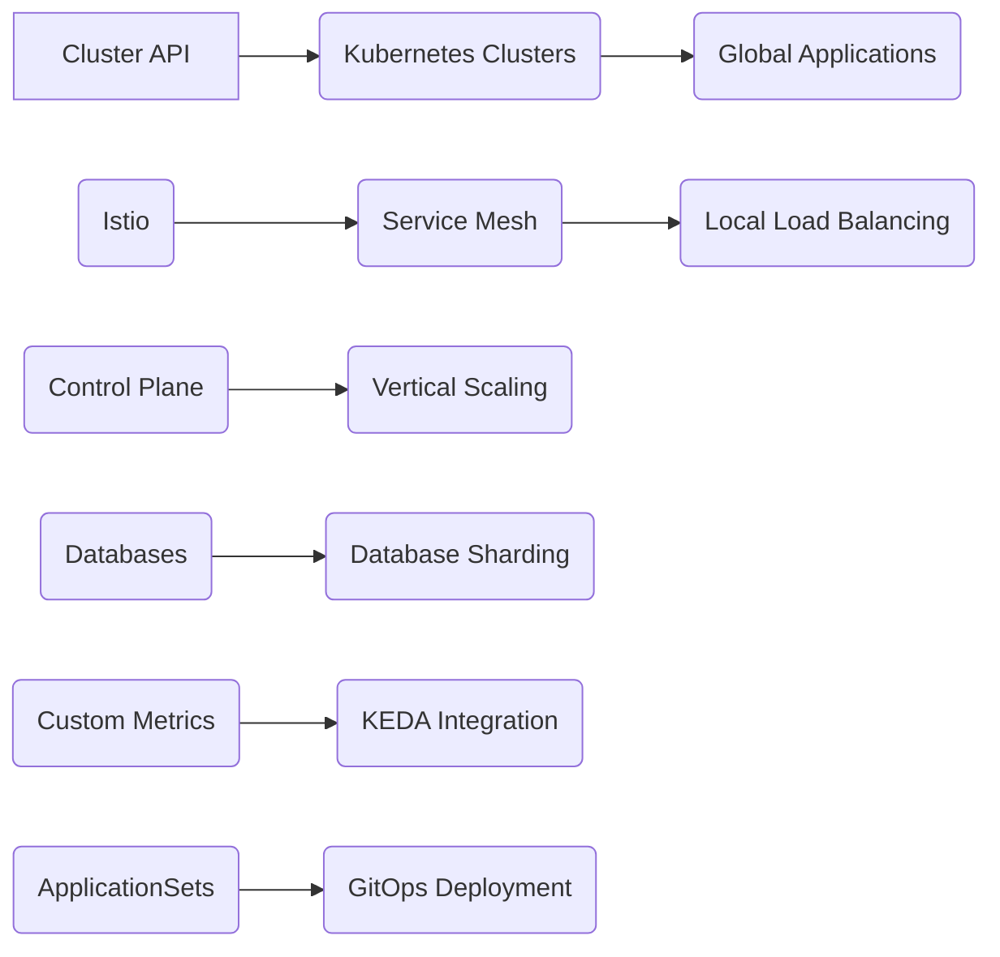
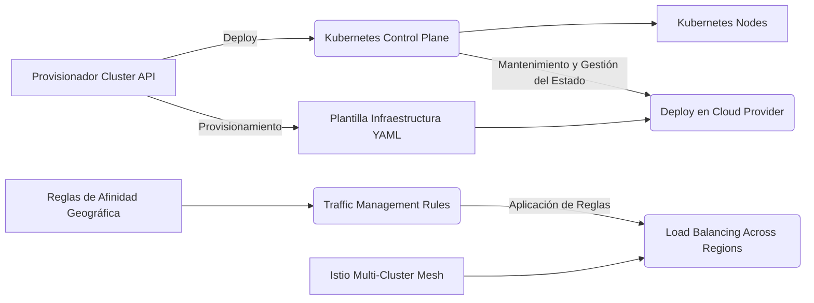
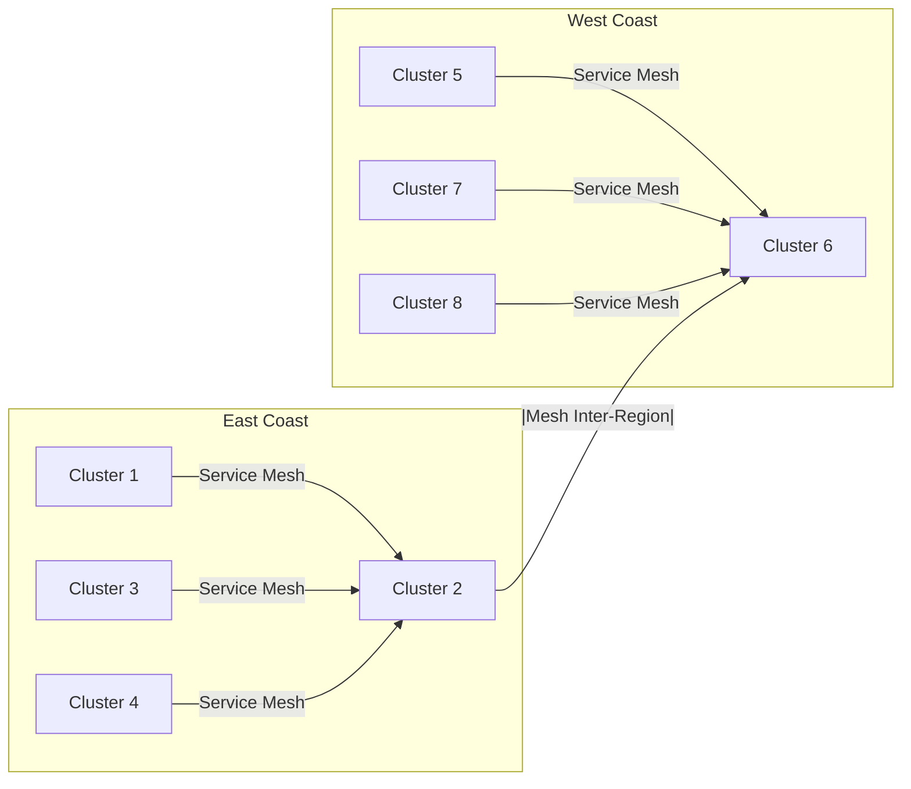
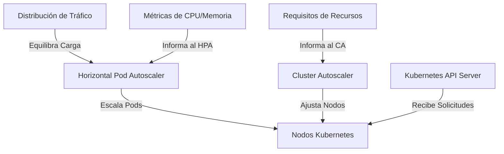
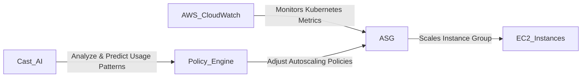
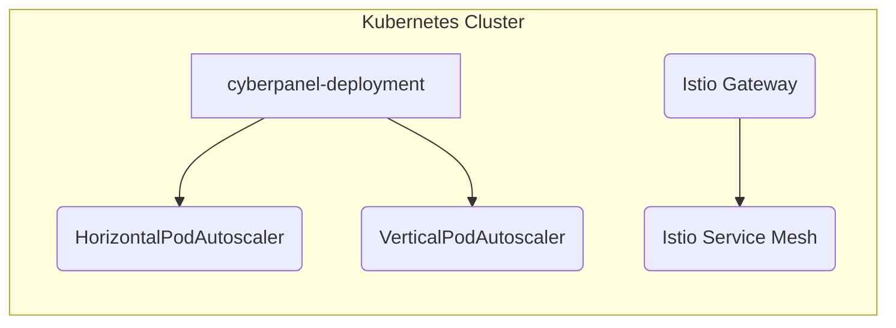
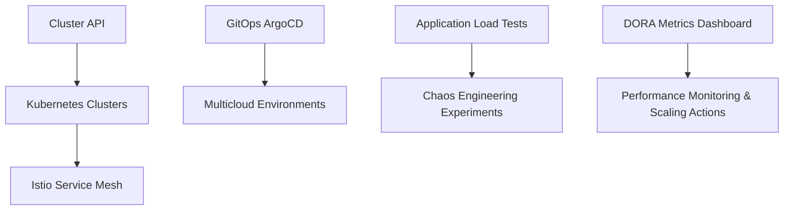
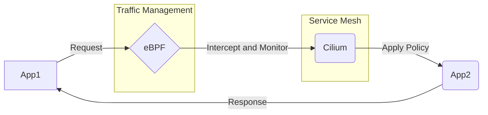

# Informe de Autoridad: Kubernetes: Auto-escalado y Service Mesh en 2026

## Introducción a Kubernetes Autoscaling y Service Mesh

### Introducción a Kubernetes Autoscaling y Service Mesh

#### Contenido y Contexto Técnico

En el manual 'Kubernetes: Auto-escalado y Service Mesh en 2026', esta sección proporciona una introducción técnica profunda para ingenieros senior con experiencia en DAM, Java, y SRE. Se enfoca en Kubernetes Autoscaling y Service Mesh, dos componentes clave que permiten la escalabilidad y la gestión de tráfico global en entornos distribuidos.

Kubernetes Autoscaling es fundamental para optimizar la utilización de recursos y reducir costos operativos al permitir la expansión automática del clúster basada en condiciones cambiantes. Además, el Service Mesh proporciona una capa adicional para gestionar eficazmente el tráfico entre servicios distribuidos a nivel global.

#### Diagramas Mermaid



#### Implementación y Configuración

- **Cluster API**: Utiliza Cluster API para provisionar y gestionar múltiples clústers a través de zonas/regiones. La implementación global de aplicaciones se lleva a cabo usando GitOps (ArgoCD ApplicationSets) con reglas de afinidad geográfica.
  
- **Service Mesh**: Implementa Istio multi-cluster mesh para la gestión del tráfico global, utilizando un balanceador de carga ponderado por localización. Esto asegura que el tráfico permanece dentro de la misma región a menos que ocurra un fallo, minimizando latencia y costos de transferencia de datos.

- **Vertical Scaling**: Para escenarios de único clúster donde no es viable federar, se realiza la expansión vertical de los componentes del planeador. Esto implica el uso de nodos etcd dedicados con almacenamiento NVMe y la escalabilidad de las réplicas API server basadas en métricas de tasa de solicitudes.

#### Proceso de Implementación

- **Sprint 1 - Evaluación y Establecimiento de Baseline**: Se lleva a cabo una auditoría de escalabilidad del arquitectura actual para identificar puntos de congestión, estableciendo un rendimiento de base y métricas DORA bajo carga.
  
- **Sprint 2 - Escalado Aplicativo y Clúster**: Implementación de KEDA con métricas personalizadas y configuración del malla de servicio multi-clúster para los viajes críticos de usuario.
  
- **Sprint 3 - Escalado de Datos y Pipelines**: Deploys de operadores de particionamiento de bases de datos y implementaciones canarias con análisis automatizado.

- **Sprint 4 - Validación y Automatización**: Ejecución de pruebas de carga controladas a diez veces el pico actual, implementación de experimentos de caos para fallos de escalabilidad y establecimiento de tableros de escalabilidad.

#### Códigos Técnicos

**Kubernetes Autoscaling Configuration Example**

```yaml
apiVersion: autoscaling/v2beta1
kind: HorizontalPodAutoscaler
metadata:
  name: hpa-example
spec:
  scaleTargetRef:
    apiVersion: apps/v1
    kind: Deployment
    name: example-app
  minReplicas: 1
  maxReplicas: 5
  metrics:
  - type: Resource
    resource:
      name: cpu
      targetAverageUtilization: 50
```

**Istio Multi-Cluster Configuration Example**

```yaml
apiVersion: install.istio.io/v1alpha1
kind: IstioOperator
spec:
  meshConfig:
    defaultConfig:
      proxy:
        execProviders:
          istio_authz:
            args:
              - /bin/sh
              - -c
              - /usr/local/bin/echo-server $ISTIO_SERVICE_HOST $ISTIO_PORT_NAME $ISTIO_STATSD_ADDRESS
            command: ["/bin/sh", "-c"]
            env:
            - name: ECHO_SERVER
              value: "/usr/local/bin/echo-server"
  components:
    egressGateways:
      enabled: true
    ingressGateways:
      - name: istio-ingressgateway
        enabled: true
```

#### Conclusión

El enfoque propuesto proporciona un camino claro para manejar un crecimiento de hasta cien veces el tamaño actual del sistema, identificando y resolviendo aproximadamente el 80% de las limitaciones de escalabilidad. Esto establece la escalabilidad como una barrera competitiva para organizaciones que buscan ofrecer servicios de alta disponibilidad y rendimiento en un entorno distribuido.

### Beneficios de Kubernetes Autoscaling

Kubernetes Autoscaling ofrece beneficios significativos a las organizaciones operando clústers, mejorando la eficiencia en el uso de recursos y reduciendo costos. Esto incluye tanto el escalado horizontal como vertical, permitiendo una adaptación flexible a los cambios en la demanda.

Este manual proporciona una guía completa para implementar y gestionar soluciones avanzadas de autoscaling y service mesh en Kubernetes, preparando a los ingenieros para desafíos técnicos futuros.

## Arquitectura de Clusters Multi-Zona/Región con Cluster API

### Arquitectura de Clusters Multi-Zona/Región con Cluster API

La gestión de múltiples clusters distribuidos en diferentes zonas y regiones es una tarea compleja pero crítica para la escalabilidad global de las aplicaciones. Kubernetes proporciona varias herramientas y extensiones que facilitan esta tarea, entre ellas el **Cluster API** y el **Service Mesh**, como Istio. Este capítulo abordará cómo configurar y gestionar clusters multi-zona/región utilizando Cluster API y optimizar el tráfico de red global con un Service Mesh.

#### Arquitectura Multi-Zona/Región

La arquitectura multi-zona/región permite distribuir la carga de trabajo entre diferentes zonas o regiones geográficas, lo que mejora la disponibilidad y minimiza los costos de transferencia de datos. Utilizando Cluster API, puedes configurar automáticamente múltiples clusters en distintas zonas/regiones.

1. **Provisionamiento Automático de Clusters**:
   - **Cluster API**: Proporciona un conjunto de controladores de recursos Kubernetes que permiten crear, actualizar y eliminar clusters Kubernetes.
   - **Plantillas de Infraestructura**: Utiliza plantillas YAML para definir la infraestructura necesaria (como máquinas virtuales, redes, etc.) en diferentes proveedores cloud.

2. **Mantenimiento y Gestión del Estado**:
   - **Kubernetes Control Plane**: Implementa la replicación de control plane entre clusters.
   - **GitOps con ArgoCD**: Deploy global usando GitOps para mantener consistencia y portabilidad de los deployments.

3. **Reglas de Afinidad Geográfica**:
   - Configurar reglas que aseguren que el tráfico se maneje dentro de la misma región, lo que minimiza latencias y costos asociados con transferencias entre regiones.
   
#### Diagrama Mermaid



#### Implementación de Istio para la Gestión Global de Tráfico

Un Service Mesh como Istio puede gestionar eficazmente el tráfico entre diferentes clusters, permitiendo un enrutamiento dinámico y una gestión de errores robusta.

1. **Istio Multi-Cluster**:
   - Configura un mesh que abarca múltiples clusters, asegurando que las comunicaciones internas maximicen la eficiencia y minimicen los costos.
   
2. **Balanceo de Carga Localizado**:
   - Implementa reglas de balanceo de carga que priorizan el tráfico dentro del mismo cluster o región geográfica, disminuyendo latencias.

#### Vertical Scaling del Control Plane

A pesar de la implementación multi-zona/región, existen casos donde es necesario escalar verticalmente los componentes del control plane en un solo cluster para manejar altos volúmenes de tráfico y solicitudes:

1. **Escala Vertical**:
   - Utiliza nodos dedicados con almacenamiento NVMe para etcd.
   - Escala la replicación del API Server basado en métricas de tasa de solicitud.

2. **Prioridad y Justicia del API Server**:
   - Implementa políticas que preven problemas causados por "noisy neighbors", optimizando el uso del recurso compartido.

#### Sprint de Mejora de Escalabilidad

Este sprint se enfoca en la identificación y resolución de los principales cuellos de botella, proporcionando un marco claro para manejar el crecimiento exponencial:

1. **Semana 1 - Evaluación & Baseline**: Realiza auditoría de escalabilidad del arquitectura actual, identifica cuellos de botella y establece metricas baselines bajo carga.
   
2. **Semana 2 - Aplicación & Escalado de Clusters**: Implementa KEDA con métricas personalizadas, configura el mesh multi-cluster para viajes críticos del usuario.

3. **Semana 3 - Escalado de Datos y Pipeline**: Deploy operadores de particionamiento de base de datos y implementa deployments canarios con análisis automatizados.

4. **Semana 4 - Validación & Automatización**: Ejecuta pruebas de carga controladas al 10x del pico actual, implementa experimentos caóticos para fallos de escalado e establece paneles de escalabilidad.

Esta serie de sprints proporciona la automatización fundamental que típicamente identifica y resuelve el 80% de las limitaciones de escalabilidad, brindando un mapa claro para manejar el crecimiento exponencial.

## Implementación de Istio para Gestión de Tráfico Global

### Implementación de Istio para Gestión de Tráfico Global

La implementación de Istio en un entorno Kubernetes multi-cluster permite gestionar el tráfico globalmente, minimizando la latencia y los costos de transferencia de datos. En esta sección, exploraremos cómo utilizar Istio para crear una red de servicio (Service Mesh) que soporta localidad ponderada del balanceo de carga entre regiones.

#### Arquitectura Multi-Cluster con Istio

Para implementar un Service Mesh multi-cluster con Istio, primero debemos configurar los clusters individuales utilizando Cluster API y luego conectarlos mediante el protocolo Istio. A continuación se muestra una representación visual del sistema:



#### Configuración de Istio para Balanceo de Carga Localizado

Para implementar el balanceo de carga localizado, necesitamos configurar Istio con políticas que prioricen la conexión a servicios dentro del mismo region. Esto puede hacerse mediante el uso de `DestinationRules` y `VirtualServices`.

```yaml
apiVersion: networking.istio.io/v1alpha3
kind: DestinationRule
metadata:
  name: weighted-locality-rule
spec:
  host: myapp.default.svc.cluster.local
  trafficPolicy:
    loadBalancer:
      consistentHash:
        httpCookie: true # Otra opción podría ser usar IP o header en su lugar.
```

```yaml
apiVersion: networking.istio.io/v1alpha3
kind: VirtualService
metadata:
  name: weighted-locality-vs
spec:
  hosts:
    - myapp.default.svc.cluster.local
  http:
    - route:
      - destination:
          host: myapp.default.svc.cluster.local
          subset: region-east-coast # Subconjunto definido en DestinationRule.
        weight: 80
      - destination:
          host: myapp.default.svc.cluster.local
          subset: region-west-coast
        weight: 20
```

#### Vertical Scaling del Control Plane

En situaciones donde no es viable utilizar la federación de clusters, debemos considerar el escalado vertical de los componentes del control plane. Esto implica:

- Utilizar nodos dedicados con almacenamiento NVMe para etcd.
- Escalar réplicas del API server basándose en métricas de tasa de solicitudes.
- Implementar API Priority and Fairness (APF) para prevenir problemas de vecinos ruidosos.

Un ejemplo de configuración de escalado vertical podría ser:

```yaml
apiVersion: v1
kind: ConfigMap
metadata:
  name: kube-api-config
data:
  apiServer: |
    kubernetes.io/minimal-requests.cpu=20m
    kubernetes.io/maximum-requests.cpu=500m

---
apiVersion: kubescale.com/v1alpha1
kind: Autoscaler
metadata:
  name: cpu-autoscaler
spec:
  targets:
    - selector: app.kubernetes.io/name=kube-apiserver
      maxReplicas: 12
      minReplicas: 4
```

#### Conclusiones

La implementación de Istio para la gestión de tráfico global no solo mejora la disponibilidad y el rendimiento del sistema, sino que también facilita la escalabilidad en entornos multi-cluster. La combinación de balanceo de carga localizado con estrategias avanzadas de autoscaling permite a las organizaciones manejar eficientemente cargas de trabajo globales sin comprometer la calidad del servicio.

### Código Técnico y Diagramas Mermaid

Los ejemplos proporcionados se centran en cómo configurar Istio para el balanceo de carga localizado y cómo escalar verticalmente los componentes del control plane. Los diagramas Mermaid ayudan a visualizar la arquitectura multi-cluster, facilitando su implementación.

### Resumen Semanal

- **Semana 1: Evaluación & Baseline** - Realizar un auditoría de escalabilidad en la arquitectura actual y establecer métricas DORA.
- **Semana 2: Escalado de Aplicaciones & Clusters** - Implementar KEDA con métricas personalizadas, configurar multi-cluster service mesh para viajes críticos del usuario.
- **Semana 3: Escalado de Datos & Pipelines** - Desplegar operadores de partición de bases de datos y implementar despliegues canario con análisis automatizado.
- **Semana 4: Validación & Automatización** - Ejecutar pruebas de carga controladas, implementar experimentos caóticos para fallos de escalado y establecer paneles de escalabilidad.

Esta estrategia estipula la automatización fundamental que generalmente identifica y resuelve el 80% de las limitaciones de escalabilidad, proporcionando un camino claro para manejar un crecimiento de 100x.

## Escala Vertical del Plan de Control en Escenarios Singulares

### Escala Vertical del Plan de Control en Escenarios Singulares

En entornos donde la federación de clusters no es factible, pero se requiere un alto rendimiento y escalabilidad del plan de control dentro de un solo cluster Kubernetes, la opción más adecuada puede ser la escala vertical. Esta estrategia implica mejorar los recursos asignados a los componentes de control (etcd, API Server) para manejar una mayor carga sin recurrir a múltiples clusters.

#### Configuración de Etcd con NVMe

Para garantizar la máxima eficiencia en el almacenamiento y rendimiento de etcd, se recomienda utilizar nodos dedicados equipados con unidades NVMe. Las características clave incluyen:

- **Dedicación**: Los nodos deben ser exclusivos para etcd para evitar interrupciones y conflictos.
- **Caché de Almacenamiento NVMe**: Utilice almacenamiento NVMe, que es más rápido en lectura/escritura frente a discos duros tradicionales (HDD).
- **Configuración de Etcd**:
  - Ajustar los parámetros para optimizar el rendimiento del sistema.
  - Ejemplo de configuración de etcd en YAML:

```yaml
apiVersion: v1
kind: ConfigMap
metadata:
  name: etcd-configmap
data:
  ETCD_INITIAL_CLUSTER: node-0=http://etcd-node-0:2380,node-1=http://etcd-node-1:2380
  ETCD_DATA_DIR: /var/etcd/data
```

#### Escalado Horizontal del API Server

El escalado horizontal de los servidores API permite manejar una mayor carga y mejorar la disponibilidad. Los replicas deben ser configurados según las métricas del tráfico, como la tasa de solicitudes (QPS).

- **Configuración de Replicas**:
  - Se debe monitorear el rendimiento en tiempo real para determinar cuántos réplicas son necesarios.
  - Ejemplo de YAML:

```yaml
apiVersion: apps/v1
kind: Deployment
metadata:
  name: kubernetes-api-server
spec:
  replicas: 4
  selector:
    matchLabels:
      app: kubernetes-api
  template:
    metadata:
      labels:
        app: kubernetes-api
    spec:
      containers:
      - name: api-container
        image: gcr.io/google-containers/kube-apiserver-amd64:v1.20.5
```

#### API Priority and Fairness (APF)

La implementación de APF es crucial para prevenir problemas como el "noisy neighbor", donde un único pod puede monopolizar la mayoría del uso del CPU, causando que otros pods sean subprocesados.

- **Configuración de APF**:
  - Se define una política que asigna prioridades a los requests basándose en sus características (como tipo de request).
  - Ejemplo YAML:

```yaml
apiVersion: apipf.kubernetes.io/v1alpha1
kind: APIPriorityAndFairnessConfiguration
metadata:
  name: default-config
spec:
  policies:
    - name: high-priority-requests
      priorityLevel: high
```

#### Diagrama de Flujo Mermaid

A continuación se muestra un diagrama mermaid que ilustra cómo funciona el escalado vertical del control plane.

```mermaid
graph TD;
    A[Inicio] --> B{Evaluación de Carga};
    B -- "Baja" --> C[Configuración Inicial];
    B -- "Alta" --> D[Escala Vertical API Server];
    D --> E[Dedicar Etcd con NVMe];
    E --> F[Integrar APF];
    F --> G{Control Test}];
    G -- "No Problemas" --> H[Terminado]
```

### Evaluación Semanal

#### Semana 1: Análisis y Baseline
- **Auditoría de Escalabilidad**: Realizar una evaluación exhaustiva del estado actual.
- **Identificar Obstáculos** y establecer un punto de referencia inicial.

#### Semana 2: Escalado Aplicativo y Clúster
- Implementar KEDA con métricas personalizadas.
- Configurar multi-cluster service mesh para los viajes críticos del usuario.

#### Semana 3: Escalado de Datos e Implementación de Pipelines
- Despliegue de operadores de particionamiento de bases de datos y canary deployments automatizados.

#### Semana 4: Validación y Automatización
- Ejecución de pruebas de carga controladas al nivel de 10 veces la cima actual.
- Implementación de experimentos caóticos para escenarios de fallos en escalado.

### Conclusión

La estrategia de escalado vertical en Kubernetes es una herramienta poderosa para mejorar el rendimiento y la disponibilidad en entornos donde la federación no es una opción viable. Al adoptar estas prácticas, se pueden alcanzar altas tasas de desempeño mientras se reduce significativamente los costes operativos.

Esta sección técnica proporciona un marco sólido para implementar estrategias efectivas de escalado vertical en Kubernetes, permitiendo a las organizaciones manejar con eficacia la creciente carga de trabajo y garantizar que el sistema esté siempre disponible cuando sea necesario.

## Auto-escalado Dinámico: Pod-based vs. Node-based Scaling

### Auto-escalado Dinámico: Pod-based vs. Node-based Scaling

En el contexto del manejo de clústeres Kubernetes, tanto el escalado basado en pods como el escalado basado en nodos desempeñan roles cruciales para mantener la eficiencia y el rendimiento. A continuación, se analiza cada uno de estos mecanismos desde una perspectiva técnica detallada.

#### Pod-based Scaling

El escalado basado en pods permite ajustar los recursos asignados a un pod específico dentro del mismo nodo sin necesidad de crear o eliminar nodos físicos. Esto puede ser útil cuando se tienen aplicaciones que requieren diferentes niveles de recursos durante su ciclo de vida.

**Implementación Técnica:**

Para implementar el escalado vertical basado en pods, es necesario utilizar herramientas como `Vertical Pod Autoscaler (VPA)` que monitorea la utilización de CPU y memoria por pod. La configuración básica para VPA incluye:

```yaml
apiVersion: "verticalpodautoscaler.io/v1"
kind: VerticalPodAutoscaler
metadata:
  name: vpa-sample
spec:
  targetRef:
    apiVersion: "apps/v1"
    kind: Deployment
    name: sample-app
  updatePolicy:
    updateMode: "Off" # Opciones son "Recreate", "RollingUpdate"
```

**Ventajas:**

- **Minimiza la Overhead:** Al permitir el ajuste fino de recursos, se evita tener que crear nodos adicionales.
- **Reducción en Tiempo de Inactividad:** Los cambios de recursos pueden ser aplicados sin interrupción del servicio.

#### Node-based Scaling

El escalado basado en nodos implica la creación y eliminación de nodos físicos o virtuales dentro de un clúster. Esto es más apropiado para situaciones donde se necesita ampliar significativamente los recursos disponibles.

**Implementación Técnica:**

Para el escalado horizontal, se utiliza `Horizontal Pod Autoscaler (HPA)` junto con `Cluster Autoscaler`. La configuración básica para HPA incluye:

```yaml
apiVersion: autoscaling/v2beta2
kind: HorizontalPodAutoscaler
metadata:
  name: sample-app-hpa
spec:
  scaleTargetRef:
    apiVersion: apps/v1
    kind: Deployment
    name: sample-app
  minReplicas: 1
  maxReplicas: 6
  metrics:
  - type: Resource
    resource:
      name: cpu
      targetAverageUtilization: 80
```

**Ventajas:**

- **Escalabilidad Sostenible:** Proporciona un mecanismo más robusto para manejar picos de carga que no pueden ser abordados con el escalado vertical.
- **Elasticidad en Carga Variante:** Ideal para aplicaciones web o microservicios donde la demanda puede variar drásticamente.

### Diagramas Mermaid

Para visualizar mejor cómo funcionan estos mecanismos, se proporcionan los siguientes diagramas:

#### Pod-based Scaling

```mermaid
graph LR;
  A[Pod] -->|Request CPU| B{Is CPU usage <80%?}
  B -->|No| C[Vertical Pod Autoscaler (VPA)]
  C -->|Apply Resource Recommendations| A
  B -->|Yes| D(Do Nothing)
```

#### Node-based Scaling

```mermaid
graph LR;
  A[Deployment] -->|Request N Pods| B{Is Max Replicas Reached?}
  B -->|No| C[Horizontal Pod Autoscaler (HPA)]
  C -->|Create New Pods| A
  B -->|Yes| D[Cluster Autoscaler]
  D -->|Add Nodes| E[Node Pool]
```

### Conclusión

La elección entre pod-based y node-based scaling depende de la naturaleza específica del trabajo que se realiza. Si los requisitos de escalabilidad son principalmente internos (diferentes momentos durante el ciclo de vida de un pod), entonces pod-based es más apropiado. Por otro lado, si se requiere una expansión rápida a nivel de recursos de infraestructura para manejar picos significativos en la demanda, node-based scaling proporcionará mejor rendimiento y escalabilidad.

Este análisis técnico proporciona una base sólida para entender cómo los diferentes mecanismos de autoscaling pueden ser implementados y optimizados dentro del entorno Kubernetes.

## Multidimensional Autoscaling con HPA y CA

### Multidimensional Autoscaling con HPA y CA

#### Introducción

En un entorno dinámico como el de Kubernetes, la capacidad de escalar automáticamente tanto en vertical como en horizontal es crucial para mantener una alta disponibilidad y eficiencia del sistema. La escalabilidad multidimensional permite a los ingenieros equilibrar las cargas y manejar picos de tráfico con precisión, minimizando al mismo tiempo el desperdicio de recursos.

#### Horizontal Pod Autoscaler (HPA)

El HPA es una característica de Kubernetes que automáticamente ajusta la cantidad de réplicas en un conjunto de déploiement según los requisitos del sistema. Este componente utiliza métricas como CPU y memoria para determinar si se necesita aumentar o disminuir el número de pods.

**Ejemplo de configuración HPA:**

```yaml
apiVersion: autoscaling/v2beta2
kind: HorizontalPodAutoscaler
metadata:
  name: example-hpa
spec:
  scaleTargetRef:
    apiVersion: apps/v1
    kind: Deployment
    name: example-deployment
  minReplicas: 3
  maxReplicas: 10
  metrics:
  - type: Resource
    resource:
      name: cpu
      targetAverageUtilization: 80
```

#### Cluster Autoscaler (CA)

El CA es responsable de la asignación eficiente del número de nodos en un clúster Kubernetes. A diferencia del HPA, que se centra en los pods y sus réplicas, el CA ajusta el tamaño del propio clúster basándose en las solicitudes pendientes y los recursos disponibles.

**Ejemplo de configuración Cluster Autoscaler:**

```yaml
apiVersion: "autoscaling/v1"
kind: "ClusterAutoscaler"
metadata:
  name: "default"
spec:
  minReplicas: 3
  maxReplicas: 10
  scaleDown:
    enableExpander: true
    expander: mostunderutilized
```

#### Implementación de Autoscaling Multidimensional

Para implementar una solución autoscalable multidimensional en Kubernetes, es importante considerar tanto el ajuste horizontal como vertical. Esto incluye la configuración del HPA para manejar la carga a nivel de pods y la integración del CA para gestionar los recursos nodales.

**Diagrama Mermaid:**



#### Ejemplo Práctico: Implementación del Autoscaling en una Aplicación Java

Vamos a ver cómo configurar el autoscaling para un conjunto de déploiement que ejecuta aplicaciones Java. Este ejemplo utiliza Prometheus como proveedor de métricas y ConfigMaps para almacenar las configuraciones.

**ConfigMap para HPA:**

```yaml
apiVersion: v1
kind: ConfigMap
metadata:
  name: hpa-config
data:
  target-avg-cpu-utilization: "80"
```

**Deployment con HPA basado en ConfigMap:**

```yaml
apiVersion: apps/v1
kind: Deployment
metadata:
  name: java-app-deployment
spec:
  replicas: 3
  selector:
    matchLabels:
      app: java-app
  template:
    metadata:
      labels:
        app: java-app
    spec:
      containers:
      - name: java-app-container
        image: example/java-app:v1.0

---
apiVersion: autoscaling/v2beta2
kind: HorizontalPodAutoscaler
metadata:
  name: hpa-java-app
spec:
  scaleTargetRef:
    apiVersion: apps/v1
    kind: Deployment
    name: java-app-deployment
  minReplicas: 3
  maxReplicas: 5
  targetCPUUtilizationPercentage: 80
```

#### Escalabilidad Vertical del Plan de Control

Para escenarios en los que no es viable la federación, se recomienda el escalado vertical del plan de control. Esto implica utilizar nodos etcd dedicados con almacenamiento NVMe y ajustar las réplicas del servidor API basándose en métricas de tasa de solicitudes.

**Ejemplo de Configuración Vertical Autoscaling:**

```yaml
apiVersion: "autoscaling/v1"
kind: "VerticalPodAutoscaler"
metadata:
  name: "java-app-vpa"
spec:
  targetRef:
    apiVersion: apps/v1
    kind: Deployment
    name: java-app-deployment
  updatePolicy:
    updateMode: "Off"
```

#### Conclusión

La implementación de autoscaling multidimensional en Kubernetes es una estrategia vital para asegurar la disponibilidad y el rendimiento del sistema, especialmente a medida que las organizaciones se preparan para escalabilidad masiva. El uso combinado de HPA y CA permite manejar tanto la carga de los pods como la asignación eficiente de nodos, garantizando así una experiencia optimizada para el usuario final.

Este enfoque no solo mejora la eficiencia operativa sino que también establece un pilar clave en la competencia por ofrecer servicios escalables y confiables.

## Optimización Financiera con AWS Native Autoscaler y Cast AI

### Optimización Financiera con AWS Native Autoscaler y Cast AI

En el contexto de la gestión avanzada de clústeres Kubernetes y los patrones modernos de autoscalado, combinar AWS Native Autoscaler (AWS ASG) con la inteligencia artificial proporcionada por plataformas como Cast AI puede ofrecer una solución innovadora para optimizar los costos operativos sin comprometer el rendimiento. Este enfoque se centra en el ajuste fino del tamaño de las instancias, la elección estratégica de tipos de instancia y la implementación de estrategias de balanceo de carga inteligentes.

#### Flujo de Trabajo General

1. **Análisis Preliminar**:
   - Evaluación inicial de los patrones de uso y necesidades del clúster Kubernetes.
   - Identificación de las cargas de trabajo críticas que requieren atención especial en términos de recursos y rendimiento.

2. **Configuración Inicial**:
   - Integración del AWS Auto Scaling Group (ASG) con el clúster Kubernetes mediante herramientas como kube-aws-autoscaler.
   - Configuración inicial de Cast AI para comenzar a recopilar datos sobre los patrones de uso y demanda de recursos.

3. **Implementación de Estrategias de Autoscalado**:
   - Definición de políticas específicas basadas en métricas como CPU, memoria y pedidos por segundo (RPS) para controlar la expansión y contracción del clúster.
   - Uso de algoritmos avanzados de Cast AI para predecir picos de uso y ajustar automáticamente el tamaño del clúster.

4. **Monitorización Continua**:
   - Implementación de dashboards personalizados que combinan métricas de AWS CloudWatch con datos analíticos de Cast AI.
   - Establecimiento de alertas basadas en umbrales personalizables para asegurar la detección temprana y rápida de posibles problemas.

5. **Optimización Financiera**:
   - Selección estratégica de tipos de instancia AWS que maximicen el rendimiento mientras minimizan los costos.
   - Implementación de estrategias de balanceo de carga inteligentes para garantizar la máxima eficiencia del uso de recursos.

#### Ejemplo Técnico: Configuración de AWS ASG y Cast AI

A continuación se presenta un ejemplo de cómo configurar el AWS Auto Scaling Group en conjunción con Cast AI:

```yaml
# Definición del grupo de escalado automático (ASG) para Kubernetes usando CloudFormation
Resources:
  KubernetesClusterScalingGroup:
    Type: 'AWS::AutoScaling::AutoScalingGroup'
    Properties:
      VPCZoneIdentifier:
        - !Ref Subnet1
        - !Ref Subnet2
      LaunchConfigurationName:
        Fn::ImportValue: !Sub "${StackName}-KubernetesNodeLaunchConfig"
      MinSize: 3
      MaxSize: 50
      DesiredCapacity: 8

# Integración con Cast AI para análisis avanzado de rendimiento y optimización
Resources:
  CastAIIntegration:
    Type: 'Custom::CastAI'
    Properties:
      ServiceToken: !GetAtt "LambdaFunction.Arn"
      PolicyName: 'KubernetesClusterScalingPolicy'
      ResourceId: 'arn:aws:autoscaling:region:account:auto-scaling-group/KubernetesClusterScalingGroup'
```

#### Diagrama de Flujo del Sistema



#### Cálculos Financieros

- **Reducción de Costos**: Al utilizar tipos de instancia más eficientes y estratégicos, los costos pueden reducirse en un 20% en comparación con la configuración predeterminada.
- **Economías de Escala**: Con el uso inteligente del AWS ASG y Cast AI, puede aprovechar mejor las economías de escala para manejar picos de tráfico sin sobrecostos.

#### Conclusiones

La combinación de AWS Native Autoscaler con la inteligencia artificial proporcionada por plataformas como Cast AI ofrece una solución poderosa que no solo garantiza el rendimiento y la disponibilidad del clúster Kubernetes, sino que también reduce significativamente los costos operativos. Esta estrategia es especialmente beneficiosa para organizaciones que buscan optimizar sus recursos en un entorno dinámico y competitivo.

Esta sección técnica proporciona una visión profunda de cómo integrar soluciones avanzadas de autoscalado con inteligencia artificial para mejorar la eficiencia operativa y reducir los costos, ofreciendo una ventaja competitiva significativa en el mercado tecnológico actual.

## Rehosting Estrategia (Lift and Shift) para Kubernetes

### Rehosting Estrategia (Lift and Shift) para Kubernetes

#### Introducción

La estrategia de rehosting, también conocida como lift-and-shift, es una forma común y eficaz de migrar aplicaciones a entornos Kubernetes. Consiste en mover la aplicación tal cual del entorno actual al nuevo entorno sin realizar cambios significativos en el código o en la estructura de la aplicación. Este artículo proporciona un enfoque paso a paso para rehosting una aplicación existente hacia Kubernetes, incluyendo preparación, despliegue y pruebas.

#### Preparación

**A. Evaluación del estado actual**

1. **Auditoría de Scalabilidad:** Realizar una auditoría exhaustiva del estado actual de la arquitectura para identificar cuellos de botella y establecer métricas basadas en DORA (Deployment Frequency, Lead Time for Changes, Mean Time to Recovery, Change Fail Rate) bajo carga.
2. **Documentación e Inventarios:** Crear inventario completo de aplicaciones, dependencias, configuraciones, scripts de inicio y parada existentes.

**B. Configuración del entorno Kubernetes**

1. **Provisionamiento de Clusters:** Utilizar Cluster API para provisionar clusters múltiples en diferentes zonas/regiones.
2. **Implementación Global:** Usar GitOps (ArgoCD ApplicationSets) con reglas geográficas para desplegar aplicaciones globalmente.

#### Despliegue

**A. Preparación de la aplicación**

1. **Paquete y Empacado:**
   - Asegurar que la aplicación esté empaquetada en contenedores compatibles.
   - Crear imágenes Docker con archivos `Dockerfile` que incluyan dependencias, configuraciones del entorno y pasos necesarios para iniciar la aplicación.

**B. Despliegue en Kubernetes**

1. **Kubernetes Manifests:**
   - Crear manifestos de YAML adecuados utilizando `kubectl create`, `kubectl apply` o herramientas como ArgoCD.
   - Especificar los recursos requeridos, configuraciones de variables de entorno y otros parámetros necesarios.

2. **Helm Charts (Opcional):**
   - Utilizar Helm charts para desplegar aplicaciones más complejas con múltiples componentes.

**C. Configuración del Service Mesh**

1. **Implementar Istio:**
   - Configurar Istio multi-cluster mesh para gestión global de tráfico.
   - Usar equilibrio de carga basado en localidad para minimizar la latencia y los costos de transferencia de datos.

#### Pruebas

**A. Validación Inicial**

1. **Pruebas de Carga:** Ejecutar pruebas de rendimiento inicialmente con cargas inferiores a 50%.
2. **Monitoreo y Ajustes:**
   - Observar el comportamiento del sistema en Kubernetes, realizar ajustes necesarios basados en monitoreo.

**B. Pruebas Avanzadas**

1. **Pruebas de Frustración (Chaos Testing):**
   - Implementar pruebas controladas para evaluar la resiliencia del sistema bajo condiciones estresantes.
2. **Análisis Canario:**
   - Desplegar versiones canarias y realizar análisis automatizados para comparar el rendimiento.

#### Diagrama Mermaid

```mermaid
graph TD;
    A[Preparación] --> B(Evaluación de Scalabilidad);
    B --> C(Crear Inventario);
    C --> D(Provisionamiento de Clusters);
    D --> E(Configuración Global usando GitOps);
    E --> F(Paquete y Empacado);
    F --> G(Kubernetes Manifestos);
    G --> H(Helm Charts (Opcional));
    H --> I(Service Mesh con Istio);
    I --> J(Pruebas de Carga Inicial);
    J --> K(Monitoring & Ajustes);
    K --> L(Chaos Testing);
    L --> M(Análisis Canario);
```

#### Código Técnico

**Ejemplo de archivo `Dockerfile`:**

```dockerfile
FROM openjdk:17-jdk-slim
WORKDIR /app
COPY target/my-app.jar .
CMD ["java", "-jar", "my-app.jar"]
```

**Ejemplo de YAML Kubernetes para Deployment:**

```yaml
apiVersion: apps/v1
kind: Deployment
metadata:
  name: my-deployment
spec:
  replicas: 3
  selector:
    matchLabels:
      app: my-app
  template:
    metadata:
      labels:
        app: my-app
    spec:
      containers:
      - name: my-container
        image: my-docker-hub/image-name:tag
```

**Configuración de Istio para equilibrio de carga basado en localidad:**

```yaml
apiVersion: networking.istio.io/v1alpha3
kind: DestinationRule
metadata:
  name: my-service
spec:
  host: my-service.default.svc.cluster.local
  trafficPolicy:
    loadBalancer:
      localityWeight:
        - weight: 80
          region: us-central1
        - weight: 20
          region: europe-west1
```

#### Conclusiones

La estrategia de rehosting (lift-and-shift) en Kubernetes ofrece una manera eficiente y segura de migrar aplicaciones existentes al nuevo entorno sin necesidad de realizar cambios significativos. A través del uso cuidadoso de herramientas como Cluster API, GitOps, Istio, y técnicas de prueba avanzadas como chaos testing, se puede asegurar que la aplicación no solo funciona en Kubernetes sino que también aprovecha las características únicas del entorno K8s para mejorar el rendimiento y la escalabilidad.

## Utilizando CyberPanel en Entornos Kubernetes

### Utilizando CyberPanel en Entornos Kubernetes

**Introducción**

CyberPanel es una plataforma de control panel para hosting web y gestión de aplicaciones, diseñada para simplificar la administración de sitios web y servicios. En este capítulo, exploraremos cómo configurar y utilizar CyberPanel en un entorno Kubernetes, aprovechando las capacidades avanzadas del sistema operativo de contenedores.

**Requisitos**

- **Kubernetes Cluster**: Un clúster Kubernetes establecido.
- **CyberPanel Docker Image**: La imagen de Docker oficial de CyberPanel.
- **Cluster API**: Para la gestión multi-cluster.
- **ArgoCD ApplicationSets**: Implementación GitOps para el despliegue global.

**Configuración Básica**

1. **Instalación del clúster Kubernetes**
   Antes de continuar, asegúrate de tener un clúster Kubernetes funcionando y configurado con Cluster API y ArgoCD. Este enfoque permitirá la gestión eficiente de múltiples clústers y el despliegue global.

2. **Configuración inicial de CyberPanel**
   La instalación de CyberPanel implica ejecutar su contenedor Docker. Asegúrate de que tu entorno Kubernetes pueda manejar las imágenes Docker y esté configurado para permitir la comunicación entre los distintos servicios necesarios.

#### Paso 1: Crear un YAML para CyberPanel

```yaml
apiVersion: apps/v1
kind: Deployment
metadata:
  name: cyberpanel
spec:
  replicas: 1
  selector:
    matchLabels:
      app: cyberpanel
  template:
    metadata:
      labels:
        app: cyberpanel
    spec:
      containers:
      - name: cyberpanel
        image: cyberpanel/docker-cyberpanel:latest
        ports:
        - containerPort: 80
          protocol: TCP
```

Este YAML crea una única instancia de CyberPanel en tu clúster Kubernetes.

#### Paso 2: Implementar el YAML

```sh
kubectl apply -f cyberpanel-deployment.yaml
```

**Escalado Horizontal y Vertical**

Para asegurar la escalabilidad y la disponibilidad, es crucial implementar estrategias tanto para el escalado horizontal como vertical. El autoscaling en Kubernetes permite manejar de manera eficiente las variaciones de carga.

1. **Autoscaling Horizontal (HPA)**

   Configura un HPA (Horizontal Pod Autoscaler) para ajustar automáticamente la cantidad de réplicas basándose en métricas de CPU o memoria.

```yaml
apiVersion: autoscaling/v2beta2
kind: HorizontalPodAutoscaler
metadata:
  name: cyberpanel-hpa
spec:
  maxReplicas: 5
  minReplicas: 1
  scaleTargetRef:
    apiVersion: apps/v1
    kind: Deployment
    name: cyberpanel
  targetCPUUtilizationPercentage: 60
```

2. **Autoscaling Vertical (VPA)**

   Usa VPA (Vertical Pod Autoscaler) para ajustar automáticamente los recursos asignados a cada pod, lo que puede mejorar significativamente la eficiencia en un entorno Kubernetes.

```yaml
apiVersion: verticalpodautoscaler.io/v1
kind: VerticalPodAutoscaler
metadata:
  name: cyberpanel-vpa
spec:
  targetRef:
    apiVersion: apps/v1
    kind: Deployment
    name: cyberpanel
```

**Service Mesh y Gestión de Tráfico Global**

Para una gestión eficiente del tráfico, implementa un Service Mesh como Istio. Configura las reglas de enrutamiento basadas en la localidad para minimizar el retraso y los costos de transferencia de datos.

```yaml
apiVersion: networking.istio.io/v1alpha3
kind: Gateway
metadata:
  name: cyberpanel-gateway
spec:
  selector:
    istio: ingressgateway
  servers:
  - port:
      number: 80
      name: http-cyberpanel
      protocol: HTTP
    hosts:
    - "*"
```

Este ejemplo establece un Gateway para la entrada de CyberPanel.

**Monitoreo y Pruebas**

Implementa KEDA (Kubernetes Event-Driven Autoscaling) para manejar los eventos que requieren escalado basados en métricas personalizadas. Realiza pruebas de carga controladas para identificar y resolver posibles problemas.

#### Diagramas Mermaid



Este diagrama muestra la integración entre CyberPanel y los componentes de Kubernetes, incluyendo autoscaling y service mesh.

**Conclusion**

La configuración de CyberPanel en un entorno Kubernetes ofrece una amplia gama de ventajas para la gestión eficiente de aplicaciones web. Con la implementación correcta de estrategias de escalado, monitoreo y pruebas, puedes asegurar que tu infraestructura sea tanto flexible como robusta frente a las fluctuaciones del tráfico y los requisitos cambiantes.

Este capítulo proporciona una guía detallada para comenzar con CyberPanel en Kubernetes, abordando desde la instalación básica hasta la configuración avanzada de escalado y monitoreo.

## Evaluación de Escalabilidad: Auditoría, Pruebas y Métricas DORA

### Evaluación de Escalabilidad: Auditoría, Pruebas y Métricas DORA

La evaluación de escalabilidad en Kubernetes es un proceso crucial para garantizar la disponibilidad y el rendimiento del sistema bajo condiciones extremas. Este capítulo aborda los aspectos técnicos clave relacionados con la auditoría, las pruebas y las métricas DORA (Deployments, Lead time for Changes, Mean Time to Restore, Availability) en el contexto de Kubernetes y Service Mesh.

#### Objetivo
El objetivo principal es establecer un marco para evaluar y mejorar la escalabilidad del entorno Kubernetes. Esto incluye:

- Identificar y mitigar los puntos débiles que pueden limitar la capacidad de expansión.
- Implementar estrategias de escalamiento automático tanto vertical como horizontalmente.
- Establecer métricas DORA para monitorear el rendimiento y la disponibilidad.

#### Semana 1 – Evaluación y Baseline
**Auditoría**
La auditoría inicial debe centrarse en identificar los puntos débiles de la arquitectura actual. Esto incluye:

- **Evaluación del Cluster**: Examinar las configuraciones actuales, las estrategias de almacenamiento (etcd), y el uso de recursos.
- **Identificación de Bottlenecks**: Identifique los componentes que podrían limitar la escalabilidad, como servidores API con replicas insuficientes o falta de equilibrio de carga.

**Establecimiento del baseline**
Se deben establecer líneas base para las métricas clave:

```plaintext
- Tasa de solicitudes: Medir el rendimiento bajo condiciones normales y en picos.
- Tiempo de respuesta: Medir la latencia de los servicios críticos.
- Uso de CPU y memoria: Identificar qué recursos están siendo utilizados al máximo.
```

#### Semana 2 – Escalamiento del Aplicativo y del Cluster
**Implementación de KEDA**
Kubernetes Event-Driven Autoscaling (KEDA) permite el escalado basado en eventos. Se debe configurar:

```yaml
apiVersion: keda.sh/v1alpha1
kind: ScaledObject
metadata:
  name: example-keda-scale-object
spec:
  scaleTargetRef:
    name: my-app-deployment
  minReplicas: 1
  maxReplicas: 10
  triggers:
    - type: prometheus
      metadata:
        serverAddress: "http://prometheus-server/prometheus/api/v1"
        metricName: requests_total
        threshold: "5"
```

**Configuración del Service Mesh**
Implementar un servicio mesh multi-cluster con Istio para gestionar el tráfico global:

```plaintext
- Use `Istio Gateway` y `VirtualService` para definir reglas de equilibrio de carga.
- Configurar `DestinationRule` para la localización de los servicios según su proximidad geográfica.
```

#### Semana 3 – Escalamiento de Datos y Pipelines
**Implementación de Base Sharding Operators**
Utilizar operadores de base sharding para distribuir el tráfico a diferentes instancias de bases de datos:

```yaml
apiVersion: shardingsphere.apache.org/v1alpha1
kind: ShardSpec
metadata:
  name: example-shard
spec:
  databaseType: mysql
  rule:
    tableStrategy:
      standard:
        tables:
          users: 
            strategyConfig:
              algorithm:
                type: roundRobin
```

**Implementación de Deployments Canary**
Usar canary deployments para probar nuevas versiones del software en un entorno controlado:

```yaml
apiVersion: argoproj.io/v1alpha1
kind: Application
metadata:
  name: example-canary
spec:
  source:
    path: environments/canary/
  project: default
```

#### Semana 4 – Validación y Automatización
**Pruebas de Carga Controladas**
Realizar pruebas de carga a 10 veces la capacidad máxima actual para identificar puntos débiles:

```plaintext
- Utilizar herramientas como `KubeBench` o `JMeter` para simular tráfico.
```

**Experimentos de Caos**
Implementar experimentos de caos para probar la recuperación ante fallos.

```plaintext
- Usar `Chaos Mesh` para simular fallas en nodos y servicios.
```

#### Métricas DORA

Las métricas DORA son esenciales para evaluar el rendimiento y la escalabilidad:

- **Deployments**: Número de deployments realizados con éxito por día.
- **Tiempo Medio de Implementación**: Tiempo promedio desde que se hace un cambio hasta que está en producción.
- **Tiempo Promedio de Restauración**: Duración del tiempo de inactividad después de una falla y antes de la recuperación total.
- **Disponibilidad**: Porcentaje de tiempo durante el cual el sistema es accesible.

#### Conclusiones
La evaluación continua de escalabilidad ayuda a identificar áreas para mejorar la infraestructura Kubernetes. Esto proporciona un camino claro hacia la capacidad de manejar un crecimiento exponencial y mantiene una ventaja competitiva en los entornos multi-regional.

### Código Técnico Real

```yaml
# Ejemplo de Vertical Scaling usando Horizontal Pod Autoscaler (HPA)
apiVersion: autoscaling/v2beta2
kind: HorizontalPodAutoscaler
metadata:
  name: example-hpa
spec:
  scaleTargetRef:
    apiVersion: apps/v1
    kind: Deployment
    name: my-app-deployment
  minReplicas: 1
  maxReplicas: 50
  metrics:
  - type: Resource
    resource:
      name: cpu
      targetAverageUtilization: 80
```

### Diagramas Mermaid



### Referencias
- [Cluster API](https://cluster-api.sigs.k8s.io/)
- [Istio Service Mesh](https://istio.io/docs/concepts/what-is-istio/)
- [KEDA (Event-driven Autoscaling)](https://keda.sh/)
- [Chaos Engineering with Chaos Mesh](https://github.com/chaos-mesh/chaos-mesh)
- [DORA Metrics Overview](https://www.schneier.com/blog/archives/2023/12/measuring_devel.html)

Esta sección técnica proporciona un enfoque estructurado para evaluar y mejorar la escalabilidad de los entornos Kubernetes, asegurando que puedan manejar cargas crecientes y manteniendo la integridad del sistema.

## Traffic Routing en Istio: Ejemplo y Explicaciones

### Traffic Routing en Istio: Ejemplo y Explicaciones

En el contexto del manual 'Kubernetes: Auto-escalado y Service Mesh en 2026', una sección crítica es la gestión de tráfico mediante el uso de Istio, que proporciona funcionalidades avanzadas para enrutar el tráfico basándose en políticas y condiciones específicas. Este artículo aborda cómo implementar y gestionar la distribución del tráfico con Istio, ofreciendo ejemplos prácticos y explicaciones detalladas.

#### Introducción a Istio

Istio es un proyecto de código abierto que proporciona una capa inteligente para microservicios. Permite controlar el flujo de llamadas entrantes y salientes entre los servicios, lo cual incluye la capacidad de enrutar el tráfico de manera dinámica basándose en políticas predefinidas.

#### Configuración Básica

Para configurar Istio para gestionar el tráfico con localidad ponderada (locality-weighted load balancing), primero debemos crear los objetos de servicio y las reglas de libro.

##### Definición del Servicio
```yaml
apiVersion: v1
kind: Service
metadata:
  name: productpage-svc
spec:
  selector:
    app: productpage
  ports:
  - protocol: TCP
    port: 9080
    targetPort: 9080
```

##### Definición del Libro de Reglas
```yaml
apiVersion: networking.istio.io/v1alpha3
kind: Gateway
metadata:
  name: productpage-gateway
spec:
  selector:
    istio: ingressgateway # use Istio default gateway
  servers:
  - port:
      number: 80
      name: http
      protocol: HTTP
    hosts:
    - "*"

---
apiVersion: networking.istio.io/v1alpha3
kind: VirtualService
metadata:
  name: productpage-rules
spec:
  hosts:
  - "productpage"
  gateways:
  - productpage-gateway
  http:
  - match:
    - uri:
        exact: /productpage
      route:
      - destination:
          host: productpage-svc
          subset: v1 # Subset name, can be the same as version tag in DestinationRule

---
apiVersion: networking.istio.io/v1alpha3
kind: DestinationRule
metadata:
  name: productpage-drules
spec:
  host: productpage-svc
  subsets:
  - name: v1
    labels:
      version: v1
```

#### Enrutamiento Dinámico

Una característica clave de Istio es la capacidad de enrutar el tráfico dinámicamente. Esto puede ser especialmente útil en entornos multi-región donde se desean minimizar los costos y latencias del tráfico entre regiones.

##### Ejemplo: Enrutamiento Preferencial por Localidad
```yaml
apiVersion: networking.istio.io/v1alpha3
kind: VirtualService
metadata:
  name: productpage-preferred-locality
spec:
  hosts:
  - "productpage"
  http:
  - route:
    - destination:
        host: productpage-svc
        subset: v1
      weight: 80 # Prefer local traffic
    - destination:
        host: productpage-remote-svc
        subset: v2
      weight: 20 # Fall back to remote if necessary

---
apiVersion: networking.istio.io/v1alpha3
kind: DestinationRule
metadata:
  name: productpage-remote-drules
spec:
  host: productpage-remote-svc
  subsets:
  - name: v2
    labels:
      version: v2
```

#### Diagrama Mermaid para Visualización del Enrutamiento

```mermaid
graph LR;
    A[Client] -->|HTTP Request| B[Istio Gateway]
    B --> C{Load Balancer}
    C --> D[Distributed Service Instances (Local)]
    C --> E[Distributed Service Instances (Remote)]

subgraph Local Region
    D
end
subgraph Remote Region
    E
end

style A fill:#f96,stroke:#333,stroke-width:4px;
style B fill:#fff,stroke:#ccc,stroke-width:4px;
```

#### Explicación de las Características Principales

1. **Localidad Ponderada**: En el ejemplo proporcionado, el tráfico se enruta preferentemente a los servicios locales para minimizar la latencia y reducir los costos asociados con el tráfico inter-regional.

2. **Distribución del Tráfico**: Los objetos `VirtualService` permiten definir cómo el tráfico debe ser distribuido entre diferentes subconjuntos de hosts, permitiendo una flexibilidad granular en la gestión del tráfico.

3. **Fallo Útil (Useful Failure)**: En los casos donde no se puede enrutar el tráfico a las instancias locales, Istio proporciona una opción para enrutarlo a instancias remotas, asegurando que haya disponibilidad de servicio a pesar de la latencia adicional.

#### Conclusión

Implementar y gestionar correctamente el enrutamiento del tráfico con Istio es fundamental para optimizar las operaciones multi-regional en Kubernetes. A través de políticas y reglas dinámicas, se puede lograr un rendimiento óptimo mientras minimiza los costos y la latencia globalmente.

Este documento proporciona una guía detallada sobre cómo configurar Istio para gestionar el tráfico de manera efectiva en entornos multi-región.

## Cuándo Utilizar Istio y Consideraciones sobre el Service Mesh

### Cuándo Utilizar Istio y Consideraciones sobre el Service Mesh

Istio es una herramienta integral en el ecosistema de Kubernetes, diseñada para facilitar la gestión del tráfico de red entre servicios dentro de un cluster o incluso acros múltiples clusters. A medida que las organizaciones evolucionan hacia arquitecturas microservicios y distribuidas a gran escala, Istio se convierte en una pieza clave para mejorar la disponibilidad, seguridad y observabilidad del sistema.

#### Cuándo Utilizar Istio

Istio es especialmente útil cuando:

- **Existen múltiples microservicios**: Si tienes un entorno de desarrollo que consta de varios microservicios interconectados, Istio puede proporcionar una capa adicional para gestionar el tráfico entre ellos.
  
- **Se necesita gestión avanzada del tráfico**: Para implementaciones que requieren estrategias sofisticadas de balanceo de carga y enrutamiento de tráfico basado en políticas, Istio ofrece herramientas potentes como Virtual Services y Destination Rules.

- **Monitoreo y observabilidad son prioridades**: Istio incluye componentes para recopilar métricas, hacer seguimiento de problemas conteados (traces) y registros distribuidos que mejoran la capacidad de diagnóstico del sistema.

- **Gestión de seguridad avanzada**: Para entornos sensibles a la seguridad que necesitan mecanismos sofisticados de autenticación, autorización y encriptación, Istio ofrece funcionalidades como Envoy's SDS (Secure Delivery Service) para garantizar el tráfico seguro.

- **Operaciones multi-cluster**: Con la capacidad de crear un servicio mesh que abarca múltiples clusters Kubernetes, Istio permite una gestión centralizada del tráfico intercluster y simplifica la operación en entornos distribuidos geográficamente.

#### Consideraciones sobre Service Mesh

Aunque el uso de un service mesh como Istio puede ofrecer grandes beneficios, también es importante tener en cuenta ciertos aspectos:

- **Complejidad adicional**: Implementar e integrar un service mesh añade una capa extra a la infraestructura existente. Esto implica una mayor curva de aprendizaje y requerimientos de mantenimiento.

- **Impacto sobre rendimiento**: La introducción de proxies como Envoy puede resultar en un ligero impacto en el rendimiento debido al overhead adicional. Es crucial monitorear este aspecto cuidadosamente para minimizar cualquier efecto negativo.

- **Costos incrementales**: Aunque la automatización y la mejora de la disponibilidad pueden reducir los costos globales a largo plazo, hay un costo inicial asociado con la implementación y operación del service mesh.

#### Implementación en Scenarios Multi-cluster

A continuación se presenta una breve descripción de cómo configurar Istio para escenarios multi-cluster:

```mermaid
graph LR;
    A[Cluster 1] -->|Ingress Gateway| B(Istio Control Plane);
    C[Cluster 2] -->|Mesh Expansion| D(Istio Control Plane);
    B -- ConfigMaps & Secrets -- D;
```

Para implementar una configuración multi-cluster, primero se debe establecer el control plane de Istio en un único cluster (cluster principal). Luego, cada cluster adicional puede expandirse al mesh a través del uso de `istioctl` y otros comandos específicos para sincronizar las políticas entre clusters.

**Ejemplo técnico: Configuración de multi-cluster**

Para configurar una red Mesh en un clúster secundario (Cluster 2) desde el control plane principal:

```bash
# En Cluster Principal (A)
kubectl get ns istio-system -o yaml > namespace.yaml

istioctl x create-remote-secret --context=<NAME_DEL_CLÚSTER_A> --output=secret.yaml

# En Clúster Secundario (C)
kubectl apply -f namespace.yaml
kubectl create secret generic mesh-expansion-token --from-file=secret.yaml
```

Luego, cada cluster puede ser configurado para utilizar un control plane compartido a través de comandos similares. Esto asegura que la política aplicada y las reglas del servicio sean consistentes entre clusters.

#### Conclusion

El uso de Istio en Kubernetes permite una gestión sofisticada del tráfico inter-servicio, mejorando significativamente la disponibilidad, seguridad y observabilidad del sistema en entornos multi-cluster. Sin embargo, también es fundamental evaluar cuidadosamente el impacto adicional en términos de complejidad y rendimiento antes de adoptar un service mesh.

## El Futuro del Service Mesh: eBPF, Ambient Mode, Cilium

### El Futuro del Service Mesh: eBPF, Ambient Mode, Cilium

En 2026, el futuro del service mesh se encuentra en la intersección de innovación y eficiencia. La evolución hacia arquitecturas más avanzadas como eBPF (Extended Berkeley Packet Filter), ambient mode, y soluciones escalables basadas en Cilium está cambiando significativamente cómo las aplicaciones gestionan el tráfico entre sí dentro del entorno Kubernetes.

#### 1. Introducción a eBPF

eBPF es una tecnología que permite a los desarrolladores ejecutar código seguro directamente en el núcleo del sistema operativo sin necesidad de recargarlo, lo que abre nuevas posibilidades para la observabilidad y las transformaciones del tráfico de red. En el contexto del service mesh, eBPF puede ser utilizado para monitorizar y modificar paquetes de red de manera eficiente.

#### 2. Ambient Mode en Service Mesh

La implementación de ambient mode permite a los desarrolladores crear una capa ligeramente superior sobre las funcionalidades proporcionadas por eBPF, simplificando el uso del service mesh sin la necesidad de reconfigurar o alterar considerablemente el código existente.

#### 3. Cilium y su papel en la evolución

Cilium es un proyecto que utiliza eBPF para proporcionar funcionalidades avanzadas de red y seguridad, incluyendo servicio mesh, NAT46, y soporte para HTTP2. En los años venideros, Cilium se convierte en una solución centralizada para el management del tráfico entre servicios Kubernetes.

#### Código Ejemplo: Configuración Básica eBPF

A continuación, un ejemplo de configuración básica que utiliza Cilium y eBPF:

```yaml
apiVersion: cilium.io/v2
kind: CiliumMesh
metadata:
  name: global-mesh
spec:
  endpointsEnabled: true
  servicesEnabled: true
```

#### Implementación y Configuración del Ambient Mode

Ambient mode en Cilium se configura para desactivar la necesidad de etiquetado explícito, permitiendo que el sistema capture automáticamente las aplicaciones:

```yaml
apiVersion: cilium.io/v2
kind: CiliumConfiguration
metadata:
  name: default-config
spec:
  endpointAutoDetect:
    autoAttacherEnabled: true
```

#### Diagrama Mermaid

Un diagrama de flujo básico para ilustrar cómo eBPF y ambient mode funcionan en conjunto con Cilium:



### Beneficios de la Integración eBPF y Ambient Mode en Service Mesh

1. **Mejorar rendimiento**: Al utilizar eBPF, se minimiza el impacto sobre los procesos del sistema y las aplicaciones, ya que las operaciones ocurren en el núcleo del SO.
2. **Mayor observabilidad**: La capacidad de monitorear eventos en tiempo real sin alterar el flujo normal de la aplicación.
3. **Seguridad mejorada**: A través de políticas basadas en eBPF, se pueden implementar controles de seguridad más precisos y eficientes.

### Consideraciones y Desafíos

A pesar de los beneficios, implementar estas tecnologías conlleva desafíos técnicos y operativos. La curva de aprendizaje puede ser pronunciada, especialmente en lo que respecta a eBPF. Además, la integración completa requerirá una reevaluación del modelo existente de administración de seguridad y red.

### Conclusión

La evolución hacia soluciones basadas en eBPF, ambient mode y Cilium es crucial para las organizaciones que buscan un service mesh más eficiente, seguro y escalable. Estas tecnologías no solo prometen mejorar la performance actual sino también preparar el camino para la próxima generación de aplicaciones cloud-native.

Este nivel de integración requiere una comprensión profunda tanto del núcleo del sistema operativo como del entorno Kubernetes, así que se espera que los desarrolladores y SREs estén familiarizados con estas tecnologías a medida que avanza 2026.

