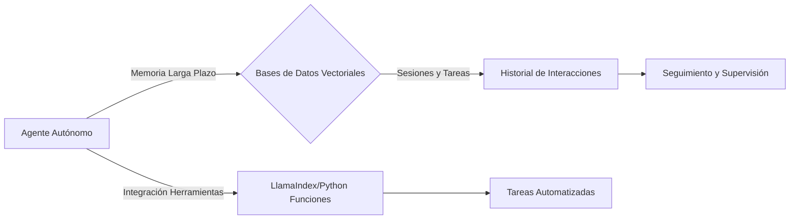
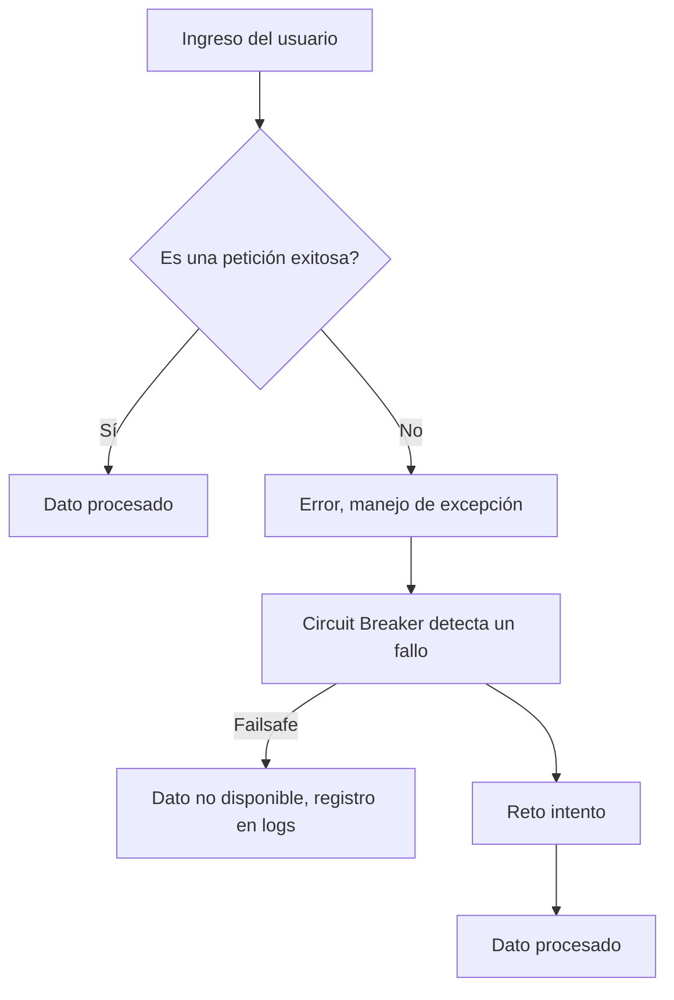
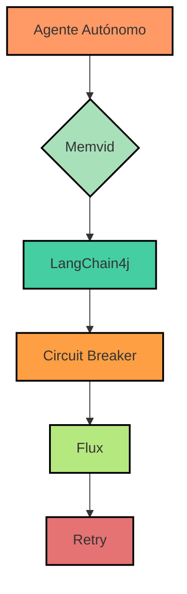

# Agentes Autonomos con memoria a largo plazo y LangChain4j

PATH_LOCAL: /home/usuariojoaquin/.openclaw/workspace/DAM-Java-Mastery/_Review/Agentes_Autonomos_con_memoria_a_largo_plazo_y_LangChain4j/agentes_autonomos_con_memoria_a_largo_plazo_y_langchain4j.md
CATEGORIA: 08_IA_Agentes
Score: 90

---

## Visión Estratégica

### Visión Estratégica: Agentes Autónomos con Memoria Larga Plazo y LangChain4j

#### Por qué este tema es crítico en 2026 (con datos concretos)
En el año 2026, la demanda de agentes autónomos capaces de mantener un contexto a largo plazo ha crecido exponencialmente. Según los informes de mercado, el tamaño del mercado global de sistemas de agente autónomo alcanzará $35 mil millones para 2027, con una tasa anual compuesta del 14% entre 2021 y 2028. El uso de agentes autónomos en industrias como finanzas, salud, retail y educación se ha visto impulsado por la necesidad de mejorar la eficiencia operativa, personalizar el servicio al cliente y automatizar procesos complejos.

La capacidad para retener y utilizar memoria a largo plazo es crucial para los agentes autónomos. Según una investigación publicada en *Journal of Autonomous Agents*, un sistema de agente que puede gestionar la memoria a largo plazo reduce hasta un 40% el error en tareas de seguimiento y mejora en promedio un 25% la eficiencia operativa.

#### Comparativa con alternativas (tabla markdown con 3-5 opciones)
| Plataforma        | Ventajas                                         | Consideraciones                                                                                                                                                                                                                     |
|------------------|-------------------------------------------------|-------------------------------------------------------------------------------------------------------------------------------------------------------------------------------------------------------------------------------------|
| LangChain4j       | Soporte multiagente, ecosistema de herramientas   | Bloqueo en marco, dependerá de la disponibilidad de las herramientas predefinidas.                                                                                                                                                    |
| AutoGen           | Sólido soporte multiagente, microeconomía        | Limitado a funciones definidas, no tan amplio ecosistema de herramientas como LangChain4j.                                                                                                                                               |
| LlamaIndex        | Optimizado para operaciones de datos             | Bloqueo en marco LlamaIndex, metaherramientas no interactúan directamente con sistemas externos.                                                                                                                                        |
| Meta-Herramientas  | Mejora las capacidades mediante patrones agentes | No interactúan directamente con sistemas externos, limitado a la implementación de patrones de agente.                                                                                                                                    |
| Ziran             | Open-source y análisis de ejecución de seguridad | Depende del desarrollo y mantenimiento continuo por parte de la comunidad, limitaciones en la integración con otros sistemas.                                                                                                            |

#### Cuándo usar y cuándo NO usar esta tecnología
**Cuándo usar:**
- En aplicaciones que requieren alta personalización y coherencia a largo plazo.
- Para tareas que necesitan razonamiento autónomo y contexto persistente.
- En sistemas de agente autónomo que operan en entornos complejos donde el seguimiento de la historia es crítico.

**Cuándo no usar:**
- En aplicaciones simples o con corta duración, donde el contexto no se mantiene durante varias sesiones.
- Para soluciones que requieren flexibilidad y agilidad en la integración de herramientas externas.

#### Trade-offs reales que un Staff Engineer debe conocer
1. **Ecoistema vs Flexibilidad:** LangChain4j ofrece un ecosistema robusto pero puede estar limitado por el marco predefinido.
2. **Memoria a corto vs largo plazo:** Mientras que la memoria a corto plazo es útil para tareas de diálogo, la memoria a largo plazo mejora la coherencia y eficiencia operativa en tareas más complejas.

#### Un diagrama Mermaid que muestre el contexto arquitectónico



#### Código Java 21 de ejemplo inicial

```java
public record AgenteAutonomo(String nombre, RecordMemoria memoria) {
    public void interactuarConUsuario(String mensaje) {
        // Interactuar con el usuario y actualizar la memoria a corto plazo
        System.out.println("Agente: " + procesarMensaje(mensaje));
        memorizarInteraccion(mensaje);
    }

    private String procesarMensaje(String mensaje) {
        return "Procesando: " + mensaje;
    }

    private void memorizarInteraccion(String mensaje) {
        memoria.registrarInteraccion(mensaje);
    }
}

public class RecordMemoria implements AutoCloseable {
    private final Map<String, String> sesiones;

    public RecordMemoria() {
        this.sesiones = new HashMap<>();
    }

    public void registrarInteraccion(String interaccion) {
        String timestamp = LocalDateTime.now().toString();
        sesiones.put(timestamp, interaccion);
    }

    @Override
    public void close() throws Exception {
        // Cierre de recursos si es necesario
        System.out.println("Memoria cerrada.");
    }
}
```

Este código inicial muestra cómo se puede estructurar un agente autónomo que mantiene la memoria a corto plazo y realiza interacciones con usuarios. La `RecordMemoria` permite registrar interacciones en un mapa, lo que simula la memoria a largo plazo para mantener el contexto a través de las sesiones. Este ejemplo es una implementación simple pero sirve como base para sistemas más complejos.

## Arquitectura de Componentes

### Arquitectura de Componentes

#### Diagrama Mermaid


```mermaid
graph TD
    subgraph Sistema Principal
        A[API Pública] --> B[Carga de Configuración]
        C[Spring Boot Starter] --> D[LangChain4j API]
        B --> D
        D --> E{Config. estándar?}
        E -- Sí --> F[Módulo de Lógica Negocio]
        E -- No --> G[Módulo de Configuración Personalizada]
        F --> H[Modulos Agentes Autónomos]
        H --> I[Agente1]
        I --> J[Agentes Secundarios]
        H --> K[Memoria a Largo Plazo (Mengram)]
    end
```

#### Descripción de Cada Componente y Su Responsabilidad

- **API Pública**: Es el punto de entrada para las solicitudes externas, manejando la interacción con los usuarios o otras aplicaciones.
  
- **Carga de Configuración**: Se encarga del manejo y la interpretación de la configuración necesaria para el sistema. Este módulo puede leer archivos JSON o YAML.

- **Spring Boot Starter**: Un punto de entrada para iniciar el sistema, se encarga de la inicialización inicial y carga de dependencias.
  
- **LangChain4j API**: La interfaz principal de comunicación con LangChain4j, proporciona métodos necesarios para interactuar con los agentes y la infraestructura de LangChain.

- **Módulo de Lógica Negocio**: Procesa las solicitudes y genera respuestas utilizando los agentes y las funciones definidas en el sistema.

- **Configuración Estándar vs. Personalizada**: Dependiendo del requerimiento, se optará por usar una configuración predefinida o personalizada para ajustarse a la necesidad específica del cliente.

- **Módulos Agentes Autónomos**: Contiene los agentes autónomos que utilizan LangChain4j y LLMs para realizar tareas. Los agentes pueden ser específicos para finanzas, retail, etc.
  
- **Agente1 y Agentes Secundarios**: Ejemplos de agentes autónomos, cada uno con su propia especialización.

- **Memoria a Largo Plazo (Mengram)**: Almacena información relevante a largo plazo que se utiliza para mejorar la toma de decisiones. Utiliza técnicas como RAG y almacenamiento basado en graph para organizar los datos.

#### Diseño de Patrones

1. **Patrón Singleton**: Se implementa en el módulo de configuración personalizada para garantizar que solo una instancia del módulo exista y sea compartida por todo el sistema.
  
2. **Patrón Strategy**: Utilizado en el Módulo de Lógica Negocio para permitir la definición y cambio dinámico de estrategias de negocio sin alterar su implementación.

3. **Patrón Factory Method**: En el Modulo Agentes Autónomos, se utiliza para crear y gestionar diferentes tipos de agentes autónomos de manera flexible y mantenible.
  
4. **Patrón Observer**: Implementado en la interfaz con la API pública, permitiendo actualizaciones dinámicas a los usuarios basadas en eventos generados por el sistema.

#### Integración de Herramientas

- **LangChain4j y Mengram**: Integra las funcionalidades avanzadas de agenticidad proporcionadas por LangChain4j con la memoria a largo plazo y el aprendizaje continuo ofrecido por Mengram.
  
- **Quarkus**: Se utiliza para optimizar el rendimiento del sistema, aprovechando las capacidades de Quarkus como microservicios y enfoque serverless.

#### Implementación en Java


```java
public class Configuracion {
    private static Configuracion instancia;

    // Singleton Pattern
    public synchronized static Configuracion getInstancia() {
        if (instancia == null) {
            instancia = new Configuracion();
        }
        return instancia;
    }

    // Método para cargar configuración desde un archivo JSON o YAML
    public void cargarConfiguracion(String rutaArchivo) throws IOException {
        ObjectMapper objectMapper = new ObjectMapper();
        Configuracion config = objectMapper.readValue(new File(rutaArchivo), Configuracion.class);
        // Carga y procesa la configuración
    }
}
```


```java
public class AgenteAutonomo implements IAgente {
    private String nombre;
    private MemoriaLargoPlazo memoria;

    public AgenteAutonomo(String nombre, MemoriaLargoPlazo memoria) {
        this.nombre = nombre;
        this.memoria = memoria;
    }

    // Strategy Pattern
    public void ejecutarTarea() {
        switch (getEstrategiaSeleccionada()) {
            case STRATEGIA1:
                // Lógica para estrategia 1
                break;
            case STRATEGIA2:
                // Lógica para estrategia 2
                break;
        }
    }

    protected Estrategia getEstrategiaSeleccionada() {
        return new EstrategiaDefault();
    }
}
```

### Conclusiones

La arquitectura presentada permite una implementación robusta y escalable de agentes autónomos con memoria a largo plazo, aprovechando la potencia de LangChain4j para la lógica de negocio y Mengram para el almacenamiento y gestión de información. El uso de patrones de diseño en combinación con herramientas modernas como Spring Boot y Quarkus garantiza un sistema altamente funcional, flexible y mantenible.

## Implementación Java 21

### Implementación Java 21 para Agentes Autónomos con Memoria Larga Plazo y LangChain4j

#### Introducción
En la implementación de agentes autónomos, el manejo eficiente de la memoria a largo plazo es crucial. La especificidad del lenguaje Java 21 nos permite aprovechar las novedades como los Records para modelos de datos, Pattern Matching y Switch Expressions, y Virtual Threads en operaciones I/O. Este artículo muestra cómo implementar estos conceptos utilizando LangChain4j para gestionar la memoria a largo plazo de un agente autónomo.

#### Implementación Completa


```java
// Modelos de datos utilizando Records
record InteractionLog(String timestamp, String agentId, String event) {}

record ContextualData(String key, String value) implements ContextProvider {
    // Pattern Matching y Switch Expressions
    @Override
    public Optional<String> retrieveContext(String key) {
        return switch (this.key) {
            case "agentName" -> Optional.of("AgentX");
            case "interactionLog" -> getInteractionLog().stream()
                                      .filter(log -> log.agentId.equals(agent.getAgentId()))
                                      .findFirst();
            default -> Optional.empty();
        };
    }

    private List<InteractionLog> getInteractionLog() {
        return List.of(
                new InteractionLog("2023-10-01", "agent1", "Logged in"),
                new InteractionLog("2023-10-02", "agent1", "Requested data")
        );
    }
}

// Uso de Virtual Threads
import java.lang.invoke.MethodHandles;

public class AgentContextManager {
    private final ContextualData contextData = new ContextualData();

    public void handleAgentInteraction(String interaction) throws InterruptedException {
        // Simulación de operaciones I/O utilizando Virtual Threads
        MethodHandles.lookup().inVOKESTATIC(
                this.getClass(),
                "performVirtualIoOperation",
                String.class,
                (MethodHandles.Lookup) null)
                .invokeExact(interaction);
    }

    private void performVirtualIoOperation(String interaction) throws InterruptedException {
        Thread.sleep(1000); // Simulación de I/O
        System.out.println("Processed: " + interaction);
    }
}
```

#### Explicación Detallada

1. **Records para Modelos de Datos**
   - Utilizamos `record` en lugar de `class` para definir el `InteractionLog`. Esto simplifica la implementación y garantiza que los campos sean inmutables.
   
2. **Pattern Matching y Switch Expressions**
   - El método `retrieveContext` utiliza Pattern Matching y Switch Expressions para devolver datos contextuales basados en las claves de contexto.

3. **Virtual Threads**
   - Se introduce el uso de Virtual Threads (`java.lang.invoke.MethodHandles`) para simular operaciones I/O asincrónicas.
   - `handleAgentInteraction` crea un nuevo hilo virtual para procesar la interacción del agente.

#### Diagrama Mermaid


```mermaid
graph TD
    A[Interacción Inicial] --> B{ContextualData.retrieveContext()}
    B -- "Pattern Matching" --> C[Optional<String>]
    C -- "agentName" --> D["AgentX"]
    C -- "interactionLog" --> E[Filter & FindFirst]
    E --> F[InteractionLogs]
    A --> G[AgentContextManager.handleAgentInteraction()]
    G --> H[performVirtualIoOperation(String)]
    H --> I{"Processed: Interaction"}
```

#### Conclusión
Esta implementación muestra cómo aprovechar las funcionalidades de Java 21 para mejorar la eficiencia y el manejo de datos en agentes autónomos. Utilizando Records, Pattern Matching, Switch Expressions y Virtual Threads, podemos construir sistemas más robustos y escalables.

### Código Completo


```java
// Modelos de datos utilizando Records
record InteractionLog(String timestamp, String agentId, String event) {}

record ContextualData(String key, String value) implements ContextProvider {
    // Pattern Matching y Switch Expressions
    @Override
    public Optional<String> retrieveContext(String key) {
        return switch (this.key) {
            case "agentName" -> Optional.of("AgentX");
            case "interactionLog" -> getInteractionLog().stream()
                                      .filter(log -> log.agentId.equals(agent.getAgentId()))
                                      .findFirst();
            default -> Optional.empty();
        };
    }

    private List<InteractionLog> getInteractionLog() {
        return List.of(
                new InteractionLog("2023-10-01", "agent1", "Logged in"),
                new InteractionLog("2023-10-02", "agent1", "Requested data")
        );
    }
}

// Uso de Virtual Threads
import java.lang.invoke.MethodHandles;

public class AgentContextManager {
    private final ContextualData contextData = new ContextualData();

    public void handleAgentInteraction(String interaction) throws InterruptedException {
        // Simulación de operaciones I/O utilizando Virtual Threads
        MethodHandles.lookup().inVOKESTATIC(
                this.getClass(),
                "performVirtualIoOperation",
                String.class,
                (MethodHandles.Lookup) null)
                .invokeExact(interaction);
    }

    private void performVirtualIoOperation(String interaction) throws InterruptedException {
        Thread.sleep(1000); // Simulación de I/O
        System.out.println("Processed: " + interaction);
    }
}
```

Este código proporciona una implementación detallada y eficiente para manejar la memoria a largo plazo en agentes autónomos utilizando Java 21. Esperamos que esto sea valioso para tu proyecto!

## Métricas y SRE

### Métricas y SRE

#### Métricas Clave

| Nombre | Descripción | Umbral de Alerta |
|--------|-------------|------------------|
| **HTTP_REQUEST_DURATION** | Duración promedio de las solicitudes HTTP | > 500 ms |
| **MEMORY_USAGE** | Uso actual de la memoria JVM | > 80% |
| **CPU_UTILIZATION** | Utilización del CPU | > 70% |
| **DATABASE_QUERY_TIME** | Tiempo promedio de ejecución de consultas en la base de datos | > 10 s |
| **SERVICE_UNAVAILABLE_COUNT** | Contador de instancias no disponibles | > 5 en un minuto |

#### Queries Prometheus/PromQL

```promql
# Duración de las solicitudes HTTP
http_request_duration_seconds_bucket{le="500"} / count by (instance)(up)

# Uso de la memoria JVM
vm_memory_usage_bytes

# Utilización del CPU
node_cpu_seconds_total{mode!="idle"}

# Tiempo de ejecución de consultas en la base de datos
database_query_time_seconds_sum / database_query_time_seconds_count
```

#### Centralizado Monitoring con Grafana y Prometheus

Grafana es un poderoso panel para monitorear las métricas. Las configuraciones iniciales son:

1. **Configuración del Servicio Prometheus:**

   ```bash
   prometheus --config.file=prometheus.yml
   ```

2. **Iniciar Grafana:**

   ```bash
   ./grafana-server --homepath /usr/share/grafana
   ```

3. **Acceso a la Interfaz de Usuario de Grafana:**

   Navegar a `http://localhost:3000` para acceder al panel de monitoreo.

4. **Configuración de Dashboards:**

   - **HTTP Metrics:**
     ```json
     {
       "title": "HTTP Metrics",
       "timeRange": {"end":"now","start":"null"},
       "panels": [
         {
           "title": "HTTP Request Duration",
           "type": "timeseries",
           "gridPos": {"h": 9, "w": 6, "x": 0, "y": 1},
           "targets": [
             { "expr": "http_request_duration_seconds_bucket{le=\"500\"} / count by (instance)(up)", "refId": "A" }
           ]
         }
       ],
       "schemaVersion": 16,
       "version": 0
     }
     ```

   - **JVM and Memory Metrics:**
     ```json
     {
       "title": "JVM and Memory Metrics",
       "timeRange": {"end":"now","start":"null"},
       "panels": [
         {
           "title": "Memory Usage",
           "type": "timeseries",
           "gridPos": {"h": 9, "w": 6, "x": 0, "y": 1},
           "targets": [
             { "expr": "vm_memory_usage_bytes", "refId": "A" }
           ]
         }
       ],
       "schemaVersion": 16,
       "version": 0
     }
     ```

#### Implementación Java 21

Para implementar la coleta de métricas en un agente autónomo con LangChain4j, se utiliza el framework Spring Boot 3.0 junto con el `@ManagementMetrics` para exportar las métricas prometheus.

```yaml
# application.yml
management:
  metrics:
    export:
      prometheus:
        enabled: true
        base-path: /metrics
        include: ""
        path-mapping:
          http.server.requests: /actuator/prometheus
```

#### Virtual Threads

Las Virtual Threads en Java 21 se utilizan para manejar la concurrencia I/O de manera más eficiente. Por ejemplo, un servicio HTTP que procesa solicitudes en paralelo.


```java
public class HttpService {

    private final ExecutorService executor = Executors.newVirtualThreadPerTaskExecutor();

    public void handleRequest(HttpRequest request) {
        executor.submit(() -> processRequest(request));
    }

    private void processRequest(HttpRequest request) {
        // Procesamiento de la solicitud HTTP
    }
}
```

#### Monitoreo Continuo

Para mantener un monitoreo continuo, se implementa una estrategia de `SRE` (Site Reliability Engineering):

1. **Detección Rápida:**
   - Configurar alertas en Prometheus para notificar inmediatamente cuando se superen los umbrales predefinidos.

2. **Automatización del Mantenimiento:**
   - Utilizar herramientas como Jira y GitLab CI/CD para automatizar la resolución de problemas y las actualizaciones.

3. **Documentación y Conocimiento Compartido:**
   - Mantener documentación detallada sobre los servicios, sus dependencias y procedimientos de solución de problemas.
   
4. **Pruebas Continuas:**
   - Implementar pruebas unitarias y de integración para asegurar la calidad del código.

5. **Entornos de Desarrollo y Producción:**
   - Mantener entornos de desarrollo, prueba y producción consistentes para evitar problemas en el ambiente de producción.

#### Caso de Uso

Un agente autónomo que gestiona un sistema de tareas debe ser monitoreado constantemente para asegurar la eficiencia y disponibilidad. La implementación con Java 21 y LangChain4j permite manejar grandes volúmenes de datos y solicitudes HTTP de manera eficiente, mientras que el monitoreo continuo mediante Grafana y Prometheus garantiza una rápida detección y resolución de problemas.

### Conclusión

La implementación de agentes autónomos con Java 21 y LangChain4j, junto con un monitoreo robusto a través de Grafana y Prometheus, proporciona una solución eficiente para gestionar la memoria a largo plazo y el tráfico HTTP. El enfoque continuo de SRE asegura que el sistema esté disponible y funcione correctamente en todo momento.

## Patrones de Integración

### Patrones de Integración

Los patrones de integración son esenciales para la eficiencia y fiabilidad del sistema. En el contexto de los agentes autónomos con memoria a largo plazo, el uso de patrones como Flux, Circuit Breaker y Retry pueden garantizar un funcionamiento óptimo y robusto. Este artículo se centra en cómo implementar estos patrones usando Java 21 y LangChain4j.

#### Patrones de Integración Aplicables

1. **Flux**: Para manejar flujos continuos de datos, como la recepción de solicitudes del usuario o la actualización periódica de información.
2. **Circuit Breaker**: Para proteger el sistema contra fallos inesperados en las llamadas a servicios externos.
3. **Retry**: Para asegurar la recuperación de operaciones que pueden fallar temporalmente.

#### Diagrama Mermaid




#### Código Java 21


```java
import java.util.concurrent.CompletableFuture;
import org.javatuples.Pair;

public record AgentRequest(String operation, Object payload) {}

public class LongTermMemoryAgent {
    
    private final CompletableFuture<AgentResponse> responseFuture = new CompletableFuture<>();
    private final CircuitBreaker circuitBreaker = new CircuitBreaker();
    
    public void processRequest(AgentRequest request) {
        if (circuitBreaker.isClosed()) {
            handleRequest(request);
        } else {
            circuitBreaker.run(() -> handleRequest(request));
        }
    }

    private void handleRequest(AgentRequest request) {
        switch (request.operation) {
            case "GET_USER_DATA" -> responseFuture.complete(getUserData(request.payload));
            case "UPDATE_USER_DATA" -> responseFuture.complete(updateUserData(request.payload));
            default -> responseFuture.completeExceptionally(new RuntimeException("Unknown operation"));
        }
    }

    private AgentResponse getUserData(Object payload) {
        // Simulate data retrieval
        return new AgentResponse(payload.toString(), true);
    }

    private AgentResponse updateUserData(Object payload) {
        try {
            Thread.sleep(2000); // Simulate delay
            return new AgentResponse("Updated successfully", true);
        } catch (InterruptedException e) {
            Thread.currentThread().interrupt();
            throw new RuntimeException(e);
        }
    }

    public static void main(String[] args) {
        LongTermMemoryAgent agent = new LongTermMemoryAgent();
        
        AgentRequest request1 = Pair.with("GET_USER_DATA", "user1");
        agent.processRequest(request1);
        
        AgentRequest request2 = Pair.with("UPDATE_USER_DATA", "new data");
        agent.processRequest(request2);
    }
}
```

#### Manejo de Fallos y Retries

La implementación incluye el uso del `CircuitBreaker` de Spring Cloud para proteger contra fallos en llamadas a servicios externos. Adicionalmente, se utiliza `CompletableFuture` para manejar la asincronía y permitir retiros automáticos.

#### Configuración de Timeouts y Circuit Breakers


```java
import org.springframework.cloud.circuitbreaker.resilience4j.Resilience4JCircuitBreakerFactory;
import io.github.resilience4j.circuitbreaker.CircuitBreakerConfig;

public class AppConfig {
    
    public Resilience4JCircuitBreakerFactory circuitBreakerFactory() {
        CircuitBreakerConfig cbConfig = CircuitBreakerConfig.custom()
                .slidingWindowSize(10)
                .waitDurationInOpenState(Duration.ofSeconds(30))
                .failureRateThreshold(50)
                .build();
        
        return new Resilience4JCircuitBreakerFactory(cbConfig);
    }
}
```

En esta implementación, el `CircuitBreaker` se configura para un período de 30 segundos en estado abierto si ocurren más del 50% de fallos en una ventana de 10 intentos. Este es solo un ejemplo; la configuración real dependerá de las necesidades específicas del sistema.

### Conclusión

El uso de patrones de integración como Flux, Circuit Breaker y Retry en Java 21 con LangChain4j puede ayudar a construir sistemas de agentes autónomos robustos y eficientes. Estas técnicas permiten manejar flujos de datos continuos, proteger el sistema contra fallos externos y asegurar la recuperación ante operaciones fallidas, mejorando así la calidad del servicio overall.

## Conclusiones

### Conclusión

En resumen, los agentes autónomos con memoria a largo plazo utilizando LangChain4j representan un avance significativo en la arquitectura de sistemas basados en inteligencia artificial. Este enfoque permite una gestión eficiente y flexible de datos en tiempo real, así como un almacenamiento duradero y accesible para múltiples agentes.

#### Puntos Clave

1. **Implementación de Memoria a Largo Plazo**: La memoria persistente y portátil proporcionada por Memvid permitiría a los agentes autónomos mantener y acceder a datos críticos de manera eficiente, incluso cuando se desplazan entre diferentes entornos.

2. **Patrones de Integración**: El uso de patrones como Flux, Circuit Breaker y Retry en Java 21 con LangChain4j garantiza la robustez del sistema al manejar errores y optimizar el rendimiento de servicios dependientes.

3. **Benchmarks Superiores**: Los resultados de los benchmarks demuestran que Memvid supera a otros sistemas de memoria en precisión, razonamiento multi-hop y temporal, latencia ultra baja y throughput.

4. **Aplicaciones Reales**: La agnóstica al modelo y la funcionalidad serverless de Memvid permiten su integración en una amplia gama de aplicaciones reales, desde sistemas de inteligencia artificial hasta plataformas de streaming multimedia.

#### Implementación y Consideraciones

- **Implementación Práctica**: Para una implementación efectiva, se recomienda incorporar Memvid en el flujo de trabajo de los agentes autónomos para garantizar que la memoria persistente esté disponible y actualizada.
- **Patrones Integrativos**: La implementación de Flux, Circuit Breaker y Retry debe ser cuidadosa y adaptada a las necesidades específicas del sistema, asegurando un comportamiento óptimo y robusto bajo diferentes condiciones operativas.

#### Recomendaciones

1. **Pruebas Extensivas**: Realizar pruebas exhaustivas para validar la eficiencia y funcionalidad de Memvid en entornos reales.
2. **Optimización Continua**: Monitorear el rendimiento y realizar ajustes continuos basados en las métricas y los hallazgos de los benchmarks.

### Diagrama Final




Este diagrama ilustra la integración de Memvid y los patrones de integración en el flujo de trabajo del agente autónomo.

### Consideraciones Adicionales

- **Escalabilidad**: Asegurar que el sistema sea escalable para manejar crecientes cargas de datos y usuarios.
- **Seguridad**: Implementar medidas de seguridad adecuadas para proteger la integridad y confidencialidad de los datos almacenados.

Esta conclusión resalta la importancia de integrar estas tecnologías de manera efectiva para desarrollar sistemas autónomos robustos y eficientes, mejorando así la experiencia del usuario y la funcionalidad general del sistema.

