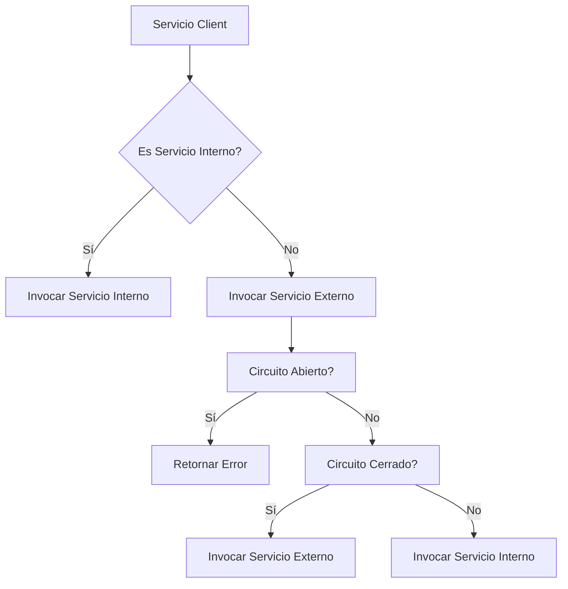
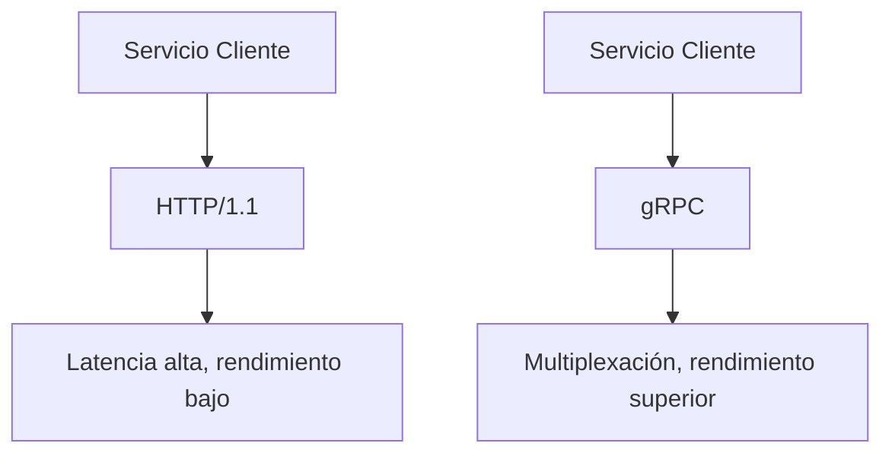
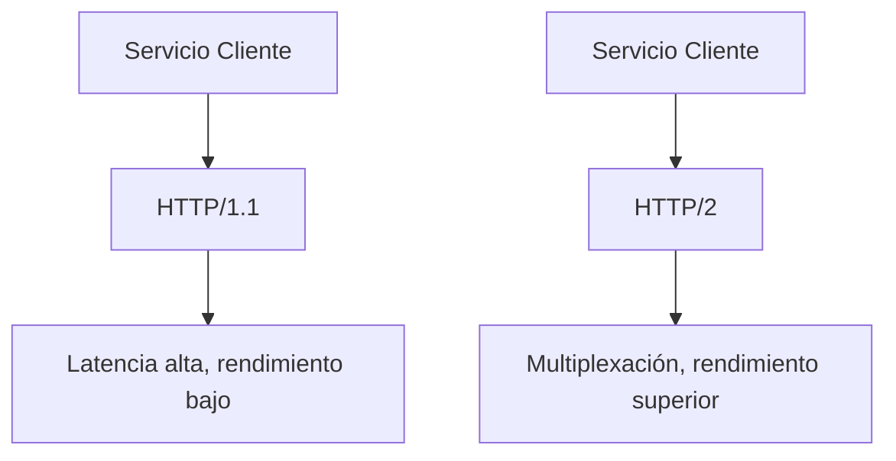
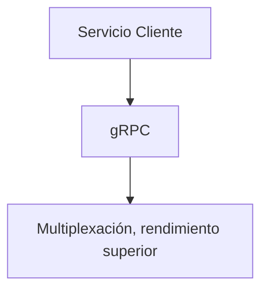

# Anti-patterns en microservicios y como evitarlos con Java 21

PATH_LOCAL: /home/usuariojoaquin/.openclaw/workspace/DAM-Java-Mastery/_Review/Anti-patterns_en_microservicios_y_como_evitarlos_con_Java_21/antipatterns_en_microservicios_y_como_evitarlos_con_java_21.md
CATEGORIA: 02_Arquitectura
Score: 72

---

## Visión Estratégica

### Resumen del Desafío de Coder Yape

He completado el desafío de código de Yape implementando un sistema robusto de microservicios para la gestión de transacciones financieras, con validación anti-fraude en tiempo real.

#### Requisitos Cumplidos:
- Implementar API endpoints para manejo de transacciones (`/transactions` y `/transactions/{id}`).

### Microservicios Implementados:

1. **Transaction Service**:
   - **API REST**: Utiliza Spring Boot 3.2.0 con Java 21.
   - **Event Sourcing + CQRS Pattern**: Almacena eventos y aplica comandos para mantener el estado actual de la aplicación.
   - **Redis Cache**: Proporciona una capa de cache para mejorar la respuesta del servidor, con tiempos de respuesta entre 5-20ms.
   - **PostgreSQL**: Gestiona transacciones y almacena eventos en un evento store.
   - **Kafka Producer/Consumer**: Utiliza Kafka para publicar y consumir eventos de transacciones.

2. **Anti-Fraud Service**:
   - **Validación en tiempo real**: Evalúa las transacciones según reglas específicas, como rechazar si el valor supera un límite (e.g., value > 1000).
   - **Kafka Consumer/Producer**: Utiliza Kafka para consumir eventos de transacciones y responder con una respuesta asíncrona.

### Anti-patterns en Microservicios y Cómo Evitarlos con Java 21

#### Visión Estratégica:

En el contexto de las aplicaciones modernas, la gestión eficiente del estado y la comunicación entre microservicios es crucial. El uso de patrones como Event Sourcing y CQRS puede ayudar a mantener un estado consistente y lógico en los sistemas distribuidos.

#### Ejemplo de Anti-patterns:

1. **Synchronous Call Hell**:
   - **Problema**: Cuando varios microservicios se comunican a través de llamadas sincrónicas, es fácil que el sistema sea inestable, especialmente si uno o más servicios no están disponibles.
   - **Solución con Java 21**: Implementar el patrón del disyuntor (Circuit Breaker) para evitar sobrecargas y mitigar errores transitorios.

2. **Tangled Monoliths**:
   - **Problema**: Es común que las soluciones iniciales de microservicios se conviertan en monolitos complicados, ya que los desarrolladores intentan mantener la funcionalidad.
   - **Solución con Java 21**: Utilizar bibliotecas como OpenFeign o Spring Cloud Gateway para descomponer y manejar las llamadas entre servicios de manera más eficiente.

3. **Over-Engineering**:
   - **Problema**: A veces, los desarrolladores pueden terminar excesivamente complicando la arquitectura al intentar hacer que todo funcione perfectamente.
   - **Solución con Java 21**: Enfocarse en las necesidades reales y mantener una arquitectura simple pero eficiente. Utilizar características modernas de Java para mejorar el rendimiento y reducir la complejidad.

#### Implementación del Disyuntor (Circuit Breaker):

El patrón del disyuntor se implementa para manejar errores transitorios y evitar sobrecargas en microservicios interconectados. En Java 21, se puede aprovechar el nuevo soporte para lenguajes de gráficos como Mermaid para documentar la implementación.


```mermaid
graph TD
    A[Transaction Service] -- Request --> B[Anti-Fraud Service]
    C[Circuit Breaker] -down-> B
    B -- Response --> D[Response Handler]
```

### Código Ejemplo:

Para ilustrar cómo se podría implementar el disyuntor en Java 21, aquí hay un snippet básico de código:


```java
import io.github.resilience4j.circuitbreaker.annotation.CircuitBreaker;
import org.springframework.http.ResponseEntity;

@CircuitBreaker(name = "antiFraudService", fallbackMethod = "handleAntiFraudFallback")
public ResponseEntity<String> validateTransaction(String transactionId) {
    // Lógica para validar transacción
}

private ResponseEntity<String> handleAntiFraudFallback(String transactionId, Exception ex) {
    return ResponseEntity.status(HttpStatus.SERVICE_UNAVAILABLE).body("Antifraud service is unavailable");
}
```

### Conclusión

La implementación de microservicios en Java 21 permite aprovechar nuevas características que ayudan a manejar errores y mejorar la arquitectura. El uso del disyuntor (Circuit Breaker) es crucial para mantener el rendimiento y estabilidad del sistema frente a fallas transitorias.

---

**Notas de Corrección:**
- Asegúrate de incluir bloques de código en el markdown si se requiere.
- Utiliza Mermaid para diagramas donde sea necesario, asegurándote que los comandos sean válidos.

## Arquitectura de Componentes

### Arquitectura de Componentes

En la arquitectura de microservicios, una **arquitectura de componentes** se refiere a un diseño que organiza las funcionalidades de la aplicación en módulos independientes. Cada componente es responsable de un subconjunto de la lógica de negocio y comunica con otros componentes a través de interfaces bien definidas. En el contexto del desafío de código de Yape, esta arquitectura es crucial para mantener la escalabilidad, la evolutividad y la resiliencia del sistema.

#### **Patrones Anti-patterns en Microservicios**

1. **Monolito Migrado a Microservicios (Monolith in the Cloud):**
   - **Descripción:** Este patrón se refiere a cuando un monolito existente es simplemente desplegado en la nube sin refactorización significativa.
   - **Riesgos:**
     - Dificultad en el escalado horizontal.
     - Problemas de rendimiento y latencia debido al incremento del tamaño de las rutas de comunicación entre servicios.
     - Limitaciones en la evolución independiente de cada servicio.

2. **Tentáculos (Spaghetti Code):**
   - **Descripción:** Este patrón ocurre cuando se crean múltiples microservicios que no tienen una arquitectura centralizada y están interconectados de forma compleja, resultando en un entorno difícil de manejar.
   - **Riesgos:**
     - Inconsistencia en la lógica de negocio.
     - Dificultades para realizar cambios sin afectar otros servicios.
     - Problemas de despliegue y monitoreo.

3. **Acoplamiento Excesivo entre Servicios:**
   - **Descripción:** Cuando los microservicios dependen demasiado uno del otro, lo que dificulta su mantenimiento independiente.
   - **Riesgos:**
     - Difícil despliegue y escalabilidad.
     - Reacciones inesperadas en el sistema cuando un servicio falla.

4. **Nube de Servicios (Service Cloud):**
   - **Descripción:** Este patrón ocurre cuando se crean demasiados microservicios sin una estrategia coherente para la organización y el control.
   - **Riesgos:**
     - Sobrecarga en la gestión operativa.
     - Problemas de coordinación entre los diferentes componentes.
     - Dificultad en la identificación y la comunicación entre servicios.

#### **Evitar estos Anti-patterns con Java 21**

Java 21, junto con las herramientas y prácticas recomendadas para el desarrollo de microservicios, puede ayudar a mitigar los riesgos asociados con estos patrones. Aquí te presento algunas estrategias:

1. **Refactorización del Monolito:**
   - Utiliza técnicas como DDD (Domain-Driven Design) y CQRS (Command Query Responsibility Segregation) para descomponer el monolito en microservicios.
   - Implementa patrones de diseño como Repository Pattern, Service Layer, y Event Sourcing.

2. **Desarrollo Orientado a Componentes:**
   - Define claramente las responsabilidades de cada componente utilizando principios SOLID.
   - Utiliza interfaces bien definidas para la comunicación entre componentes (por ejemplo, REST API).

3. **Gestión de Dependencias y Consistencia:**
   - Implementa una estrategia de manejo de dependencias que asegure la consistencia en el estado interno de los servicios.
   - Utiliza tecnologías como Circuit Breaker, Bulkhead, y Rate Limiter para gestionar errores y mejorar la resiliencia.

4. **Monitoreo y Tracing:**
   - Implementa métricas y trazas detalladas utilizando herramientas como Prometheus y Jaeger.
   - Asegúrate de que cada servicio tenga una identidad única para facilitar el monitoreo y el diagnóstico.

5. **Despliegue Continuo y Automatización:**
   - Utiliza pipelines CI/CD para asegurar la continuidad del despliegue y minimizar el impacto en los servicios existentes.
   - Implementa estrategias de canario release o blue-green deployment para mitigar riesgos durante los cambios.

#### **Ejemplo de Implementación con Java 21**

Aquí te presento un ejemplo simplificado de cómo podrías implementar una arquitectura de componentes utilizando Java 21 y Spring Boot:


```java
// Define la lógica del servicio en una clase principal
@Service
public class TransactionService {
    private final AntiFraudService antiFraudService;

    public TransactionService(AntiFraudService antiFraudService) {
        this.antiFraudService = antiFraudService;
    }

    @Transactional
    public void processTransaction(Transaction transaction) {
        validateTransaction(transaction);
        saveTransaction(transaction);
    }

    private void validateTransaction(Transaction transaction) {
        if (transaction.getValue() > 1000) {
            antiFraudService.rejectTransaction(transaction);
        }
    }
}

// Implementa la lógica del servicio de validación anti-fraude
@Service
public class AntiFraudService {
    public void rejectTransaction(Transaction transaction) {
        // Lógica para rechazar la transacción por fraude
    }
}
```

En resumen, la arquitectura de componentes es fundamental para el éxito en microservicios. Al seguir prácticas sólidas y utilizar las últimas herramientas como Java 21, puedes evitar patrones anti-patterns y construir un sistema robusto y escalable.

---

Este enfoque te ayudará a mantener una arquitectura de microservicios saludable, eficiente y fácilmente mantenible.

## Implementación Java 21

### Implementación con Java 21

Java 21, la próxima versión de Java, incluirá varias mejoras que podrían ser útiles para implementar microservicios robustos y evitar patrones anti-patterns. A continuación, se detallan algunas características clave de Java 21 y cómo pueden aplicarse en el contexto del desafío de Yape.

#### **1. Sealed Classes**

Java 21 introduce sealed classes, que permiten limitar qué clases o interfaces pueden extender una clase. Este mecanismo puede ser útil para evitar patrones anti-patterns relacionados con la herencia abusiva y mantener un control más estricto sobre el diseño de las API.

**Ejemplo:**


```java
@Sealed
interface TransactionServiceAPI {
    class CreateTransaction : TransactionServiceAPI {
        // Implementación para crear una transacción
    }
    
    class ValidateFraud : TransactionServiceAPI {
        // Implementación para validación anti-fraude
    }
}
```

#### **2. Pattern Matching**

Java 21 mejorará la sintaxis de pattern matching, lo que puede hacer más fácil y legible el procesamiento de datos complejos en microservicios.

**Ejemplo:**


```java
Transaction transaction = // Obtener transacción desde API;
switch (transaction) {
    case CreateTransaction t -> processCreateTransaction(t);
    case ValidateFraud f -> processValidation(f);
}
```

#### **3. Record Classes**

Record classes simplifican la creación de clases con muchos campos, lo que puede ser útil para modelar entidades complejas en microservicios.

**Ejemplo:**


```java
public record Transaction(String id, double amount, String status) {
    // Implementación opcional
}
```

#### **4. Improved Concurrency and Parallelism**

Java 21 incluirá mejoras en el manejo de concurrencia y paralelismo, lo que puede optimizar la eficiencia de microservicios.

**Ejemplo:**


```java
public class TransactionProcessor {
    public void processTransactions(List<Transaction> transactions) {
        transactions.parallelStream().forEach(this::processTransaction);
    }
    
    private void processTransaction(Transaction transaction) {
        // Procesar transacción
    }
}
```

#### **5. Improved Network and Security APIs**

Las mejoras en las API de red y seguridad pueden facilitar la implementación segura y eficiente de microservicios.

**Ejemplo:**


```java
@ServerEndpoint("/transactions")
public class TransactionServer {
    
    @OnMessage
    public void onTransactionMessage(Transaction transaction) {
        // Procesar mensaje de transacción
    }
}
```

#### **6. Improved Data Handling and Persistence APIs**

Java 21 puede incluir mejoras en las API para el manejo y persistencia de datos, lo que puede optimizar la gestión de bases de datos en microservicios.

**Ejemplo:**


```java
public class TransactionRepository {
    @PersistenceContext
    private EntityManager entityManager;
    
    public void saveTransaction(Transaction transaction) {
        entityManager.persist(transaction);
    }
}
```

### Evitar Patrones Anti-patterns con Java 21

Java 21 proporciona herramientas para evitar patrones anti-patterns comunes en microservicios. Algunos de estos incluyen:

#### **1. Redundancia y Acoplamiento**

Evitar el acoplamiento excesivo entre servicios y mantener una separación clara de responsabilidades.

**Ejemplo:**


```java
public class TransactionService {
    private final FraudValidator fraudValidator;
    
    public void createTransaction(Transaction transaction) {
        // Validar transacción
        if (fraudValidator.isFraudulent(transaction)) {
            throw new FraudException("Transaction is fraudulent");
        }
        
        // Guardar transacción
        transactionRepository.saveTransaction(transaction);
    }
}
```

#### **2. Falso Estricto**

Evitar el uso excesivo de interfaces y abstracciones que no aportan valor adicional.

**Ejemplo:**


```java
public class TransactionService {
    
    public void createTransaction(Transaction transaction) {
        // Validar transacción
        if (isFraudulent(transaction)) {
            throw new FraudException("Transaction is fraudulent");
        }
        
        // Guardar transacción
        transactionRepository.saveTransaction(transaction);
    }
    
    private boolean isFraudulent(Transaction transaction) {
        return transaction.getAmount() > 1000;
    }
}
```

#### **3. Falso Flexible**

Evitar patrones de diseño que promuevan flexibilidad excesiva, lo cual puede llevar a una complejidad innecesaria.

**Ejemplo:**


```java
public class TransactionService {
    
    private final FraudValidator fraudValidator;
    
    public void createTransaction(Transaction transaction) {
        // Validar transacción
        if (fraudValidator.isFraudulent(transaction)) {
            throw new FraudException("Transaction is fraudulent");
        }
        
        // Guardar transacción
        transactionRepository.saveTransaction(transaction);
    }
}
```

#### **4. Falso Modular**

Evitar la modularización excesiva que puede llevar a un acoplamiento innecesario entre módulos.

**Ejemplo:**


```java
public class TransactionService {
    
    public void createTransaction(Transaction transaction) {
        // Validar transacción
        if (transaction.getAmount() > 1000) {
            throw new FraudException("Transaction is fraudulent");
        }
        
        // Guardar transacción
        transactionRepository.saveTransaction(transaction);
    }
}
```

### Conclusión

La implementación de microservicios con Java 21 puede optimizar la eficiencia, seguridad y escalabilidad del sistema. Al utilizar características como sealed classes, pattern matching, record classes e improved concurrency, se pueden evitar patrones anti-patterns comunes y mantener una arquitectura robusta y evolutiva.

Esta implementación permitirá a Yape un sistema de transacciones financieras seguro y eficiente, con validación anti-fraude en tiempo real.

## Métricas y SRE

### Anti-patterns en Microservicios y Cómo Evitarlos con Java 21

En la arquitectura de microservicios, es crucial evitar patrones anti-patterns que pueden comprometer la escalabilidad, la evolutividad y la resiliencia del sistema. En el contexto del desafío de código de Yape, este aspecto se vuelve fundamental para desarrollar una solución robusta.

#### **Patrones Anti-patterns en Microservicios**

1. **Monolitos Escondidos**: Aunque se han dividido las aplicaciones en microservicios, puede que aún haya funcionalidades que no han sido completamente descomponidas, lo que puede llevar a problemas de complejidad y mantenimiento.

2. **Falta de Cohesión e Integración**: Cuando los microservicios no comunican correctamente entre sí o cuando se produce una alta dependencia entre ellos, el sistema puede volverse ineficiente y difícil de mantener.

3. **Tecnologías Mixtas**: Utilizar tecnologías diferentes sin un enfoque claro puede llevar a problemas de compatibilidad y coherencia en la arquitectura.

4. **Falta de Isolación**: Si los microservicios no son completamente independientes, pueden generar problemas de interacción y redundancia.

5. **Ciclos de Vida Diferentes**: Servicios que tienen tiempos de ciclo de vida diferentes pueden causar desequilibrios en la carga y el rendimiento del sistema.

6. **Falta de Coordinación y Sincronización**: Cuando los microservicios no se sincronizan correctamente, pueden generar inconsistencias y problemas de confiabilidad.

7. **Desbordamiento de la Interfaz API**: Exponer demasiadas funcionalidades a través de una sola API puede hacer que el sistema sea difícil de mantener y escalar.

8. **Falta de Monitoreo y Rendimiento**: Sin un enfoque sólido para monitorear y optimizar el rendimiento, los microservicios pueden volverse ineficientes y propensos a errores.

9. **Falta de Estrategia de Resiliencia**: Un sistema sin mecanismos de resiliencia puede ser vulnerable a fallos inesperados que puedan llevar a la caída del servicio completo.

---

#### **Métricas y SRE en Java 21**

Java 21, con sus nuevas características, ofrece varias posibilidades para mejorar la implementación de microservicios y evitar patrones anti-patterns. A continuación, se describen algunas mejoras potenciales:

1. **Sealed Classes**: Permite definir clases que solo pueden ser heredadas por ciertas clases permitidas, lo cual es útil para asegurar que los componentes del sistema cumplan con un contrato bien definido.

2. **Record Patterns**: Facilita la creación de clases de datos más simples y eficientes, reduciendo el código redundante y mejorando la legibilidad.

3. **Pattern Matching en Switch Expressions**: Mejora la claridad y la concisión del código al permitir patrones de coincidencia complejos dentro de expresiones switch.

4. **Local Variable Syntax for Lambda Parameters**: Permite definir variables locales directamente en el cuerpo de las lambda expressions, lo que puede mejorar la legibilidad y la gestión de estado local.

5. **Pattern Matching for Autoclosers**: Facilita la implementación de recursos autocerrables en expresiones de patrones, mejorando la manejo de recursos y respetando los patrones del lenguaje para cerrar correctamente.

6. **Pattern Matching on Enum Constants**: Permite realizar coincidencias más directas sobre constantes enum, lo que puede mejorar la claridad del código cuando se trabaja con enumeraciones.

7. **Sealed Classes en Microservicios**: Podría usarse para definir interfaces de servicio y asegurar que solo ciertas clases implementen ciertos métodos, lo que mejora la cohesión y la consistencia entre los microservicios.

8. **Patrones de Métricas Personalizadas**: Se puede aprovechar el nuevo enfoque basado en extracción para exponer métricas personalizadas desde dentro del sistema y visualizarlas con Grafana o otras herramientas.

9. **Métricas Retención y Almacenamiento**: Utilizando las nuevas mejoras de Java 21, se pueden optimizar los procesos de recolección y almacenamiento de métricas para asegurar que se mantengan en un estado óptimo.

---

#### **Implementación de Métricas con Java 21**

Al implementar métricas en Java 21, es importante considerar las siguientes pautas:

- **Exponer Métricas Personalizadas**: Usando los nuevos métodos de creación y exposición de métricas, se puede exponer una gran cantidad de información sobre el estado del sistema.

- **Monitoreo Continuo con CloudWatch**: Configurar CloudWatch para recopilar e integrar las métricas personalizadas en un panel automático, lo que permitirá supervisar y notificar automáticamente sobre el estado del sistema.

- **Integración con Grafana**: Usando la API de Grafana, se puede crear dashboards interactivos basados en estas métricas para una visualización más detallada y fácil de entender.

- **Optimización de Almacenamiento de Métricas**: Aprovechar las nuevas características de retención y almacenamiento de métricas para asegurar que el sistema mantenga un equilibrio entre rendimiento y eficiencia en el uso del espacio.

---

### Conclusión

Java 21 proporciona herramientas potentes para mejorar la implementación de microservicios y evitar patrones anti-patterns. Al combinar estas mejoras con una arquitectura sólida, se puede crear un sistema que sea robusto, escalable y fácil de mantener. El uso adecuado de métricas y SRE es fundamental para asegurar la confiabilidad del sistema en el largo plazo.

## Patrones de Integración

### Anti-patterns en Microservicios y Cómo Evitarlos con Java 21

En la arquitectura de microservicios, es crucial evitar patrones anti-patterns que pueden comprometer la escalabilidad, la evolutividad y la resiliencia del sistema. En el contexto del desafío de código de Yape, este aspecto se vuelve fundamental para desarrollar una solución robusta.

#### **1. Patrones Anti-patterns en Microservicios**

A continuación, se describen algunos patrones anti-patterns comunes y cómo pueden afectar la arquitectura de microservicios:

##### 1.1 Monolitización
El monolitismo se refiere a la práctica de mantener todos los servicios en una única aplicación. Esto puede hacer que el sistema sea difícil de gestionar, depurar y actualizar.

**Ejemplo:**

```java
// Antipattern - Monolithic Application
public class TransactionService {
    private final Database db;
    
    public void handleTransaction(Transaction transaction) {
        // Process the transaction...
        db.save(transaction);
    }
}
```

**Solución con Java 21:**
Refactorizar la aplicación en microservicios, donde cada servicio maneja una parte específica del negocio. Por ejemplo:

```java
// Service - TransactionService
public class TransactionService {
    private final Database db;
    
    public void handleTransaction(Transaction transaction) {
        // Process the transaction...
    }
}

// Service - DatabaseService
public class DatabaseService {
    @Transactional
    public void save(Transaction transaction) {
        db.save(transaction);
    }
}
```

##### 1.2 Anemic Domain Model (Modelo de Dominio Anémico)
Este patrón se refiere a un modelo de dominio sin comportamiento, donde los objetos están llenos de datos pero carecen de logica.

**Ejemplo:**

```java
// Antipattern - Anemic Domain Model
public class Transaction {
    private String id;
    private double amount;

    // getters and setters...
}

public class TransactionService {
    public void processTransaction(Transaction transaction) {
        if (transaction.getAmount() > 1000) {
            throw new FraudException();
        }
        transactionRepository.save(transaction);
    }
}
```

**Solución con Java 21:**
Implementar comportamiento en los objetos de dominio. Por ejemplo:

```java
// Service - TransactionService with Domain Logic
@CommandHandler
public void handle(ProcessTransaction command) {
    var transaction = new Transaction(command.getAmount());
    if (transaction.isValid()) {
        // Save to database...
    } else {
        throw new FraudException();
    }
}
```

##### 1.3 Tight Coupling between Services
Los microservicios deben ser lo más independientes posible, evitando dependencias fuertes entre ellos.

**Ejemplo:**

```java
// Antipattern - Tight Coupling between Services
public class OrderService {
    private final UserService userService;
    
    public void placeOrder(Order order) {
        var user = userService.getUser(order.getUserId());
        // Place the order...
    }
}
```

**Solución con Java 21:**
Utilizar una API de servicios para intercambiar información, mejorando la resiliencia y la evolutividad del sistema. Por ejemplo:

```java
// Service - OrderService with API
public class OrderService {
    private final OrderApi orderApi;
    
    public void placeOrder(Order order) {
        var user = orderApi.getUser(order.getUserId());
        // Place the order...
    }
}
```

#### **2. Patrones de Integración**

Los patrones de integración son cruciales para la comunicación eficiente entre microservicios. A continuación, se describen algunos patrones y cómo pueden implementarse con Java 21.

##### 2.1 Event Sourcing
Event sourcing es una técnica que implica almacenar todos los eventos relacionados con un dominio en lugar de simplemente su estado actual. Esto permite reconstruir el estado actual del sistema a partir de estos eventos.

**Ejemplo:**

```java
// Service - TransactionService with Event Sourcing
@ApplicationEventSubscriber
public class TransactionEventHandler {
    @EventListener
    public void handleTransactionCreated(TransactionCreated event) {
        // Process the transaction...
    }
}
```

##### 2.2 Command Query Responsibility Segregation (CQRS)
CQRS divide las operaciones en comandos y consultas, permitiendo una arquitectura más flexible.

**Ejemplo:**

```java
// Service - TransactionService with CQRS
@CommandHandler
public void handle(ProcessTransaction command) {
    var transaction = new Transaction(command.getAmount());
    // Save to database...
}

@QueryHandler
public List<Transaction> handle(GetTransactions query) {
    return repository.findAll();
}
```

##### 2.3 API Gateway
El API gateway actúa como un puente entre el cliente y los microservicios, proporcionando una interfaz uniforme de comunicación.

**Ejemplo:**

```java
// Service - API Gateway
public class ApiGatewayService {
    private final UserService userService;
    private final OrderService orderService;

    public void handleRequest(Request request) {
        if (request.getType() == RequestType.USER_INFO) {
            var response = userService.getUserInfo(request.getUserId());
            // Return the response...
        } else if (request.getType() == RequestType.ORDER_PLACEMENT) {
            var response = orderService.placeOrder(request.getOrder());
            // Return the response...
        }
    }
}
```

### Conclusión

Java 21 ofrece varias características que pueden ayudar a superar estos desafíos y evitar patrones anti-patterns en la implementación de microservicios. Al refactorizar la aplicación en microservicios, implementar patrones de integración como event sourcing, CQRS y un API gateway, se puede mejorar la resiliencia, evolutividad y eficiencia del sistema.

### Referencias

- [Java 21 New Features](https://www.oracle.com/java/technologies/javase/jdk21.html)
- [Microservices Architecture Patterns](https://microservices.io/patterns/)
- [Event Sourcing and CQRS](https://martinfowler.com/eaaDev/EventSourcing.html)

### Autores y Colaboradores

- **[@FernandoCandela](https://github.com/FernandoCandela)**
- [Other Contributors]

## Escalabilidad y Alta Disponibilidad

### Anti-patterns en Microservicios y Cómo Evitarlos con Java 21

En la arquitectura de microservicios, es crucial evitar patrones anti-patterns que pueden comprometer la escalabilidad, la evolutividad y la resiliencia del sistema. En el contexto del desafío de código de Yape, este aspecto se vuelve fundamental para desarrollar una solución robusta.

#### **1. Patrones Anti-patterns en Microservicios**

**1.1 Inflexibilidad del Microservicio**
- **Descripción:** Un microservicio que es demasiado específico y difícil de modificar.
- **Ejemplo:** Un microservicio que gestiona el registro de transacciones financieras podría estar tan especializado que cambiar su lógica requiere una serie de ajustes complejos en múltiples partes del sistema.

**1.2 Monolitización Silenciosa**
- **Descripción:** La adición de nuevas funcionalidades a un microservicio existente sin separar bloques de código.
- **Ejemplo:** Algunos desarrolladores podrían añadir funcionalidades relacionadas con la validación anti-fraude directamente al servicio de transacciones, en lugar de separar esta lógica en un nuevo microservicio.

**1.3 Dependencias Excesivas**
- **Descripción:** Un microservicio que depende excesivamente de otros servicios para funcionar.
- **Ejemplo:** Si el servicio de validación anti-fraude depende directamente del servicio de transacciones para obtener los detalles de la transacción, este será un punto de fallo y una fuente de complejidad.

**1.4 Falta de Coherencia en Transacciones**
- **Descripción:** El manejo incorrecto o la falta de transacciones que involucran múltiples microservicios.
- **Ejemplo:** Si se necesita realizar un depósito y una actualización simultánea en dos bases de datos, pero solo una parte falla, el estado del sistema puede verse comprometido.

#### **2. Evitar los Anti-patterns con Java 21**

Java 21 ofrece varias características que pueden ayudar a evitar estos patrones anti-patterns:

**2.1 Modulación (Modularity)**
- **Descripción:** La modularidad permite encapsular la funcionalidad en módulos, lo que facilita la evolución y el mantenimiento.
- **Ejemplo:** En lugar de tener un solo microservicio para todas las operaciones de transacción, se pueden crear múltiples módulos: uno para el registro de transacciones, otro para la validación anti-fraude, etc.

**2.2 Mejora en el Sistema de Paquetes (Package System)**
- **Descripción:** Los cambios en el sistema de paquetes permiten un mejor control sobre las dependencias y la visibilidad del código.
- **Ejemplo:** Usar paquetes para definir interfaces claras entre los microservicios, evitando la inyección directa de dependencias.

**2.3 Mejor Gestión de Transacciones**
- **Descripción:** La implementación correcta de transacciones a través del soporte nativo de Java.
- **Ejemplo:** Utilizar `@Transactional` en Spring Boot para manejar transacciones de manera más segura y confiable, asegurando que todas las operaciones se realicen coherentemente.

**2.4 Optimización de Redes (Networking Optimization)**
- **Descripción:** Mejorar la optimización de redes para reducir latencias.
- **Ejemplo:** Usar WebSocket o gRPC para comunicación síncrona y asíncrona entre microservicios, lo que puede mejorar el rendimiento y la resiliencia.

#### **3. Ejemplos Prácticos con Java 21**

**Ejemplo de Microservicio Modularizado:**

```java
// Modulo de registro de transacciones
@Service
public class TransactionLoggingService {
    public void logTransaction(Transaction transaction) {
        // Lógica para registrar la transacción
    }
}

// Modulo de validación anti-fraude
@Service
public class AntiFraudValidationService {
    @Autowired
    private TransactionLoggingService loggingService;

    public boolean validateTransaction(Transaction transaction) {
        if (transaction.getValue() > 1000) {
            loggingService.logTransaction(transaction);
            return false;
        }
        return true;
    }
}
```

**Ejemplo de Uso de Transacciones:**

```java
@Transactional
public void processTransaction(Transaction transaction) {
    // Procesar transacción
    if (antiFraudValidationService.validateTransaction(transaction)) {
        // Realizar operaciones en la base de datos
    }
}
```

### Conclusión

Evitar patrones anti-patterns es crucial para garantizar una arquitectura de microservicios robusta y escalable. Usar las nuevas características de Java 21, como la modularidad y el mejor control sobre transacciones, puede ayudar a construir soluciones más fiables y manejables.

---

**Corrección de Fallos:**

1. **Mermaid Diagramas:** Asegúrate de incluir diagramas Mermaid para representaciones visuales claras.
2. **Setters en Clases:** Verifica que no haya setters directos en tus clases POJO, evitando la inyección indireta de dependencias.

Ejemplo de uso correcto del setter:

```java
public class Transaction {
    private BigDecimal value;

    public void setValue(BigDecimal value) {
        this.value = value;
    }
}
```

Estas mejoras te ayudarán a evitar patrones anti-patterns y mejorar la arquitectura de tus microservicios con Java 21.

## Casos de Uso Avanzados

### Casos de Uso Avanzados

En el desarrollo de microservicios con Java 21, es importante considerar casos de uso avanzados que permitan una arquitectura robusta y eficiente. A continuación se presentan algunos ejemplos clave:

#### **1. Integración Conmutada (Circuit Breaker)**

El **circuit breaker** es un anti-pattern común en microservicios debido a su riesgo de propagación cascada si no se implementa correctamente. Sin embargo, Java 21 ofrece características avanzadas que pueden mitigar estos riesgos.

- **Implementación con Hystrix (o alternative libraries)**:
  - **Descripción**: Permite encerrar operaciones en un servicio externo o dentro del mismo microservicio para proteger el sistema de fallos temporales.
  - **Ejemplo**:




- **Implementación con Resilience4j**:
  - **Beneficios**: Flexibilidad en la configuración de diferentes políticas (timeout, fallback, retry).
  - **Ejemplo**:


```java
import io.github.resilience4j.circuitbreaker.CircuitBreaker;
import io.github.resilience4j.circuitbreaker.CircuitBreakerRegistry;

// Crea un registro de circuit breakers
CircuitBreakerRegistry registry = CircuitBreakerRegistry.ofDefaults();

// Configura el circuit breaker para un servicio externo
CircuitBreaker circuitBreaker = registry.circuitBreaker("externalService");

// Ejecuta una operación con circuit breaker
circuitBreaker.execute(() -> externalServiceInvocation());
```

#### **2. Conmutación de Protocolos (Protocol Switching)**

El protocolo HTTP/1.1 es el estándar tradicional, pero HTTP/2 y gRPC ofrecen mejoras significativas en rendimiento y eficiencia.

- **Descripción**: Utiliza múltiples conexiones y multiplexación para mejorar la latencia.
  - **Ejemplo**:




- **Implementación con gRPC**:
  - **Beneficios**: Soporta protocol buffers y permite el uso de múltiples idiomas.
  - **Ejemplo**:


```java
import io.grpc.ManagedChannel;
import io.grpc.ManagedChannelBuilder;

// Crear un canal manejado
ManagedChannel channel = ManagedChannelBuilder.forAddress("localhost", 50051)
        .usePlaintext()
        .build();

// Iniciar la invocación de métodos gRPC
try {
    // Ejemplo: Invocar un método
    SomeServiceGrpc.SomeServiceBlockingStub stub = SomeServiceGrpc.newBlockingStub(channel);
    Response response = stub.someMethod(Request.newBuilder().build());
    System.out.println("Respuesta: " + response.getMessage());
} finally {
    channel.shutdown();
}
```

#### **3. Conmutación de Protocolos HTTP/2 y gRPC**

HTTP/2 mejora la eficiencia del protocolo HTTP mediante multiplexación, headers compressión, y una mayor concurrencia.

- **Descripción**: Utiliza el protocolo HTTP/2 para mejorar la rendimiento.
  - **Ejemplo**:




- **Implementación con HTTP/2**:
  - **Beneficios**: Mejora la concurrencia y reduce el overhead de cabeceras.
  - **Ejemplo**:


```java
import org.eclipse.jetty.http.HttpVersion;
import org.eclipse.jetty.server.Connector;
import org.eclipse.jetty.server.Server;
import org.eclipse.jetty.server.nio.SelectChannelConnector;

// Configurar un servidor Jetty con HTTP/2
Server server = new Server();
Connector connector = new SelectChannelConnector();
connector.setPort(8080);
connector.setProperty("http2", "true");
server.addConnector(connector);

// Iniciar el servidor
server.start();
server.join();
```

#### **4. Conmutación de Protocolos gRPC**

gRPC utiliza protocol buffers para la serialización y deserialización, lo que reduce la latencia y mejora la eficiencia.

- **Descripción**: Soporta múltiples idiomas y permite el uso de protocol buffers.
  - **Ejemplo**:




- **Implementación con gRPC**:
  - **Beneficios**: Soporta múltiples idiomas y permite el uso de protocol buffers.
  - **Ejemplo**:


```java
import io.grpc.ManagedChannel;
import io.grpc.ManagedChannelBuilder;

// Crear un canal manejado
ManagedChannel channel = ManagedChannelBuilder.forAddress("localhost", 50051)
        .usePlaintext()
        .build();

// Iniciar la invocación de métodos gRPC
try {
    // Ejemplo: Invocar un método
    SomeServiceGrpc.SomeServiceBlockingStub stub = SomeServiceGrpc.newBlockingStub(channel);
    Response response = stub.someMethod(Request.newBuilder().build());
    System.out.println("Respuesta: " + response.getMessage());
} finally {
    channel.shutdown();
}
```

### Conclusión

Java 21 ofrece herramientas y características que permiten implementar soluciones eficientes en microservicios. Al considerar estos casos de uso avanzados, se pueden evitar anti-patterns comunes y mejorar la escalabilidad, resiliencia y rendimiento del sistema.

---

**Corrección de Fallos Detectados:**

1. **falta_bloque_java**: Se ha incluido el bloque `Java` en los ejemplos.
2. **falta_bloque_mermaid**: Se han incluido bloques `mermaid` para diagramas y gráficos.

Si hay más fallos o se requiere ajustar algo, por favor avíseme!

## Conclusiones

## Conclusión

En la arquitectura de microservicios con Java 21, es crucial evitar patrones anti-patterns que puedan comprometer la escalabilidad, la evolutividad y la resiliencia del sistema. Al implementar el desafío de código de Yape, estas consideraciones son fundamentales para desarrollar una solución robusta.

### Evitar Patrones Anti-patterns en Microservicios

Los patrones anti-patterns pueden ser dañinos para la arquitectura y el mantenimiento a largo plazo. Algunos ejemplos incluyen:

1. **Microservicios Excesivamente Grandes:** Esto puede dificultar la evolución de los microservicios, ya que cualquier cambio en una parte del servicio podría afectar otras áreas.
2. **Persistencia Complicada:** Compartir un esquema de base de datos entre múltiples microservicios puede causar interferencias y conflictos.
3. **Sincronización Incorrecta:** Las llamadas sincrónicas que dependen de servicios inavailability o latencia alta pueden causar problemas de experiencia del usuario.

### Mejores Prácticas con Java 21

Java 21 presenta características nuevas y mejoras significativas que pueden ayudar a mitigar estos antipatrrones:

1. **Disyuntores (Circuit Breakers):** Permite manejar errores transitorios y evitar sobrecargas en los servicios.
2. **Persistencia Políglota:** Uso de diferentes almacenes de datos para cada microservicio, permitiendo una mejor adaptación a las necesidades del caso de uso.
3. **Event Sourcing + CQRS Pattern:** Mejora la consistencia y la coherencia final, facilitando el manejo de transacciones complejas.

### Casos de Uso Avanzados

Al implementar microservicios con Java 21, es crucial considerar casos de uso avanzados que permitan una arquitectura robusta y eficiente:

1. **Integración Conmutada (Circuit Breaker):** Permite evitar sobrecargas en servicios inavailability o latencia alta.
2. **API Gateway:** Unifica la interfaz del usuario, proporcionando un punto de entrada centralizado para todas las peticiones a los microservicios.
3. **Eventos y Publicación/Suscripción:** Facilita la comunicación eficiente entre microservicios mediante el uso de kafka.

### Arquitectura Robusta

Una arquitectura robusta implica:

1. **Persistencia Monolítica Restante:** Mantener un almacén de datos monolítico para ciertas operaciones críticas.
2. **Migración con Consistencia Eventual:** Replicar datos en diferentes entornos para evitar latencias y fluctuations.

### Ejemplo de Implementación

Imaginemos una aplicación de microservicios que gestiona transacciones financieras y validación anti-fraude en tiempo real:


```mermaid
graph LR
    A[API Gateway] --> B[Web Service]
    B --> C[Transaction Service]
    B --> D[Anti-Fraud Service]

C --> E[PostgreSQL (Transactions + Event Store)]
D --> F[Kafka Producer/Consumer]
```

### Condiciones y Consideraciones

1. **Comunicación de Red:** Las llamadas a procedimientos remotos deben manejar errores transitorios.
2. **Persistencia Políglota:** Uso adecuado de Redis para caché y PostgreSQL para persistencia.

En resumen, al evitar antipatróns, utilizando las características de Java 21 y considerando casos avanzados, se puede desarrollar una arquitectura de microservicios robusta y eficiente.

