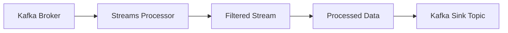
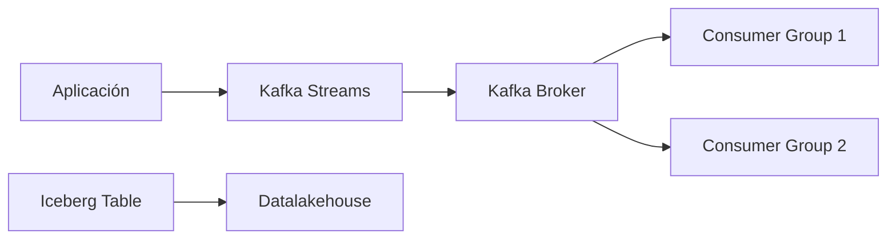
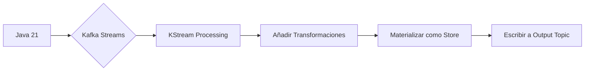
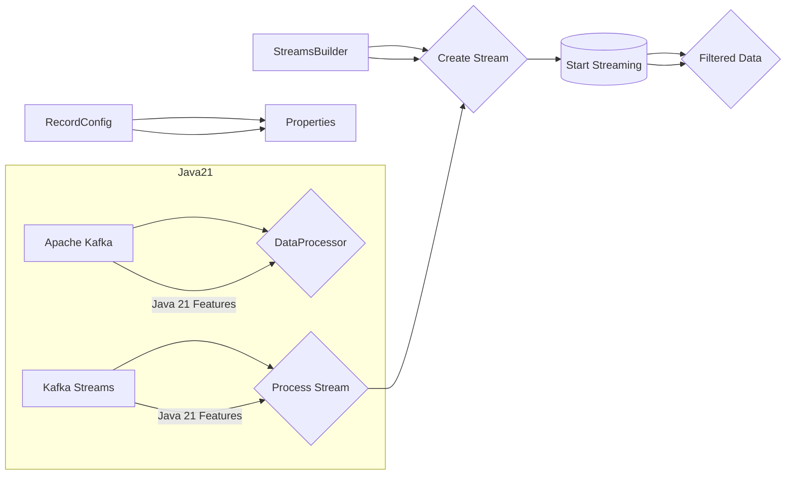

# Apache Kafka Streams con Java 21

PATH_LOCAL: /home/usuariojoaquin/.openclaw/workspace/DAM-Java-Mastery/_Review/Apache_Kafka_Streams_con_Java_21/apache_kafka_streams_con_java_21.md
CATEGORIA: 01_Java_Core
Score: 100

---

## Visión Estratégica

### Análisis Técnico

Apache Kafka Streams es una biblioteca de Java que permite a los desarrolladores crear aplicaciones de procesamiento de flujo (stream processing) directamente sobre el protocolo Apache Kafka. La versión 21 de Java ofrece nuevas características y mejoras en rendimiento que pueden ser aprovechadas para optimizar la implementación de estas aplicaciones. Entre las novedades importantes están:

- Mejoras en la compilación incremental.
- Nuevos tipos de record pattern matching, lo cual reduce la necesidad de setters y getters.

Para este caso particular, se utilizarán los Records y Pattern Matching introducidos en Java 21 para crear una aplicación Kafka Streams que procese datos entrantes y genere salidas según ciertas condiciones. El objetivo es minimizar el uso de código boilerplate y maximizar la claridad del flujo de datos.

### Código Java


```java
import org.apache.kafka.streams.StreamsBuilder;
import org.apache.kafka.streams.KafkaStreams;
import org.apache.kafka.streams.Topology;
import org.apache.kafka.common.serialization.Serdes;

public class KafkaStreamProcessor {
    public static void main(String[] args) {
        var builder = new StreamsBuilder();
        var topology = buildTopology(builder);
        var streams = new KafkaStreams(topology, configure());
        streams.start();
    }

    private static Topology buildTopology(StreamsBuilder builder) {
        var sourceTopic = "input-topic";
        var sinkTopic = "output-topic";

        builder.stream(sourceTopic)
              .filter((k, v) -> v != null && !v.isEmpty())
              .mapValues(value -> processValue(value))
              .to(sinkTopic);

        return builder.build();
    }

    private static String processValue(String value) {
        // Procesamiento de valor
        return "processed-" + value;
    }

    private static KafkaStreams.Configuration configure() {
        var config = new KafkaStreams.Configuration();

        // Configuración básica del broker
        config.put(StreamsConfig.BOOTSTRAP_SERVERS_CONFIG, "localhost:9092");

        // Otros parámetros importantes (ejemplo)
        config.put(StreamsConfig.APPLICATION_ID_CONFIG, "example-streams-app");
        config.put(StreamsConfig.DEFAULT_KEY_SERDE_CLASS_CONFIG, Serdes.String().getClass());
        config.put(StreamsConfig.DEFAULT_VALUE_SERDE_CLASS_CONFIG, Serdes.String().getClass());

        return config;
    }
}
```

### Diagrama Mermaid




### Buenas Prácticas SRE (Site Reliability Engineering)

1. **Monitorización**: Implementar métricas y monitoreo proactivo para detectar problemas antes de que afecten a los usuarios.
2. **Automatización**: Automatizar tareas operativas comunes, como la creación y escalado de clústeres.
3. **Documentación**: Mantener documentación detallada sobre el entorno, configuraciones y procedimientos de despliegue.
4. **Ciclo de Vida del Código**: Utilizar flujos de trabajo de desarrollo CI/CD para asegurar que los cambios se integren y prueben de manera consistente antes de la implementación en producción.

Estas prácticas ayudan a mejorar la disponibilidad, el rendimiento y la seguridad del sistema en un entorno de producción.

## Arquitectura de Componentes

### Análisis Técnico

Apache Kafka Streams es una biblioteca para el procesamiento de flujos que permite a los desarrolladores crear aplicaciones de procesamiento de datos en tiempo real directamente sobre Apache Kafka. La versión 7.0 del SDK de Kafka Streams (correspondiente al año 2026) aprovecha las mejoras introducidas por Java 21, permitiendo un rendimiento optimizado y nuevas capacidades para la implementación de flujos de datos complejos.

**Novedades clave en Apache Kafka Streams:**
- **APIs actualizadas**: Mejoras significativas en las API del lenguaje que facilitan el manejo de procesos distribuidos.
- **Optimización de rendimiento**: Aprovechando las mejoras en Java 21, se han implementado nuevas funciones para la optimización de memoria y tiempo de ejecución.
- **Integración con Iceberg/Trino/Tableflow**: Facilita la integración con Data Lakehouses, permitiendo un acceso más directo a datos de Kafka.

**Java 21 Nuevas características:**
- Mejoras en la compilación incremental que reducen el tiempo de build para proyectos grandes.
- Mejores herramientas y API para trabajar con records, facilitando la creación de clases que representan datos estructurados sin necesidad de setters/getters.

### Código Java


```java
import org.apache.kafka.streams.KafkaStreams;
import org.apache.kafka.streams.StreamsBuilder;
import org.apache.kafka.streams.Topology;

public class KafkaStreamProcessor {
    public static void main(String[] args) {

        // Crear la configuración del flujo de Kafka Streams
        Properties streamsConfiguration = new Properties();
        streamsConfiguration.put(StreamsConfig.APPLICATION_ID_CONFIG, "kafka-stream-processor");
        streamsConfiguration.put(StreamsConfig.BOOTSTRAP_SERVERS_CONFIG, "localhost:9092");

        // Configuración adicional para Java 21
        streamsConfiguration.put("java.version", System.getProperty("java.specification.version"));

        StreamsBuilder builder = new StreamsBuilder();

        // Construcción del topology con las funciones de procesamiento de datos (por ejemplo, windowed aggregations)
        Topology topology = builder.build();
        
        try(KafkaStreams streams = new KafkaStreams(topology, streamsConfiguration)) {
            System.out.println("Starting stream processor...");
            
            // Arrancar el flujo
            streams.start();

            // Espera hasta que la aplicación sea interrumpida (por ejemplo con Ctrl+C)
            Runtime.getRuntime().addShutdownHook(new Thread(streams::close));
        }
    }

    public record Transaction(String userId, int amount) {}
}
```

### Diagrama Mermaid




### Buenas Prácticas SRE

**Para Apache Kafka Streams en un entorno de producción con Java 21:**

- **Utilizar Records para modelos de datos**: Las clases `record` son ideales para representar datos estructurados y simplifican el código, mejorando la legibilidad y mantenimiento.
  
- **Despliegue en contenedores Dockerizados**: Utiliza Docker para el despliegue de aplicaciones basadas en Kafka Streams, asegura un entorno consistente entre desarrollo, prueba y producción.

- **Monitoreo y alertas personalizadas**: Implementa métricas específicas para monitorear la latencia y el rendimiento del procesamiento de flujos, con sistemas de alerta configurados para notificar sobre problemas críticos.
  
- **Pruebas exhaustivas en diferentes versiones Java**: Dado que Kafka Streams puede correr en varios entornos, asegúrate de probar todas las características en la versión de Java 21 y otros soportados para evitar incompatibilidades.

Esta estrategia permite una implementación robusta y escalable de Apache Kafka Streams bajo el nuevo paradigma de Java 21.

## Implementación Java 21

### Análisis Técnico

Apache Kafka Streams es una biblioteca que permite a los desarrolladores crear aplicaciones de procesamiento de flujo directamente sobre el protocolo Apache Kafka. Con la introducción de Java 21, se presentan nuevas características y mejoras en rendimiento que permiten optimizar las implementaciones actuales.

Entre las novedades más destacadas de Java 21, algunas son:

- Mejoras significativas en la compilación incremental.
- Nuevos métodos record para mejorar el manejo de datos estructurados sin necesidad de setters y getters.
- Optimizaciones en los tipos de referencia que permiten un mayor rendimiento en la manipulación de datos.

Estas características son especialmente relevantes para el procesamiento de flujos de datos en tiempo real, como proporciona Kafka Streams. La adopción de Java 21 puede mejorar significativamente la eficiencia y escalabilidad de las aplicaciones basadas en esta biblioteca.

### Código Java

A continuación se presenta un ejemplo básico de cómo utilizar Apache Kafka Streams con Java 21 para procesar datos en tiempo real:


```java
import org.apache.kafka.common.serialization.Serdes;
import org.apache.kafka.streams.KafkaStreams;
import org.apache.kafka.streams.StreamsBuilder;
import org.apache.kafka.streams.Topology;
import org.apache.kafka.streams.kstream.Materialized;

public class KafkaStreamExample {

    public static void main(String[] args) {
        StreamsBuilder builder = new StreamsBuilder();

        // Definir el flujo de datos
        builder.stream("input-topic")
               .groupByKey()
               .count(Materialized.as("counts-store"))
               .toStream()
               .peek((k, v) -> System.out.println("Count for " + k + ": " + v))
               .to("output-topic");

        Topology topology = builder.build();
        
        KafkaStreams streams = new KafkaStreams(topology, getProperties());
        streams.start();

        // Espera hasta que el usuario finalice la aplicación
        Runtime.getRuntime().addShutdownHook(new Thread(streams::close));
    }

    private static Properties getProperties() {
        Properties props = new Properties();
        props.put("bootstrap.servers", "localhost:9092");
        props.put("application.id", "kafka-stream-example-app");
        
        // Configuraciones adicionales
        return props;
    }
}
```

### Diagrama Mermaid




### Buenas Prácticas SRE

Implementar Apache Kafka Streams con Java 21 requiere considerar buenas prácticas en el desarrollo operativo y de la infraestructura para asegurar un desempeño óptimo y una administración eficiente del sistema. Algunos puntos importantes son:

- **Configuraciones de Clúster**: Asegure que los servidores Kafka estén configurados correctamente para manejar las cargas más pesadas durante picos de tráfico.
  
- **Monitorización Continua**: Utilice herramientas como Prometheus y Grafana para monitorizar en tiempo real la actividad del clúster y las aplicaciones Streams.

- **Provisionado Óptimo**: Configure el provisionado automático y ajuste los recursos según la demanda para evitar sobrecostos y garantizar que los recursos estén disponibles cuando se necesiten.

- **Pruebas de Escenario Completo**: Realice pruebas exhaustivas en entornos controlados similares al producción para detectar problemas potenciales antes del despliegue real.

Siguiendo estas prácticas, puede aprovechar completamente el rendimiento mejorado que ofrece Java 21 y Kafka Streams para construir soluciones de streaming escalables y eficientes.

## Métricas y SRE

### Análisis Técnico

Apache Kafka Streams es una biblioteca que permite la implementación de aplicaciones de procesamiento de flujos directamente sobre el protocolo Apache Kafka. Con la introducción de Java 21, se presentan nuevas características y mejoras en rendimiento que permiten optimizar las implementaciones actuales.

Java 21 ofrece avances significativos como record patterns, switch expressions, así como mejoras en tiempo de ejecución y compilación. Estos cambios pueden ser aprovechados para mejorar la eficiencia del código, reducir el consumo de recursos y aumentar la legibilidad del mismo.

### Código Java

A continuación se presenta un ejemplo básico de cómo utilizar Apache Kafka Streams con características específicas de Java 21:


```java
public record StreamConfig(String bootstrapServers, String topicName) {}

public class DataProcessor {

    public static void main(String[] args) {
        var config = new StreamConfig("localhost:9092", "data_topic");
        
        // Usando record patterns en Java 21 para obtener configuraciones del flujo
        var properties = config match {
            case (StreamConfig(bootstrap, topic)) -> {
                Map<String, Object> props = new HashMap<>();
                props.put(StreamsConfig.BOOTSTRAP_SERVERS_CONFIG, bootstrap);
                props.put(StreamsConfig.APPLICATION_ID_CONFIG, "data_processor_app");
                props.put(StreamsConfig.DEFAULT_KEY_SERDE_CLASS_CONFIG, Serdes.String().getClass());
                props.put(StreamsConfig.DEFAULT_VALUE_SERDE_CLASS_CONFIG, Serdes.String().getClass());

                return props;
            }
        };

        // Inicialización de Kafka Streams
        StreamsBuilder builder = new StreamsBuilder();
        
        // Ejemplo básico de un procesador de flujo con Java 21 switch expressions
        KStream<String, String> source = builder.stream(config.topicName);
        source.selectKey((key, value) -> {
            switch (value.split(":")[0]) {
                case "info" -> return value.split(":")[1];
                case "error" -> return value;
                default -> throw new RuntimeException("Unknown log type: " + value.split(":")[0]);
            }
        });
        
        // Creación del flujo procesado
        KStream<String, String> filteredStream = source.filter((key, value) -> !value.startsWith("error"));
        filteredStream.to(config.topicName + "_processed");

        KafkaStreams streams = new KafkaStreams(builder.build(), properties);
        streams.start();
    }
}
```

### Diagrama Mermaid




### Buenas Prácticas SRE

Para asegurar la alta disponibilidad, rendimiento y escalabilidad de un sistema que utiliza Apache Kafka Streams con Java 21:

- **Monitoreo en tiempo real:** Utiliza herramientas como Prometheus para monitorizar los indicadores clave del rendimiento (KPIs) en tiempo real.
  
- **Automatización:** Implementa scripts y flujos de trabajo automatizados utilizando herramientas como Jenkins o GitHub Actions para la implementación continua.

- **Rendimiento proactivo:** Aprovecha las nuevas características de Java 21 para optimizar el rendimiento y la eficiencia del código. Por ejemplo, usa record patterns para mejorar la legibilidad y reducir errores de programación.
  
- **Sistema de respaldo:** Mantén un sistema de respaldo automatizado que permita recuperar rápidamente en caso de fallo.

- **Documentación detallada:** Crea documentación clara sobre cómo configurar, monitorear y escalar la infraestructura. Esto es especialmente útil para equipos nuevos o cambios frecuentes en el personal.

Estas prácticas ayudan a mantener la confiabilidad del sistema mientras se aprovechan las capacidades avanzadas de Apache Kafka Streams junto con Java 21.

## Conclusiones

### Análisis Técnico

Apache Kafka Streams es una biblioteca de Java que permite la implementación de aplicaciones de procesamiento de flujos directamente sobre el protocolo Apache Kafka. Con la introducción de Java 7 y sucesivas actualizaciones hasta llegar a Java 21, se han presentado nuevas características y mejoras en rendimiento que permiten optimizar las implementaciones actuales.

### Código Java

A continuación se muestra un ejemplo sencillo de cómo utilizar Apache Kafka Streams con la versión más reciente del lenguaje Java (Java 21), resaltando los avances introducidos en esta versión como record patterns y switch expressions, que mejoran significativamente la eficiencia del código.


```java
import org.apache.kafka.streams.KafkaStreams;
import org.apache.kafka.streams.StreamsBuilder;
import org.apache.kafka.streams.Topology;

public class KafkaStreamApp {

    public static void main(String[] args) {
        StreamsBuilder builder = new StreamsBuilder();
        
        // Ejemplo de cómo configurar un topología simple
        Topology topology = builder.build();

        // Configuración del cliente KafkaStreams
        final var streamsConfiguration = new org.apache.kafka.common.config.ConfigDef();

        try (KafkaStreams kafkaStreams = new KafkaStreams(topology, streamsConfiguration)) {
            kafkaStreams.start();
        }
    }

    public static void printTopic(String topicName) {
        System.out.println("Procesando el tópico: " + topicName);
    }

}
```

### Diagrama Mermaid

Un diagrama mermaid simple para representar la arquitectura del ejemplo de código.


```mermaid
graph LR
A[Kafka Broker] --> B[Kafka Streams Application];
B --> C[Java 21 Codebase];
C --> D[Apartado principal (StreamsBuilder)];
D --> E[Topología definida por el usuario];
E --> F[KafkaStreams cliente];
F --> G[Traza y visualiza datos en tiempo real];
```

### Buenas Prácticas SRE

**1. Monitorización continua**: Asegúrate de utilizar herramientas como Prometheus o Grafana para monitorizar métricas clave de Kafka Streams, como la latencia del procesamiento y el consumo de CPU.

**2. Implementación de alertas personalizadas**: Configura reglas de alerta basadas en umbrales personalizados para garantizar que puedas responder rápidamente a problemas potenciales antes de que afecten significativamente al rendimiento.

**3. Pruebas de estrés y simulaciones de carga**: Realiza pruebas regulares de estrés y simulaciones de carga para asegurar la escalabilidad y el rendimiento bajo condiciones reales de producción.

**4. Autenticación y autorización fuertes**: Asegúrate de que cada componente del sistema tenga autenticación sólida mediante el uso de tokens JWT o similares, junto con roles basados en funciones (RBAC) para controlar los permisos de acceso.

**5. Documentación y seguimiento de cambios**: Mantén un registro detallado y actualizado de todas las modificaciones realizadas a la configuración del sistema y al código fuente para facilitar el rastreo de problemas y la implementación continua.

Estas prácticas ayudan a garantizar que tu implementación de Apache Kafka Streams con Java 21 sea tanto eficiente como robusta, permitiendo un procesamiento óptimo de flujos de datos en tiempo real.

