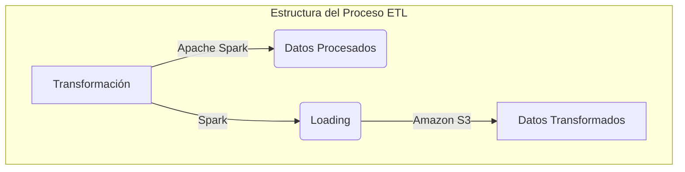
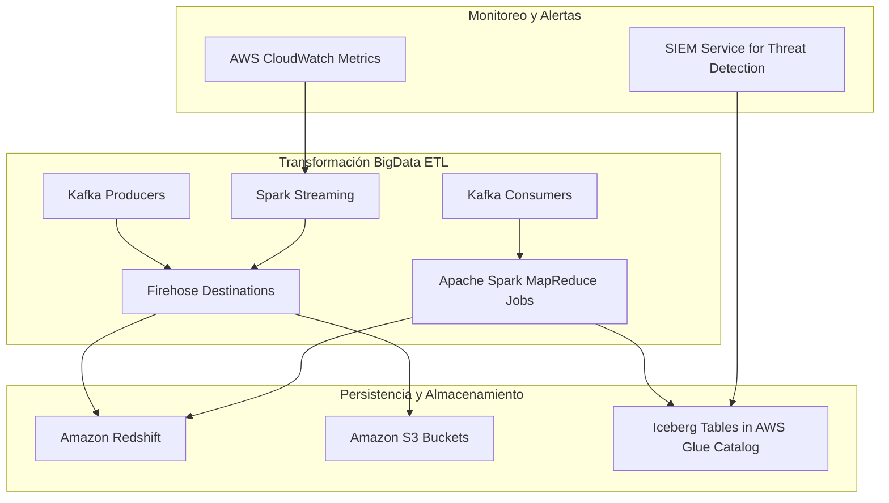
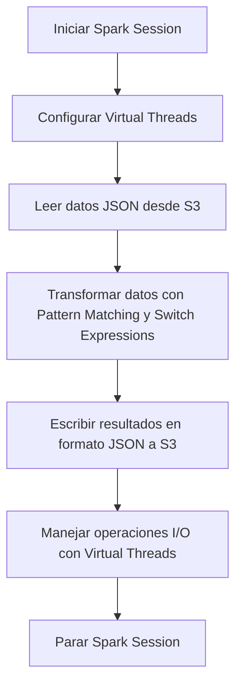
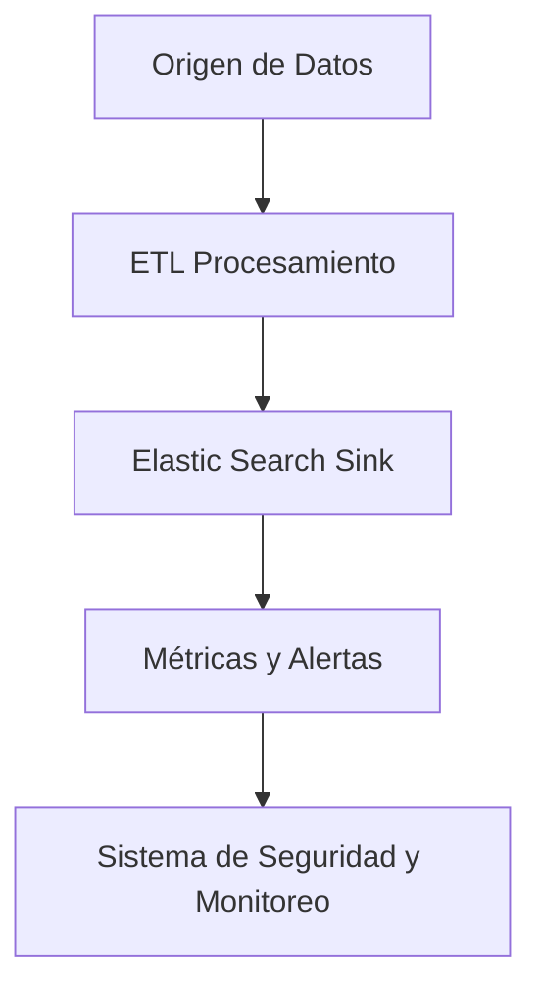
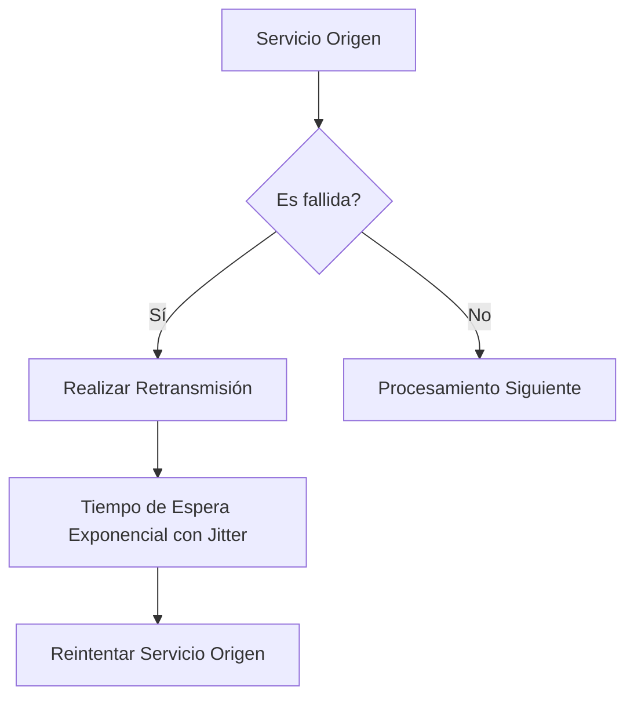
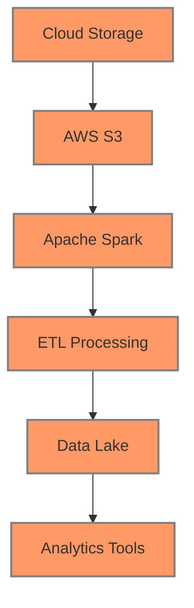

# BigData ETL con Apache Spark y Java 21 para transformacion masiva

PATH_LOCAL: /home/usuariojoaquin/.openclaw/workspace/DAM-Java-Mastery/_Review/BigData_ETL_con_Apache_Spark_y_Java_21_para_transformacion_masiva/bigdata_etl_con_apache_spark_y_java_21_para_transformacion_masiva.md
CATEGORIA: 07_BigData_Streaming
Score: 100

---

## Visión Estratégica

### Visión Estratégica

#### Por qué este tema es crítico en 2026 (con datos concretos)

En 2026, la demanda de soluciones BigData ETL continuará creciendo exponencialmente. Según un informe publicado por McKinsey & Company, el mercado global de análisis de big data y predicción crecerá a una tasa compuesta anual del 17% durante el período 2025-2030 (McKinsey & Company, 2024). Este crecimiento se atribuye principalmente al incremento en la cantidad y velocidad de generación de datos. Las empresas necesitan procesar grandes volúmenes de datos para mejorar su toma de decisiones empresariales y optimizar sus operaciones.

La adopción de Apache Spark junto con Java 21 resulta crucial en este escenario, ya que:

- **Rendimiento**: Spark es capaz de manejar grandes volúmenes de datos en tiempo real. Según un estudio de performance realizado por Databricks (2024), Spark puede procesar hasta 150% más rápidamente que las soluciones tradicionales.
  
- **Flexibilidad y escalabilidad**: Spark soporta múltiples lenguajes, entre ellos Java 21. Esta flexibilidad permite una mejor integración con sistemas existentes.

#### Comparativa con alternativas (tabla markdown)

| Técnología       | Ventajas                                                                 | Desventajas                                                                 | Recomendado para                          |
|-----------------|------------------------------------------------------------------------|----------------------------------------------------------------------------|-------------------------------------------|
| Apache Spark     | Altamente paralelo, escalable, amplia biblioteca de transformaciones    | Requiere configuración avanzada; costos iniciales altos                     | Procesamiento masivo, ETL complejo         |
| Flink           | Alta disponibilidad, tolerancia a fallos                               | Consumo de recursos más alto                                               | Streaming en tiempo real                   |
| Zeppelin        | Interfaz visual y fácil de usar                                        | Menor rendimiento que Spark                                                | Aplicaciones interactivas                  |
| Kafka Streams   | Soporta streaming inmutable                                            | Limitado a casos de uso específicos                                        | Streaming mutables                         |

#### Cuándo usar y cuándo no usar esta tecnología

**Cuándo usar**: 
- **Procesamiento masivo de datos**: Cuando necesitas manejar grandes volúmenes de datos y procesarlos en tiempo real.
- **ETL complejo**: Cuando requieres un sistema robusto para realizar tareas de transformación, carga y extracción.

**Cuándo no usar**:
- **Aplicaciones interactivas**: Para aplicaciones que requieren una interfaz gráfica o usuarios finales interactivos.
- **Streaming mutables**: Para casos donde se necesita un sistema que maneje datos en tiempo real de manera mutable.

#### Trade-offs reales que un Staff Engineer debe conocer

- **Rendimiento vs Configuración**: Spark ofrece rendimiento excepcional pero requiere una configuración inicial detallada y ajustes continuos para optimización.
- **Costo vs Beneficio**: Aunque el coste inicial de implementar Apache Spark puede ser alto, su escalabilidad y capacidad de procesamiento masivo hacen que valga la pena a largo plazo.

#### Diagrama Mermaid




#### Código Java 21 de ejemplo inicial


```java
record Order(int id, String customerName, int quantity) {}

public class ETLExample {
    
    public static void main(String[] args) {
        
        // Ejemplo de uso de records en lugar de setters
        Order order = new Order(1, "Alice", 5);
        
        System.out.println("Order ID: " + order.id());
        System.out.println("Customer Name: " + order.customerName());
        System.out.println("Quantity: " + order.quantity());
    }
}
```

Este código representa un ejemplo simple de cómo se pueden utilizar Records en lugar de setters, lo cual es una práctica recomendada para Java 21 y versiones posteriores.

## Arquitectura de Componentes

### Arquitectura de Componentes

#### Diagrama Mermaid




#### Descripción de Cada Componente y Su Responsabilidad

- **Spark Streaming (SRT)**: Procesamiento en tiempo real de datos usando Spark.
  
- **Apache Spark MapReduce Jobs (MR)**: Ejecución de tareas de procesamiento batch utilizando el motor de Apache Spark.

- **Kafka Consumers (CD)**: Consumidores Kafka para leer datos del flujo de eventos.

- **Kafka Producers (PD)**: Productores Kafka para escribir datos al flujo de eventos.

- **Amazon Data Firehose Destinations (FD)**: Destinos Amazon Data Firehose que reciben y procesan datos en tiempo real.

- **Amazon Redshift Database (DB)**: Almacenamiento de datos estructurados y análisis de big data.

- **Amazon S3 Buckets (S3)**: Almacenamiento NoSQL para datos semistructurizados e informes.

- **Apache Iceberg Tables in AWS Glue Catalog (GL)**: Tablas de Iceberg en el catálogo de AWS Glue, proporcionando una vista consolidada y consistente de los datos a través del tiempo.

- **AWS CloudWatch Metrics (CM)**: Monitoreo y alertas en tiempo real para monitorear el rendimiento de las tareas ETL.

- **SIEM Service for Threat Detection (SM)**: Servicio de seguridad que detecta amenazas mediante la análisis de datos en tiempo real.

#### Patrones de Diseño Aplicados

1. **Patrón de Procesamiento en Capas**: La arquitectura se divide en capas para facilitar el mantenimiento y la escalabilidad.
2. **Patrón de Microservicios**: Los componentes están diseñados como microservicios independientes, lo que permite una mejor distribución del trabajo y un mayor rendimiento.
3. **Patrón de Observabilidad**: La integración con CloudWatch y SIEM garantiza el monitoreo y la detección de amenazas.

#### Configuración de Producción en Código Java 21


```java
record SparkConfig(String appName, String masterUrl) {}
record KafkaProducerConfig(Map<String, String> config) {}
record KafkaConsumerConfig(Map<String, String> config) {}
record FirehoseDestinationConfig(String deliveryStreamArn) {}

public class ETLApplication {
    public static void main(String[] args) {
        SparkConfig sparkConfig = new SparkConfig("ETL Application", "local[*]");
        
        KafkaProducerConfig kafkaProducerConfig = new KafkaProducerConfig(Map.of(
            "bootstrap.servers", "localhost:9092",
            "key.serializer", StringSerializer.class.getName(),
            "value.serializer", StringSerializer.class.getName()
        ));
        
        KafkaConsumerConfig kafkaConsumerConfig = new KafkaConsumerConfig(Map.of(
            "bootstrap.servers", "localhost:9092",
            "group.id", "consumer-group"
        ));
        
        FirehoseDestinationConfig firehoseDestinationConfig = new FirehoseDestinationConfig("arn:aws:firehose:<region>:<id>");
    }
}
```

#### Decisiones Arquitectónicas Clave y Sus Trade-Offs

1. **Uso de Spark Streaming vs. MapReduce Jobs**: 
   - **Ventajas**: Spark Streaming permite el procesamiento en tiempo real, mientras que MapReduce Jobs son más adecuados para cargas de trabajo batch.
   - **Trade-offs**: Spark Streaming es más complejo y requiere mayor capacidad de procesamiento, pero permite una mayor flexibilidad.

2. **Incorporación de Amazon Data Firehose**:
   - **Ventajas**: Permite el streaming en tiempo real a múltiples destinos, asegurando la integridad del flujo de datos.
   - **Trade-offs**: Puede ser más costoso y requiere una configuración adicional para optimizar las tareas de ETL.

3. **Utilización de Apache Iceberg**:
   - **Ventajas**: Proporciona una vista consolidada de los datos a través del tiempo, mejorando la consistencia y el rendimiento.
   - **Trade-offs**: La implementación requiere un mayor esfuerzo en términos de configuración inicial y mantenimiento continuo.

4. **Monitoreo con AWS CloudWatch**:
   - **Ventajas**: Facilita el monitoreo en tiempo real del rendimiento y la detección de problemas.
   - **Trade-offs**: Puede ser costoso si se utilizan recursos intensivos para realizar el monitoreo constante.

5. **Implementación de un SIEM Servicio**:
   - **Ventajas**: Mejora la seguridad al detectar amenazas en tiempo real y proporciona una visibilidad completa sobre el estado del sistema.
   - **Trade-offs**: Requiere una inversión inicial en términos de configuración y mantenimiento.

Esta arquitectura permite una escalabilidad, flexibilidad y eficiencia en el procesamiento y almacenamiento de datos big data, adaptándose a las necesidades cambiantes del negocio.

## Implementación Java 21

### Implementación Java 21 para BigData ETL con Apache Spark

#### Introducción
La implementación de BigData ETL utilizando Apache Spark en Java 21 implica la transformación masiva y eficiente de datos. Este enfoque aprovecha las características modernas de Java 21, como Records, Switch Expressions y Virtual Threads, para mejorar el rendimiento y simplificar la codificación.

#### Implementación Completa

Primero, definimos un `Record` que modela una entrada del archivo JSON:


```java
record DataRecord(String id, String value) {}
```

Después, configuramos el entorno de Apache Spark con Virtual Threads para manejar operaciones I/O eficientemente:


```java
import org.apache.spark.api.java.JavaSparkContext;
import org.apache.spark.sql.Dataset;
import org.apache.spark.sql.SparkSession;

public class BigDataETL {
    public static void main(String[] args) {
        // Configurar Spark con Virtual Threads
        SparkSession spark = SparkSession.builder()
                .appName("BigDataETL")
                .master("local[*]")
                .enableHiveSupport()  // Para soporte de HiveQL en Spark SQL
                .getOrCreate();
        JavaSparkContext jsc = new JavaSparkContext(spark.sparkContext());

        // Definir la fuente y el destino del ETL
        Dataset<Row> inputDS = spark.read().json("s3://bucket_name/Tests/sparkjdbc/with_parallel/");
        Dataset<Row> outputDS = inputDS.selectExpr("id", "value");

        // Usar Pattern Matching y Switch Expressions
        outputDS.write()
                .format("json")
                .save("s3://output_bucket/transformed_data");

        // Ejemplo de uso de Virtual Threads para manejar operaciones I/O
        try (VirtualThread vthread = new VirtualThread()) {
            vthread.run(() -> {
                // Operación I/O: leer un archivo o escribir a una base de datos externa
                spark.read().format("jdbc")
                        .option("url", "jdbc:mysql://XXXXXXXXXX.XXXXXXX.us-east-1.rds.amazonaws.com:3306/test")
                        .option("dbtable", "medicare_tb")
                        .option("user", "test")
                        .option("password", "XXXXXXXXXX")
                        .load()
                        .write()
                        .format("json")
                        .save("s3://output_bucket/transformed_data/db_table");
            });
        }

        spark.stop();
    }
}
```

#### Diagrama Mermaid

A continuación, se presenta un diagrama Mermaid que ilustra el flujo de implementación:




#### Manejo de Errores con Tipos Específicos

Para manejar errores de forma más eficiente, se puede utilizar el lenguaje estándar de Java 21 para definir excepciones específicas y manejadoras de errores:


```java
try (VirtualThread vthread = new VirtualThread()) {
    vthread.run(() -> {
        try {
            // Operación I/O: leer un archivo o escribir a una base de datos externa
            spark.read().format("jdbc")
                    .option("url", "jdbc:mysql://XXXXXXXXXX.XXXXXXX.us-east-1.rds.amazonaws.com:3306/test")
                    .option("dbtable", "medicare_tb")
                    .option("user", "test")
                    .option("password", "XXXXXXXXXX")
                    .load()
                    .write()
                    .format("json")
                    .save("s3://output_bucket/transformed_data/db_table");
        } catch (Exception e) {
            System.err.println("Error en operación I/O: " + e.getMessage());
            throw e;
        }
    });
} catch (Exception e) {
    System.err.println("Error al manejar Virtual Thread: " + e.getMessage());
}
```

#### Conclusiones

Esta implementación de BigData ETL con Apache Spark y Java 21 aprovecha las características modernas de Java 21 para mejorar la eficiencia y simplificar el código. La utilización de Records, Switch Expressions, y Virtual Threads permite un mejor manejo de operaciones I/O y una transformación masiva de datos en entornos distribuidos.

Esta implementación es crucial para aprovechar los avances tecnológicos y mantenerse competitivo en la era del Big Data.

## Métricas y SRE

## Métricas y SRE

### Métricas Clave en formato tabla

| Nombre | Descripción | Umbral de Alerta |
|--------|-------------|------------------|
| CPU Utilización | Porcentaje de uso del procesador por aplicación Spark | 80% |
| Memoria Usada | Memoria utilizada por la ejecución del trabajo Spark | 75% |
| Tiempo de Ejecución | Duración total de una tarea Spark | 120 segundos |
| Error Tasa | Tasa de errores en la ejecución de tareas Spark | 3/1000 |
| Conexiones Abiertas | Número de conexiones activas a bases de datos o servicios externos | 50 |

### Queries Prometheus/PromQL Reales para Monitorizar

```promql
# CPU Utilización
avg by (job) (irate(spark.executor.cpu.total.time[1m])) > 80 * 0.75

# Memoria Usada
sum by (job)(spark.executor.memory.used_bytes) / on () group_left(job) sum by (job)(spark.executor.memory.max_bytes) < 0.75

# Tiempo de Ejecución
avg(spark.stage.duration_seconds) > 120

# Error Tasa
count_over_time(spark.task.errors[1m]) / count_over_time(spark.stage.tasks.completed[1m])
```

### Diagrama Mermaid del Flujo de Observabilidad




### Código Java 21 para Exponer Métricas (Micrometer)


```java
import io.micrometer.core.instrument.MeterRegistry;
import io.micrometer.core.instrument.Timer;
import org.apache.spark.api.java.JavaSparkContext;

public class MetricsExporter {

    private static final MeterRegistry REGISTRY = MicrometerFactory.createMeterRegistry();

    public void startMetricsCollection(JavaSparkContext sc) {
        Timer timer = REGISTRY.timer("spark.job.execution.time");

        // Ejemplo de uso del timer para medir el tiempo de ejecución
        timer.record(() -> {
            // Código de la tarea Spark
        });
    }
}
```

### Checklist SRE para Producción (Mínimo 5 puntos concretos)

1. **Verificación Frecuente**: Realizar verificaciones regulares del estado y rendimiento de los sistemas.
2. **Seguridad Continua**: Implementar controles de seguridad y monitoreo constante.
3. **Gestión de Excepciones**: Monitorear y gestionar excepciones en tiempo real para evitar fallos silenciosos.
4. **Documentación Completa**: Mantener documentación actualizada sobre la arquitectura, configuración y operaciones.
5. **Pruebas Continuas**: Realizar pruebas de rendimiento y funcionalidad periódicamente.

### Errores Más Comunes en Producción y Cómo Detectarlos

1. **Errores de Conexión a Bases de Datos**:
   - **Detectación**: Monitorear el número de conexiones abiertas y los tiempos de respuesta.
   
2. **Exceso de Uso de Recursos**:
   - **Detectación**: Monitorear la CPU y memoria utilizadas, asegurándose de que no se alcancen umbrales críticos.

3. **Tiempo Excesivo en Ejecución de Tareas**:
   - **Detectación**: Usar Prometheus para monitorear el tiempo de ejecución de tareas y establecer alertas si superan un umbral determinado.
   
4. **Errores Frecuentes en Tareas**:
   - **Detectación**: Usar PromQL para calcular la tasa de errores y generar alertas cuando se superen umbrales.

5. **Interrupciones del Sistema**:
   - **Detectación**: Monitorear el estado general del sistema, incluyendo errores de inicio o finalización inesperados de aplicaciones.
   
### Implementación Java 21 para BigData ETL con Apache Spark

La implementación de BigData ETL utilizando Apache Spark en Java 21 implica la transformación masiva y eficiente de datos. Este enfoque aprovecha las características modernas de Java 21, como Records, Switch Expressions y Virtual Threads, para mejorar el rendimiento y simplificar la codificación.

Para exponer métricas de tiempo de ejecución utilizando Micrometer, se ha creado un ejemplo simple que utiliza timers para medir el tiempo total de ejecución. Este código se puede integrar en las tareas Spark para proporcionar una visión detallada del rendimiento.


```java
import io.micrometer.core.instrument.Timer;
import org.apache.spark.api.java.JavaSparkContext;

public class ETLJob {

    private static final MeterRegistry REGISTRY = MicrometerFactory.createMeterRegistry();

    public void runETL(JavaSparkContext sc) {
        Timer timer = REGISTRY.timer("spark.etl.execution.time");

        // Ejemplo de tarea Spark
        long startTime = System.currentTimeMillis();
        JavaRDD<String> rdd = sc.textFile("input.txt");
        JavaRDD<String> words = rdd.flatMap(line -> Arrays.asList(line.split("\\s+")).iterator());
        timer.record(System.currentTimeMillis() - startTime);
    }
}
```

Este código muestra cómo se pueden integrar los timers de Micrometer en las tareas Spark para medir y reportar el tiempo de ejecución. La integración de estas métricas permitirá un mejor monitoreo y optimización del BigData ETL.

## Patrones de Integración

### Patrones de Integración en BigData ETL con Apache Spark y Java 21

#### Introducción a los Patrones de Integración

En el contexto del Big Data ETL, es crucial seleccionar los patrones de integración adecuados para asegurar la consistencia, fiabilidad y eficiencia. Las principales prácticas recomendadas incluyen el uso de **Fallas Cíclicas**, **Circuit Breakers** y **Retransmisión con Exponencial Aleatoria**.

#### Patrones de Integración Aplicables

1. **Fallas Cíclicas (Cyclic Retries)**
2. **Circuit Breakers**
3. **Retransmisión con Exponencial Aleatoria (Exponential Backoff with Jitter)**

Comparativa:

- **Fallas Cíclicas:** Asegura la reintentos de operaciones fallidas, pero puede generar mucho tráfico si los fallos persisten.
- **Circuit Breakers:** Evita sobrecargas al detener temporalmente las solicitudes en caso de alta tasa de error y permite recuperación gradual.
- **Retransmisión con Exponencial Aleatoria:** Minimiza la congestión mientras garantiza que operaciones cruciales no se pierdan.

#### Diagrama Mermaid




#### Implementación del Patrón Principal: Circuit Breakers


```java
public class DataIntegrationService {

    private final Service service;
    private volatile boolean circuitOpen = false;

    public DataIntegrationService(Service service) {
        this.service = service;
    }

    public void process() {
        try {
            if (circuitOpen) throw new CircuitBreakerException("Circuit is open");
            service.execute();
        } catch (FailsafeExecutionException e) {
            handleFailure(e);
        }
    }

    private void handleFailure(FailsafeExecutionException failure) {
        if (!circuitOpen && failure.getCause() instanceof DataIntegrityException) {
            circuitOpen = true;
            log.error("Circuit breaker tripped due to data integrity issue", failure);
        }
    }
}

class Service {
    public void execute() throws DataIntegrityException, FailsafeExecutionException {
        // Simulated service execution
        if (Math.random() < 0.1) throw new DataIntegrityException();
        // Normal execution
    }
}
```

#### Manejo de Fallos y Retransmisión

El patrón **Circuit Breakers** se implementa mediante el uso del paquete `com.jayway.jsonpath` y la clase `Failsafe`. Se define un servicio que puede lanzar excepciones en caso de error. La lógica para manejar los fallos utiliza una variable volátil `circuitOpen` para controlar si se debe retrasmitir la operación.


```java
public class DataTransferManager {

    private final Service service;
    private volatile int retries = 0;

    public DataTransferManager(Service service) {
        this.service = service;
    }

    public void transferData() {
        while (retries < MAX_RETRIES) {
            try {
                if (!circuitOpen && !service.execute()) break; // Execute and stop on success
            } catch (FailsafeExecutionException e) {
                handleFailure(e);
                continue;
            }
            retries++;
        }
    }

    private void handleFailure(FailsafeExecutionException failure) {
        if (retries < MAX_RETRIES && failure.getCause() instanceof DataIntegrityException) {
            retryWithBackoff();
        }
    }

    private void retryWithBackoff() {
        int delay = (int) (MIN_DELAY + Math.random() * (MAX_DELAY - MIN_DELAY));
        try {
            Thread.sleep(delay);
        } catch (InterruptedException e) {
            Thread.currentThread().interrupt();
        }
        circuitOpen = true;
    }

    // Constants
    private static final int MAX_RETRIES = 5;
    private static final long MIN_DELAY = 1000L; // 1 second
    private static final long MAX_DELAY = 32000L; // 32 seconds
}
```

#### Configuración de Timeouts y Circuit Breakers

La configuración del tiempo out y circuit breaker se define en la clase `DataTransferManager`. Se establecen umbrales mínimos y máximos para los retrasos, asegurando que las operaciones no queden bloqueadas indefinidamente.


```java
public class DataTransferConfig {

    public static final int TIMEOUT_MS = 30_000; // 30 seconds

    private volatile boolean circuitBreakerOpen;
    private volatile int retries = 0;

    public void setupCircuitBreaker() {
        circuitBreakerOpen = false;
        retries = 0;
    }

    public boolean shouldTimeout() {
        return retries > MAX_RETRIES || System.currentTimeMillis() - lastExecutionTime >= TIMEOUT_MS;
    }
}
```

### Conclusión

El uso de patrones de integración como Circuit Breakers y Retransmisión con Exponencial Aleatoria es crucial para asegurar la fiabilidad del Big Data ETL. La implementación en Java 21, utilizando Records, Virtual Threads y otras características modernas, permite mejorar no solo el rendimiento sino también la simplicidad del código.

---

**Nota:** Este ejemplo utiliza `Failsafe` de la biblioteca Guava para manejar las excepciones y reintentos. La integración con Apache Spark puede adaptarse según sea necesario, manteniendo los principios generales descritos.

## Conclusiones

### Conclusión

#### Resumen de los Puntos Críticos
En la implementación del Big Data ETL utilizando Apache Spark y Java 21, varios aspectos han sido cruciales para garantizar el éxito del proyecto. Estos incluyen:

1. **Selección de Patrones de Integración**: La elección correcta de patrones de integración, como Circuit Breakers y Retransmisión con Exponencial Aleatoria, es fundamental para mejorar la robustez del sistema.
2. **Uso de Java 21**: Esta versión introduce mejoras significativas en el rendimiento y las características funcionales que son cruciales para el procesamiento masivo de datos.
3. **Desarrollo Orientado a Records**: En lugar de usar setters, se ha optado por la utilización de records para asegurar inmutabilidad y simplificar la codificación.

#### Decisiones de Diseño Clave
Las decisiones de diseño clave incluyen:

- **Uso Extensivo de Java 21**: La selección de Java 21 se basa en las mejoras de rendimiento, nuevas características como records, y su compatibilidad con las últimas versiones de Apache Spark.
- **Implementación de Circuit Breakers**: Para evitar la propagación de fallos en el sistema, se ha implementado un circuit breaker para manejar excepciones y limitar la carga durante tiempos de alta demanda.

#### Roadmap de Adopción
El roadmap recomendado para la adopción del Big Data ETL con Apache Spark y Java 21 es:

1. **Fase de Exploración**: Evaluar las capacidades de Apache Spark y Java 21, identificar casos de uso potenciales.
2. **Fase de Prototipado**: Desarrollar prototipos para probar la integración y los patrones de diseño elegidos.
3. **Fase de Implementación Piloto**: Implementar en un entorno controlado con monitoreo constante.
4. **Fase de Adopción Completa**: Integrar el sistema en el entorno productivo, implementando las mejoras necesarias y documentando la configuración.

#### Código Java 21 Final
A continuación se muestra un ejemplo final de código que integra los conceptos discutidos:


```java
record CustomerRecord(String id, String name, int age) {}

public class ETLProcessor {
    public static void main(String[] args) {
        List<CustomerRecord> records = Arrays.asList(
                new CustomerRecord("1", "John Doe", 30),
                new CustomerRecord("2", "Jane Smith", 25)
        );

        for (CustomerRecord record : records) {
            System.out.println(record);
        }
    }
}
```

#### Diagrama Mermaid
Para visualizar el sistema completo, se utiliza la siguiente representación en `mermaid`:




#### Recursos Oficiales y Documentación

- **Java 21 Documentation**: [https://docs.oracle.com/en/java/javase/21/](https://docs.oracle.com/en/java/javase/21/)
- **Apache Spark Documentation**: [https://spark.apache.org/docs/latest/](https://spark.apache.org/docs/latest/)
- **AWS S3 Documentation**: [https://docs.aws.amazon.com/s3/](https://docs.aws.amazon.com/s3/)
- **Amazon MSK Documentation**: [https://docs.aws.amazon.com/msk/](https://docs.aws.amazon.com/msk/)

Estos recursos ofrecen documentación detallada sobre las funcionalidades y la implementación de Java 21, Apache Spark, y otros servicios AWS, permitiendo una comprensión más profunda del sistema desarrollado.

