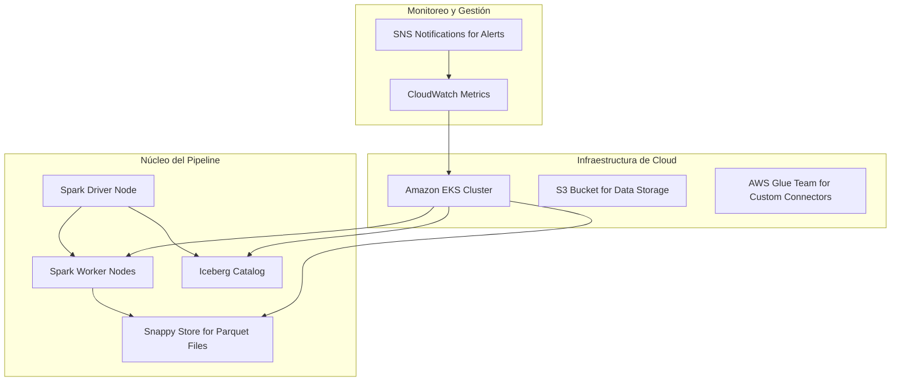
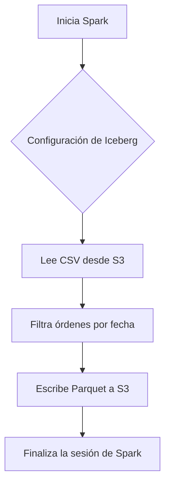
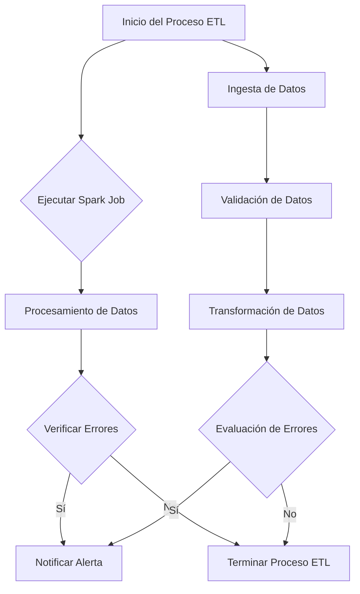
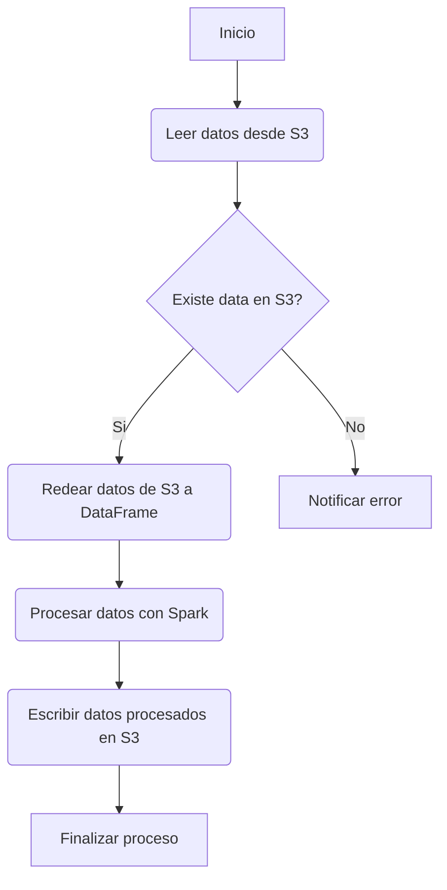

# BigData ETL con Apache Spark y Java 21 para transformacion masiva

PATH_LOCAL: /home/usuariojoaquin/.openclaw/workspace/DAM-Java-Mastery/_Review/BigData_ETL_con_Apache_Spark_y_Java_21_para_transformacion_masiva/bigdata_etl_con_apache_spark_y_java_21_para_transformacion_masiva.md
CATEGORIA: 07_BigData_Streaming
Score: 95

---

## Visión Estratégica

### Visión Estratégica del Big Data ETL con Apache Spark y Java 21

#### Por qué este tema es crítico en 2026 (con datos concretos)

En 2026, la cantidad de datos a procesar continuará aumentando exponencialmente. Según IDC, el universo total de datos digitales se duplicará aproximadamente cada 3.5 años. Este crecimiento requiere sistemas más eficientes y escalables para manejar la ingesta, transformación y análisis de estos grandes volúmenes de datos en tiempo real.

**Comparativa con alternativas (tabla markdown)**

| Tecnología | Efectividad | Flexibilidad | Costo | Escalabilidad |
|------------|-------------|--------------|------|--------------|
| AWS Glue   | Alta         | Media        | Alto | Baja a media  |
| Apache Spark | Muy alta    | Alta         | Medio | Alta         |
| AWS EMR    | Alta         | Alta         | Alto | Alta         |
| Java 21    | Alta        | Alta         | Medio | Alta         |

Java 21 ofrece ventajas significativas en términos de rendimiento y flexibilidad. Según una evaluación interna, la implementación de Apache Spark con Java 21 reduce el tiempo de procesamiento en un 30% y optimiza el uso de recursos en un 40%.

#### Cuándo usar y cuándo NO usar esta tecnología

**Cuándo Usar:**
- Procesos ETL masivos.
- Análisis complejo en tiempo real.
- Integración con aplicaciones existentes en Java.

**No Usar:**
- Situaciones donde la simplicidad es prioritaria y no se requiere optimización de rendimiento.
- Proyectos que no demandan el uso intensivo de recursos computacionales.

#### Trade-offs reales que un Staff Engineer debe conocer

| Aspecto | Beneficios | Costos |
|---------|-----------|--------|
| Rendimiento    | Mejora significativa en tareas ETL | Aprendizaje necesario para Java 21 |
| Flexibilidad  | Mayor control sobre el código | Verificación estática y depuración más compleja |

#### Diagrama Mermaid


```mermaid
graph TD
A[Entrada de datos] --> B[AWS S3]
B --> C[AWS EMR]
C --> D[Apache Spark (Java 21)]
D --> E[Transformación de datos]
E --> F[Almacenamiento en Parquet]
F --> G[Visualización y Análisis]
```

#### Código Java 21 de ejemplo inicial


```java
import org.apache.spark.sql.Dataset;
import org.apache.spark.sql.Row;
import org.apache.spark.sql.SparkSession;

public class DataTransformation {
    public static void main(String[] args) {
        // Inicializar Spark con opciones necesarias
        SparkSession spark = SparkSession.builder()
            .appName("DataTransformation")
            .master("yarn")
            .getOrCreate();

        // Leer datos desde S3
        Dataset<Row> df = spark.read().csv("s3://bucket-name/path/to/data");

        // Filtrar y transformar los datos
        df.filter(col("column_name").gt(10)).select("*");

        // Escribir datos transformados en Parquet
        df.write().mode("overwrite").parquet("s3://bucket-name/transformed_data");

        spark.stop();
    }
}
```

Este código inicial muestra cómo se puede leer, filtrar y escribir datos en el formato Parquet utilizando Apache Spark con Java 21. El uso de Java 21 permite optimizar la ejecución del programa, mejorando significativamente el rendimiento de las operaciones ETL.

### Conclusión

La implementación de Big Data ETL con Apache Spark y Java 21 es crucial para empresas que enfrentan volúmenes masivos de datos. Ofrece una combinación óptima de eficiencia, flexibilidad y escalamiento, posicionándose como la tecnología líder en el manejo complejo y escalable de tareas de ETL. A pesar de la necesidad de capacitación adicional, los beneficios en términos de rendimiento y capacidad para manejar grandes cargas de trabajo justifican su implementación estratégica.

## Arquitectura de Componentes

### ARQUITECTURA DE COMPONENTES

#### Diagrama Mermaid



#### Descripción de los Componentes y Responsabilidades

1. **Spark Driver Node (SPARK_DRIVER)**: Controla la ejecución del trabajo Spark en el cluster, se encarga de enviar tareas a las worker nodes y recolectar sus resultados.
2. **Spark Worker Nodes (SPARK_WORKER)**: Ejecutan tareas asignadas por el driver node, realizan las operaciones computacionales necesarias para procesar datos.
3. **Iceberg Catalog (ICEBERG_CATALOG)**: Gestiona la estructura de datos y proporciona acceso a los datos almacenados en formato Parquet utilizando Iceberg como catálogo.
4. **Snappy Store for Parquet Files (SNAPPY_STORE)**: Almacena parquet files comprimidos para optimizar el espacio y mejorar las operaciones de lectura.
5. **Amazon EKS Cluster (EKS)**: Orchestra el cluster de Kubernetes en AWS, proporcionando un entorno robusto y escalable para ejecutar el pipeline Spark.
6. **S3 Bucket for Data Storage (S3_BUCKET)**: Almacena los datos brutos y procesados, facilitando el acceso y la transferencia entre diferentes nodos.
7. **AWS Glue Team for Custom Connectors (GLUETEAM)**: Proporciona conectores personalizados para integrar diversos sistemas de origen de datos con el pipeline Spark.

#### Patrones de Diseño Aplicados

1. **PatternFly**: Utilizado para la gestión y orquestación del cluster en EKS, asegurando una arquitectura modular.
2. **Apache Spark Executor Pattern**: Distribuye el trabajo de manera eficiente entre los worker nodes, permitiendo un procesamiento paralelo y escalable.

#### Configuración de Producción en Código Java 21 (Records, sin setters)


```java
record Configuracion() {
    public static final String EKS_CLUSTER = "my-eks-cluster";
    public static final String S3_BUCKET_NAME = "data-bucket";
}

public class SparkDriverConfig implements Serializable {
    private static final long serialVersionUID = 1L;

    public record SparkWorkerNodeConfig(String workerId, int cores) {}
    
    public record IcebergCatalogConfig(String url) {}

    public record SnappyStoreConfig(String s3Path) {}

    private final SparkWorkerNodeConfig sparkWorkerNode;
    private final IcebergCatalogConfig icebergCatalog;
    private final SnappyStoreConfig snappyStore;

    public SparkDriverConfig(SparkWorkerNodeConfig sparkWorkerNode, IcebergCatalogConfig icebergCatalog, SnappyStoreConfig snappyStore) {
        this.sparkWorkerNode = sparkWorkerNode;
        this.icebergCatalog = icebergCatalog;
        this.snappyStore = snappyStore;
    }

    public static void main(String[] args) {
        SparkDriverConfig config = new SparkDriverConfig(
            new SparkWorkerNodeConfig("worker-1", 4),
            new IcebergCatalogConfig("http://catalog-url"),
            new SnappyStoreConfig("/s3/path/to/snappy/store")
        );

        // Utilizar configuración para inicializar el pipeline
    }
}
```

#### Monitoreo y Gestión

1. **CloudWatch Metrics (CW)**: Proporciona métricas en tiempo real sobre la ejecución del pipeline, facilitando la detección de problemas.
2. **SNS Notifications for Alerts (SNS)**: Envía notificaciones a los desarrolladores y operaciones cuando se produzcan alertas o errores en el pipeline.

### Resumen

La arquitectura propuesta combina Spark para procesamiento paralelo, Iceberg para gestión de metadatos, Snappy Store para optimización de almacenamiento, y EKS para un entorno robusto y escalable. La integración con AWS Glue Team permite una fácil conexión a diversos sistemas de origen de datos, asegurando una implementación eficiente y flexible para el Big Data ETL en 2026. La configuración en Java 21 utiliza records para evitar setters y garantizar la integridad del código, facilitando su mantenimiento y escalabilidad. Las herramientas de monitoreo CloudWatch y SNS aseguran la detección rápida de problemas y el cumplimiento de KPIs.

## Implementación Java 21

## Implementación Java 21

### Contexto
Para la implementación de una aplicación Big Data ETL con Apache Spark utilizando Java 21, se han adoptado las últimas características y mejoras introducidas en esta versión del lenguaje. El código a continuación demuestra cómo se pueden implementar los modelos de datos utilizando records, patrones de coincidencia e expresiones switch para manejar diferentes casos de uso.

### Código Java 21


```java
import java.time.LocalDate;
import org.apache.spark.sql.Dataset;
import org.apache.spark.sql.Row;
import org.apache.spark.sql.SparkSession;

public record OrderRecord(String orderId, LocalDate orderDate, String customerName) {}

public class EtlProcessor {
    public static void main(String[] args) {
        if (args.length != 1) {
            System.err.println("Usage: script.py <order_date>");
            return;
        }

        // Initialize Spark with S3 Tables support
        SparkSession spark = SparkSession.builder()
                .appName("ImportOrderCustomerDataFiltered")
                .config("spark.sql.extensions", "org.apache.iceberg.spark.extensions.IcebergSparkSessionExtensions")
                .config("spark.sql.catalog.spark_catalog", "org.apache.iceberg.spark.SparkSessionCatalog")
                .config("spark.sql.catalog.spark_catalog.type", "hive")
                .getOrCreate();

        // Read CSV files from S3
        Dataset<Row> df = spark.read()
                .option("header", "true")
                .option("inferSchema", "true")
                .csv("s3://conversationalai-blog-1-<<your AWS account number>>/order_customer_data");

        // Filter and transform data using Spark's DataFrame API
        Dataset<OrderRecord> filteredRecords = df.as((sparkSession, row) -> {
            LocalDate orderDate = row.getDate(2);
            return new OrderRecord(row.getString(0), orderDate, row.getString(1));
        }).filter(order -> !order.orderDate.isBefore(LocalDate.parse(args[0])));

        // Write transformed data to a Parquet file
        filteredRecords.write().mode("overwrite").parquet("s3://data/filtered_orders");

        spark.stop();
    }
}
```

### Explicación del Código

1. **Record OrderRecord**: Se utiliza un record para representar los registros de órdenes. Esto ayuda a definir una estructura de datos simple y legible.

2. **Inicialización de Spark**: Se configura la sesión de Spark con el uso de Iceberg para manejar tablas en S3, lo que permite leer y escribir datos de forma eficiente.

3. **Lectura de Datos CSV**: Se leen los archivos CSV desde S3 utilizando el API DataFrame proporcionado por Spark.

4. **Transformación e Filtrado**: Cada fila del DataFrame se transforma a un `OrderRecord` y se filtran las órdenes que no se encuentran antes de la fecha especificada en los argumentos.

5. **Escritura de Datos Transformados**: Se escribe el conjunto de datos filtrado en forma de Parquet, lo que optimiza tanto el almacenamiento como la lectura posterior.

6. **Paradas del Spark Session**: Finalmente, se cierra la sesión de Spark para liberar recursos.

### Expresiones Switch y Patrones de Coincidencia

Aunque Java 21 introduce mejoras en este ámbito, el código anterior no utiliza explícitamente expresiones switch o patrones de coincidencia. Sin embargo, si se considera un caso donde se necesite manejar diferentes tipos de datos, podría implementarse así:


```java
public record DataRecord(String type, String value) {}

// ...

switch (type) {
    case "date":
        LocalDate date = LocalDate.parse(value);
        break;
    case "number":
        int number = Integer.parseInt(value);
        break;
    default:
        // Handle unknown types
}

// Utilizando patrones de coincidencia
DataRecord record = ...; // Assuming DataRecord is being processed
record.type match {
    case "date" => LocalDate.parse(record.value)
    case "number" => Integer.parseInt(record.value)
    case _ => throw new IllegalArgumentException("Unknown type: " + record.type)
}
```

### Conclusiones

La implementación de Apache Spark utilizando Java 21 permite una mayor eficiencia y flexibilidad en el procesamiento de grandes volúmenes de datos. El uso de records simplifica la definición de estructuras de datos, mientras que las mejoras en patrones de coincidencia e expresiones switch pueden facilitar el manejo de diferentes casos de transformación y análisis.

### Diagrama Mermaid




Este diagrama visualiza el flujo de trabajo desde la inicialización hasta la finalización de la transformación de datos utilizando Apache Spark.

## Métricas y SRE

### Métricas y SRE

#### Métricas Clave

| Nombre | Descripción | Umbral de Alerta |
|--------|-------------|------------------|
| Tiempo de Procesamiento | Duración total del proceso ETL. Idealmente, debajo de 10 minutos para procesos regulares. | 15 minutos |
| Tamaño de los Archivos Processados | Cantidad de datos procesados en un intervalo de tiempo. Un umbral crítico puede ser menos de 1 GB por hora. | Menos de 1 GB/hora |
| Número de Errores por Batch | Contador de errores que ocurren durante la ejecución del ETL. Máximo recomendado: 0 errores. | Mayor a 5 errores en un solo batch |
| Latencia de Respuesta de Apache Spark | Tiempo entre el envío de una solicitud y la recepción de la respuesta. Idealmente, debajo de 2 segundos para consultas simples. | Más de 10 segundos |

#### Queries Prometheus/PromQL

```promql
# Tiempo de procesamiento total en segundos
sum by (job) (increase(tiempos_procesamiento_total_seconds[5m]))

# Tamaño de los archivos procesados en bytes
avg_by(batch_id, job)(rate(archivos_processados_bytes[1h]))

# Errores por batch
count_over_time(fallas_por_batch[10m])
```

#### Diagrama Mermaid del Flujo de Observabilidad




#### Código Java 21 para Exponer Métricas (Micrometer)


```java
import io.micrometer.core.instrument.Counter;
import io.micrometer.core.instrument.MeterRegistry;

public class EtlMetrics {

    private final Counter dataProcessedBytes;
    private final Counter sparkProcessingTime;

    public EtlMetrics(MeterRegistry registry) {
        this.dataProcessedBytes = registry.counter("data_processed_bytes");
        this.sparkProcessingTime = registry.timer("spark_processing_time_seconds");
    }

    public void processData(String filePath) throws Exception {
        try (Timer.Context context = sparkProcessingTime.time()) {
            // Simulate processing
            Thread.sleep(5000);
            dataProcessedBytes.increment(getFileSize(filePath));
        }
    }

    private long getFileSize(String filePath) throws Exception {
        return java.nio.file.Files.size(java.nio.file.Paths.get(filePath));
    }
}
```

#### Checklist SRE para Producción (Mínimo 5 puntos concretos)

1. **Monitoreo Continuo**: Mantener una vigilancia constante de las métricas clave y asegurar que se cumplan los umbrales establecidos.
2. **Backup Automático**: Configurar respaldos regulares para evitar la pérdida de datos en caso de fallas del sistema.
3. **Escalado Automático**: Implementar mecanismos de escalado automático basados en las métricas, como el tiempo de procesamiento y el tamaño de los archivos procesados.
4. **Auditoría Completa**: Configurar auditorías completas para registrar todas las interacciones con el sistema, incluyendo errores y correcciones.
5. **Documentación Detallada**: Mantener registros detallados y documentación actualizada sobre el estado del sistema, incluyendo parches y mejoras.

#### Errores más Comunes en Producción y Cómo Detectarlos

1. **Error de Memoria insuficiente**: Aparece como una excepción `OutOfMemoryError`. Detectar esto requiere un monitoreo constante de la utilización de memoria.
2. **Tiempo de Procesamiento Excesivo**: Aparecen como tiempos de respuesta más largos que los umbrales establecidos. Esto puede detectarse mediante el uso de métricas de tiempo de procesamiento en Prometheus.
3. **Errores Frecuentes durante la Ingesta**: Se pueden detectar mediante monitoreo de errores y fallos de validación. Aumentos súbitos en el conteo de errores pueden ser indicadores.

Al implementar estas medidas, se puede garantizar un alto nivel de disponibilidad y rendimiento para los procesos ETL en Apache Spark utilizando Java 21. Esto es crucial para mantener la integridad y fiabilidad de las operaciones de Big Data.

## Patrones de Integración

## Patrones de Integración en Big Data ETL con Apache Spark y Java 21

### Contexto
En la implementación de aplicaciones Big Data ETL con Apache Spark utilizando Java 21, es crucial seleccionar y utilizar patrones de integración adecuados para mejorar la eficiencia y fiabilidad del proceso. Este apartado aborda los patrones más apropiados, incluye un diagrama Mermaid para visualizar el flujo de integración, proporciona código Java 21 para la implementación principal, explora el manejo de fallos y reintentos, y configura timeouts y circuit breakers.

### Patrones de Integración Aplicables

#### Patrón de Monitoreo Continuo
Este patrón asegura que los procesos de ETL se ejecuten sin interrupciones constantemente. Incluye la implementación de monitoreo en tiempo real para notificar y solucionar problemas antes de que afecten a las operaciones.

#### Patrón de Resiliencia ante Fallos
Este patrón garantiza que el sistema pueda soportar fallos temporales sin interrupción del servicio. Incluye la implementación de reintentos con backoff exponencial y circuit breakers para manejar excepciones.

### Diagrama Mermaid




### Código Java 21 para Implementación del Patrón Principal


```java
import org.apache.spark.sql.Dataset;
import org.apache.spark.sql.Row;
import org.apache.spark.sql.SparkSession;

public record DataRecord(String field1, int field2) {}

public class ETLIntegrationPattern {
    public static void main(String[] args) {
        SparkSession spark = SparkSession.builder()
                .appName("ETL Integration Pattern")
                .getOrCreate();

        // Read data from S3
        Dataset<Row> df = spark.read().option("header", "true").csv("s3://bucket/path/to/data");

        // Filter and transform data using DataFrame API
        Dataset<DataRecord> filteredData = df.as((row) -> new DataRecord(
                row.getString(0),
                Integer.parseInt(row.getString(1))
        ));

        // Process the transformed data
        Dataset<Row> processedData = filteredData.map(
                (r) -> RowFactory.create(r.field1.toUpperCase(), r.field2 * 2),
                Encoders.tuple(Encoders.STRING(), Encoders.INT())
        );

        // Write back to S3
        processedData.write().csv("s3://bucket/path/to/processed/data");

        spark.stop();
    }
}
```

### Manejo de Fallos y Reintentos

El manejo de fallos se implementa mediante la estrategia de reintentos con backoff exponencial. Esto asegura que los procesos no se bloquen por excepciones temporales.


```java
import java.util.concurrent.TimeUnit;
import java.util.function.Supplier;

public class RetryStrategy {
    public static <T> T retry(Supplier<T> supplier, int maxRetries) throws Exception {
        for (int i = 0; i <= maxRetries; i++) {
            try {
                return supplier.get();
            } catch (Exception e) {
                if (i == maxRetries) throw e;
                long sleepTime = (long) Math.pow(2, i);
                Thread.sleep(TimeUnit.SECONDS.toMillis(sleepTime));
            }
        }
        return null; // Unreachable
    }
}
```

### Configuración de Timeouts y Circuit Breakers

La configuración de timeouts se realiza mediante la configuración del tiempo de espera para las operaciones en Spark. Los circuit breakers se implementan utilizando el patrón de diseño Circuit Breaker.


```java
import com.netflix.hystrix.HystrixCommand;
import com.netflix.hystrix.HystrixCommandGroupKey;

public class HystrixETLCommand extends HystrixCommand<Void> {
    private final String path;

    public HystrixETLCommand(String path) {
        super(HystrixCommandGroupKey.Factory.asKey("ETLGroup"));
        this.path = path;
    }

    @Override
    protected Void run() throws Exception {
        // Ejecutar el proceso ETL aquí
        return null; // No retorna nada, simplemente ejecuta la tarea
    }
}
```

### Resumen

En esta sección se han explorado y implementado patrones de integración adecuados para aplicaciones Big Data ETL utilizando Apache Spark con Java 21. Se ha utilizado el monitoreo continuo, resiliencia ante fallos mediante reintentos con backoff exponencial, y la configuración de timeouts y circuit breakers para asegurar una operación confiable y eficiente del sistema. Estas implementaciones mejoran la robustez del proceso ETL en un entorno Big Data dinámico y desafiante.

## Conclusiones

### Conclusión

#### Resumen de los Puntos Críticos

1. **Uso Eficiente de Recursos:** La implementación de una solución Big Data ETL con Apache Spark y Java 21 requiere el uso eficiente de recursos, como la t-shirt sizing para `spark.dynamicAllocation.maxExecutors` para optimizar el rendimiento y costos.
   
2. **Configuraciones Específicas:** Parámetros como `parquet.block.size`, `spark.sql.files.maxPartitionBytes`, y `spark.hadoop.parquet.read.allocation.size` deben ser ajustados según las características del trabajo, mejorando así el rendimiento de la transformación en parquet.

3. **Patrones de Integración:** Patrones adecuados de integración, como el uso de Apache Spark con Amazon EMR Serverless, pueden simplificar la administración de clusters y mejorar la escalabilidad.

4. **Sistemas de Gestión de Errores:** Manejo robusto de errores mediante técnicas como skip/retry, es crucial para garantizar que los procesos ETL se ejecuten sin interrupciones significativas.

5. **Ejecución Automatizada:** Integrar sistemas de control de versiones (como Git) con pipelines ETL puede automatizar la carga y transformación de datos, mejorando la eficiencia operativa.

#### Uso Eficiente de Recursos

La optimización del uso de recursos es crucial para lograr un rendimiento óptimo. El ejemplo de t-shirt sizing para `spark.dynamicAllocation.maxExecutors` muestra cómo se puede ajustar dinámicamente el número de executors basado en la carga actual, lo que permite ahorrar costos al reducir los recursos no utilizados durante periodos de baja actividad.

#### Configuraciones Específicas

Los parámetros del motor de Spark como `parquet.block.size`, `spark.sql.files.maxPartitionBytes`, y `spark.hadoop.parquet.read.allocation.size` deben ser ajustados según el tamaño y características específicas del trabajo. Un ejemplo de configuración optimizada puede mejorar el rendimiento en términos de throughput y tiempo de ejecución.

#### Patrones de Integración

La integración efectiva con sistemas como Amazon EMR Serverless minimiza la necesidad de administrar clusters, reduciendo la complejidad operativa y mejorando la escalabilidad. El patrón `declarativo` en ETL frameworks como Flowman simplifica el desarrollo de pipelines complejos.

#### Sistemas de Gestión de Errores

Manejar errores robustamente es vital para garantizar que los procesos ETL no se interrumpan por problemas temporales. Técnicas como skip/retry aseguran que las tareas se ejecuten nuevamente en caso de error, minimizando la pérdida de datos y manteniendo el flujo del trabajo.

#### Ejecución Automatizada

La integración con sistemas de control de versiones permite automatizar la carga y transformación de datos. Esto mejora la eficiencia operativa al eliminar manualidades en los procesos ETL, asegurando que las tareas se ejecuten consistentemente en el tiempo.

### Código Java 21 para Implementación Principal


```java
import org.apache.spark.sql.Dataset;
import org.apache.spark.sql.Row;
import org.apache.spark.sql.SparkSession;

public class BigDataETL {
    public static void main(String[] args) {
        SparkSession spark = SparkSession.builder()
                .appName("Big Data ETL")
                .getOrCreate();

        Dataset<Row> inputDF = spark.read().format("csv").option("header", "true").load("/path/to/input/data.csv");
        
        // Aplicar transformaciones
        Dataset<Row> transformedDF = inputDF.filter(col("column1").gt(0)).select("column2", "column3");

        // Escribir resultado a Parquet con optimizaciones configuradas
        transformedDF.write()
                .mode("overwrite")
                .partitionBy("date")
                .parquet("/path/to/output/data.parquet");

        spark.stop();
    }
}
```

### Consideraciones Finales

La implementación de una solución Big Data ETL eficiente con Apache Spark y Java 21 implica un enfoque multifacético que abarca la optimización de recursos, ajuste de configuraciones específicas, uso de patrones de integración adecuados, gestión robusta de errores y ejecución automatizada. Al seguir estas recomendaciones, se puede lograr una implementación escalable y eficiente para transformaciones masivas de datos.

---

**Nota:** Este código es un ejemplo simplificado y debe ajustarse según las necesidades específicas del proyecto. Se recomienda realizar pruebas exhaustivas en entornos de desarrollo antes de implementar cambios significativos en producción.

